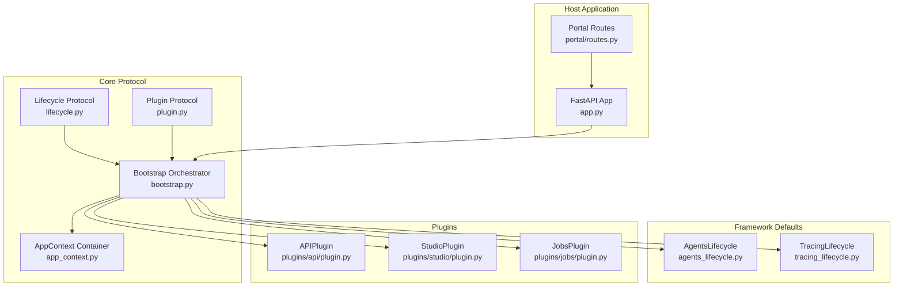
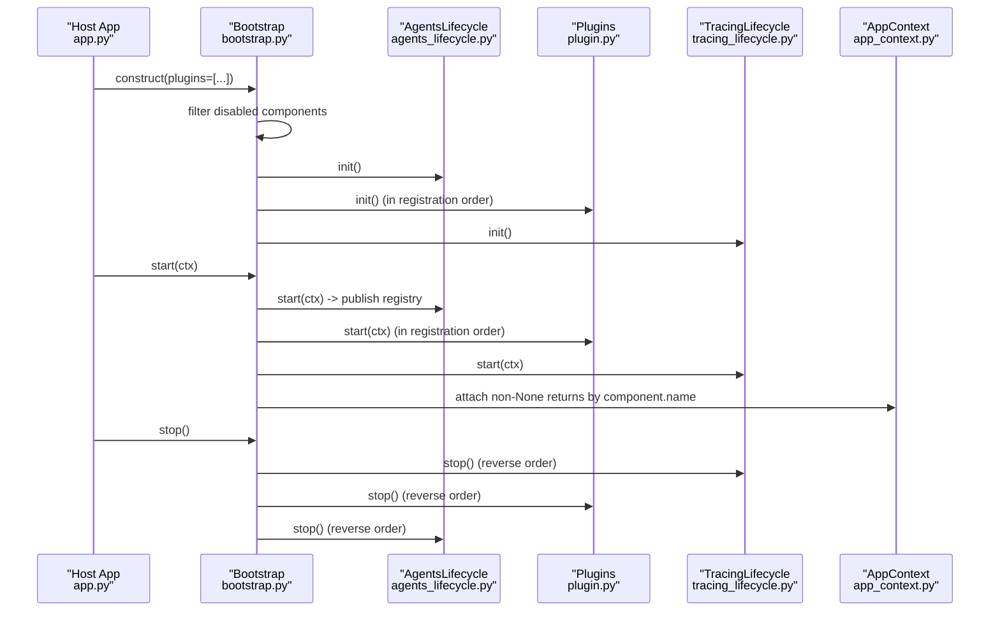
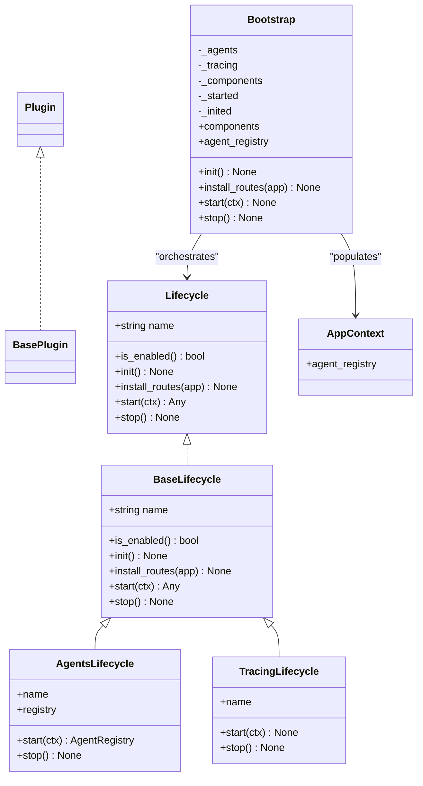
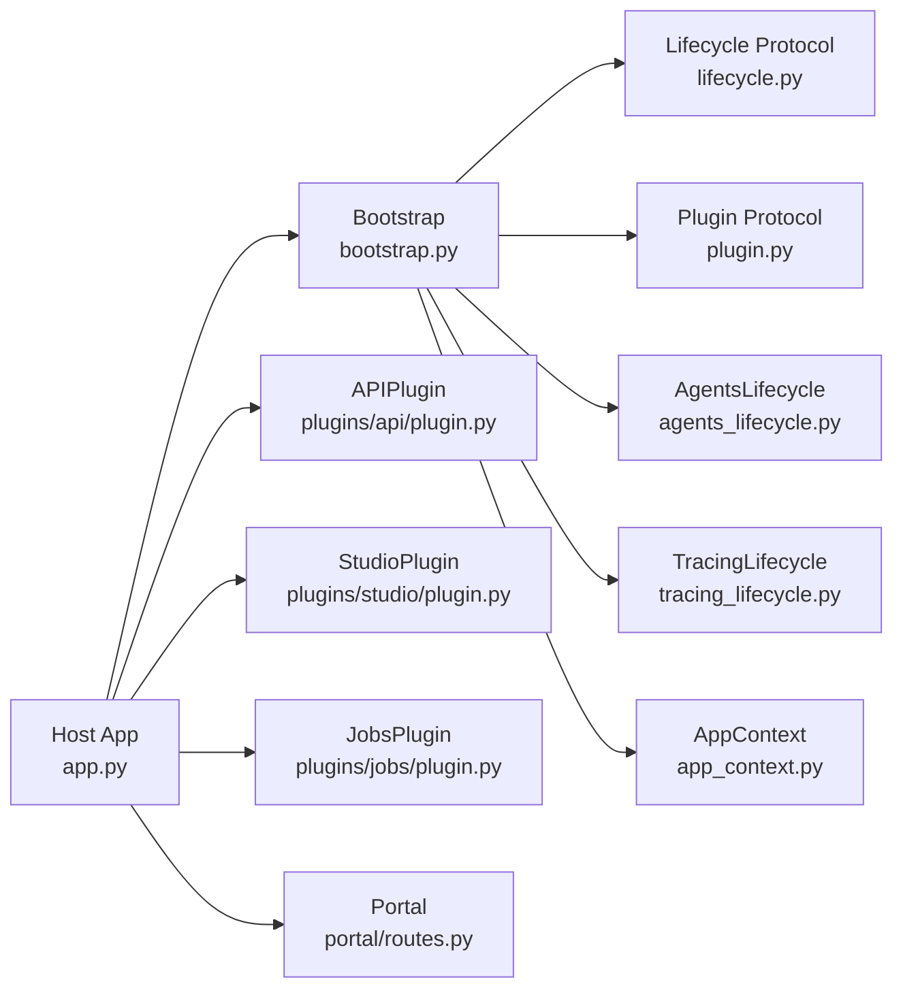

# Bootstrap System

<cite>
**Referenced Files in This Document**
- [bootstrap.py](file://src/ark_agentic/core/protocol/bootstrap.py)
- [lifecycle.py](file://src/ark_agentic/core/protocol/lifecycle.py)
- [plugin.py](file://src/ark_agentic/core/protocol/plugin.py)
- [agents_lifecycle.py](file://src/ark_agentic/core/runtime/agents_lifecycle.py)
- [tracing_lifecycle.py](file://src/ark_agentic/core/observability/tracing_lifecycle.py)
- [app_context.py](file://src/ark_agentic/core/protocol/app_context.py)
- [app.py](file://src/ark_agentic/app.py)
- [plugin.py](file://src/ark_agentic/plugins/api/plugin.py)
- [plugin.py](file://src/ark_agentic/plugins/studio/plugin.py)
- [plugin.py](file://src/ark_agentic/plugins/jobs/plugin.py)
- [routes.py](file://src/ark_agentic/portal/routes.py)
- [test_bootstrap.py](file://tests/unit/test_bootstrap.py)
</cite>

## Table of Contents
1. [Introduction](#introduction)
2. [Project Structure](#project-structure)
3. [Core Components](#core-components)
4. [Architecture Overview](#architecture-overview)
5. [Detailed Component Analysis](#detailed-component-analysis)
6. [Dependency Analysis](#dependency-analysis)
7. [Performance Considerations](#performance-considerations)
8. [Troubleshooting Guide](#troubleshooting-guide)
9. [Conclusion](#conclusion)
10. [Appendices](#appendices)

## Introduction
This document explains the Bootstrap system that orchestrates framework lifecycle components in a stateful, HTTP-agnostic manner. It covers the init/start/stop phases, the automatic loading of mandatory framework defaults (AgentsLifecycle and TracingLifecycle), the placement of user-selected plugins between them, and the lazy import strategy that prevents circular dependencies. Practical guidance is provided for configuring bootstrap, registering components, sharing context across components, ensuring idempotent initialization, performing reverse-order shutdown with robust error handling, and extending the system with custom lifecycle components.

## Project Structure
The Bootstrap system is centered in the core protocol and runtime modules, with concrete lifecycle implementations and optional plugins integrated through a single composition root.



**Diagram sources**
- [bootstrap.py:48-162](file://src/ark_agentic/core/protocol/bootstrap.py#L48-L162)
- [lifecycle.py:23-91](file://src/ark_agentic/core/protocol/lifecycle.py#L23-L91)
- [plugin.py:20-35](file://src/ark_agentic/core/protocol/plugin.py#L20-L35)
- [agents_lifecycle.py:43-80](file://src/ark_agentic/core/runtime/agents_lifecycle.py#L43-L80)
- [tracing_lifecycle.py:21-42](file://src/ark_agentic/core/observability/tracing_lifecycle.py#L21-L42)
- [app_context.py:23-27](file://src/ark_agentic/core/protocol/app_context.py#L23-L27)
- [app.py:35-78](file://src/ark_agentic/app.py#L35-L78)
- [plugin.py:27-87](file://src/ark_agentic/plugins/api/plugin.py#L27-L87)
- [plugin.py:16-32](file://src/ark_agentic/plugins/studio/plugin.py#L16-L32)
- [plugin.py:34-99](file://src/ark_agentic/plugins/jobs/plugin.py#L34-L99)
- [routes.py:19-134](file://src/ark_agentic/portal/routes.py#L19-L134)

**Section sources**
- [bootstrap.py:1-162](file://src/ark_agentic/core/protocol/bootstrap.py#L1-L162)
- [lifecycle.py:1-91](file://src/ark_agentic/core/protocol/lifecycle.py#L1-L91)
- [plugin.py:1-35](file://src/ark_agentic/core/protocol/plugin.py#L1-L35)
- [agents_lifecycle.py:1-80](file://src/ark_agentic/core/runtime/agents_lifecycle.py#L1-L80)
- [tracing_lifecycle.py:1-42](file://src/ark_agentic/core/observability/tracing_lifecycle.py#L1-L42)
- [app_context.py:1-27](file://src/ark_agentic/core/protocol/app_context.py#L1-L27)
- [app.py:1-94](file://src/ark_agentic/app.py#L1-L94)
- [plugin.py:27-87](file://src/ark_agentic/plugins/api/plugin.py#L27-L87)
- [plugin.py:16-32](file://src/ark_agentic/plugins/studio/plugin.py#L16-L32)
- [plugin.py:34-99](file://src/ark_agentic/plugins/jobs/plugin.py#L34-L99)
- [routes.py:19-134](file://src/ark_agentic/portal/routes.py#L19-L134)

## Core Components
- Bootstrap orchestrator: Drives lifecycle components through init/start/stop, enforces ordering, and manages context propagation.
- Lifecycle protocol: Defines the contract for all components, including is_enabled, init, install_routes, start, and stop.
- Plugin protocol: Specialization of Lifecycle for optional, user-selectable features.
- Framework defaults:
  - AgentsLifecycle: Core agent registry orchestration, discovery, warmup, and memory cleanup.
  - TracingLifecycle: OpenTelemetry tracing setup and shutdown.
- AppContext: Typed container for core state and dynamic slots for plugins.

Key characteristics:
- HTTP-agnostic: Bootstrap never imports FastAPI or touches app.state.
- Lazy imports: Default lifecycle classes are imported inside __init__ to avoid circular imports.
- Idempotent init: Safe to call multiple times.
- Reverse-order stop: Ensures dependencies remain available during teardown.
- Context sharing: Non-None start() return values are attached to AppContext by component name.

**Section sources**
- [bootstrap.py:14-32](file://src/ark_agentic/core/protocol/bootstrap.py#L14-L32)
- [bootstrap.py:61-80](file://src/ark_agentic/core/protocol/bootstrap.py#L61-L80)
- [bootstrap.py:115-162](file://src/ark_agentic/core/protocol/bootstrap.py#L115-L162)
- [lifecycle.py:23-91](file://src/ark_agentic/core/protocol/lifecycle.py#L23-L91)
- [plugin.py:20-35](file://src/ark_agentic/core/protocol/plugin.py#L20-L35)
- [agents_lifecycle.py:1-20](file://src/ark_agentic/core/runtime/agents_lifecycle.py#L1-L20)
- [tracing_lifecycle.py:1-7](file://src/ark_agentic/core/observability/tracing_lifecycle.py#L1-L7)
- [app_context.py:23-27](file://src/ark_agentic/core/protocol/app_context.py#L23-L27)

## Architecture Overview
The system composes a fixed list of lifecycle components: mandatory framework defaults (AgentsLifecycle, TracingLifecycle) and optional plugins. The host application builds a Bootstrap with the desired plugins and delegates all lifecycle orchestration to it.



**Diagram sources**
- [app.py:50-78](file://src/ark_agentic/app.py#L50-L78)
- [bootstrap.py:115-162](file://src/ark_agentic/core/protocol/bootstrap.py#L115-L162)
- [agents_lifecycle.py:56-70](file://src/ark_agentic/core/runtime/agents_lifecycle.py#L56-L70)
- [tracing_lifecycle.py:32-41](file://src/ark_agentic/core/observability/tracing_lifecycle.py#L32-L41)
- [plugin.py:27-87](file://src/ark_agentic/plugins/api/plugin.py#L27-L87)

## Detailed Component Analysis

### Bootstrap Orchestrator
Responsibilities:
- Construct with user plugins; automatically include mandatory defaults.
- Filter disabled components via is_enabled().
- Run init() once (idempotent), then start() in registration order, attaching non-None returns to AppContext.
- Stop() in reverse order; catch and log errors per component to avoid blocking others.
- install_routes(app) invoked at module-load time for HTTP components.

Ordering guarantees:
- AgentsLifecycle is first.
- Plugins are placed in the order provided by the host.
- TracingLifecycle is last.

Lazy import strategy:
- Default lifecycle classes are imported inside __init__ to avoid circular imports caused by transitive imports from runtime/observability.

Idempotency and context:
- init() is idempotent; subsequent calls are no-ops.
- start() ensures init() runs first; then attaches each component’s returned value to ctx.component.name.
- Name collisions are detected and reported immediately.

Reverse-order shutdown:
- Components are tracked in start() order; stop() pops from the end to tear down in reverse.

Error handling during teardown:
- Each stop() is wrapped in try/except; failures are logged but do not block other components.

Practical examples:
- Building a Bootstrap with plugins and installing routes before lifespan starts.
- Using agent_registry to seed agents before start().

**Section sources**
- [bootstrap.py:48-162](file://src/ark_agentic/core/protocol/bootstrap.py#L48-L162)
- [app.py:50-78](file://src/ark_agentic/app.py#L50-L78)
- [test_bootstrap.py:199-235](file://tests/unit/test_bootstrap.py#L199-L235)

### Lifecycle Protocol
Contract:
- name: Identifier used for AppContext field names and logging.
- is_enabled(): Environment-driven gating; disabled components are skipped.
- init(): One-time idempotent setup.
- install_routes(app): HTTP mount hook executed at module-load time.
- start(ctx): Build runtime context and background tasks; return non-None value to be attached to ctx.name.
- stop(): Release resources; called in reverse start order.

BaseLifecycle provides no-op defaults; subclasses override only needed phases.

**Section sources**
- [lifecycle.py:23-91](file://src/ark_agentic/core/protocol/lifecycle.py#L23-L91)

### Plugin Protocol
- Plugin is structurally identical to Lifecycle but semantically represents optional, user-selectable features.
- Bootstrap accepts a list[Lifecycle] of plugins; core defaults are added automatically.
- BasePlugin is a convenience alias with the same structure.

Examples:
- APIPlugin: Optional HTTP transport with CORS, health endpoint, and static assets.
- StudioPlugin: Optional admin console with schema init and route mounting.
- JobsPlugin: Optional proactive job manager requiring NotificationsPlugin and reading env settings.

**Section sources**
- [plugin.py:20-35](file://src/ark_agentic/core/protocol/plugin.py#L20-L35)
- [plugin.py:27-87](file://src/ark_agentic/plugins/api/plugin.py#L27-L87)
- [plugin.py:16-32](file://src/ark_agentic/plugins/studio/plugin.py#L16-L32)
- [plugin.py:34-99](file://src/ark_agentic/plugins/jobs/plugin.py#L34-L99)

### AgentsLifecycle (Framework Default)
- Purpose: Core agent registry orchestration.
- init: No-op.
- start: Discovers agents from filesystem roots, warms them up, and publishes the registry as ctx.agent_registry.
- stop: Closes agent memory backends.

Integration:
- Always first in the component list.
- APIPlugin reads ctx.agent_registry in start() after AgentsLifecycle completes.

**Section sources**
- [agents_lifecycle.py:1-20](file://src/ark_agentic/core/runtime/agents_lifecycle.py#L1-L20)
- [agents_lifecycle.py:56-80](file://src/ark_agentic/core/runtime/agents_lifecycle.py#L56-L80)
- [plugin.py:35-41](file://src/ark_agentic/plugins/api/plugin.py#L35-L41)

### TracingLifecycle (Framework Default)
- Purpose: OpenTelemetry tracing setup and shutdown.
- start: Initializes tracing provider from environment.
- stop: Shuts down tracing provider.

Integration:
- Always last in the component list.
- Provides no AppContext value.

**Section sources**
- [tracing_lifecycle.py:1-7](file://src/ark_agentic/core/observability/tracing_lifecycle.py#L1-L7)
- [tracing_lifecycle.py:32-42](file://src/ark_agentic/core/observability/tracing_lifecycle.py#L32-L42)

### AppContext Container
- Typed slots for core components (e.g., agent_registry).
- Dynamic slots for plugins (retrieved via getattr(name, None) when optional).
- Bootstrap sets attributes by component.name for non-None start() returns.

**Section sources**
- [app_context.py:23-27](file://src/ark_agentic/core/protocol/app_context.py#L23-L27)
- [bootstrap.py:142-151](file://src/ark_agentic/core/protocol/bootstrap.py#L142-L151)

### HTTP Integration and Routing
- install_routes(app) is called at module-load time (before lifespan) to mount HTTP components.
- APIPlugin installs CORS, middleware, routers, health endpoint, and static assets.
- Portal registers landing and wiki endpoints; it is ordered before APIPlugin so its "/" takes precedence.

**Section sources**
- [bootstrap.py:124-132](file://src/ark_agentic/core/protocol/bootstrap.py#L124-L132)
- [plugin.py:42-87](file://src/ark_agentic/plugins/api/plugin.py#L42-L87)
- [routes.py:19-134](file://src/ark_agentic/portal/routes.py#L19-L134)
- [app.py:50-57](file://src/ark_agentic/app.py#L50-L57)

## Architecture Overview



**Diagram sources**
- [lifecycle.py:23-91](file://src/ark_agentic/core/protocol/lifecycle.py#L23-L91)
- [plugin.py:20-35](file://src/ark_agentic/core/protocol/plugin.py#L20-L35)
- [bootstrap.py:48-162](file://src/ark_agentic/core/protocol/bootstrap.py#L48-L162)
- [agents_lifecycle.py:43-80](file://src/ark_agentic/core/runtime/agents_lifecycle.py#L43-L80)
- [tracing_lifecycle.py:21-42](file://src/ark_agentic/core/observability/tracing_lifecycle.py#L21-L42)
- [app_context.py:23-27](file://src/ark_agentic/core/protocol/app_context.py#L23-L27)

## Detailed Component Analysis

### Stateful Orchestrator Pattern
Bootstrap maintains internal state:
- Enabled components list in registration order.
- Started components list for reverse-order teardown.
- Initialization flag to ensure idempotency.

Processing logic:
- init(): Iterates components in order and calls init(); idempotent.
- start(ctx): Ensures init ran, then iterates components in order, calls start(ctx), attaches non-None returns to ctx by component.name, and records started components.
- stop(): Pops from started list and calls stop() with per-component try/except.

```mermaid
flowchart TD
Start([Bootstrap.start(ctx)]) --> EnsureInit["Ensure init() already run"]
EnsureInit --> LoopStart["Iterate components in order"]
LoopStart --> CallStart["Call start(ctx)"]
CallStart --> HasValue{"Return value is not None?"}
HasValue --> |Yes| Attach["Attach to ctx.name"]
HasValue --> |No| Skip["Skip attachment"]
Attach --> Record["Record as started"]
Skip --> Record
Record --> Next{"More components?"}
Next --> |Yes| LoopStart
Next --> |No| DoneStart([Done])
subgraph "Bootstrap.stop()"
Pop(["Pop last started component"]) --> TryStop["Try stop()"]
TryStop --> LogErr["Log exception if any"]
LogErr --> More{"Started list empty?"}
More --> |No| Pop
More --> |Yes| EndStop([Done])
end
```

**Diagram sources**
- [bootstrap.py:115-162](file://src/ark_agentic/core/protocol/bootstrap.py#L115-L162)

**Section sources**
- [bootstrap.py:115-162](file://src/ark_agentic/core/protocol/bootstrap.py#L115-L162)
- [test_bootstrap.py:83-113](file://tests/unit/test_bootstrap.py#L83-L113)
- [test_bootstrap.py:140-159](file://tests/unit/test_bootstrap.py#L140-L159)

### Automatic Loading of Framework Defaults
Bootstrap constructs the component list by combining:
- Mandatory AgentsLifecycle (first)
- User plugins (middle)
- Mandatory TracingLifecycle (last)

This ensures:
- AgentsLifecycle always discovers and warms agents.
- TracingLifecycle always pairs setup/shutdown.
- Plugins are sandwiched between defaults.

**Section sources**
- [bootstrap.py:70-78](file://src/ark_agentic/core/protocol/bootstrap.py#L70-L78)
- [test_bootstrap.py:199-217](file://tests/unit/test_bootstrap.py#L199-L217)

### HTTP-Agnostic Design and Lazy Import Strategy
- Bootstrap is HTTP-agnostic: no FastAPI imports, no app.state manipulation.
- Lazy imports: Default lifecycle classes are imported inside __init__ to avoid cycles caused by transitive imports from runtime/observability.
- install_routes(app) is called at module-load time, before lifespan starts, enabling HTTP components to mount routes safely.

**Section sources**
- [bootstrap.py:1-12](file://src/ark_agentic/core/protocol/bootstrap.py#L1-L12)
- [bootstrap.py:65-67](file://src/ark_agentic/core/protocol/bootstrap.py#L65-L67)
- [app.py:77-77](file://src/ark_agentic/app.py#L77-L77)

### Context Sharing Between Components
- Components can publish state by returning a non-None value from start(ctx).
- Bootstrap attaches it to ctx.component.name.
- Consumers retrieve it via typed slots (core) or getattr(name, None) (plugins).
- Example: APIPlugin depends on ctx.agent_registry published by AgentsLifecycle.

**Section sources**
- [bootstrap.py:142-151](file://src/ark_agentic/core/protocol/bootstrap.py#L142-L151)
- [plugin.py:35-41](file://src/ark_agentic/plugins/api/plugin.py#L35-L41)
- [app_context.py:23-27](file://src/ark_agentic/core/protocol/app_context.py#L23-L27)

### Idempotent Initialization and Reverse-Order Shutdown
- init() checks an internal flag and runs once; subsequent calls are no-ops.
- start() calls init() first if needed.
- stop() tears down in reverse order of start() to preserve dependencies.
- Per-component try/except prevents a failing stop from blocking others.

**Section sources**
- [bootstrap.py:115-162](file://src/ark_agentic/core/protocol/bootstrap.py#L115-L162)
- [test_bootstrap.py:115-138](file://tests/unit/test_bootstrap.py#L115-L138)
- [test_bootstrap.py:100-113](file://tests/unit/test_bootstrap.py#L100-L113)
- [test_bootstrap.py:140-159](file://tests/unit/test_bootstrap.py#L140-L159)

### Error Handling During Teardown
- Each component’s stop() is wrapped in try/except.
- Exceptions are logged; teardown continues for remaining components.

**Section sources**
- [bootstrap.py:153-162](file://src/ark_agentic/core/protocol/bootstrap.py#L153-L162)

### Extending the Bootstrap System
To add a custom lifecycle component:
- Implement a class inheriting from BaseLifecycle (or define a compatible Protocol).
- Set name to a non-empty string.
- Override is_enabled(), init(), install_routes(app), start(ctx), and/or stop() as needed.
- Optionally, implement a Plugin subclass if the feature is optional and user-selectable.
- Register the component in the host’s plugin list; it will be placed between the framework defaults.

Guidance:
- Keep install_routes idempotent and safe to call at module-load time.
- Return non-None values from start(ctx) only when other components need them; Bootstrap will attach them to ctx by name.
- Ensure stop() releases resources cleanly; rely on reverse-order teardown semantics.

**Section sources**
- [lifecycle.py:68-91](file://src/ark_agentic/core/protocol/lifecycle.py#L68-L91)
- [plugin.py:30-35](file://src/ark_agentic/core/protocol/plugin.py#L30-L35)
- [bootstrap.py:124-132](file://src/ark_agentic/core/protocol/bootstrap.py#L124-L132)

## Dependency Analysis



**Diagram sources**
- [bootstrap.py:48-162](file://src/ark_agentic/core/protocol/bootstrap.py#L48-L162)
- [lifecycle.py:23-91](file://src/ark_agentic/core/protocol/lifecycle.py#L23-L91)
- [plugin.py:20-35](file://src/ark_agentic/core/protocol/plugin.py#L20-L35)
- [agents_lifecycle.py:43-80](file://src/ark_agentic/core/runtime/agents_lifecycle.py#L43-L80)
- [tracing_lifecycle.py:21-42](file://src/ark_agentic/core/observability/tracing_lifecycle.py#L21-L42)
- [app_context.py:23-27](file://src/ark_agentic/core/protocol/app_context.py#L23-L27)
- [app.py:35-78](file://src/ark_agentic/app.py#L35-L78)
- [plugin.py:27-87](file://src/ark_agentic/plugins/api/plugin.py#L27-L87)
- [plugin.py:16-32](file://src/ark_agentic/plugins/studio/plugin.py#L16-L32)
- [plugin.py:34-99](file://src/ark_agentic/plugins/jobs/plugin.py#L34-L99)
- [routes.py:19-134](file://src/ark_agentic/portal/routes.py#L19-L134)

**Section sources**
- [bootstrap.py:48-162](file://src/ark_agentic/core/protocol/bootstrap.py#L48-L162)
- [app.py:50-78](file://src/ark_agentic/app.py#L50-L78)

## Performance Considerations
- Idempotent init reduces redundant work across restarts.
- Reverse-order stop minimizes resource contention during teardown.
- Lazy imports reduce startup overhead by deferring heavy imports until needed.
- Context attachment avoids repeated lookups and enables efficient inter-component communication.

## Troubleshooting Guide
Common issues and resolutions:
- Name collision on AppContext: Two components publishing the same ctx slot cause an immediate error during start(). Ensure unique component names.
- Missing dependencies: Some plugins require other plugins to be enabled and registered earlier (e.g., JobsPlugin requires NotificationsPlugin). Verify plugin ordering.
- Disabled components: is_enabled() gates components; confirm environment flags if a component seems missing.
- Teardown failures: Bootstrap logs per-component stop() exceptions but continues. Investigate logs for failing components.

Validation references:
- Name collision detection and error message.
- Disabled component skipping behavior.
- Reverse-order stop execution.
- Idempotent init behavior.

**Section sources**
- [test_bootstrap.py:181-194](file://tests/unit/test_bootstrap.py#L181-L194)
- [test_bootstrap.py:161-179](file://tests/unit/test_bootstrap.py#L161-L179)
- [test_bootstrap.py:100-113](file://tests/unit/test_bootstrap.py#L100-L113)
- [test_bootstrap.py:115-123](file://tests/unit/test_bootstrap.py#L115-L123)
- [plugin.py:52-56](file://src/ark_agentic/plugins/jobs/plugin.py#L52-L56)

## Conclusion
The Bootstrap system provides a robust, HTTP-agnostic lifecycle orchestration layer. Its stateful orchestrator pattern ensures deterministic init/start/stop phases, predictable ordering of mandatory defaults and optional plugins, and safe context sharing. The lazy import strategy prevents circular dependencies, while idempotent initialization and reverse-order shutdown with per-component error handling deliver reliability. Extensibility is straightforward: implement BaseLifecycle or Plugin and integrate via the host’s Bootstrap configuration.

## Appendices

### Practical Examples

- Bootstrap configuration and component registration order:
  - Define plugins list in the host application and pass to Bootstrap.
  - Place components so dependencies precede dependents (e.g., NotificationsPlugin before JobsPlugin).
  - Ensure Portal precedes APIPlugin to control the "/" route.

- Context sharing between components:
  - AgentsLifecycle publishes ctx.agent_registry.
  - APIPlugin reads ctx.agent_registry in start() to wire dependencies.
  - JobsPlugin publishes ctx.jobs with a typed context object.

- Idempotent initialization and reverse-order shutdown:
  - init() runs once; start() ensures init() runs first.
  - stop() tears down components in reverse order; failures are logged but do not block others.

- Extending the system:
  - Implement a new Lifecycle or Plugin subclass.
  - Provide is_enabled(), init(), install_routes(app), start(ctx), and stop() as needed.
  - Register the component in the host’s plugin list.

**Section sources**
- [app.py:50-57](file://src/ark_agentic/app.py#L50-L57)
- [plugin.py:35-41](file://src/ark_agentic/plugins/api/plugin.py#L35-L41)
- [plugin.py:51-92](file://src/ark_agentic/plugins/jobs/plugin.py#L51-L92)
- [bootstrap.py:115-162](file://src/ark_agentic/core/protocol/bootstrap.py#L115-L162)