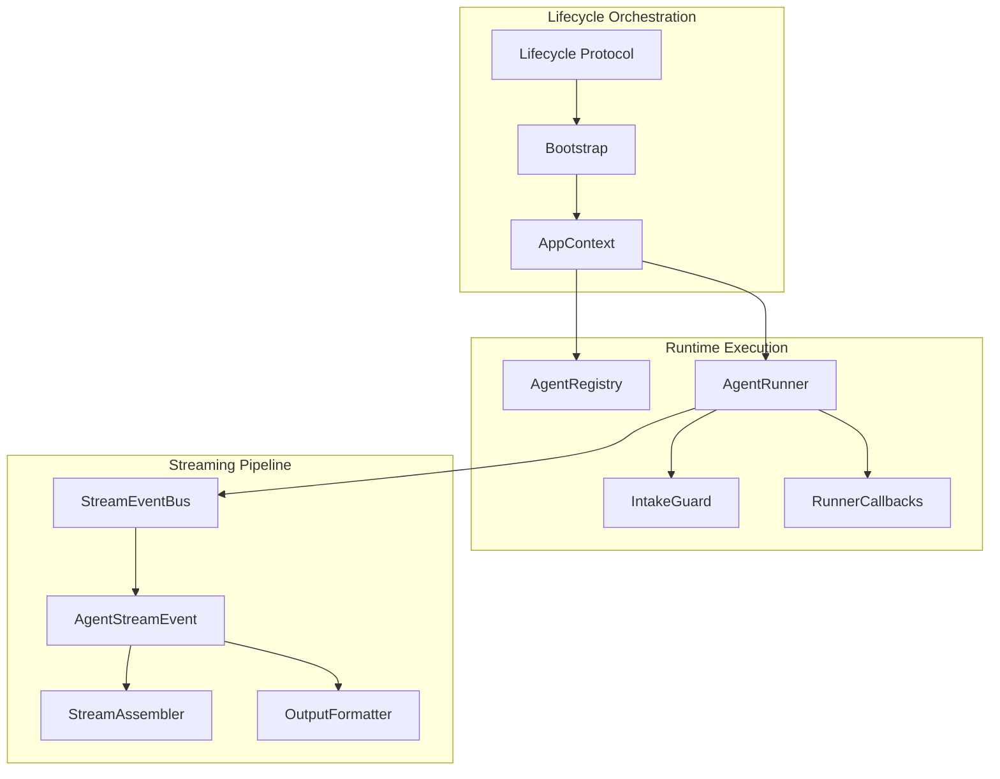
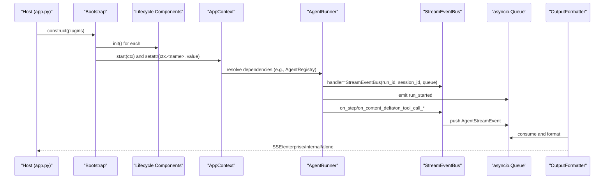
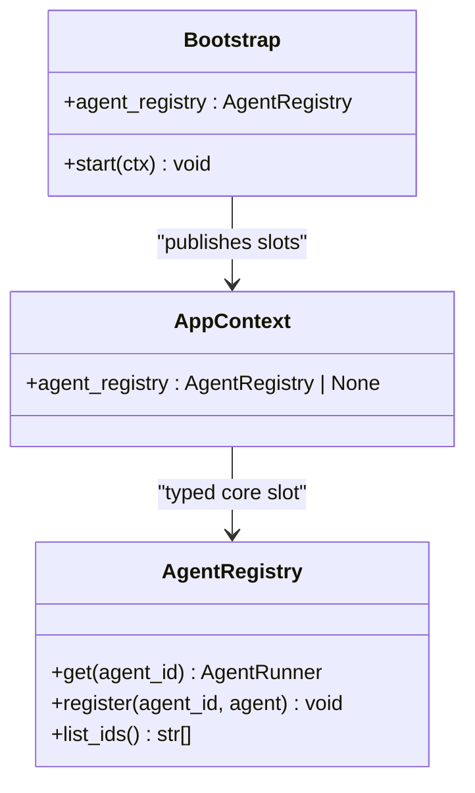
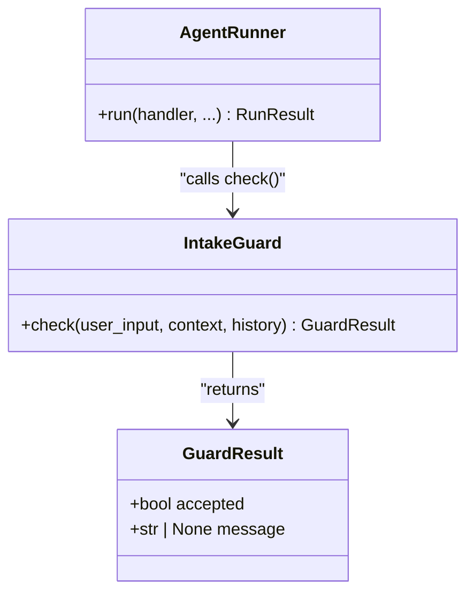
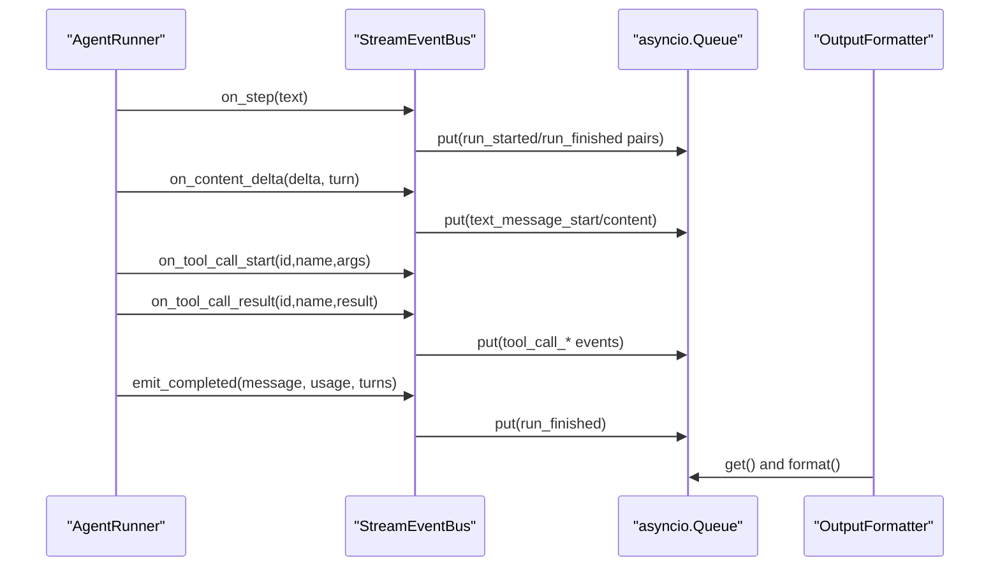
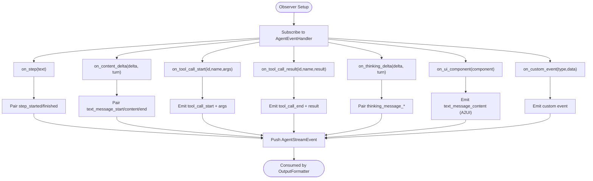
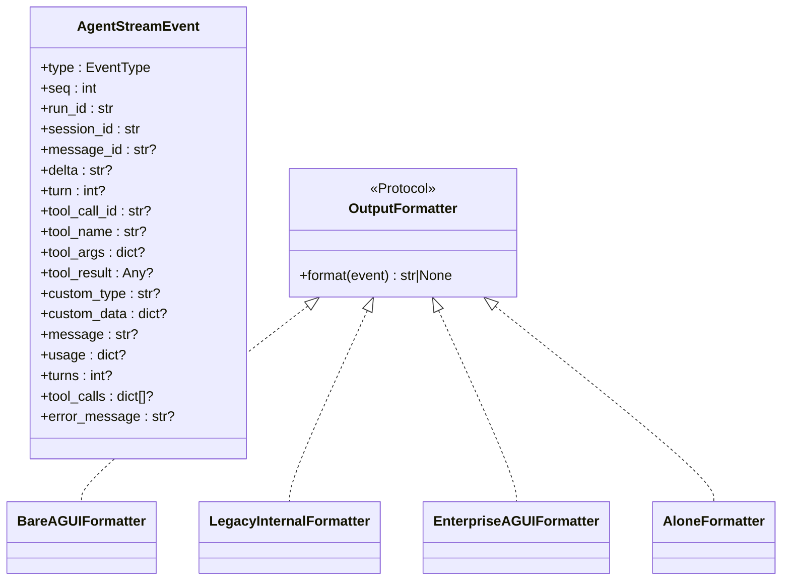
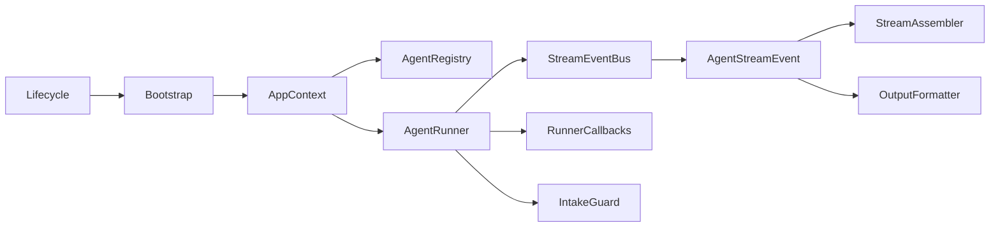

# Component Interactions and Communication

<cite>
**Referenced Files in This Document**
- [app_context.py](file://src/ark_agentic/core/protocol/app_context.py)
- [lifecycle.py](file://src/ark_agentic/core/protocol/lifecycle.py)
- [bootstrap.py](file://src/ark_agentic/core/protocol/bootstrap.py)
- [guard.py](file://src/ark_agentic/core/runtimes/guard.py)
- [registry.py](file://src/ark_agentic/core/runtime/registry.py)
- [runner.py](file://src/ark_agentic/core/runtime/runner.py)
- [callbacks.py](file://src/ark_agentic/core/runtime/callbacks.py)
- [event_bus.py](file://src/ark_agentic/core/stream/event_bus.py)
- [events.py](file://src/ark_agentic/core/stream/events.py)
- [assembler.py](file://src/ark_agentic/core/stream/assembler.py)
- [output_formatter.py](file://src/ark_agentic/core/stream/output_formatter.py)
- [decorators.py](file://src/ark_agentic/core/observability/decorators.py)
- [types.py](file://src/ark_agentic/core/types.py)
</cite>

## Table of Contents
1. [Introduction](#introduction)
2. [Project Structure](#project-structure)
3. [Core Components](#core-components)
4. [Architecture Overview](#architecture-overview)
5. [Detailed Component Analysis](#detailed-component-analysis)
6. [Dependency Analysis](#dependency-analysis)
7. [Performance Considerations](#performance-considerations)
8. [Troubleshooting Guide](#troubleshooting-guide)
9. [Conclusion](#conclusion)

## Introduction
This document explains the framework’s internal messaging and coordination systems with a focus on:
- AppContext pattern for shared state management across lifecycle components
- Guard system for component validation and access control
- Event bus for asynchronous communication between components
- Observer pattern implementation for event-driven streaming
- Message passing protocols and inter-component dependency management
- Practical examples of component collaboration, error propagation, and state synchronization
- Performance considerations for high-frequency component interactions

## Project Structure
The messaging and coordination subsystems are centered around three pillars:
- Lifecycle orchestration and shared context (Bootstrap, Lifecycle, AppContext)
- Runtime execution and validation (Runner, Guard, Callbacks, Registry)
- Streaming pipeline (Event Bus, Events, Assembler, Output Formatter)

**Diagram sources**
- [lifecycle.py:23-91](file://src/ark_agentic/core/protocol/lifecycle.py#L23-L91)
- [bootstrap.py:48-162](file://src/ark_agentic/core/protocol/bootstrap.py#L48-L162)
- [app_context.py:23-27](file://src/ark_agentic/core/protocol/app_context.py#L23-L27)
- [registry.py:13-29](file://src/ark_agentic/core/runtime/registry.py#L13-L29)
- [runner.py:171-200](file://src/ark_agentic/core/runtime/runner.py#L171-L200)
- [callbacks.py:98-200](file://src/ark_agentic/core/runtime/callbacks.py#L98-L200)
- [guard.py:25-34](file://src/ark_agentic/core/runtimes/guard.py#L25-L34)
- [event_bus.py:67-248](file://src/ark_agentic/core/stream/event_bus.py#L67-L248)
- [events.py:67-116](file://src/ark_agentic/core/stream/events.py#L67-L116)
- [assembler.py:79-270](file://src/ark_agentic/core/stream/assembler.py#L79-L270)
- [output_formatter.py:48-444](file://src/ark_agentic/core/stream/output_formatter.py#L48-L444)

**Section sources**
- [lifecycle.py:1-91](file://src/ark_agentic/core/protocol/lifecycle.py#L1-L91)
- [bootstrap.py:1-162](file://src/ark_agentic/core/protocol/bootstrap.py#L1-L162)
- [app_context.py:1-27](file://src/ark_agentic/core/protocol/app_context.py#L1-L27)
- [registry.py:1-29](file://src/ark_agentic/core/runtime/registry.py#L1-L29)
- [runner.py:1-200](file://src/ark_agentic/core/runtime/runner.py#L1-L200)
- [callbacks.py:1-200](file://src/ark_agentic/core/runtime/callbacks.py#L1-L200)
- [guard.py:1-34](file://src/ark_agentic/core/runtimes/guard.py#L1-L34)
- [event_bus.py:1-248](file://src/ark_agentic/core/stream/event_bus.py#L1-L248)
- [events.py:1-116](file://src/ark_agentic/core/stream/events.py#L1-L116)
- [assembler.py:1-398](file://src/ark_agentic/core/stream/assembler.py#L1-L398)
- [output_formatter.py:1-444](file://src/ark_agentic/core/stream/output_formatter.py#L1-L444)

## Core Components
- AppContext: Typed runtime container for core capabilities; dynamic slots for optional plugins. Populated by Bootstrap during start phase.
- Lifecycle: Uniform contract for orchestrated components (init/start/stop), separating core capabilities from optional plugins.
- Bootstrap: Drives lifecycle components, initializes state, publishes context slots, and manages startup/shutdown order.
- AgentRegistry: Central registry for AgentRunner instances, shared across API and Studio.
- AgentRunner: Executes ReAct loops, emits callbacks, integrates observability spans, and coordinates tools and skills.
- RunnerCallbacks: Typed callback hooks covering agent-level and loop-level phases, enabling interception and mutation of execution.
- IntakeGuard: Protocol for pre-entry validation and access control prior to entering the ReAct loop.
- StreamEventBus: Implements AgentEventHandler to translate runner signals into AG-UI native events and push them onto an asyncio queue.
- AgentStreamEvent: Pydantic model representing AG-UI event types and fields, standardized across transports.
- StreamAssembler: Assembles LLM streaming chunks into structured AgentMessage, tool calls, and usage metrics.
- OutputFormatter: Adapts AgentStreamEvent to multiple transport protocols (AG-UI bare, enterprise envelope, legacy internal, ALONE).
- Observability decorators: Wrap runner phases with OpenTelemetry spans and attributes, capturing inputs, outputs, and errors.

**Section sources**
- [app_context.py:23-27](file://src/ark_agentic/core/protocol/app_context.py#L23-L27)
- [lifecycle.py:23-91](file://src/ark_agentic/core/protocol/lifecycle.py#L23-L91)
- [bootstrap.py:48-162](file://src/ark_agentic/core/protocol/bootstrap.py#L48-L162)
- [registry.py:13-29](file://src/ark_agentic/core/runtime/registry.py#L13-L29)
- [runner.py:171-200](file://src/ark_agentic/core/runtime/runner.py#L171-L200)
- [callbacks.py:98-200](file://src/ark_agentic/core/runtime/callbacks.py#L98-L200)
- [guard.py:25-34](file://src/ark_agentic/core/runtimes/guard.py#L25-L34)
- [event_bus.py:67-248](file://src/ark_agentic/core/stream/event_bus.py#L67-L248)
- [events.py:67-116](file://src/ark_agentic/core/stream/events.py#L67-L116)
- [assembler.py:79-270](file://src/ark_agentic/core/stream/assembler.py#L79-L270)
- [output_formatter.py:48-444](file://src/ark_agentic/core/stream/output_formatter.py#L48-L444)
- [decorators.py:79-152](file://src/ark_agentic/core/observability/decorators.py#L79-L152)

## Architecture Overview
The framework composes lifecycle components into a coherent runtime. Bootstrap initializes and starts components, publishing non-None returns into AppContext. AgentRunner depends on AppContext for shared services (e.g., AgentRegistry). The streaming pipeline converts internal runner callbacks into AG-UI events, which are formatted for various transports.

**Diagram sources**
- [bootstrap.py:134-162](file://src/ark_agentic/core/protocol/bootstrap.py#L134-L162)
- [app_context.py:23-27](file://src/ark_agentic/core/protocol/app_context.py#L23-L27)
- [runner.py:171-200](file://src/ark_agentic/core/runtime/runner.py#L171-L200)
- [event_bus.py:67-116](file://src/ark_agentic/core/stream/event_bus.py#L67-L116)
- [events.py:67-116](file://src/ark_agentic/core/stream/events.py#L67-L116)
- [output_formatter.py:48-150](file://src/ark_agentic/core/stream/output_formatter.py#L48-L150)

## Detailed Component Analysis

### AppContext Pattern for Shared State Management
- Purpose: Provide a typed, discoverable container for runtime capabilities published by lifecycle components.
- Behavior: Bootstrap.start() assigns non-None values returned by start(ctx) to ctx.<name>. Consumers retrieve attributes by name, defensively checking for optional plugins.
- Core slot example: agent_registry is typed; optional plugins publish dynamic slots via getattr(ctx, "<name>", None).

**Diagram sources**
- [app_context.py:23-27](file://src/ark_agentic/core/protocol/app_context.py#L23-L27)
- [bootstrap.py:101-114](file://src/ark_agentic/core/protocol/bootstrap.py#L101-L114)
- [registry.py:13-29](file://src/ark_agentic/core/runtime/registry.py#L13-L29)

**Section sources**
- [app_context.py:1-27](file://src/ark_agentic/core/protocol/app_context.py#L1-L27)
- [bootstrap.py:134-162](file://src/ark_agentic/core/protocol/bootstrap.py#L134-L162)
- [registry.py:13-29](file://src/ark_agentic/core/runtime/registry.py#L13-L29)

### Guard System for Validation and Access Control
- IntakeGuard protocol defines a check method that validates user input against agent capabilities and context/history.
- GuardResult encapsulates acceptance and optional message for downstream use.
- This enables pre-execution validation and access control before entering the ReAct loop.

**Diagram sources**
- [guard.py:25-34](file://src/ark_agentic/core/runtimes/guard.py#L25-L34)
- [guard.py:18-23](file://src/ark_agentic/core/runtimes/guard.py#L18-L23)
- [runner.py:171-200](file://src/ark_agentic/core/runtime/runner.py#L171-L200)

**Section sources**
- [guard.py:1-34](file://src/ark_agentic/core/runtimes/guard.py#L1-L34)
- [runner.py:171-200](file://src/ark_agentic/core/runtime/runner.py#L171-L200)

### Event Bus for Asynchronous Communication
- StreamEventBus implements AgentEventHandler and translates runner callbacks into AG-UI native AgentStreamEvent objects.
- Maintains internal state to pair start/finish events (step, text, thinking) and ensures proper closure on run completion/failure.
- Emits lifecycle events (run_started, run_finished, run_error) and exposes convenience methods for producers.

**Diagram sources**
- [event_bus.py:67-248](file://src/ark_agentic/core/stream/event_bus.py#L67-L248)
- [events.py:67-116](file://src/ark_agentic/core/stream/events.py#L67-L116)
- [output_formatter.py:48-150](file://src/ark_agentic/core/stream/output_formatter.py#L48-L150)

**Section sources**
- [event_bus.py:1-248](file://src/ark_agentic/core/stream/event_bus.py#L1-L248)
- [events.py:1-116](file://src/ark_agentic/core/stream/events.py#L1-L116)
- [output_formatter.py:1-444](file://src/ark_agentic/core/stream/output_formatter.py#L1-L444)

### Observer Pattern Implementation for Event-Driven Streaming
- AgentEventHandler defines observer methods for step, content deltas, tool calls, thinking, UI components, and custom events.
- StreamEventBus fulfills the observer contract and maintains state to ensure event pairing and termination semantics.
- StreamAssembler acts as a consumer of a normalized event stream, assembling content, tool calls, and usage into a structured AgentMessage.

**Diagram sources**
- [event_bus.py:28-62](file://src/ark_agentic/core/stream/event_bus.py#L28-L62)
- [event_bus.py:146-215](file://src/ark_agentic/core/stream/event_bus.py#L146-L215)
- [assembler.py:79-270](file://src/ark_agentic/core/stream/assembler.py#L79-L270)

**Section sources**
- [event_bus.py:28-62](file://src/ark_agentic/core/stream/event_bus.py#L28-L62)
- [assembler.py:79-270](file://src/ark_agentic/core/stream/assembler.py#L79-L270)

### Message Passing Protocols and Inter-Component Dependency Management
- AgentStreamEvent standardizes event types and fields across transports.
- OutputFormatter adapts events to multiple protocols (AG-UI bare, enterprise envelope, legacy internal, ALONE), enabling flexible client integrations.
- Types define tool events and results, including ToolCall, AgentToolResult, and ToolEvent variants for UI components and custom events.

**Diagram sources**
- [events.py:67-116](file://src/ark_agentic/core/stream/events.py#L67-L116)
- [output_formatter.py:48-444](file://src/ark_agentic/core/stream/output_formatter.py#L48-L444)

**Section sources**
- [events.py:1-116](file://src/ark_agentic/core/stream/events.py#L1-L116)
- [output_formatter.py:1-444](file://src/ark_agentic/core/stream/output_formatter.py#L1-L444)
- [types.py:46-126](file://src/ark_agentic/core/types.py#L46-L126)

### Practical Examples of Component Collaboration
- Component collaboration example: Bootstrap.start() publishes AgentRegistry into AppContext; AgentRunner retrieves it to resolve agent instances; StreamEventBus pushes events to an asyncio queue consumed by OutputFormatter.
- Error propagation example: StreamEventBus.emit_failed() closes active steps and text/thinking messages, emitting run_error; OutputFormatter formats the terminal event consistently across protocols.
- State synchronization example: StreamAssembler accumulates content, thinking, and tool calls; builds AgentMessage with usage; OutputFormatter can emit enterprise reasoning_start/reasoning_end around thinking content.

**Section sources**
- [bootstrap.py:134-162](file://src/ark_agentic/core/protocol/bootstrap.py#L134-L162)
- [app_context.py:23-27](file://src/ark_agentic/core/protocol/app_context.py#L23-L27)
- [registry.py:13-29](file://src/ark_agentic/core/runtime/registry.py#L13-L29)
- [runner.py:171-200](file://src/ark_agentic/core/runtime/runner.py#L171-L200)
- [event_bus.py:242-248](file://src/ark_agentic/core/stream/event_bus.py#L242-L248)
- [assembler.py:226-270](file://src/ark_agentic/core/stream/assembler.py#L226-L270)
- [output_formatter.py:155-292](file://src/ark_agentic/core/stream/output_formatter.py#L155-L292)

## Dependency Analysis
- Lifecycle and Bootstrap decouple core capabilities from optional plugins, ensuring a uniform orchestration contract.
- AppContext centralizes shared services (e.g., AgentRegistry) for consumers.
- AgentRunner depends on AppContext for services and on StreamEventBus for event emission.
- StreamEventBus depends on AgentStreamEvent and uses asyncio.Queue for asynchronous delivery.
- OutputFormatter depends on AgentStreamEvent and provides multiple protocol adapters.

**Diagram sources**
- [lifecycle.py:23-91](file://src/ark_agentic/core/protocol/lifecycle.py#L23-L91)
- [bootstrap.py:48-162](file://src/ark_agentic/core/protocol/bootstrap.py#L48-L162)
- [app_context.py:23-27](file://src/ark_agentic/core/protocol/app_context.py#L23-L27)
- [registry.py:13-29](file://src/ark_agentic/core/runtime/registry.py#L13-L29)
- [runner.py:171-200](file://src/ark_agentic/core/runtime/runner.py#L171-L200)
- [callbacks.py:98-200](file://src/ark_agentic/core/runtime/callbacks.py#L98-L200)
- [guard.py:25-34](file://src/ark_agentic/core/runtimes/guard.py#L25-L34)
- [event_bus.py:67-116](file://src/ark_agentic/core/stream/event_bus.py#L67-L116)
- [events.py:67-116](file://src/ark_agentic/core/stream/events.py#L67-L116)
- [assembler.py:79-120](file://src/ark_agentic/core/stream/assembler.py#L79-L120)
- [output_formatter.py:48-150](file://src/ark_agentic/core/stream/output_formatter.py#L48-L150)

**Section sources**
- [lifecycle.py:1-91](file://src/ark_agentic/core/protocol/lifecycle.py#L1-L91)
- [bootstrap.py:1-162](file://src/ark_agentic/core/protocol/bootstrap.py#L1-L162)
- [app_context.py:1-27](file://src/ark_agentic/core/protocol/app_context.py#L1-L27)
- [registry.py:1-29](file://src/ark_agentic/core/runtime/registry.py#L1-L29)
- [runner.py:1-200](file://src/ark_agentic/core/runtime/runner.py#L1-L200)
- [callbacks.py:1-200](file://src/ark_agentic/core/runtime/callbacks.py#L1-L200)
- [guard.py:1-34](file://src/ark_agentic/core/runtimes/guard.py#L1-L34)
- [event_bus.py:1-248](file://src/ark_agentic/core/stream/event_bus.py#L1-L248)
- [events.py:1-116](file://src/ark_agentic/core/stream/events.py#L1-L116)
- [assembler.py:1-398](file://src/ark_agentic/core/stream/assembler.py#L1-L398)
- [output_formatter.py:1-444](file://src/ark_agentic/core/stream/output_formatter.py#L1-L444)

## Performance Considerations
- Asynchronous eventing: StreamEventBus uses asyncio.Queue to decouple producer (AgentRunner) from consumer (OutputFormatter), preventing blocking and preserving responsiveness under load.
- Event batching and minimal allocations: StreamEventBus emits concise AgentStreamEvent objects; OutputFormatter avoids unnecessary copies by remapping fields and skipping non-essential events per protocol.
- Streaming assembly: StreamAssembler accumulates deltas incrementally and parses tool arguments efficiently; early error detection aborts processing promptly.
- Observability overhead: Decorators add spans and attributes but are designed to be low-overhead and NoOp-safe when telemetry is unavailable.
- Concurrency controls: Runner enforces limits (max turns, max tool calls per turn, tool timeout) to prevent runaway resource consumption.

[No sources needed since this section provides general guidance]

## Troubleshooting Guide
- Event pairing anomalies: Verify that StreamEventBus maintains internal state for active steps, text messages, and thinking messages; ensure emit_completed() and emit_failed() are invoked to close all active states.
- Protocol mismatch: Confirm OutputFormatter selection matches client expectations; enterprise mode wraps events in envelopes and injects reasoning frames.
- Guard failures: Ensure IntakeGuard.check() returns GuardResult with accepted=False and a message when input is out of scope; integrate guard results into pre-run validation.
- Observability gaps: If spans are missing, confirm decorators are applied to runner phases and that a TracerProvider is configured; fallback to NoOp tracer is automatic.
- Tool result errors: When tools return error results, ensure loop_action and is_error flags propagate correctly; OutputFormatter records error payloads and sets status accordingly.

**Section sources**
- [event_bus.py:117-136](file://src/ark_agentic/core/stream/event_bus.py#L117-L136)
- [event_bus.py:222-248](file://src/ark_agentic/core/stream/event_bus.py#L222-L248)
- [output_formatter.py:155-292](file://src/ark_agentic/core/stream/output_formatter.py#L155-L292)
- [guard.py:18-34](file://src/ark_agentic/core/runtimes/guard.py#L18-L34)
- [decorators.py:79-152](file://src/ark_agentic/core/observability/decorators.py#L79-L152)
- [types.py:88-138](file://src/ark_agentic/core/types.py#L88-L138)

## Conclusion
The framework’s messaging and coordination systems are built around a robust lifecycle orchestration (Bootstrap/Lifecycle/AppContext), a validated and observable runtime (AgentRunner), and a standardized streaming pipeline (Event Bus, Events, Assembler, Output Formatter). Together, these components provide a scalable, event-driven architecture that supports high-frequency interactions while maintaining system responsiveness and clear error propagation.