# Core Framework Architecture

<cite>
**Referenced Files in This Document**
- [app.py](file://src/ark_agentic/app.py)
- [bootstrap.py](file://src/ark_agentic/core/protocol/bootstrap.py)
- [lifecycle.py](file://src/ark_agentic/core/protocol/lifecycle.py)
- [plugin.py](file://src/ark_agentic/core/protocol/plugin.py)
- [factory.py](file://src/ark_agentic/core/runtime/factory.py)
- [runner.py](file://src/ark_agentic/core/runtime/runner.py)
- [registry.py](file://src/ark_agentic/core/runtime/registry.py)
- [discovery.py](file://src/ark_agentic/core/runtime/discovery.py)
- [router.py](file://src/ark_agentic/core/skills/router.py)
- [registry.py](file://src/ark_agentic/core/tools/registry.py)
- [event_bus.py](file://src/ark_agentic/core/stream/event_bus.py)
- [manager.py](file://src/ark_agentic/core/memory/manager.py)
- [factory.py](file://src/ark_agentic/core/storage/factory.py)
- [tracing_lifecycle.py](file://src/ark_agentic/core/observability/tracing_lifecycle.py)
- [studio/plugin.py](file://src/ark_agentic/plugins/studio/plugin.py)
</cite>

## Table of Contents
1. [Introduction](#introduction)
2. [Project Structure](#project-structure)
3. [Core Components](#core-components)
4. [Architecture Overview](#architecture-overview)
5. [Detailed Component Analysis](#detailed-component-analysis)
6. [Dependency Analysis](#dependency-analysis)
7. [Performance Considerations](#performance-considerations)
8. [Troubleshooting Guide](#troubleshooting-guide)
9. [Conclusion](#conclusion)

## Introduction
This document describes the Ark Agentic core framework’s architectural design and runtime system. It focuses on the hexagonal architecture pattern, the ReAct decision loop, the plugin-based lifecycle orchestration, and the streaming event bus. It explains how the bootstrap system initializes framework components, how the runtime engine executes agent behaviors, and how the plugin architecture enables optional feature modules. Cross-cutting concerns such as observability, storage abstraction, error handling, and resource management are documented with system context diagrams and practical guidance.

## Project Structure
The framework is organized around a core protocol layer (lifecycle and plugin contracts), a runtime engine (agent runner and factories), streaming and event bus, memory and storage abstractions, and observability. Plugins extend the system through the lifecycle contract.

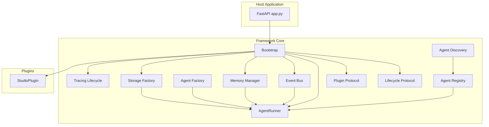

**Diagram sources**
- [app.py:46-77](file://src/ark_agentic/app.py#L46-L77)
- [bootstrap.py:48-93](file://src/ark_agentic/core/protocol/bootstrap.py#L48-L93)
- [lifecycle.py:23-65](file://src/ark_agentic/core/protocol/lifecycle.py#L23-L65)
- [plugin.py:20-34](file://src/ark_agentic/core/protocol/plugin.py#L20-L34)
- [runner.py:171-278](file://src/ark_agentic/core/runtime/runner.py#L171-L278)
- [factory.py:59-182](file://src/ark_agentic/core/runtime/factory.py#L59-L182)
- [registry.py:13-29](file://src/ark_agentic/core/runtime/registry.py#L13-L29)
- [discovery.py:50-107](file://src/ark_agentic/core/runtime/discovery.py#L50-L107)
- [event_bus.py:67-116](file://src/ark_agentic/core/stream/event_bus.py#L67-L116)
- [manager.py:52-143](file://src/ark_agentic/core/memory/manager.py#L52-L143)
- [factory.py:30-67](file://src/ark_agentic/core/storage/factory.py#L30-L67)
- [tracing_lifecycle.py:21-42](file://src/ark_agentic/core/observability/tracing_lifecycle.py#L21-L42)
- [studio/plugin.py:16-31](file://src/ark_agentic/plugins/studio/plugin.py#L16-L31)

**Section sources**
- [app.py:13-94](file://src/ark_agentic/app.py#L13-L94)
- [bootstrap.py:48-162](file://src/ark_agentic/core/protocol/bootstrap.py#L48-L162)
- [lifecycle.py:23-91](file://src/ark_agentic/core/protocol/lifecycle.py#L23-L91)
- [plugin.py:20-35](file://src/ark_agentic/core/protocol/plugin.py#L20-L35)

## Core Components
- Lifecycle and Plugin protocols define a uniform contract for initialization, startup, route installation, and shutdown. Plugins are user-selectable features layered between mandatory core components.
- Bootstrap orchestrates lifecycle components, ensuring mandatory components (agents and tracing) are always loaded and ordered correctly, while filtering disabled components and managing reverse-order teardown.
- AgentRunner implements the ReAct decision loop, integrating LLM calls, tool execution, streaming events, memory, and session management.
- Storage and memory abstractions are mode-driven and backend-agnostic, enabling file or SQLite backends via a factory.
- Observability is integrated as a lifecycle component for tracing setup and teardown.

**Section sources**
- [lifecycle.py:23-91](file://src/ark_agentic/core/protocol/lifecycle.py#L23-L91)
- [plugin.py:20-35](file://src/ark_agentic/core/protocol/plugin.py#L20-L35)
- [bootstrap.py:48-162](file://src/ark_agentic/core/protocol/bootstrap.py#L48-L162)
- [runner.py:171-800](file://src/ark_agentic/core/runtime/runner.py#L171-L800)
- [factory.py:30-67](file://src/ark_agentic/core/storage/factory.py#L30-L67)
- [manager.py:52-183](file://src/ark_agentic/core/memory/manager.py#L52-L183)
- [tracing_lifecycle.py:21-42](file://src/ark_agentic/core/observability/tracing_lifecycle.py#L21-L42)

## Architecture Overview
The framework follows a hexagonal architecture:
- The center is the AgentRunner and its configuration, decoupled from transport and storage.
- External ports include HTTP routes (via lifecycle route installation), storage backends (file/SQLite), and observability providers.
- The plugin system extends capabilities without changing core contracts.

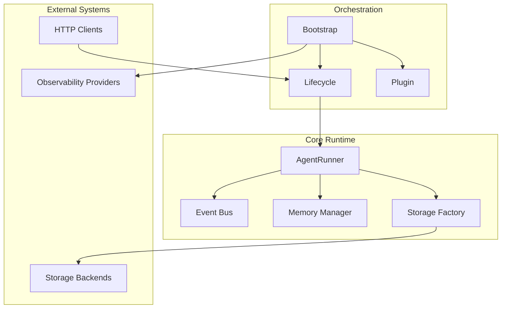

**Diagram sources**
- [runner.py:171-380](file://src/ark_agentic/core/runtime/runner.py#L171-L380)
- [event_bus.py:67-248](file://src/ark_agentic/core/stream/event_bus.py#L67-L248)
- [manager.py:52-183](file://src/ark_agentic/core/memory/manager.py#L52-L183)
- [factory.py:30-67](file://src/ark_agentic/core/storage/factory.py#L30-L67)
- [bootstrap.py:48-162](file://src/ark_agentic/core/protocol/bootstrap.py#L48-L162)
- [lifecycle.py:23-91](file://src/ark_agentic/core/protocol/lifecycle.py#L23-L91)
- [plugin.py:20-35](file://src/ark_agentic/core/protocol/plugin.py#L20-L35)

## Detailed Component Analysis

### Bootstrap and Lifecycle Orchestration
Bootstrap manages component initialization, startup, and shutdown. It enforces:
- Mandatory components: AgentsLifecycle (first) and TracingLifecycle (last).
- Optional plugins: inserted between mandatory components.
- Idempotent init, ordered start, and reverse-ordered stop with per-component error isolation.

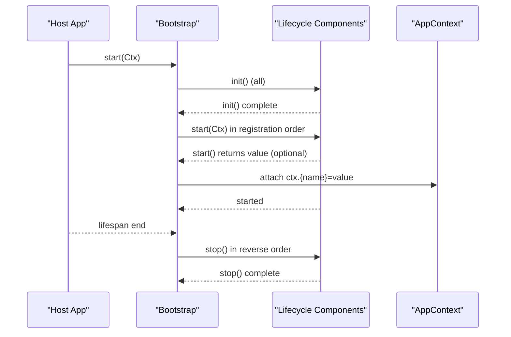

**Diagram sources**
- [bootstrap.py:115-162](file://src/ark_agentic/core/protocol/bootstrap.py#L115-L162)
- [lifecycle.py:34-65](file://src/ark_agentic/core/protocol/lifecycle.py#L34-L65)

**Section sources**
- [bootstrap.py:48-162](file://src/ark_agentic/core/protocol/bootstrap.py#L48-L162)
- [lifecycle.py:23-91](file://src/ark_agentic/core/protocol/lifecycle.py#L23-L91)

### Agent Factory and Standard Agent Builder
The factory composes an AgentRunner from an AgentDef and runtime parameters:
- Resolves LLM, skill loader, session manager, tool registry, memory manager, and callback hooks.
- Applies conventions for directories and defaults.
- Supports dynamic vs full skill load modes and optional subtask spawning.

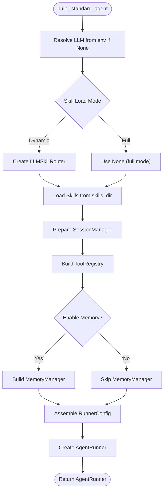

**Diagram sources**
- [factory.py:59-182](file://src/ark_agentic/core/runtime/factory.py#L59-L182)

**Section sources**
- [factory.py:35-182](file://src/ark_agentic/core/runtime/factory.py#L35-L182)

### ReAct Decision Loop and Turn Execution
AgentRunner implements a ReAct loop:
- Prepare session, apply hooks, merge context/history, auto-compaction.
- Build messages and tools for the turn.
- Model phase produces assistant response (possibly with tool calls).
- Tool phase executes tools, merges state deltas and session effects.
- Finalize run, persist, and trigger memory consolidation.

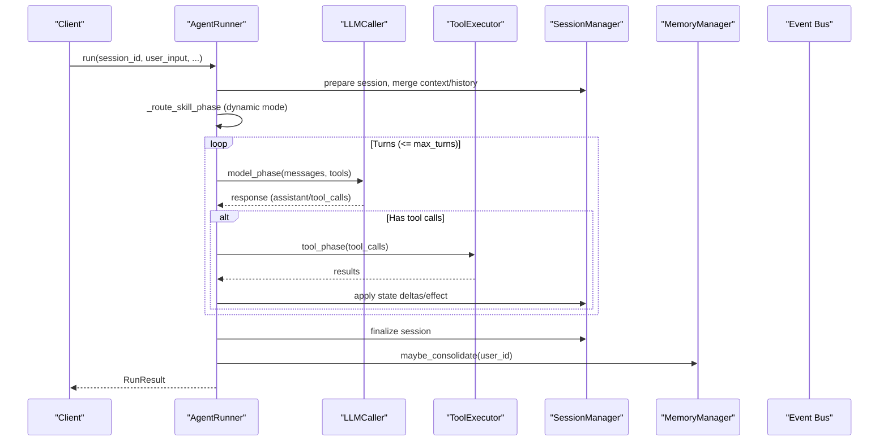

**Diagram sources**
- [runner.py:290-550](file://src/ark_agentic/core/runtime/runner.py#L290-L550)
- [runner.py:684-800](file://src/ark_agentic/core/runtime/runner.py#L684-L800)

**Section sources**
- [runner.py:171-800](file://src/ark_agentic/core/runtime/runner.py#L171-L800)

### Streaming Event Bus and Observer Pattern
The event bus translates internal runner callbacks into structured stream events:
- Maintains active step/text/thinking state and emits paired start/finish events.
- Emits run_started/completed/error lifecycle events.
- Handlers implement a protocol to receive deltas and UI components.

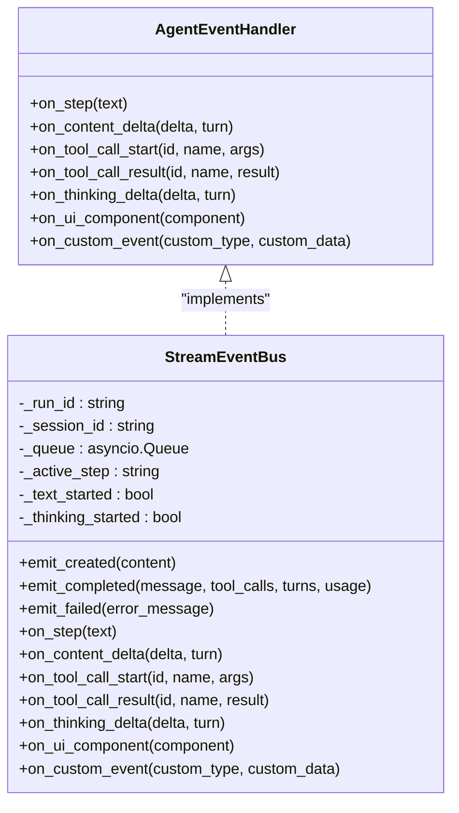

**Diagram sources**
- [event_bus.py:28-62](file://src/ark_agentic/core/stream/event_bus.py#L28-L62)
- [event_bus.py:67-248](file://src/ark_agentic/core/stream/event_bus.py#L67-L248)

**Section sources**
- [event_bus.py:1-248](file://src/ark_agentic/core/stream/event_bus.py#L1-L248)

### Memory Management and Storage Abstraction
Memory and sessions are abstracted behind repositories:
- MemoryManager delegates to a MemoryRepository (file/SQLite) and caches active users.
- Storage factory selects backend based on mode and provides repositories for sessions and memory.
- Backend switching is transparent to business logic.

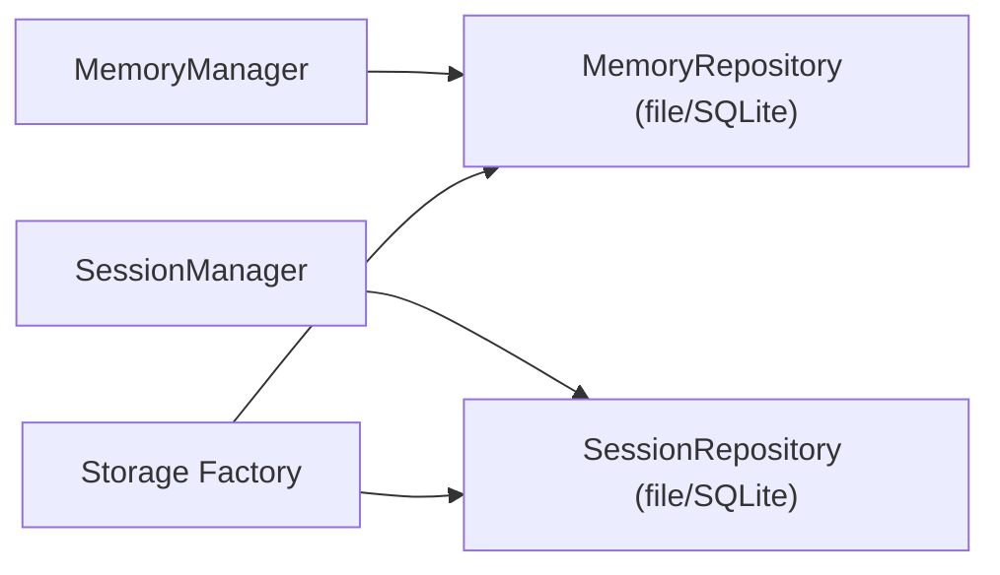

**Diagram sources**
- [manager.py:52-183](file://src/ark_agentic/core/memory/manager.py#L52-L183)
- [factory.py:30-67](file://src/ark_agentic/core/storage/factory.py#L30-L67)

**Section sources**
- [manager.py:52-183](file://src/ark_agentic/core/memory/manager.py#L52-L183)
- [factory.py:30-67](file://src/ark_agentic/core/storage/factory.py#L30-L67)

### Plugin Architecture and Discovery
- Plugins implement the Lifecycle contract and are user-selectable.
- Bootstrap filters disabled plugins and installs HTTP routes uniformly.
- Agent discovery scans a filesystem root for agent packages and registers them via a register function.

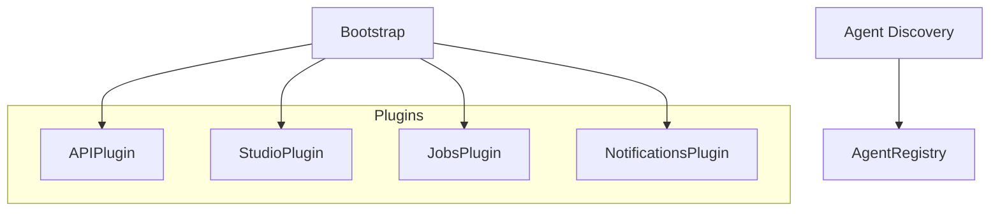

**Diagram sources**
- [plugin.py:20-35](file://src/ark_agentic/core/protocol/plugin.py#L20-L35)
- [studio/plugin.py:16-31](file://src/ark_agentic/plugins/studio/plugin.py#L16-L31)
- [discovery.py:50-107](file://src/ark_agentic/core/runtime/discovery.py#L50-L107)
- [registry.py:13-29](file://src/ark_agentic/core/runtime/registry.py#L13-L29)

**Section sources**
- [plugin.py:20-35](file://src/ark_agentic/core/protocol/plugin.py#L20-L35)
- [studio/plugin.py:16-31](file://src/ark_agentic/plugins/studio/plugin.py#L16-L31)
- [discovery.py:50-107](file://src/ark_agentic/core/runtime/discovery.py#L50-L107)
- [registry.py:13-29](file://src/ark_agentic/core/runtime/registry.py#L13-L29)

### Skill Routing and Dynamic Mode
- In dynamic mode, a SkillRouter determines active skills per turn and writes to session state.
- LLMSkillRouter uses an LLM to select skills based on recent history and candidate set, with timeouts and defensive parsing.

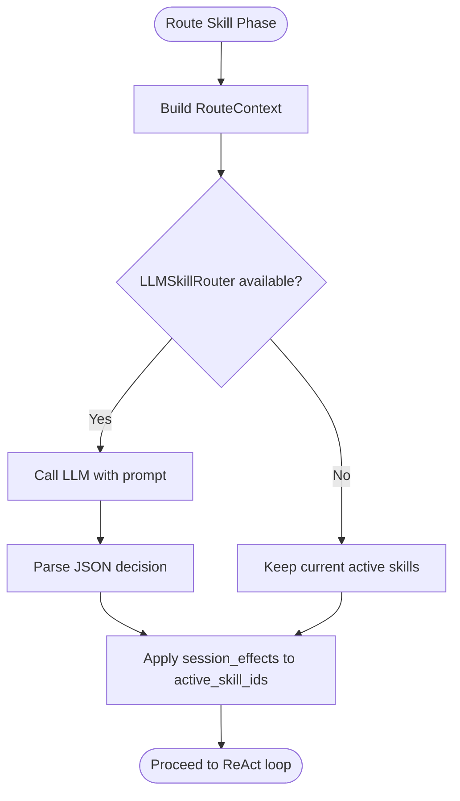

**Diagram sources**
- [router.py:94-216](file://src/ark_agentic/core/skills/router.py#L94-L216)
- [runner.py:350-355](file://src/ark_agentic/core/runtime/runner.py#L350-L355)

**Section sources**
- [router.py:30-216](file://src/ark_agentic/core/skills/router.py#L30-L216)
- [runner.py:350-355](file://src/ark_agentic/core/runtime/runner.py#L350-L355)

### Tool Registry and Execution
- ToolRegistry manages tool registration, grouping, filtering, and schema generation.
- ToolExecutor enforces per-turn limits and timeouts during tool invocation.

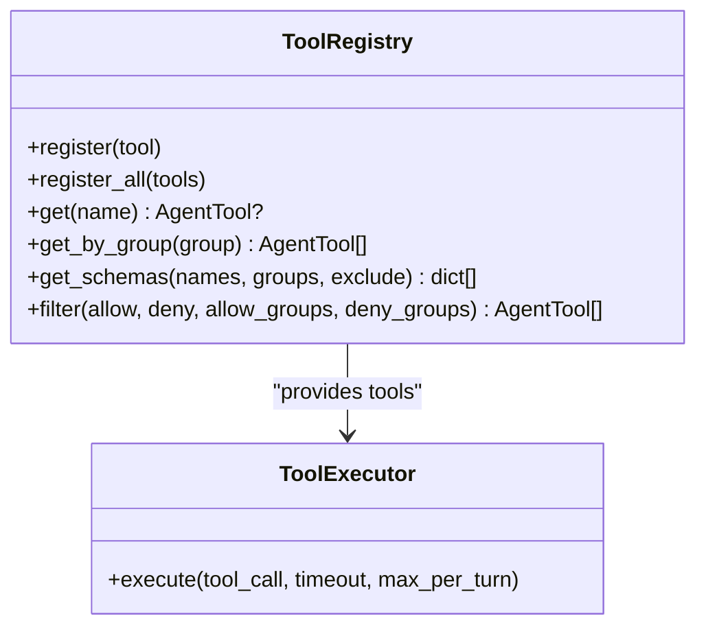

**Diagram sources**
- [registry.py:14-178](file://src/ark_agentic/core/tools/registry.py#L14-L178)
- [runner.py:213-217](file://src/ark_agentic/core/runtime/runner.py#L213-L217)

**Section sources**
- [registry.py:14-178](file://src/ark_agentic/core/tools/registry.py#L14-L178)
- [runner.py:213-217](file://src/ark_agentic/core/runtime/runner.py#L213-L217)

## Dependency Analysis
Key dependencies and relationships:
- app.py composes Bootstrap with plugins and mounts routes at module load time.
- Bootstrap depends on lifecycle and plugin protocols and manages component ordering.
- AgentRunner depends on LLMCaller, ToolExecutor, SessionManager, MemoryManager, and ToolRegistry.
- Storage and memory depend on a mode-driven factory.
- Observability is integrated as a lifecycle component.

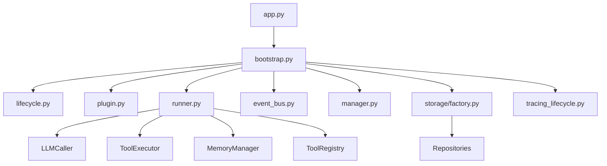

**Diagram sources**
- [app.py:46-77](file://src/ark_agentic/app.py#L46-L77)
- [bootstrap.py:48-162](file://src/ark_agentic/core/protocol/bootstrap.py#L48-L162)
- [runner.py:171-278](file://src/ark_agentic/core/runtime/runner.py#L171-L278)
- [event_bus.py:67-116](file://src/ark_agentic/core/stream/event_bus.py#L67-L116)
- [manager.py:52-143](file://src/ark_agentic/core/memory/manager.py#L52-L143)
- [factory.py:30-67](file://src/ark_agentic/core/storage/factory.py#L30-L67)
- [tracing_lifecycle.py:21-42](file://src/ark_agentic/core/observability/tracing_lifecycle.py#L21-L42)

**Section sources**
- [app.py:46-77](file://src/ark_agentic/app.py#L46-L77)
- [bootstrap.py:48-162](file://src/ark_agentic/core/protocol/bootstrap.py#L48-L162)
- [runner.py:171-278](file://src/ark_agentic/core/runtime/runner.py#L171-L278)

## Performance Considerations
- ReAct loop limits: max_turns prevents runaway loops; max_tool_calls_per_turn and tool_timeout bound tool execution cost.
- Auto-compaction: session auto-compaction reduces context length to keep LLM calls efficient.
- Memory caching: MemoryManager caches user memory in-process to reduce I/O.
- Storage mode: SQLite backend avoids filesystem overhead in multi-user scenarios; file backend suitable for lightweight deployments.
- Observability: tracing is initialized once and shut down cleanly to avoid overhead after lifecycle end.

[No sources needed since this section provides general guidance]

## Troubleshooting Guide
- Authentication and quota errors: The runner maps LLM errors to user-friendly messages for common failure reasons.
- Tool execution failures: ToolExecutor enforces timeouts and per-turn limits; inspect tool schemas and group filters.
- Session persistence: Ensure storage mode is configured correctly; verify repositories are constructed via the factory.
- Observability: Confirm tracing lifecycle is started and stopped properly; check service name and provider configuration.

**Section sources**
- [runner.py:624-643](file://src/ark_agentic/core/runtime/runner.py#L624-L643)
- [registry.py:14-178](file://src/ark_agentic/core/tools/registry.py#L14-L178)
- [factory.py:30-67](file://src/ark_agentic/core/storage/factory.py#L30-L67)
- [tracing_lifecycle.py:21-42](file://src/ark_agentic/core/observability/tracing_lifecycle.py#L21-L42)

## Conclusion
The Ark Agentic core framework is designed around a clean separation of concerns: lifecycle orchestration, runtime execution, streaming, memory, storage, and observability. The hexagonal architecture and plugin system enable extensibility without compromising stability. The ReAct loop, skill routing, and streaming event bus provide a robust foundation for agent behaviors, while storage and memory abstractions support flexible deployment models. The bootstrap system ensures predictable initialization and teardown, and the protocols enforce consistent behavior across components.