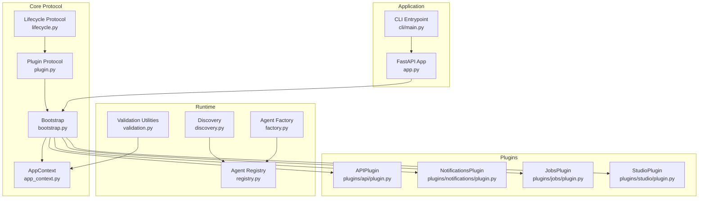
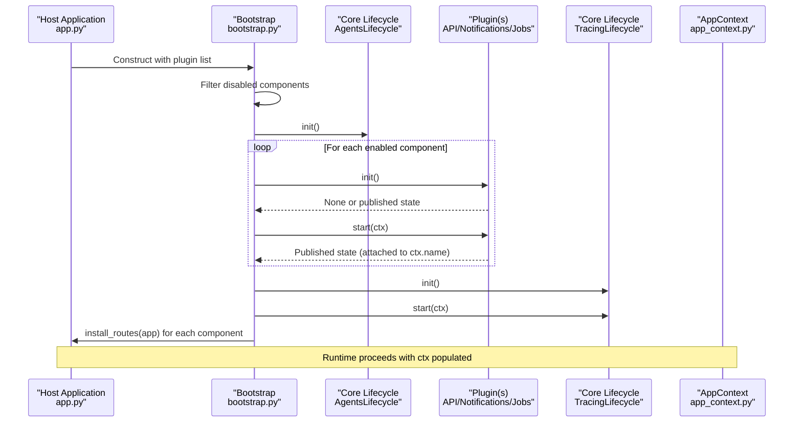
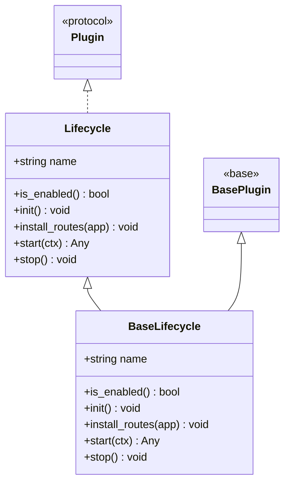
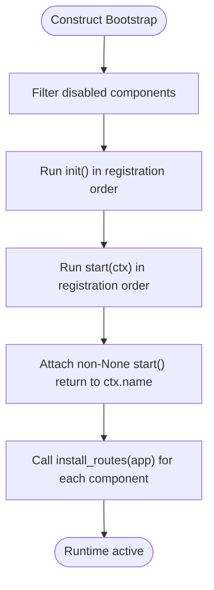
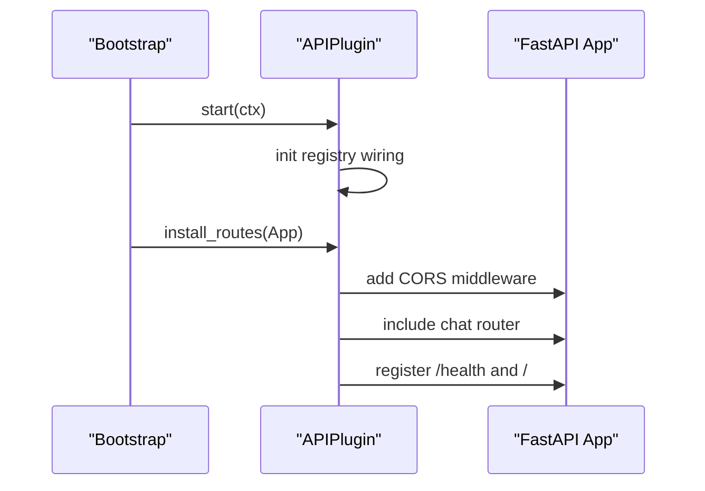
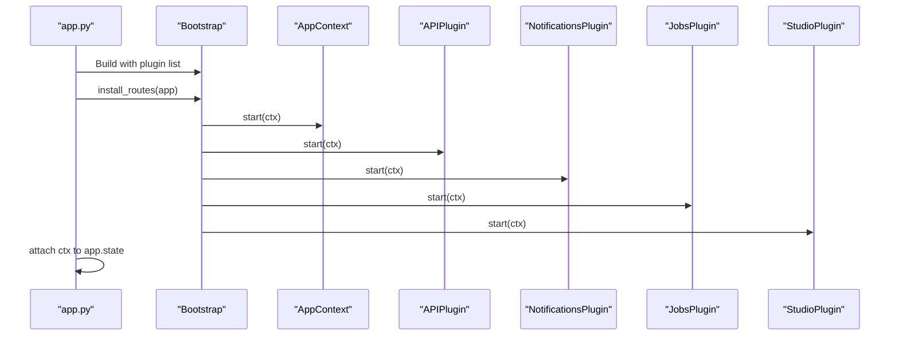
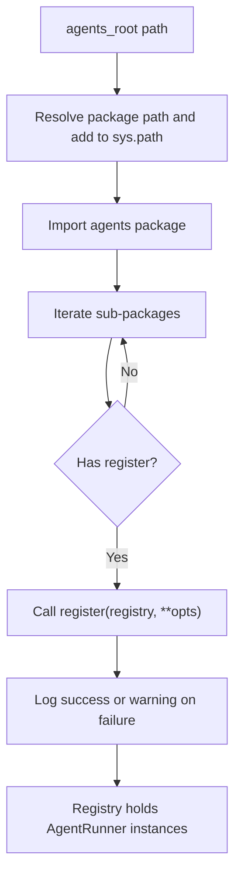
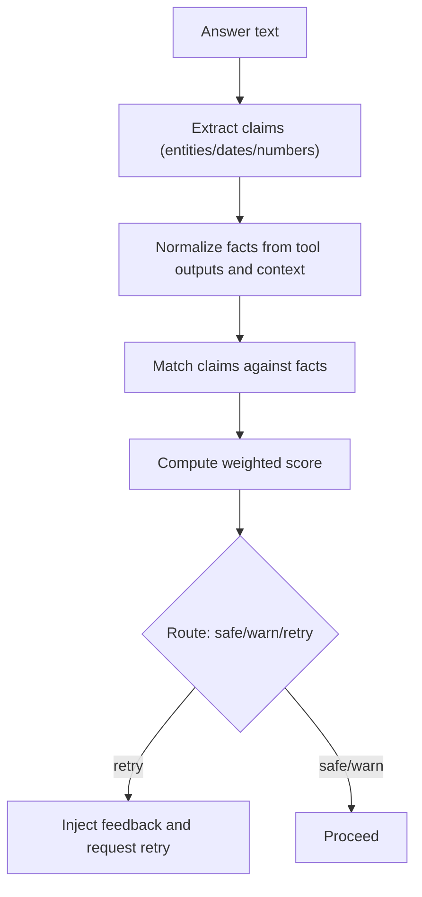
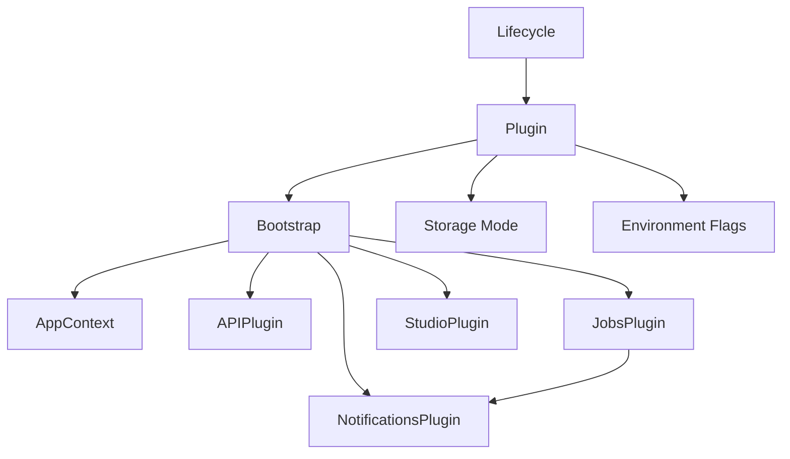

# Plugin Architecture

<cite>
**Referenced Files in This Document**
- [app.py](file://src/ark_agentic/app.py)
- [bootstrap.py](file://src/ark_agentic/core/protocol/bootstrap.py)
- [lifecycle.py](file://src/ark_agentic/core/protocol/lifecycle.py)
- [plugin.py](file://src/ark_agentic/core/protocol/plugin.py)
- [app_context.py](file://src/ark_agentic/core/protocol/app_context.py)
- [discovery.py](file://src/ark_agentic/core/runtime/discovery.py)
- [registry.py](file://src/ark_agentic/core/runtime/registry.py)
- [validation.py](file://src/ark_agentic/core/runtime/validation.py)
- [factory.py](file://src/ark_agentic/core/runtime/factory.py)
- [api/plugin.py](file://src/ark_agentic/plugins/api/plugin.py)
- [jobs/plugin.py](file://src/ark_agentic/plugins/jobs/plugin.py)
- [notifications/plugin.py](file://src/ark_agentic/plugins/notifications/plugin.py)
- [studio/plugin.py](file://src/ark_agentic/plugins/studio/plugin.py)
- [main.py](file://src/ark_agentic/cli/main.py)
</cite>

## Table of Contents
1. [Introduction](#introduction)
2. [Project Structure](#project-structure)
3. [Core Components](#core-components)
4. [Architecture Overview](#architecture-overview)
5. [Detailed Component Analysis](#detailed-component-analysis)
6. [Dependency Analysis](#dependency-analysis)
7. [Performance Considerations](#performance-considerations)
8. [Troubleshooting Guide](#troubleshooting-guide)
9. [Conclusion](#conclusion)
10. [Appendices](#appendices)

## Introduction
This document describes the plugin system that enables an extensible, optional-feature architecture for the application. It explains how plugins are defined, discovered, validated, loaded, and registered with the bootstrap system. It documents the separation between plugin interfaces and concrete implementations, outlines infrastructure requirements and deployment considerations, and details integration with the core runtime, storage, and observability layers. It also covers isolation, dependency management, and conflict resolution strategies.

## Project Structure
The plugin system is centered around a lifecycle protocol and a bootstrap orchestrator. Built-in plugins live under the plugins/ namespace and are wired into the application via the composition root. Optional features are enabled or disabled via environment flags, and their presence influences the runtime context exposed to other components.

**Diagram sources**
- [bootstrap.py:48-162](file://src/ark_agentic/core/protocol/bootstrap.py#L48-L162)
- [lifecycle.py:23-91](file://src/ark_agentic/core/protocol/lifecycle.py#L23-L91)
- [plugin.py:20-35](file://src/ark_agentic/core/protocol/plugin.py#L20-L35)
- [app_context.py:23-27](file://src/ark_agentic/core/protocol/app_context.py#L23-L27)
- [discovery.py:50-107](file://src/ark_agentic/core/runtime/discovery.py#L50-L107)
- [registry.py:13-29](file://src/ark_agentic/core/runtime/registry.py#L13-L29)
- [validation.py:495-604](file://src/ark_agentic/core/runtime/validation.py#L495-L604)
- [factory.py:59-183](file://src/ark_agentic/core/runtime/factory.py#L59-L183)
- [api/plugin.py:27-87](file://src/ark_agentic/plugins/api/plugin.py#L27-L87)
- [jobs/plugin.py:34-99](file://src/ark_agentic/plugins/jobs/plugin.py#L34-L99)
- [notifications/plugin.py:12-41](file://src/ark_agentic/plugins/notifications/plugin.py#L12-L41)
- [studio/plugin.py:16-32](file://src/ark_agentic/plugins/studio/plugin.py#L16-L32)
- [app.py:35-78](file://src/ark_agentic/app.py#L35-L78)
- [main.py:178-222](file://src/ark_agentic/cli/main.py#L178-L222)

**Section sources**
- [app.py:35-78](file://src/ark_agentic/app.py#L35-L78)
- [bootstrap.py:48-162](file://src/ark_agentic/core/protocol/bootstrap.py#L48-L162)
- [lifecycle.py:23-91](file://src/ark_agentic/core/protocol/lifecycle.py#L23-L91)
- [plugin.py:20-35](file://src/ark_agentic/core/protocol/plugin.py#L20-L35)
- [app_context.py:23-27](file://src/ark_agentic/core/protocol/app_context.py#L23-L27)

## Core Components
- Lifecycle and Plugin protocols define the contract for all components. Plugins are semantically optional features that share the same lifecycle as core components.
- Bootstrap orchestrates initialization, route installation, startup, and shutdown. It enforces ordering: core components first and last, with plugins sandwiched in between.
- AppContext is the runtime container where components publish state for downstream consumption.
- Discovery utilities enable dynamic discovery of agents and other runtime capabilities without hardcoding package names.
- Validation utilities provide grounding hooks that can be injected into the runtime pipeline.

Key responsibilities:
- Lifecycle/Lifecycle: Define the lifecycle contract and default no-op behavior.
- Plugin/Plugin: Extend lifecycle semantics for optional features.
- Bootstrap: Manage component lists, initialization, startup, and shutdown.
- AppContext: Provide typed slots for core components and dynamic slots for plugins.
- Discovery/Registry: Support dynamic agent discovery and registry management.
- Validation: Provide hooks for post-response grounding validation.

**Section sources**
- [lifecycle.py:23-91](file://src/ark_agentic/core/protocol/lifecycle.py#L23-L91)
- [plugin.py:20-35](file://src/ark_agentic/core/protocol/plugin.py#L20-L35)
- [bootstrap.py:48-162](file://src/ark_agentic/core/protocol/bootstrap.py#L48-L162)
- [app_context.py:23-27](file://src/ark_agentic/core/protocol/app_context.py#L23-L27)
- [discovery.py:50-107](file://src/ark_agentic/core/runtime/discovery.py#L50-L107)
- [registry.py:13-29](file://src/ark_agentic/core/runtime/registry.py#L13-L29)
- [validation.py:495-604](file://src/ark_agentic/core/runtime/validation.py#L495-L604)

## Architecture Overview
The plugin architecture separates core runtime components from optional features. Core components (agents lifecycle and tracing) are always included; optional plugins are selected by the host and registered with Bootstrap. Plugins can initialize storage, install HTTP routes, and publish runtime state into AppContext for other components to consume.

**Diagram sources**
- [app.py:50-78](file://src/ark_agentic/app.py#L50-L78)
- [bootstrap.py:61-162](file://src/ark_agentic/core/protocol/bootstrap.py#L61-L162)
- [app_context.py:23-27](file://src/ark_agentic/core/protocol/app_context.py#L23-L27)

## Detailed Component Analysis

### Lifecycle and Plugin Protocols
- Lifecycle defines the contract for init/start/stop/install_routes with default no-op behavior.
- Plugin extends Lifecycle for optional features; BasePlugin provides a semantic base class.
- This separation ensures core components are always present while optional features remain decoupled.

**Diagram sources**
- [lifecycle.py:23-91](file://src/ark_agentic/core/protocol/lifecycle.py#L23-L91)
- [plugin.py:20-35](file://src/ark_agentic/core/protocol/plugin.py#L20-L35)

**Section sources**
- [lifecycle.py:23-91](file://src/ark_agentic/core/protocol/lifecycle.py#L23-L91)
- [plugin.py:20-35](file://src/ark_agentic/core/protocol/plugin.py#L20-L35)

### Bootstrap Orchestration
- Bootstrap composes the component list, filters disabled components, and runs init/start/stop in strict order.
- Core components (agents lifecycle and tracing) are auto-added; plugins are user-selectable.
- install_routes is invoked after initialization to mount HTTP routes.

**Diagram sources**
- [bootstrap.py:61-162](file://src/ark_agentic/core/protocol/bootstrap.py#L61-L162)

**Section sources**
- [bootstrap.py:48-162](file://src/ark_agentic/core/protocol/bootstrap.py#L48-L162)

### Plugin Implementations

#### APIPlugin
- Provides HTTP transport for chat, health checks, CORS middleware, and a default index page.
- Initializes registry wiring and installs routes during install_routes.
- Enabled by default; can be disabled via environment flag for headless deployments.

**Diagram sources**
- [api/plugin.py:35-87](file://src/ark_agentic/plugins/api/plugin.py#L35-L87)
- [bootstrap.py:124-133](file://src/ark_agentic/core/protocol/bootstrap.py#L124-L133)

**Section sources**
- [api/plugin.py:27-87](file://src/ark_agentic/plugins/api/plugin.py#L27-L87)

#### NotificationsPlugin
- Provides notifications feature with REST/SSE and repository caching.
- Schema initialization is conditional on storage mode.
- Exposes install_routes and publishes runtime context on start.

**Section sources**
- [notifications/plugin.py:12-41](file://src/ark_agentic/plugins/notifications/plugin.py#L12-L41)

#### JobsPlugin
- Proactive job manager and scanner requiring notifications to be enabled first.
- Reads environment variables for concurrency and sharding.
- Registers proactive jobs using the agent registry and publishes a JobsContext.

**Section sources**
- [jobs/plugin.py:34-99](file://src/ark_agentic/plugins/jobs/plugin.py#L34-L99)

#### StudioPlugin
- Optional admin console that mounts Studio routers and serves frontend assets.
- Initializes its own schema separately from core storage.

**Section sources**
- [studio/plugin.py:16-32](file://src/ark_agentic/plugins/studio/plugin.py#L16-L32)

### Application Integration
- The composition root constructs a plugin list and passes it to Bootstrap.
- Portal is included before APIPlugin to ensure its route registration takes precedence.
- AppContext is populated during start and attached to app.state for runtime access.

**Diagram sources**
- [app.py:50-78](file://src/ark_agentic/app.py#L50-L78)
- [bootstrap.py:134-152](file://src/ark_agentic/core/protocol/bootstrap.py#L134-L152)

**Section sources**
- [app.py:35-78](file://src/ark_agentic/app.py#L35-L78)

### Agent Discovery and Registry
- Dynamic discovery scans a configured agents root and imports packages that expose a register function.
- Errors are logged and skipped to avoid blocking startup.
- The AgentRegistry stores AgentRunner instances for lookup and orchestration.

**Diagram sources**
- [discovery.py:50-107](file://src/ark_agentic/core/runtime/discovery.py#L50-L107)
- [registry.py:13-29](file://src/ark_agentic/core/runtime/registry.py#L13-L29)

**Section sources**
- [discovery.py:50-107](file://src/ark_agentic/core/runtime/discovery.py#L50-L107)
- [registry.py:13-29](file://src/ark_agentic/core/runtime/registry.py#L13-L29)

### Validation Hooks and Grounding
- A framework-level hook validates answers post-generation by extracting claims and matching them against tool outputs and user context.
- Supports entity/date/number claim extraction with weighted scoring and fallback matching against cached history.
- Can trigger a retry with feedback when grounding fails.

**Diagram sources**
- [validation.py:212-291](file://src/ark_agentic/core/runtime/validation.py#L212-L291)
- [validation.py:495-604](file://src/ark_agentic/core/runtime/validation.py#L495-L604)

**Section sources**
- [validation.py:212-291](file://src/ark_agentic/core/runtime/validation.py#L212-L291)
- [validation.py:495-604](file://src/ark_agentic/core/runtime/validation.py#L495-L604)

## Dependency Analysis
- Core protocol and bootstrap are foundational and minimally coupled to plugins.
- Plugins depend on core protocols and may depend on each other (e.g., JobsPlugin depends on NotificationsPlugin).
- Storage and environment flags gate plugin initialization and schema creation.
- AppContext acts as the single publication point for cross-component communication.

**Diagram sources**
- [lifecycle.py:23-91](file://src/ark_agentic/core/protocol/lifecycle.py#L23-L91)
- [plugin.py:20-35](file://src/ark_agentic/core/protocol/plugin.py#L20-L35)
- [bootstrap.py:61-162](file://src/ark_agentic/core/protocol/bootstrap.py#L61-L162)
- [jobs/plugin.py:52-56](file://src/ark_agentic/plugins/jobs/plugin.py#L52-L56)

**Section sources**
- [bootstrap.py:61-162](file://src/ark_agentic/core/protocol/bootstrap.py#L61-L162)
- [jobs/plugin.py:52-56](file://src/ark_agentic/plugins/jobs/plugin.py#L52-L56)

## Performance Considerations
- Plugin initialization should be lightweight and idempotent to minimize startup latency.
- Route installation occurs before the lifespan begins; keep middleware and static mounts efficient.
- JobsPlugin supports concurrency and batching; tune JOB_MAX_CONCURRENT and JOB_BATCH_SIZE for workload characteristics.
- Validation hooks add post-processing overhead; consider disabling or adjusting thresholds in performance-sensitive scenarios.

## Troubleshooting Guide
Common issues and resolutions:
- Plugin not starting: Verify environment flags and storage mode conditions. Check logs for initialization failures.
- Route conflicts: Registration order determines precedence; ensure Portal precedes APIPlugin to win the "/" route.
- JobsPlugin dependency errors: Ensure NotificationsPlugin is enabled and registered before JobsPlugin.
- Import errors in JobsPlugin: Install server extras as indicated by the error message.
- Name collisions in AppContext: Bootstrap prevents duplicate ctx attribute names; adjust plugin names if necessary.

**Section sources**
- [jobs/plugin.py:52-65](file://src/ark_agentic/plugins/jobs/plugin.py#L52-L65)
- [bootstrap.py:145-149](file://src/ark_agentic/core/protocol/bootstrap.py#L145-L149)
- [app.py:8-11](file://src/ark_agentic/app.py#L8-L11)

## Conclusion
The plugin system provides a clean separation between core runtime components and optional features. Through a shared lifecycle protocol and a deterministic bootstrap orchestration, plugins can initialize storage, install routes, and publish runtime state without coupling to the core framework. Environment flags and storage modes govern availability, while AppContext enables loose coupling across components. Built-in plugins demonstrate practical patterns for HTTP transport, notifications, jobs, and studio administration, with clear extension points for third-party plugins.

## Appendices

### Plugin Development Checklist
- Implement a Plugin class inheriting from BasePlugin and set a unique name.
- Gate activation with env_flag in is_enabled().
- Implement init() for schema creation and resource preparation.
- Implement install_routes() for HTTP mounting.
- Implement start() to build runtime context and publish it to AppContext.
- Add dependencies and error handling for optional imports.
- Document environment variables and configuration options.

### Deployment Considerations
- Headless deployments: Disable APIPlugin via environment flag to avoid FastAPI plumbing.
- Conditional features: Notifications and Jobs require compatible storage modes.
- Frontend assets: StudioPlugin serves its own assets independently of core storage.

### Backward Compatibility Strategies
- Keep lifecycle method signatures stable; add optional parameters with defaults.
- Use environment flags to toggle new behavior without breaking existing setups.
- Preserve existing route names and middleware where possible.
- Provide migration steps for schema changes in plugins.

**Section sources**
- [api/plugin.py:30-33](file://src/ark_agentic/plugins/api/plugin.py#L30-L33)
- [jobs/plugin.py:42-43](file://src/ark_agentic/plugins/jobs/plugin.py#L42-L43)
- [notifications/plugin.py:17-24](file://src/ark_agentic/plugins/notifications/plugin.py#L17-L24)
- [studio/plugin.py:19-20](file://src/ark_agentic/plugins/studio/plugin.py#L19-L20)
- [main.py:107-112](file://src/ark_agentic/cli/main.py#L107-L112)