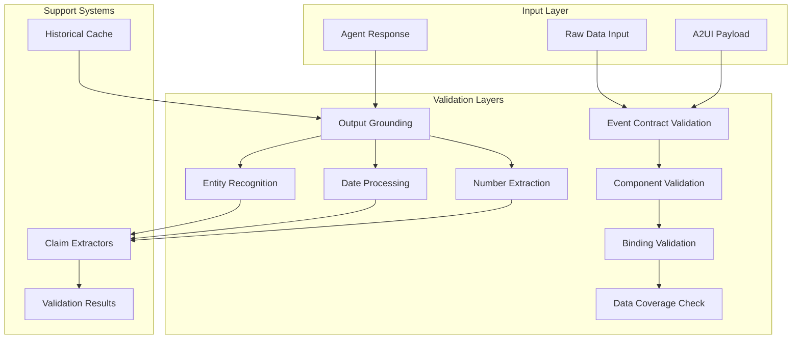
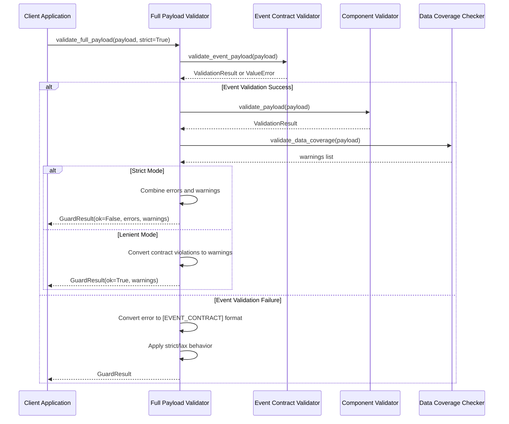
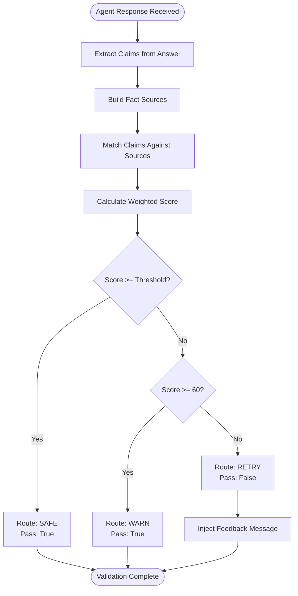
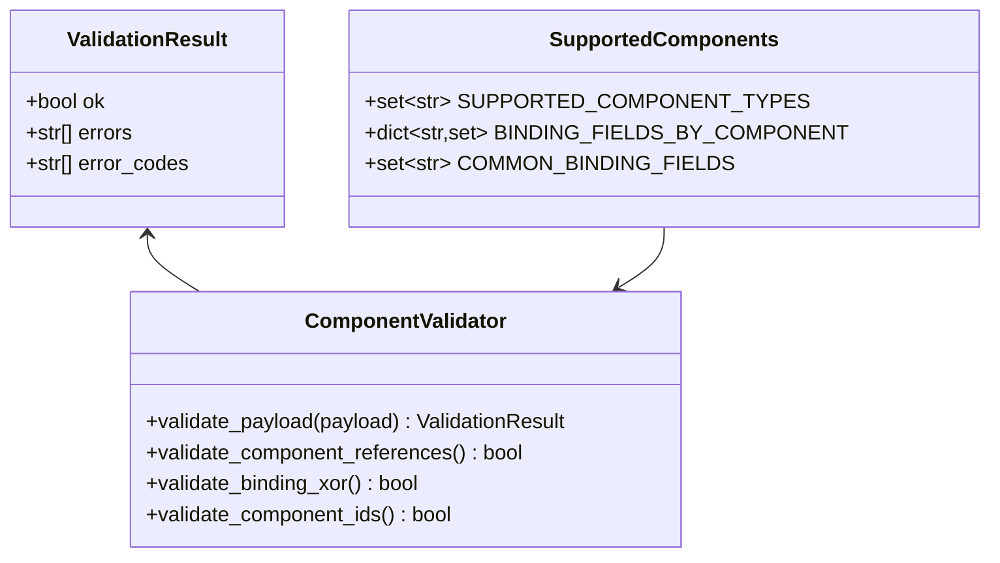
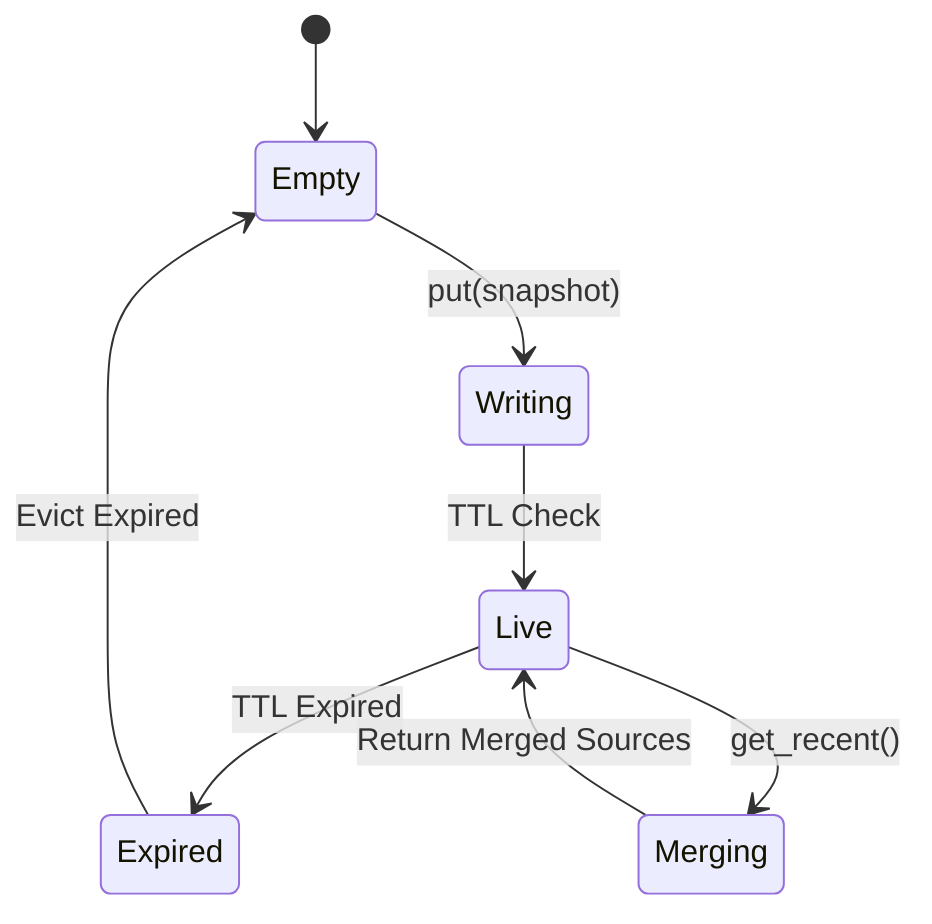
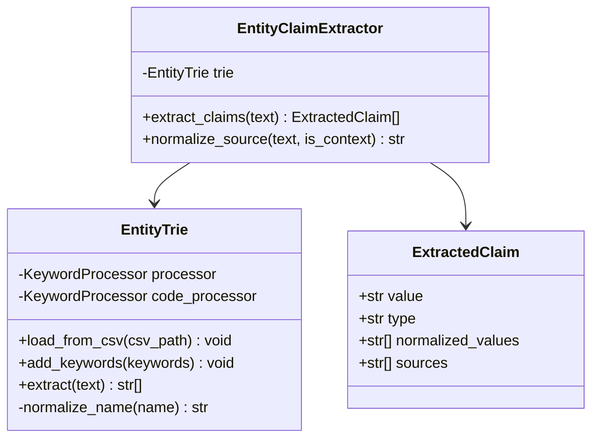
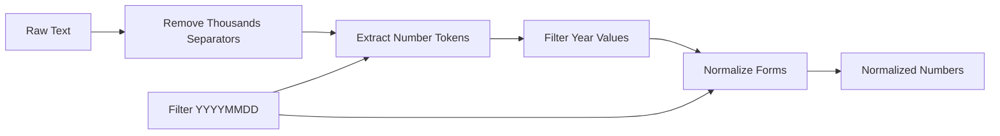
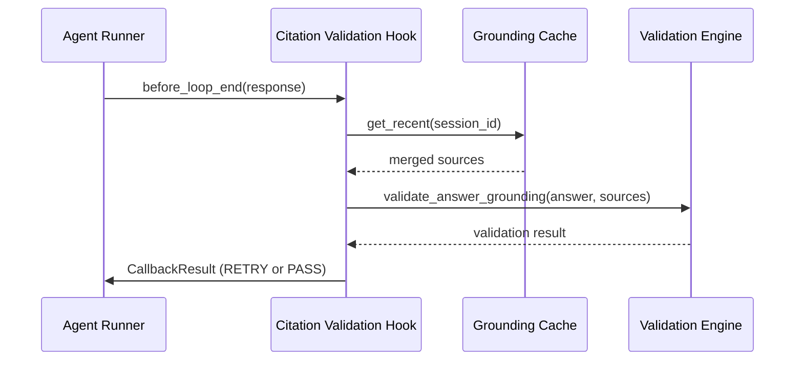
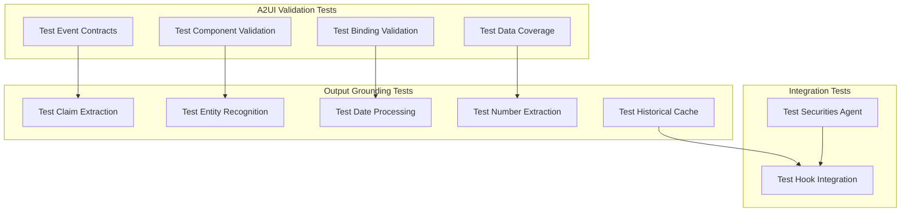

# Core Validation System

<cite>
**Referenced Files in This Document**
- [validation.py](file://src/ark_agentic/core/validation.py)
- [guard.py](file://src/ark_agentic/core/a2ui/guard.py)
- [validator.py](file://src/ark_agentic/core/a2ui/validator.py)
- [contract_models.py](file://src/ark_agentic/core/a2ui/contract_models.py)
- [entities.py](file://src/ark_agentic/core/utils/entities.py)
- [dates.py](file://src/ark_agentic/core/utils/dates.py)
- [numbers.py](file://src/ark_agentic/core/utils/numbers.py)
- [grounding_cache.py](file://src/ark_agentic/core/utils/grounding_cache.py)
- [validation.py](file://src/ark_agentic/agents/securities/validation.py)
- [test_validation.py](file://tests/unit/core/test_validation.py)
- [test_a2ui_guard.py](file://tests/unit/core/test_a2ui_guard.py)
- [test_securities_validation.py](file://tests/unit/agents/test_securities_validation.py)
- [test_grounding_cache.py](file://tests/unit/core/test_grounding_cache.py)
</cite>

## Table of Contents
1. [Introduction](#introduction)
2. [System Architecture](#system-architecture)
3. [Core Validation Components](#core-validation-components)
4. [A2UI Payload Validation](#a2ui-payload-validation)
5. [Output Grounding Validation](#output-grounding-validation)
6. [Entity Recognition System](#entity-recognition-system)
7. [Date and Time Processing](#date-and-time-processing)
8. [Number Extraction and Normalization](#number-extraction-and-normalization)
9. [Historical Context Caching](#historical-context-caching)
10. [Integration Patterns](#integration-patterns)
11. [Performance Considerations](#performance-considerations)
12. [Testing Strategy](#testing-strategy)
13. [Troubleshooting Guide](#troubleshooting-guide)
14. [Conclusion](#conclusion)

## Introduction

The Core Validation System is a comprehensive framework designed to ensure data integrity, output quality, and system reliability across the Ark Agentic Space platform. This system provides multiple layers of validation including A2UI payload validation, output grounding verification, entity recognition, and historical context management.

The validation system operates on three primary principles:
- **Deterministic Verification**: All validations use deterministic, reverse-string-matching approaches
- **Weighted Scoring**: Different claim types are weighted differently (Entities: 20, Dates: 5, Numbers: 10)
- **Multi-layer Safety**: Multiple validation layers work together to prevent hallucinations and ensure factual accuracy

## System Architecture

The validation system is built around a layered architecture that processes data through multiple validation stages:

**Diagram sources**
- [validation.py:1-605](file://src/ark_agentic/core/validation.py#L1-L605)
- [guard.py:1-125](file://src/ark_agentic/core/a2ui/guard.py#L1-L125)
- [validator.py:1-227](file://src/ark_agentic/core/a2ui/validator.py#L1-L227)

## Core Validation Components

### Unified A2UI Validation Pipeline

The system provides a comprehensive validation pipeline through the `validate_full_payload` function, which combines multiple validation layers:

**Diagram sources**
- [guard.py:83-124](file://src/ark_agentic/core/a2ui/guard.py#L83-L124)

**Section sources**
- [guard.py:1-125](file://src/ark_agentic/core/a2ui/guard.py#L1-L125)

### Output Grounding Validation Framework

The output grounding system provides post-hoc validation for agent responses using a sophisticated claim extraction and matching mechanism:

**Diagram sources**
- [validation.py:213-292](file://src/ark_agentic/core/validation.py#L213-L292)

**Section sources**
- [validation.py:1-605](file://src/ark_agentic/core/validation.py#L1-L605)

## A2UI Payload Validation

### Event Contract Validation

The A2UI event validation ensures that incoming payloads conform to strict contract requirements:

| Event Type | Required Fields | Allowed Fields |
|------------|----------------|----------------|
| beginRendering | event, version, surfaceId, rootComponentId, components/data | catalogId, style, exposureData |
| surfaceUpdate | event, version, surfaceId, components | rootComponentId, exposureData |
| dataModelUpdate | event, version, surfaceId, data | exposureData |
| deleteSurface | event, version, surfaceId | |

**Section sources**
- [contract_models.py:1-123](file://src/ark_agentic/core/a2ui/contract_models.py#L1-L123)

### Component Validation Rules

The component validation system enforces strict rules for A2UI components:

**Diagram sources**
- [validator.py:41-227](file://src/ark_agentic/core/a2ui/validator.py#L41-L227)

**Section sources**
- [validator.py:1-227](file://src/ark_agentic/core/a2ui/validator.py#L1-L227)

## Output Grounding Validation

### Claim Extraction System

The system extracts three types of claims from agent responses:

| Claim Type | Weight | Extraction Methods |
|------------|--------|-------------------|
| ENTITY | 20 | EntityTrie (FlashText), Stock codes, Names |
| TIME | 5 | ISO dates, Chinese dates, Relative time expressions |
| NUMBER | 10 | Numeric values, Percentages, Formatted numbers |

**Section sources**
- [validation.py:45-60](file://src/ark_agentic/core/validation.py#L45-L60)
- [validation.py:295-296](file://src/ark_agentic/core/validation.py#L295-L296)

### Grounding Cache Mechanism

The historical grounding cache provides cross-turn context preservation:

**Diagram sources**
- [grounding_cache.py:31-89](file://src/ark_agentic/core/utils/grounding_cache.py#L31-L89)

**Section sources**
- [grounding_cache.py:1-89](file://src/ark_agentic/core/utils/grounding_cache.py#L1-L89)

## Entity Recognition System

### EntityTrie Implementation

The EntityTrie uses FlashText keyword processing for efficient entity matching:

**Diagram sources**
- [entities.py:21-96](file://src/ark_agentic/core/utils/entities.py#L21-L96)

**Section sources**
- [entities.py:1-96](file://src/ark_agentic/core/utils/entities.py#L1-L96)

## Date and Time Processing

### Date Claim Extraction

The system handles multiple date formats and provides normalization:

| Input Format | Normalized Forms | Examples |
|-------------|------------------|----------|
| ISO Date | YYYY-MM-DD | 2026-04-01 |
| Chinese Date | YYYY-MM-DD, YYYY年M月D日 | 2026年3月15日 |
| Compact Date | YYYY-MM-DD | 20260315 |
| Relative Time | Absolute dates | 今天, 上个月, 本周 |

**Section sources**
- [dates.py:1-242](file://src/ark_agentic/core/utils/dates.py#L1-L242)

## Number Extraction and Normalization

### Number Processing Pipeline

The number extraction system filters business-relevant numbers while ignoring noise:

**Diagram sources**
- [numbers.py:88-142](file://src/ark_agentic/core/utils/numbers.py#L88-L142)

**Section sources**
- [numbers.py:1-142](file://src/ark_agentic/core/utils/numbers.py#L1-L142)

## Historical Context Caching

### Cache Management Strategy

The grounding cache implements a sophisticated caching strategy with TTL management:

| Feature | Implementation | Benefits |
|---------|----------------|----------|
| TTL Management | 20-minute default | Prevents stale data accumulation |
| Session Isolation | Separate stores per session | Ensures data privacy |
| Multi-tool Merging | Concatenates tool results | Provides comprehensive context |
| Automatic Cleanup | Lazy eviction on access | Optimizes memory usage |

**Section sources**
- [grounding_cache.py:1-89](file://src/ark_agentic/core/utils/grounding_cache.py#L1-L89)

## Integration Patterns

### Hook-based Integration

The validation system integrates seamlessly with the agent framework through hooks:

**Diagram sources**
- [validation.py:496-605](file://src/ark_agentic/core/validation.py#L496-L605)

**Section sources**
- [validation.py:496-605](file://src/ark_agentic/core/validation.py#L496-L605)

### Securities Agent Integration

The securities agent extends the validation system with domain-specific constraints:

**Section sources**
- [validation.py:1-22](file://src/ark_agentic/agents/securities/validation.py#L1-L22)

## Performance Considerations

### Optimization Strategies

The validation system employs several optimization techniques:

1. **Early Termination**: Validation stops at the first critical failure
2. **Lazy Evaluation**: Historical cache is only accessed when needed
3. **Efficient Matching**: Uses FlashText for O(1) entity lookup
4. **Memory Management**: Automatic cleanup of expired cache entries

### Complexity Analysis

| Operation | Time Complexity | Space Complexity |
|-----------|----------------|------------------|
| Entity Matching | O(n) per keyword | O(k) where k is vocabulary size |
| Date Normalization | O(m) per text | O(1) |
| Number Extraction | O(p) per text | O(q) where q is number count |
| Cache Access | O(s) where s is snapshots | O(t) where t is total cached text |

## Testing Strategy

### Comprehensive Test Coverage

The validation system includes extensive unit testing:

**Diagram sources**
- [test_a2ui_guard.py:1-152](file://tests/unit/core/test_a2ui_guard.py#L1-L152)
- [test_validation.py:1-394](file://tests/unit/core/test_validation.py#L1-L394)
- [test_securities_validation.py:1-39](file://tests/unit/agents/test_securities_validation.py#L1-L39)
- [test_grounding_cache.py:1-224](file://tests/unit/core/test_grounding_cache.py#L1-L224)

**Section sources**
- [test_a2ui_guard.py:1-152](file://tests/unit/core/test_a2ui_guard.py#L1-L152)
- [test_validation.py:1-394](file://tests/unit/core/test_validation.py#L1-L394)
- [test_securities_validation.py:1-39](file://tests/unit/agents/test_securities_validation.py#L1-L39)
- [test_grounding_cache.py:1-224](file://tests/unit/core/test_grounding_cache.py#L1-L224)

## Troubleshooting Guide

### Common Validation Issues

| Issue | Symptoms | Solution |
|-------|----------|----------|
| EVENT_CONTRACT Error | Validation fails on event type | Check event field matches supported events |
| COMPONENT_OBJECT_INVALID | Component object malformed | Ensure component has exactly one key |
| BINDING_XOR Violation | Both path and literalString present | Use either path OR literalString, not both |
| DATA_COVERAGE Warning | Missing data keys in bindings | Provide required data in payload.data |
| UNGROUNDED Claims | Claims cannot be matched to sources | Include relevant tool outputs or context |

### Debugging Tips

1. **Enable Detailed Logging**: Set logging level to DEBUG for validation module
2. **Check Payload Structure**: Verify all required fields are present
3. **Validate Entity Lists**: Ensure CSV files are properly formatted
4. **Monitor Cache Health**: Check TTL and memory usage of grounding cache

**Section sources**
- [guard.py:21-37](file://src/ark_agentic/core/a2ui/guard.py#L21-L37)
- [validation.py:272-285](file://src/ark_agentic/core/validation.py#L272-L285)

## Conclusion

The Core Validation System provides a robust, multi-layered approach to ensuring data integrity and output quality in the Ark Agentic Space platform. Through its comprehensive validation pipeline, sophisticated claim extraction mechanisms, and intelligent caching strategies, the system effectively prevents hallucinations and maintains factual accuracy across all agent interactions.

Key strengths of the system include:

- **Comprehensive Coverage**: Multiple validation layers work together to ensure safety
- **Deterministic Processing**: All validations use reliable, repeatable algorithms  
- **Performance Optimization**: Efficient algorithms and caching minimize overhead
- **Extensible Design**: Modular components can be easily extended for new requirements
- **Production Ready**: Thorough testing and monitoring capabilities

The system's integration with the agent framework through hooks ensures seamless operation while maintaining the highest standards of output quality and factual accuracy.