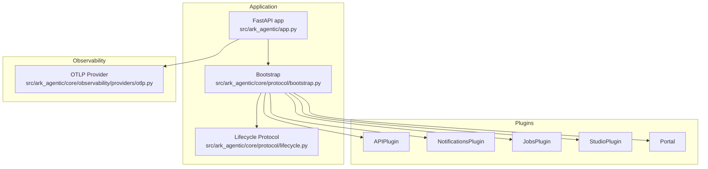
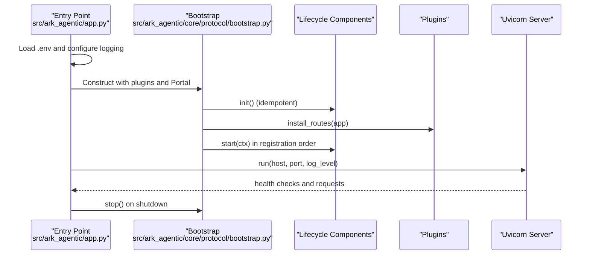
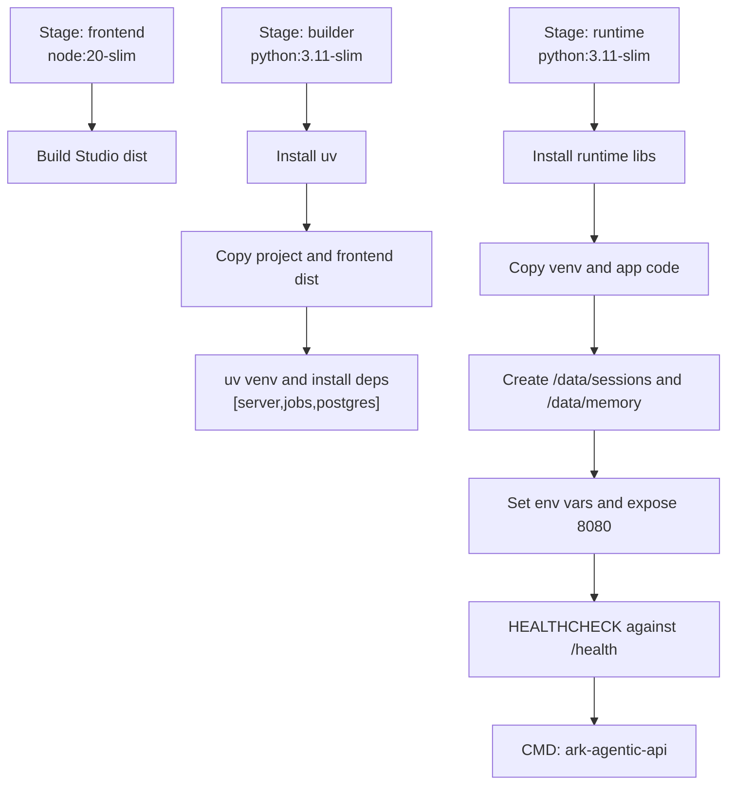
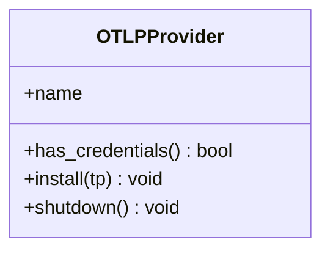
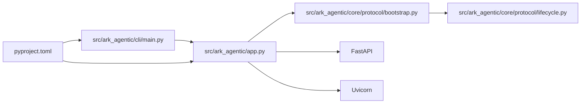

# Deployment and Operations

<cite>
**Referenced Files in This Document**
- [Dockerfile](file://Dockerfile)
- [pyproject.toml](file://pyproject.toml)
- [.env-sample](file://.env-sample)
- [src/ark_agentic/app.py](file://src/ark_agentic/app.py)
- [src/ark_agentic/cli/main.py](file://src/ark_agentic/cli/main.py)
- [src/ark_agentic/core/storage/__init__.py](file://src/ark_agentic/core/storage/__init__.py)
- [src/ark_agentic/core/observability/providers/otlp.py](file://src/ark_agentic/core/observability/providers/otlp.py)
- [src/ark_agentic/core/protocol/lifecycle.py](file://src/ark_agentic/core/protocol/lifecycle.py)
- [src/ark_agentic/core/protocol/bootstrap.py](file://src/ark_agentic/core/protocol/bootstrap.py)
- [scripts/publish.sh](file://scripts/publish.sh)
</cite>

## Table of Contents
1. [Introduction](#introduction)
2. [Project Structure](#project-structure)
3. [Core Components](#core-components)
4. [Architecture Overview](#architecture-overview)
5. [Detailed Component Analysis](#detailed-component-analysis)
6. [Dependency Analysis](#dependency-analysis)
7. [Performance Considerations](#performance-considerations)
8. [Troubleshooting Guide](#troubleshooting-guide)
9. [Conclusion](#conclusion)
10. [Appendices](#appendices)

## Introduction
This document provides comprehensive deployment and operations guidance for Ark Agentic. It focuses on containerized deployment, environment configuration, production monitoring, and operational runbooks. It covers Docker containerization strategies, multi-stage builds, orchestration patterns, environment variable configuration, secrets management, deployment topology options, monitoring and logging, backup and disaster recovery, scaling and high availability, maintenance and updates, and troubleshooting.

## Project Structure
Ark Agentic exposes a FastAPI application entrypoint and a CLI. The application loads environment variables, initializes logging, composes lifecycle components via a Bootstrap orchestrator, installs HTTP routes, and runs the Uvicorn server. The CLI supports scaffolding new projects and adding agents.

**Diagram sources**
- [src/ark_agentic/app.py:1-94](file://src/ark_agentic/app.py#L1-L94)
- [src/ark_agentic/core/protocol/bootstrap.py:1-29](file://src/ark_agentic/core/protocol/bootstrap.py#L1-L29)
- [src/ark_agentic/core/protocol/lifecycle.py:1-39](file://src/ark_agentic/core/protocol/lifecycle.py#L1-L39)
- [src/ark_agentic/core/observability/providers/otlp.py:1-39](file://src/ark_agentic/core/observability/providers/otlp.py#L1-L39)

**Section sources**
- [src/ark_agentic/app.py:1-94](file://src/ark_agentic/app.py#L1-L94)
- [src/ark_agentic/cli/main.py:1-222](file://src/ark_agentic/cli/main.py#L1-L222)

## Core Components
- Application entrypoint and server: The FastAPI app loads environment variables, sets up logging, constructs a Bootstrap with lifecycle components, installs routes, and runs Uvicorn on configured host/port.
- Bootstrap and lifecycle: A lifecycle-driven orchestrator initializes, starts, and stops components in a deterministic order, enabling modular composition and optional features.
- Observability: Pluggable tracing providers, including OTLP, are selected via environment variables for production monitoring.
- Storage abstraction: Hexagonal storage abstraction allows switching between file-based and database-backed storage modes via environment configuration.

**Section sources**
- [src/ark_agentic/app.py:1-94](file://src/ark_agentic/app.py#L1-L94)
- [src/ark_agentic/core/protocol/bootstrap.py:1-29](file://src/ark_agentic/core/protocol/bootstrap.py#L1-L29)
- [src/ark_agentic/core/protocol/lifecycle.py:1-39](file://src/ark_agentic/core/protocol/lifecycle.py#L1-L39)
- [src/ark_agentic/core/storage/__init__.py:1-9](file://src/ark_agentic/core/storage/__init__.py#L1-L9)

## Architecture Overview
The runtime architecture centers on a Bootstrap-driven lifecycle that composes framework components and plugins. The application exposes HTTP routes via APIPlugin and optionally Studio UI. Observability integrates through configurable providers.

**Diagram sources**
- [src/ark_agentic/app.py:1-94](file://src/ark_agentic/app.py#L1-L94)
- [src/ark_agentic/core/protocol/bootstrap.py:1-29](file://src/ark_agentic/core/protocol/bootstrap.py#L1-L29)
- [src/ark_agentic/core/protocol/lifecycle.py:1-39](file://src/ark_agentic/core/protocol/lifecycle.py#L1-L39)

## Detailed Component Analysis

### Containerization Strategy
- Multi-stage Docker build:
  - Frontend build stage: Node.js slim image compiles Studio frontend assets.
  - Builder stage: Python slim image with uv for fast dependency installation, creates a virtual environment, and installs optional extras for server, jobs, and Postgres support.
  - Runtime stage: Python slim image copies the virtual environment and application code, prepares persistent directories, exposes port 8080, defines health checks, and runs the CLI entrypoint.
- Persistent volumes: Dedicated directories for sessions and memory are created for SQLite persistence. Named volumes are recommended to avoid cross-filesystem WAL issues.
- Environment variables: Host, port, and storage directories are set via environment variables; health checks probe the local health endpoint.

**Diagram sources**
- [Dockerfile:1-75](file://Dockerfile#L1-L75)

**Section sources**
- [Dockerfile:1-75](file://Dockerfile#L1-L75)
- [pyproject.toml:19-35](file://pyproject.toml#L19-L35)

### Environment Configuration and Secrets Management
- Full environment variable surface is documented in the sample file, covering application settings, Studio authentication, sessions and memory directories, LLM provider configuration, observability backends, and optional service integrations.
- Secrets management recommendations:
  - Store sensitive values (e.g., auth secret, API keys) in platform-managed secret stores (e.g., Kubernetes Secrets, cloud provider KMS/secrets managers).
  - Mount secrets as environment variables or files and avoid committing secrets to source control.
  - Use distinct secrets per environment and rotate regularly.
- Environment-driven toggles:
  - Feature flags such as Studio enablement and job/notification subsystems are controlled via environment variables.
  - Storage mode selection is governed by an environment variable to switch between file and database backends.

**Section sources**
- [.env-sample:1-97](file://.env-sample#L1-L97)
- [src/ark_agentic/core/storage/__init__.py:1-9](file://src/ark_agentic/core/storage/__init__.py#L1-L9)

### Observability and Monitoring
- Tracing backends are selected via a comma-separated environment variable. Supported providers include Phoenix, Langfuse, console, and generic OTLP.
- OTLP provider automatically reads standard OpenTelemetry environment variables for endpoint and headers.
- Configure tracing endpoints and credentials per backend; disable tracing by leaving the variable unset or empty.

**Diagram sources**
- [src/ark_agentic/core/observability/providers/otlp.py:1-39](file://src/ark_agentic/core/observability/providers/otlp.py#L1-L39)

**Section sources**
- [.env-sample:44-62](file://.env-sample#L44-L62)
- [src/ark_agentic/core/observability/providers/otlp.py:1-39](file://src/ark_agentic/core/observability/providers/otlp.py#L1-L39)

### Deployment Topologies and Orchestration Patterns
- Single-container deployment:
  - Run the container with persistent volumes for sessions and memory, exposing port 8080.
  - Configure environment variables for host, port, storage directories, and observability.
- Horizontal scaling:
  - Stateless API server; scale replicas behind a load balancer.
  - Use sticky sessions only if required by specific clients; otherwise distribute traffic round-robin.
- Database-backed storage:
  - Switch storage mode to Postgres-compatible backend by setting the appropriate environment variable and providing connection strings.
  - Use managed Postgres for high availability and backups.
- Sidecar patterns:
  - Optionally deploy a sidecar for background jobs or notifications if enabled via environment variables.

**Section sources**
- [Dockerfile:53-71](file://Dockerfile#L53-L71)
- [src/ark_agentic/core/storage/__init__.py:1-9](file://src/ark_agentic/core/storage/__init__.py#L1-9)

### Operational Runbook: Monitoring, Logging, Backup, Disaster Recovery
- Monitoring:
  - Enable tracing backends via environment variables and configure exporters accordingly.
  - Use health checks defined in the container to detect unresponsive instances.
- Logging:
  - Configure log level via environment variable; ensure logs are aggregated centrally (e.g., syslog, stdout/stderr redirection to log collectors).
- Backup:
  - Persist sessions and memory directories to named volumes or persistent disks.
  - Schedule regular snapshots of persistent volumes or export database schemas and data as needed.
- Disaster Recovery:
  - Maintain immutable artifacts (container images) and declarative configurations.
  - Restore from latest backups and reattach volumes; validate health checks and tracing connectivity after restore.

**Section sources**
- [Dockerfile:69-71](file://Dockerfile#L69-L71)
- [.env-sample:6, 44-62](file://.env-sample#L6, 44-62)

### Scaling, Load Balancing, and High Availability
- Stateless API: Scale horizontally by increasing replicas; ensure shared storage for sessions/memory or use a database backend.
- Load balancing:
  - Place a reverse proxy or cloud load balancer in front of the API pods/nodes.
  - Use health probes to remove unhealthy instances.
- High availability:
  - Deploy across multiple availability zones with replicated persistent volumes or managed databases.
  - Use rolling updates with readiness probes to minimize downtime.

**Section sources**
- [Dockerfile:61-67](file://Dockerfile#L61-L67)
- [src/ark_agentic/core/storage/__init__.py:1-9](file://src/ark_agentic/core/storage/__init__.py#L1-9)

### Maintenance, Updates, and Rollback
- Build and distribution:
  - The repository includes a script to build and publish the core wheel artifact with the Studio frontend included.
  - The build process compiles the frontend and uses uv for dependency installation.
- Update strategy:
  - Tag releases and push container images to a registry.
  - Perform rolling updates with health checks and canary deployments.
- Rollback:
  - Keep previous image tags available; roll back by redeploying the prior tag.
  - For database schema changes, maintain migration scripts and keep a manual downgrade procedure documented.

**Section sources**
- [scripts/publish.sh:1-76](file://scripts/publish.sh#L1-L76)
- [pyproject.toml:40-41](file://pyproject.toml#L40-L41)

### Troubleshooting Guide
- Container fails health checks:
  - Verify the health endpoint is reachable from within the container and that environment variables for host and port are correct.
  - Confirm that the application started successfully and that tracing configuration does not block startup.
- Missing or corrupted sessions/memory:
  - Ensure persistent volumes are mounted to the expected directories and that permissions allow writing.
  - Prefer named volumes to avoid cross-filesystem WAL issues.
- Tracing not exporting:
  - Validate that the tracing environment variable includes the intended provider(s) and that required credentials/endpoints are set.
  - For OTLP, confirm endpoint and headers are present.
- Storage mode mismatch:
  - If switching to database-backed storage, ensure the storage mode environment variable is set and the connection string is valid.

**Section sources**
- [Dockerfile:69-71](file://Dockerfile#L69-L71)
- [Dockerfile:53-56](file://Dockerfile#L53-L56)
- [.env-sample:44-62](file://.env-sample#L44-L62)
- [src/ark_agentic/core/storage/__init__.py:1-9](file://src/ark_agentic/core/storage/__init__.py#L1-9)

## Dependency Analysis
The application depends on FastAPI and Uvicorn for serving, and on lifecycle components for initialization and routing. Optional extras enable jobs, notifications, and database drivers. The CLI provides project scaffolding and agent addition.

**Diagram sources**
- [src/ark_agentic/app.py:1-94](file://src/ark_agentic/app.py#L1-L94)
- [src/ark_agentic/cli/main.py:1-222](file://src/ark_agentic/cli/main.py#L1-L222)
- [pyproject.toml:19-35](file://pyproject.toml#L19-L35)

**Section sources**
- [src/ark_agentic/app.py:1-94](file://src/ark_agentic/app.py#L1-L94)
- [src/ark_agentic/cli/main.py:1-222](file://src/ark_agentic/cli/main.py#L1-L222)
- [pyproject.toml:19-35](file://pyproject.toml#L19-L35)

## Performance Considerations
- Container image size and startup time:
  - Multi-stage build reduces runtime image size and improves cold start characteristics.
- Dependency management:
  - Using uv accelerates dependency resolution and installation.
- Observability overhead:
  - Disable tracing or reduce batch sizes when under heavy load; ensure exporters are configured efficiently.
- Storage I/O:
  - Use named volumes for SQLite persistence to avoid cross-filesystem WAL issues; consider migrating to a database backend for high concurrency.

**Section sources**
- [Dockerfile:12-34](file://Dockerfile#L12-L34)
- [pyproject.toml:77-78](file://pyproject.toml#L77-L78)

## Troubleshooting Guide
Common issues and resolutions:
- Health check failures:
  - Confirm API_HOST and API_PORT are set correctly and that the container exposes the expected port.
- Missing Studio UI:
  - Ensure Studio is enabled via environment variable and that the frontend dist is bundled in the image.
- Authentication token invalidation:
  - Provide a stable token secret in production; otherwise, restarts invalidate tokens.
- LLM provider misconfiguration:
  - Verify provider, model name, and API key; ensure base URL is set appropriately for non-OpenAI providers.
- Observability misconfiguration:
  - Set the tracing variable to include the desired providers and ensure required credentials are present.

**Section sources**
- [Dockerfile:61-67](file://Dockerfile#L61-L67)
- [.env-sample:9, 17-18](file://.env-sample#L9, 17-18)
- [.env-sample:25-39](file://.env-sample#L25-39)
- [.env-sample:44-62](file://.env-sample#L44-L62)

## Conclusion
Ark Agentic offers a container-first, lifecycle-driven architecture suitable for production deployment. The multi-stage Docker build, environment-driven configuration, and pluggable observability make it straightforward to operate reliably at scale. By following the operational guidance herein—covering containerization, environment management, monitoring, backup, scaling, and troubleshooting—you can achieve robust, secure, and maintainable deployments across diverse environments.

## Appendices

### Appendix A: Environment Variables Reference
- Application: LOG_LEVEL, API_HOST, API_PORT, ENABLE_STUDIO, AGENTS_ROOT
- Studio Auth/Users: STUDIO_AUTH_PROVIDERS, STUDIO_AUTH_TOKEN_SECRET, STUDIO_AUTH_TOKEN_TTL_SECONDS
- Sessions and Memory: SESSIONS_DIR, MEMORY_DIR
- LLM: LLM_PROVIDER, MODEL_NAME, API_KEY, LLM_BASE_URL
- Observability: TRACING, PHOENIX_COLLECTOR_ENDPOINT, LANGFUSE_PUBLIC_KEY, LANGFUSE_SECRET_KEY, LANGFUSE_HOST, OTEL_EXPORTER_OTLP_ENDPOINT, OTEL_EXPORTER_OTLP_HEADERS
- Storage Mode: DB_TYPE, DB_CONNECTION_STR
- Services: DATA_SERVICE_MOCK, DATA_SERVICE_URL, SECURITIES_SERVICE_MOCK, SECURITIES_ACCOUNT_TYPE, and related service URLs and auth headers

**Section sources**
- [.env-sample:1-97](file://.env-sample#L1-L97)
