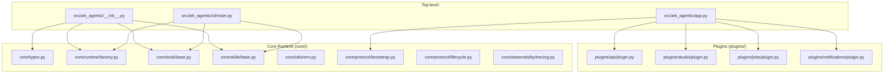
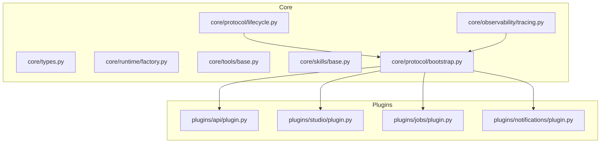
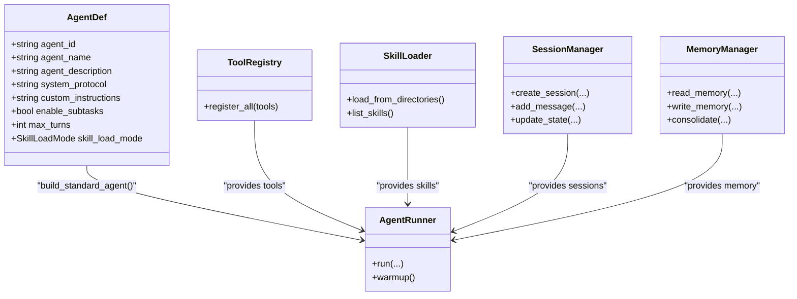
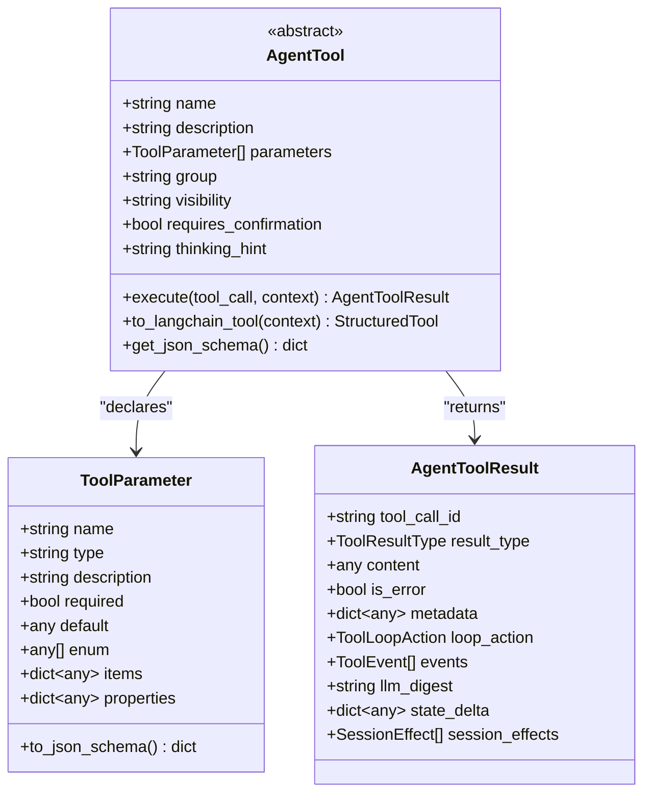
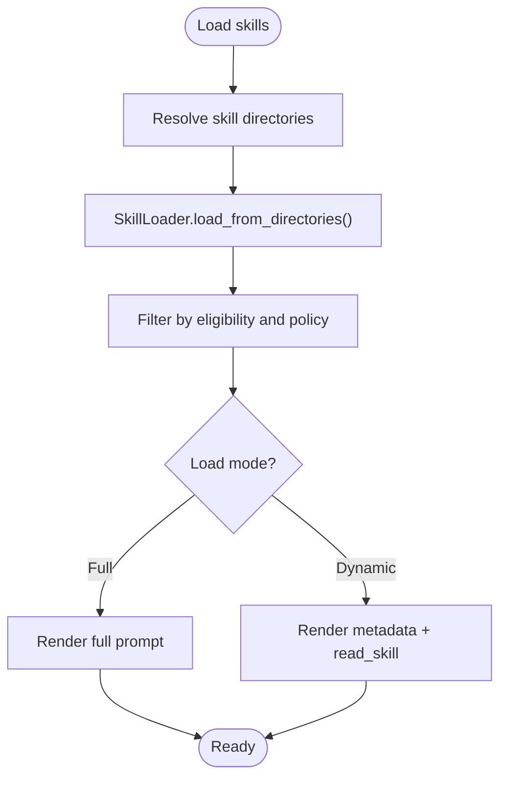
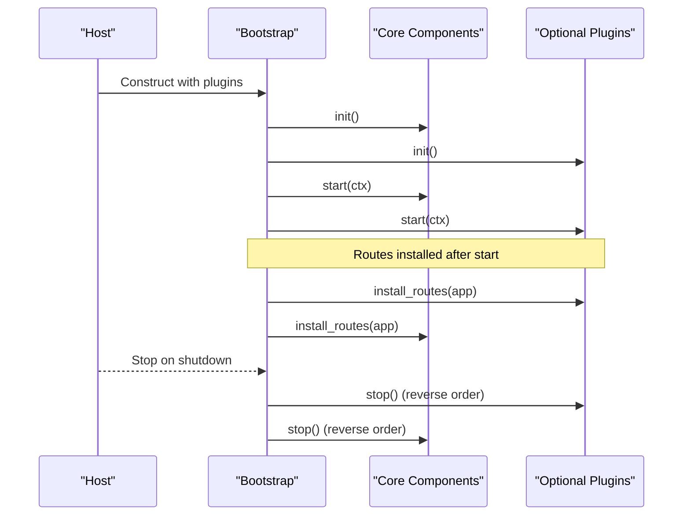
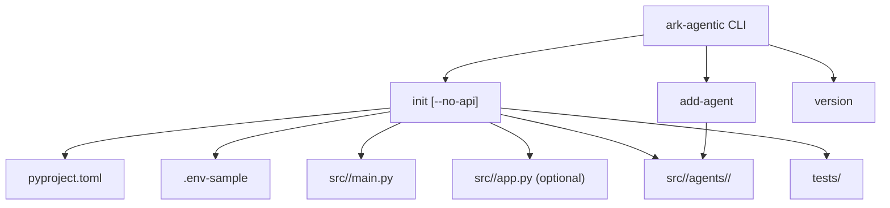
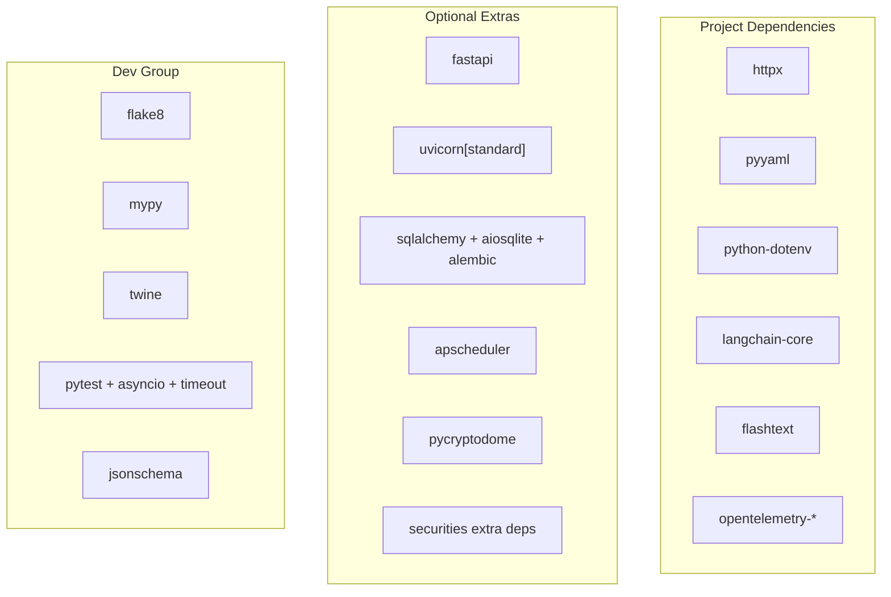

# Development Guidelines

<cite>
**Referenced Files in This Document**
- [README.md](file://README.md)
- [pyproject.toml](file://pyproject.toml)
- [src/ark_agentic/__init__.py](file://src/ark_agentic/__init__.py)
- [src/ark_agentic/app.py](file://src/ark_agentic/app.py)
- [src/ark_agentic/core/types.py](file://src/ark_agentic/core/types.py)
- [src/ark_agentic/core/utils/env.py](file://src/ark_agentic/core/utils/env.py)
- [src/ark_agentic/core/protocol/bootstrap.py](file://src/ark_agentic/core/protocol/bootstrap.py)
- [src/ark_agentic/core/protocol/lifecycle.py](file://src/ark_agentic/core/protocol/lifecycle.py)
- [src/ark_agentic/core/runtime/factory.py](file://src/ark_agentic/core/runtime/factory.py)
- [src/ark_agentic/core/tools/base.py](file://src/ark_agentic/core/tools/base.py)
- [src/ark_agentic/core/skills/base.py](file://src/ark_agentic/core/skills/base.py)
- [src/ark_agentic/cli/main.py](file://src/ark_agentic/cli/main.py)
- [tests/conftest.py](file://tests/conftest.py)
- [src/ark_agentic/core/observability/tracing.py](file://src/ark_agentic/core/observability/tracing.py)
- [docs/architecture-c4.md](file://docs/architecture-c4.md)
</cite>

## Table of Contents
1. [Introduction](#introduction)
2. [Project Structure](#project-structure)
3. [Core Components](#core-components)
4. [Architecture Overview](#architecture-overview)
5. [Detailed Component Analysis](#detailed-component-analysis)
6. [Dependency Analysis](#dependency-analysis)
7. [Performance Considerations](#performance-considerations)
8. [Security Guidelines](#security-guidelines)
9. [Accessibility Requirements](#accessibility-requirements)
10. [Development Workflows](#development-workflows)
11. [Testing and Quality Assurance](#testing-and-quality-assurance)
12. [Documentation Standards](#documentation-standards)
13. [Code Review and Release Procedures](#code-review-and-release-procedures)
14. [Contributing New Agents, Tools, and Plugins](#contributing-new-agents-tools-and-plugins)
15. [Troubleshooting Guide](#troubleshooting-guide)
16. [Conclusion](#conclusion)

## Introduction
This document defines comprehensive development guidelines for contributing to Ark Agentic. It covers code standards, type hinting requirements, architectural patterns, development environment setup, testing and QA processes, and best practices for building agents, tools, and plugins while maintaining framework consistency. It also outlines performance, security, and accessibility considerations, along with design principles, architectural constraints, decision-making processes, examples of well-structured contributions, common pitfalls, and mentorship resources.

## Project Structure
Ark Agentic is organized around a core runtime (core/) and optional plugins (plugins/), with a CLI scaffolding layer (cli/) and example agents (agents/). The repository exposes a public API surface via a concise top-level package initializer and a unified FastAPI entrypoint for server deployments.

**Diagram sources**
- [src/ark_agentic/__init__.py:1-93](file://src/ark_agentic/__init__.py#L1-L93)
- [src/ark_agentic/app.py:1-94](file://src/ark_agentic/app.py#L1-L94)
- [src/ark_agentic/cli/main.py:1-222](file://src/ark_agentic/cli/main.py#L1-L222)
- [src/ark_agentic/core/types.py:1-513](file://src/ark_agentic/core/types.py#L1-L513)
- [src/ark_agentic/core/runtime/factory.py:1-183](file://src/ark_agentic/core/runtime/factory.py#L1-L183)
- [src/ark_agentic/core/tools/base.py:1-289](file://src/ark_agentic/core/tools/base.py#L1-L289)
- [src/ark_agentic/core/skills/base.py:1-344](file://src/ark_agentic/core/skills/base.py#L1-L344)
- [src/ark_agentic/core/utils/env.py:1-76](file://src/ark_agentic/core/utils/env.py#L1-L76)
- [src/ark_agentic/core/protocol/bootstrap.py:1-162](file://src/ark_agentic/core/protocol/bootstrap.py#L1-L162)
- [src/ark_agentic/core/protocol/lifecycle.py:1-91](file://src/ark_agentic/core/protocol/lifecycle.py#L1-L91)
- [src/ark_agentic/core/observability/tracing.py:1-119](file://src/ark_agentic/core/observability/tracing.py#L1-L119)

**Section sources**
- [README.md:300-344](file://README.md#L300-L344)
- [src/ark_agentic/app.py:1-94](file://src/ark_agentic/app.py#L1-L94)
- [src/ark_agentic/__init__.py:1-93](file://src/ark_agentic/__init__.py#L1-L93)

## Core Components
- Agent runtime and orchestration: AgentRunner, SessionManager, RunnerConfig, and related types define the execution model and session lifecycle.
- Tooling: AgentTool base class, ToolRegistry, and parameter helpers provide a standardized interface for capabilities.
- Skills: SkillConfig, eligibility checks, and rendering utilities support dynamic skill loading and prompting.
- Environment and paths: Utilities to resolve agent roots and validate agent directories.
- Lifecycle and Bootstrap: A uniform lifecycle protocol and orchestrator for composing plugins and core components.
- Observability: Tracing setup driven by environment variables with multiple provider backends.

Key type definitions include message roles, tool result types, tool events, tool calls, agent messages, session entries, token usage, and session effects.

**Section sources**
- [src/ark_agentic/core/types.py:1-513](file://src/ark_agentic/core/types.py#L1-L513)
- [src/ark_agentic/core/tools/base.py:1-289](file://src/ark_agentic/core/tools/base.py#L1-L289)
- [src/ark_agentic/core/skills/base.py:1-344](file://src/ark_agentic/core/skills/base.py#L1-L344)
- [src/ark_agentic/core/utils/env.py:1-76](file://src/ark_agentic/core/utils/env.py#L1-L76)
- [src/ark_agentic/core/protocol/lifecycle.py:1-91](file://src/ark_agentic/core/protocol/lifecycle.py#L1-L91)
- [src/ark_agentic/core/protocol/bootstrap.py:1-162](file://src/ark_agentic/core/protocol/bootstrap.py#L1-L162)
- [src/ark_agentic/core/observability/tracing.py:1-119](file://src/ark_agentic/core/observability/tracing.py#L1-L119)

## Architecture Overview
Ark Agentic follows a Core + Plugin architecture:
- Core (core/) provides the runtime backbone: AgentRunner, session/memory, tools/skills, streaming, LLM integration, observability, and storage abstraction.
- Plugins (plugins/) are optional, user-selectable features mounted via Bootstrap. They initialize schemas, mount routes, and publish context objects for inter-plugin communication.

**Diagram sources**
- [src/ark_agentic/core/protocol/bootstrap.py:1-162](file://src/ark_agentic/core/protocol/bootstrap.py#L1-L162)
- [src/ark_agentic/core/protocol/lifecycle.py:1-91](file://src/ark_agentic/core/protocol/lifecycle.py#L1-L91)
- [src/ark_agentic/core/observability/tracing.py:1-119](file://src/ark_agentic/core/observability/tracing.py#L1-L119)

**Section sources**
- [README.md:300-344](file://README.md#L300-L344)
- [docs/architecture-c4.md:16-86](file://docs/architecture-c4.md#L16-L86)

## Detailed Component Analysis

### Agent Factory and Runtime
The agent factory composes an AgentRunner from an AgentDef, tools, skills, and runtime options. It wires session management, memory, skill loaders, and sampling configuration.

**Diagram sources**
- [src/ark_agentic/core/runtime/factory.py:35-183](file://src/ark_agentic/core/runtime/factory.py#L35-L183)
- [src/ark_agentic/core/tools/base.py:46-117](file://src/ark_agentic/core/tools/base.py#L46-L117)
- [src/ark_agentic/core/skills/base.py:19-50](file://src/ark_agentic/core/skills/base.py#L19-L50)

**Section sources**
- [src/ark_agentic/core/runtime/factory.py:59-183](file://src/ark_agentic/core/runtime/factory.py#L59-L183)

### Tool System
AgentTool defines a standardized interface for capabilities. Tools declare parameters via ToolParameter and provide JSON schema metadata for function calling. Helpers read typed parameters safely.

**Diagram sources**
- [src/ark_agentic/core/tools/base.py:46-117](file://src/ark_agentic/core/tools/base.py#L46-L117)
- [src/ark_agentic/core/tools/base.py:16-44](file://src/ark_agentic/core/tools/base.py#L16-L44)
- [src/ark_agentic/core/types.py:87-236](file://src/ark_agentic/core/types.py#L87-L236)

**Section sources**
- [src/ark_agentic/core/tools/base.py:169-289](file://src/ark_agentic/core/tools/base.py#L169-L289)

### Skill System
Skills are loaded from directories, filtered by eligibility, and rendered into prompts. Dynamic vs full modes control how skills are presented to the LLM.

**Diagram sources**
- [src/ark_agentic/core/skills/base.py:51-138](file://src/ark_agentic/core/skills/base.py#L51-L138)
- [src/ark_agentic/core/skills/base.py:242-304](file://src/ark_agentic/core/skills/base.py#L242-L304)

**Section sources**
- [src/ark_agentic/core/skills/base.py:19-50](file://src/ark_agentic/core/skills/base.py#L19-L50)

### Lifecycle and Bootstrap
Bootstrap orchestrates components through init/start/stop, ensuring deterministic ordering and safe teardown. Plugins implement the Lifecycle protocol and are mounted by Bootstrap.

**Diagram sources**
- [src/ark_agentic/core/protocol/bootstrap.py:115-162](file://src/ark_agentic/core/protocol/bootstrap.py#L115-L162)
- [src/ark_agentic/core/protocol/lifecycle.py:23-66](file://src/ark_agentic/core/protocol/lifecycle.py#L23-L66)

**Section sources**
- [src/ark_agentic/core/protocol/bootstrap.py:48-162](file://src/ark_agentic/core/protocol/bootstrap.py#L48-L162)
- [src/ark_agentic/core/protocol/lifecycle.py:23-91](file://src/ark_agentic/core/protocol/lifecycle.py#L23-L91)

### CLI and Project Scaffolding
The CLI generates project skeletons, adds agents, and prints versions. It renders templates for pyproject, main module, agent module, tools, and environment samples.

**Diagram sources**
- [src/ark_agentic/cli/main.py:53-114](file://src/ark_agentic/cli/main.py#L53-L114)
- [src/ark_agentic/cli/main.py:117-168](file://src/ark_agentic/cli/main.py#L117-L168)

**Section sources**
- [src/ark_agentic/cli/main.py:1-222](file://src/ark_agentic/cli/main.py#L1-L222)

## Dependency Analysis
The project’s dependency configuration and grouping inform development and testing workflows. The build targets exclude certain assets from wheels to keep the distribution minimal and focused on framework capabilities.

**Diagram sources**
- [pyproject.toml:7-39](file://pyproject.toml#L7-L39)
- [pyproject.toml:80-96](file://pyproject.toml#L80-L96)

**Section sources**
- [pyproject.toml:65-96](file://pyproject.toml#L65-L96)

## Performance Considerations
- Single-worker default: In-process mirrors (SessionManager._sessions, MemoryManager._memory) provide near 100% hit rates, eliminating cross-process cache overhead until Redis/PG is introduced.
- Context compression: Compaction reduces token usage while preserving recent context.
- Streaming and observability: Tracing is off by default and can be enabled selectively; LLM instrumentation is auto-enabled when providers are configured.

**Section sources**
- [docs/architecture-c4.md:359-400](file://docs/architecture-c4.md#L359-L400)
- [src/ark_agentic/core/runtime/factory.py:132-141](file://src/ark_agentic/core/runtime/factory.py#L132-L141)
- [src/ark_agentic/core/observability/tracing.py:56-99](file://src/ark_agentic/core/observability/tracing.py#L56-L99)

## Security Guidelines
- Environment-driven configuration: Use environment variables for secrets and feature toggles; avoid hardcoding credentials.
- Path resolution: Validate agent directories and prevent path traversal when resolving agents_root and agent_id.
- Optional dependencies: Tests mock optional heavy modules to avoid security-sensitive installations during CI.

**Section sources**
- [src/ark_agentic/core/utils/env.py:55-76](file://src/ark_agentic/core/utils/env.py#L55-L76)
- [tests/conftest.py:19-36](file://tests/conftest.py#L19-L36)

## Accessibility Requirements
- A2UI components: Tools can emit UIComponentToolEvent to render frontend components; ensure content adheres to accessible UI patterns and schema contracts.
- Observability: Enable tracing providers to capture spans for debugging and monitoring without impacting production latency.

**Section sources**
- [src/ark_agentic/core/types.py:60-69](file://src/ark_agentic/core/types.py#L60-L69)
- [src/ark_agentic/core/observability/tracing.py:35-54](file://src/ark_agentic/core/observability/tracing.py#L35-L54)

## Development Workflows
- Local setup: Install dependencies, optionally build Studio frontend, and run CLI/API/pytest.
- Verify changes: Test CLI scaffolding, API demo, and unit/integration tests.
- Environment variables: Configure LLM, API, Studio, and observability via .env.

Recommended commands:
- Initialize a project: ark-agentic init <project_name>
- Add an agent: ark-agentic add-agent <agent_name>
- Run API demo: uv run python -m ark_agentic.app
- Run tests: uv run pytest

**Section sources**
- [README.md:241-271](file://README.md#L241-L271)
- [README.md:397-442](file://README.md#L397-L442)

## Testing and Quality Assurance
- Test configuration: conftest mocks optional modules and provides fixtures for sessions and Studio auth.
- Timeout and markers: pytest configuration enforces timeouts and slow-test markers.
- Coverage: Focus on unit tests for core modules, integration tests for plugins, and end-to-end tests for memory and subtasks.

**Section sources**
- [tests/conftest.py:19-101](file://tests/conftest.py#L19-L101)
- [pyproject.toml:65-73](file://pyproject.toml#L65-L73)

## Documentation Standards
- Keep README as the primary entry point for both business and framework developers.
- Use clear headings, diagrams, and references to source files.
- Document environment variables, CLI usage, and architectural decisions.

**Section sources**
- [README.md:1-445](file://README.md#L1-L445)
- [docs/architecture-c4.md:1-565](file://docs/architecture-c4.md#L1-L565)

## Code Review and Release Procedures
- Review checklist:
  - Adheres to Core + Plugin separation
  - Uses Lifecycle/Bootstrap for plugin composition
  - Respects environment-driven configuration
  - Includes tests and documentation updates
- Release:
  - Build and upload Python package via scripts/publish.sh
  - Ensure Studio frontend is built before publishing

**Section sources**
- [README.md:279-298](file://README.md#L279-L298)

## Contributing New Agents, Tools, and Plugins
- New Agent:
  - Use CLI to scaffold or add-agent
  - Define AgentDef, tools, and skills
  - Register agent in the project’s app.py
- New Tool:
  - Subclass AgentTool
  - Define ToolParameter list and execute method
  - Provide JSON schema via get_json_schema()
- New Plugin:
  - Implement Lifecycle-compatible component
  - Mount routes in install_routes
  - Publish context objects via start(ctx)

**Section sources**
- [src/ark_agentic/cli/main.py:117-168](file://src/ark_agentic/cli/main.py#L117-L168)
- [src/ark_agentic/core/tools/base.py:46-117](file://src/ark_agentic/core/tools/base.py#L46-L117)
- [src/ark_agentic/core/protocol/lifecycle.py:23-66](file://src/ark_agentic/core/protocol/lifecycle.py#L23-L66)

## Troubleshooting Guide
- Environment issues:
  - Ensure .env-sample is copied and filled with LLM credentials
  - Verify TRACING selection and provider credentials
- Path and agent resolution:
  - Confirm AGENTS_ROOT and agent_id correctness
- Tests failing due to optional modules:
  - conftest mocks missing modules; install optional dependencies if needed

**Section sources**
- [tests/conftest.py:19-36](file://tests/conftest.py#L19-L36)
- [src/ark_agentic/core/utils/env.py:20-53](file://src/ark_agentic/core/utils/env.py#L20-L53)
- [src/ark_agentic/core/observability/tracing.py:35-54](file://src/ark_agentic/core/observability/tracing.py#L35-L54)

## Conclusion
These guidelines establish a consistent development process across business applications and framework maintenance. By following the Core + Plugin architecture, respecting environment-driven configuration, and leveraging standardized types, tools, and lifecycle patterns, contributors can build reliable, observable, and maintainable extensions to Ark Agentic.