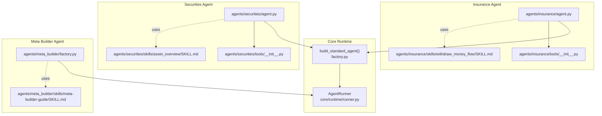
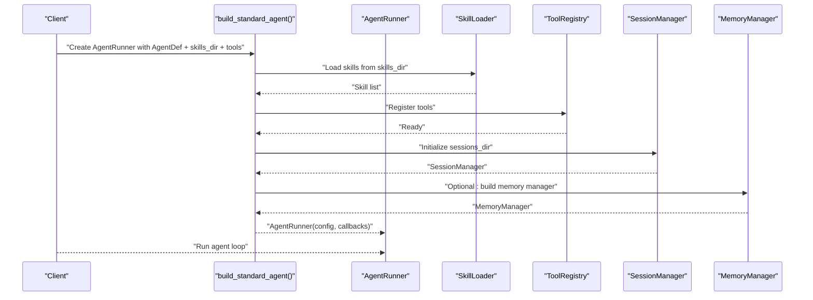
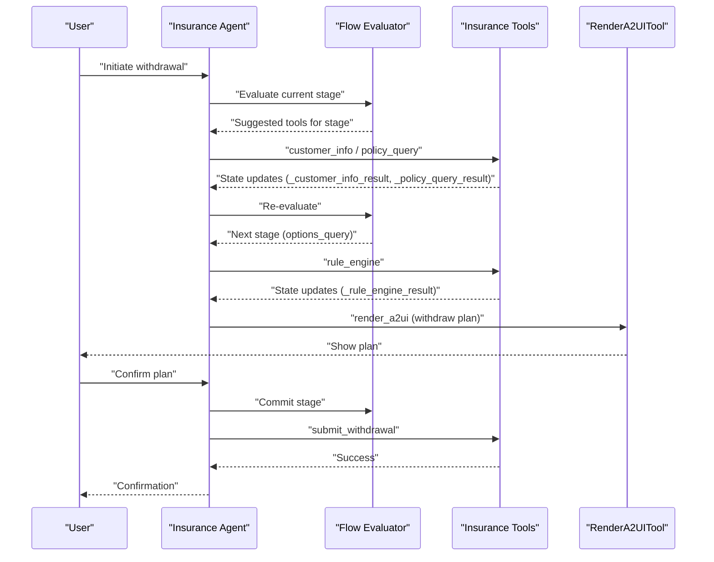
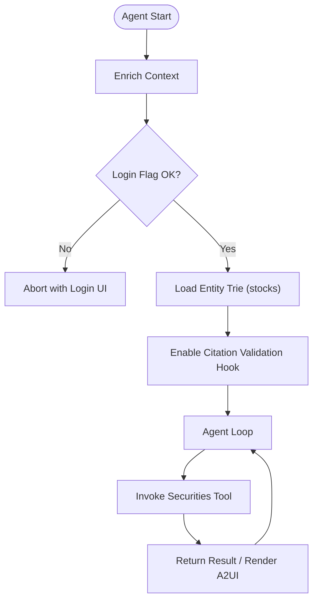
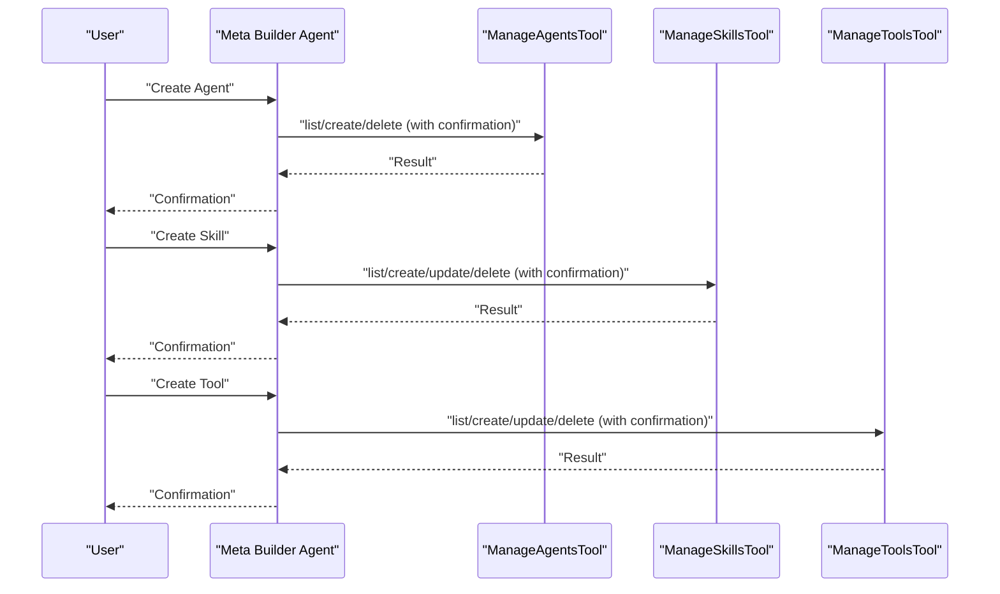
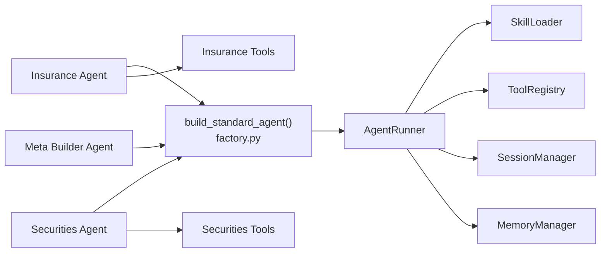

# Domain-Specific Agents

<cite>
**Referenced Files in This Document**
- [agent.py](file://src/ark_agentic/agents/insurance/agent.py)
- [agent.json](file://src/ark_agentic/agents/insurance/agent.json)
- [tools/__init__.py](file://src/ark_agentic/agents/insurance/tools/__init__.py)
- [policy_query.py](file://src/ark_agentic/agents/insurance/tools/policy_query.py)
- [SKILL.md](file://src/ark_agentic/agents/insurance/skills/withdraw_money_flow/SKILL.md)
- [agent.py](file://src/ark_agentic/agents/securities/agent.py)
- [agent.json](file://src/ark_agentic/agents/securities/agent.json)
- [tools/__init__.py](file://src/ark_agentic/agents/securities/tools/__init__.py)
- [account_overview.py](file://src/ark_agentic/agents/securities/tools/agent/account_overview.py)
- [SKILL.md](file://src/ark_agentic/agents/securities/skills/asset_overview/SKILL.md)
- [factory.py](file://src/ark_agentic/agents/meta_builder/factory.py)
- [agent.json](file://src/ark_agentic/agents/meta_builder/agent.json)
- [SKILL.md](file://src/ark_agentic/agents/meta_builder/skills/meta-builder-guide/SKILL.md)
- [factory.py](file://src/ark_agentic/core/runtime/factory.py)
</cite>

## Table of Contents
1. [Introduction](#introduction)
2. [Project Structure](#project-structure)
3. [Core Components](#core-components)
4. [Architecture Overview](#architecture-overview)
5. [Detailed Component Analysis](#detailed-component-analysis)
6. [Dependency Analysis](#dependency-analysis)
7. [Performance Considerations](#performance-considerations)
8. [Troubleshooting Guide](#troubleshooting-guide)
9. [Conclusion](#conclusion)
10. [Appendices](#appendices)

## Introduction
This document explains the domain-specific agent implementations for insurance and securities, and the meta-builder agent that dynamically creates and manages agents. It focuses on how the framework enables domain customization while reusing common infrastructure, and documents the specialized workflows, tools, skills, and validation mechanisms for each domain. Practical guidance is included for extending the framework with new domain agents, sharing utilities, and implementing common agent behaviors.

## Project Structure
The agents are organized by domain under a shared runtime and tooling framework. Each domain agent defines:
- An agent entrypoint that builds a standardized AgentRunner via a convention-driven factory
- A skills directory containing domain-specific skills
- A tools directory containing domain-specific tools and optional service adapters
- Optional A2UI presets or templates for rendering structured UI cards
- Optional validation hooks and guards integrated into the AgentRunner lifecycle

**Diagram sources**
- [factory.py:59-182](file://src/ark_agentic/core/runtime/factory.py#L59-L182)
- [agent.py:47-75](file://src/ark_agentic/agents/insurance/agent.py#L47-L75)
- [tools/__init__.py:77-110](file://src/ark_agentic/agents/insurance/tools/__init__.py#L77-L110)
- [SKILL.md:1-61](file://src/ark_agentic/agents/insurance/skills/withdraw_money_flow/SKILL.md#L1-L61)
- [agent.py:72-100](file://src/ark_agentic/agents/securities/agent.py#L72-L100)
- [tools/__init__.py:48-66](file://src/ark_agentic/agents/securities/tools/__init__.py#L48-L66)
- [SKILL.md:1-186](file://src/ark_agentic/agents/securities/skills/asset_overview/SKILL.md#L1-L186)
- [factory.py:36-100](file://src/ark_agentic/agents/meta_builder/factory.py#L36-L100)
- [SKILL.md:1-56](file://src/ark_agentic/agents/meta_builder/skills/meta-builder-guide/SKILL.md#L1-L56)

**Section sources**
- [factory.py:35-182](file://src/ark_agentic/core/runtime/factory.py#L35-L182)
- [agent.py:11-75](file://src/ark_agentic/agents/insurance/agent.py#L11-L75)
- [tools/__init__.py:13-110](file://src/ark_agentic/agents/insurance/tools/__init__.py#L13-L110)
- [SKILL.md:1-61](file://src/ark_agentic/agents/insurance/skills/withdraw_money_flow/SKILL.md#L1-L61)
- [agent.py:11-100](file://src/ark_agentic/agents/securities/agent.py#L11-L100)
- [tools/__init__.py:1-66](file://src/ark_agentic/agents/securities/tools/__init__.py#L1-L66)
- [SKILL.md:1-186](file://src/ark_agentic/agents/securities/skills/asset_overview/SKILL.md#L1-L186)
- [factory.py:1-100](file://src/ark_agentic/agents/meta_builder/factory.py#L1-L100)
- [SKILL.md:1-56](file://src/ark_agentic/agents/meta_builder/skills/meta-builder-guide/SKILL.md#L1-L56)

## Core Components
- Standardized Agent Construction
  - The framework provides a convention-over-configuration factory that builds an AgentRunner from a declarative AgentDef, loading skills, registering tools, configuring session/memory, and wiring callbacks.
  - Insurance and Securities agents both delegate to this factory, passing domain-specific skills and tools.
- Domain Agents
  - Insurance Agent: Withdrawal processing, policy management, risk assessment integration, and A2UI rendering.
  - Securities Agent: Asset management, mock data system, and validation framework for financial data.
  - Meta Builder Agent: Dynamic agent creation and management via composite tools and a built-in guide skill.

Key implementation patterns:
- Tools encapsulate domain operations and integrate with service adapters or mock loaders.
- Skills define structured workflows and tool contracts for each domain.
- Validation hooks and guards enforce authentication and data citation policies.

**Section sources**
- [factory.py:35-182](file://src/ark_agentic/core/runtime/factory.py#L35-L182)
- [agent.py:38-75](file://src/ark_agentic/agents/insurance/agent.py#L38-L75)
- [tools/__init__.py:77-110](file://src/ark_agentic/agents/insurance/tools/__init__.py#L77-L110)
- [agent.py:41-100](file://src/ark_agentic/agents/securities/agent.py#L41-L100)
- [tools/__init__.py:48-66](file://src/ark_agentic/agents/securities/tools/__init__.py#L48-L66)
- [factory.py:36-100](file://src/ark_agentic/agents/meta_builder/factory.py#L36-L100)

## Architecture Overview
The runtime architecture composes a reusable AgentRunner with domain-specific skills and tools. Callbacks enrich context, enforce authentication, and validate citations. The factory centralizes configuration and reduces boilerplate across domains.

**Diagram sources**
- [factory.py:59-182](file://src/ark_agentic/core/runtime/factory.py#L59-L182)

## Detailed Component Analysis

### Insurance Agent
The insurance agent orchestrates withdrawal processing, policy management, and risk assessment integration, with A2UI rendering and flow evaluation.

- Agent Entrypoint
  - Declares system protocol and enables subtasks; builds AgentRunner via the standard factory with domain skills and tools.
- Tools
  - PolicyQueryTool: queries policy lists/details and cash Surrender Value; updates state for downstream steps.
  - RuleEngineTool: computes and compares withdrawal options; integrates risk assessment.
  - CustomerInfoTool: retrieves identity, contact, beneficiaries, and transaction history.
  - SubmitWithdrawalTool: finalizes withdrawal submission.
  - RenderA2UITool: renders structured UI cards for plans and summaries.
  - CommitFlowStageTool and ResumeTaskTool: support SOP flow progression and cross-session recovery.
- Skills
  - Withdraw Money Flow (Agentic Native Flow): a 4-stage SOP (identity verification → options query → plan confirmation → execute) with stage commitment and recovery.
- A2UI Integration
  - Domain-specific components and themes; state keys track intermediate results.

**Diagram sources**
- [SKILL.md:24-61](file://src/ark_agentic/agents/insurance/skills/withdraw_money_flow/SKILL.md#L24-L61)
- [tools/__init__.py:77-110](file://src/ark_agentic/agents/insurance/tools/__init__.py#L77-L110)
- [policy_query.py:25-77](file://src/ark_agentic/agents/insurance/tools/policy_query.py#L25-L77)

**Section sources**
- [agent.py:38-75](file://src/ark_agentic/agents/insurance/agent.py#L38-L75)
- [tools/__init__.py:13-110](file://src/ark_agentic/agents/insurance/tools/__init__.py#L13-L110)
- [policy_query.py:25-77](file://src/ark_agentic/agents/insurance/tools/policy_query.py#L25-L77)
- [SKILL.md:1-61](file://src/ark_agentic/agents/insurance/skills/withdraw_money_flow/SKILL.md#L1-L61)

### Securities Agent
The securities agent provides asset management features, a mock data system, and a validation framework for financial data.

- Agent Entrypoint
  - Declares custom instructions for validation; enriches context and enforces authentication via callbacks.
- Tools
  - AccountOverviewTool: fetches total assets, cash, and daily PnL; reads validated context keys with fallbacks.
  - AssetProfitHistPeriodTool and AssetProfitHistRangeTool: historical PnL views.
  - Holdings tools: ETF, Fund, HKSC holdings; CashAssetsTool; BranchInfoTool; SecurityDetailTool; SecurityInfoSearchTool; Profit ranking and daily profit range/month tools.
  - RenderA2UITool: uses securities presets for UI rendering.
- Validation and Authentication
  - Entity Trie loads stock symbols from CSV for citation validation.
  - Authentication guard checks login flag and account type; aborts with UI component payload if unauthenticated.
- Skills
  - Asset Overview: structured workflow for total overview, cash status, holdings, and account info; supports MODE_CARD and MODE_TEXT outputs.

**Diagram sources**
- [agent.py:49-100](file://src/ark_agentic/agents/securities/agent.py#L49-L100)
- [account_overview.py:57-108](file://src/ark_agentic/agents/securities/tools/agent/account_overview.py#L57-L108)
- [tools/__init__.py:48-66](file://src/ark_agentic/agents/securities/tools/__init__.py#L48-L66)

**Section sources**
- [agent.py:41-100](file://src/ark_agentic/agents/securities/agent.py#L41-L100)
- [account_overview.py:32-108](file://src/ark_agentic/agents/securities/tools/agent/account_overview.py#L32-L108)
- [tools/__init__.py:1-66](file://src/ark_agentic/agents/securities/tools/__init__.py#L1-L66)
- [SKILL.md:1-186](file://src/ark_agentic/agents/securities/skills/asset_overview/SKILL.md#L1-L186)

### Meta Builder Agent
The meta builder agent enables dynamic creation and management of agents, skills, and tools through composite tools and a built-in guide skill.

- Factory
  - Creates a dedicated AgentRunner with three composite tools registered: ManageAgentsTool, ManageSkillsTool, ManageToolsTool.
  - Loads MetaBuilder Guide skill from skills directory and configures Runner with low-temperature sampling and turn limits.
- Skills
  - MetaBuilder Guide: outlines intent understanding, mandatory confirmation flow for all create/update/delete actions, and operational guidelines.

**Diagram sources**
- [factory.py:36-100](file://src/ark_agentic/agents/meta_builder/factory.py#L36-L100)
- [SKILL.md:16-56](file://src/ark_agentic/agents/meta_builder/skills/meta-builder-guide/SKILL.md#L16-L56)

**Section sources**
- [factory.py:36-100](file://src/ark_agentic/agents/meta_builder/factory.py#L36-L100)
- [SKILL.md:1-56](file://src/ark_agentic/agents/meta_builder/skills/meta-builder-guide/SKILL.md#L1-L56)

## Dependency Analysis
The framework maintains low coupling and high cohesion:
- Domain agents depend on the shared factory and runtime components.
- Tools encapsulate domain logic and integrate with service adapters or mock loaders.
- Skills define contracts and orchestration for domain workflows.
- Callbacks and validation hooks are injected at runtime to enforce domain policies.

**Diagram sources**
- [factory.py:59-182](file://src/ark_agentic/core/runtime/factory.py#L59-L182)
- [agent.py:66-75](file://src/ark_agentic/agents/insurance/agent.py#L66-L75)
- [agent.py:91-100](file://src/ark_agentic/agents/securities/agent.py#L91-L100)
- [factory.py:93-100](file://src/ark_agentic/agents/meta_builder/factory.py#L93-L100)

**Section sources**
- [factory.py:59-182](file://src/ark_agentic/core/runtime/factory.py#L59-L182)
- [agent.py:66-75](file://src/ark_agentic/agents/insurance/agent.py#L66-L75)
- [agent.py:91-100](file://src/ark_agentic/agents/securities/agent.py#L91-L100)
- [factory.py:93-100](file://src/ark_agentic/agents/meta_builder/factory.py#L93-L100)

## Performance Considerations
- Context window and compaction: The factory sets a large context window and preserves recent turns to support long-lived sessions.
- Memory and dreaming: Optional memory system with background distillation can improve recall but adds overhead; enable only when needed.
- Tool execution: Prefer streaming or chunked results where possible; avoid redundant tool calls by leveraging state deltas and session persistence.
- Validation: Citation validation and authentication checks occur before loops end; keep entity lists concise to reduce trie lookup costs.

[No sources needed since this section provides general guidance]

## Troubleshooting Guide
Common issues and resolutions:
- Authentication failures in securities: Ensure login flag and account type are present in context; the agent aborts with a login UI component when unauthenticated.
- Tool execution errors: Inspect tool parameter extraction and context precedence; the securities account overview tool demonstrates robust context value resolution.
- Flow interruptions: Use commit flow stage and resume task tools to recover interrupted SOP flows in insurance.
- Validation failures: Verify entity trie is loaded and matches expected identifiers; ensure stock symbol CSV is present.

**Section sources**
- [agent.py:53-70](file://src/ark_agentic/agents/securities/agent.py#L53-L70)
- [account_overview.py:32-55](file://src/ark_agentic/agents/securities/tools/agent/account_overview.py#L32-L55)
- [SKILL.md:46-61](file://src/ark_agentic/agents/insurance/skills/withdraw_money_flow/SKILL.md#L46-L61)

## Conclusion
The framework’s standardized factory and runtime enable rapid, consistent deployment of domain-specific agents. Insurance and securities agents demonstrate distinct specializations—withdrawal processing and policy/risk integration versus asset management and validation—while sharing common infrastructure for skills, tools, A2UI rendering, and runtime controls. The meta builder agent further extends the platform by enabling dynamic agent construction and management.

[No sources needed since this section summarizes without analyzing specific files]

## Appendices

### Practical Examples

- Insurance Agent Configuration
  - Build the agent with domain skills and tools; enable memory and dreaming as needed.
  - Use SOP flow skill to handle withdrawal end-to-end with stage commitment and recovery.
  - Reference: [agent.py:47-75](file://src/ark_agentic/agents/insurance/agent.py#L47-L75), [tools/__init__.py:77-110](file://src/ark_agentic/agents/insurance/tools/__init__.py#L77-L110), [SKILL.md:1-61](file://src/ark_agentic/agents/insurance/skills/withdraw_money_flow/SKILL.md#L1-L61)

- Securities Agent Configuration
  - Provide validated context keys and enable authentication guard; load stock entity trie for citation validation.
  - Use asset overview skill to route user intents to appropriate tools and render outputs.
  - Reference: [agent.py:72-100](file://src/ark_agentic/agents/securities/agent.py#L72-L100), [account_overview.py:57-108](file://src/ark_agentic/agents/securities/tools/agent/account_overview.py#L57-L108), [SKILL.md:1-186](file://src/ark_agentic/agents/securities/skills/asset_overview/SKILL.md#L1-L186)

- Meta Builder Agent Configuration
  - Register composite tools for managing agents, skills, and tools; load the built-in guide skill.
  - Enforce mandatory confirmation for all destructive actions.
  - Reference: [factory.py:36-100](file://src/ark_agentic/agents/meta_builder/factory.py#L36-L100), [SKILL.md:1-56](file://src/ark_agentic/agents/meta_builder/skills/meta-builder-guide/SKILL.md#L1-L56)

### Implementation Patterns for New Domains
- Define AgentDef with agent_id, name, description, and optional system protocol/custom instructions.
- Create a skills directory and implement skills with clear tool contracts and execution steps.
- Implement tools that encapsulate domain operations; register them in a tools package initializer.
- Integrate A2UI presets/templates for UI rendering and define state keys for intermediate results.
- Add callbacks for context enrichment, authentication, and validation hooks.
- Use the standard factory to wire up the AgentRunner with minimal boilerplate.

**Section sources**
- [factory.py:35-182](file://src/ark_agentic/core/runtime/factory.py#L35-L182)
- [agent.py:38-75](file://src/ark_agentic/agents/insurance/agent.py#L38-L75)
- [agent.py:41-100](file://src/ark_agentic/agents/securities/agent.py#L41-L100)
- [factory.py:36-100](file://src/ark_agentic/agents/meta_builder/factory.py#L36-L100)