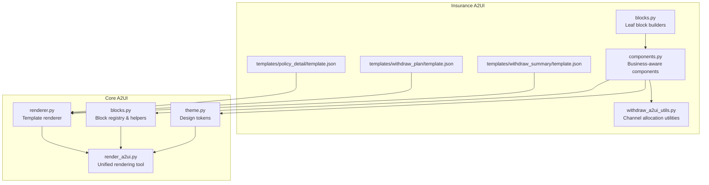
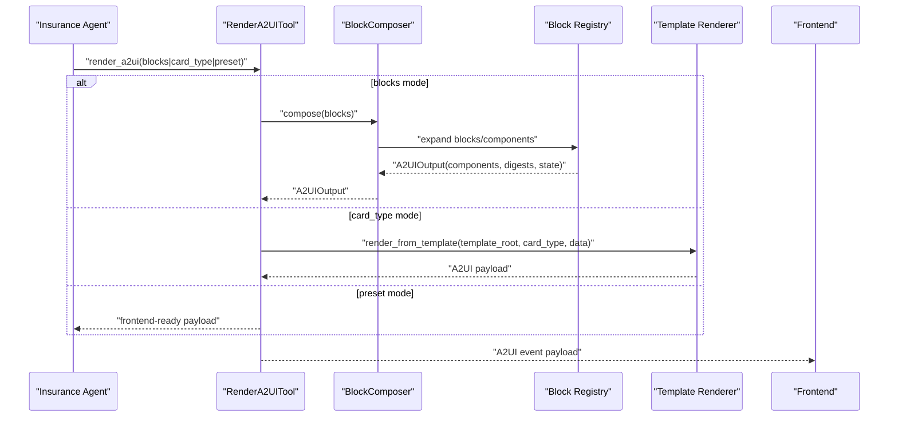
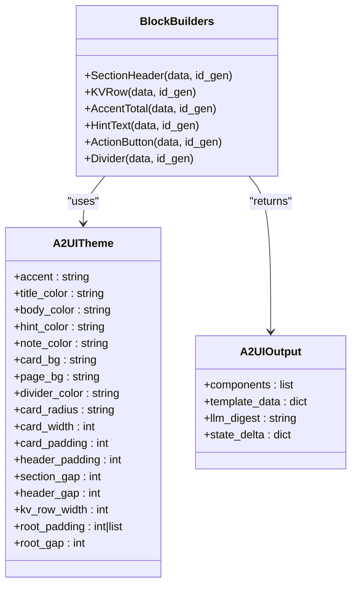
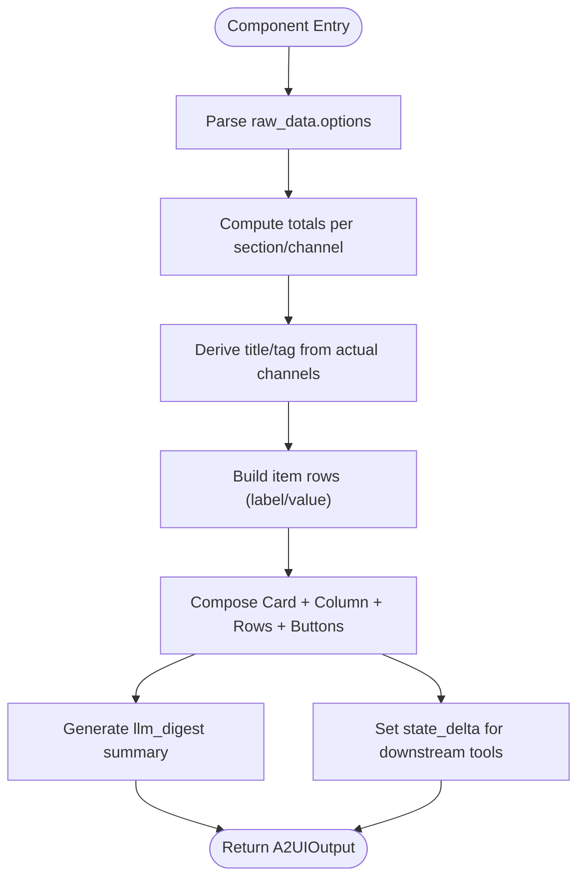
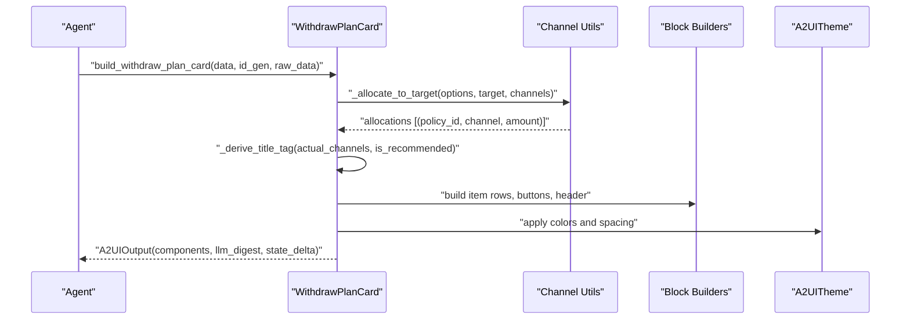
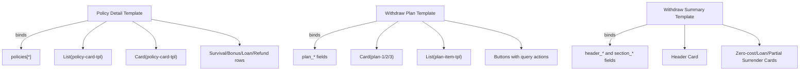
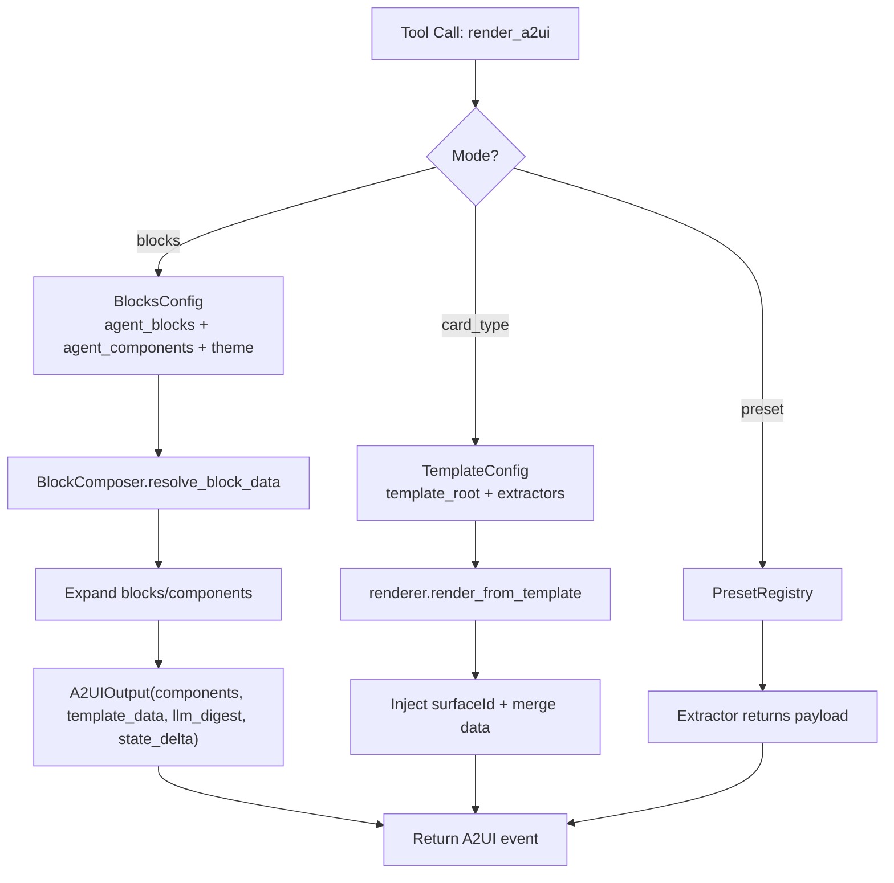
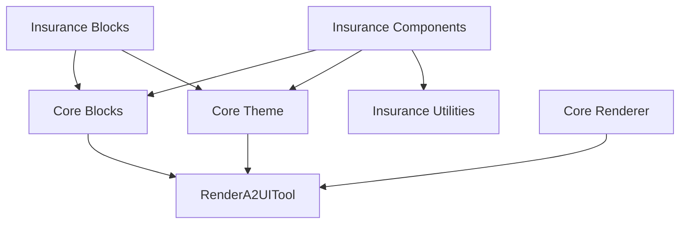

# Insurance Agent A2UI Components

<cite>
**Referenced Files in This Document**
- [__init__.py](file://src/ark_agentic/agents/insurance/a2ui/__init__.py)
- [blocks.py](file://src/ark_agentic/agents/insurance/a2ui/blocks.py)
- [components.py](file://src/ark_agentic/agents/insurance/a2ui/components.py)
- [withdraw_a2ui_utils.py](file://src/ark_agentic/agents/insurance/a2ui/withdraw_a2ui_utils.py)
- [policy_detail/template.json](file://src/ark_agentic/agents/insurance/a2ui/templates/policy_detail/template.json)
- [withdraw_plan/template.json](file://src/ark_agentic/agents/insurance/a2ui/templates/withdraw_plan/template.json)
- [withdraw_summary/template.json](file://src/ark_agentic/agents/insurance/a2ui/templates/withdraw_summary/template.json)
- [__init__.py](file://src/ark_agentic/core/a2ui/__init__.py)
- [blocks.py](file://src/ark_agentic/core/a2ui/blocks.py)
- [theme.py](file://src/ark_agentic/core/a2ui/theme.py)
- [renderer.py](file://src/ark_agentic/core/a2ui/renderer.py)
- [render_a2ui.py](file://src/ark_agentic/core/tools/render_a2ui.py)
- [test_a2ui_blocks_components.py](file://tests/unit/agents/insurance/test_a2ui_blocks_components.py)
</cite>

## Table of Contents
1. [Introduction](#introduction)
2. [Project Structure](#project-structure)
3. [Core Components](#core-components)
4. [Architecture Overview](#architecture-overview)
5. [Detailed Component Analysis](#detailed-component-analysis)
6. [Dependency Analysis](#dependency-analysis)
7. [Performance Considerations](#performance-considerations)
8. [Troubleshooting Guide](#troubleshooting-guide)
9. [Conclusion](#conclusion)

## Introduction
This document provides comprehensive technical and practical guidance for the Insurance Agent A2UI (Agent-to-User Interface) components. It covers the block composition system for building insurance-specific UI elements, the component library for common insurance forms and displays, and utility functions for insurance data presentation. It explains the template system for policy details, withdrawal plans, and summary views, and documents the A2UI rendering pipeline, data binding patterns, and user interaction handling for insurance scenarios. Practical examples illustrate UI generation for different insurance products, policy management interfaces, and claim processing workflows. Finally, it addresses responsive design considerations, accessibility compliance, integration with the broader A2UI framework, and customization options for insurance-specific branding and user experience.

## Project Structure
The Insurance A2UI implementation is organized around three pillars:
- Block builders: reusable leaf components for consistent UI construction.
- Component builders: coarse-grained, business-aware UI builders that orchestrate blocks and derive meaningful UI from raw data.
- Templates: declarative UI blueprints for policy details, withdrawal plans, and summary views.

**Diagram sources**
- [blocks.py:25-145](file://src/ark_agentic/agents/insurance/a2ui/blocks.py#L25-L145)
- [components.py:69-521](file://src/ark_agentic/agents/insurance/a2ui/components.py#L69-L521)
- [withdraw_a2ui_utils.py:12-123](file://src/ark_agentic/agents/insurance/a2ui/withdraw_a2ui_utils.py#L12-L123)
- [policy_detail/template.json:1-310](file://src/ark_agentic/agents/insurance/a2ui/templates/policy_detail/template.json#L1-L310)
- [withdraw_plan/template.json:1-608](file://src/ark_agentic/agents/insurance/a2ui/templates/withdraw_plan/template.json#L1-L608)
- [withdraw_summary/template.json:1-545](file://src/ark_agentic/agents/insurance/a2ui/templates/withdraw_summary/template.json#L1-L545)
- [renderer.py:15-53](file://src/ark_agentic/core/a2ui/renderer.py#L15-L53)
- [blocks.py:1-149](file://src/ark_agentic/core/a2ui/blocks.py#L1-L149)
- [theme.py:1-39](file://src/ark_agentic/core/a2ui/theme.py#L1-L39)
- [render_a2ui.py:178-685](file://src/ark_agentic/core/tools/render_a2ui.py#L178-L685)

**Section sources**
- [__init__.py:1-23](file://src/ark_agentic/agents/insurance/a2ui/__init__.py#L1-L23)
- [blocks.py:1-145](file://src/ark_agentic/agents/insurance/a2ui/blocks.py#L1-L145)
- [components.py:1-593](file://src/ark_agentic/agents/insurance/a2ui/components.py#L1-L593)
- [withdraw_a2ui_utils.py:1-123](file://src/ark_agentic/agents/insurance/a2ui/withdraw_a2ui_utils.py#L1-L123)
- [policy_detail/template.json:1-310](file://src/ark_agentic/agents/insurance/a2ui/templates/policy_detail/template.json#L1-L310)
- [withdraw_plan/template.json:1-608](file://src/ark_agentic/agents/insurance/a2ui/templates/withdraw_plan/template.json#L1-L608)
- [withdraw_summary/template.json:1-545](file://src/ark_agentic/agents/insurance/a2ui/templates/withdraw_summary/template.json#L1-L545)
- [__init__.py:1-39](file://src/ark_agentic/core/a2ui/__init__.py#L1-L39)
- [blocks.py:1-149](file://src/ark_agentic/core/a2ui/blocks.py#L1-L149)
- [theme.py:1-39](file://src/ark_agentic/core/a2ui/theme.py#L1-L39)
- [renderer.py:1-53](file://src/ark_agentic/core/a2ui/renderer.py#L1-L53)
- [render_a2ui.py:1-200](file://src/ark_agentic/core/tools/render_a2ui.py#L1-L200)

## Core Components
This section documents the fundamental building blocks of the Insurance A2UI system.

- Block builders: low-level UI primitives (text rows, totals, actions, dividers) that encapsulate visual styling and layout. They are theme-aware and return a list of component definitions plus optional metadata.
- Component builders: higher-level UI constructs that interpret raw insurance data, apply business logic, and produce:
  - components: UI payload for the frontend
  - llm_digest: concise textual summary for LLM context
  - state_delta: session state updates for downstream tool auto-fill
- Channel utilities: functions for computing available amounts per channel, allocating funds to meet targets, and generating actionable UI payloads.

Key capabilities:
- Theme-driven styling via A2UITheme.
- Consistent data binding and action resolution.
- Structured digest and state propagation for agent workflows.

**Section sources**
- [blocks.py:25-145](file://src/ark_agentic/agents/insurance/a2ui/blocks.py#L25-L145)
- [components.py:69-521](file://src/ark_agentic/agents/insurance/a2ui/components.py#L69-L521)
- [withdraw_a2ui_utils.py:12-123](file://src/ark_agentic/agents/insurance/a2ui/withdraw_a2ui_utils.py#L12-L123)
- [blocks.py:46-149](file://src/ark_agentic/core/a2ui/blocks.py#L46-L149)
- [theme.py:12-39](file://src/ark_agentic/core/a2ui/theme.py#L12-L39)

## Architecture Overview
The Insurance A2UI architecture integrates three rendering modes:
- Dynamic composition: LLM provides block descriptors; BlockComposer expands into a full A2UI event payload.
- Template-based rendering: Declarative templates loaded from disk; extractors populate data; renderer injects surface identifiers and merges data.
- Preset rendering: Extractors produce lean payloads for direct frontend consumption.

**Diagram sources**
- [render_a2ui.py:178-685](file://src/ark_agentic/core/tools/render_a2ui.py#L178-L685)
- [blocks.py:120-149](file://src/ark_agentic/core/a2ui/blocks.py#L120-L149)
- [renderer.py:15-53](file://src/ark_agentic/core/a2ui/renderer.py#L15-L53)

**Section sources**
- [render_a2ui.py:1-200](file://src/ark_agentic/core/tools/render_a2ui.py#L1-L200)
- [blocks.py:1-149](file://src/ark_agentic/core/a2ui/blocks.py#L1-L149)
- [renderer.py:1-53](file://src/ark_agentic/core/a2ui/renderer.py#L1-L53)

## Detailed Component Analysis

### Block Composition System
The block system defines reusable leaf components with theme-aware styling and consistent data binding.

- SectionHeader: builds a row with a vertical accent line, title text, and optional tag.
- KVRow: builds a two-column row for label/value pairs with configurable colors and boldness.
- AccentTotal: renders either a labeled row or standalone total text in accent color.
- HintText: renders small or medium hint text with theme-aware sizing and color.
- ActionButton: renders a themed button with action binding resolution.
- Divider: renders a thin horizontal divider with theme-aware color.

**Diagram sources**
- [blocks.py:25-145](file://src/ark_agentic/agents/insurance/a2ui/blocks.py#L25-L145)
- [blocks.py:46-149](file://src/ark_agentic/core/a2ui/blocks.py#L46-L149)
- [theme.py:12-39](file://src/ark_agentic/core/a2ui/theme.py#L12-L39)

**Section sources**
- [blocks.py:25-145](file://src/ark_agentic/agents/insurance/a2ui/blocks.py#L25-L145)
- [blocks.py:46-149](file://src/ark_agentic/core/a2ui/blocks.py#L46-L149)
- [theme.py:12-39](file://src/ark_agentic/core/a2ui/theme.py#L12-L39)

### Component Library for Insurance Forms and Displays
The component library orchestrates blocks to produce business-focused UI cards.

Key components:
- WithdrawSummaryHeader: computes and displays total available amounts (with/without loans), requested amount display, and section highlights.
- WithdrawSummarySection: renders a titled section card with items and totals, honoring section presets and channel exclusions.
- WithdrawPlanCard: allocates a target amount across channels, derives recommended title/tag, builds policy rows, and generates action buttons with structured actions.

**Diagram sources**
- [components.py:212-517](file://src/ark_agentic/agents/insurance/a2ui/components.py#L212-L517)
- [withdraw_a2ui_utils.py:71-123](file://src/ark_agentic/agents/insurance/a2ui/withdraw_a2ui_utils.py#L71-L123)
- [blocks.py:25-145](file://src/ark_agentic/agents/insurance/a2ui/blocks.py#L25-L145)
- [theme.py:12-39](file://src/ark_agentic/core/a2ui/theme.py#L12-L39)

**Section sources**
- [components.py:69-521](file://src/ark_agentic/agents/insurance/a2ui/components.py#L69-L521)
- [withdraw_a2ui_utils.py:12-123](file://src/ark_agentic/agents/insurance/a2ui/withdraw_a2ui_utils.py#L12-L123)
- [blocks.py:25-145](file://src/ark_agentic/agents/insurance/a2ui/blocks.py#L25-L145)
- [theme.py:12-39](file://src/ark_agentic/core/a2ui/theme.py#L12-L39)

### Template System for Policy Details, Withdrawal Plans, and Summary Views
Templates define declarative UI structures with data binding and conditional visibility.

- Policy Detail Template: renders a list of policy cards with metadata, survival fund, bonus, loan, refund, and totals.
- Withdraw Plan Template: renders up to three plan cards with recommended titles/tags, policy allocations, and action buttons.
- Withdraw Summary Template: renders a header card and section cards for zero-cost, loan, and partial surrender/retirement options.

**Diagram sources**
- [policy_detail/template.json:1-310](file://src/ark_agentic/agents/insurance/a2ui/templates/policy_detail/template.json#L1-L310)
- [withdraw_plan/template.json:1-608](file://src/ark_agentic/agents/insurance/a2ui/templates/withdraw_plan/template.json#L1-L608)
- [withdraw_summary/template.json:1-545](file://src/ark_agentic/agents/insurance/a2ui/templates/withdraw_summary/template.json#L1-L545)

**Section sources**
- [policy_detail/template.json:1-310](file://src/ark_agentic/agents/insurance/a2ui/templates/policy_detail/template.json#L1-L310)
- [withdraw_plan/template.json:1-608](file://src/ark_agentic/agents/insurance/a2ui/templates/withdraw_plan/template.json#L1-L608)
- [withdraw_summary/template.json:1-545](file://src/ark_agentic/agents/insurance/a2ui/templates/withdraw_summary/template.json#L1-L545)

### A2UI Rendering Pipeline and Data Binding Patterns
The unified rendering tool supports three mutually exclusive modes:
- Blocks mode: LLM-provided block descriptors expanded via BlockComposer into a full A2UI event.
- Template mode: Loads template.json, injects surfaceId, merges data, and returns a complete payload.
- Preset mode: Extractor returns a lean, frontend-ready payload.

Data binding patterns:
- resolve_binding converts $field shorthand to standard binding specs.
- _resolve_action resolves action arguments using the same binding mechanism.
- Transforms (get, sum, count, concat, select, switch, literal) are supported in bindings.

**Diagram sources**
- [render_a2ui.py:178-685](file://src/ark_agentic/core/tools/render_a2ui.py#L178-L685)
- [blocks.py:65-90](file://src/ark_agentic/core/a2ui/blocks.py#L65-L90)
- [renderer.py:15-53](file://src/ark_agentic/core/a2ui/renderer.py#L15-L53)

**Section sources**
- [render_a2ui.py:1-200](file://src/ark_agentic/core/tools/render_a2ui.py#L1-L200)
- [blocks.py:65-90](file://src/ark_agentic/core/a2ui/blocks.py#L65-L90)
- [renderer.py:1-53](file://src/ark_agentic/core/a2ui/renderer.py#L1-L53)

### Practical Examples and Workflows
Examples validated by unit tests demonstrate real-world usage patterns:

- Policy Management Interfaces:
  - Building a policy list with metadata, survival fund, bonus, loan, refund, and totals using the Policy Detail template.
  - Using SectionHeader, KVRow, AccentTotal, and Divider blocks to construct custom cards.

- Withdrawal Plan Workflows:
  - WithdrawSummaryHeader computes total available amounts and requested amount display.
  - WithdrawSummarySection renders section cards with items and totals, honoring channel exclusions.
  - WithdrawPlanCard allocates a target across channels, derives recommended title/tag, and generates action buttons with structured query messages.

- Claim Processing Workflows:
  - Components derive actionable titles/tags based on actual allocations, preventing misleading titles when channels are not used.
  - Digests and state deltas propagate through the pipeline to inform downstream tools and maintain session state.

**Section sources**
- [test_a2ui_blocks_components.py:1-683](file://tests/unit/agents/insurance/test_a2ui_blocks_components.py#L1-L683)
- [components.py:212-517](file://src/ark_agentic/agents/insurance/a2ui/components.py#L212-L517)
- [withdraw_a2ui_utils.py:71-123](file://src/ark_agentic/agents/insurance/a2ui/withdraw_a2ui_utils.py#L71-L123)

## Dependency Analysis
The Insurance A2UI components depend on the core A2UI infrastructure for rendering, block composition, theming, and validation.

- Insurance Blocks depend on core block helpers and theme.
- Insurance Components depend on core block helpers, theme, and insurance utilities.
- Template rendering depends on the core renderer and is orchestrated by the unified tool.

**Diagram sources**
- [blocks.py:16-22](file://src/ark_agentic/agents/insurance/a2ui/blocks.py#L16-L22)
- [components.py:23-29](file://src/ark_agentic/agents/insurance/a2ui/components.py#L23-L29)
- [withdraw_a2ui_utils.py:12-14](file://src/ark_agentic/agents/insurance/a2ui/withdraw_a2ui_utils.py#L12-L14)
- [blocks.py:19-21](file://src/ark_agentic/core/a2ui/blocks.py#L19-L21)
- [theme.py:12-39](file://src/ark_agentic/core/a2ui/theme.py#L12-L39)
- [renderer.py:15-53](file://src/ark_agentic/core/a2ui/renderer.py#L15-L53)
- [render_a2ui.py:178-685](file://src/ark_agentic/core/tools/render_a2ui.py#L178-L685)

**Section sources**
- [blocks.py:1-145](file://src/ark_agentic/agents/insurance/a2ui/blocks.py#L1-L145)
- [components.py:1-593](file://src/ark_agentic/agents/insurance/a2ui/components.py#L1-L593)
- [withdraw_a2ui_utils.py:1-123](file://src/ark_agentic/agents/insurance/a2ui/withdraw_a2ui_utils.py#L1-L123)
- [blocks.py:1-149](file://src/ark_agentic/core/a2ui/blocks.py#L1-L149)
- [theme.py:1-39](file://src/ark_agentic/core/a2ui/theme.py#L1-L39)
- [renderer.py:1-53](file://src/ark_agentic/core/a2ui/renderer.py#L1-L53)
- [render_a2ui.py:1-200](file://src/ark_agentic/core/tools/render_a2ui.py#L1-L200)

## Performance Considerations
- Prefer component builders for complex UIs to minimize repeated block composition logic.
- Use template-based rendering for static, predictable views to reduce CPU overhead.
- Keep digest and state_delta lightweight; avoid heavy computations in llm_digest.
- Limit nested card depth to prevent excessive recursion during composition.
- Cache computed totals and allocations when feasible to avoid recomputation across multiple components.

## Troubleshooting Guide
Common issues and resolutions:
- Unknown block type: Ensure the block type exists in the registry and is properly registered by the agent.
- Missing required keys: Block builders enforce required keys; verify data payloads conform to schemas.
- Template loading errors: Confirm template paths exist and are valid JSON.
- Excessive nesting: The rendering tool enforces card depth limits; flatten nested structures.
- Incorrect channel allocations: Validate raw_data options and channel filters; ensure product types align with intended channels.

Validation and error handling:
- BlockDataError raised when required keys are missing.
- Transform errors surfaced when unresolved transform specs are encountered.
- Template loading raises FileNotFoundError or JSON decode errors for invalid templates.

**Section sources**
- [blocks.py:102-132](file://src/ark_agentic/core/a2ui/blocks.py#L102-L132)
- [render_a2ui.py:155-172](file://src/ark_agentic/core/tools/render_a2ui.py#L155-L172)
- [renderer.py:40-41](file://src/ark_agentic/core/a2ui/renderer.py#L40-L41)

## Conclusion
The Insurance Agent A2UI components provide a robust, theme-driven, and business-aware system for constructing insurance-specific UIs. The block composition system ensures consistent styling and layout, while the component library encapsulates complex business logic and data transformations. The template system enables declarative UI design for policy details, withdrawal plans, and summaries. The unified rendering pipeline integrates seamlessly with the broader A2UI framework, supporting dynamic composition, template-based rendering, and preset delivery. With careful attention to data binding, validation, and performance, the system delivers responsive, accessible, and customizable experiences tailored to insurance workflows.