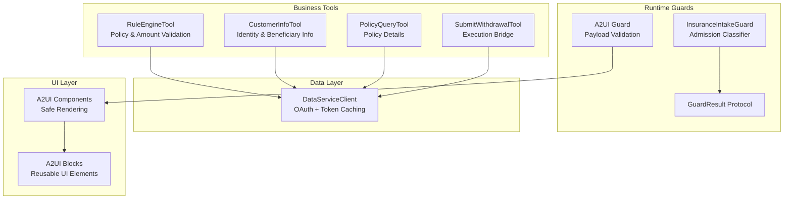
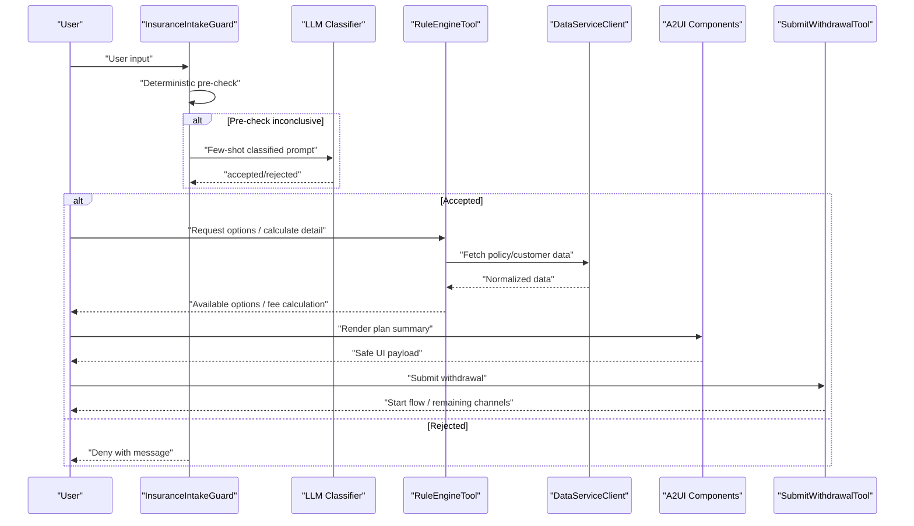
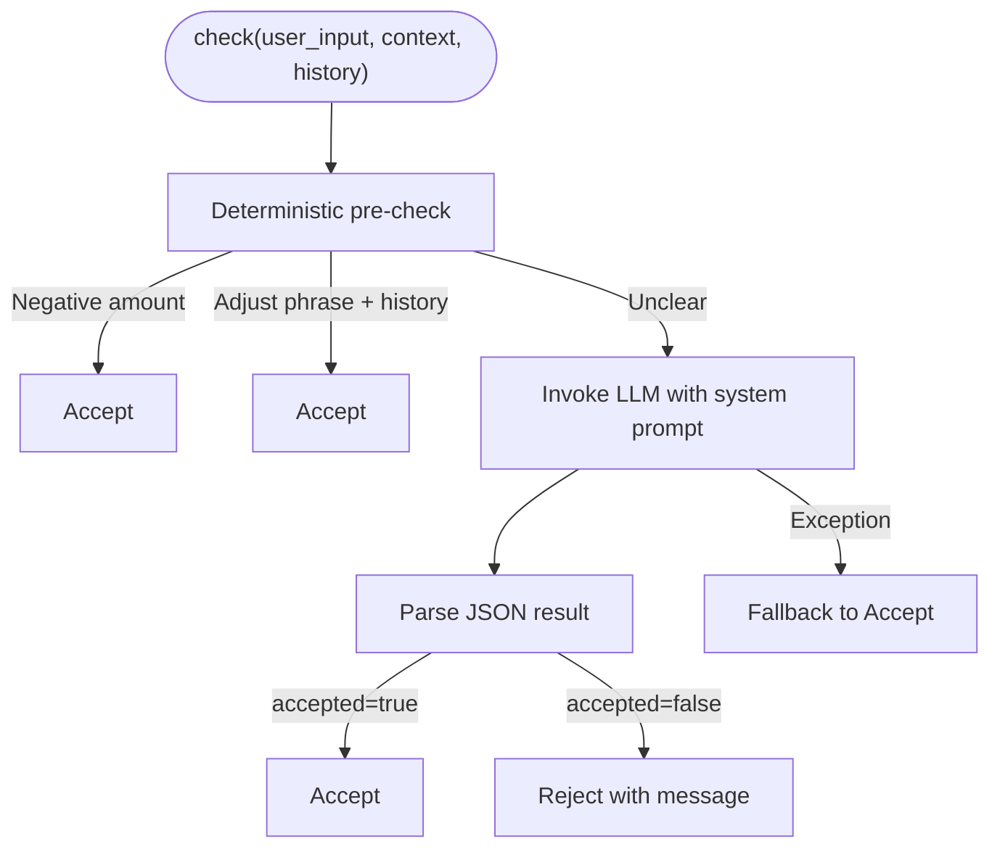
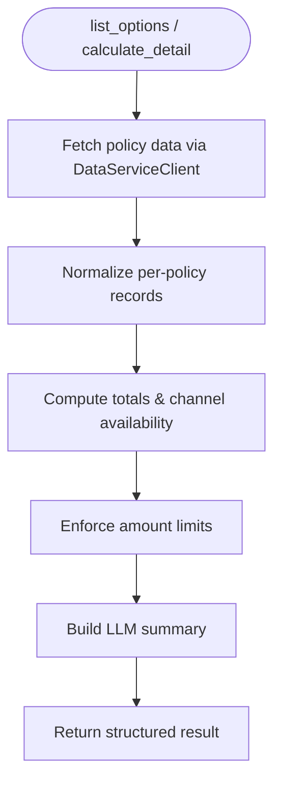
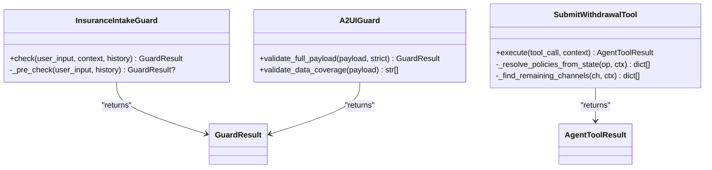
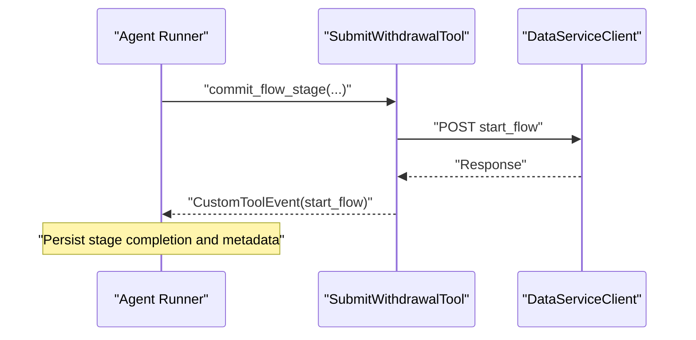
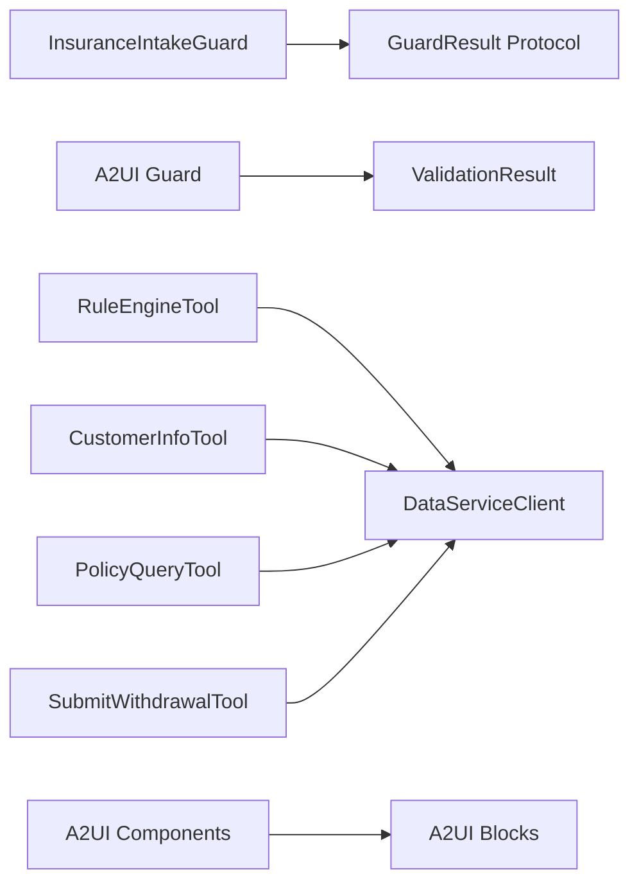

# Insurance Agent Guardrails

<cite>
**Referenced Files in This Document**
- [guard.py](file://src/ark_agentic/agents/insurance/guard.py)
- [guard.py](file://src/ark_agentic/core/runtime/guard.py)
- [guard.py](file://src/ark_agentic/core/a2ui/guard.py)
- [rule_engine.py](file://src/ark_agentic/agents/insurance/tools/rule_engine.py)
- [flow_evaluator.py](file://src/ark_agentic/agents/insurance/tools/flow_evaluator.py)
- [customer_info.py](file://src/ark_agentic/agents/insurance/tools/customer_info.py)
- [policy_query.py](file://src/ark_agentic/agents/insurance/tools/policy_query.py)
- [submit_withdrawal.py](file://src/ark_agentic/agents/insurance/tools/submit_withdrawal.py)
- [data_service.py](file://src/ark_agentic/agents/insurance/tools/data_service.py)
- [components.py](file://src/ark_agentic/agents/insurance/a2ui/components.py)
- [blocks.py](file://src/ark_agentic/agents/insurance/a2ui/blocks.py)
- [agent.py](file://src/ark_agentic/agents/insurance/agent.py)
- [test_guard.py](file://tests/unit/agents/insurance/test_guard.py)
- [test_rule_engine.py](file://tests/unit/agents/insurance/test_rule_engine.py)
</cite>

## Table of Contents
1. [Introduction](#introduction)
2. [Project Structure](#project-structure)
3. [Core Components](#core-components)
4. [Architecture Overview](#architecture-overview)
5. [Detailed Component Analysis](#detailed-component-analysis)
6. [Dependency Analysis](#dependency-analysis)
7. [Performance Considerations](#performance-considerations)
8. [Troubleshooting Guide](#troubleshooting-guide)
9. [Conclusion](#conclusion)

## Introduction
This document describes the guardrails and security mechanisms implemented in the Insurance Agent. It explains how the system enforces compliance rules, manages risk, and ensures adherence to regulatory requirements during insurance processing. The focus areas include:
- Admission control and intent classification
- Policy validation and amount limits
- Beneficiary verification readiness
- Anti-fraud safeguards
- Compliance reporting and audit logging
- Integration with external compliance systems
- Monitoring and exception handling

The guardrails are layered across the intake classifier, the rule engine, UI validation, and the withdrawal flow, ensuring deterministic checks, clear error handling, and robust operational controls.

## Project Structure
The Insurance Agent’s guardrails span several modules:
- Runtime guard protocol and intake guard implementation
- Rule engine for policy validation and amount calculations
- A2UI guard and UI components for safe rendering and user interaction
- Tools for identity verification, policy queries, and withdrawal submission
- Data service client for secure, authenticated access to backend systems

**Diagram sources**
- [guard.py:71-164](file://src/ark_agentic/agents/insurance/guard.py#L71-L164)
- [guard.py:18-34](file://src/ark_agentic/core/runtime/guard.py#L18-L34)
- [guard.py:83-125](file://src/ark_agentic/core/a2ui/guard.py#L83-L125)
- [rule_engine.py:99-445](file://src/ark_agentic/agents/insurance/tools/rule_engine.py#L99-L445)
- [customer_info.py:26-94](file://src/ark_agentic/agents/insurance/tools/customer_info.py#L26-L94)
- [policy_query.py:25-77](file://src/ark_agentic/agents/insurance/tools/policy_query.py#L25-L77)
- [submit_withdrawal.py:136-214](file://src/ark_agentic/agents/insurance/tools/submit_withdrawal.py#L136-L214)
- [data_service.py:22-452](file://src/ark_agentic/agents/insurance/tools/data_service.py#L22-L452)
- [components.py:69-593](file://src/ark_agentic/agents/insurance/a2ui/components.py#L69-L593)
- [blocks.py:25-145](file://src/ark_agentic/agents/insurance/a2ui/blocks.py#L25-L145)

**Section sources**
- [guard.py:1-164](file://src/ark_agentic/agents/insurance/guard.py#L1-L164)
- [guard.py:1-34](file://src/ark_agentic/core/runtime/guard.py#L1-L34)
- [guard.py:1-125](file://src/ark_agentic/core/a2ui/guard.py#L1-L125)
- [rule_engine.py:1-445](file://src/ark_agentic/agents/insurance/tools/rule_engine.py#L1-L445)
- [flow_evaluator.py:1-183](file://src/ark_agentic/agents/insurance/tools/flow_evaluator.py#L1-L183)
- [customer_info.py:1-94](file://src/ark_agentic/agents/insurance/tools/customer_info.py#L1-L94)
- [policy_query.py:1-77](file://src/ark_agentic/agents/insurance/tools/policy_query.py#L1-L77)
- [submit_withdrawal.py:1-214](file://src/ark_agentic/agents/insurance/tools/submit_withdrawal.py#L1-L214)
- [data_service.py:1-452](file://src/ark_agentic/agents/insurance/tools/data_service.py#L1-L452)
- [components.py:1-593](file://src/ark_agentic/agents/insurance/a2ui/components.py#L1-L593)
- [blocks.py:1-145](file://src/ark_agentic/agents/insurance/a2ui/blocks.py#L1-L145)
- [agent.py:1-75](file://src/ark_agentic/agents/insurance/agent.py#L1-L75)

## Core Components
- InsuranceIntakeGuard: A deterministic admission classifier that decides whether a user input falls within the scope of insurance withdrawal-related tasks. It performs fast pre-checks and falls back to an LLM classifier when needed.
- RuleEngineTool: Validates policy data and computes amounts per channel, enforcing policy year-dependent fees and interest rates, and ensuring amount limits are respected.
- A2UI Guard: Validates full A2UI payloads against event contracts, component-level bindings, and data coverage to prevent rendering errors and data drift.
- Data Service Client: Provides authenticated, token-managed access to backend APIs for customer and policy data.
- Flow Evaluator: Defines the four-stage withdrawal flow with explicit completion conditions and field sources for compliance tracking.
- UI Components and Blocks: Enforce safe rendering and consistent presentation of sensitive financial data.

**Section sources**
- [guard.py:71-164](file://src/ark_agentic/agents/insurance/guard.py#L71-L164)
- [guard.py:18-34](file://src/ark_agentic/core/runtime/guard.py#L18-L34)
- [guard.py:83-125](file://src/ark_agentic/core/a2ui/guard.py#L83-L125)
- [rule_engine.py:99-445](file://src/ark_agentic/agents/insurance/tools/rule_engine.py#L99-L445)
- [flow_evaluator.py:65-183](file://src/ark_agentic/agents/insurance/tools/flow_evaluator.py#L65-L183)
- [data_service.py:22-452](file://src/ark_agentic/agents/insurance/tools/data_service.py#L22-L452)
- [components.py:69-593](file://src/ark_agentic/agents/insurance/a2ui/components.py#L69-L593)
- [blocks.py:25-145](file://src/ark_agentic/agents/insurance/a2ui/blocks.py#L25-L145)

## Architecture Overview
The guardrails architecture integrates admission control, policy validation, UI safety, and execution safeguards into a cohesive pipeline.

**Diagram sources**
- [guard.py:102-132](file://src/ark_agentic/agents/insurance/guard.py#L102-L132)
- [rule_engine.py:155-204](file://src/ark_agentic/agents/insurance/tools/rule_engine.py#L155-L204)
- [data_service.py:73-129](file://src/ark_agentic/agents/insurance/tools/data_service.py#L73-L129)
- [components.py:388-511](file://src/ark_agentic/agents/insurance/a2ui/components.py#L388-L511)
- [submit_withdrawal.py:152-214](file://src/ark_agentic/agents/insurance/tools/submit_withdrawal.py#L152-L214)

## Detailed Component Analysis

### Admission Control and Intent Classification
The InsuranceIntakeGuard class enforces a two-tier admission control:
- Deterministic pre-check: quickly accepts inputs containing negative amounts (deferred to downstream validators) and adjustment phrases when conversation history exists.
- LLM classifier: Uses a fixed system prompt with few-shot examples to classify user intent deterministically at temperature zero.

Key behaviors:
- Accepts inputs related to withdrawal activities, plan adjustments, and continuation of prior topics.
- Rejects non-withdrawal insurance topics and unrelated subjects.
- Falls back to acceptance on LLM failures or malformed responses.

**Diagram sources**
- [guard.py:84-132](file://src/ark_agentic/agents/insurance/guard.py#L84-L132)

**Section sources**
- [guard.py:71-164](file://src/ark_agentic/agents/insurance/guard.py#L71-L164)
- [test_guard.py:29-96](file://tests/unit/agents/insurance/test_guard.py#L29-L96)

### Policy Validation and Amount Limits
The RuleEngineTool centralizes policy validation and amount computation:
- Fetches normalized policy data for a user and builds standardized records with available amounts per channel.
- Computes policy year-dependent fees for partial withdrawals and applies fixed interest rates for loans.
- Enforces amount limits by comparing requested amounts to maximum available per policy/channel.
- Produces LLM-friendly summaries while hiding granular details.

Common validations:
- Zero/negative amounts are accepted at this stage for downstream enforcement.
- Combination hints guide users when single-policy amounts are insufficient.
- Channel-specific impact notes (e.g., “no fee,” “interest payable,” “coverage reduced”) inform compliance messaging.

**Diagram sources**
- [rule_engine.py:209-301](file://src/ark_agentic/agents/insurance/tools/rule_engine.py#L209-L301)
- [rule_engine.py:338-445](file://src/ark_agentic/agents/insurance/tools/rule_engine.py#L338-L445)
- [data_service.py:73-129](file://src/ark_agentic/agents/insurance/tools/data_service.py#L73-L129)

**Section sources**
- [rule_engine.py:99-445](file://src/ark_agentic/agents/insurance/tools/rule_engine.py#L99-L445)
- [test_rule_engine.py:14-72](file://tests/unit/agents/insurance/test_rule_engine.py#L14-L72)

### Beneficiary Verification Readiness
While dedicated beneficiary verification is not implemented as a standalone tool, the system prepares for it:
- CustomerInfoTool supports retrieving beneficiary information per policy.
- A2UI components and templates are designed to present sensitive data safely.
- The flow evaluator defines clear completion conditions for identity verification and policy retrieval, enabling future integration of formal beneficiary checks.

**Section sources**
- [customer_info.py:26-94](file://src/ark_agentic/agents/insurance/tools/customer_info.py#L26-L94)
- [flow_evaluator.py:31-61](file://src/ark_agentic/agents/insurance/tools/flow_evaluator.py#L31-L61)

### Anti-Fraud Measures
Anti-fraud safeguards are embedded across the pipeline:
- Admission classifier rejects non-withdrawal topics and unrelated queries.
- Deterministic pre-check bypasses LLM invocation for clearly benign inputs (e.g., negative amounts), reducing LLM misuse risk.
- UI guard prevents rendering errors caused by missing data keys and enforces event contracts and component-level validation.
- Execution tool prevents duplicate submissions and cross-checks plan allocations against state.

**Diagram sources**
- [guard.py:71-164](file://src/ark_agentic/agents/insurance/guard.py#L71-L164)
- [guard.py:83-125](file://src/ark_agentic/core/a2ui/guard.py#L83-L125)
- [submit_withdrawal.py:136-214](file://src/ark_agentic/agents/insurance/tools/submit_withdrawal.py#L136-L214)

**Section sources**
- [guard.py:71-164](file://src/ark_agentic/agents/insurance/guard.py#L71-L164)
- [guard.py:32-125](file://src/ark_agentic/core/a2ui/guard.py#L32-L125)
- [submit_withdrawal.py:136-214](file://src/ark_agentic/agents/insurance/tools/submit_withdrawal.py#L136-L214)

### Compliance Reporting and Audit Logging
Compliance and audit readiness is supported by:
- Structured tool outputs with metadata deltas for downstream persistence.
- Clear completion conditions in the flow evaluator enabling audit trails per stage.
- Event emission on submission to trigger external flow orchestration.
- Token caching and authenticated requests to backend systems for traceability.

**Diagram sources**
- [flow_evaluator.py:178-183](file://src/ark_agentic/agents/insurance/tools/flow_evaluator.py#L178-L183)
- [submit_withdrawal.py:206-213](file://src/ark_agentic/agents/insurance/tools/submit_withdrawal.py#L206-L213)
- [data_service.py:73-129](file://src/ark_agentic/agents/insurance/tools/data_service.py#L73-L129)

**Section sources**
- [flow_evaluator.py:65-183](file://src/ark_agentic/agents/insurance/tools/flow_evaluator.py#L65-L183)
- [submit_withdrawal.py:136-214](file://src/ark_agentic/agents/insurance/tools/submit_withdrawal.py#L136-L214)
- [data_service.py:146-194](file://src/ark_agentic/agents/insurance/tools/data_service.py#L146-L194)

### Integration with External Systems
- Data Service Client handles OAuth token acquisition, caching, and authenticated requests to backend APIs for customer and policy data.
- Submission tool emits a custom event to start external flows and passes query parameters for traceability.

Operational notes:
- Token refresh with safety margin and robust error handling.
- Form-encoded requests with standardized headers and request IDs.
- Mock client available for development/testing without network dependencies.

**Section sources**
- [data_service.py:22-452](file://src/ark_agentic/agents/insurance/tools/data_service.py#L22-L452)
- [submit_withdrawal.py:136-214](file://src/ark_agentic/agents/insurance/tools/submit_withdrawal.py#L136-L214)

### Monitoring and Compliance Tracking
- GuardResult protocol enables consistent acceptance/rejection signaling across components.
- A2UI GuardResult aggregates errors and warnings for strict or lenient validation modes.
- Flow evaluator’s stage definitions and field sources provide explicit checkpoints for compliance audits.

**Section sources**
- [guard.py:18-34](file://src/ark_agentic/core/runtime/guard.py#L18-L34)
- [guard.py:32-125](file://src/ark_agentic/core/a2ui/guard.py#L32-L125)
- [flow_evaluator.py:65-183](file://src/ark_agentic/agents/insurance/tools/flow_evaluator.py#L65-L183)

## Dependency Analysis
The guardrails depend on a small set of core protocols and utilities, minimizing coupling and maximizing testability.

**Diagram sources**
- [guard.py:18-34](file://src/ark_agentic/core/runtime/guard.py#L18-L34)
- [guard.py:15-16](file://src/ark_agentic/core/a2ui/guard.py#L15-L16)
- [rule_engine.py:34-39](file://src/ark_agentic/agents/insurance/tools/rule_engine.py#L34-L39)
- [data_service.py:22-68](file://src/ark_agentic/agents/insurance/tools/data_service.py#L22-L68)
- [components.py:23-29](file://src/ark_agentic/agents/insurance/a2ui/components.py#L23-L29)
- [blocks.py:16-22](file://src/ark_agentic/agents/insurance/a2ui/blocks.py#L16-L22)

**Section sources**
- [guard.py:1-34](file://src/ark_agentic/core/runtime/guard.py#L1-L34)
- [guard.py:1-125](file://src/ark_agentic/core/a2ui/guard.py#L1-L125)
- [rule_engine.py:1-445](file://src/ark_agentic/agents/insurance/tools/rule_engine.py#L1-L445)
- [data_service.py:1-452](file://src/ark_agentic/agents/insurance/tools/data_service.py#L1-L452)
- [components.py:1-593](file://src/ark_agentic/agents/insurance/a2ui/components.py#L1-L593)
- [blocks.py:1-145](file://src/ark_agentic/agents/insurance/a2ui/blocks.py#L1-L145)

## Performance Considerations
- Deterministic pre-check reduces LLM calls for common cases, lowering latency and cost.
- Fixed system prompts and temperature=0 ensure consistent classification outcomes.
- UI validation runs once per payload to catch binding issues early, preventing expensive retries.
- Token caching minimizes authentication overhead for repeated data service calls.

## Troubleshooting Guide
Common scenarios and resolutions:
- Admission classifier denies a valid query:
  - Verify few-shot examples in the system prompt and ensure the input aligns with withdrawal-related topics.
  - Confirm that the conversation history triggers adjustment phrase acceptance.
- LLM failure or malformed response:
  - The guard defaults to acceptance; monitor logs for repeated failures and reconfigure the LLM endpoint.
- Data service errors:
  - Check authentication configuration and token validity; inspect HTTP status and error payloads.
- UI validation warnings:
  - Address missing data keys or invalid component bindings; ensure all referenced paths exist in the payload.
- Duplicate submission:
  - The submission tool prevents re-processing the same channel; confirm plan allocations and submitted channels state.

**Section sources**
- [guard.py:121-132](file://src/ark_agentic/agents/insurance/guard.py#L121-L132)
- [data_service.py:114-129](file://src/ark_agentic/agents/insurance/tools/data_service.py#L114-L129)
- [guard.py:39-80](file://src/ark_agentic/core/a2ui/guard.py#L39-L80)
- [submit_withdrawal.py:165-174](file://src/ark_agentic/agents/insurance/tools/submit_withdrawal.py#L165-L174)

## Conclusion
The Insurance Agent’s guardrails provide a robust, layered defense for compliance, risk management, and regulatory adherence. By combining deterministic admission control, validated policy computations, safe UI rendering, and strict flow tracking, the system ensures secure and auditable insurance processing. The modular design allows for easy extension of anti-fraud measures, beneficiary verification, and integration with external compliance systems.