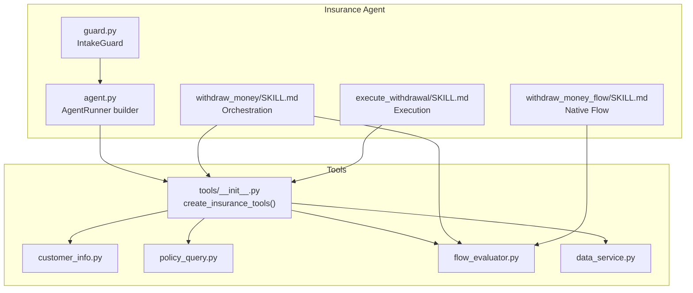
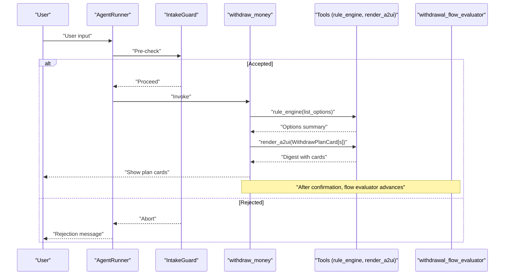
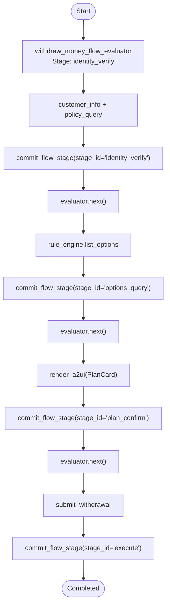
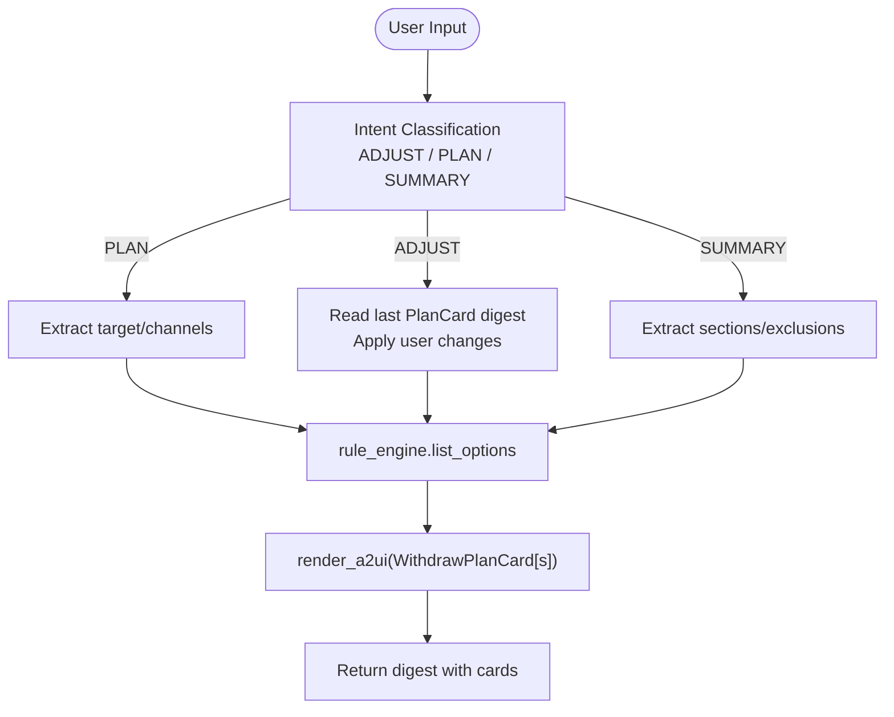
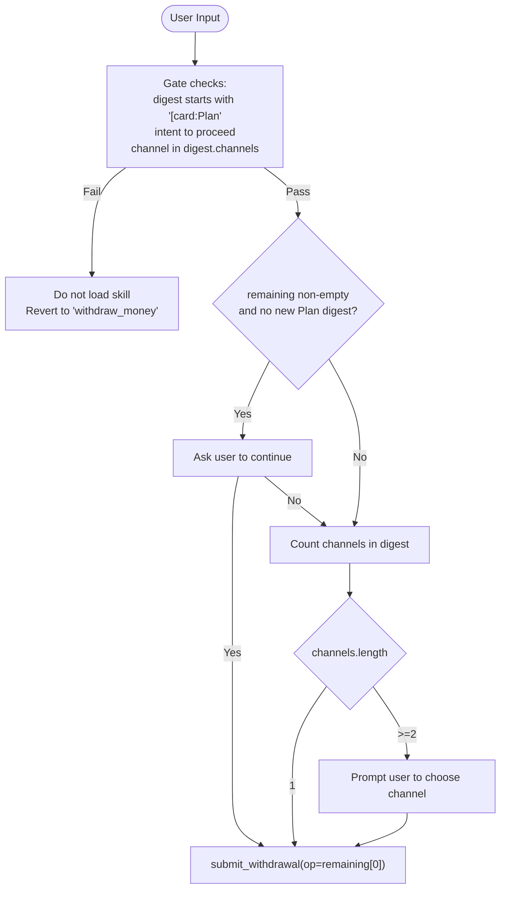
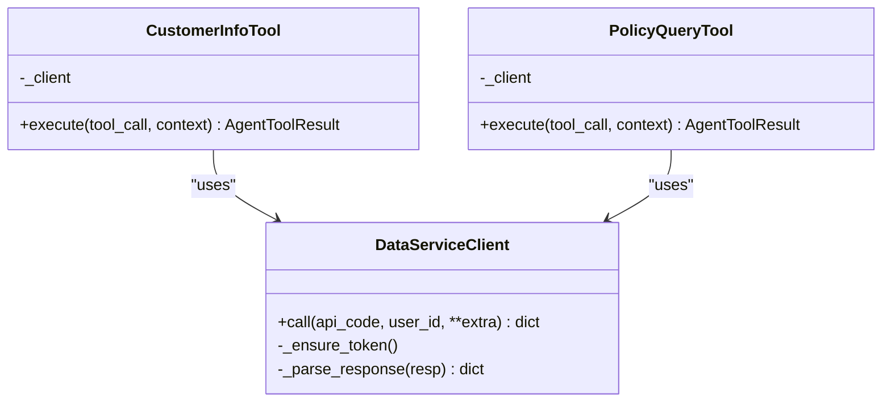
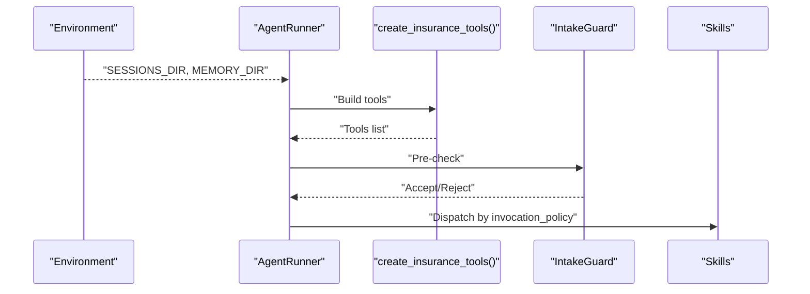
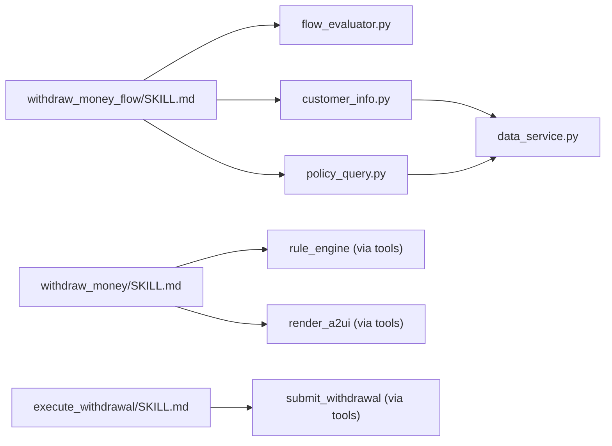

# Insurance Agent Skills

<cite>
**Referenced Files in This Document**
- [SKILL.md](file://src/ark_agentic/agents/insurance/skills/withdraw_money_flow/SKILL.md)
- [SKILL.md](file://src/ark_agentic/agents/insurance/skills/execute_withdrawal/SKILL.md)
- [SKILL.md](file://src/ark_agentic/agents/insurance/skills/withdraw_money/SKILL.md)
- [flow_evaluator.py](file://src/ark_agentic/agents/insurance/tools/flow_evaluator.py)
- [customer_info.py](file://src/ark_agentic/agents/insurance/tools/customer_info.py)
- [policy_query.py](file://src/ark_agentic/agents/insurance/tools/policy_query.py)
- [data_service.py](file://src/ark_agentic/agents/insurance/tools/data_service.py)
- [agent.py](file://src/ark_agentic/agents/insurance/agent.py)
- [guard.py](file://src/ark_agentic/agents/insurance/guard.py)
- [agent.json](file://src/ark_agentic/agents/insurance/agent.json)
- [__init__.py](file://src/ark_agentic/agents/insurance/tools/__init__.py)
</cite>

## Table of Contents
1. [Introduction](#introduction)
2. [Project Structure](#project-structure)
3. [Core Components](#core-components)
4. [Architecture Overview](#architecture-overview)
5. [Detailed Component Analysis](#detailed-component-analysis)
6. [Dependency Analysis](#dependency-analysis)
7. [Performance Considerations](#performance-considerations)
8. [Troubleshooting Guide](#troubleshooting-guide)
9. [Conclusion](#conclusion)
10. [Appendices](#appendices)

## Introduction
This document describes the Insurance Agent skills subsystem with a focus on complex insurance workflows and business processes. It documents the withdraw_money_flow skill for structured 4-stage insurance withdrawal processing, the execute_withdrawal skill for final claim processing and payment execution, and the related insurance withdrawal orchestration skill. It explains skill loading, routing, execution patterns, configuration options, parameter requirements, and integration with the broader agent system. Practical invocation examples, state management, and workflow coordination are included, along with performance optimization tips, debugging techniques, and troubleshooting guidance for common insurance processing issues.

## Project Structure
The Insurance Agent is organized around three primary skills:
- withdraw_money_flow: a native flow orchestrating 4 stages with evaluation and persistence
- withdraw_money: the main orchestration skill for intent classification, plan generation, and A2UI rendering
- execute_withdrawal: a specialized skill that triggers submission after plan confirmation

Supporting components include:
- Tools for customer info, policy query, rule engine, A2UI rendering, submission, stage commitment, and flow evaluation
- Agent configuration and guard for intake filtering
- Environment-driven session and memory management

**Diagram sources**
- [agent.py:38-74](file://src/ark_agentic/agents/insurance/agent.py#L38-L74)
- [guard.py:71-164](file://src/ark_agentic/agents/insurance/guard.py#L71-L164)
- [SKILL.md:1-61](file://src/ark_agentic/agents/insurance/skills/withdraw_money_flow/SKILL.md#L1-L61)
- [SKILL.md:1-241](file://src/ark_agentic/agents/insurance/skills/withdraw_money/SKILL.md#L1-L241)
- [SKILL.md:1-161](file://src/ark_agentic/agents/insurance/skills/execute_withdrawal/SKILL.md#L1-L161)
- [flow_evaluator.py:65-183](file://src/ark_agentic/agents/insurance/tools/flow_evaluator.py#L65-L183)
- [customer_info.py:26-94](file://src/ark_agentic/agents/insurance/tools/customer_info.py#L26-L94)
- [policy_query.py:25-77](file://src/ark_agentic/agents/insurance/tools/policy_query.py#L25-L77)
- [data_service.py:22-452](file://src/ark_agentic/agents/insurance/tools/data_service.py#L22-L452)
- [__init__.py:77-97](file://src/ark_agentic/agents/insurance/tools/__init__.py#L77-L97)

**Section sources**
- [agent.py:38-74](file://src/ark_agentic/agents/insurance/agent.py#L38-L74)
- [guard.py:71-164](file://src/ark_agentic/agents/insurance/guard.py#L71-L164)
- [__init__.py:77-97](file://src/ark_agentic/agents/insurance/tools/__init__.py#L77-L97)

## Core Components
- withdraw_money_flow (native flow): A 4-stage SOP with identity verification, options query, plan confirmation, and execution. Uses a flow evaluator to assess progress and commit stage data. Supports cross-session resumption via a dedicated resume tool.
- withdraw_money (orchestration skill): Intent classification (ADJUST, PLAN, SUMMARY), parameter extraction, and A2UI rendering of plan cards. Enforces strict output constraints and maintains state keys for plan and policy data.
- execute_withdrawal (execution skill): Submits a previously confirmed plan to the backend via submit_withdrawal, with strict gating conditions and a decision tree for multi-channel plans and continuation scenarios.

Key tools and integrations:
- customer_info: identity and contact verification
- policy_query: policy list and eligibility
- rule_engine: plan computation and totals
- render_a2ui: plan cards and summaries
- submit_withdrawal: external submission trigger
- commit_flow_stage: persist stage data
- withdrawal_flow_evaluator: evaluate flow progression
- data_service: OAuth-secured API calls

**Section sources**
- [SKILL.md:1-61](file://src/ark_agentic/agents/insurance/skills/withdraw_money_flow/SKILL.md#L1-L61)
- [SKILL.md:1-241](file://src/ark_agentic/agents/insurance/skills/withdraw_money/SKILL.md#L1-L241)
- [SKILL.md:1-161](file://src/ark_agentic/agents/insurance/skills/execute_withdrawal/SKILL.md#L1-L161)
- [flow_evaluator.py:65-183](file://src/ark_agentic/agents/insurance/tools/flow_evaluator.py#L65-L183)
- [customer_info.py:26-94](file://src/ark_agentic/agents/insurance/tools/customer_info.py#L26-L94)
- [policy_query.py:25-77](file://src/ark_agentic/agents/insurance/tools/policy_query.py#L25-L77)
- [data_service.py:22-452](file://src/ark_agentic/agents/insurance/tools/data_service.py#L22-L452)
- [__init__.py:77-97](file://src/ark_agentic/agents/insurance/tools/__init__.py#L77-L97)

## Architecture Overview
The Insurance Agent composes a set of domain tools and skills into a cohesive workflow. The agent runner loads skills from the agent’s skills directory and wires tools created by a factory. The guard filters incoming requests to ensure they fall within the insurance withdrawal domain. The flow evaluator coordinates the withdraw_money_flow native flow, while the orchestration skill manages plan creation and rendering. The execution skill finalizes submissions.

**Diagram sources**
- [agent.py:47-74](file://src/ark_agentic/agents/insurance/agent.py#L47-L74)
- [guard.py:102-132](file://src/ark_agentic/agents/insurance/guard.py#L102-L132)
- [SKILL.md:1-241](file://src/ark_agentic/agents/insurance/skills/withdraw_money/SKILL.md#L1-L241)
- [flow_evaluator.py:65-183](file://src/ark_agentic/agents/insurance/tools/flow_evaluator.py#L65-L183)

## Detailed Component Analysis

### withdraw_money_flow (Native Flow)
The native flow enforces a 4-stage SOP:
1) Identity verification (customer_info, policy_query)
2) Options query (rule_engine)
3) Plan confirmation (render_a2ui)
4) Execution (submit_withdrawal)

It uses a flow evaluator to:
- Define stage schemas and field sources
- Extract tool-derived fields automatically from session state
- Require user-provided fields via commit_flow_stage
- Persist stage completion and resume capability

**Diagram sources**
- [SKILL.md:24-61](file://src/ark_agentic/agents/insurance/skills/withdraw_money_flow/SKILL.md#L24-L61)
- [flow_evaluator.py:76-177](file://src/ark_agentic/agents/insurance/tools/flow_evaluator.py#L76-L177)

**Section sources**
- [SKILL.md:1-61](file://src/ark_agentic/agents/insurance/skills/withdraw_money_flow/SKILL.md#L1-L61)
- [flow_evaluator.py:65-183](file://src/ark_agentic/agents/insurance/tools/flow_evaluator.py#L65-L183)

### withdraw_money (Orchestration Skill)
The orchestration skill performs:
- Intent classification: ADJUST, PLAN, SUMMARY
- Parameter extraction: target, channels, sections, exclusions
- Rendering: single render_a2ui call with multiple plan cards
- Strict output constraints: A2UI-only presentation, no repetition of shown amounts/channels

**Diagram sources**
- [SKILL.md:44-241](file://src/ark_agentic/agents/insurance/skills/withdraw_money/SKILL.md#L44-L241)

**Section sources**
- [SKILL.md:1-241](file://src/ark_agentic/agents/insurance/skills/withdraw_money/SKILL.md#L1-L241)

### execute_withdrawal (Execution Skill)
The execution skill is conditionally enabled and gated by:
- Last render_a2ui digest starts with "[card:Plan"
- User expresses intent to proceed with a specific channel
- Selected channel is present in the digest channels list

Decision tree:
- STEP 0: If previous submission left remaining channels and no new plan digest, ask for continuation
- STEP 1: Count channels in digest; if 2+, ask user to pick; else proceed
- STEP 2: Call submit_withdrawal with mapped operation_type

**Diagram sources**
- [SKILL.md:19-161](file://src/ark_agentic/agents/insurance/skills/execute_withdrawal/SKILL.md#L19-L161)

**Section sources**
- [SKILL.md:1-161](file://src/ark_agentic/agents/insurance/skills/execute_withdrawal/SKILL.md#L1-L161)

### Tools and Data Access
- customer_info: queries identity, contact, beneficiaries, transaction/service history; writes to session state
- policy_query: retrieves policy list and details; writes to session state
- data_service: OAuth token acquisition, form-encoded calls, response parsing; supports mock mode

**Diagram sources**
- [customer_info.py:26-94](file://src/ark_agentic/agents/insurance/tools/customer_info.py#L26-L94)
- [policy_query.py:25-77](file://src/ark_agentic/agents/insurance/tools/policy_query.py#L25-L77)
- [data_service.py:22-452](file://src/ark_agentic/agents/insurance/tools/data_service.py#L22-L452)

**Section sources**
- [customer_info.py:26-94](file://src/ark_agentic/agents/insurance/tools/customer_info.py#L26-L94)
- [policy_query.py:25-77](file://src/ark_agentic/agents/insurance/tools/policy_query.py#L25-L77)
- [data_service.py:22-452](file://src/ark_agentic/agents/insurance/tools/data_service.py#L22-L452)

### Agent Runtime and Routing
- AgentRunner built with skills_dir pointing to the agent’s skills folder
- Tools created by a factory and passed to the agent
- Guard ensures only withdrawal-related intents enter the system
- Session and memory directories controlled by environment variables

**Diagram sources**
- [agent.py:47-74](file://src/ark_agentic/agents/insurance/agent.py#L47-L74)
- [guard.py:102-132](file://src/ark_agentic/agents/insurance/guard.py#L102-L132)
- [__init__.py:77-97](file://src/ark_agentic/agents/insurance/tools/__init__.py#L77-L97)

**Section sources**
- [agent.py:38-74](file://src/ark_agentic/agents/insurance/agent.py#L38-L74)
- [guard.py:71-164](file://src/ark_agentic/agents/insurance/guard.py#L71-L164)
- [__init__.py:77-97](file://src/ark_agentic/agents/insurance/tools/__init__.py#L77-L97)

## Dependency Analysis
- Skills depend on tools declared in their SKILL.md required_tools lists
- The native flow depends on the withdrawal_flow_evaluator for stage transitions
- Orchestration skill depends on rule_engine and render_a2ui for plan generation and presentation
- Execution skill depends on submit_withdrawal and relies on prior render_a2ui digest state
- Tools share a common data_service client for secure API access

**Diagram sources**
- [SKILL.md:12-21](file://src/ark_agentic/agents/insurance/skills/withdraw_money_flow/SKILL.md#L12-L21)
- [SKILL.md:12-14](file://src/ark_agentic/agents/insurance/skills/withdraw_money/SKILL.md#L12-L14)
- [SKILL.md:11-12](file://src/ark_agentic/agents/insurance/skills/execute_withdrawal/SKILL.md#L11-L12)
- [flow_evaluator.py:65-183](file://src/ark_agentic/agents/insurance/tools/flow_evaluator.py#L65-L183)
- [customer_info.py:26-94](file://src/ark_agentic/agents/insurance/tools/customer_info.py#L26-L94)
- [policy_query.py:25-77](file://src/ark_agentic/agents/insurance/tools/policy_query.py#L25-L77)
- [data_service.py:22-452](file://src/ark_agentic/agents/insurance/tools/data_service.py#L22-L452)

**Section sources**
- [SKILL.md:12-21](file://src/ark_agentic/agents/insurance/skills/withdraw_money_flow/SKILL.md#L12-L21)
- [SKILL.md:12-14](file://src/ark_agentic/agents/insurance/skills/withdraw_money/SKILL.md#L12-L14)
- [SKILL.md:11-12](file://src/ark_agentic/agents/insurance/skills/execute_withdrawal/SKILL.md#L11-L12)
- [flow_evaluator.py:65-183](file://src/ark_agentic/agents/insurance/tools/flow_evaluator.py#L65-L183)

## Performance Considerations
- Minimize redundant tool calls: the native flow evaluator extracts tool-derived fields automatically; avoid duplicating work by relying on commit_flow_stage and session state keys.
- Prefer single render_a2ui calls for multiple plan cards to reduce round-trips and maintain coherent state.
- Use guard pre-checks to short-circuit non-withdrawal intents early, reducing unnecessary tool invocations.
- Cache tokens and reuse HTTP clients in data_service to lower latency and overhead.
- Keep channel ordering precise in plan generation to avoid backtracking and re-renders.

[No sources needed since this section provides general guidance]

## Troubleshooting Guide
Common issues and resolutions:
- No PlanCard shown but user expects plan: ensure rule_engine was called and render_a2ui invoked in the same turn; the execution skill requires a "[card:Plan" digest to activate.
- Operation type mismatch: verify channel-to-operation_type mapping; the execution skill enforces strict mapping and will fail otherwise.
- Attempting to submit without proper gating: the execution skill prohibits direct submission outside its decision tree; route through the orchestration skill first.
- Negative target amount: the orchestration skill rejects negative targets; validate amounts upstream.
- Token/auth failures: confirm DATA_SERVICE_AUTH_URL and credentials; inspect data_service logs for HTTP errors.
- Cross-session recovery: use the resume_task tool to restore context; then re-evaluate current stage via the flow evaluator.

**Section sources**
- [SKILL.md:19-161](file://src/ark_agentic/agents/insurance/skills/execute_withdrawal/SKILL.md#L19-L161)
- [SKILL.md:107-110](file://src/ark_agentic/agents/insurance/skills/withdraw_money/SKILL.md#L107-L110)
- [data_service.py:146-194](file://src/ark_agentic/agents/insurance/tools/data_service.py#L146-L194)

## Conclusion
The Insurance Agent skills subsystem combines a native flow for structured withdrawal processing, an orchestration skill for plan generation and presentation, and a targeted execution skill for final submission. Robust tooling, strict gating, and stateful session management ensure reliable, auditable workflows. Following the documented patterns and constraints yields predictable outcomes and simplifies debugging and maintenance.

[No sources needed since this section summarizes without analyzing specific files]

## Appendices

### Skill Configuration and Invocation Policies
- withdraw_money_flow: enabled=False in its SKILL.md; designed as a native flow with automatic invocation policy and group tagging for insurance.
- withdraw_money: enabled=True; auto invocation; required tools include rule_engine and render_a2ui.
- execute_withdrawal: enabled=True; auto invocation; required tools include submit_withdrawal; strict gating conditions apply.

**Section sources**
- [SKILL.md:1-22](file://src/ark_agentic/agents/insurance/skills/withdraw_money_flow/SKILL.md#L1-L22)
- [SKILL.md:1-16](file://src/ark_agentic/agents/insurance/skills/withdraw_money/SKILL.md#L1-L16)
- [SKILL.md:1-13](file://src/ark_agentic/agents/insurance/skills/execute_withdrawal/SKILL.md#L1-L13)

### Agent Metadata and Runtime Setup
- Agent definition includes id, name, description, and status; runtime enables subtasks and builds the standard agent with skills_dir and tools.
- Guard initializes with temperature=0 for deterministic classification and accepts adjustments when context exists.

**Section sources**
- [agent.json:1-8](file://src/ark_agentic/agents/insurance/agent.json#L1-L8)
- [agent.py:38-74](file://src/ark_agentic/agents/insurance/agent.py#L38-L74)
- [guard.py:76-100](file://src/ark_agentic/agents/insurance/guard.py#L76-L100)