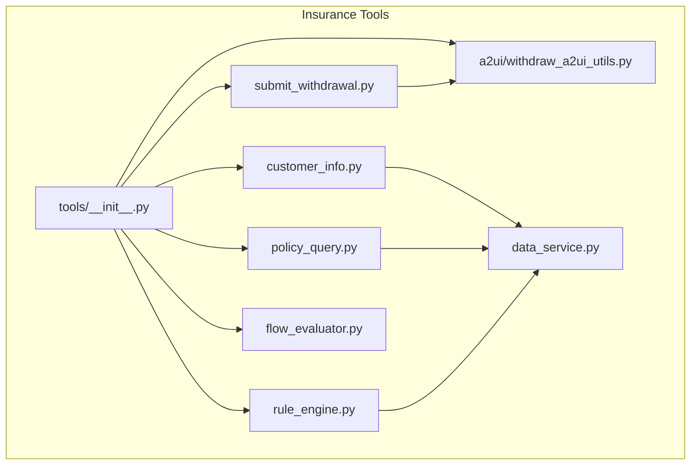
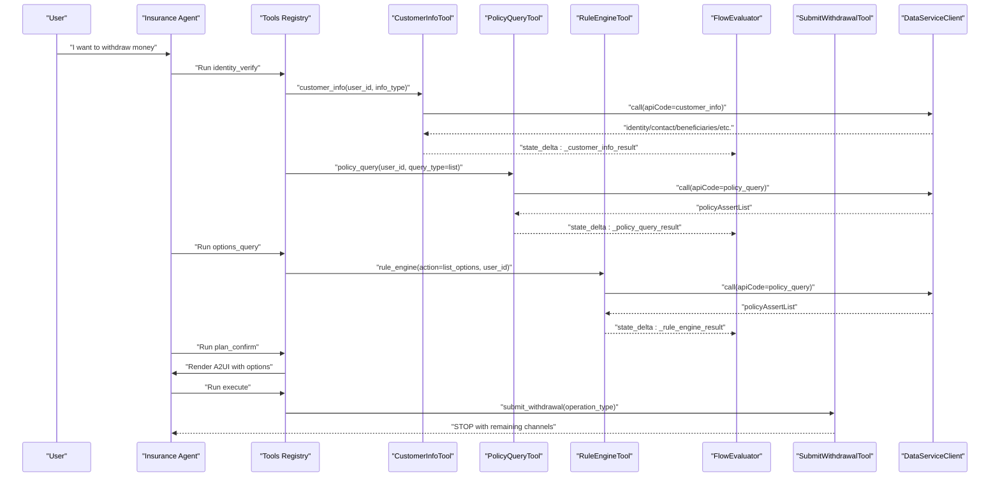
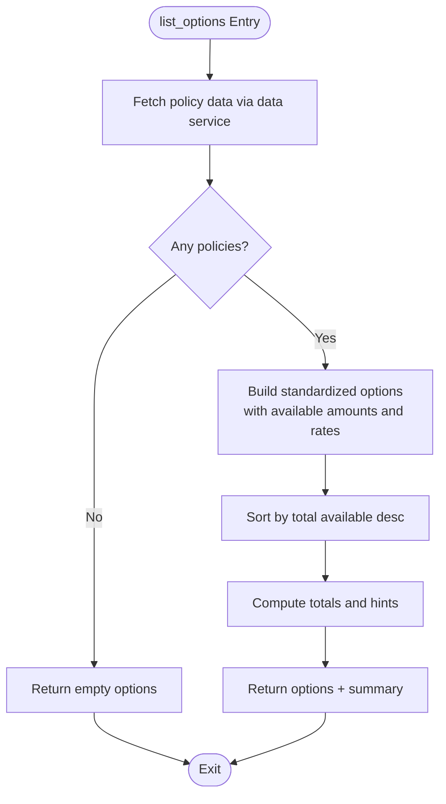
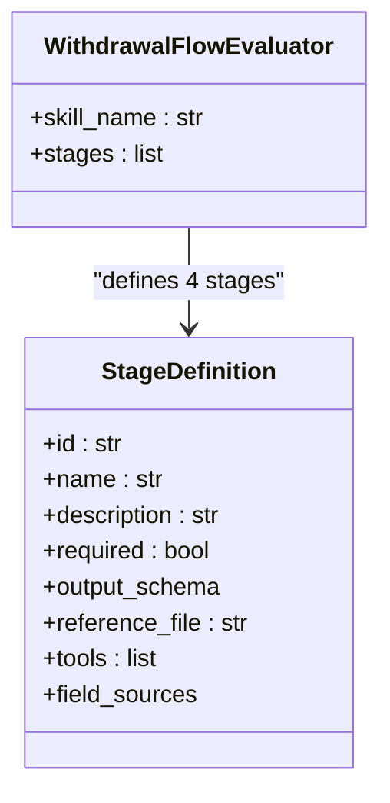
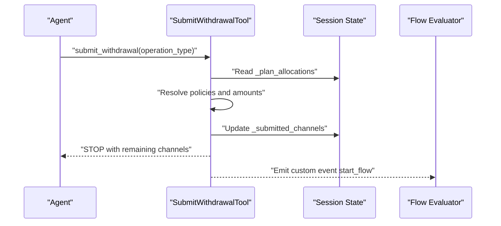
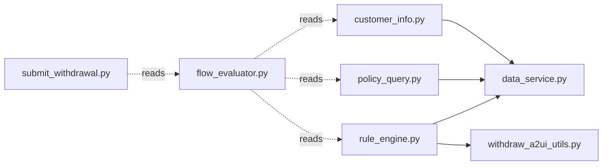

# Insurance Agent Tools

<cite>
**Referenced Files in This Document**
- [tools/__init__.py](file://src/ark_agentic/agents/insurance/tools/__init__.py)
- [customer_info.py](file://src/ark_agentic/agents/insurance/tools/customer_info.py)
- [policy_query.py](file://src/ark_agentic/agents/insurance/tools/policy_query.py)
- [rule_engine.py](file://src/ark_agentic/agents/insurance/tools/rule_engine.py)
- [flow_evaluator.py](file://src/ark_agentic/agents/insurance/tools/flow_evaluator.py)
- [submit_withdrawal.py](file://src/ark_agentic/agents/insurance/tools/submit_withdrawal.py)
- [data_service.py](file://src/ark_agentic/agents/insurance/tools/data_service.py)
- [withdraw_a2ui_utils.py](file://src/ark_agentic/agents/insurance/a2ui/withdraw_a2ui_utils.py)
- [guard.py](file://src/ark_agentic/agents/insurance/guard.py)
- [tracing.py](file://src/ark_agentic/core/observability/tracing.py)
- [langfuse.py](file://src/ark_agentic/core/observability/providers/langfuse.py)
</cite>

## Table of Contents
1. [Introduction](#introduction)
2. [Project Structure](#project-structure)
3. [Core Components](#core-components)
4. [Architecture Overview](#architecture-overview)
5. [Detailed Component Analysis](#detailed-component-analysis)
6. [Dependency Analysis](#dependency-analysis)
7. [Performance Considerations](#performance-considerations)
8. [Troubleshooting Guide](#troubleshooting-guide)
9. [Conclusion](#conclusion)
10. [Appendices](#appendices)

## Introduction
This document describes the Insurance Agent tools subsystem responsible for end-to-end insurance withdrawal workflows. It covers five core tools:
- customer_info: Retrieve client data (identity, contact, beneficiaries, transaction/service history)
- policy_query: Fetch user’s policies and cash values
- rule_engine: Compute feasible withdrawal options and channel-specific fees/costs
- flow_evaluator: Enforce a 4-stage withdrawal process with state-driven completion criteria
- submit_withdrawal: Commit a chosen withdrawal operation to backend systems

It also documents tool registration, parameter validation, error handling, integration with external insurance systems, security and privacy considerations, and audit trail generation for regulatory compliance.

## Project Structure
The Insurance Agent tools live under the insurance agent module and integrate with shared A2UI rendering and flow evaluation infrastructure.

**Diagram sources**
- [tools/__init__.py:77-110](file://src/ark_agentic/agents/insurance/tools/__init__.py#L77-L110)
- [customer_info.py:26-94](file://src/ark_agentic/agents/insurance/tools/customer_info.py#L26-L94)
- [policy_query.py:25-77](file://src/ark_agentic/agents/insurance/tools/policy_query.py#L25-L77)
- [rule_engine.py:99-445](file://src/ark_agentic/agents/insurance/tools/rule_engine.py#L99-L445)
- [flow_evaluator.py:65-183](file://src/ark_agentic/agents/insurance/tools/flow_evaluator.py#L65-L183)
- [submit_withdrawal.py:136-214](file://src/ark_agentic/agents/insurance/tools/submit_withdrawal.py#L136-L214)
- [data_service.py:22-452](file://src/ark_agentic/agents/insurance/tools/data_service.py#L22-L452)
- [withdraw_a2ui_utils.py:12-123](file://src/ark_agentic/agents/insurance/a2ui/withdraw_a2ui_utils.py#L12-L123)

**Section sources**
- [tools/__init__.py:1-110](file://src/ark_agentic/agents/insurance/tools/__init__.py#L1-L110)

## Core Components
- customer_info: Queries identity, contact, beneficiaries, and histories via a unified API.
- policy_query: Retrieves policy lists and associated cash values.
- rule_engine: Standardizes per-policy amounts and computes channel-specific outcomes and fees.
- flow_evaluator: Defines 4 stages (identity_verify, options_query, plan_confirm, execute) with state-driven completion conditions.
- submit_withdrawal: Commits a selected operation to backend flows and emits events to drive external processes.

Each tool is registered and exposed through the insurance tools factory, enabling minimal or full tool sets depending on environment needs.

**Section sources**
- [tools/__init__.py:77-110](file://src/ark_agentic/agents/insurance/tools/__init__.py#L77-L110)
- [customer_info.py:26-94](file://src/ark_agentic/agents/insurance/tools/customer_info.py#L26-L94)
- [policy_query.py:25-77](file://src/ark_agentic/agents/insurance/tools/policy_query.py#L25-L77)
- [rule_engine.py:99-445](file://src/ark_agentic/agents/insurance/tools/rule_engine.py#L99-L445)
- [flow_evaluator.py:65-183](file://src/ark_agentic/agents/insurance/tools/flow_evaluator.py#L65-L183)
- [submit_withdrawal.py:136-214](file://src/ark_agentic/agents/insurance/tools/submit_withdrawal.py#L136-L214)

## Architecture Overview
The tools interact with a shared data service client that authenticates and calls backend APIs. Results are stored in agent state keys and later consumed by the flow evaluator and A2UI renderer.

**Diagram sources**
- [flow_evaluator.py:76-177](file://src/ark_agentic/agents/insurance/tools/flow_evaluator.py#L76-L177)
- [customer_info.py:69-94](file://src/ark_agentic/agents/insurance/tools/customer_info.py#L69-L94)
- [policy_query.py:55-77](file://src/ark_agentic/agents/insurance/tools/policy_query.py#L55-L77)
- [rule_engine.py:155-204](file://src/ark_agentic/agents/insurance/tools/rule_engine.py#L155-L204)
- [submit_withdrawal.py:152-214](file://src/ark_agentic/agents/insurance/tools/submit_withdrawal.py#L152-L214)
- [data_service.py:73-129](file://src/ark_agentic/agents/insurance/tools/data_service.py#L73-L129)

## Detailed Component Analysis

### customer_info Tool
- Purpose: Retrieve client data across identity, contact, beneficiaries, transaction history, service history, or full profile.
- Parameters:
  - user_id (string, required)
  - info_type (string, required; enum: identity, contact, beneficiary, transaction_history, service_history, full)
  - policy_id (string, optional; required when querying beneficiaries)
- Execution:
  - Validates inputs and calls the data service API with apiCode=customer_info.
  - On success, stores result in state key _customer_info_result and returns JSON result with metadata.
  - On error, logs and returns an error result.
- Usage pattern:
  - Typically invoked during identity_verify stage to validate ID and collect policy IDs.
- Security and privacy:
  - Uses authenticated calls; ensure environment variables for service URLs and credentials are set securely.
- Audit:
  - Errors are logged; enable tracing to capture tool invocations.

**Section sources**
- [customer_info.py:26-94](file://src/ark_agentic/agents/insurance/tools/customer_info.py#L26-L94)
- [data_service.py:22-129](file://src/ark_agentic/agents/insurance/tools/data_service.py#L22-L129)

### policy_query Tool
- Purpose: Fetch user’s policies and cash values for downstream calculations.
- Parameters:
  - user_id (string, required)
  - query_type (string, required; enum: list)
- Execution:
  - Calls data service API with apiCode=policy_query and query_type=list.
  - Stores result in state key _policy_query_result and returns JSON result.
- Usage pattern:
  - Used in identity_verify to enumerate policy IDs and in options_query to feed rule_engine.
- Security and privacy:
  - Same authentication model as customer_info.
- Audit:
  - Errors are logged; tracing captures calls.

**Section sources**
- [policy_query.py:25-77](file://src/ark_agentic/agents/insurance/tools/policy_query.py#L25-L77)
- [data_service.py:22-129](file://src/ark_agentic/agents/insurance/tools/data_service.py#L22-L129)

### rule_engine Tool
- Purpose: Standardize per-policy available amounts and compute channel-specific outcomes.
- Actions:
  - list_options: Given user_id, fetches policies and returns standardized records with four available amounts and fees.
  - calculate_detail: Given a single policy record and channel, returns precise fee/net/interest details.
- Parameters:
  - action (string, required; enum: list_options, calculate_detail)
  - user_id (string, required for list_options)
  - policy (object, required for calculate_detail)
  - option_type (string, required for calculate_detail; enum: survival_fund, bonus, partial_withdrawal, surrender, policy_loan)
  - amount (number, optional)
- Execution:
  - For list_options: queries policy data, computes per-policy totals and fees, sorts by availability, and optionally builds a combination hint.
  - For calculate_detail: resolves available amount per channel, applies fee schedule by policy year, and adds interest for loans.
  - Stores result in state key _rule_engine_result and attaches an LLM digest summarizing channels and totals.
- Business logic highlights:
  - Fee schedule by policy year for partial withdrawals.
  - Loan interest rate constant.
  - Channel availability depends on product type and policy attributes.
- Usage pattern:
  - Invoked after identity verification to present options; used iteratively to refine selections.
- Security and privacy:
  - Operates on normalized amounts; no PII exposure beyond what is already available.
- Audit:
  - Summaries are emitted as LLM digest; enable tracing for end-to-end visibility.

**Diagram sources**
- [rule_engine.py:209-301](file://src/ark_agentic/agents/insurance/tools/rule_engine.py#L209-L301)

**Section sources**
- [rule_engine.py:99-445](file://src/ark_agentic/agents/insurance/tools/rule_engine.py#L99-L445)
- [data_service.py:22-129](file://src/ark_agentic/agents/insurance/tools/data_service.py#L22-L129)
- [withdraw_a2ui_utils.py:55-69](file://src/ark_agentic/agents/insurance/a2ui/withdraw_a2ui_utils.py#L55-L69)

### flow_evaluator (WithdrawalFlowEvaluator)
- Purpose: Define and evaluate the 4-stage withdrawal workflow.
- Stages:
  - identity_verify: Requires customer_info and policy_query; completes when user_id, id_card_verified, and policy_ids are available.
  - options_query: Requires rule_engine; completes when available_options and totals are populated.
  - plan_confirm: A2UI-driven confirmation; requires user-provided selected_option and amount.
  - execute: Requires submit_withdrawal; completes when submission is recorded.
- Field sources:
  - Maps state keys (_customer_info_result, _policy_query_result, _rule_engine_result, _submitted_channels) to stage outputs.
- Integration:
  - Registered globally; required tools are declared per stage.

**Diagram sources**
- [flow_evaluator.py:65-177](file://src/ark_agentic/agents/insurance/tools/flow_evaluator.py#L65-L177)

**Section sources**
- [flow_evaluator.py:1-183](file://src/ark_agentic/agents/insurance/tools/flow_evaluator.py#L1-L183)

### submit_withdrawal Tool
- Purpose: Commit a chosen withdrawal operation to backend flows and emit events to drive external processes.
- Parameters:
  - operation_type (string; enum: shengcunjin, bonus, loan, partial, surrender)
- Execution:
  - Resolves policies and amounts from session state (_plan_allocations).
  - Prevents duplicate submissions for the same channel.
  - Computes remaining channels in the same plan and constructs a human-readable STOP message.
  - Emits a custom event with flow_type and query_msg payload.
  - Updates state with _submitted_channels and returns a structured digest for continuation.
- Usage pattern:
  - Called after user confirms a plan; agent stops and continues on subsequent turns with remaining channels.

**Diagram sources**
- [submit_withdrawal.py:152-214](file://src/ark_agentic/agents/insurance/tools/submit_withdrawal.py#L152-L214)

**Section sources**
- [submit_withdrawal.py:136-214](file://src/ark_agentic/agents/insurance/tools/submit_withdrawal.py#L136-L214)

### Tool Registration and Factory
- create_insurance_tools: Builds a full toolset including customer_info, policy_query, rule_engine, A2UI renderer, submit_withdrawal, flow commit tool, flow evaluator, and a task resumer.
- create_insurance_tools_minimal: Builds a minimal toolset for testing (customer_info, policy_query, rule_engine, A2UI renderer).
- State keys used by tools:
  - _customer_info_result
  - _policy_query_result
  - _rule_engine_result

**Section sources**
- [tools/__init__.py:77-110](file://src/ark_agentic/agents/insurance/tools/__init__.py#L77-L110)

## Dependency Analysis
- External integration:
  - All tools depend on a shared data service client that handles OAuth token caching, request signing, and response parsing.
  - The data service supports two APIs (policy_query, customer_info) via a single base URL and apiCode differentiation.
- Internal dependencies:
  - rule_engine depends on withdraw_a2ui_utils for channel semantics and allocation helpers.
  - flow_evaluator depends on state keys written by tools to define stage completion.
  - submit_withdrawal depends on session state for plan allocations and channel tracking.

**Diagram sources**
- [data_service.py:22-452](file://src/ark_agentic/agents/insurance/tools/data_service.py#L22-L452)
- [rule_engine.py:33-39](file://src/ark_agentic/agents/insurance/tools/rule_engine.py#L33-L39)
- [flow_evaluator.py:86-176](file://src/ark_agentic/agents/insurance/tools/flow_evaluator.py#L86-L176)
- [submit_withdrawal.py:52-91](file://src/ark_agentic/agents/insurance/tools/submit_withdrawal.py#L52-L91)

**Section sources**
- [data_service.py:22-452](file://src/ark_agentic/agents/insurance/tools/data_service.py#L22-L452)
- [rule_engine.py:33-39](file://src/ark_agentic/agents/insurance/tools/rule_engine.py#L33-L39)
- [flow_evaluator.py:86-176](file://src/ark_agentic/agents/insurance/tools/flow_evaluator.py#L86-L176)
- [submit_withdrawal.py:52-91](file://src/ark_agentic/agents/insurance/tools/submit_withdrawal.py#L52-L91)

## Performance Considerations
- Token caching: DataServiceClient caches access tokens with a safety buffer to reduce auth overhead.
- Request batching: Tools issue separate calls per concern (identity, policies, options). Consolidation is not implemented; keep tool calls minimal and state-driven.
- Parsing robustness: Response parsing tolerates nested JSON strings and falls back gracefully.
- Rendering cost: A2UI rendering is offloaded to UI components; avoid excessive re-renders by limiting state updates.

[No sources needed since this section provides general guidance]

## Troubleshooting Guide
- Authentication failures:
  - Ensure DATA_SERVICE_AUTH_URL, DATA_SERVICE_CLIENT_ID, DATA_SERVICE_CLIENT_SECRET, DATA_SERVICE_GRANT_TYPE are configured.
  - Verify network connectivity and endpoint reachability.
- Missing or expired tokens:
  - Tokens refresh automatically; check logs for auth errors and retry.
- Tool parameter errors:
  - customer_info requires user_id and info_type; policy_query requires user_id and query_type.
  - rule_engine requires either user_id (list_options) or policy + option_type (calculate_detail).
  - submit_withdrawal requires operation_type and expects _plan_allocations to contain matching channel allocations.
- Error propagation:
  - Tools catch DataServiceError and return error results; inspect logs for detailed messages.
- Flow stalls:
  - Ensure each stage writes the required state keys; flow_evaluator waits for presence of mapped fields.

**Section sources**
- [data_service.py:146-194](file://src/ark_agentic/agents/insurance/tools/data_service.py#L146-L194)
- [customer_info.py:82-91](file://src/ark_agentic/agents/insurance/tools/customer_info.py#L82-L91)
- [policy_query.py:65-74](file://src/ark_agentic/agents/insurance/tools/policy_query.py#L65-L74)
- [rule_engine.py:162-192](file://src/ark_agentic/agents/insurance/tools/rule_engine.py#L162-L192)
- [submit_withdrawal.py:158-189](file://src/ark_agentic/agents/insurance/tools/submit_withdrawal.py#L158-L189)

## Conclusion
The Insurance Agent tools subsystem provides a secure, state-driven workflow for insurance withdrawals. By standardizing data access, computing channel-specific outcomes, enforcing a 4-stage flow, and committing operations to backend systems, it enables compliant, auditable, and user-friendly insurance claim processing.

[No sources needed since this section summarizes without analyzing specific files]

## Appendices

### Practical Examples and Usage Patterns
- Identity verification:
  - Invoke customer_info with info_type=identity and policy_query with query_type=list to populate state keys for downstream stages.
- Option selection:
  - Call rule_engine with action=list_options to receive standardized per-policy amounts and totals; optionally call calculate_detail for a specific channel to confirm fees/interest.
- Plan confirmation:
  - Render A2UI using the unified renderer and collect user confirmation; persist selected_option and amount in stage outputs.
- Execution:
  - Call submit_withdrawal with operation_type to commit the chosen channel; agent will stop and continue on remaining channels.

[No sources needed since this section provides general guidance]

### Security and Privacy Considerations
- Access control:
  - Use environment variables for service URLs and credentials; restrict access to deployment environments.
- Data minimization:
  - Tools operate on normalized amounts; avoid exposing raw PII beyond identity verification.
- Consent and transparency:
  - Ensure users are informed about data collection and processing; maintain clear consent mechanisms.
- Compliance:
  - Enable observability and audit trails as described below.

**Section sources**
- [data_service.py:52-60](file://src/ark_agentic/agents/insurance/tools/data_service.py#L52-L60)
- [guard.py:37-66](file://src/ark_agentic/agents/insurance/guard.py#L37-L66)

### Audit Trail and Observability
- Tracing:
  - Configure TRACING to enable OpenTelemetry exporters (console, phoenix, langfuse, otlp, auto).
  - Langfuse provider supports basic-auth headers via environment variables.
  - LangChain auto-instrumentation is enabled when providers are configured.
- Event emission:
  - submit_withdrawal emits a custom event start_flow with flow_type and query_msg payload to drive external flows.
- Logging:
  - Tools log errors and debug information; combine with tracing for end-to-end visibility.

**Section sources**
- [tracing.py:35-99](file://src/ark_agentic/core/observability/tracing.py#L35-L99)
- [langfuse.py:13-48](file://src/ark_agentic/core/observability/providers/langfuse.py#L13-L48)
- [submit_withdrawal.py:206-211](file://src/ark_agentic/agents/insurance/tools/submit_withdrawal.py#L206-L211)