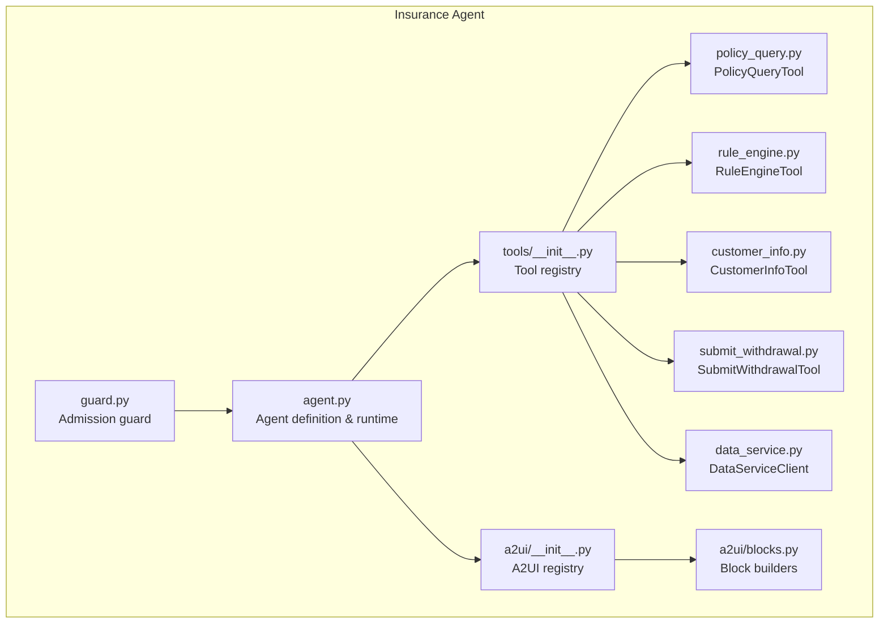
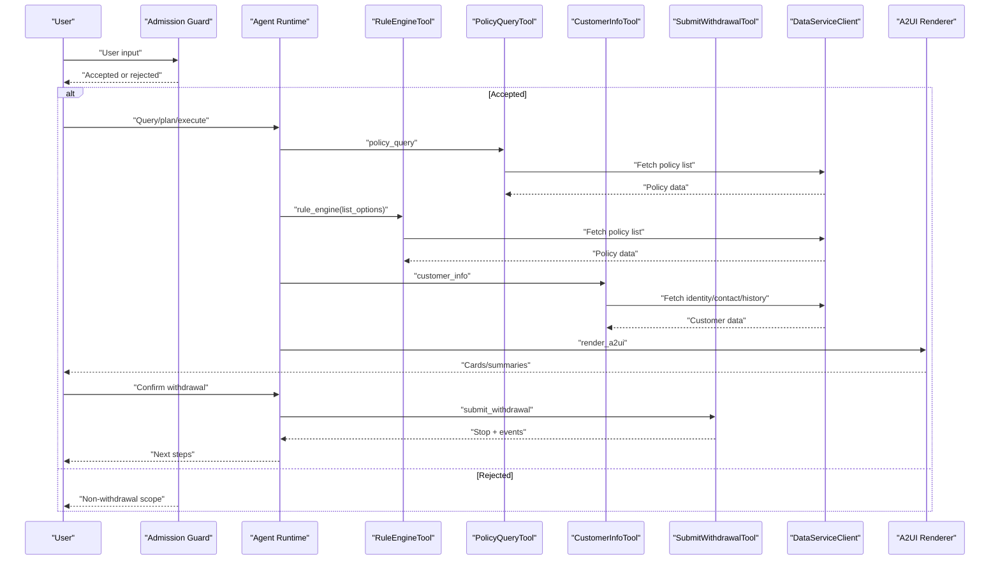
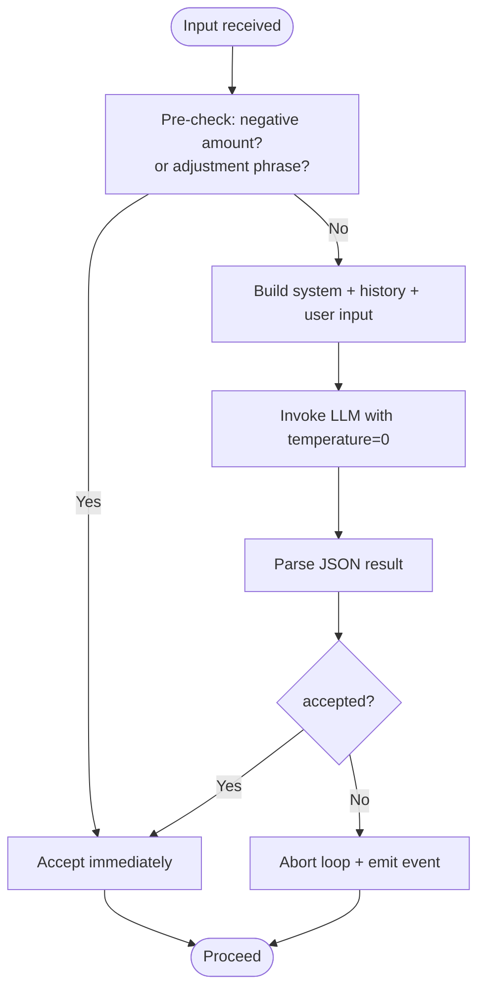
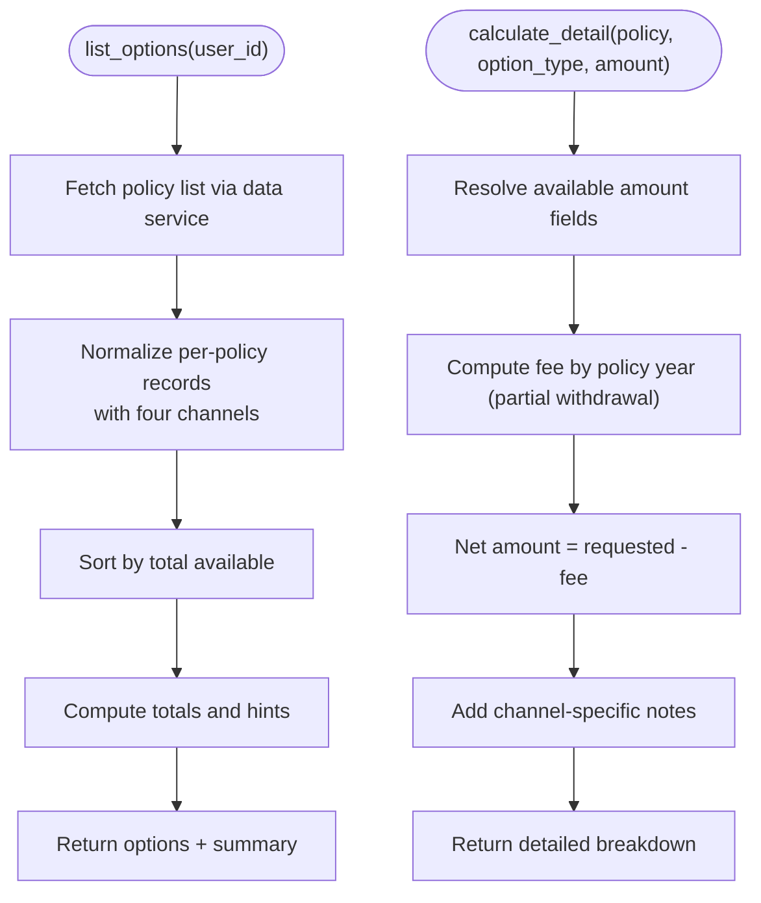
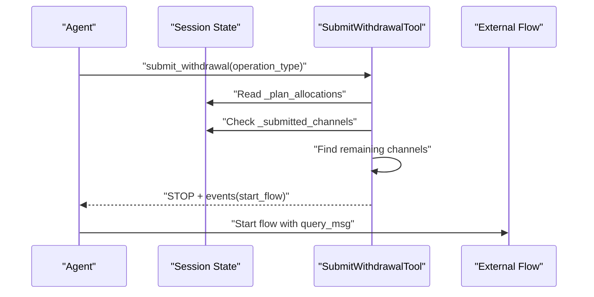
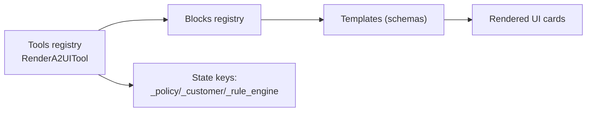
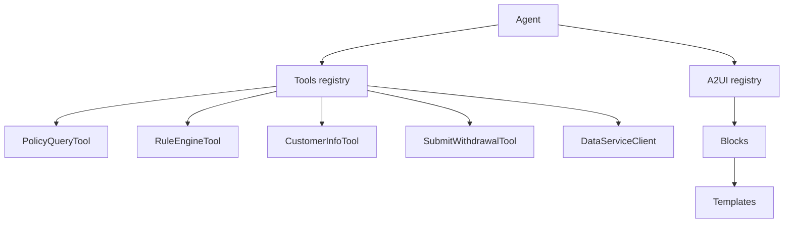

# Insurance Agent

<cite>
**Referenced Files in This Document**
- [agent.py](file://src/ark_agentic/agents/insurance/agent.py)
- [agent.json](file://src/ark_agentic/agents/insurance/agent.json)
- [guard.py](file://src/ark_agentic/agents/insurance/guard.py)
- [tools/__init__.py](file://src/ark_agentic/agents/insurance/tools/__init__.py)
- [policy_query.py](file://src/ark_agentic/agents/insurance/tools/policy_query.py)
- [rule_engine.py](file://src/ark_agentic/agents/insurance/tools/rule_engine.py)
- [customer_info.py](file://src/ark_agentic/agents/insurance/tools/customer_info.py)
- [submit_withdrawal.py](file://src/ark_agentic/agents/insurance/tools/submit_withdrawal.py)
- [data_service.py](file://src/ark_agentic/agents/insurance/tools/data_service.py)
- [a2ui/__init__.py](file://src/ark_agentic/agents/insurance/a2ui/__init__.py)
- [a2ui/blocks.py](file://src/ark_agentic/agents/insurance/a2ui/blocks.py)
- [docs/a2ui/a2ui-withdraw-ui-schema.json](file://docs/a2ui/a2ui-withdraw-ui-schema.json)
- [docs/a2ui/a2ui-withdraw-plan-ui-schema.json](file://docs/a2ui/a2ui-withdraw-ui-schema.json)
- [docs/a2ui/a2ui-withdraw-plan-ui-schema.json](file://docs/a2ui/a2ui-withdraw-plan-ui-schema.json)
</cite>

## Table of Contents
1. [Introduction](#introduction)
2. [Project Structure](#project-structure)
3. [Core Components](#core-components)
4. [Architecture Overview](#architecture-overview)
5. [Detailed Component Analysis](#detailed-component-analysis)
6. [Dependency Analysis](#dependency-analysis)
7. [Performance Considerations](#performance-considerations)
8. [Troubleshooting Guide](#troubleshooting-guide)
9. [Conclusion](#conclusion)
10. [Appendices](#appendices)

## Introduction
The Insurance Agent is a specialized assistant designed to support insurance consultation and business processing workflows. It guides users through withdrawal-related operations (such as survival benefits, bonuses, partial withdrawals, loans, and surrenders) by integrating customer and policy data, applying deterministic rules, and rendering insurance-focused user interfaces. The agent enforces a strict system protocol, manages memory and background learning, and coordinates with external insurance systems via a unified data service client.

## Project Structure
The insurance agent is organized under a dedicated namespace with clear separation of concerns:
- Agent definition and runtime integration
- Tools for customer info, policy queries, rule engine evaluation, and withdrawal submission
- A2UI components and templates for insurance-specific UI rendering
- Admission guard for intake classification
- Data service client for secure, authenticated access to backend systems

**Diagram sources**
- [agent.py:38-75](file://src/ark_agentic/agents/insurance/agent.py#L38-L75)
- [guard.py:71-164](file://src/ark_agentic/agents/insurance/guard.py#L71-L164)
- [tools/__init__.py:77-110](file://src/ark_agentic/agents/insurance/tools/__init__.py#L77-L110)
- [policy_query.py:25-77](file://src/ark_agentic/agents/insurance/tools/policy_query.py#L25-L77)
- [rule_engine.py:99-445](file://src/ark_agentic/agents/insurance/tools/rule_engine.py#L99-L445)
- [customer_info.py:26-94](file://src/ark_agentic/agents/insurance/tools/customer_info.py#L26-L94)
- [submit_withdrawal.py:136-214](file://src/ark_agentic/agents/insurance/tools/submit_withdrawal.py#L136-L214)
- [data_service.py:22-452](file://src/ark_agentic/agents/insurance/tools/data_service.py#L22-L452)
- [a2ui/__init__.py:1-23](file://src/ark_agentic/agents/insurance/a2ui/__init__.py#L1-L23)
- [a2ui/blocks.py:25-145](file://src/ark_agentic/agents/insurance/a2ui/blocks.py#L25-L145)

**Section sources**
- [agent.py:38-75](file://src/ark_agentic/agents/insurance/agent.py#L38-L75)
- [tools/__init__.py:77-110](file://src/ark_agentic/agents/insurance/tools/__init__.py#L77-L110)
- [a2ui/__init__.py:1-23](file://src/ark_agentic/agents/insurance/a2ui/__init__.py#L1-L23)

## Core Components
- Agent definition and runtime: Defines system protocol, agent identity, and builds a standard agent with skills, tools, memory, and callbacks.
- Admission guard: A deterministic classifier that determines whether a user input falls within the scope of withdrawal-related operations.
- Tools:
  - PolicyQueryTool: Retrieves policy lists and details.
  - RuleEngineTool: Computes available amounts per channel, applies fee schedules, and produces LLM-friendly summaries.
  - CustomerInfoTool: Fetches identity, contact, beneficiary, and transaction/service histories.
  - SubmitWithdrawalTool: Commits a chosen withdrawal channel and emits flow events.
  - DataServiceClient: Unified client for authenticated API calls with token caching and robust parsing.
- A2UI integration: Provides themed blocks and components for rendering insurance-specific UI cards and plans.

Key configuration highlights:
- System protocol emphasizes concise tool calls, risk disclosure for sensitive actions, and avoiding redundant numeric disclosures after rendered cards.
- Memory and Dream features can be toggled; sessions directory is derived from the agent’s data path.
- Tool state keys are managed to persist intermediate results across turns.

**Section sources**
- [agent.py:30-44](file://src/ark_agentic/agents/insurance/agent.py#L30-L44)
- [agent.py:66-75](file://src/ark_agentic/agents/insurance/agent.py#L66-L75)
- [guard.py:37-66](file://src/ark_agentic/agents/insurance/guard.py#L37-L66)
- [tools/__init__.py:48-58](file://src/ark_agentic/agents/insurance/tools/__init__.py#L48-L58)
- [tools/__init__.py:77-97](file://src/ark_agentic/agents/insurance/tools/__init__.py#L77-L97)

## Architecture Overview
The agent orchestrates a closed-loop workflow:
- User input is pre-classified by the admission guard.
- Tools retrieve and process data, compute options, and update session state.
- A2UI renders actionable cards and summaries.
- Withdrawal submission triggers backend flows and cross-turn continuation.

**Diagram sources**
- [guard.py:102-132](file://src/ark_agentic/agents/insurance/guard.py#L102-L132)
- [policy_query.py:55-77](file://src/ark_agentic/agents/insurance/tools/policy_query.py#L55-L77)
- [rule_engine.py:155-204](file://src/ark_agentic/agents/insurance/tools/rule_engine.py#L155-L204)
- [customer_info.py:69-94](file://src/ark_agentic/agents/insurance/tools/customer_info.py#L69-L94)
- [submit_withdrawal.py:152-214](file://src/ark_agentic/agents/insurance/tools/submit_withdrawal.py#L152-L214)
- [data_service.py:73-129](file://src/ark_agentic/agents/insurance/tools/data_service.py#L73-L129)
- [tools/__init__.py:48-58](file://src/ark_agentic/agents/insurance/tools/__init__.py#L48-L58)

## Detailed Component Analysis

### Agent Definition and Runtime
- Purpose: Creates a standardized agent with a fixed identity and system protocol tailored for insurance withdrawal workflows.
- Configuration:
  - System protocol restricts tool-call-only behavior, requires risk prompts for sensitive operations, and prohibits repeating numeric details after UI cards.
  - Session persistence is enabled; flow callbacks manage context injection and persistence.
  - Skills directory is resolved under the insurance agent path.
  - Optional memory and Dream features can be toggled; sessions directory is prepared from the agent’s data path.

Practical instantiation:
- Use the creation function to instantiate the agent with an optional LLM, and toggle memory/Dream flags as needed.

**Section sources**
- [agent.py:30-44](file://src/ark_agentic/agents/insurance/agent.py#L30-L44)
- [agent.py:66-75](file://src/ark_agentic/agents/insurance/agent.py#L66-L75)
- [agent.json:1-8](file://src/ark_agentic/agents/insurance/agent.json#L1-L8)

### Admission Guard (Intake Classifier)
- Purpose: Deterministically classify whether a user input belongs to the withdrawal scope using a small set of patterns and a zero-temperature LLM classification.
- Behavior:
  - Pre-checks for negative amounts and adjustment phrases; if conclusive, returns immediately.
  - Otherwise, constructs a system prompt and recent history window, invokes the LLM, parses JSON, and returns a guard result.
  - On rejection, aborts the agent loop and emits a custom event.

**Diagram sources**
- [guard.py:84-101](file://src/ark_agentic/agents/insurance/guard.py#L84-L101)
- [guard.py:112-132](file://src/ark_agentic/agents/insurance/guard.py#L112-L132)
- [guard.py:145-162](file://src/ark_agentic/agents/insurance/guard.py#L145-L162)

**Section sources**
- [guard.py:37-66](file://src/ark_agentic/agents/insurance/guard.py#L37-L66)
- [guard.py:102-132](file://src/ark_agentic/agents/insurance/guard.py#L102-L132)
- [guard.py:134-164](file://src/ark_agentic/agents/insurance/guard.py#L134-L164)

### Tools: Customer Information Retrieval
- Tool: CustomerInfoTool
- Capabilities:
  - Identity, contact, beneficiary, transaction history, service history, and full profile retrieval.
  - Uses the data service client with appropriate API code and parameters.
  - Persists results into session state for downstream use.

Operational notes:
- Requires user_id and info_type; optional policy_id for beneficiary queries.
- Errors propagate as tool errors with structured metadata.

**Section sources**
- [customer_info.py:26-94](file://src/ark_agentic/agents/insurance/tools/customer_info.py#L26-L94)
- [data_service.py:73-129](file://src/ark_agentic/agents/insurance/tools/data_service.py#L73-L129)

### Tools: Policy Queries
- Tool: PolicyQueryTool
- Capabilities:
  - Lists policies for a given user_id.
  - Integrates with the data service client and stores results in session state.

**Section sources**
- [policy_query.py:25-77](file://src/ark_agentic/agents/insurance/tools/policy_query.py#L25-L77)
- [data_service.py:73-129](file://src/ark_agentic/agents/insurance/tools/data_service.py#L73-L129)

### Tools: Rule Engine Evaluation
- Tool: RuleEngineTool
- Capabilities:
  - list_options: Aggregates per-policy amounts (survival fund, bonus, loan, refund), computes totals, and builds a channel-level summary for LLM consumption.
  - calculate_detail: Performs precise calculations for a single channel (e.g., partial withdrawal fee, policy loan interest).
  - Applies fee schedule by policy year and uniform processing time.
  - Emits structured LLM digest for downstream skills.

**Diagram sources**
- [rule_engine.py:209-301](file://src/ark_agentic/agents/insurance/tools/rule_engine.py#L209-L301)
- [rule_engine.py:338-445](file://src/ark_agentic/agents/insurance/tools/rule_engine.py#L338-L445)

**Section sources**
- [rule_engine.py:99-204](file://src/ark_agentic/agents/insurance/tools/rule_engine.py#L99-L204)
- [rule_engine.py:307-333](file://src/ark_agentic/agents/insurance/tools/rule_engine.py#L307-L333)

### Tools: Withdrawal Submission
- Tool: SubmitWithdrawalTool
- Capabilities:
  - Resolves selected policies and amounts from session state (_plan_allocations).
  - Prevents duplicate submissions and checks remaining channels in the same plan.
  - Emits a custom event to start the backend flow and returns a STOP action with a human-readable message and structured digest for continuation.

**Diagram sources**
- [submit_withdrawal.py:152-214](file://src/ark_agentic/agents/insurance/tools/submit_withdrawal.py#L152-L214)

**Section sources**
- [submit_withdrawal.py:136-214](file://src/ark_agentic/agents/insurance/tools/submit_withdrawal.py#L136-L214)

### Data Service Client
- Responsibilities:
  - Centralized OAuth token acquisition and caching with safety margin.
  - Uniform form-encoded requests with appId/clientType/requestId/access_token/apiCode/reqChannel.
  - Robust response parsing supporting nested JSON strings.
- Modes:
  - Real client with environment-driven configuration.
  - Mock client for development/testing, returning deterministic datasets.

Security and reliability:
- Token refresh with expiration buffer.
- Structured error propagation for upstream handling.

**Section sources**
- [data_service.py:22-195](file://src/ark_agentic/agents/insurance/tools/data_service.py#L22-L195)
- [data_service.py:236-452](file://src/ark_agentic/agents/insurance/tools/data_service.py#L236-L452)

### A2UI Integration for Insurance UIs
- Registry:
  - Components and blocks are registered under the insurance namespace with a themed component set.
  - RenderA2UITool is configured with blocks, schemas, and state keys to persist intermediate results.
- Blocks:
  - SectionHeader, KVRow, AccentTotal, HintText, ActionButton, Divider are themed for consistent presentation.
- Templates:
  - Withdrawal UI and plan templates define schema contracts for rendering.

**Diagram sources**
- [tools/__init__.py:48-58](file://src/ark_agentic/agents/insurance/tools/__init__.py#L48-L58)
- [a2ui/__init__.py:1-23](file://src/ark_agentic/agents/insurance/a2ui/__init__.py#L1-L23)
- [a2ui/blocks.py:25-145](file://src/ark_agentic/agents/insurance/a2ui/blocks.py#L25-L145)
- [docs/a2ui/a2ui-withdraw-ui-schema.json](file://docs/a2ui/a2ui-withdraw-ui-schema.json)
- [docs/a2ui/a2ui-withdraw-plan-ui-schema.json](file://docs/a2ui/a2ui-withdraw-plan-ui-schema.json)

**Section sources**
- [tools/__init__.py:31-58](file://src/ark_agentic/agents/insurance/tools/__init__.py#L31-L58)
- [a2ui/__init__.py:1-23](file://src/ark_agentic/agents/insurance/a2ui/__init__.py#L1-L23)
- [a2ui/blocks.py:25-145](file://src/ark_agentic/agents/insurance/a2ui/blocks.py#L25-L145)

## Dependency Analysis
- Agent depends on:
  - Tools registry for insurance tools
  - A2UI components for rendering
  - Flow callbacks for session persistence
- Tools depend on:
  - DataServiceClient for backend integration
  - Session state for cross-turn continuity
- A2UI depends on:
  - Themed blocks and component schemas
  - Templates for schema-constrained rendering

**Diagram sources**
- [agent.py:66-75](file://src/ark_agentic/agents/insurance/agent.py#L66-L75)
- [tools/__init__.py:77-110](file://src/ark_agentic/agents/insurance/tools/__init__.py#L77-L110)
- [data_service.py:22-452](file://src/ark_agentic/agents/insurance/tools/data_service.py#L22-L452)
- [a2ui/__init__.py:1-23](file://src/ark_agentic/agents/insurance/a2ui/__init__.py#L1-L23)
- [a2ui/blocks.py:25-145](file://src/ark_agentic/agents/insurance/a2ui/blocks.py#L25-L145)

**Section sources**
- [agent.py:66-75](file://src/ark_agentic/agents/insurance/agent.py#L66-L75)
- [tools/__init__.py:77-110](file://src/ark_agentic/agents/insurance/tools/__init__.py#L77-L110)

## Performance Considerations
- Token caching minimizes repeated authentication overhead; ensure environment variables are set for production.
- RuleEngineTool performs deterministic computations; keep input datasets minimal to reduce sorting and aggregation costs.
- A2UI rendering leverages reusable blocks and schemas; avoid excessive recomputation by reusing state deltas.
- Memory and Dream features improve long-term recall but increase I/O; enable only when needed.

## Troubleshooting Guide
Common issues and resolutions:
- Admission guard rejects input:
  - Verify user intent aligns with withdrawal scope; adjust phrasing to explicit actions.
  - History context may be required for continuation phrases.
- Tool errors:
  - Policy/customer queries failing often indicate missing or invalid user_id or unsupported info_type.
  - Inspect data service logs and error payloads.
- Token failures:
  - Ensure authentication URLs and credentials are configured; check token expiry and network connectivity.
- A2UI rendering anomalies:
  - Confirm template schemas and state keys match rendered components.
  - Validate that numeric disclosures are not duplicated after cards.

**Section sources**
- [guard.py:121-132](file://src/ark_agentic/agents/insurance/guard.py#L121-L132)
- [policy_query.py:71-77](file://src/ark_agentic/agents/insurance/tools/policy_query.py#L71-L77)
- [customer_info.py:82-94](file://src/ark_agentic/agents/insurance/tools/customer_info.py#L82-L94)
- [data_service.py:146-195](file://src/ark_agentic/agents/insurance/tools/data_service.py#L146-L195)
- [submit_withdrawal.py:165-189](file://src/ark_agentic/agents/insurance/tools/submit_withdrawal.py#L165-L189)

## Conclusion
The Insurance Agent integrates domain-specific tools, a deterministic admission guard, and insurance-focused UI rendering to streamline withdrawal workflows. Its configuration emphasizes security (token caching, schema-constrained UI), clarity (risk prompts, concise outputs), and extensibility (modular tools and A2UI components). By leveraging session state and structured digests, it supports multi-turn conversations and cross-channel continuations while maintaining compliance and auditability.

## Appendices

### Practical Examples
- Instantiating the agent:
  - Create with an optional LLM and toggle memory/Dream flags; sessions directory is prepared automatically.
- Using tools:
  - Retrieve policies and customer info, compute withdrawal options, and render UI cards.
  - Confirm and submit a withdrawal; the tool emits a stop action and a custom event to start the backend flow.
- External integration:
  - Configure data service endpoints and credentials; switch to mock mode for testing.

**Section sources**
- [agent.py:47-75](file://src/ark_agentic/agents/insurance/agent.py#L47-L75)
- [tools/__init__.py:77-110](file://src/ark_agentic/agents/insurance/tools/__init__.py#L77-L110)
- [data_service.py:40-68](file://src/ark_agentic/agents/insurance/tools/data_service.py#L40-L68)
- [submit_withdrawal.py:152-214](file://src/ark_agentic/agents/insurance/tools/submit_withdrawal.py#L152-L214)

### Security, Risk Management, and Compliance Patterns
- Admission guard ensures only withdrawal-related intents enter the processing loop.
- System protocol mandates risk disclosures for sensitive operations and prohibits redundant numeric disclosures after UI cards.
- Data service client centralizes authentication and request formatting, reducing exposure.
- Structured tool outputs and state keys facilitate audit trails and reproducibility.

**Section sources**
- [agent.py:30-44](file://src/ark_agentic/agents/insurance/agent.py#L30-L44)
- [guard.py:37-66](file://src/ark_agentic/agents/insurance/guard.py#L37-L66)
- [data_service.py:22-68](file://src/ark_agentic/agents/insurance/tools/data_service.py#L22-L68)