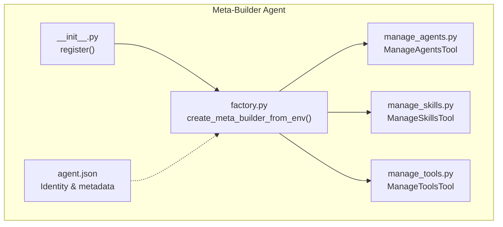
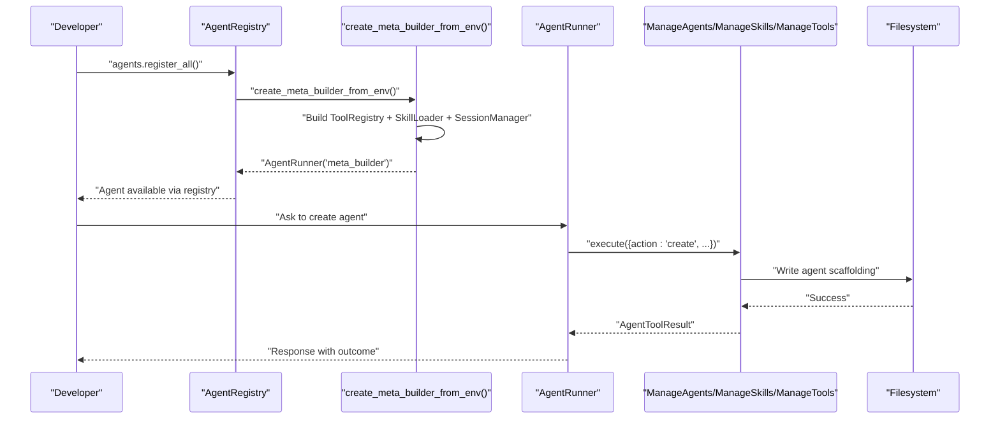
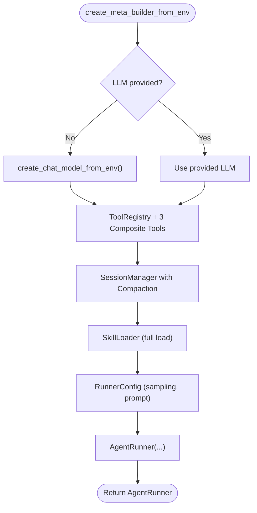
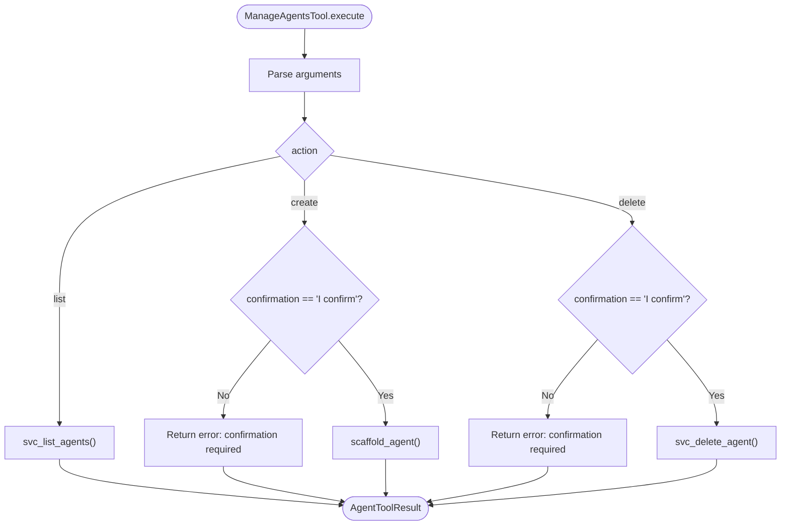
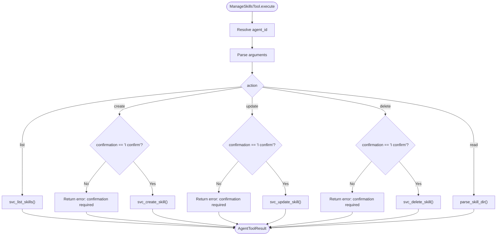
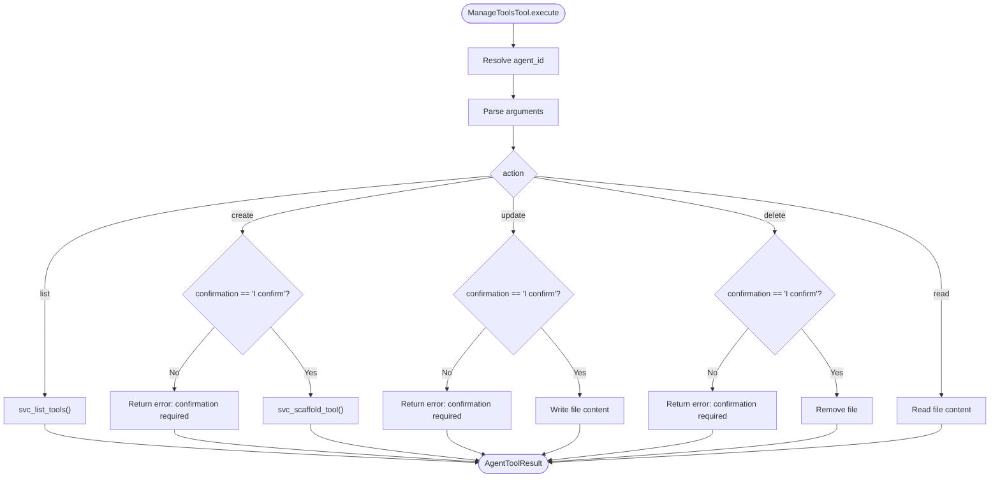
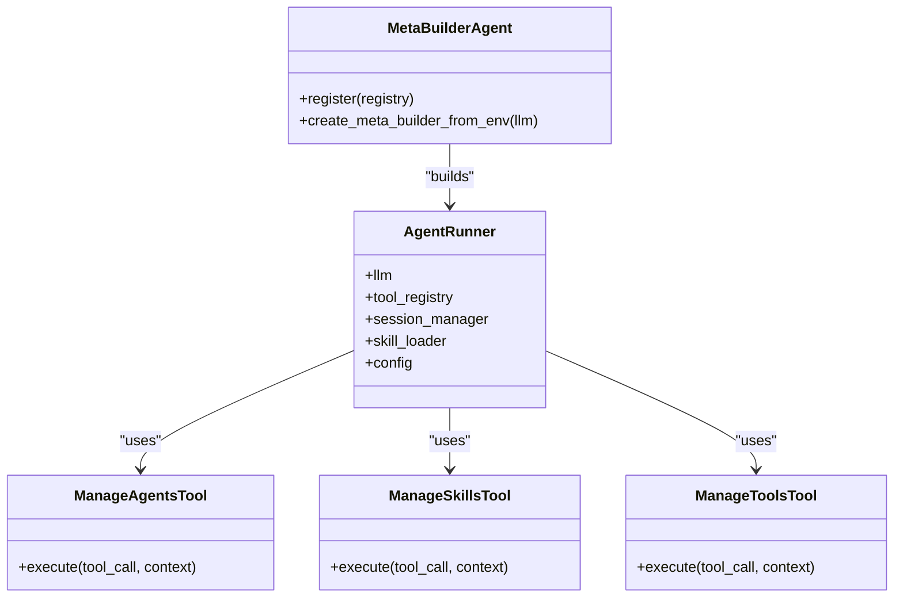
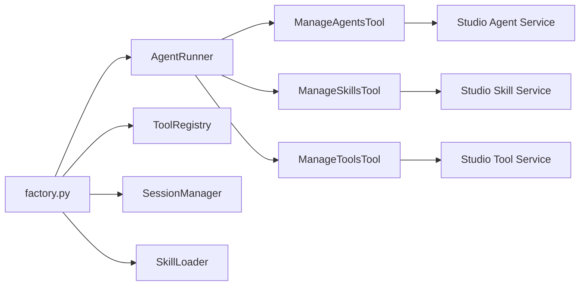

# Meta-Builder Agent

<cite>
**Referenced Files in This Document**
- [agent.json](file://src/ark_agentic/agents/meta_builder/agent.json)
- [factory.py](file://src/ark_agentic/agents/meta_builder/factory.py)
- [__init__.py](file://src/ark_agentic/agents/meta_builder/__init__.py)
- [manage_agents.py](file://src/ark_agentic/agents/meta_builder/tools/manage_agents.py)
- [manage_skills.py](file://src/ark_agentic/agents/meta_builder/tools/manage_skills.py)
- [manage_tools.py](file://src/ark_agentic/agents/meta_builder/tools/manage_tools.py)
</cite>

## Table of Contents
1. [Introduction](#introduction)
2. [Project Structure](#project-structure)
3. [Core Components](#core-components)
4. [Architecture Overview](#architecture-overview)
5. [Detailed Component Analysis](#detailed-component-analysis)
6. [Dependency Analysis](#dependency-analysis)
7. [Performance Considerations](#performance-considerations)
8. [Troubleshooting Guide](#troubleshooting-guide)
9. [Conclusion](#conclusion)
10. [Appendices](#appendices)

## Introduction
The Meta-Builder Agent is a specialized meta-agent designed to enable dynamic creation, configuration, and management of other agents within the framework. It acts as a conversational assistant that helps developers build agents, skills, and tools through natural language instructions. By leveraging a factory pattern for dynamic instantiation and an agent.json configuration system, it supports rapid prototyping, agent composition, and fleet-scale management of agent ecosystems.

Key capabilities:
- Dynamic agent lifecycle management (list, create, delete)
- Skill management (list, create, update, delete, read)
- Native tool management (list, create, update, delete, read)
- Confirmation-based safety gates for destructive operations
- Integration with the broader runtime and registry systems

## Project Structure
The Meta-Builder Agent resides under the agents module and includes:
- An agent.json descriptor for identity and metadata
- A factory for constructing the AgentRunner with tools, skills, and session management
- Composite tools for managing agents, skills, and tools
- A registration hook for auto-discovery

**Diagram sources**
- [agent.json:1-8](file://src/ark_agentic/agents/meta_builder/agent.json#L1-L8)
- [factory.py:36-99](file://src/ark_agentic/agents/meta_builder/factory.py#L36-L99)
- [__init__.py:21-37](file://src/ark_agentic/agents/meta_builder/__init__.py#L21-L37)
- [manage_agents.py:108-200](file://src/ark_agentic/agents/meta_builder/tools/manage_agents.py#L108-L200)
- [manage_skills.py:172-290](file://src/ark_agentic/agents/meta_builder/tools/manage_skills.py#L172-L290)
- [manage_tools.py:185-314](file://src/ark_agentic/agents/meta_builder/tools/manage_tools.py#L185-L314)

**Section sources**
- [agent.json:1-8](file://src/ark_agentic/agents/meta_builder/agent.json#L1-L8)
- [factory.py:36-99](file://src/ark_agentic/agents/meta_builder/factory.py#L36-L99)
- [__init__.py:21-37](file://src/ark_agentic/agents/meta_builder/__init__.py#L21-L37)
- [manage_agents.py:108-200](file://src/ark_agentic/agents/meta_builder/tools/manage_agents.py#L108-L200)
- [manage_skills.py:172-290](file://src/ark_agentic/agents/meta_builder/tools/manage_skills.py#L172-L290)
- [manage_tools.py:185-314](file://src/ark_agentic/agents/meta_builder/tools/manage_tools.py#L185-L314)

## Core Components
- Factory: Creates a configured AgentRunner with a ToolRegistry containing three composite tools, a SessionManager with compaction, and a SkillLoader for built-in guide skills.
- Tools:
  - ManageAgentsTool: Lists, creates, and deletes agents with confirmation gating.
  - ManageSkillsTool: Manages skills per agent with list, create, update, delete, and read actions.
  - ManageToolsTool: Manages native tools per agent with list, create, update, delete, and read actions.
- Registration: Auto-registration hook integrates the meta-builder into the AgentRegistry.

Configuration patterns:
- agent.json defines the agent’s identity and status.
- Factory composes runtime components and sets prompt and sampling configurations optimized for precise tool use.

Security and safety:
- Confirmation phrase enforced for destructive actions across all tools.
- Validation of identifiers and parameters (e.g., Python identifier for tools).
- Graceful initialization that logs failures without blocking other agents.

**Section sources**
- [factory.py:36-99](file://src/ark_agentic/agents/meta_builder/factory.py#L36-L99)
- [manage_agents.py:38-46](file://src/ark_agentic/agents/meta_builder/tools/manage_agents.py#L38-L46)
- [manage_skills.py:39-47](file://src/ark_agentic/agents/meta_builder/tools/manage_skills.py#L39-L47)
- [manage_tools.py:37-45](file://src/ark_agentic/agents/meta_builder/tools/manage_tools.py#L37-L45)

## Architecture Overview
The Meta-Builder Agent follows a factory-driven architecture that aligns with the framework’s conventions. It constructs an AgentRunner with:
- ToolRegistry containing the three management tools
- SessionManager with compaction for efficient memory usage
- SkillLoader for built-in guide skills
- RunnerConfig with tuned sampling and prompt configuration

**Diagram sources**
- [__init__.py:21-37](file://src/ark_agentic/agents/meta_builder/__init__.py#L21-L37)
- [factory.py:36-99](file://src/ark_agentic/agents/meta_builder/factory.py#L36-L99)
- [manage_agents.py:159-198](file://src/ark_agentic/agents/meta_builder/tools/manage_agents.py#L159-L198)
- [manage_skills.py:229-288](file://src/ark_agentic/agents/meta_builder/tools/manage_skills.py#L229-L288)
- [manage_tools.py:248-312](file://src/ark_agentic/agents/meta_builder/tools/manage_tools.py#L248-L312)

## Detailed Component Analysis

### Factory Pattern and Dynamic Instantiation
The factory function centralizes construction logic and ensures consistent configuration across environments. It:
- Initializes an LLM from environment if none provided
- Registers three composite tools into a ToolRegistry
- Prepares a SessionManager with compaction
- Loads built-in guide skills from the agent’s skills directory
- Builds an AgentRunner with RunnerConfig tuned for controlled, precise tool use

**Diagram sources**
- [factory.py:36-99](file://src/ark_agentic/agents/meta_builder/factory.py#L36-L99)

**Section sources**
- [factory.py:36-99](file://src/ark_agentic/agents/meta_builder/factory.py#L36-L99)

### Management Tools: Agent Lifecycle Operations
The ManageAgentsTool provides:
- List: Enumerates all agents with basic metadata
- Create: Scaffolds a new agent with optional initial skills; requires confirmation
- Delete: Removes an agent after confirmation; prevents deletion of meta_builder

Operational flow for create/delete:

**Diagram sources**
- [manage_agents.py:159-198](file://src/ark_agentic/agents/meta_builder/tools/manage_agents.py#L159-L198)

**Section sources**
- [manage_agents.py:108-200](file://src/ark_agentic/agents/meta_builder/tools/manage_agents.py#L108-L200)

### Management Tools: Skill Management
The ManageSkillsTool manages skills within a target agent:
- List: Retrieves skills for an agent
- Create: Generates a skill directory with metadata and content; requires confirmation
- Update: Modifies name/description/content; requires confirmation
- Delete: Removes a skill; requires confirmation
- Read: Returns the content of a skill’s markdown file

Validation and context:
- Resolves agent_id from explicit argument or user context
- Enforces confirmation for destructive actions
- Handles missing agent/skill gracefully

**Diagram sources**
- [manage_skills.py:229-288](file://src/ark_agentic/agents/meta_builder/tools/manage_skills.py#L229-L288)

**Section sources**
- [manage_skills.py:172-290](file://src/ark_agentic/agents/meta_builder/tools/manage_skills.py#L172-L290)

### Management Tools: Native Tool Administration
The ManageToolsTool manages native Python tools within an agent:
- List: Enumerates existing tool files
- Create: Generates a tool scaffold with typed parameters; requires confirmation
- Update: Writes raw Python source to a tool file; requires confirmation
- Delete: Removes a tool file; requires confirmation
- Read: Returns the source code of a tool file

Validation:
- Validates tool_name as a Python identifier
- Resolves agent directory and enforces existence checks

**Diagram sources**
- [manage_tools.py:248-312](file://src/ark_agentic/agents/meta_builder/tools/manage_tools.py#L248-L312)

**Section sources**
- [manage_tools.py:185-314](file://src/ark_agentic/agents/meta_builder/tools/manage_tools.py#L185-L314)

### Relationship Between Meta-Builder and Standard Agents
- Meta-Builder is a specialized agent that enables rapid prototyping and composition by scaffolding new agents, skills, and tools.
- It leverages the same runtime primitives (AgentRunner, ToolRegistry, SkillLoader, SessionManager) used by standard agents.
- Registration is idempotent and defensive, ensuring availability without blocking other agents.

**Diagram sources**
- [__init__.py:21-37](file://src/ark_agentic/agents/meta_builder/__init__.py#L21-L37)
- [factory.py:36-99](file://src/ark_agentic/agents/meta_builder/factory.py#L36-L99)
- [manage_agents.py:108-200](file://src/ark_agentic/agents/meta_builder/tools/manage_agents.py#L108-L200)
- [manage_skills.py:172-290](file://src/ark_agentic/agents/meta_builder/tools/manage_skills.py#L172-L290)
- [manage_tools.py:185-314](file://src/ark_agentic/agents/meta_builder/tools/manage_tools.py#L185-L314)

## Dependency Analysis
- Internal dependencies:
  - Factory depends on core runtime components (AgentRunner, RunnerConfig, SamplingConfig, PromptConfig), session management, skill loading, and tool registry.
  - Tools depend on services for listing, scaffolding, and mutating agent artifacts.
- External integration points:
  - Studio services for agent/skill/tool operations
  - Environment-based LLM initialization
  - Filesystem for agent scaffolding and tool persistence

**Diagram sources**
- [factory.py:36-99](file://src/ark_agentic/agents/meta_builder/factory.py#L36-L99)
- [manage_agents.py:17-22](file://src/ark_agentic/agents/meta_builder/tools/manage_agents.py#L17-L22)
- [manage_skills.py:16-22](file://src/ark_agentic/agents/meta_builder/tools/manage_skills.py#L16-L22)
- [manage_tools.py:17-21](file://src/ark_agentic/agents/meta_builder/tools/manage_tools.py#L17-L21)

**Section sources**
- [factory.py:36-99](file://src/ark_agentic/agents/meta_builder/factory.py#L36-L99)
- [manage_agents.py:17-22](file://src/ark_agentic/agents/meta_builder/tools/manage_agents.py#L17-L22)
- [manage_skills.py:16-22](file://src/ark_agentic/agents/meta_builder/tools/manage_skills.py#L16-L22)
- [manage_tools.py:17-21](file://src/ark_agentic/agents/meta_builder/tools/manage_tools.py#L17-L21)

## Performance Considerations
- Sampling configuration: Low temperature and constrained turns optimize deterministic tool use and reduce unnecessary iterations.
- Session compaction: Reduces memory overhead for long-lived conversations.
- Full skill load mode: Preloads guide skills to minimize latency during interactive sessions.
- Tool operations: Filesystem writes are synchronous; batching or async scheduling could improve throughput for bulk operations.

[No sources needed since this section provides general guidance]

## Troubleshooting Guide
Common issues and resolutions:
- Initialization failure: The registration hook catches and logs exceptions, allowing graceful degradation if an LLM environment is unavailable.
- Missing agent context: Skill/tool tools require an agent_id or a contextual target; ensure the user targets an agent page or passes agent_id explicitly.
- Confirmation gating: Destructive actions require the confirmation phrase; ensure the user repeats the exact phrase before re-invoking.
- Parameter validation: Tool names must be valid Python identifiers; ensure naming conventions are followed for create/update operations.

**Section sources**
- [__init__.py:30-37](file://src/ark_agentic/agents/meta_builder/__init__.py#L30-L37)
- [manage_skills.py:50-56](file://src/ark_agentic/agents/meta_builder/tools/manage_skills.py#L50-L56)
- [manage_tools.py:48-54](file://src/ark_agentic/agents/meta_builder/tools/manage_tools.py#L48-L54)
- [manage_agents.py:38-46](file://src/ark_agentic/agents/meta_builder/tools/manage_agents.py#L38-L46)

## Conclusion
The Meta-Builder Agent provides a powerful, conversational interface for dynamic agent creation and management. Its factory-driven construction, composite tools, and safety-first design enable rapid prototyping, scalable agent composition, and secure administration of agent fleets. By integrating tightly with the framework’s runtime and registry, it extends the platform’s capabilities while maintaining consistency and reliability.

[No sources needed since this section summarizes without analyzing specific files]

## Appendices

### Practical Examples and Patterns
- Creating a custom agent:
  - Use the ManageAgentsTool with action set to create and provide a name; confirm the operation; inspect the generated directory and initial skills.
- Managing agent collections:
  - Use list to enumerate agents; delete agents after confirming; avoid deleting meta_builder.
- Extending the framework:
  - Scaffold new skills and tools for an agent; update tool source code and read back content for verification.
- Meta-programming patterns:
  - Use the agent.json descriptor to define agent identity; leverage the factory to standardize configuration across environments.

[No sources needed since this section provides general guidance]