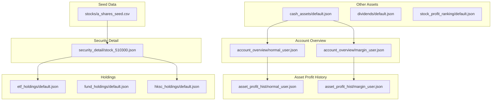
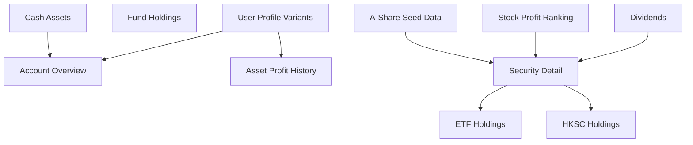
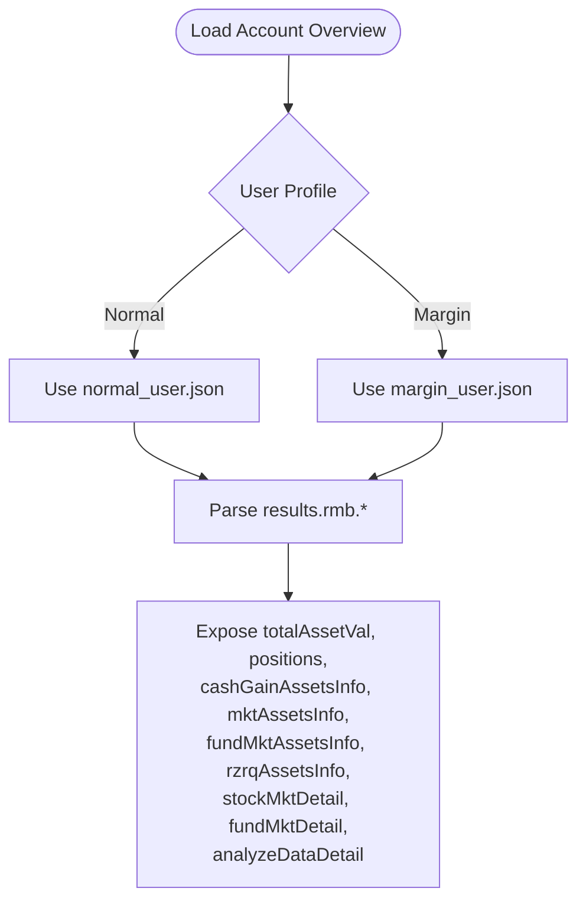
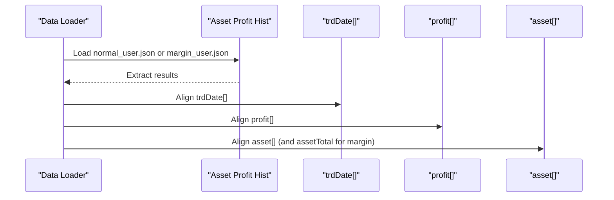
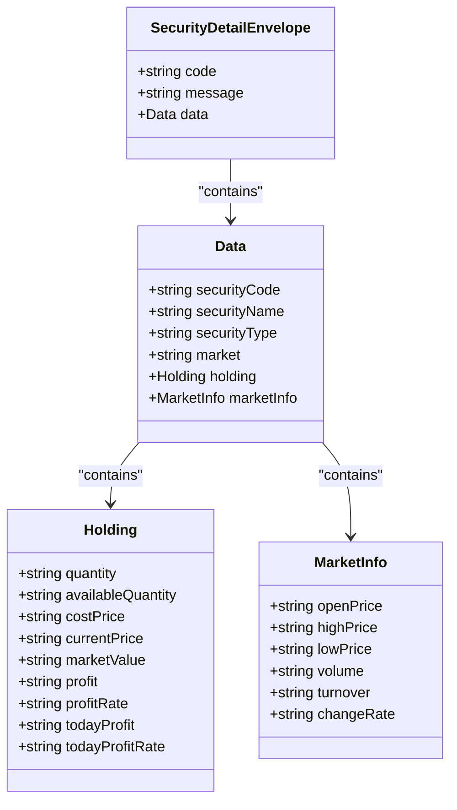
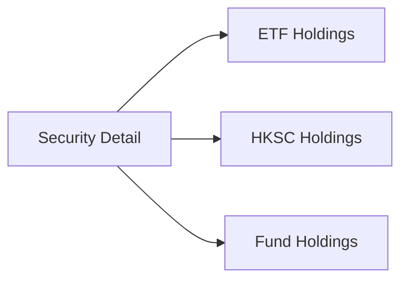
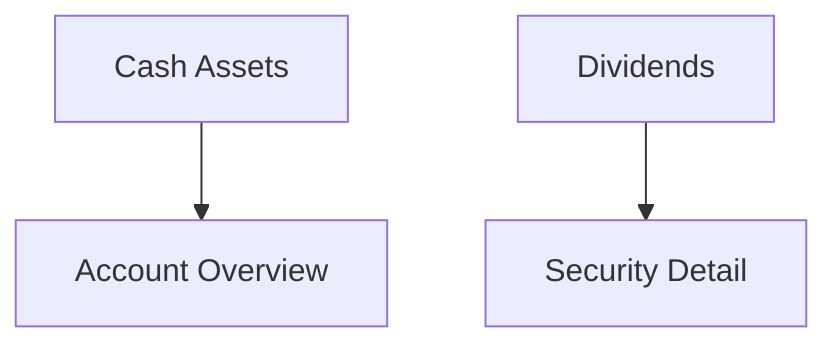
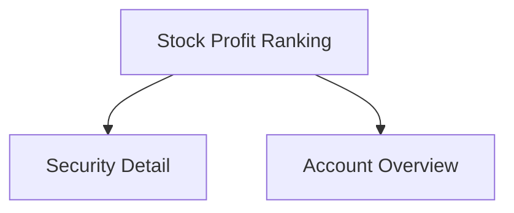
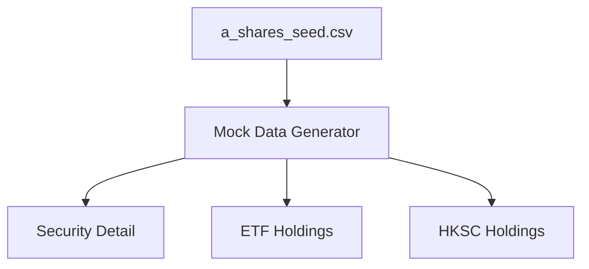
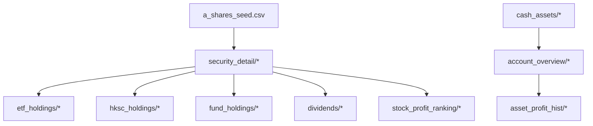

# Mock Data Structure and Organization

<cite>
**Referenced Files in This Document**
- [normal_user.json](file://src/ark_agentic/agents/securities/mock_data/account_overview/normal_user.json)
- [margin_user.json](file://src/ark_agentic/agents/securities/mock_data/account_overview/margin_user.json)
- [normal_user.json](file://src/ark_agentic/agents/securities/mock_data/asset_profit_hist/normal_user.json)
- [margin_user.json](file://src/ark_agentic/agents/securities/mock_data/asset_profit_hist/margin_user.json)
- [stock_510300.json](file://src/ark_agentic/agents/securities/mock_data/security_detail/stock_510300.json)
- [a_shares_seed.csv](file://src/ark_agentic/agents/securities/mock_data/stocks/a_shares_seed.csv)
- [default.json](file://src/ark_agentic/agents/securities/mock_data/etf_holdings/default.json)
- [default.json](file://src/ark_agentic/agents/securities/mock_data/fund_holdings/default.json)
- [default.json](file://src/ark_agentic/agents/securities/mock_data/hksc_holdings/default.json)
- [default.json](file://src/ark_agentic/agents/securities/mock_data/cash_assets/default.json)
- [default.json](file://src/ark_agentic/agents/securities/mock_data/dividends/default.json)
- [default.json](file://src/ark_agentic/agents/securities/mock_data/stock_profit_ranking/default.json)
</cite>

## Table of Contents
1. [Introduction](#introduction)
2. [Project Structure](#project-structure)
3. [Core Components](#core-components)
4. [Architecture Overview](#architecture-overview)
5. [Detailed Component Analysis](#detailed-component-analysis)
6. [Dependency Analysis](#dependency-analysis)
7. [Performance Considerations](#performance-considerations)
8. [Troubleshooting Guide](#troubleshooting-guide)
9. [Conclusion](#conclusion)

## Introduction
This document describes the Securities Agent mock data system used for testing and demonstration. It explains the hierarchical organization of mock datasets, the standardized JSON structures, user profile variations (normal_user vs margin_user), and the CSV-based seed data system for generating stock lists. It also documents data relationships across datasets and outlines validation rules and schema patterns used in the mock data.

## Project Structure
The mock data resides under the Securities Agent’s mock_data directory. Datasets are grouped by functional domain and user profile variants. Each dataset type follows a consistent JSON envelope pattern, while some datasets include per-user variants (normal_user.json, margin_user.json) and others include default.json for generic examples.

**Diagram sources**
- [normal_user.json:1-103](file://src/ark_agentic/agents/securities/mock_data/account_overview/normal_user.json#L1-L103)
- [margin_user.json:1-73](file://src/ark_agentic/agents/securities/mock_data/account_overview/margin_user.json#L1-L73)
- [normal_user.json:1-35](file://src/ark_agentic/agents/securities/mock_data/asset_profit_hist/normal_user.json#L1-L35)
- [margin_user.json:1-49](file://src/ark_agentic/agents/securities/mock_data/asset_profit_hist/margin_user.json#L1-L49)
- [stock_510300.json:1-29](file://src/ark_agentic/agents/securities/mock_data/security_detail/stock_510300.json#L1-L29)
- [default.json:1-65](file://src/ark_agentic/agents/securities/mock_data/etf_holdings/default.json#L1-L65)
- [default.json:1-26](file://src/ark_agentic/agents/securities/mock_data/fund_holdings/default.json#L1-L26)
- [default.json:1-58](file://src/ark_agentic/agents/securities/mock_data/hksc_holdings/default.json#L1-L58)
- [default.json:1-10](file://src/ark_agentic/agents/securities/mock_data/cash_assets/default.json#L1-L10)
- [default.json:1-63](file://src/ark_agentic/agents/securities/mock_data/dividends/default.json#L1-L63)
- [default.json:1-95](file://src/ark_agentic/agents/securities/mock_data/stock_profit_ranking/default.json#L1-L95)
- [a_shares_seed.csv:1-800](file://src/ark_agentic/agents/securities/mock_data/stocks/a_shares_seed.csv#L1-L800)

**Section sources**
- [normal_user.json:1-103](file://src/ark_agentic/agents/securities/mock_data/account_overview/normal_user.json#L1-L103)
- [margin_user.json:1-73](file://src/ark_agentic/agents/securities/mock_data/account_overview/margin_user.json#L1-L73)
- [normal_user.json:1-35](file://src/ark_agentic/agents/securities/mock_data/asset_profit_hist/normal_user.json#L1-L35)
- [margin_user.json:1-49](file://src/ark_agentic/agents/securities/mock_data/asset_profit_hist/margin_user.json#L1-L49)
- [stock_510300.json:1-29](file://src/ark_agentic/agents/securities/mock_data/security_detail/stock_510300.json#L1-L29)
- [a_shares_seed.csv:1-800](file://src/ark_agentic/agents/securities/mock_data/stocks/a_shares_seed.csv#L1-L800)
- [default.json:1-65](file://src/ark_agentic/agents/securities/mock_data/etf_holdings/default.json#L1-L65)
- [default.json:1-26](file://src/ark_agentic/agents/securities/mock_data/fund_holdings/default.json#L1-L26)
- [default.json:1-58](file://src/ark_agentic/agents/securities/mock_data/hksc_holdings/default.json#L1-L58)
- [default.json:1-10](file://src/ark_agentic/agents/securities/mock_data/cash_assets/default.json#L1-L10)
- [default.json:1-63](file://src/ark_agentic/agents/securities/mock_data/dividends/default.json#L1-L63)
- [default.json:1-95](file://src/ark_agentic/agents/securities/mock_data/stock_profit_ranking/default.json#L1-L95)

## Core Components
This section defines the standardized JSON envelopes and representative structures for each dataset category.

- Account Overview (normal_user.json, margin_user.json)
  - Envelope fields: status, errmsg, requestId, results
  - Results include accountType and rmb block with totalAssetVal, positions, cashGainAssetsInfo, mktAssetsInfo, fundMktAssetsInfo, rzrqAssetsInfo, stockMktDetail, fundMktDetail, analyzeDataDetail, and portfolio summary URLs
  - Margin variant additionally includes rzrqAssetsInfo and extended analyzeDataDetail segments

- Asset Profit History (normal_user.json, margin_user.json)
  - Envelope fields: status, msg, errmsg, results
  - Results include totalProfit, totalProfitRate, timeInterval, trdDate arrays, profit array, asset array, and optionally assetTotal for margin variant

- Security Detail (stock_510300.json)
  - Envelope fields: code, message, data
  - Data includes securityCode, securityName, securityType, market, holding block (quantity, availableQuantity, costPrice, currentPrice, marketValue, profit, profitRate, todayProfit, todayProfitRate), and marketInfo block (openPrice, highPrice, lowPrice, volume, turnover, changeRate)

- ETF Holdings (default.json)
  - Envelope fields: results, err, msg, status
  - Results include total, dayTotalMktVal, dayTotalPft, stockList array of holdings with statDate, secuCode, secuName, marketType, price, holdCnt, mktVal, costPrice, dayPft, dayPftRate, holdPositionPft, holdPositionPftRate, secuAcc, exchangeType, position

- Fund Holdings (default.json)
  - Envelope fields: code, message, data
  - Data includes holdings array (productCode, productName, quantity, costPrice, currentValue, marketValue, profit, profitRate, todayProfit) and summary block (totalMarketValue, totalCost, totalProfit, totalProfitRate, todayProfit)

- HKSC Holdings (default.json)
  - Envelope fields: err, errmsg, msg, status, results
  - Results include progress, holdMktVal, holdPositionPft, dayTotalPft, dayTotalPftRate, totalHkscShare, availableHkscShare, limitHkscShare, preFrozenAsset, stockList array (marketType, mktVal, dayPft, dayPftRate, holdPositionPft, holdPositionPftRate, position, holdCnt, shareBln, price, costPrice, secuCode, secuName, secuAcc), and preFrozenStockList

- Cash Assets (default.json)
  - Envelope fields: code, message, data
  - Data includes availableCash, frozenCash, totalCash, updateTime

- Dividends (default.json)
  - Envelope is keyed by stock code (e.g., "601318"), containing results with statDate, accountType, dividendList array (year, assignType, arrivalDate, stkDivType, plan, planInfo, cash, stock, stockName), and requestBody (marketType, stockCode)

- Stock Profit Ranking (default.json)
  - Envelope fields: status, msg, errmsg, results
  - Results include pftCnt, pftAmt, lossCnt, lossAmt, statDate, and stockList array (stockName, profit, profitRate, pftRatio, stockCode, marketType)

- Seed Data (a_shares_seed.csv)
  - Header row: code, name, exchange
  - Rows represent A-share stocks with three fields: security code, company name, and exchange

Validation rules and patterns observed:
- Numeric fields are represented as strings in most datasets (e.g., prices, quantities, monetary amounts)
- Date fields are represented as strings or integers (e.g., trade date strings, statDate)
- Arrays align by index for correlated metrics (e.g., trdDate, profit, asset in asset_profit_hist)
- Optional blocks may be null in margin_user variants (e.g., rzrqAssetsInfo)
- Consistent envelope keys across datasets enable uniform parsing logic

**Section sources**
- [normal_user.json:1-103](file://src/ark_agentic/agents/securities/mock_data/account_overview/normal_user.json#L1-L103)
- [margin_user.json:1-73](file://src/ark_agentic/agents/securities/mock_data/account_overview/margin_user.json#L1-L73)
- [normal_user.json:1-35](file://src/ark_agentic/agents/securities/mock_data/asset_profit_hist/normal_user.json#L1-L35)
- [margin_user.json:1-49](file://src/ark_agentic/agents/securities/mock_data/asset_profit_hist/margin_user.json#L1-L49)
- [stock_510300.json:1-29](file://src/ark_agentic/agents/securities/mock_data/security_detail/stock_510300.json#L1-L29)
- [default.json:1-65](file://src/ark_agentic/agents/securities/mock_data/etf_holdings/default.json#L1-L65)
- [default.json:1-26](file://src/ark_agentic/agents/securities/mock_data/fund_holdings/default.json#L1-L26)
- [default.json:1-58](file://src/ark_agentic/agents/securities/mock_data/hksc_holdings/default.json#L1-L58)
- [default.json:1-10](file://src/ark_agentic/agents/securities/mock_data/cash_assets/default.json#L1-L10)
- [default.json:1-63](file://src/ark_agentic/agents/securities/mock_data/dividends/default.json#L1-L63)
- [default.json:1-95](file://src/ark_agentic/agents/securities/mock_data/stock_profit_ranking/default.json#L1-L95)
- [a_shares_seed.csv:1-800](file://src/ark_agentic/agents/securities/mock_data/stocks/a_shares_seed.csv#L1-L800)

## Architecture Overview
The mock data architecture supports two primary user profiles and multiple dataset domains. The normal_user and margin_user variants mirror the same dataset types with profile-specific fields. The seed data system generates stock metadata for downstream consumers.

**Diagram sources**
- [normal_user.json:1-103](file://src/ark_agentic/agents/securities/mock_data/account_overview/normal_user.json#L1-L103)
- [margin_user.json:1-73](file://src/ark_agentic/agents/securities/mock_data/account_overview/margin_user.json#L1-L73)
- [normal_user.json:1-35](file://src/ark_agentic/agents/securities/mock_data/asset_profit_hist/normal_user.json#L1-L35)
- [margin_user.json:1-49](file://src/ark_agentic/agents/securities/mock_data/asset_profit_hist/margin_user.json#L1-L49)
- [stock_510300.json:1-29](file://src/ark_agentic/agents/securities/mock_data/security_detail/stock_510300.json#L1-L29)
- [default.json:1-65](file://src/ark_agentic/agents/securities/mock_data/etf_holdings/default.json#L1-L65)
- [default.json:1-26](file://src/ark_agentic/agents/securities/mock_data/fund_holdings/default.json#L1-L26)
- [default.json:1-58](file://src/ark_agentic/agents/securities/mock_data/hksc_holdings/default.json#L1-L58)
- [default.json:1-10](file://src/ark_agentic/agents/securities/mock_data/cash_assets/default.json#L1-L10)
- [default.json:1-63](file://src/ark_agentic/agents/securities/mock_data/dividends/default.json#L1-L63)
- [default.json:1-95](file://src/ark_agentic/agents/securities/mock_data/stock_profit_ranking/default.json#L1-L95)
- [a_shares_seed.csv:1-800](file://src/ark_agentic/agents/securities/mock_data/stocks/a_shares_seed.csv#L1-L800)

## Detailed Component Analysis

### Account Overview Dataset
- Purpose: Portfolio snapshot including total assets, market details, and allocation breakdowns
- Normal user variant includes cash gain assets, market assets, fund market assets, and stock/fund market details
- Margin user variant adds risk margin fields (rzrqAssetsInfo) and extended allocation details

**Diagram sources**
- [normal_user.json:1-103](file://src/ark_agentic/agents/securities/mock_data/account_overview/normal_user.json#L1-L103)
- [margin_user.json:1-73](file://src/ark_agentic/agents/securities/mock_data/account_overview/margin_user.json#L1-L73)

**Section sources**
- [normal_user.json:1-103](file://src/ark_agentic/agents/securities/mock_data/account_overview/normal_user.json#L1-L103)
- [margin_user.json:1-73](file://src/ark_agentic/agents/securities/mock_data/account_overview/margin_user.json#L1-L73)

### Asset Profit History Dataset
- Purpose: Historical PnL and asset value series aligned by trading dates
- Normal user variant provides trdDate, profit, and asset arrays
- Margin user variant extends with assetTotal alongside profit and asset arrays

**Diagram sources**
- [normal_user.json:1-35](file://src/ark_agentic/agents/securities/mock_data/asset_profit_hist/normal_user.json#L1-L35)
- [margin_user.json:1-49](file://src/ark_agentic/agents/securities/mock_data/asset_profit_hist/margin_user.json#L1-L49)

**Section sources**
- [normal_user.json:1-35](file://src/ark_agentic/agents/securities/mock_data/asset_profit_hist/normal_user.json#L1-L35)
- [margin_user.json:1-49](file://src/ark_agentic/agents/securities/mock_data/asset_profit_hist/margin_user.json#L1-L49)

### Security Detail Dataset
- Purpose: Instrument-level detail for a given security
- Includes security identity, type, market, holding stats, and market info

**Diagram sources**
- [stock_510300.json:1-29](file://src/ark_agentic/agents/securities/mock_data/security_detail/stock_510300.json#L1-L29)

**Section sources**
- [stock_510300.json:1-29](file://src/ark_agentic/agents/securities/mock_data/security_detail/stock_510300.json#L1-L29)

### Holdings Datasets
- ETF Holdings: List of ETF positions with valuation and PnL metrics
- Fund Holdings: List of mutual fund holdings with valuation and PnL metrics
- HKSC Holdings: List of Hong Kong stocks with limits and frozen assets

**Diagram sources**
- [stock_510300.json:1-29](file://src/ark_agentic/agents/securities/mock_data/security_detail/stock_510300.json#L1-L29)
- [default.json:1-65](file://src/ark_agentic/agents/securities/mock_data/etf_holdings/default.json#L1-L65)
- [default.json:1-58](file://src/ark_agentic/agents/securities/mock_data/hksc_holdings/default.json#L1-L58)
- [default.json:1-26](file://src/ark_agentic/agents/securities/mock_data/fund_holdings/default.json#L1-L26)

**Section sources**
- [default.json:1-65](file://src/ark_agentic/agents/securities/mock_data/etf_holdings/default.json#L1-L65)
- [default.json:1-26](file://src/ark_agentic/agents/securities/mock_data/fund_holdings/default.json#L1-L26)
- [default.json:1-58](file://src/ark_agentic/agents/securities/mock_data/hksc_holdings/default.json#L1-L58)

### Other Assets and Dividends
- Cash Assets: Available, frozen, and total cash balances with update time
- Dividends: Per-security dividend history keyed by stock code

**Diagram sources**
- [default.json:1-10](file://src/ark_agentic/agents/securities/mock_data/cash_assets/default.json#L1-L10)
- [default.json:1-63](file://src/ark_agentic/agents/securities/mock_data/dividends/default.json#L1-L63)
- [normal_user.json:1-103](file://src/ark_agentic/agents/securities/mock_data/account_overview/normal_user.json#L1-L103)

**Section sources**
- [default.json:1-10](file://src/ark_agentic/agents/securities/mock_data/cash_assets/default.json#L1-L10)
- [default.json:1-63](file://src/ark_agentic/agents/securities/mock_data/dividends/default.json#L1-L63)

### Stock Profit Ranking
- Purpose: Top losers and winners among traded stocks with ratios and market identifiers

**Diagram sources**
- [default.json:1-95](file://src/ark_agentic/agents/securities/mock_data/stock_profit_ranking/default.json#L1-L95)
- [stock_510300.json:1-29](file://src/ark_agentic/agents/securities/mock_data/security_detail/stock_510300.json#L1-L29)

**Section sources**
- [default.json:1-95](file://src/ark_agentic/agents/securities/mock_data/stock_profit_ranking/default.json#L1-L95)

### Seed Data System (CSV)
- Purpose: Provide a curated list of A-share securities for stock data generation
- Structure: Header row defines code, name, exchange; subsequent rows enumerate securities

**Diagram sources**
- [a_shares_seed.csv:1-800](file://src/ark_agentic/agents/securities/mock_data/stocks/a_shares_seed.csv#L1-L800)

**Section sources**
- [a_shares_seed.csv:1-800](file://src/ark_agentic/agents/securities/mock_data/stocks/a_shares_seed.csv#L1-L800)

## Dependency Analysis
The mock datasets depend on each other through shared identities and correlated fields. For example:
- Security Detail depends on seed data for instrument metadata
- Holdings datasets depend on Security Detail for instrument identity
- Account Overview depends on Cash Assets for cash balances
- Dividends depend on Security Detail for instrument code and name
- Asset Profit History correlates time-series arrays by index

**Diagram sources**
- [a_shares_seed.csv:1-800](file://src/ark_agentic/agents/securities/mock_data/stocks/a_shares_seed.csv#L1-L800)
- [stock_510300.json:1-29](file://src/ark_agentic/agents/securities/mock_data/security_detail/stock_510300.json#L1-L29)
- [default.json:1-65](file://src/ark_agentic/agents/securities/mock_data/etf_holdings/default.json#L1-L65)
- [default.json:1-58](file://src/ark_agentic/agents/securities/mock_data/hksc_holdings/default.json#L1-L58)
- [default.json:1-26](file://src/ark_agentic/agents/securities/mock_data/fund_holdings/default.json#L1-L26)
- [default.json:1-63](file://src/ark_agentic/agents/securities/mock_data/dividends/default.json#L1-L63)
- [default.json:1-10](file://src/ark_agentic/agents/securities/mock_data/cash_assets/default.json#L1-L10)
- [normal_user.json:1-103](file://src/ark_agentic/agents/securities/mock_data/account_overview/normal_user.json#L1-L103)
- [normal_user.json:1-35](file://src/ark_agentic/agents/securities/mock_data/asset_profit_hist/normal_user.json#L1-L35)
- [default.json:1-95](file://src/ark_agentic/agents/securities/mock_data/stock_profit_ranking/default.json#L1-L95)

**Section sources**
- [a_shares_seed.csv:1-800](file://src/ark_agentic/agents/securities/mock_data/stocks/a_shares_seed.csv#L1-L800)
- [stock_510300.json:1-29](file://src/ark_agentic/agents/securities/mock_data/security_detail/stock_510300.json#L1-L29)
- [default.json:1-65](file://src/ark_agentic/agents/securities/mock_data/etf_holdings/default.json#L1-L65)
- [default.json:1-58](file://src/ark_agentic/agents/securities/mock_data/hksc_holdings/default.json#L1-L58)
- [default.json:1-26](file://src/ark_agentic/agents/securities/mock_data/fund_holdings/default.json#L1-L26)
- [default.json:1-63](file://src/ark_agentic/agents/securities/mock_data/dividends/default.json#L1-L63)
- [default.json:1-10](file://src/ark_agentic/agents/securities/mock_data/cash_assets/default.json#L1-L10)
- [normal_user.json:1-103](file://src/ark_agentic/agents/securities/mock_data/account_overview/normal_user.json#L1-L103)
- [normal_user.json:1-35](file://src/ark_agentic/agents/securities/mock_data/asset_profit_hist/normal_user.json#L1-L35)
- [default.json:1-95](file://src/ark_agentic/agents/securities/mock_data/stock_profit_ranking/default.json#L1-L95)

## Performance Considerations
- CSV parsing: The seed data CSV is large; efficient streaming or chunked parsing is recommended when loading into memory
- Array alignment: Asset profit history relies on aligned arrays (dates, profits, assets); ensure consistent lengths to avoid misalignment
- Optional fields: Margin variants introduce optional blocks; handle null checks to prevent downstream errors
- Field typing: All numeric fields are strings; parse to appropriate numeric types during processing to support calculations

## Troubleshooting Guide
Common issues and resolutions:
- Missing fields: Verify envelope keys (status/msg/errmsg/results/data) are present before accessing nested fields
- Null optional blocks: Check rzrqAssetsInfo and related blocks for null in margin_user variants
- Array length mismatch: Validate trdDate, profit, asset arrays have equal lengths in asset_profit_hist
- String-encoded numbers: Convert numeric strings to numbers for arithmetic operations
- Seed data encoding: Ensure CSV reader handles special characters in company names

**Section sources**
- [normal_user.json:1-103](file://src/ark_agentic/agents/securities/mock_data/account_overview/normal_user.json#L1-L103)
- [margin_user.json:1-73](file://src/ark_agentic/agents/securities/mock_data/account_overview/margin_user.json#L1-L73)
- [normal_user.json:1-35](file://src/ark_agentic/agents/securities/mock_data/asset_profit_hist/normal_user.json#L1-L35)
- [margin_user.json:1-49](file://src/ark_agentic/agents/securities/mock_data/asset_profit_hist/margin_user.json#L1-L49)
- [a_shares_seed.csv:1-800](file://src/ark_agentic/agents/securities/mock_data/stocks/a_shares_seed.csv#L1-L800)

## Conclusion
The Securities Agent mock data system organizes datasets by functional domain and user profile, with consistent JSON envelopes and schema patterns. The CSV-based seed data enables scalable generation of instrument metadata, which feeds security detail and holdings datasets. By adhering to the documented structures and validation rules, developers can reliably integrate and consume mock data for testing and demonstration.