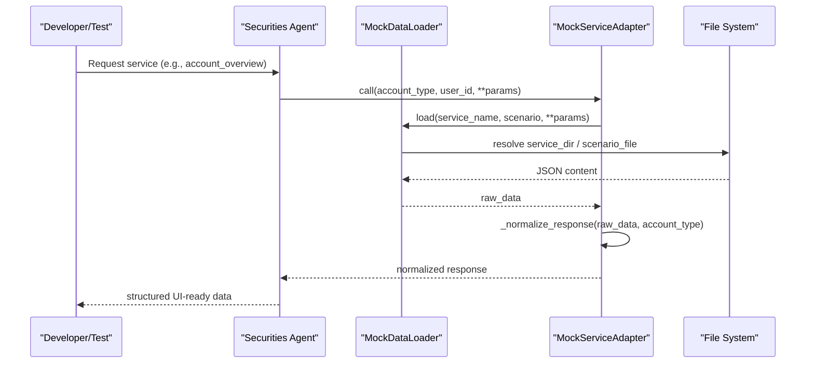
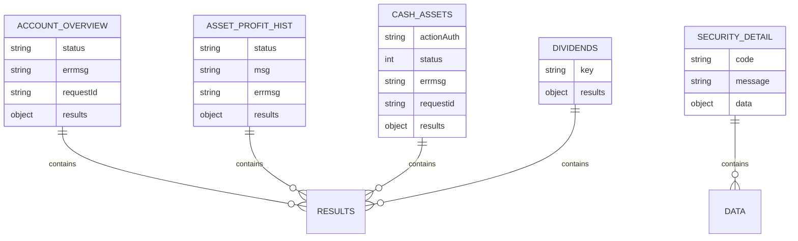
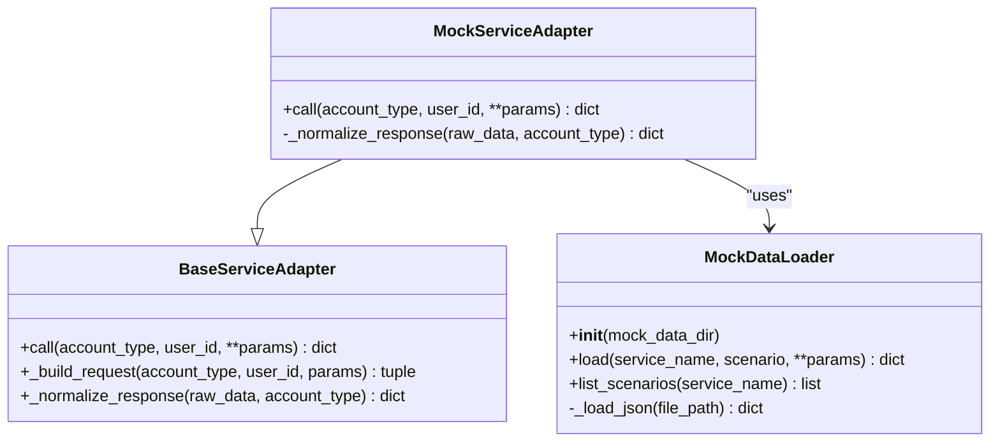
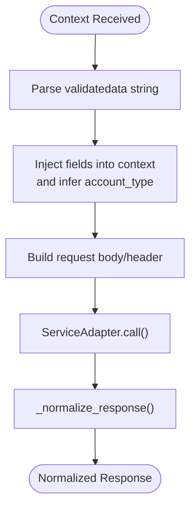
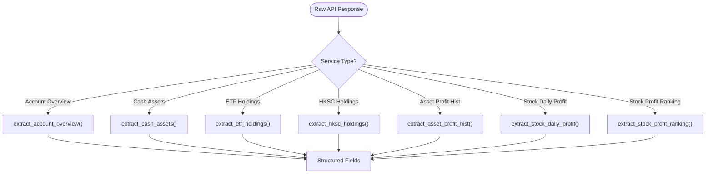
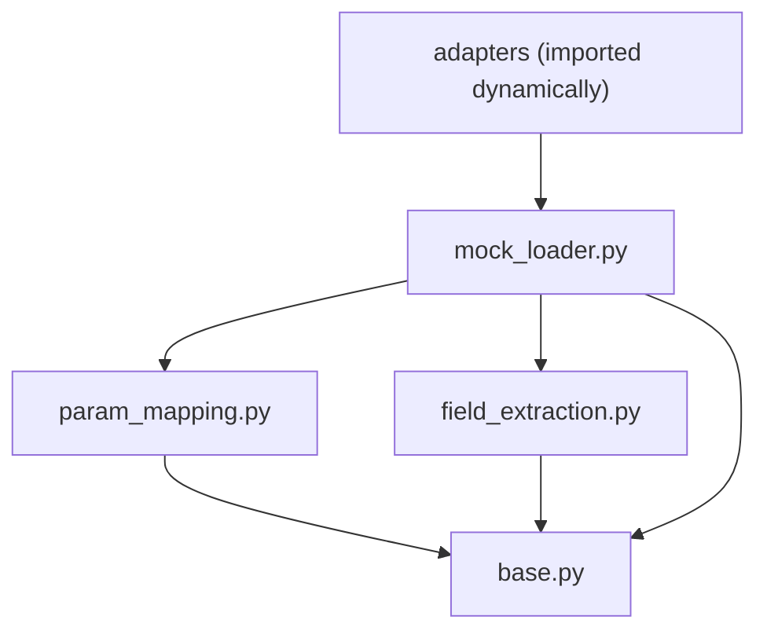

# Mock Data System

<cite>
**Referenced Files in This Document**
- [account_overview/normal_user.json](file://src/ark_agentic/agents/securities/mock_data/account_overview/normal_user.json)
- [account_overview/margin_user.json](file://src/ark_agentic/agents/securities/mock_data/account_overview/margin_user.json)
- [asset_profit_hist/normal_user.json](file://src/ark_agentic/agents/securities/mock_data/asset_profit_hist/normal_user.json)
- [asset_profit_hist/margin_user.json](file://src/ark_agentic/agents/securities/mock_data/asset_profit_hist/margin_user.json)
- [security_detail/stock_510300.json](file://src/ark_agentic/agents/securities/mock_data/security_detail/stock_510300.json)
- [cash_assets/normal_user.json](file://src/ark_agentic/agents/securities/mock_data/cash_assets/normal_user.json)
- [cash_assets/margin_user.json](file://src/ark_agentic/agents/securities/mock_data/cash_assets/margin_user.json)
- [dividends/default.json](file://src/ark_agentic/agents/securities/mock_data/dividends/default.json)
- [stocks/a_shares_seed.csv](file://src/ark_agentic/agents/securities/mock_data/stocks/a_shares_seed.csv)
- [mock_loader.py](file://src/ark_agentic/agents/securities/tools/service/mock_loader.py)
- [mock_mode.py](file://src/ark_agentic/agents/securities/tools/service/mock_mode.py)
- [base.py](file://src/ark_agentic/agents/securities/tools/service/base.py)
- [param_mapping.py](file://src/ark_agentic/agents/securities/tools/service/param_mapping.py)
- [field_extraction.py](file://src/ark_agentic/agents/securities/tools/service/field_extraction.py)
</cite>

## Table of Contents
1. [Introduction](#introduction)
2. [Project Structure](#project-structure)
3. [Core Components](#core-components)
4. [Architecture Overview](#architecture-overview)
5. [Detailed Component Analysis](#detailed-component-analysis)
6. [Dependency Analysis](#dependency-analysis)
7. [Performance Considerations](#performance-considerations)
8. [Troubleshooting Guide](#troubleshooting-guide)
9. [Conclusion](#conclusion)
10. [Appendices](#appendices)

## Introduction
This document describes the Securities Agent mock data system designed to support testing and development workflows for financial data scenarios. It covers the mock data structure for key services (account_overview, asset_profit_hist, security_detail, cash_assets, dividends, etf_holdings, fund_holdings, hksc_holdings, stock_daily_profit, stock_profit_ranking), the data seeding process using a_shares_seed.csv, and the mock loader and service adapter integration for development environments. Practical examples, test scenario creation patterns, and data validation approaches are included, along with guidance on how mock data relates to real financial services integration.

## Project Structure
The mock data system is organized under the securities agent module with a clear separation of concerns:
- Mock data JSON files grouped by service and scenario (normal_user, margin_user, default)
- Tools for loading, adapting, and validating mock responses
- Parameter mapping and field extraction utilities for consistent data shaping

```mermaid
graph TB
subgraph "Mock Data"
AO_N["account_overview/normal_user.json"]
AO_M["account_overview/margin_user.json"]
APH_N["asset_profit_hist/normal_user.json"]
APH_M["asset_profit_hist/margin_user.json"]
SD["security_detail/stock_510300.json"]
CA_N["cash_assets/normal_user.json"]
CA_M["cash_assets/margin_user.json"]
DIV["dividends/default.json"]
SEED["stocks/a_shares_seed.csv"]
end
subgraph "Mock Loader & Adapters"
ML["mock_loader.py"]
MM["mock_mode.py"]
BASE["base.py"]
PM["param_mapping.py"]
FE["field_extraction.py"]
end
ML --> AO_N
ML --> AO_M
ML --> APH_N
ML --> APH_M
ML --> SD
ML --> CA_N
ML --> CA_M
ML --> DIV
ML --> SEED
ML --> MM
ML --> BASE
ML --> PM
ML --> FE
```

**Diagram sources**
- [mock_loader.py:17-104](file://src/ark_agentic/agents/securities/tools/service/mock_loader.py#L17-L104)
- [mock_mode.py:7-23](file://src/ark_agentic/agents/securities/tools/service/mock_mode.py#L7-L23)
- [base.py:14-130](file://src/ark_agentic/agents/securities/tools/service/base.py#L14-L130)
- [param_mapping.py:307-435](file://src/ark_agentic/agents/securities/tools/service/param_mapping.py#L307-L435)
- [field_extraction.py:12-479](file://src/ark_agentic/agents/securities/tools/service/field_extraction.py#L12-L479)

**Section sources**
- [mock_loader.py:17-104](file://src/ark_agentic/agents/securities/tools/service/mock_loader.py#L17-L104)
- [mock_mode.py:7-23](file://src/ark_agentic/agents/securities/tools/service/mock_mode.py#L7-L23)
- [base.py:14-130](file://src/ark_agentic/agents/securities/tools/service/base.py#L14-L130)
- [param_mapping.py:307-435](file://src/ark_agentic/agents/securities/tools/service/param_mapping.py#L307-L435)
- [field_extraction.py:12-479](file://src/ark_agentic/agents/securities/tools/service/field_extraction.py#L12-L479)

## Core Components
- MockDataLoader: Loads mock data from JSON files based on service name and scenario, with fallback to default or empty responses.
- MockServiceAdapter: Bridges mock loader to service adapters, selecting appropriate scenario based on account type and normalizing responses via adapter-specific normalization.
- Mock Mode: Controls whether mock mode is enabled globally or per-request via environment variable or context.
- Parameter Mapping: Converts context fields into standardized request bodies and headers for real services; also supports validatedata parsing and enrichment.
- Field Extraction: Extracts and normalizes service-specific fields for UI rendering and downstream processing.

Key capabilities:
- Scenario selection: normal_user vs margin_user for supported services
- Dynamic file resolution: service_name/scenario.json or service_name/default.json
- Account-type-aware normalization: adapts response shapes for UI consumption
- Validation hooks: checks for required context fields and API status indicators

**Section sources**
- [mock_loader.py:17-104](file://src/ark_agentic/agents/securities/tools/service/mock_loader.py#L17-L104)
- [mock_loader.py:110-178](file://src/ark_agentic/agents/securities/tools/service/mock_loader.py#L110-L178)
- [mock_mode.py:7-23](file://src/ark_agentic/agents/securities/tools/service/mock_mode.py#L7-L23)
- [base.py:138-212](file://src/ark_agentic/agents/securities/tools/service/base.py#L138-L212)
- [param_mapping.py:307-479](file://src/ark_agentic/agents/securities/tools/service/param_mapping.py#L307-L479)
- [field_extraction.py:12-479](file://src/ark_agentic/agents/securities/tools/service/field_extraction.py#L12-L479)

## Architecture Overview
The mock system integrates with the broader securities agent runtime to provide seamless switching between real and mock financial services during development and testing.

**Diagram sources**
- [mock_loader.py:31-71](file://src/ark_agentic/agents/securities/tools/service/mock_loader.py#L31-L71)
- [mock_loader.py:118-141](file://src/ark_agentic/agents/securities/tools/service/mock_loader.py#L118-L141)
- [base.py:55-104](file://src/ark_agentic/agents/securities/tools/service/base.py#L55-L104)

## Detailed Component Analysis

### Mock Data Structure and Scenarios
- account_overview: Provides total assets, cash balances, market values, today’s profit/return, positions, and rzrq assets info for normal and margin accounts.
- asset_profit_hist: Supplies total profit, rate, time interval, and aligned arrays for trade dates, daily profits, and cumulative assets (with asset_total for margin).
- security_detail: Returns instrument metadata and holding details for a given security code (e.g., 510300).
- cash_assets: Offers cash balance, availability, frozen funds, and fund details for normal and margin accounts.
- dividends: Lists dividend plans and cash/stock distributions for a given stock code.
- Supporting datasets: etf_holdings, fund_holdings, hksc_holdings, stock_daily_profit, stock_profit_ranking.

**Diagram sources**
- [account_overview/normal_user.json:1-103](file://src/ark_agentic/agents/securities/mock_data/account_overview/normal_user.json#L1-L103)
- [asset_profit_hist/normal_user.json:1-35](file://src/ark_agentic/agents/securities/mock_data/asset_profit_hist/normal_user.json#L1-L35)
- [security_detail/stock_510300.json:1-29](file://src/ark_agentic/agents/securities/mock_data/security_detail/stock_510300.json#L1-L29)
- [cash_assets/normal_user.json:1-36](file://src/ark_agentic/agents/securities/mock_data/cash_assets/normal_user.json#L1-L36)
- [dividends/default.json:1-63](file://src/ark_agentic/agents/securities/mock_data/dividends/default.json#L1-L63)

**Section sources**
- [account_overview/normal_user.json:1-103](file://src/ark_agentic/agents/securities/mock_data/account_overview/normal_user.json#L1-L103)
- [account_overview/margin_user.json:1-73](file://src/ark_agentic/agents/securities/mock_data/account_overview/margin_user.json#L1-L73)
- [asset_profit_hist/normal_user.json:1-35](file://src/ark_agentic/agents/securities/mock_data/asset_profit_hist/normal_user.json#L1-L35)
- [asset_profit_hist/margin_user.json:1-49](file://src/ark_agentic/agents/securities/mock_data/asset_profit_hist/margin_user.json#L1-L49)
- [security_detail/stock_510300.json:1-29](file://src/ark_agentic/agents/securities/mock_data/security_detail/stock_510300.json#L1-L29)
- [cash_assets/normal_user.json:1-36](file://src/ark_agentic/agents/securities/mock_data/cash_assets/normal_user.json#L1-L36)
- [cash_assets/margin_user.json:1-36](file://src/ark_agentic/agents/securities/mock_data/cash_assets/margin_user.json#L1-L36)
- [dividends/default.json:1-63](file://src/ark_agentic/agents/securities/mock_data/dividends/default.json#L1-L63)

### Data Seeding with a_shares_seed.csv
The CSV file provides seed data for A-share instruments, enabling realistic security lists for testing and development. It includes columns for code, name, and exchange, allowing downstream tools to generate holdings or search indices.

Practical usage:
- Seed initial instrument catalogs for security search and detail retrieval
- Drive synthetic holdings generation for performance and profit analysis tests

**Section sources**
- [stocks/a_shares_seed.csv:1-800](file://src/ark_agentic/agents/securities/mock_data/stocks/a_shares_seed.csv#L1-L800)

### Mock Loader and Service Adapter Integration
The loader resolves the appropriate JSON file based on service name and scenario, falling back to default or returning an error object. The adapter selects scenario based on account type for supported services and delegates normalization to specialized adapters.

**Diagram sources**
- [mock_loader.py:17-104](file://src/ark_agentic/agents/securities/tools/service/mock_loader.py#L17-L104)
- [mock_loader.py:110-178](file://src/ark_agentic/agents/securities/tools/service/mock_loader.py#L110-L178)
- [base.py:38-130](file://src/ark_agentic/agents/securities/tools/service/base.py#L38-L130)

**Section sources**
- [mock_loader.py:17-104](file://src/ark_agentic/agents/securities/tools/service/mock_loader.py#L17-L104)
- [mock_loader.py:110-178](file://src/ark_agentic/agents/securities/tools/service/mock_loader.py#L110-L178)
- [base.py:38-130](file://src/ark_agentic/agents/securities/tools/service/base.py#L38-L130)

### Parameter Mapping and Context Enrichment
Parameter mapping converts context fields into request bodies and headers, with special handling for validatedata parsing and account type derivation from loginflag. Context enrichment injects parsed validatedata fields and infers account_type when not explicitly provided.

**Diagram sources**
- [param_mapping.py:210-235](file://src/ark_agentic/agents/securities/tools/service/param_mapping.py#L210-L235)
- [param_mapping.py:307-435](file://src/ark_agentic/agents/securities/tools/service/param_mapping.py#L307-L435)
- [base.py:162-199](file://src/ark_agentic/agents/securities/tools/service/base.py#L162-L199)

**Section sources**
- [param_mapping.py:210-235](file://src/ark_agentic/agents/securities/tools/service/param_mapping.py#L210-L235)
- [param_mapping.py:307-435](file://src/ark_agentic/agents/securities/tools/service/param_mapping.py#L307-L435)
- [base.py:162-199](file://src/ark_agentic/agents/securities/tools/service/base.py#L162-L199)

### Field Extraction Patterns
Field extraction utilities convert raw API responses into UI-friendly structures by mapping nested paths to display names. Specialized extractors handle lists (ETF/HKSC holdings), curves (profit history), and summaries (profit ranking).

**Diagram sources**
- [field_extraction.py:79-88](file://src/ark_agentic/agents/securities/tools/service/field_extraction.py#L79-L88)
- [field_extraction.py:111-124](file://src/ark_agentic/agents/securities/tools/service/field_extraction.py#L111-L124)
- [field_extraction.py:178-199](file://src/ark_agentic/agents/securities/tools/service/field_extraction.py#L178-L199)
- [field_extraction.py:243-269](file://src/ark_agentic/agents/securities/tools/service/field_extraction.py#L243-L269)
- [field_extraction.py:350-390](file://src/ark_agentic/agents/securities/tools/service/field_extraction.py#L350-L390)
- [field_extraction.py:395-413](file://src/ark_agentic/agents/securities/tools/service/field_extraction.py#L395-L413)
- [field_extraction.py:434-440](file://src/ark_agentic/agents/securities/tools/service/field_extraction.py#L434-L440)

**Section sources**
- [field_extraction.py:79-88](file://src/ark_agentic/agents/securities/tools/service/field_extraction.py#L79-L88)
- [field_extraction.py:111-124](file://src/ark_agentic/agents/securities/tools/service/field_extraction.py#L111-L124)
- [field_extraction.py:178-199](file://src/ark_agentic/agents/securities/tools/service/field_extraction.py#L178-L199)
- [field_extraction.py:243-269](file://src/ark_agentic/agents/securities/tools/service/field_extraction.py#L243-L269)
- [field_extraction.py:350-390](file://src/ark_agentic/agents/securities/tools/service/field_extraction.py#L350-L390)
- [field_extraction.py:395-413](file://src/ark_agentic/agents/securities/tools/service/field_extraction.py#L395-L413)
- [field_extraction.py:434-440](file://src/ark_agentic/agents/securities/tools/service/field_extraction.py#L434-L440)

## Dependency Analysis
The mock system depends on:
- File system for JSON and CSV resources
- Context enrichment and parameter mapping for request construction
- Adapter normalization to align mock responses with expected schemas
- Field extraction for UI rendering compatibility

**Diagram sources**
- [param_mapping.py:464-479](file://src/ark_agentic/agents/securities/tools/service/param_mapping.py#L464-L479)
- [field_extraction.py:453-479](file://src/ark_agentic/agents/securities/tools/service/field_extraction.py#L453-L479)
- [mock_loader.py:146-177](file://src/ark_agentic/agents/securities/tools/service/mock_loader.py#L146-L177)
- [base.py:138-212](file://src/ark_agentic/agents/securities/tools/service/base.py#L138-L212)

**Section sources**
- [mock_loader.py:146-177](file://src/ark_agentic/agents/securities/tools/service/mock_loader.py#L146-L177)
- [param_mapping.py:464-479](file://src/ark_agentic/agents/securities/tools/service/param_mapping.py#L464-L479)
- [field_extraction.py:453-479](file://src/ark_agentic/agents/securities/tools/service/field_extraction.py#L453-L479)
- [base.py:138-212](file://src/ark_agentic/agents/securities/tools/service/base.py#L138-L212)

## Performance Considerations
- File I/O: JSON loads are lightweight; cache frequently accessed files if needed.
- Path resolution: Minimal computation; keep service directories flat for predictable lookup.
- Normalization: Adapter normalization is O(n) over response fields; avoid redundant conversions.
- CSV parsing: For a_shares_seed.csv, consider in-memory caching for repeated searches.

## Troubleshooting Guide
Common issues and resolutions:
- Missing mock data: The loader logs warnings and returns an error object; verify service_name and scenario file existence.
- Incorrect scenario selection: Ensure account_type is passed correctly; margin accounts select margin_user scenarios for supported services.
- Context validation failures: require_context_fields raises errors when required fields are missing; enable mock mode to bypass validation in development.
- API status errors: check_api_response raises ServiceError for non-success status; inspect raw_data for error messages.

**Section sources**
- [mock_loader.py:27-30](file://src/ark_agentic/agents/securities/tools/service/mock_loader.py#L27-L30)
- [mock_loader.py:67-70](file://src/ark_agentic/agents/securities/tools/service/mock_loader.py#L67-L70)
- [base.py:138-160](file://src/ark_agentic/agents/securities/tools/service/base.py#L138-L160)
- [base.py:202-212](file://src/ark_agentic/agents/securities/tools/service/base.py#L202-L212)

## Conclusion
The Securities Agent mock data system provides a robust, extensible framework for testing and development. It offers realistic financial datasets, flexible scenario selection, and consistent response normalization, enabling rapid iteration without relying on external services. By combining mock loader, adapters, parameter mapping, and field extraction utilities, teams can simulate diverse financial scenarios and validate UI and business logic effectively.

## Appendices

### Practical Examples and Test Scenarios
- Normal user account overview: Load account_overview/normal_user.json and normalize via MockServiceAdapter for UI display.
- Margin user profit history: Load asset_profit_hist/margin_user.json and extract profit_curve for chart rendering.
- Security detail lookup: Use security_detail/stock_510300.json for instrument metadata and holdings.
- Cash assets validation: Load cash_assets/normal_user.json and extract cash-related fields for dashboard cards.
- Dividend analysis: Use dividends/default.json to present dividend history for a given stock code.
- Instrument seeding: Import a_shares_seed.csv to populate security catalogs for search and detail services.

### Relationship to Real Financial Services Integration
- Parameter mapping and header construction mirror real API contracts, ensuring mocks align with production schemas.
- Field extraction patterns emulate UI rendering expectations, minimizing divergence between mock and real responses.
- Context enrichment and validation hooks prepare applications for production-grade request handling while allowing mock bypass during development.