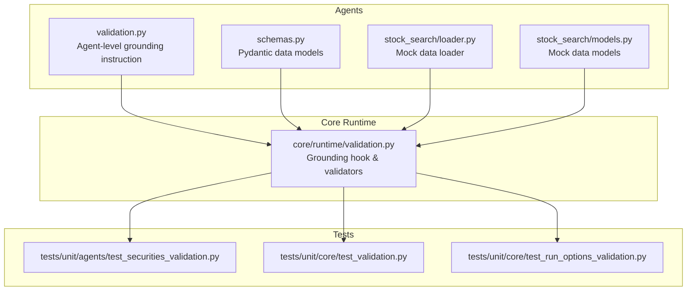
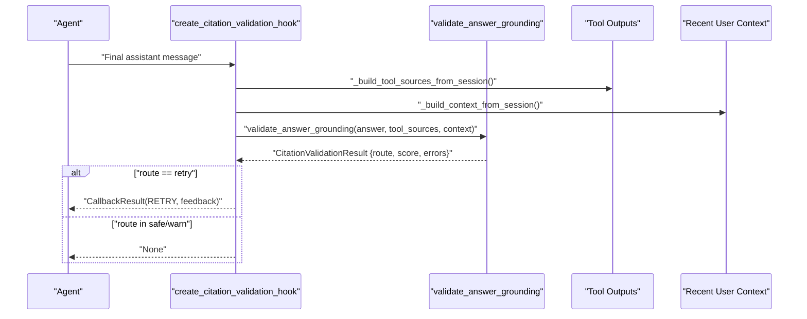
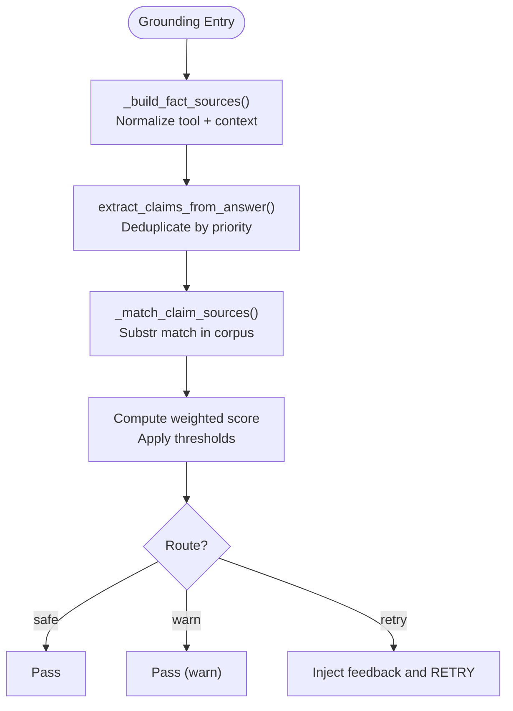
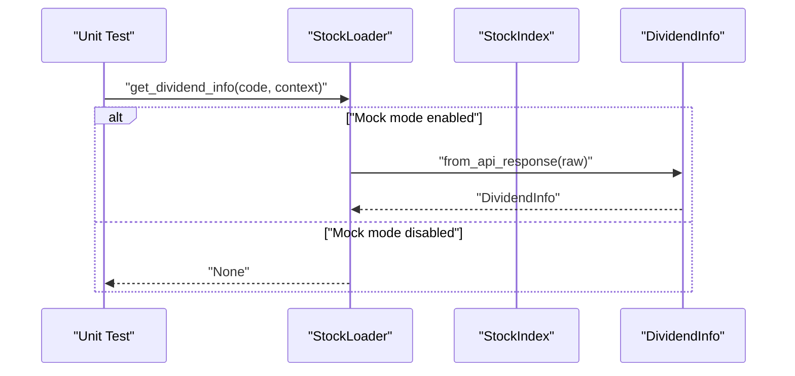
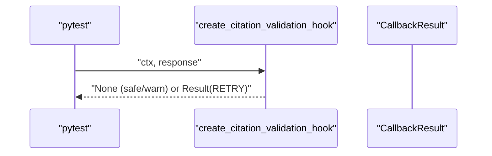
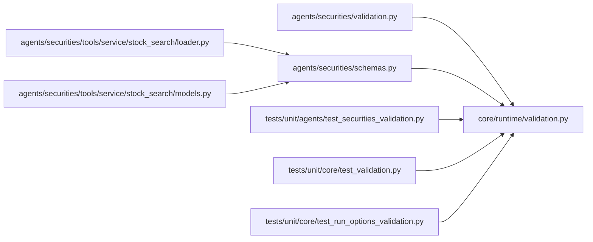

# Mock Data Validation and Testing

<cite>
**Referenced Files in This Document**
- [validation.py](file://src/ark_agentic/agents/securities/validation.py)
- [schemas.py](file://src/ark_agentic/agents/securities/schemas.py)
- [validation.py](file://src/ark_agentic/core/runtime/validation.py)
- [test_securities_validation.py](file://tests/unit/agents/test_securities_validation.py)
- [test_validation.py](file://tests/unit/core/test_validation.py)
- [test_run_options_validation.py](file://tests/unit/core/test_run_options_validation.py)
- [loader.py](file://src/ark_agentic/agents/securities/tools/service/stock_search/loader.py)
- [models.py](file://src/ark_agentic/agents/securities/tools/service/stock_search/models.py)
</cite>

## Table of Contents
1. [Introduction](#introduction)
2. [Project Structure](#project-structure)
3. [Core Components](#core-components)
4. [Architecture Overview](#architecture-overview)
5. [Detailed Component Analysis](#detailed-component-analysis)
6. [Dependency Analysis](#dependency-analysis)
7. [Performance Considerations](#performance-considerations)
8. [Troubleshooting Guide](#troubleshooting-guide)
9. [Conclusion](#conclusion)
10. [Appendices](#appendices)

## Introduction
This document explains the mock data validation and testing frameworks used in the project. It focuses on:
- Ensuring mock data integrity and consistency via Pydantic schemas
- Validating agent outputs against mock tool responses using a post-hoc grounding mechanism
- Unit test patterns that exercise validation logic, error detection, and edge cases
- Strategies for validating mock datasets, handling edge cases, and integrating validation into agent runs

The validation stack comprises:
- Pydantic-based schemas for structured mock data
- A runtime grounding hook that checks agent answers against tool outputs and context
- Unit tests that simulate grounded and ungrounded claims, and verify routing decisions

## Project Structure
The validation and testing artifacts are organized across three primary areas:
- Agent-level validation instruction for grounding constraints
- Core runtime validation utilities for post-hoc grounding
- Pydantic schemas for standardized mock data structures
- Unit tests covering securities-specific grounding and general validation logic
- Mock data loaders and models for stock search and dividends

**Diagram sources**
- [validation.py:1-22](file://src/ark_agentic/agents/securities/validation.py#L1-L22)
- [schemas.py:1-465](file://src/ark_agentic/agents/securities/schemas.py#L1-L465)
- [validation.py:1-604](file://src/ark_agentic/core/runtime/validation.py#L1-L604)
- [loader.py:1-138](file://src/ark_agentic/agents/securities/tools/service/stock_search/loader.py#L1-L138)
- [models.py:1-136](file://src/ark_agentic/agents/securities/tools/service/stock_search/models.py#L1-L136)
- [test_securities_validation.py:1-148](file://tests/unit/agents/test_securities_validation.py#L1-L148)
- [test_validation.py:1-407](file://tests/unit/core/test_validation.py#L1-L407)
- [test_run_options_validation.py:1-151](file://tests/unit/core/test_run_options_validation.py#L1-L151)

**Section sources**
- [validation.py:1-22](file://src/ark_agentic/agents/securities/validation.py#L1-L22)
- [validation.py:1-604](file://src/ark_agentic/core/runtime/validation.py#L1-L604)
- [schemas.py:1-465](file://src/ark_agentic/agents/securities/schemas.py#L1-L465)
- [loader.py:1-138](file://src/ark_agentic/agents/securities/tools/service/stock_search/loader.py#L1-L138)
- [models.py:1-136](file://src/ark_agentic/agents/securities/tools/service/stock_search/models.py#L1-L136)
- [test_securities_validation.py:1-148](file://tests/unit/agents/test_securities_validation.py#L1-L148)
- [test_validation.py:1-407](file://tests/unit/core/test_validation.py#L1-L407)
- [test_run_options_validation.py:1-151](file://tests/unit/core/test_run_options_validation.py#L1-L151)

## Core Components
- Agent-level grounding instruction: Provides a system prompt constraint that limits agent answers to facts present in tool outputs and context.
- Core runtime grounding hook: Extracts claims from agent answers and validates them against flattened tool outputs and user context, with thresholds for safe, warn, and retry routes.
- Pydantic schemas: Define canonical structures for mock datasets (accounts, holdings, cash assets, security details, dividends), enabling robust parsing and validation.
- Mock data loaders: Load seed CSV and mock JSON files to populate indices and dividend info for testing and demo.

Key responsibilities:
- Ensure agent answers cite verifiable facts from tool results or context
- Detect ungrounded claims (entities, numbers, dates) and route accordingly
- Normalize and align textual claims across answer, tool outputs, and context
- Maintain mock data integrity via strict schema validation

**Section sources**
- [validation.py:1-22](file://src/ark_agentic/agents/securities/validation.py#L1-L22)
- [validation.py:1-604](file://src/ark_agentic/core/runtime/validation.py#L1-L604)
- [schemas.py:1-465](file://src/ark_agentic/agents/securities/schemas.py#L1-L465)
- [loader.py:1-138](file://src/ark_agentic/agents/securities/tools/service/stock_search/loader.py#L1-L138)

## Architecture Overview
The validation pipeline operates after an agent produces a natural language response. It:
1. Builds a corpus from tool outputs and recent user context
2. Extracts claims (entities, dates, numbers) from the answer
3. Matches claims against the corpus and computes a weighted score
4. Routes the response to safe, warn, or retry based on thresholds
5. Optionally retries once per user turn with a reflective feedback message

**Diagram sources**
- [validation.py:495-603](file://src/ark_agentic/core/runtime/validation.py#L495-L603)
- [validation.py:212-291](file://src/ark_agentic/core/runtime/validation.py#L212-L291)
- [validation.py:440-490](file://src/ark_agentic/core/runtime/validation.py#L440-L490)

**Section sources**
- [validation.py:1-604](file://src/ark_agentic/core/runtime/validation.py#L1-L604)

## Detailed Component Analysis

### Agent-Level Grounding Instruction
- Purpose: Injects a system instruction that constrains the agent to only report facts present in tool outputs and context.
- Behavior: Used by the agent to guide reasoning and response generation.
- Impact: Reduces hallucinations by design and complements post-hoc grounding.

**Section sources**
- [validation.py:1-22](file://src/ark_agentic/agents/securities/validation.py#L1-L22)

### Core Runtime Validation Utilities
- Claims extraction: Extracts entities, dates, and numbers from the answer, deduplicating by priority (ENTITY > TIME > NUMBER).
- Fact corpus construction: Normalizes tool outputs and context, then flattens for substring matching.
- Grounding scoring: Computes a weighted score based on claim types and thresholds for safe/warn/retry.
- Hook factory: Creates a BeforeLoopEnd callback that runs grounding on the final assistant message, with a one-per-turn reflection guard and optional fallback matching against recent history.

**Diagram sources**
- [validation.py:297-363](file://src/ark_agentic/core/runtime/validation.py#L297-L363)
- [validation.py:212-291](file://src/ark_agentic/core/runtime/validation.py#L212-L291)
- [validation.py:495-603](file://src/ark_agentic/core/runtime/validation.py#L495-L603)

**Section sources**
- [validation.py:1-604](file://src/ark_agentic/core/runtime/validation.py#L1-L604)

### Pydantic Schemas for Mock Data
- Account overview, holdings (ETF/HKSC/Fund), cash assets, security details, and dividends are modeled with Pydantic for:
  - Type enforcement
  - Field aliasing for API compatibility
  - Optional fields for partial data
  - Factory methods to construct models from extracted or raw tool outputs
- These schemas ensure mock datasets conform to expected shapes and simplify downstream validation.

```mermaid
classDiagram
class AccountOverviewSchema {
+string title
+string account_type
+string total_assets
+string positions
+string prudent_positions
+dict mkt_assets_info
+dict fund_mkt_assets_info
+dict cash_gain_assets_info
+RzrqAssetsInfoSchema rzrq_assets_info
+from_template_data(data)
}
class ETFHoldingItemSchema {
+string code
+string name
+string hold_cnt
+string market_value
+string day_profit
+string day_profit_rate
+string price
+string cost_price
+string market_type
+string hold_position_profit
+string hold_position_profit_rate
+from_api_response(data)
}
class HKSCHoldingItemSchema {
+string code
+string name
+string hold_cnt
+string share_bln
+string market_value
+string day_profit
+string day_profit_rate
+string price
+string cost_price
+string market_type
+string hold_position_profit
+string hold_position_profit_rate
+string position
+string secu_acc
+from_api_response(data)
}
class FundHoldingItemSchema {
+string product_code
+string product_name
+string quantity
+string cost_price
+string current_value
+string market_value
+string profit
+string profit_rate
+string today_profit
+from_raw_data(data)
}
class CashAssetsSchema {
+string cash_balance
+string cash_available
+string draw_balance
+string settlement_date
+string today_profit
+string account_type
+string accu_profit
+string fund_name
+string fund_code
+string frozen_funds_total
+Any frozen_funds_detail
+string in_transit_asset_total
+Any in_transit_asset_detail
+from_api_response(data)
}
class SecurityDetailSchema {
+string security_code
+string security_name
+string security_type
+string market
+SecurityHoldingSchema holding
+SecurityMarketInfoSchema market_info
+from_raw_data(data)
}
class DividendInfo {
+string stat_date
+string account_type_code
+string market_type
+string stock_code
+DividendItem[] dividend_list
+from_api_response(raw)
}
```

**Diagram sources**
- [schemas.py:19-68](file://src/ark_agentic/agents/securities/schemas.py#L19-L68)
- [schemas.py:73-147](file://src/ark_agentic/agents/securities/schemas.py#L73-L147)
- [schemas.py:152-255](file://src/ark_agentic/agents/securities/schemas.py#L152-L255)
- [schemas.py:268-335](file://src/ark_agentic/agents/securities/schemas.py#L268-L335)
- [schemas.py:340-392](file://src/ark_agentic/agents/securities/schemas.py#L340-L392)
- [schemas.py:441-465](file://src/ark_agentic/agents/securities/schemas.py#L441-L465)

**Section sources**
- [schemas.py:1-465](file://src/ark_agentic/agents/securities/schemas.py#L1-L465)

### Securities Mock Loader and Models
- StockLoader loads a default CSV index (seed or environment-specified) and provides mock dividend info from a JSON file when mock mode is enabled.
- DividendInfo and related models normalize raw API-like structures into validated Pydantic objects.

**Diagram sources**
- [loader.py:74-137](file://src/ark_agentic/agents/securities/tools/service/stock_search/loader.py#L74-L137)
- [models.py:75-100](file://src/ark_agentic/agents/securities/tools/service/stock_search/models.py#L75-L100)

**Section sources**
- [loader.py:1-138](file://src/ark_agentic/agents/securities/tools/service/stock_search/loader.py#L1-L138)
- [models.py:1-136](file://src/ark_agentic/agents/securities/tools/service/stock_search/models.py#L1-L136)

### Unit Tests for Validation and Mock Data
- Securities grounding tests:
  - Verify grounded answers pass validation
  - Detect ungrounded claims and trigger retry with reflective feedback
  - Enforce single reflection per user turn
  - Allow “warn” responses when weighted grounding falls below a threshold
- General validation tests:
  - Parse cited responses from JSON or markdown blocks
  - Validate grounding of entities, numbers, and dates
  - Normalize relative time expressions and numeric formats
  - Deduplicate overlapping claims by priority
- Run options validation:
  - Pydantic validation for RunOptions (e.g., temperature bounds)
  - Verify precedence of run_options overrides vs. RunnerConfig defaults

**Diagram sources**
- [test_securities_validation.py:49-147](file://tests/unit/agents/test_securities_validation.py#L49-L147)
- [validation.py:495-603](file://src/ark_agentic/core/runtime/validation.py#L495-L603)

**Section sources**
- [test_securities_validation.py:1-148](file://tests/unit/agents/test_securities_validation.py#L1-L148)
- [test_validation.py:1-407](file://tests/unit/core/test_validation.py#L1-L407)
- [test_run_options_validation.py:1-151](file://tests/unit/core/test_run_options_validation.py#L1-L151)

## Dependency Analysis
- Agent-level grounding instruction depends on core runtime validation infrastructure to enforce post-hoc grounding.
- Pydantic schemas depend on external libraries (typing, pydantic) and are consumed by mock loaders and tools.
- Unit tests depend on core validation utilities and fixtures to simulate sessions, tool outputs, and grounding scenarios.

**Diagram sources**
- [validation.py:1-22](file://src/ark_agentic/agents/securities/validation.py#L1-L22)
- [validation.py:1-604](file://src/ark_agentic/core/runtime/validation.py#L1-L604)
- [schemas.py:1-465](file://src/ark_agentic/agents/securities/schemas.py#L1-L465)
- [loader.py:1-138](file://src/ark_agentic/agents/securities/tools/service/stock_search/loader.py#L1-L138)
- [models.py:1-136](file://src/ark_agentic/agents/securities/tools/service/stock_search/models.py#L1-L136)
- [test_securities_validation.py:1-148](file://tests/unit/agents/test_securities_validation.py#L1-L148)
- [test_validation.py:1-407](file://tests/unit/core/test_validation.py#L1-L407)
- [test_run_options_validation.py:1-151](file://tests/unit/core/test_run_options_validation.py#L1-L151)

**Section sources**
- [validation.py:1-604](file://src/ark_agentic/core/runtime/validation.py#L1-L604)
- [schemas.py:1-465](file://src/ark_agentic/agents/securities/schemas.py#L1-L465)
- [loader.py:1-138](file://src/ark_agentic/agents/securities/tools/service/stock_search/loader.py#L1-L138)
- [models.py:1-136](file://src/ark_agentic/agents/securities/tools/service/stock_search/models.py#L1-L136)
- [test_securities_validation.py:1-148](file://tests/unit/agents/test_securities_validation.py#L1-L148)
- [test_validation.py:1-407](file://tests/unit/core/test_validation.py#L1-L407)
- [test_run_options_validation.py:1-151](file://tests/unit/core/test_run_options_validation.py#L1-L151)

## Performance Considerations
- Claim extraction and matching operate on flattened text corpora; keep tool outputs concise to reduce matching overhead.
- Deduplication by priority avoids redundant weighting and improves throughput.
- History fallback matching is triggered only for low scores, limiting extra computation.
- Caching of mock data loaders reduces repeated I/O during tests.

[No sources needed since this section provides general guidance]

## Troubleshooting Guide
Common validation failures and debugging techniques:
- Ungrounded entities: Ensure the entity whitelist (EntityTrie) includes the entity and that the answer’s wording matches the tool output or context.
- Mismatched numbers/dates: Confirm numeric normalization and relative time resolution align with the tool output format.
- Retry loop: After one reflection per turn, subsequent attempts bypass grounding to avoid infinite loops; inspect session state flags to diagnose.
- Schema mismatches: Validate mock data against Pydantic models to catch missing or mis-typed fields early.

Debugging tips:
- Log the computed score and route for each grounding attempt.
- Inspect extracted claims and matched sources to identify which values failed grounding.
- Use small, deterministic test cases to reproduce edge conditions (e.g., percent vs. decimal, compact YMD, relative time).

**Section sources**
- [validation.py:212-291](file://src/ark_agentic/core/runtime/validation.py#L212-L291)
- [validation.py:521-603](file://src/ark_agentic/core/runtime/validation.py#L521-L603)
- [test_validation.py:79-206](file://tests/unit/core/test_validation.py#L79-L206)

## Conclusion
The project integrates robust mock data validation through Pydantic schemas and a post-hoc grounding hook. Agent responses are constrained by explicit instructions and validated against tool outputs and context, with clear routing decisions and retry mechanisms. Unit tests comprehensively cover grounded/ungrounded scenarios, normalization, and schema compliance, supporting reliable mock data usage across development and testing.

[No sources needed since this section summarizes without analyzing specific files]

## Appendices

### Validation Rules and Thresholds
- Weighted scoring: Entities, dates, and numbers receive distinct weights; score is computed as a percentage based on ungrounded weighted claims.
- Routing:
  - Safe: score above a higher threshold
  - Warn: score above a lower threshold
  - Retry: score below the lower threshold, with a reflective feedback injected once per user turn

**Section sources**
- [validation.py:44-49](file://src/ark_agentic/core/runtime/validation.py#L44-L49)
- [validation.py:251-264](file://src/ark_agentic/core/runtime/validation.py#L251-L264)

### Example Scenarios from Tests
- Grounded answer passes: An answer citing verified tool facts is accepted.
- Ungrounded answer requests retry: A claim not present in tool outputs triggers a retry with a reflective message.
- Single reflection per turn: Second attempt in the same turn skips grounding to prevent loops.
- Warn route: Partial grounding (weighted) allows continuation without retry.

**Section sources**
- [test_securities_validation.py:49-147](file://tests/unit/agents/test_securities_validation.py#L49-L147)