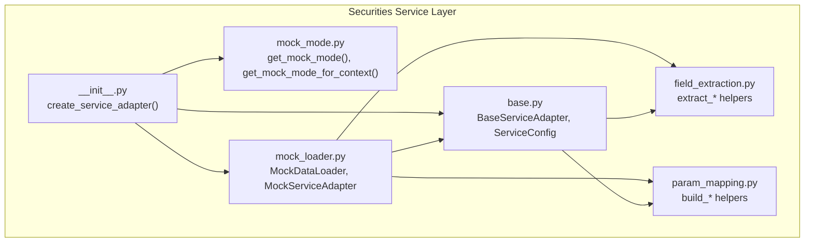
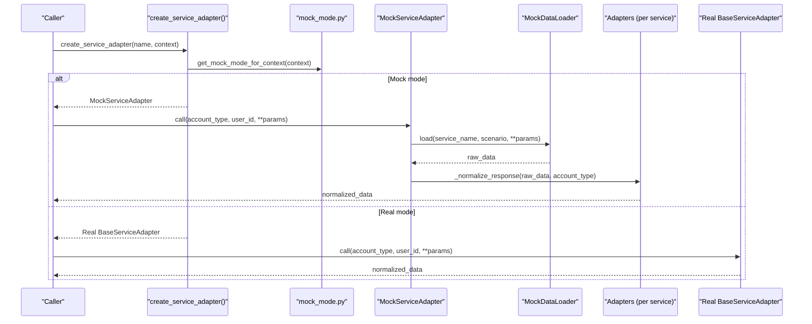
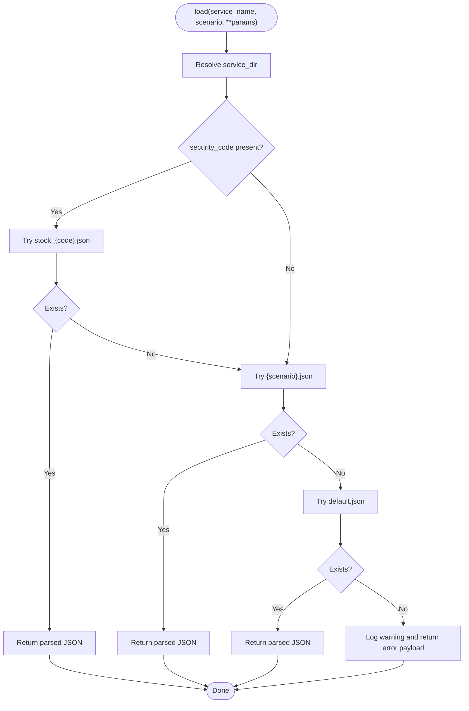
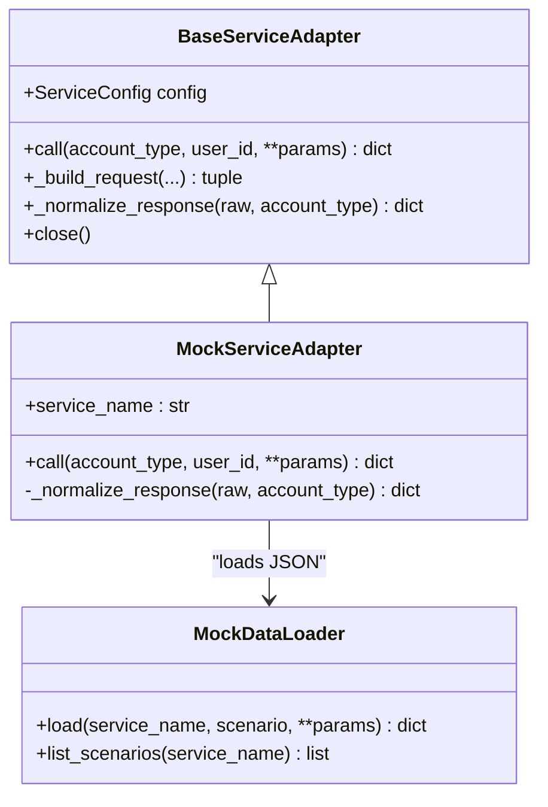
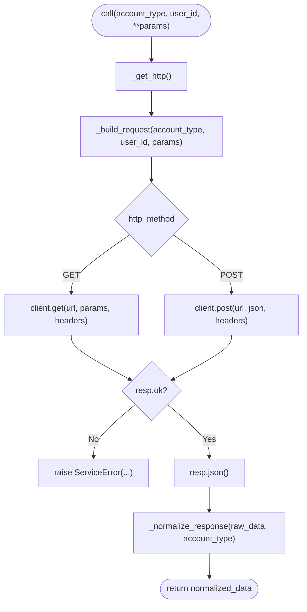
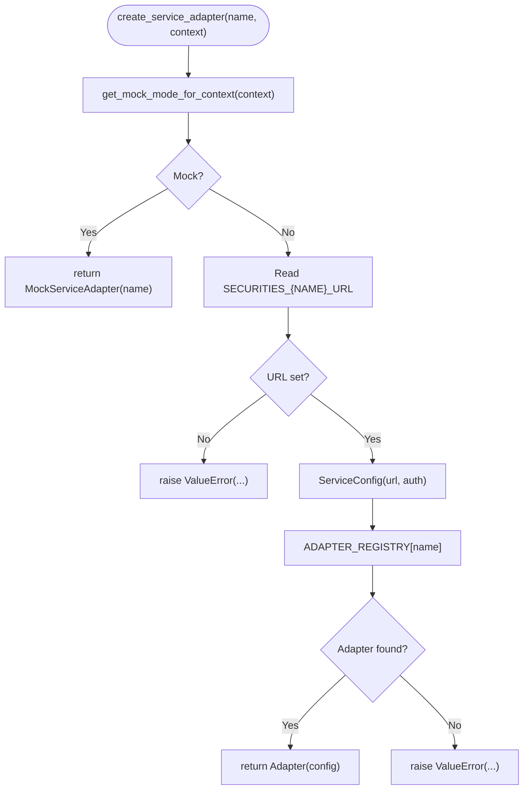
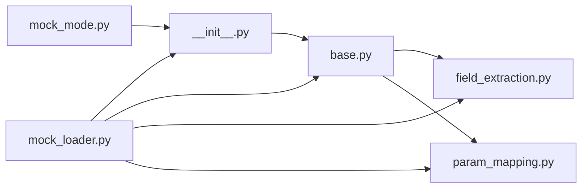

# Mock Loader and Service Integration

<cite>
**Referenced Files in This Document**
- [mock_loader.py](file://src/ark_agentic/agents/securities/tools/service/mock_loader.py)
- [mock_mode.py](file://src/ark_agentic/agents/securities/tools/service/mock_mode.py)
- [base.py](file://src/ark_agentic/agents/securities/tools/service/base.py)
- [field_extraction.py](file://src/ark_agentic/agents/securities/tools/service/field_extraction.py)
- [param_mapping.py](file://src/ark_agentic/agents/securities/tools/service/param_mapping.py)
- [__init__.py](file://src/ark_agentic/agents/securities/tools/service/__init__.py)
- [test_mock_loader_and_service_adapter.py](file://tests/integration/agents/securities/test_mock_loader_and_service_adapter.py)
</cite>

## Table of Contents
1. [Introduction](#introduction)
2. [Project Structure](#project-structure)
3. [Core Components](#core-components)
4. [Architecture Overview](#architecture-overview)
5. [Detailed Component Analysis](#detailed-component-analysis)
6. [Dependency Analysis](#dependency-analysis)
7. [Performance Considerations](#performance-considerations)
8. [Troubleshooting Guide](#troubleshooting-guide)
9. [Conclusion](#conclusion)
10. [Appendices](#appendices)

## Introduction
This document explains the mock loader system and service integration mechanisms used by the securities agent to support development and testing without relying on external financial services. It covers:
- How mock data is loaded and processed
- How mock mode is enabled and resolved per request
- The base service adapter architecture and adapter pattern
- Field extraction utilities for parsing structured API responses
- Parameter mapping for transforming context into API requests
- Integration patterns with real financial services
- Practical workflows for switching between mock and production data sources

## Project Structure
The securities service stack resides under agents/securities/tools/service and includes:
- Base adapter infrastructure and shared utilities
- Mock loader and mock adapter
- Field extraction helpers for rendering UI-ready data
- Parameter mapping for building API requests and headers
- Factory for selecting between mock and real adapters

**Diagram sources**
- [__init__.py:39-85](file://src/ark_agentic/agents/securities/tools/service/__init__.py#L39-L85)
- [base.py:38-131](file://src/ark_agentic/agents/securities/tools/service/base.py#L38-L131)
- [mock_mode.py:7-24](file://src/ark_agentic/agents/securities/tools/service/mock_mode.py#L7-L24)
- [mock_loader.py:17-178](file://src/ark_agentic/agents/securities/tools/service/mock_loader.py#L17-L178)
- [field_extraction.py:12-479](file://src/ark_agentic/agents/securities/tools/service/field_extraction.py#L12-L479)
- [param_mapping.py:38-479](file://src/ark_agentic/agents/securities/tools/service/param_mapping.py#L38-L479)

**Section sources**
- [__init__.py:1-85](file://src/ark_agentic/agents/securities/tools/service/__init__.py#L1-L85)

## Core Components
- MockDataLoader: Loads mock JSON files from a configurable directory, supports scenario-specific and parameterized files, and returns normalized data.
- MockServiceAdapter: Implements the BaseServiceAdapter interface to serve mock responses by delegating normalization to specialized adapters.
- BaseServiceAdapter: Defines the standard call flow, request building, error handling, and response normalization hook.
- ServiceConfig: Holds endpoint URL, authentication scheme, and timeouts.
- Field extraction utilities: Provide helpers to extract and reshape API responses into UI-friendly structures.
- Parameter mapping utilities: Convert context dictionaries into API request bodies and headers, including validatedata/signature authentication.
- Mock mode resolver: Determines whether to use mock or real services via environment and per-request context.

**Section sources**
- [mock_loader.py:17-178](file://src/ark_agentic/agents/securities/tools/service/mock_loader.py#L17-L178)
- [base.py:14-131](file://src/ark_agentic/agents/securities/tools/service/base.py#L14-L131)
- [field_extraction.py:12-479](file://src/ark_agentic/agents/securities/tools/service/field_extraction.py#L12-L479)
- [param_mapping.py:38-479](file://src/ark_agentic/agents/securities/tools/service/param_mapping.py#L38-L479)
- [mock_mode.py:7-24](file://src/ark_agentic/agents/securities/tools/service/mock_mode.py#L7-L24)

## Architecture Overview
The system exposes a single entry point to create adapters. It resolves mock vs. real mode, constructs ServiceConfig for real services, and delegates to the appropriate adapter. Mock mode bypasses network calls and reads from local JSON files, while real mode performs HTTP requests and normalizes responses.

**Diagram sources**
- [__init__.py:39-85](file://src/ark_agentic/agents/securities/tools/service/__init__.py#L39-L85)
- [mock_mode.py:7-24](file://src/ark_agentic/agents/securities/tools/service/mock_mode.py#L7-L24)
- [mock_loader.py:110-178](file://src/ark_agentic/agents/securities/tools/service/mock_loader.py#L110-L178)
- [base.py:55-131](file://src/ark_agentic/agents/securities/tools/service/base.py#L55-L131)

## Detailed Component Analysis

### Mock Loader and Data Resolution
The MockDataLoader locates and loads mock data based on service name, scenario, and optional parameters. It supports:
- Parameterized files keyed by security_code
- Scenario-specific files (e.g., normal_user, margin_user)
- A default fallback file
- Logging and safe error handling

Key behaviors:
- Directory resolution defaults to a mock_data folder adjacent to the service module.
- load returns structured data or an error payload if nothing is found.
- list_scenarios enumerates available scenarios for a given service.

**Diagram sources**
- [mock_loader.py:31-92](file://src/ark_agentic/agents/securities/tools/service/mock_loader.py#L31-L92)

**Section sources**
- [mock_loader.py:17-104](file://src/ark_agentic/agents/securities/tools/service/mock_loader.py#L17-L104)

### Mock Service Adapter and Normalization
The MockServiceAdapter selects a scenario based on account_type for specific services and delegates normalization to specialized adapters. It:
- Chooses scenario defaults for account_overview, cash_assets, asset_profit_hist, and stock_daily_profit
- Delegates normalization to adapter classes registered for each service
- Falls back to returning data[data] if no adapter is found

**Diagram sources**
- [base.py:38-131](file://src/ark_agentic/agents/securities/tools/service/base.py#L38-L131)
- [mock_loader.py:110-178](file://src/ark_agentic/agents/securities/tools/service/mock_loader.py#L110-L178)

**Section sources**
- [mock_loader.py:110-178](file://src/ark_agentic/agents/securities/tools/service/mock_loader.py#L110-L178)

### Base Service Adapter and Request Building
The BaseServiceAdapter defines:
- Standardized call flow with HTTP client reuse
- Request building with headers/body composition
- Error handling for HTTP failures and API error status
- A hook for response normalization

It also provides:
- require_context_fields to validate context presence outside mock mode
- build_validatedata_request to construct validatedata + signature authenticated requests
- check_api_response to validate API status fields

**Diagram sources**
- [base.py:55-131](file://src/ark_agentic/agents/securities/tools/service/base.py#L55-L131)

**Section sources**
- [base.py:38-131](file://src/ark_agentic/agents/securities/tools/service/base.py#L38-L131)

### Field Extraction Utilities
Field extraction utilities convert raw API responses into UI-ready structures:
- extract_fields: Selects fields by dot-path mapping
- extract_account_overview, extract_cash_assets, extract_etf_holdings, extract_hksc_holdings, extract_asset_profit_hist, extract_stock_daily_profit, extract_stock_profit_ranking
- extract_service_fields: Dispatches to service-specific extractors
- Helpers for list items and summary fields

These functions enable consistent rendering across different services and handle nested structures and arrays.

**Section sources**
- [field_extraction.py:12-479](file://src/ark_agentic/agents/securities/tools/service/field_extraction.py#L12-L479)

### Parameter Mapping and Authentication
Parameter mapping converts context into API requests:
- build_api_request: Builds nested request bodies from flat context using static/context/transform sources
- build_api_headers: Builds headers from context
- _get_by_path and _set_by_path: Dot-path navigation for nested structures
- parse_validatedata and enrich_securities_context: Parse validatedata and inject derived fields into context
- build_validatedata and build_api_headers_with_validatedata: Construct validatedata/signature headers
- SERVICE_PARAM_CONFIGS and SERVICE_HEADER_CONFIGS: Centralized configs for each service
- validate_validatedata_fields: Validates required fields for authenticated calls

These utilities standardize how context is transformed into API requests and headers, including special handling for validatedata/signature authentication.

**Section sources**
- [param_mapping.py:38-479](file://src/ark_agentic/agents/securities/tools/service/param_mapping.py#L38-L479)

### Factory and Mode Resolution
The factory function creates either a mock or real adapter:
- Per-request mock mode is resolved from context with environment variable fallback
- For real mode, it reads endpoint URLs and auth settings from environment variables
- It selects an adapter class from a registry or raises an error for unknown services

**Diagram sources**
- [__init__.py:39-85](file://src/ark_agentic/agents/securities/tools/service/__init__.py#L39-L85)
- [mock_mode.py:7-24](file://src/ark_agentic/agents/securities/tools/service/mock_mode.py#L7-L24)

**Section sources**
- [__init__.py:39-85](file://src/ark_agentic/agents/securities/tools/service/__init__.py#L39-L85)

## Dependency Analysis
The following diagram shows key dependencies among components:

**Diagram sources**
- [mock_mode.py:7-24](file://src/ark_agentic/agents/securities/tools/service/mock_mode.py#L7-L24)
- [mock_loader.py:107-178](file://src/ark_agentic/agents/securities/tools/service/mock_loader.py#L107-L178)
- [base.py:14-131](file://src/ark_agentic/agents/securities/tools/service/base.py#L14-L131)
- [field_extraction.py:12-479](file://src/ark_agentic/agents/securities/tools/service/field_extraction.py#L12-L479)
- [param_mapping.py:38-479](file://src/ark_agentic/agents/securities/tools/service/param_mapping.py#L38-L479)
- [__init__.py:39-85](file://src/ark_agentic/agents/securities/tools/service/__init__.py#L39-L85)

**Section sources**
- [__init__.py:39-85](file://src/ark_agentic/agents/securities/tools/service/__init__.py#L39-L85)

## Performance Considerations
- Mock loader caches directory existence and logs warnings when directories are missing; ensure mock_data directories are populated to avoid repeated warnings.
- BaseServiceAdapter reuses AsyncClient instances to reduce connection overhead; remember to close adapters when finished to release resources.
- Field extraction and parameter mapping operate on dictionaries and lists; keep mappings concise to minimize traversal cost.
- Prefer scenario-specific files to avoid unnecessary fallbacks during mock data loading.

## Troubleshooting Guide
Common issues and resolutions:
- Missing environment variables for real services:
  - Ensure SECURITIES_{SERVICE}_URL is set when not using mock mode.
  - Verify SECURITIES_{SERVICE}_AUTH_TYPE, AUTH_KEY, and AUTH_VALUE if using custom auth.
- Mock data not found:
  - Confirm the mock_data directory exists and contains the expected JSON files.
  - Use list_scenarios to enumerate available scenarios for a service.
- Context validation errors in non-mock mode:
  - Ensure required fields are present in context; missing fields trigger validation errors.
- API response errors:
  - check_api_response validates status fields; non-success responses raise ServiceError with details.

**Section sources**
- [base.py:202-212](file://src/ark_agentic/agents/securities/tools/service/base.py#L202-L212)
- [mock_loader.py:27-30](file://src/ark_agentic/agents/securities/tools/service/mock_loader.py#L27-L30)
- [__init__.py:65-78](file://src/ark_agentic/agents/securities/tools/service/__init__.py#L65-L78)

## Conclusion
The mock loader and service integration system provides a robust, testable foundation for the securities agent. By separating concerns between data loading, adapter selection, request building, and response normalization, it enables seamless transitions between mock and production environments. Field extraction and parameter mapping utilities ensure consistent data handling across services, while the factory pattern centralizes configuration and mode resolution.

## Appendices

### Practical Workflows

- Loading mock data for a specific security:
  - Use MockDataLoader.load with service_name and security_code to target parameterized files.
  - Fall back to scenario-based files or default.json if parameterized files are absent.

- Enabling mock mode:
  - Set SECURITIES_SERVICE_MOCK to true for service-wide mock mode.
  - Override per-request via context keys user:mock_mode or mock_mode.

- Creating and using adapters:
  - Use create_service_adapter to select mock or real adapters based on mode.
  - Call call(account_type, user_id, **params) to retrieve normalized data.

- Testing without external dependencies:
  - Run integration tests that rely on mock data and adapters.
  - Validate scenarios and parameterized files to ensure coverage.

**Section sources**
- [test_mock_loader_and_service_adapter.py:10-45](file://tests/integration/agents/securities/test_mock_loader_and_service_adapter.py#L10-L45)
- [mock_loader.py:31-92](file://src/ark_agentic/agents/securities/tools/service/mock_loader.py#L31-L92)
- [mock_mode.py:7-24](file://src/ark_agentic/agents/securities/tools/service/mock_mode.py#L7-L24)
- [__init__.py:39-85](file://src/ark_agentic/agents/securities/tools/service/__init__.py#L39-L85)