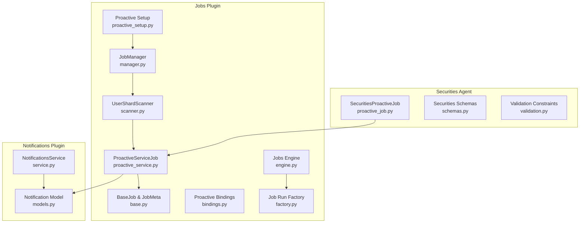
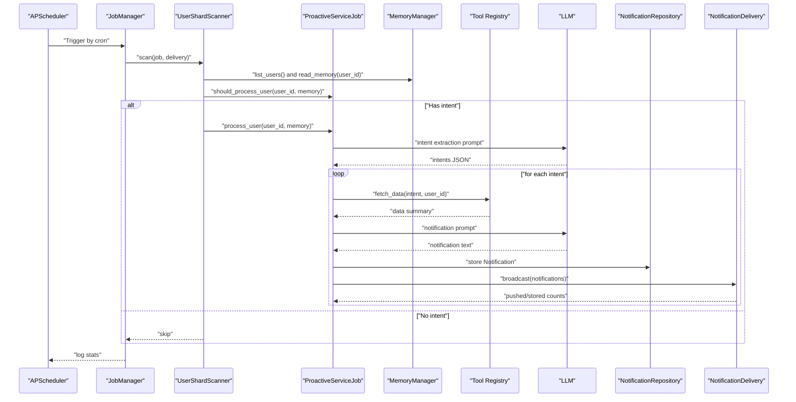
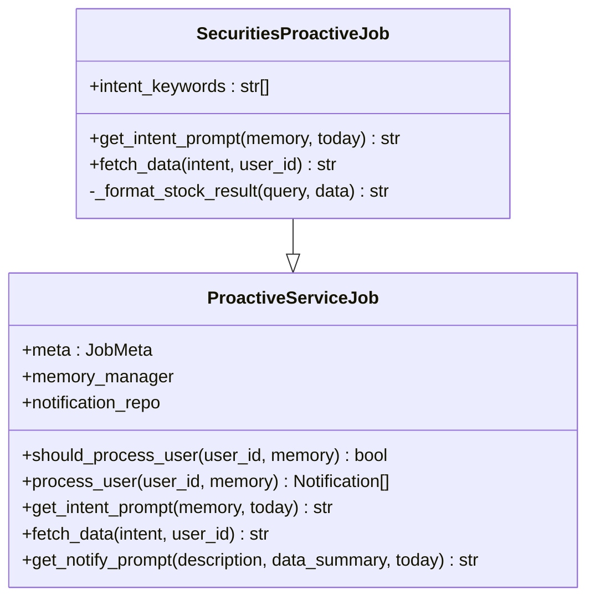
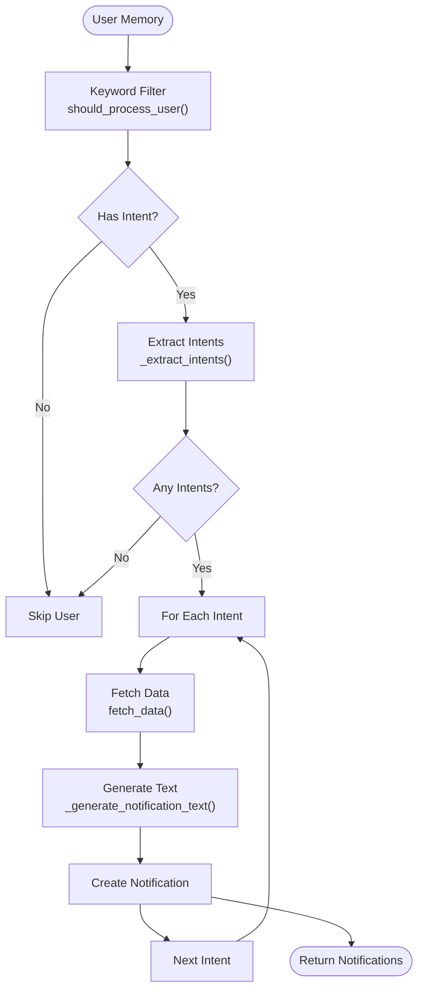
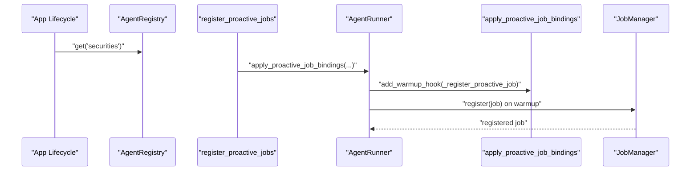
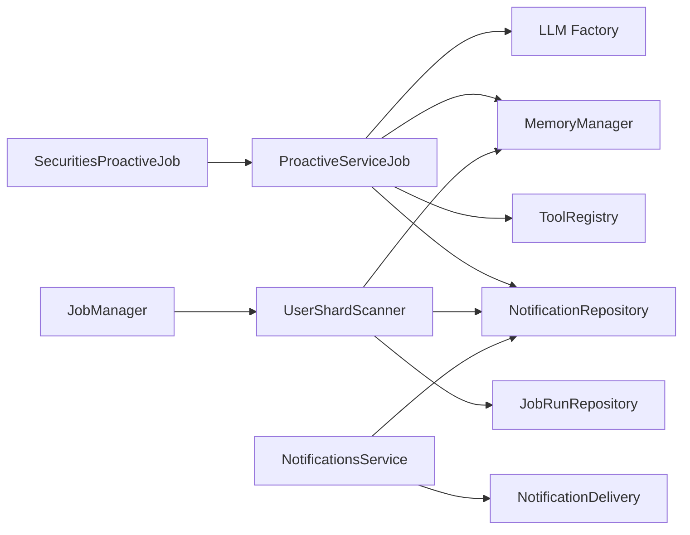

# Proactive Job System

<cite>
**Referenced Files in This Document**
- [proactive_job.py](file://src/ark_agentic/agents/securities/proactive_job.py)
- [proactive_service.py](file://src/ark_agentic/plugins/jobs/proactive_service.py)
- [proactive_setup.py](file://src/ark_agentic/plugins/jobs/proactive_setup.py)
- [base.py](file://src/ark_agentic/plugins/jobs/base.py)
- [manager.py](file://src/ark_agentic/plugins/jobs/manager.py)
- [scanner.py](file://src/ark_agentic/plugins/jobs/scanner.py)
- [bindings.py](file://src/ark_agentic/plugins/jobs/bindings.py)
- [engine.py](file://src/ark_agentic/plugins/jobs/engine.py)
- [factory.py](file://src/ark_agentic/plugins/jobs/factory.py)
- [models.py](file://src/ark_agentic/plugins/notifications/models.py)
- [service.py](file://src/ark_agentic/plugins/notifications/service.py)
- [schemas.py](file://src/ark_agentic/agents/securities/schemas.py)
- [validation.py](file://src/ark_agentic/agents/securities/validation.py)
</cite>

## Table of Contents
1. [Introduction](#introduction)
2. [Project Structure](#project-structure)
3. [Core Components](#core-components)
4. [Architecture Overview](#architecture-overview)
5. [Detailed Component Analysis](#detailed-component-analysis)
6. [Dependency Analysis](#dependency-analysis)
7. [Performance Considerations](#performance-considerations)
8. [Troubleshooting Guide](#troubleshooting-guide)
9. [Conclusion](#conclusion)
10. [Appendices](#appendices)

## Introduction
This document explains the Securities Agent proactive job system that continuously monitors financial market data and generates alerts for users. It covers the job scheduling architecture, trigger conditions, alert generation mechanisms, integration with the jobs plugin system, and the proactive service framework. It also documents configuration options, execution patterns, and monitoring capabilities, along with practical examples and performance considerations for continuous market data processing.

## Project Structure
The proactive job system spans two main areas:
- Securities Agent proactive job implementation under agents/securities
- Jobs plugin system under plugins/jobs that orchestrates scheduling, scanning, and delivery

**Diagram sources**
- [proactive_job.py:54-145](file://src/ark_agentic/agents/securities/proactive_job.py#L54-L145)
- [proactive_service.py:49-215](file://src/ark_agentic/plugins/jobs/proactive_service.py#L49-L215)
- [proactive_setup.py:18-65](file://src/ark_agentic/plugins/jobs/proactive_setup.py#L18-L65)
- [base.py:20-102](file://src/ark_agentic/plugins/jobs/base.py#L20-L102)
- [manager.py:40-123](file://src/ark_agentic/plugins/jobs/manager.py#L40-L123)
- [scanner.py:35-186](file://src/ark_agentic/plugins/jobs/scanner.py#L35-L186)
- [bindings.py:25-75](file://src/ark_agentic/plugins/jobs/bindings.py#L25-L75)
- [engine.py:20-35](file://src/ark_agentic/plugins/jobs/engine.py#L20-L35)
- [factory.py:18-40](file://src/ark_agentic/plugins/jobs/factory.py#L18-L40)
- [models.py:12-29](file://src/ark_agentic/plugins/notifications/models.py#L12-L29)
- [service.py:29-134](file://src/ark_agentic/plugins/notifications/service.py#L29-L134)

**Section sources**
- [proactive_job.py:1-145](file://src/ark_agentic/agents/securities/proactive_job.py#L1-L145)
- [proactive_service.py:1-215](file://src/ark_agentic/plugins/jobs/proactive_service.py#L1-L215)
- [proactive_setup.py:1-65](file://src/ark_agentic/plugins/jobs/proactive_setup.py#L1-L65)
- [base.py:1-102](file://src/ark_agentic/plugins/jobs/base.py#L1-L102)
- [manager.py:1-123](file://src/ark_agentic/plugins/jobs/manager.py#L1-L123)
- [scanner.py:1-186](file://src/ark_agentic/plugins/jobs/scanner.py#L1-L186)
- [bindings.py:1-75](file://src/ark_agentic/plugins/jobs/bindings.py#L1-L75)
- [engine.py:1-35](file://src/ark_agentic/plugins/jobs/engine.py#L1-L35)
- [factory.py:1-40](file://src/ark_agentic/plugins/jobs/factory.py#L1-L40)
- [models.py:1-29](file://src/ark_agentic/plugins/notifications/models.py#L1-L29)
- [service.py:1-134](file://src/ark_agentic/plugins/notifications/service.py#L1-L134)

## Core Components
- SecuritiesProactiveJob: Domain-specific proactive job for securities that scans user memory for stock/fund watch intents, queries real-time market data, and generates concise notifications.
- ProactiveServiceJob: Generic base class implementing the shared proactive pipeline: keyword filtering, LLM intent extraction, tool data fetching, and notification text generation.
- JobManager: Central scheduler that registers jobs by cron, runs them, and reports statistics.
- UserShardScanner: Scalable user scanner that filters users by keywords, enforces idempotency, and executes the full job pipeline per user.
- NotificationsService: Business layer that stores notifications and attempts real-time delivery via SSE.

Key configuration and execution parameters:
- JobMeta: job_id, cron schedule, concurrency limits, batch size, per-user timeout, and enable flag.
- ProactiveServiceJob constructor accepts LLM factory, tool registry, memory manager, and notification repository, plus job_id and cron.

**Section sources**
- [proactive_job.py:54-145](file://src/ark_agentic/agents/securities/proactive_job.py#L54-L145)
- [proactive_service.py:49-215](file://src/ark_agentic/plugins/jobs/proactive_service.py#L49-L215)
- [base.py:20-102](file://src/ark_agentic/plugins/jobs/base.py#L20-L102)
- [manager.py:40-123](file://src/ark_agentic/plugins/jobs/manager.py#L40-L123)
- [scanner.py:35-186](file://src/ark_agentic/plugins/jobs/scanner.py#L35-L186)
- [service.py:29-134](file://src/ark_agentic/plugins/notifications/service.py#L29-L134)

## Architecture Overview
The proactive job system follows a layered architecture:
- Agent layer: SecuritiesProactiveJob defines domain-specific hooks.
- Jobs plugin layer: ProactiveServiceJob implements the generic pipeline; JobManager schedules and runs jobs; UserShardScanner performs large-scale user processing.
- Notifications layer: NotificationsService persists and delivers notifications.

**Diagram sources**
- [manager.py:110-123](file://src/ark_agentic/plugins/jobs/manager.py#L110-L123)
- [scanner.py:58-111](file://src/ark_agentic/plugins/jobs/scanner.py#L58-L111)
- [proactive_service.py:136-198](file://src/ark_agentic/plugins/jobs/proactive_service.py#L136-L198)
- [models.py:12-29](file://src/ark_agentic/plugins/notifications/models.py#L12-L29)

## Detailed Component Analysis

### SecuritiesProactiveJob
Responsibilities:
- Keyword-based fast filtering of user memory for securities-related terms.
- LLM-based intent extraction to identify watch lists (stocks/funds) and focus areas.
- Tool invocation to fetch latest market data for each intent.
- Formatting tool results into concise, readable summaries.
- Generating notifications and persisting them for delivery.

Key hooks and behaviors:
- intent_keywords: high-recall keyword list for rapid filtering.
- get_intent_prompt: constructs a domain-specific prompt for intent extraction.
- fetch_data: resolves and executes the security_info_search tool, formats results, and handles errors.
- _format_stock_result: converts structured tool output into a human-readable summary.

**Diagram sources**
- [proactive_service.py:49-215](file://src/ark_agentic/plugins/jobs/proactive_service.py#L49-L215)
- [proactive_job.py:54-145](file://src/ark_agentic/agents/securities/proactive_job.py#L54-L145)

**Section sources**
- [proactive_job.py:54-145](file://src/ark_agentic/agents/securities/proactive_job.py#L54-L145)

### ProactiveServiceJob Pipeline
Shared execution flow:
- should_process_user: O(1) keyword check against intent_keywords.
- process_user: orchestrates intent extraction, per-intent data fetching, and notification generation.
- _extract_intents: invokes LLM with get_intent_prompt and parses JSON output.
- _process_intent: calls fetch_data, then get_notify_prompt to produce notification text.
- _generate_notification_text: builds notification body via LLM.
- _parse_json: robust parser to handle fenced code blocks and partial JSON.

**Diagram sources**
- [proactive_service.py:132-198](file://src/ark_agentic/plugins/jobs/proactive_service.py#L132-L198)

**Section sources**
- [proactive_service.py:49-215](file://src/ark_agentic/plugins/jobs/proactive_service.py#L49-L215)

### Job Scheduling and Registration
- JobManager: registers jobs with APScheduler using cron triggers; supports manual dispatch and job listing.
- ProactiveSetup: binds agent-specific jobs to runners, building per-agent notification repositories and applying proactive bindings.
- Bindings: decouple agent factories from the jobs system; apply bindings via runner warmup hooks.

**Diagram sources**
- [proactive_setup.py:18-65](file://src/ark_agentic/plugins/jobs/proactive_setup.py#L18-L65)
- [bindings.py:39-75](file://src/ark_agentic/plugins/jobs/bindings.py#L39-L75)
- [manager.py:56-80](file://src/ark_agentic/plugins/jobs/manager.py#L56-L80)

**Section sources**
- [manager.py:40-123](file://src/ark_agentic/plugins/jobs/manager.py#L40-L123)
- [proactive_setup.py:18-65](file://src/ark_agentic/plugins/jobs/proactive_setup.py#L18-L65)
- [bindings.py:25-75](file://src/ark_agentic/plugins/jobs/bindings.py#L25-L75)

### UserShardScanner and Idempotency
Scalable processing:
- Lists users from MemoryRepository ordered by last update.
- Applies shard filtering for horizontal scaling.
- Uses asyncio.Semaphore for concurrency control and batches for throughput.
- Per-user pipeline: keyword filter, idempotency check, timeout-wrapped full pipeline, and persistence of last-run timestamp.

Idempotency:
- Prevents reprocessing the same user within a 24-hour window using job-run timestamps.

**Section sources**
- [scanner.py:35-186](file://src/ark_agentic/plugins/jobs/scanner.py#L35-L186)

### Notifications and Delivery
- Notification model captures essential fields for delivery and UI rendering.
- NotificationsService encapsulates storage and real-time delivery, grouping by agent_id for efficient batching.
- Delivery attempts real-time SSE pushes; otherwise stores notifications for later retrieval.

**Section sources**
- [models.py:12-29](file://src/ark_agentic/plugins/notifications/models.py#L12-L29)
- [service.py:29-134](file://src/ark_agentic/plugins/notifications/service.py#L29-L134)

### Securities Data Models
Standardized schemas for financial data enable consistent parsing and presentation across tools and UIs. These models support automatic field mapping and validation, ensuring reliable downstream processing.

**Section sources**
- [schemas.py:17-465](file://src/ark_agentic/agents/securities/schemas.py#L17-L465)

### Validation Constraints
Lightweight validation system instruction ensures responses rely strictly on tool outputs and context, reducing hallucinations and improving trustworthiness.

**Section sources**
- [validation.py:12-22](file://src/ark_agentic/agents/securities/validation.py#L12-L22)

## Dependency Analysis
High-level dependencies:
- SecuritiesProactiveJob depends on ProactiveServiceJob and the tool registry.
- ProactiveServiceJob depends on LLM, MemoryManager, ToolRegistry, and NotificationRepository.
- JobManager depends on NotificationDelivery and UserShardScanner.
- UserShardScanner depends on MemoryRepository, JobRunRepository, and NotificationRepository.
- NotificationsService depends on NotificationDelivery and per-agent NotificationRepository.

**Diagram sources**
- [proactive_job.py:54-145](file://src/ark_agentic/agents/securities/proactive_job.py#L54-L145)
- [proactive_service.py:98-129](file://src/ark_agentic/plugins/jobs/proactive_service.py#L98-L129)
- [manager.py:40-54](file://src/ark_agentic/plugins/jobs/manager.py#L40-L54)
- [scanner.py:67-85](file://src/ark_agentic/plugins/jobs/scanner.py#L67-L85)
- [service.py:41-48](file://src/ark_agentic/plugins/notifications/service.py#L41-L48)

**Section sources**
- [proactive_job.py:54-145](file://src/ark_agentic/agents/securities/proactive_job.py#L54-L145)
- [proactive_service.py:98-129](file://src/ark_agentic/plugins/jobs/proactive_service.py#L98-L129)
- [manager.py:40-54](file://src/ark_agentic/plugins/jobs/manager.py#L40-L54)
- [scanner.py:67-85](file://src/ark_agentic/plugins/jobs/scanner.py#L67-L85)
- [service.py:41-48](file://src/ark_agentic/plugins/notifications/service.py#L41-L48)

## Performance Considerations
- Keyword filtering: intent_keywords provide O(k) filtering before invoking LLM, minimizing expensive calls.
- Concurrency and batching: UserShardScanner uses asyncio.Semaphore and batched asyncio.gather to control resource usage and improve throughput.
- Idempotency: Last-run timestamps prevent redundant processing within 24 hours.
- Timeout control: Per-user timeouts protect the system from slow or stuck operations.
- Storage modes: Jobs and notifications support file and SQLite backends; choose based on scale and operational preferences.
- Cron tuning: Adjust SECURITIES_PROACTIVE_CRON to balance freshness vs. load.

[No sources needed since this section provides general guidance]

## Troubleshooting Guide
Common issues and remedies:
- Job not running: Verify cron expression and that JobManager is started after agent warmup.
- No notifications generated: Confirm intent extraction returns non-empty intents and fetch_data succeeds; check tool availability and network connectivity.
- Excessive timeouts: Increase user_timeout_secs or reduce batch_size; investigate slow tools or LLM latency.
- Duplicate notifications: Ensure idempotency is intact; verify job-run timestamps are being written.
- Storage backend issues: For file mode, confirm base directories exist and permissions are correct; for SQLite mode, ensure migrations are applied.

**Section sources**
- [manager.py:81-89](file://src/ark_agentic/plugins/jobs/manager.py#L81-L89)
- [scanner.py:139-158](file://src/ark_agentic/plugins/jobs/scanner.py#L139-L158)
- [engine.py:25-35](file://src/ark_agentic/plugins/jobs/engine.py#L25-L35)

## Conclusion
The Securities Agent proactive job system integrates tightly with the jobs plugin framework to deliver timely, accurate market alerts. By combining fast keyword filtering, robust intent extraction, standardized data models, and scalable scanning, it achieves high reliability and performance for continuous surveillance of financial market data.

[No sources needed since this section summarizes without analyzing specific files]

## Appendices

### Practical Examples

- Configure SecuritiesProactiveJob:
  - Set SECURITIES_PROACTIVE_CRON to define the schedule (default weekday mornings).
  - Ensure the agent runner is registered and proactive bindings are applied during startup.

- Define alert configuration:
  - Customize intent_keywords for domain-specific signals.
  - Override get_notify_prompt to tailor notification tone and structure.

- Monitor execution:
  - Use JobManager.list_jobs to inspect scheduled jobs and next run times.
  - Review logs for per-user stats and errors.

- Optimize performance:
  - Tune max_concurrent_users and batch_size based on infrastructure capacity.
  - Adjust user_timeout_secs to accommodate tool latency.
  - Choose storage mode (file vs. SQLite) aligned with deployment scale.

**Section sources**
- [proactive_setup.py:52-64](file://src/ark_agentic/plugins/jobs/proactive_setup.py#L52-L64)
- [manager.py:97-108](file://src/ark_agentic/plugins/jobs/manager.py#L97-L108)
- [scanner.py:44-56](file://src/ark_agentic/plugins/jobs/scanner.py#L44-L56)
- [engine.py:25-35](file://src/ark_agentic/plugins/jobs/engine.py#L25-L35)