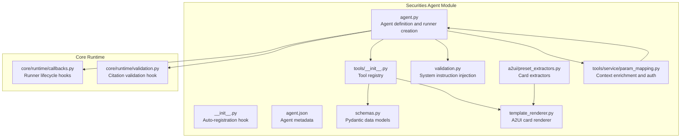
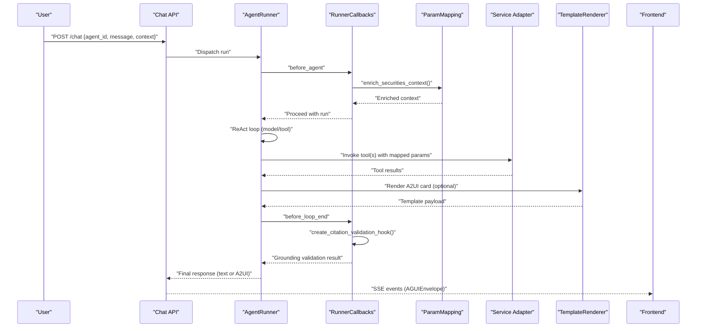
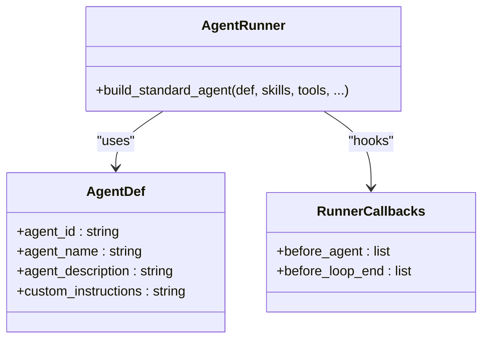
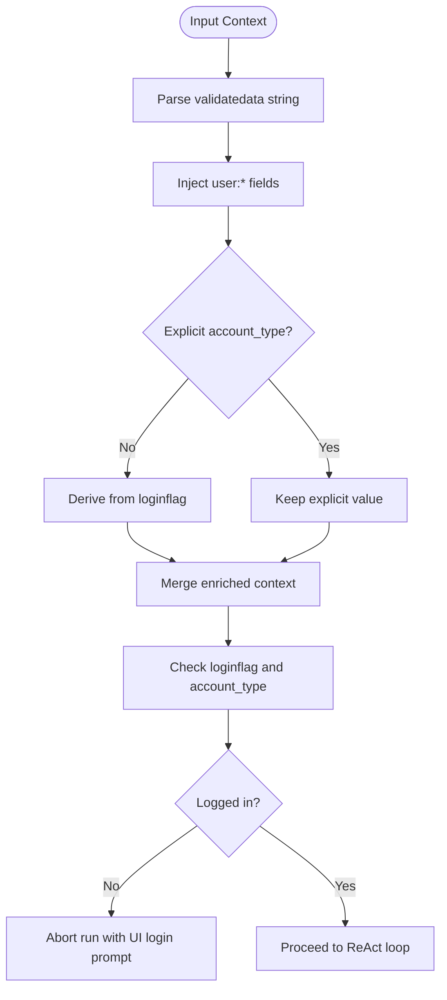
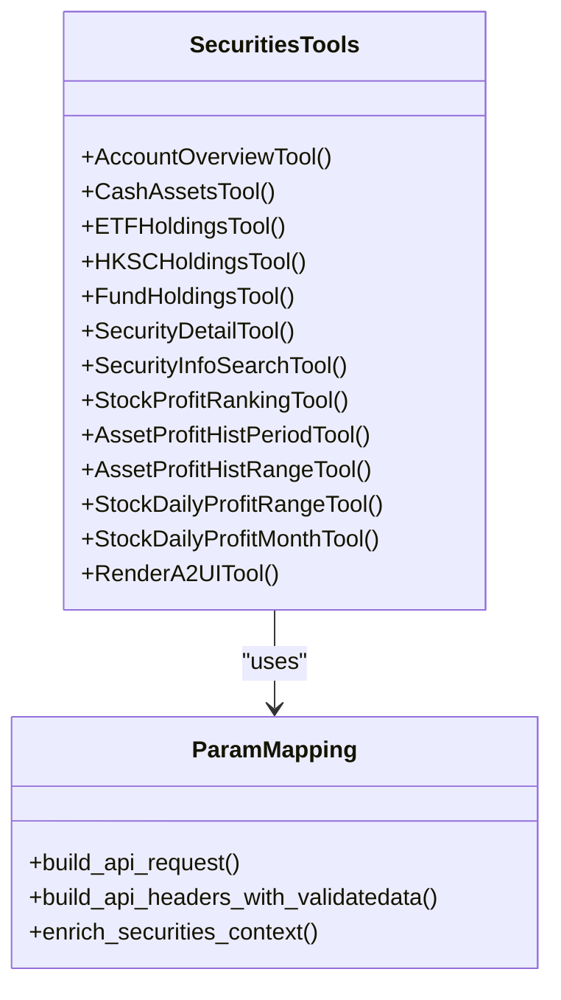
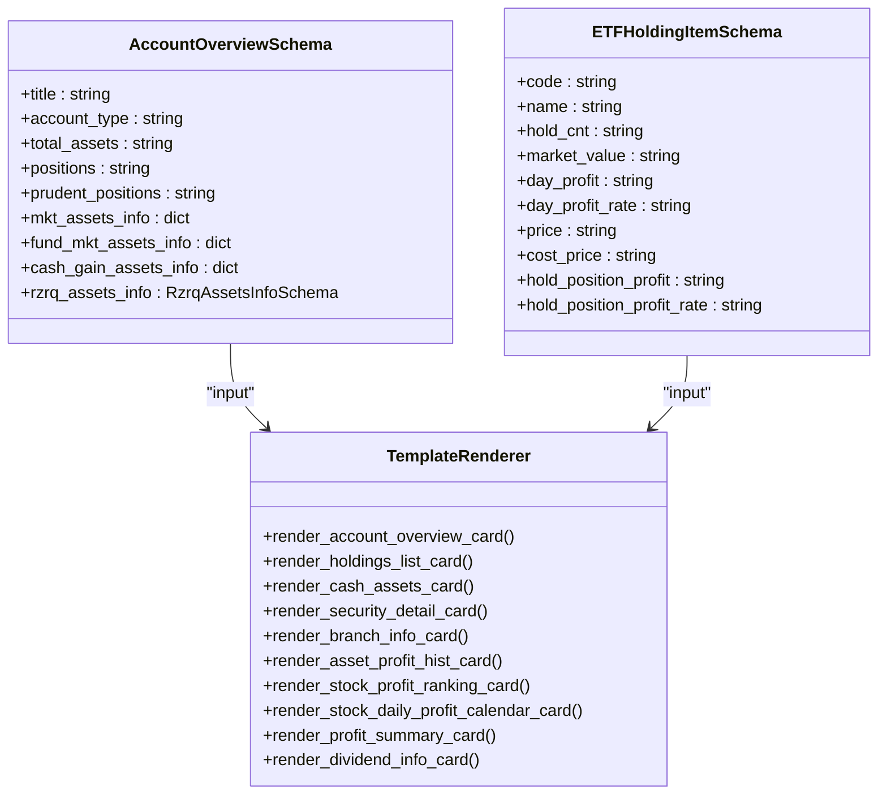
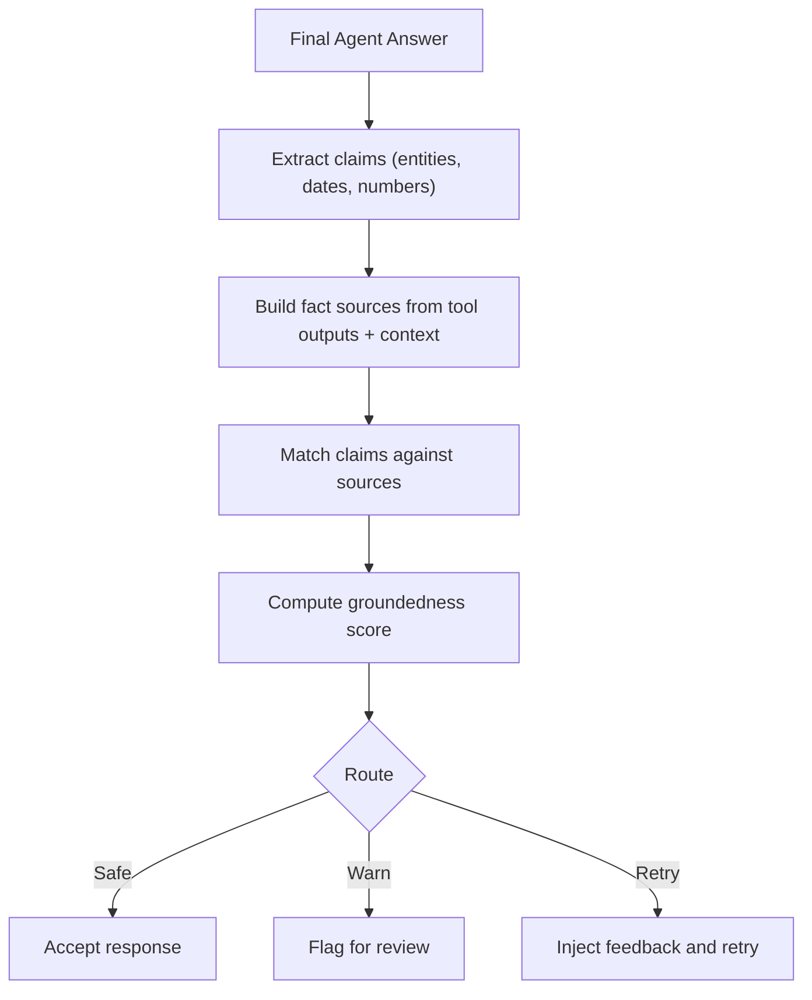
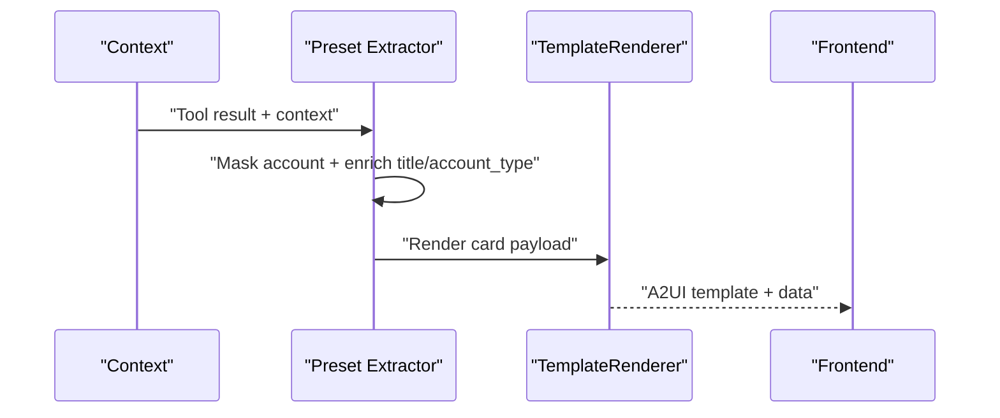
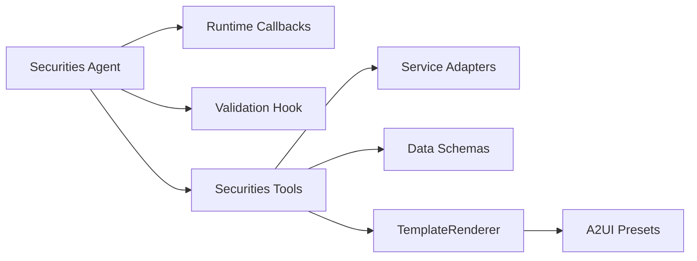

# Securities Agent Overview

<cite>
**Referenced Files in This Document**
- [agent.py](file://src/ark_agentic/agents/securities/agent.py)
- [agent.json](file://src/ark_agentic/agents/securities/agent.json)
- [__init__.py](file://src/ark_agentic/agents/securities/__init__.py)
- [README.md](file://src/ark_agentic/agents/securities/README.md)
- [tools/__init__.py](file://src/ark_agentic/agents/securities/tools/__init__.py)
- [validation.py](file://src/ark_agentic/agents/securities/validation.py)
- [schemas.py](file://src/ark_agentic/agents/securities/schemas.py)
- [template_renderer.py](file://src/ark_agentic/agents/securities/template_renderer.py)
- [param_mapping.py](file://src/ark_agentic/agents/securities/tools/service/param_mapping.py)
- [preset_extractors.py](file://src/ark_agentic/agents/securities/a2ui/preset_extractors.py)
- [callbacks.py](file://src/ark_agentic/core/runtime/callbacks.py)
- [validation.py](file://src/ark_agentic/core/runtime/validation.py)
</cite>

## Table of Contents
1. [Introduction](#introduction)
2. [Project Structure](#project-structure)
3. [Core Components](#core-components)
4. [Architecture Overview](#architecture-overview)
5. [Detailed Component Analysis](#detailed-component-analysis)
6. [Dependency Analysis](#dependency-analysis)
7. [Performance Considerations](#performance-considerations)
8. [Troubleshooting Guide](#troubleshooting-guide)
9. [Conclusion](#conclusion)
10. [Appendices](#appendices)

## Introduction
The Securities Agent is a professional assistant designed to query and analyze securities assets within the ark-agentic framework. It serves financial services by enabling portfolio management, market data analysis, and actionable investment insights. The agent orchestrates a set of domain-specific tools and services to deliver structured, validated, and compliant responses to user queries.

Key capabilities include:
- Portfolio management: account overview, cash assets, and holdings across ETFs, funds, and HKSC.
- Market data analysis: security details, profit rankings, daily profit calendars, and historical profit curves.
- Compliance and safety: built-in citation validation and entity trie integration to ensure grounded, auditable answers.

## Project Structure
The Securities Agent resides under the securities module and integrates tightly with the core runtime, tools, and A2UI rendering pipeline. The module organizes agent creation, tool registration, service adapters, schemas, and template rendering into cohesive subpackages.

**Diagram sources**
- [agent.py:1-100](file://src/ark_agentic/agents/securities/agent.py#L1-L100)
- [__init__.py:1-30](file://src/ark_agentic/agents/securities/__init__.py#L1-L30)
- [agent.json:1-8](file://src/ark_agentic/agents/securities/agent.json#L1-L8)
- [tools/__init__.py:1-66](file://src/ark_agentic/agents/securities/tools/__init__.py#L1-L66)
- [schemas.py:1-465](file://src/ark_agentic/agents/securities/schemas.py#L1-L465)
- [template_renderer.py:1-369](file://src/ark_agentic/agents/securities/template_renderer.py#L1-L369)
- [validation.py:1-22](file://src/ark_agentic/agents/securities/validation.py#L1-L22)
- [preset_extractors.py:1-222](file://src/ark_agentic/agents/securities/a2ui/preset_extractors.py#L1-L222)
- [param_mapping.py:1-479](file://src/ark_agentic/agents/securities/tools/service/param_mapping.py#L1-L479)
- [callbacks.py:1-246](file://src/ark_agentic/core/runtime/callbacks.py#L1-L246)
- [validation.py:1-604](file://src/ark_agentic/core/runtime/validation.py#L1-L604)

**Section sources**
- [agent.py:1-100](file://src/ark_agentic/agents/securities/agent.py#L1-L100)
- [README.md:574-635](file://src/ark_agentic/agents/securities/README.md#L574-L635)

## Core Components
- Agent definition and runner creation: Defines agent identity and builds a standard agent with skills, tools, and callbacks.
- Tools registry: Aggregates all securities-related tools (account overview, cash assets, holdings, security detail, profit analytics, and A2UI rendering).
- Context enrichment and authentication: Parses validatedata, enriches context, and enforces login checks.
- Validation and compliance: Injects system instructions and registers a citation validation hook to ensure grounded answers.
- Rendering and presets: Converts tool outputs into A2UI cards with standardized templates.

Practical instantiation and configuration:
- Environment variables control LLM selection, service mode, and persistence directories.
- Auto-registration enables seamless integration into the agent registry.

**Section sources**
- [agent.py:41-100](file://src/ark_agentic/agents/securities/agent.py#L41-L100)
- [tools/__init__.py:48-66](file://src/ark_agentic/agents/securities/tools/__init__.py#L48-L66)
- [param_mapping.py:210-236](file://src/ark_agentic/agents/securities/tools/service/param_mapping.py#L210-L236)
- [validation.py:12-22](file://src/ark_agentic/agents/securities/validation.py#L12-L22)
- [preset_extractors.py:208-222](file://src/ark_agentic/agents/securities/a2ui/preset_extractors.py#L208-L222)
- [__init__.py:18-30](file://src/ark_agentic/agents/securities/__init__.py#L18-L30)

## Architecture Overview
The Securities Agent leverages the ark-agentic runtime to orchestrate a ReAct loop with lifecycle hooks. It enriches context, validates authentication, executes tools, renders A2UI cards, and ensures compliance through citation validation.

**Diagram sources**
- [agent.py:72-100](file://src/ark_agentic/agents/securities/agent.py#L72-L100)
- [callbacks.py:98-215](file://src/ark_agentic/core/runtime/callbacks.py#L98-L215)
- [param_mapping.py:210-236](file://src/ark_agentic/agents/securities/tools/service/param_mapping.py#L210-L236)
- [validation.py:495-604](file://src/ark_agentic/core/runtime/validation.py#L495-L604)
- [template_renderer.py:16-261](file://src/ark_agentic/agents/securities/template_renderer.py#L16-L261)
- [README.md:135-270](file://src/ark_agentic/agents/securities/README.md#L135-L270)

## Detailed Component Analysis

### Agent Definition and Lifecycle Hooks
- Agent definition encapsulates agent_id, agent_name, agent_description, and custom_instructions for validation constraints.
- RunnerCallbacks configure:
  - before_agent: context enrichment and authentication checks.
  - before_loop_end: citation validation hook using EntityTrie for groundedness.
- The agent runner is built with skills, tools, and optional memory/dream features.

**Diagram sources**
- [agent.py:41-99](file://src/ark_agentic/agents/securities/agent.py#L41-L99)
- [callbacks.py:220-231](file://src/ark_agentic/core/runtime/callbacks.py#L220-L231)

**Section sources**
- [agent.py:41-99](file://src/ark_agentic/agents/securities/agent.py#L41-L99)

### Context Enrichment and Authentication
- Context enrichment parses validatedata from the flattened context and injects normalized fields, inferring account_type from loginflag when not explicitly provided.
- Authentication check inspects loginflag and account_type, aborting the run with a UI component payload if the user is not logged in.

**Diagram sources**
- [param_mapping.py:210-236](file://src/ark_agentic/agents/securities/tools/service/param_mapping.py#L210-L236)
- [param_mapping.py:13-36](file://src/ark_agentic/agents/securities/tools/service/param_mapping.py#L13-L36)
- [agent.py:49-70](file://src/ark_agentic/agents/securities/agent.py#L49-L70)

**Section sources**
- [param_mapping.py:210-236](file://src/ark_agentic/agents/securities/tools/service/param_mapping.py#L210-L236)
- [agent.py:49-70](file://src/ark_agentic/agents/securities/agent.py#L49-L70)

### Tools and Service Layer
- Tools registry aggregates all securities tools, including account overview, cash assets, holdings (ETF/HKSC/Fund), security detail, profit analytics, and A2UI rendering.
- Service adapters construct API requests and headers using param_mapping configurations, supporting validatedata and signature authentication.

**Diagram sources**
- [tools/__init__.py:48-66](file://src/ark_agentic/agents/securities/tools/__init__.py#L48-L66)
- [param_mapping.py:38-119](file://src/ark_agentic/agents/securities/tools/service/param_mapping.py#L38-L119)

**Section sources**
- [tools/__init__.py:48-66](file://src/ark_agentic/agents/securities/tools/__init__.py#L48-L66)
- [param_mapping.py:307-435](file://src/ark_agentic/agents/securities/tools/service/param_mapping.py#L307-L435)

### Data Models and Rendering
- Pydantic schemas define standardized structures for account overview, holdings, cash assets, security details, and profit analytics.
- TemplateRenderer converts normalized tool outputs into A2UI card payloads with consistent templates.

**Diagram sources**
- [schemas.py:29-70](file://src/ark_agentic/agents/securities/schemas.py#L29-L70)
- [schemas.py:73-148](file://src/ark_agentic/agents/securities/schemas.py#L73-L148)
- [template_renderer.py:16-261](file://src/ark_agentic/agents/securities/template_renderer.py#L16-L261)

**Section sources**
- [schemas.py:1-465](file://src/ark_agentic/agents/securities/schemas.py#L1-L465)
- [template_renderer.py:1-369](file://src/ark_agentic/agents/securities/template_renderer.py#L1-L369)

### Citation Validation and Compliance
- System instruction injection constrains the agent to answer only from tool outputs and context.
- A before_loop_end hook validates the final answer against tool sources and context, computing a groundedness score and routing decisions (safe/warn/retry).
- EntityTrie integration supports entity claim extraction for regulatory compliance and auditability.

**Diagram sources**
- [validation.py:12-22](file://src/ark_agentic/agents/securities/validation.py#L12-L22)
- [validation.py:212-292](file://src/ark_agentic/core/runtime/validation.py#L212-L292)
- [validation.py:495-604](file://src/ark_agentic/core/runtime/validation.py#L495-L604)

**Section sources**
- [validation.py:1-22](file://src/ark_agentic/agents/securities/validation.py#L1-L22)
- [validation.py:1-604](file://src/ark_agentic/core/runtime/validation.py#L1-L604)

### A2UI Presets and Card Rendering
- Preset extractors enrich tool outputs with masked account titles and account_type, then delegate to TemplateRenderer to produce frontend-ready payloads.
- Cards include account overview, holdings lists, cash assets, security details, branch info, profit histories, and rankings.

**Diagram sources**
- [preset_extractors.py:62-163](file://src/ark_agentic/agents/securities/a2ui/preset_extractors.py#L62-L163)
- [template_renderer.py:16-261](file://src/ark_agentic/agents/securities/template_renderer.py#L16-L261)

**Section sources**
- [preset_extractors.py:1-222](file://src/ark_agentic/agents/securities/a2ui/preset_extractors.py#L1-L222)
- [template_renderer.py:1-369](file://src/ark_agentic/agents/securities/template_renderer.py#L1-L369)

## Dependency Analysis
The Securities Agent composes several subsystems:
- Agent runtime and lifecycle hooks: core/runtime/callbacks and core/runtime/validation.
- Tools and adapters: securities/tools and securities/tools/service.
- Data modeling and rendering: securities/schemas and securities/template_renderer.
- A2UI integration: securities/a2ui/preset_extractors.

**Diagram sources**
- [agent.py:72-100](file://src/ark_agentic/agents/securities/agent.py#L72-L100)
- [callbacks.py:220-231](file://src/ark_agentic/core/runtime/callbacks.py#L220-L231)
- [validation.py:495-604](file://src/ark_agentic/core/runtime/validation.py#L495-L604)
- [tools/__init__.py:48-66](file://src/ark_agentic/agents/securities/tools/__init__.py#L48-L66)
- [schemas.py:1-465](file://src/ark_agentic/agents/securities/schemas.py#L1-L465)
- [template_renderer.py:1-369](file://src/ark_agentic/agents/securities/template_renderer.py#L1-L369)
- [preset_extractors.py:208-222](file://src/ark_agentic/agents/securities/a2ui/preset_extractors.py#L208-L222)

**Section sources**
- [agent.py:72-100](file://src/ark_agentic/agents/securities/agent.py#L72-L100)
- [tools/__init__.py:48-66](file://src/ark_agentic/agents/securities/tools/__init__.py#L48-L66)

## Performance Considerations
- Context enrichment and validatedata parsing are lightweight dictionary operations; keep context minimal to reduce overhead.
- Citation validation runs once per final response; avoid excessive tool outputs to minimize grounding computation.
- A2UI rendering is deterministic and fast; ensure tool outputs are normalized to reduce rendering overhead.
- EntityTrie loading occurs once during agent creation; reuse the trie instance across runs.

## Troubleshooting Guide
Common issues and resolutions:
- Authentication failures: Verify validatedata fields and signature presence; ensure loginflag and account_type inference align with backend expectations.
- Missing tool outputs: Confirm tool invocation and adapter responses; check param_mapping configurations for required fields.
- Low groundedness scores: Reframe queries to rely on tool outputs; ensure context includes relevant user messages.
- A2UI rendering errors: Validate tool outputs match expected schemas; confirm preset extractors receive non-empty data.

**Section sources**
- [param_mapping.py:449-479](file://src/ark_agentic/agents/securities/tools/service/param_mapping.py#L449-L479)
- [validation.py:521-604](file://src/ark_agentic/core/runtime/validation.py#L521-L604)
- [preset_extractors.py:97-113](file://src/ark_agentic/agents/securities/a2ui/preset_extractors.py#L97-L113)

## Conclusion
The Securities Agent provides a robust, compliant, and user-friendly solution for securities asset query and analysis. By integrating context enrichment, authentication checks, a comprehensive toolset, and strict citation validation, it ensures accurate, auditable, and regulatory-aligned responses. Its modular design and auto-registration facilitate easy deployment and extension within the ark-agentic ecosystem.

## Appendices

### Practical Examples

- Agent instantiation and registration:
  - Use the factory function to create the agent with optional memory and dream features.
  - Auto-register via the registry hook for seamless integration.

- Environment variable configuration:
  - Configure LLM provider and model, enable securities mock mode, and set session/memory directories as needed.

- Integration patterns:
  - Frontend consumes SSE events with enterprise protocol payloads and renders A2UI cards accordingly.

**Section sources**
- [agent.py:72-100](file://src/ark_agentic/agents/securities/agent.py#L72-L100)
- [__init__.py:18-30](file://src/ark_agentic/agents/securities/__init__.py#L18-L30)
- [README.md:7-38](file://src/ark_agentic/agents/securities/README.md#L7-L38)
- [README.md:464-571](file://src/ark_agentic/agents/securities/README.md#L464-L571)