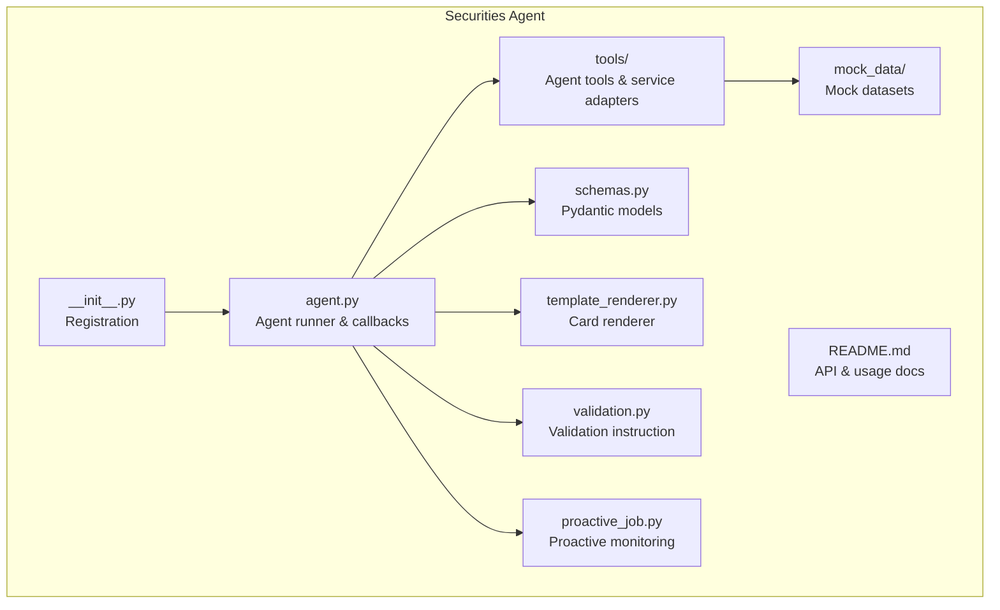
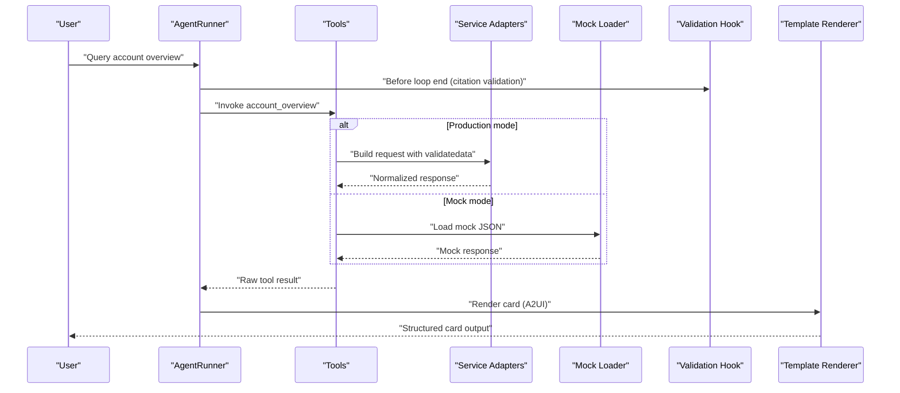
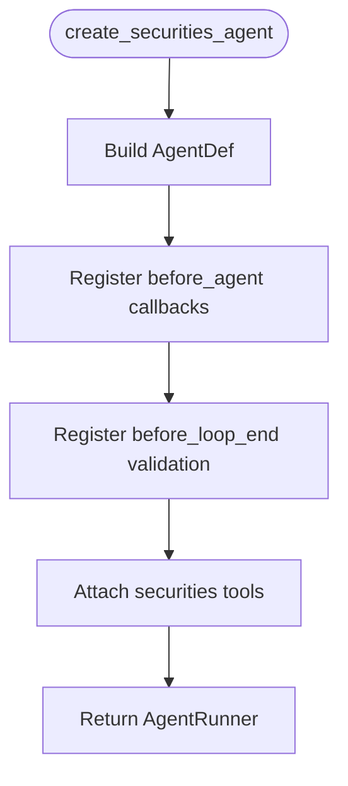
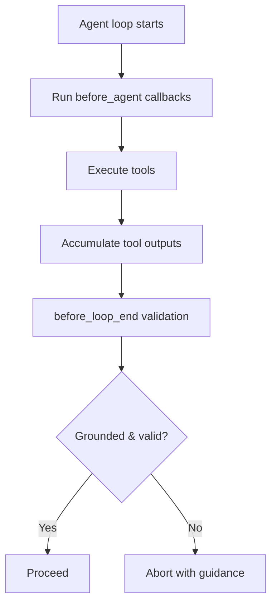
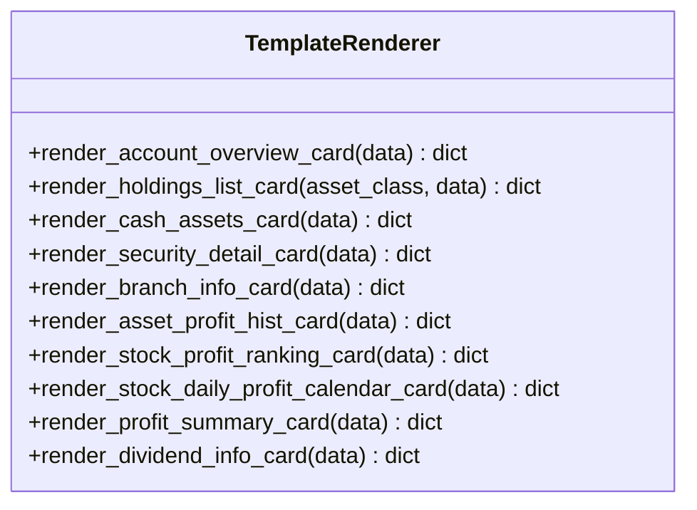
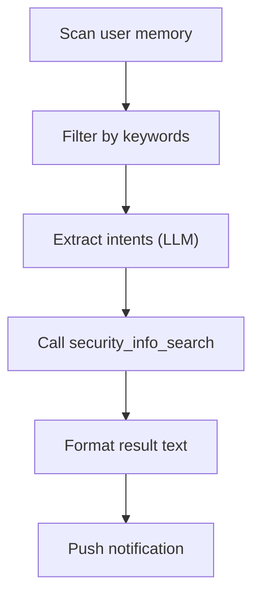
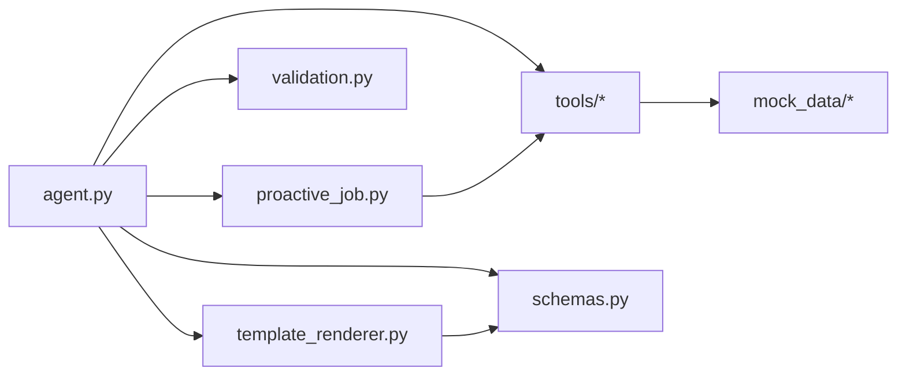

# Securities Agent

<cite>
**Referenced Files in This Document**
- [agent.py](file://src/ark_agentic/agents/securities/agent.py)
- [__init__.py](file://src/ark_agentic/agents/securities/__init__.py)
- [README.md](file://src/ark_agentic/agents/securities/README.md)
- [schemas.py](file://src/ark_agentic/agents/securities/schemas.py)
- [validation.py](file://src/ark_agentic/agents/securities/validation.py)
- [template_renderer.py](file://src/ark_agentic/agents/securities/template_renderer.py)
- [proactive_job.py](file://src/ark_agentic/agents/securities/proactive_job.py)
- [account_overview normal_user.json](file://src/ark_agentic/agents/securities/mock_data/account_overview/normal_user.json)
- [asset_profit_hist normal_user.json](file://src/ark_agentic/agents/securities/mock_data/asset_profit_hist/normal_user.json)
- [security_detail stock_510300.json](file://src/ark_agentic/agents/securities/mock_data/security_detail/stock_510300.json)
</cite>

## Table of Contents
1. [Introduction](#introduction)
2. [Project Structure](#project-structure)
3. [Core Components](#core-components)
4. [Architecture Overview](#architecture-overview)
5. [Detailed Component Analysis](#detailed-component-analysis)
6. [Dependency Analysis](#dependency-analysis)
7. [Performance Considerations](#performance-considerations)
8. [Troubleshooting Guide](#troubleshooting-guide)
9. [Conclusion](#conclusion)
10. [Appendices](#appendices)

## Introduction
The Securities Agent provides asset management capabilities for financial services and investment management workflows. It enables portfolio analysis, market data processing, and financial insights through a modular agent framework. The system integrates:
- Asset management tools for account overview, holdings, and profit analytics
- A robust mock data system for testing and development
- A validation framework ensuring data integrity and compliance
- A template rendering system for structured financial report generation
- A proactive job system for automated market monitoring and alerts
- A skill system covering asset overview, holdings analysis, profit analysis, and security details

## Project Structure
The Securities Agent resides under agents/securities and includes:
- Agent creation and registration
- Tools for financial data retrieval and presentation
- Mock datasets mirroring production API responses
- Data schemas for validation and rendering
- Template renderer for standardized card outputs
- Proactive job for market monitoring and alerting

**Diagram sources**
- [agent.py:1-100](file://src/ark_agentic/agents/securities/agent.py#L1-L100)
- [__init__.py:1-30](file://src/ark_agentic/agents/securities/__init__.py#L1-L30)
- [README.md:574-635](file://src/ark_agentic/agents/securities/README.md#L574-L635)

**Section sources**
- [README.md:574-635](file://src/ark_agentic/agents/securities/README.md#L574-L635)

## Core Components
- Agent runner and callbacks: Initializes the agent with skills, tools, and validation hooks. It injects context enrichment and authentication checks, and sets up citation validation via an entity trie loaded from CSV.
- Tools: Provide financial data retrieval (account overview, cash assets, holdings, security details, profit analytics) and a display card utility for rendering structured outputs.
- Mock data: Realistic JSON fixtures simulating production API responses for accounts, profits, and security details.
- Schemas: Pydantic models validating and normalizing raw API responses into standardized structures for downstream rendering and analysis.
- Template renderer: Converts normalized data into A2UI-compatible cards for UI rendering.
- Validation: Injects system instructions to constrain answers to verified facts and enforces grounding via a citation hook.
- Proactive job: Scans user memory for watch-list intents, queries real-time data, and generates actionable alerts.

**Section sources**
- [agent.py:41-100](file://src/ark_agentic/agents/securities/agent.py#L41-L100)
- [schemas.py:1-465](file://src/ark_agentic/agents/securities/schemas.py#L1-L465)
- [template_renderer.py:1-369](file://src/ark_agentic/agents/securities/template_renderer.py#L1-L369)
- [validation.py:1-22](file://src/ark_agentic/agents/securities/validation.py#L1-L22)
- [proactive_job.py:1-145](file://src/ark_agentic/agents/securities/proactive_job.py#L1-L145)

## Architecture Overview
The Securities Agent orchestrates a data pipeline from user requests to rendered financial insights:
- Context enrichment and authentication checks occur before agent execution.
- Tools fetch data from either production services or mock loaders.
- Field extraction normalizes raw responses into standardized structures.
- Templates render structured cards aligned with the UI protocol.
- Proactive jobs continuously monitor user interests and push alerts.

**Diagram sources**
- [agent.py:49-99](file://src/ark_agentic/agents/securities/agent.py#L49-L99)
- [template_renderer.py:16-70](file://src/ark_agentic/agents/securities/template_renderer.py#L16-L70)

## Detailed Component Analysis

### Agent Runner and Validation
- Creates a standard agent with skills and tools, enabling memory and dream features.
- Registers callbacks for context enrichment and authentication gating.
- Loads an entity trie from CSV to support grounding citations during validation.

**Diagram sources**
- [agent.py:72-100](file://src/ark_agentic/agents/securities/agent.py#L72-L100)

**Section sources**
- [agent.py:41-100](file://src/ark_agentic/agents/securities/agent.py#L41-L100)
- [validation.py:12-22](file://src/ark_agentic/agents/securities/validation.py#L12-L22)

### Mock Data System
- Provides realistic fixtures for account overview, asset profit history, and security details.
- Mirrors production API shapes for seamless switching between mock and production modes.

Examples:
- Normal user account overview fixture
- Profit history fixture with daily asset and profit series
- Security detail fixture for ETFs

**Section sources**
- [account_overview normal_user.json:1-103](file://src/ark_agentic/agents/securities/mock_data/account_overview/normal_user.json#L1-L103)
- [asset_profit_hist normal_user.json:1-35](file://src/ark_agentic/agents/securities/mock_data/asset_profit_hist/normal_user.json#L1-L35)
- [security_detail stock_510300.json:1-29](file://src/ark_agentic/agents/securities/mock_data/security_detail/stock_510300.json#L1-L29)

### Validation Framework
- Adds a system instruction to constrain responses to verified facts.
- Hooks into the agent lifecycle to enforce grounding and citation validation.

**Diagram sources**
- [validation.py:12-22](file://src/ark_agentic/agents/securities/validation.py#L12-L22)
- [agent.py:87-90](file://src/ark_agentic/agents/securities/agent.py#L87-L90)

**Section sources**
- [validation.py:1-22](file://src/ark_agentic/agents/securities/validation.py#L1-L22)
- [agent.py:85-90](file://src/ark_agentic/agents/securities/agent.py#L85-L90)

### Template Rendering System
- Renders standardized cards for account overview, holdings, cash assets, security details, branch info, profit curves, rankings, and dividend info.
- Ensures UI compatibility with the enterprise AGUI protocol.

**Diagram sources**
- [template_renderer.py:12-369](file://src/ark_agentic/agents/securities/template_renderer.py#L12-L369)

**Section sources**
- [template_renderer.py:1-369](file://src/ark_agentic/agents/securities/template_renderer.py#L1-L369)

### Proactive Job System
- Scans user memory for watch-list intents (keywords and LLM prompts).
- Queries real-time data via the security info search tool.
- Formats results into concise, actionable notifications.

**Diagram sources**
- [proactive_job.py:54-145](file://src/ark_agentic/agents/securities/proactive_job.py#L54-L145)

**Section sources**
- [proactive_job.py:1-145](file://src/ark_agentic/agents/securities/proactive_job.py#L1-L145)

### Skill System
- Skills define reusable workflows for asset overview, holdings analysis, and profit inquiry.
- Integrated with the agent’s skill router to guide conversational flows.

Note: Skill definitions are documented alongside the agent’s README and skills directory.

**Section sources**
- [README.md:631-634](file://src/ark_agentic/agents/securities/README.md#L631-L634)

## Dependency Analysis
The Securities Agent composes several subsystems with clear boundaries:
- Agent runner depends on tools, schemas, and validation hooks.
- Tools depend on service adapters or mock loaders.
- Schemas validate and normalize tool outputs.
- Template renderer consumes standardized data to produce UI cards.
- Proactive job depends on tools and memory scanning.

**Diagram sources**
- [agent.py:31-33](file://src/ark_agentic/agents/securities/agent.py#L31-L33)
- [README.md:588-631](file://src/ark_agentic/agents/securities/README.md#L588-L631)

**Section sources**
- [agent.py:31-33](file://src/ark_agentic/agents/securities/agent.py#L31-L33)
- [README.md:588-631](file://src/ark_agentic/agents/securities/README.md#L588-L631)

## Performance Considerations
- Large financial datasets: Normalize and validate early using schemas to reduce downstream processing overhead.
- Data caching: Cache normalized tool outputs keyed by session and tool name to avoid redundant calls.
- Streaming UI: Use SSE with the enterprise AGUI protocol to deliver incremental updates for long-running analytics.
- Mock vs production: Prefer mock mode for development to minimize external latency; ensure deterministic fixtures for reproducible tests.
- Compliance: Enforce validation hooks and grounding to prevent unverified claims; log tool calls and citations for audit trails.

## Troubleshooting Guide
Common issues and resolutions:
- Authentication gating: If login is required, the agent returns a UI component prompting authentication; ensure context includes required fields.
- Missing or invalid context: Verify that account type and login flag are present; the agent enriches context before execution.
- Tool availability: Confirm tools are registered and accessible; proactive jobs rely on the tool registry.
- Mock data mismatches: Validate mock fixtures align with expected API shapes; update fixtures when service schemas evolve.
- Validation failures: Responses constrained to verified facts; if grounding fails, refine prompts or provide clearer context.

**Section sources**
- [agent.py:53-69](file://src/ark_agentic/agents/securities/agent.py#L53-L69)
- [proactive_job.py:79-103](file://src/ark_agentic/agents/securities/proactive_job.py#L79-L103)

## Conclusion
The Securities Agent delivers a robust, modular framework for financial asset management. Its combination of validated data flows, standardized templates, proactive monitoring, and a comprehensive skill system supports both development and production-grade workflows. By leveraging mock datasets, strict validation, and streaming UI outputs, it ensures correctness, performance, and compliance for financial services.

## Appendices

### Practical Examples
- Financial data processing: Use tools to query account overview, holdings, and profit analytics; the agent normalizes outputs via schemas and renders A2UI cards.
- Mock service integration: Switch to mock mode to develop against realistic fixtures without external dependencies.
- Real-time market data handling: Proactive jobs scan user memory, query security info, and format concise alerts for watch-list items.

**Section sources**
- [README.md:46-270](file://src/ark_agentic/agents/securities/README.md#L46-L270)
- [proactive_job.py:74-145](file://src/ark_agentic/agents/securities/proactive_job.py#L74-L145)