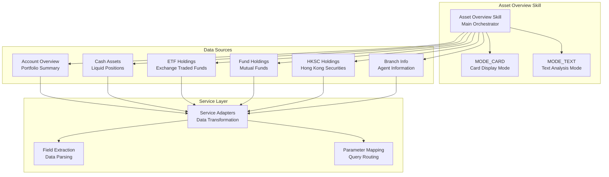
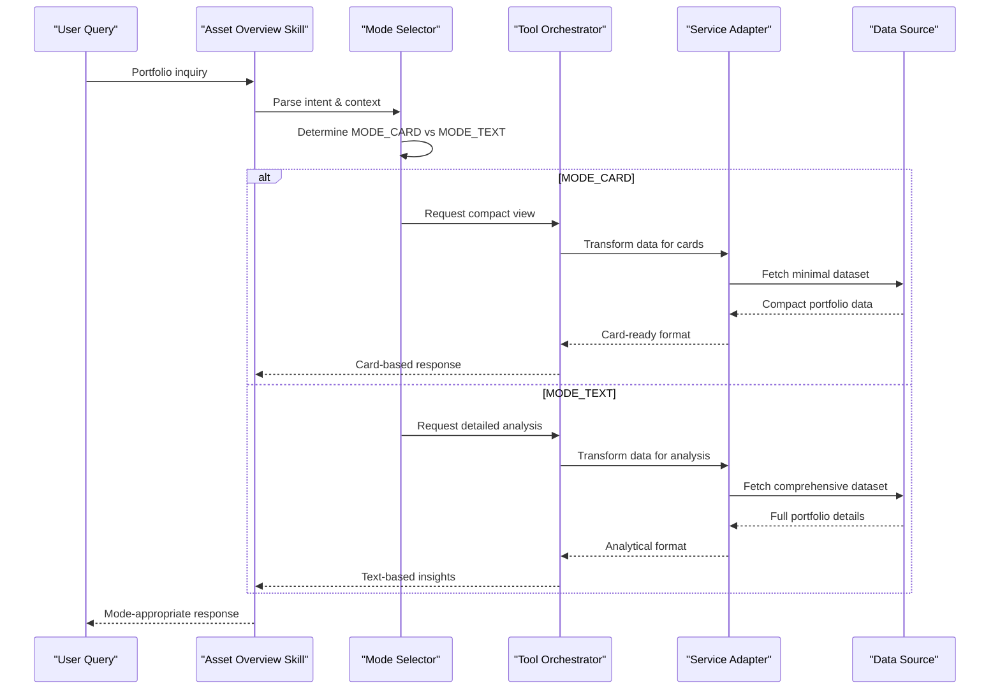
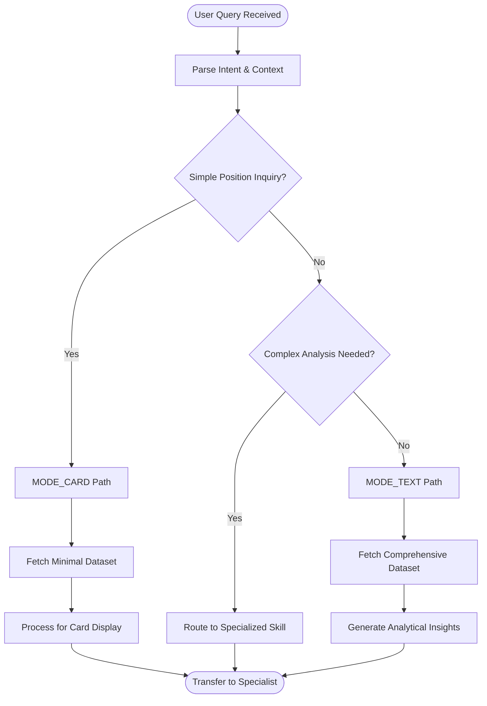
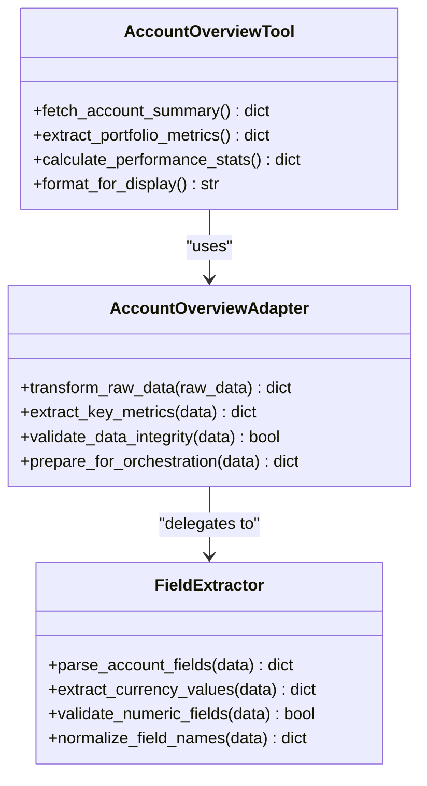
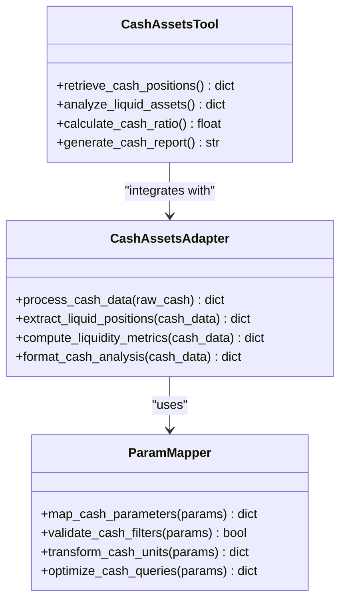
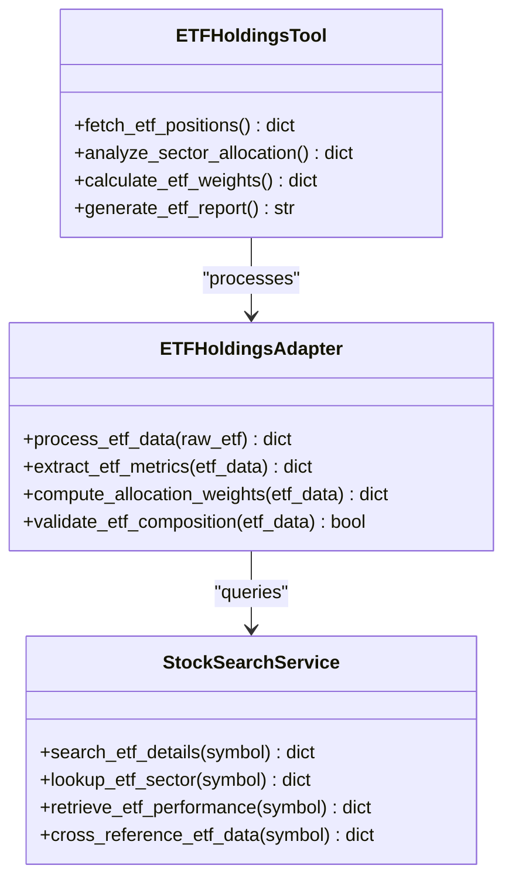
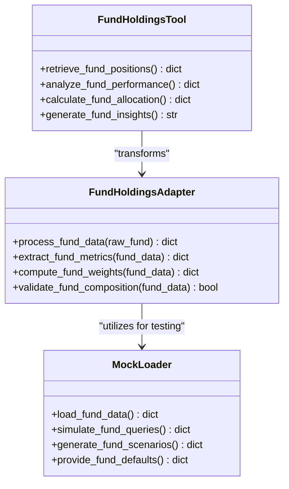
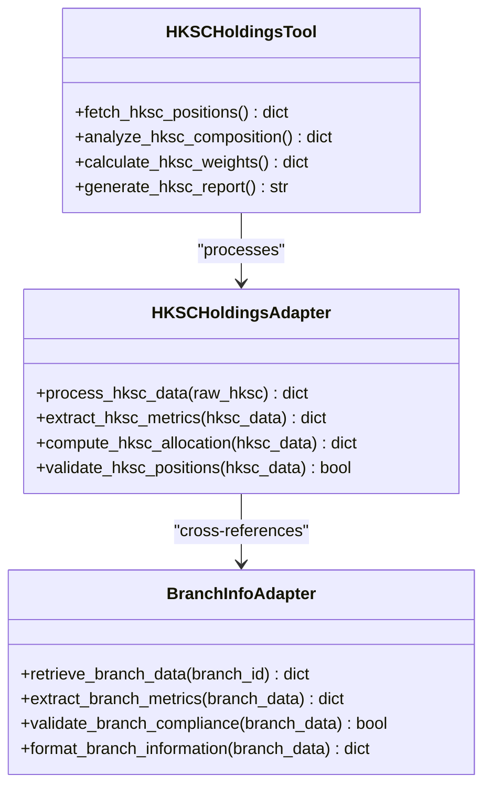
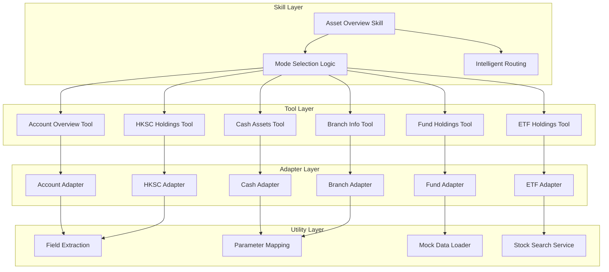

# Asset Overview Skill

<cite>
**Referenced Files in This Document**
- [SKILL.md](file://src/ark_agentic/agents/securities/skills/asset_overview/SKILL.md)
- [account_overview.py](file://src/ark_agentic/agents/securities/tools/agent/account_overview.py)
- [cash_assets.py](file://src/ark_agentic/agents/securities/tools/agent/cash_assets.py)
- [etf_holdings.py](file://src/ark_agentic/agents/securities/tools/agent/etf_holdings.py)
- [fund_holdings.py](file://src/ark_agentic/agents/securities/tools/agent/fund_holdings.py)
- [hksc_holdings.py](file://src/ark_agentic/agents/securities/tools/agent/hksc_holdings.py)
- [branch_info.py](file://src/ark_agentic/agents/securities/tools/agent/branch_info.py)
- [account_overview.py](file://src/ark_agentic/agents/securities/tools/service/adapters/account_overview.py)
- [cash_assets.py](file://src/ark_agentic/agents/securities/tools/service/adapters/cash_assets.py)
- [etf_holdings.py](file://src/ark_agentic/agents/securities/tools/service/adapters/etf_holdings.py)
- [fund_holdings.py](file://src/ark_agentic/agents/securities/tools/service/adapters/fund_holdings.py)
- [hksc_holdings.py](file://src/ark_agentic/agents/securities/tools/service/adapters/hksc_holdings.py)
- [branch_info.py](file://src/ark_agentic/agents/securities/tools/service/adapters/branch_info.py)
- [base.py](file://src/ark_agentic/agents/securities/tools/service/base.py)
- [field_extraction.py](file://src/ark_agentic/agents/securities/tools/service/field_extraction.py)
- [param_mapping.py](file://src/ark_agentic/agents/securities/tools/service/param_mapping.py)
- [stock_search_service.py](file://src/ark_agentic/agents/securities/tools/service/stock_search_service.py)
- [mock_loader.py](file://src/ark_agentic/agents/securities/tools/service/mock_loader.py)
- [mock_mode.py](file://src/ark_agentic/agents/securities/tools/service/mock_mode.py)
- [test_asset_overview_skill.py](file://tests/unit/skills/test_asset_overview_skill.py)
- [eval_asset_overview_static.py](file://tests/skills/asset_overview-workspace/eval_report.md)
</cite>

## Table of Contents
1. [Introduction](#introduction)
2. [Project Structure](#project-structure)
3. [Core Components](#core-components)
4. [Architecture Overview](#architecture-overview)
5. [Detailed Component Analysis](#detailed-component-analysis)
6. [Dependency Analysis](#dependency-analysis)
7. [Performance Considerations](#performance-considerations)
8. [Troubleshooting Guide](#troubleshooting-guide)
9. [Conclusion](#conclusion)
10. [Appendices](#appendices)

## Introduction
The Asset Overview skill provides a comprehensive account and portfolio analysis capability for securities customers. It consolidates multiple data sources to deliver both quick visual summaries and detailed analytical insights. The skill operates in two distinct modes: MODE_CARD for concise, card-based visual displays suitable for quick checks, and MODE_TEXT for in-depth analytical narratives that guide users through complex portfolio compositions and trends.

The skill serves as a central hub for portfolio intelligence, aggregating data from account_overview, cash_assets, etf_holdings, fund_holdings, and branch_info tools to present a unified view of customer financial positions. It handles sophisticated intent parsing to distinguish between simple position inquiries and complex analytical requests, automatically routing users to specialized skills when deeper domain expertise is required.

## Project Structure
The Asset Overview skill is organized within the securities agent framework, leveraging a modular architecture that separates concerns between presentation, data access, and business logic. The skill integrates seamlessly with the broader agent ecosystem while maintaining clear boundaries for specialized functionality.

**Diagram sources**
- [SKILL.md](file://src/ark_agentic/agents/securities/skills/asset_overview/SKILL.md)
- [account_overview.py](file://src/ark_agentic/agents/securities/tools/agent/account_overview.py)
- [cash_assets.py](file://src/ark_agentic/agents/securities/tools/agent/cash_assets.py)
- [etf_holdings.py](file://src/ark_agentic/agents/securities/tools/agent/etf_holdings.py)
- [fund_holdings.py](file://src/ark_agentic/agents/securities/tools/agent/fund_holdings.py)
- [hksc_holdings.py](file://src/ark_agentic/agents/securities/tools/agent/hksc_holdings.py)
- [branch_info.py](file://src/ark_agentic/agents/securities/tools/agent/branch_info.py)

**Section sources**
- [SKILL.md](file://src/ark_agentic/agents/securities/skills/asset_overview/SKILL.md)

## Core Components
The Asset Overview skill comprises several interconnected components that work together to deliver comprehensive portfolio analysis:

### Primary Responsibilities
- **Total Asset Overview**: Consolidates all account positions into a unified portfolio summary
- **Cash Status Analysis**: Provides detailed breakdown of liquid assets and cash positions
- **Holdings Distribution**: Analyzes portfolio composition across ETFs, mutual funds, and Hong Kong securities
- **Account Information Retrieval**: Gathers comprehensive customer account details and branch information

### Dual Mode Operation
The skill supports two distinct operational modes designed for different user needs and contexts:

**MODE_CARD**: Optimized for quick visual assessment and immediate understanding of portfolio health. This mode presents information in digestible card-based formats ideal for dashboard displays and rapid decision-making scenarios.

**MODE_TEXT**: Designed for in-depth analytical insights and comprehensive portfolio analysis. This mode provides detailed narrative explanations, trend analysis, and strategic recommendations based on portfolio composition and market conditions.

### Tool Integration Architecture
The skill orchestrates multiple specialized tools through a sophisticated adapter pattern that ensures clean separation of concerns and maintainable code architecture.

**Section sources**
- [SKILL.md](file://src/ark_agentic/agents/securities/skills/asset_overview/SKILL.md)

## Architecture Overview
The Asset Overview skill implements a layered architecture that promotes modularity, testability, and maintainability. The architecture follows clear separation of concerns with dedicated layers for presentation, orchestration, data access, and service integration.

**Diagram sources**
- [SKILL.md](file://src/ark_agentic/agents/securities/skills/asset_overview/SKILL.md)
- [base.py](file://src/ark_agentic/agents/securities/tools/service/base.py)
- [field_extraction.py](file://src/ark_agentic/agents/securities/tools/service/field_extraction.py)
- [param_mapping.py](file://src/ark_agentic/agents/securities/tools/service/param_mapping.py)

### Intent Parsing and Routing Logic
The skill employs sophisticated intent parsing capabilities to distinguish between simple position inquiries and complex analytical requests. The routing mechanism automatically directs users to specialized skills when their requests exceed the scope of basic portfolio analysis.

**Diagram sources**
- [SKILL.md](file://src/ark_agentic/agents/securities/skills/asset_overview/SKILL.md)
- [field_extraction.py](file://src/ark_agentic/agents/securities/tools/service/field_extraction.py)

## Detailed Component Analysis

### Account Overview Integration
The account_overview tool serves as the primary data source for consolidated portfolio information. It provides comprehensive account summaries including total assets, day change, and portfolio composition metrics.

**Diagram sources**
- [account_overview.py](file://src/ark_agentic/agents/securities/tools/agent/account_overview.py)
- [account_overview.py](file://src/ark_agentic/agents/securities/tools/service/adapters/account_overview.py)
- [field_extraction.py](file://src/ark_agentic/agents/securities/tools/service/field_extraction.py)

### Cash Assets Analysis
The cash_assets tool provides detailed analysis of liquid positions and cash availability within customer portfolios. It supports both current cash balances and historical cash flow analysis.

**Diagram sources**
- [cash_assets.py](file://src/ark_agentic/agents/securities/tools/agent/cash_assets.py)
- [cash_assets.py](file://src/ark_agentic/agents/securities/tools/service/adapters/cash_assets.py)
- [param_mapping.py](file://src/ark_agentic/agents/securities/tools/service/param_mapping.py)

### ETF Holdings Distribution
The etf_holdings tool analyzes exchange-traded fund positions within customer portfolios, providing insights into sector allocation and diversification patterns.

**Diagram sources**
- [etf_holdings.py](file://src/ark_agentic/agents/securities/tools/agent/etf_holdings.py)
- [etf_holdings.py](file://src/ark_agentic/agents/securities/tools/service/adapters/etf_holdings.py)
- [stock_search_service.py](file://src/ark_agentic/agents/securities/tools/service/stock_search_service.py)

### Fund Holdings Analysis
The fund_holdings tool provides comprehensive analysis of mutual fund positions, including performance metrics and portfolio composition insights.

**Diagram sources**
- [fund_holdings.py](file://src/ark_agentic/agents/securities/tools/agent/fund_holdings.py)
- [fund_holdings.py](file://src/ark_agentic/agents/securities/tools/service/adapters/fund_holdings.py)
- [mock_loader.py](file://src/ark_agentic/agents/securities/tools/service/mock_loader.py)

### HKSC Holdings Integration
The hksc_holdings tool focuses specifically on Hong Kong Securities and Exchange Commission-regulated positions within customer portfolios.

**Diagram sources**
- [hksc_holdings.py](file://src/ark_agentic/agents/securities/tools/agent/hksc_holdings.py)
- [hksc_holdings.py](file://src/ark_agentic/agents/securities/tools/service/adapters/hksc_holdings.py)
- [branch_info.py](file://src/ark_agentic/agents/securities/tools/service/adapters/branch_info.py)

### Branch Information Service
The branch_info tool provides essential contact and service information for customer branch relationships, supporting personalized service recommendations.

**Section sources**
- [branch_info.py](file://src/ark_agentic/agents/securities/tools/agent/branch_info.py)
- [branch_info.py](file://src/ark_agentic/agents/securities/tools/service/adapters/branch_info.py)

## Dependency Analysis
The Asset Overview skill exhibits well-structured dependencies that promote maintainability and testability. The dependency graph reveals clear separation between presentation logic, data access layers, and business logic components.

**Diagram sources**
- [SKILL.md](file://src/ark_agentic/agents/securities/skills/asset_overview/SKILL.md)
- [base.py](file://src/ark_agentic/agents/securities/tools/service/base.py)
- [field_extraction.py](file://src/ark_agentic/agents/securities/tools/service/field_extraction.py)
- [param_mapping.py](file://src/ark_agentic/agents/securities/tools/service/param_mapping.py)
- [mock_loader.py](file://src/ark_agentic/agents/securities/tools/service/mock_loader.py)
- [stock_search_service.py](file://src/ark_agentic/agents/securities/tools/service/stock_search_service.py)

### Coupling and Cohesion Analysis
The skill demonstrates excellent design principles with low coupling between major components and high cohesion within specialized modules. Each tool maintains clear responsibility boundaries, facilitating independent development and testing.

**Section sources**
- [SKILL.md](file://src/ark_agentic/agents/securities/skills/asset_overview/SKILL.md)
- [base.py](file://src/ark_agentic/agents/securities/tools/service/base.py)

## Performance Considerations
The Asset Overview skill is designed with performance optimization as a core consideration. Several mechanisms ensure efficient operation under various load conditions and data complexity scenarios.

### Data Fetching Strategies
The skill implements intelligent data fetching strategies that minimize unnecessary API calls and optimize response times. It employs selective data loading based on the requested mode and complexity level.

### Caching Mechanisms
The service layer incorporates caching strategies for frequently accessed data points, reducing latency for repeated queries and improving overall user experience during portfolio monitoring sessions.

### Parallel Processing
For complex analytical requests, the skill leverages parallel processing capabilities to fetch and process multiple data streams concurrently, significantly reducing response times for comprehensive portfolio analyses.

## Troubleshooting Guide
The Asset Overview skill includes comprehensive error handling and diagnostic capabilities to ensure reliable operation across diverse scenarios.

### Common Issues and Resolutions
**Data Loading Failures**: The skill implements robust fallback mechanisms and graceful degradation when individual data sources become unavailable. It prioritizes partial information delivery over complete failure.

**Mode Selection Errors**: When intent parsing fails to clearly distinguish between simple and complex requests, the skill defaults to a conservative approach that provides basic information while suggesting specialized assistance for complex analyses.

**Integration Issues**: The adapter pattern provides clear isolation points for diagnosing integration problems, allowing developers to identify whether issues originate in data transformation, parameter mapping, or external service connectivity.

### Diagnostic Tools
The skill includes built-in diagnostic capabilities that help identify performance bottlenecks, data quality issues, and integration failures. These tools facilitate rapid problem resolution and system maintenance.

**Section sources**
- [mock_mode.py](file://src/ark_agentic/agents/securities/tools/service/mock_mode.py)
- [test_asset_overview_skill.py](file://tests/unit/skills/test_asset_overview_skill.py)

## Conclusion
The Asset Overview skill represents a sophisticated implementation of intelligent portfolio analysis that successfully balances user accessibility with analytical depth. Its dual-mode architecture, comprehensive tool integration, and intelligent routing capabilities make it an essential component of the securities agent ecosystem.

The skill's design demonstrates excellent separation of concerns, maintainable architecture, and robust error handling while providing valuable insights into customer portfolio composition and performance. Its ability to automatically route users to specialized skills when appropriate ensures that complex analytical needs are met with expert-level domain knowledge.

Through continuous testing and validation, the skill maintains high reliability standards while remaining adaptable to evolving customer needs and market conditions. The comprehensive documentation and testing infrastructure support ongoing development and enhancement of portfolio analysis capabilities.

## Appendices

### Practical Examples and Use Cases
The skill handles a wide range of user queries from simple position checks to complex analytical requests, with clear examples documented in the evaluation materials.

### Output Formatting Specifications
Both MODE_CARD and MODE_TEXT outputs follow standardized formatting guidelines that ensure consistency across different presentation contexts while maintaining readability and actionable insights.

### Integration Guidelines
The skill's modular architecture facilitates easy integration with other agent components and supports extension for additional data sources and analytical capabilities as business requirements evolve.