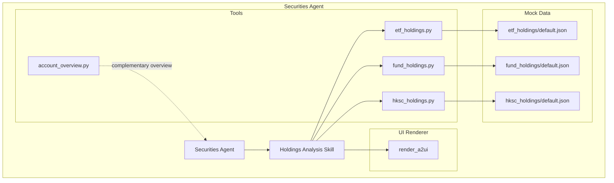
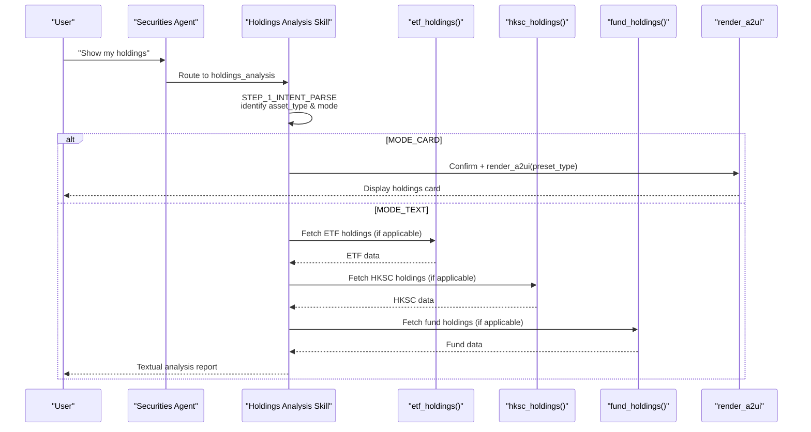
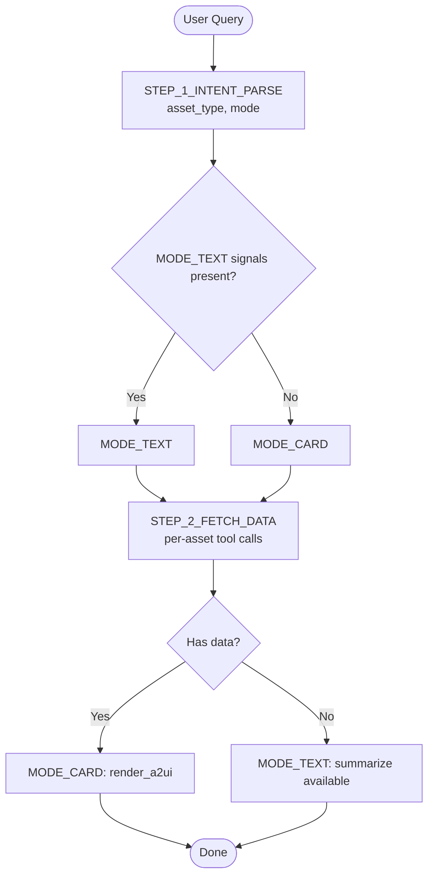
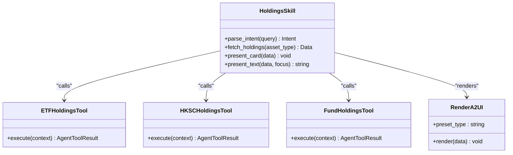
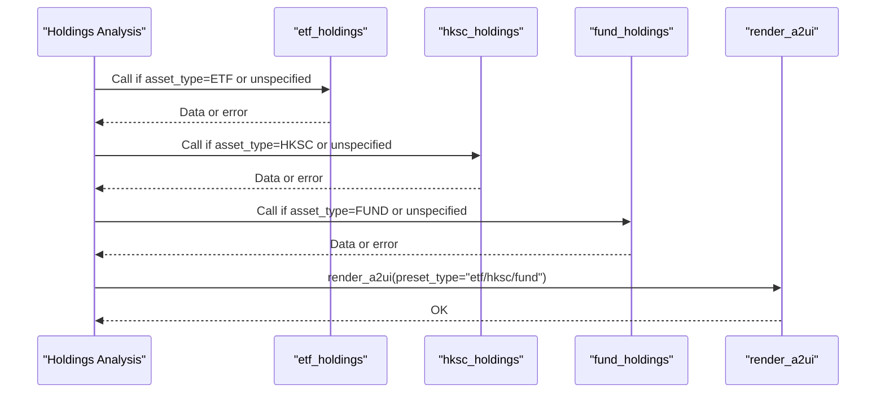
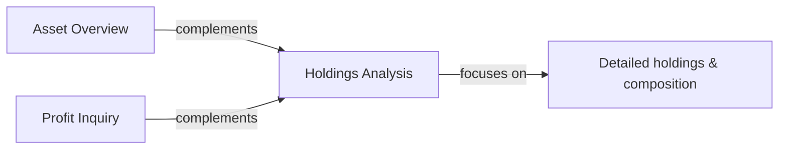
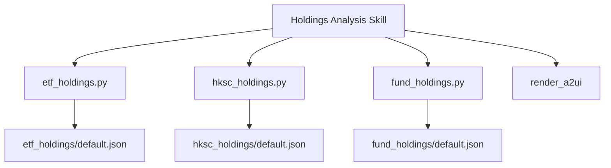

# Holdings Analysis Skill

<cite>
**Referenced Files in This Document**
- [SKILL.md](file://src/ark_agentic/agents/securities/skills/holdings_analysis/SKILL.md)
- [etf_holdings.py](file://src/ark_agentic/agents/securities/tools/agent/etf_holdings.py)
- [hksc_holdings.py](file://src/ark_agentic/agents/securities/tools/agent/hksc_holdings.py)
- [fund_holdings.py](file://src/ark_agentic/agents/securities/tools/agent/fund_holdings.py)
- [account_overview.py](file://src/ark_agentic/agents/securities/tools/agent/account_overview.py)
- [default.json (ETF)](file://src/ark_agentic/agents/securities/mock_data/etf_holdings/default.json)
- [default.json (Fund)](file://src/ark_agentic/agents/securities/mock_data/fund_holdings/default.json)
- [default.json (HKSC)](file://src/ark_agentic/agents/securities/mock_data/hksc_holdings/default.json)
</cite>

## Table of Contents
1. [Introduction](#introduction)
2. [Project Structure](#project-structure)
3. [Core Components](#core-components)
4. [Architecture Overview](#architecture-overview)
5. [Detailed Component Analysis](#detailed-component-analysis)
6. [Dependency Analysis](#dependency-analysis)
7. [Performance Considerations](#performance-considerations)
8. [Troubleshooting Guide](#troubleshooting-guide)
9. [Conclusion](#conclusion)

## Introduction
The Holdings Analysis skill provides comprehensive holdings breakdown and portfolio composition analysis for ETF, Hong Kong Stock Connect (HKSC), and fund products. It evaluates individual security positions, aggregates portfolio allocations, and delivers insights via two presentation modes: interactive UI cards and textual analysis reports. The skill integrates tightly with the Securities Agent ecosystem, complementing asset overview capabilities and maintaining strict separation of concerns with other specialized skills.

## Project Structure
The Holdings Analysis skill resides within the Securities Agent’s skills and tools modules. It orchestrates three dedicated data tools (ETF holdings, HKSC holdings, fund holdings) and a UI rendering tool to present results. Mock data is provided for testing and demonstration.

**Diagram sources**
- [SKILL.md:1-243](file://src/ark_agentic/agents/securities/skills/holdings_analysis/SKILL.md#L1-L243)
- [etf_holdings.py:1-99](file://src/ark_agentic/agents/securities/tools/agent/etf_holdings.py#L1-L99)
- [hksc_holdings.py:1-105](file://src/ark_agentic/agents/securities/tools/agent/hksc_holdings.py#L1-L105)
- [fund_holdings.py:1-104](file://src/ark_agentic/agents/securities/tools/agent/fund_holdings.py#L1-L104)
- [account_overview.py:1-108](file://src/ark_agentic/agents/securities/tools/agent/account_overview.py#L1-L108)
- [default.json (ETF):1-65](file://src/ark_agentic/agents/securities/mock_data/etf_holdings/default.json#L1-L65)
- [default.json (Fund):1-26](file://src/ark_agentic/agents/securities/mock_data/fund_holdings/default.json#L1-L26)
- [default.json (HKSC):1-58](file://src/ark_agentic/agents/securities/mock_data/hksc_holdings/default.json#L1-L58)

**Section sources**
- [SKILL.md:1-243](file://src/ark_agentic/agents/securities/skills/holdings_analysis/SKILL.md#L1-L243)
- [etf_holdings.py:1-99](file://src/ark_agentic/agents/securities/tools/agent/etf_holdings.py#L1-L99)
- [hksc_holdings.py:1-105](file://src/ark_agentic/agents/securities/tools/agent/hksc_holdings.py#L1-L105)
- [fund_holdings.py:1-104](file://src/ark_agentic/agents/securities/tools/agent/fund_holdings.py#L1-L104)
- [account_overview.py:1-108](file://src/ark_agentic/agents/securities/tools/agent/account_overview.py#L1-L108)

## Core Components
- Holdings Analysis Skill: Orchestrates intent parsing, data fetching, and presentation decisions between MODE_CARD (UI card) and MODE_TEXT (textual analysis).
- Data Tools:
  - ETF holdings tool: Retrieves ETF position details including quantity, market value, cost, daily P&L, and total portfolio metrics.
  - HKSC holdings tool: Retrieves HKEX connect positions, valuation, daily P&L, and summary statistics.
  - Fund holdings tool: Retrieves fund product holdings, market value, cost, profit/loss, and today’s P&L.
- UI Rendering: Uses render_a2ui to present structured, user-friendly cards aligned with preset extractors.
- Mock Data: Provides realistic sample payloads for ETF, HKSC, and fund holdings to support development and testing.

Key outputs:
- MODE_CARD: Confirmation message followed by a rendered UI card.
- MODE_TEXT: Concise Markdown report (≤200 characters) covering per-position details, totals, and distribution insights.

**Section sources**
- [SKILL.md:19-243](file://src/ark_agentic/agents/securities/skills/holdings_analysis/SKILL.md#L19-L243)
- [etf_holdings.py:46-99](file://src/ark_agentic/agents/securities/tools/agent/etf_holdings.py#L46-L99)
- [hksc_holdings.py:46-105](file://src/ark_agentic/agents/securities/tools/agent/hksc_holdings.py#L46-L105)
- [fund_holdings.py:46-104](file://src/ark_agentic/agents/securities/tools/agent/fund_holdings.py#L46-L104)

## Architecture Overview
The skill follows a deterministic flow: parse user intent, fetch targeted or aggregated holdings data, and render results in the appropriate format. It enforces strict ordering and avoids concurrent tool calls to ensure accurate, real-time data retrieval.

**Diagram sources**
- [SKILL.md:127-196](file://src/ark_agentic/agents/securities/skills/holdings_analysis/SKILL.md#L127-L196)
- [etf_holdings.py:62-99](file://src/ark_agentic/agents/securities/tools/agent/etf_holdings.py#L62-L99)
- [hksc_holdings.py:62-105](file://src/ark_agentic/agents/securities/tools/agent/hksc_holdings.py#L62-L105)
- [fund_holdings.py:62-104](file://src/ark_agentic/agents/securities/tools/agent/fund_holdings.py#L62-L104)

## Detailed Component Analysis

### Intent Parsing and Routing
- Asset type classification: ETF, HKSC, or FUND.
- Presentation mode selection:
  - MODE_CARD: Default when no explicit analysis signals are detected.
  - MODE_TEXT: Triggered by keywords related to P&L, comparison, distribution, or explicit requests for text analysis.
- Routing boundary: Queries about total assets or top performers are routed to asset overview and profit inquiry skills respectively.

**Diagram sources**
- [SKILL.md:39-103](file://src/ark_agentic/agents/securities/skills/holdings_analysis/SKILL.md#L39-L103)

**Section sources**
- [SKILL.md:39-103](file://src/ark_agentic/agents/securities/skills/holdings_analysis/SKILL.md#L39-L103)

### Data Aggregation and Presentation Formats
- MODE_CARD:
  - Confirmation message (≤30 characters).
  - render_a2ui invoked with preset_type matching the last successful tool call.
  - No numeric summaries or raw JSON output.
- MODE_TEXT:
  - Report length ≤200 characters, Markdown-formatted.
  - Content tailored to user intent:
    - P&L focus: per-position name, quantity/market value, daily P&L, total P&L.
    - Distribution focus: category totals and percentages (ETF/HKSC/Fund).
    - Mixed focus: combination plus a concise observation.

**Diagram sources**
- [SKILL.md:106-225](file://src/ark_agentic/agents/securities/skills/holdings_analysis/SKILL.md#L106-L225)
- [etf_holdings.py:46-99](file://src/ark_agentic/agents/securities/tools/agent/etf_holdings.py#L46-L99)
- [hksc_holdings.py:46-105](file://src/ark_agentic/agents/securities/tools/agent/hksc_holdings.py#L46-L105)
- [fund_holdings.py:46-104](file://src/ark_agentic/agents/securities/tools/agent/fund_holdings.py#L46-L104)

**Section sources**
- [SKILL.md:106-225](file://src/ark_agentic/agents/securities/skills/holdings_analysis/SKILL.md#L106-L225)

### Tool Contracts and Execution Patterns
- Required tools:
  - etf_holdings
  - hksc_holdings
  - fund_holdings
  - render_a2ui
- Execution order:
  - For MODE_CARD: render_a2ui must follow the corresponding successful data tool call.
  - For MODE_TEXT: fetch data sequentially by asset type; never concurrently.
  - Real-time retrieval: disallow historical data reuse; always call tools fresh.
- Special handling:
  - Two-way account types: normal/margin are accepted for compatibility, but certain tools return explicit unsupported scenarios for margin accounts.

**Diagram sources**
- [SKILL.md:108-163](file://src/ark_agentic/agents/securities/skills/holdings_analysis/SKILL.md#L108-L163)
- [etf_holdings.py:62-99](file://src/ark_agentic/agents/securities/tools/agent/etf_holdings.py#L62-L99)
- [hksc_holdings.py:62-105](file://src/ark_agentic/agents/securities/tools/agent/hksc_holdings.py#L62-L105)
- [fund_holdings.py:62-104](file://src/ark_agentic/agents/securities/tools/agent/fund_holdings.py#L62-L104)

**Section sources**
- [SKILL.md:108-163](file://src/ark_agentic/agents/securities/skills/holdings_analysis/SKILL.md#L108-L163)

### Analytical Frameworks and Position Evaluation
- Per-position evaluation:
  - Name, quantity/holding units, current market value, cost basis, daily P&L/daily P&L percentage.
- Portfolio composition:
  - Aggregate totals per asset class (ETF/HKSC/Fund).
  - Percentage contribution to total portfolio value.
- Observational insights:
  - Summarize top contributors, recent movers, or divergences from expectations.

These frameworks align with the MODE_TEXT outputs and ensure actionable, objective insights without investment advice.

**Section sources**
- [SKILL.md:180-225](file://src/ark_agentic/agents/securities/skills/holdings_analysis/SKILL.md#L180-L225)

### Example User Queries and Triggers
- MODE_CARD triggers (no explicit analysis signals):
  - “My ETF”
  - “Show HKSC holdings”
  - “Check fund positions”
- MODE_TEXT triggers (explicit analysis signals):
  - “How is my fund performing?”
  - “How much did HKSC gain today?”
  - “Which ETF is doing best?”

These examples reflect the intent schema and keyword-based mode selection.

**Section sources**
- [SKILL.md:74-94](file://src/ark_agentic/agents/securities/skills/holdings_analysis/SKILL.md#L74-L94)

### Complementary Roles and Ecosystem Integration
- Asset Overview: Provides total assets, cash, and broad account metrics; distinct from holdings detail.
- Profit Inquiry: Answers comparative questions like “which fund gained most”; distinct from detailed position breakdown.
- Holdings Analysis: Focused on granular holdings and composition insights, integrating with render_a2ui for rich UI experiences.

**Diagram sources**
- [SKILL.md:95-103](file://src/ark_agentic/agents/securities/skills/holdings_analysis/SKILL.md#L95-L103)
- [account_overview.py:57-108](file://src/ark_agentic/agents/securities/tools/agent/account_overview.py#L57-L108)

**Section sources**
- [SKILL.md:95-103](file://src/ark_agentic/agents/securities/skills/holdings_analysis/SKILL.md#L95-L103)
- [account_overview.py:57-108](file://src/ark_agentic/agents/securities/tools/agent/account_overview.py#L57-L108)

## Dependency Analysis
- Internal dependencies:
  - Holdings Analysis skill depends on three agent tools and the UI renderer.
  - Tools share a common context extraction pattern and rely on service adapters for data retrieval.
- External dependencies:
  - Mock data files provide realistic payloads for development and testing.
- Coupling and cohesion:
  - High cohesion within the skill around intent-to-presentation logic.
  - Loose coupling via standardized tool contracts and render_a2ui presets.

**Diagram sources**
- [SKILL.md:108-124](file://src/ark_agentic/agents/securities/skills/holdings_analysis/SKILL.md#L108-L124)
- [etf_holdings.py:29-99](file://src/ark_agentic/agents/securities/tools/agent/etf_holdings.py#L29-L99)
- [hksc_holdings.py:29-105](file://src/ark_agentic/agents/securities/tools/agent/hksc_holdings.py#L29-L105)
- [fund_holdings.py:29-104](file://src/ark_agentic/agents/securities/tools/agent/fund_holdings.py#L29-L104)
- [default.json (ETF):1-65](file://src/ark_agentic/agents/securities/mock_data/etf_holdings/default.json#L1-L65)
- [default.json (Fund):1-26](file://src/ark_agentic/agents/securities/mock_data/fund_holdings/default.json#L1-L26)
- [default.json (HKSC):1-58](file://src/ark_agentic/agents/securities/mock_data/hksc_holdings/default.json#L1-L58)

**Section sources**
- [SKILL.md:108-124](file://src/ark_agentic/agents/securities/skills/holdings_analysis/SKILL.md#L108-L124)

## Performance Considerations
- Sequential tool calls: Prevent concurrency to avoid inconsistent snapshots and reduce load.
- Real-time retrieval: Enforce fresh data calls to ensure accuracy and mitigate stale cache risks.
- Output size limits: MODE_TEXT caps at ≤200 characters; MODE_CARD avoids numeric summaries to prevent verbose text.
- UI rendering: Use render_a2ui presets to minimize client-side formatting overhead.

[No sources needed since this section provides general guidance]

## Troubleshooting Guide
Common scenarios and resolutions:
- Tool unavailable: Prompt user to retry later.
- Empty holdings: Inform “currently no holdings.”
- Partial failures: Display available data and indicate limitations.
- Margin account restrictions: Certain tools return explicit unsupported messages; render a UI card explaining limitations.

Operational checks:
- Verify context parameter precedence (user:* keys override bare keys).
- Ensure render_a2ui is called only after successful data tool execution.
- Validate asset_type and mode routing boundaries to avoid off-topic queries.

**Section sources**
- [SKILL.md:227-243](file://src/ark_agentic/agents/securities/skills/holdings_analysis/SKILL.md#L227-L243)
- [etf_holdings.py:78-99](file://src/ark_agentic/agents/securities/tools/agent/etf_holdings.py#L78-L99)
- [hksc_holdings.py:78-105](file://src/ark_agentic/agents/securities/tools/agent/hksc_holdings.py#L78-L105)
- [fund_holdings.py:78-104](file://src/ark_agentic/agents/securities/tools/agent/fund_holdings.py#L78-L104)

## Conclusion
The Holdings Analysis skill delivers precise, real-time insights into ETF, HKSC, and fund holdings through a robust orchestration of tools and UI rendering. By enforcing clear intent parsing, strict execution order, and distinct presentation modes, it complements broader asset overview and profit inquiry capabilities while maintaining high standards for accuracy, safety, and user experience.