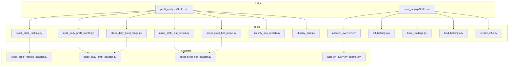
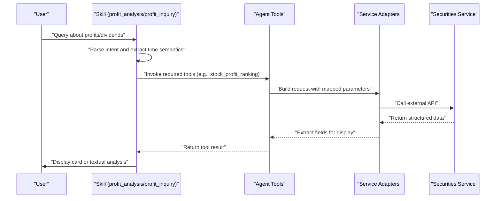
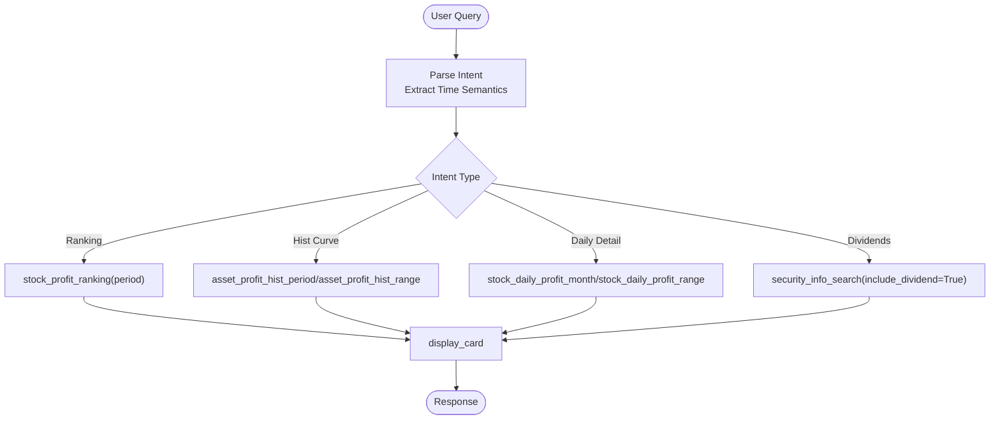
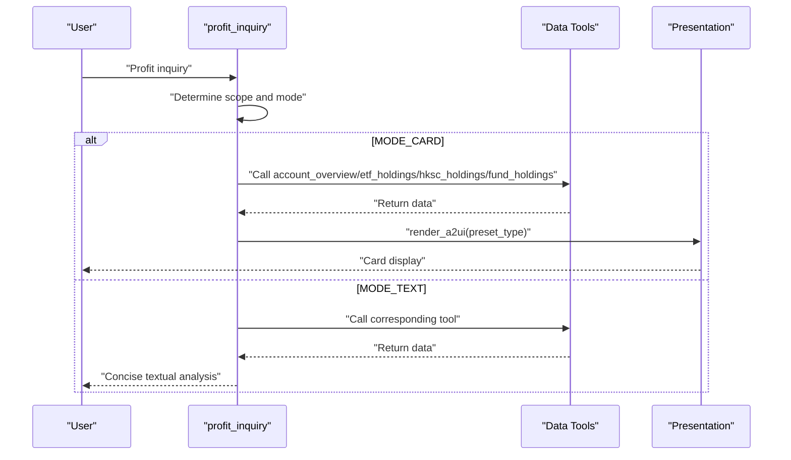
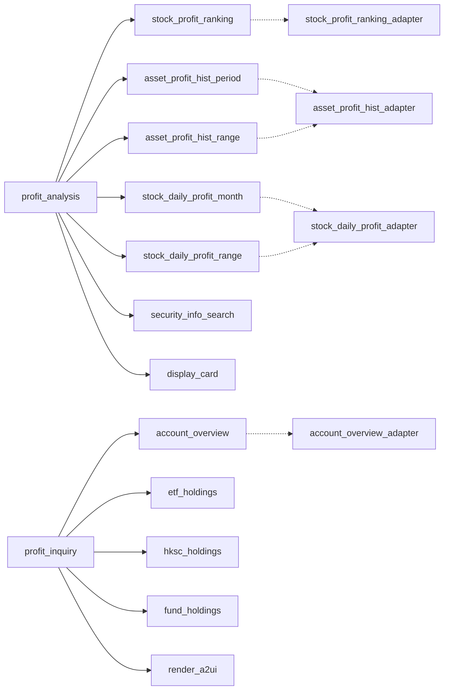

# Profit Analysis Skill

<cite>
**Referenced Files in This Document**
- [profit_analysis/SKILL.md](file://src/ark_agentic/agents/securities/skills/profit_analysis/SKILL.md)
- [profit_inquiry/SKILL.md](file://src/ark_agentic/agents/securities/skills/profit_inquiry/SKILL.md)
- [README.md](file://src/ark_agentic/agents/securities/README.md)
- [stock_profit_ranking.py](file://src/ark_agentic/agents/securities/tools/agent/stock_profit_ranking.py)
- [asset_profit_hist_period.py](file://src/ark_agentic/agents/securities/tools/agent/asset_profit_hist_period.py)
- [asset_profit_hist_range.py](file://src/ark_agentic/agents/securities/tools/agent/asset_profit_hist_range.py)
- [stock_daily_profit_month.py](file://src/ark_agentic/agents/securities/tools/agent/stock_daily_profit_month.py)
- [stock_daily_profit_range.py](file://src/ark_agentic/agents/securities/tools/agent/stock_daily_profit_range.py)
- [security_info_search.py](file://src/ark_agentic/agents/securities/tools/agent/security_info_search.py)
- [display_card.py](file://src/ark_agentic/agents/securities/tools/agent/display_card.py)
- [account_overview.py](file://src/ark_agentic/agents/securities/tools/agent/account_overview.py)
- [etf_holdings.py](file://src/ark_agentic/agents/securities/tools/agent/etf_holdings.py)
- [hksc_holdings.py](file://src/ark_agentic/agents/securities/tools/agent/hksc_holdings.py)
- [fund_holdings.py](file://src/ark_agentic/agents/securities/tools/agent/fund_holdings.py)
- [render_a2ui.py](file://src/ark_agentic/agents/securities/tools/agent/render_a2ui.py)
- [stock_profit_ranking_adapter.py](file://src/ark_agentic/agents/securities/tools/service/adapters/stock_profit_ranking.py)
- [stock_daily_profit_adapter.py](file://src/ark_agentic/agents/securities/tools/service/adapters/stock_daily_profit.py)
- [asset_profit_hist_adapter.py](file://src/ark_agentic/agents/securities/tools/service/adapters/asset_profit_hist.py)
- [account_overview_adapter.py](file://src/ark_agentic/agents/securities/tools/service/adapters/account_overview.py)
</cite>

## Table of Contents
1. [Introduction](#introduction)
2. [Project Structure](#project-structure)
3. [Core Components](#core-components)
4. [Architecture Overview](#architecture-overview)
5. [Detailed Component Analysis](#detailed-component-analysis)
6. [Dependency Analysis](#dependency-analysis)
7. [Performance Considerations](#performance-considerations)
8. [Troubleshooting Guide](#troubleshooting-guide)
9. [Conclusion](#conclusion)

## Introduction
This document provides comprehensive documentation for the Profit Analysis skill suite within the securities domain. It focuses on performance metrics calculation, earnings evaluation, and portfolio insights. The skill integrates with profit-related data sources to deliver actionable analytics for:
- Profit and loss scenario analysis
- Returns computation across predefined and custom time periods
- Daily profit detail views for specific months or ranges
- Profit ranking across holdings
- Dividend event queries for currently held securities

It also explains the integration with underlying tools, calculation methodologies, and presentation formats for performance reporting. Examples of user queries and analytical approaches are included, along with the skill's relationship to broader securities analysis capabilities.

## Project Structure
The securities agent organizes profit analysis under dedicated skills and tools:
- Skills define intent routing and execution policies for profit-related tasks
- Tools encapsulate data retrieval and presentation logic
- Adapters connect to service APIs and handle parameter mapping and response extraction

**Diagram sources**
- [profit_analysis/SKILL.md:11-18](file://src/ark_agentic/agents/securities/skills/profit_analysis/SKILL.md#L11-L18)
- [profit_inquiry/SKILL.md:12-16](file://src/ark_agentic/agents/securities/skills/profit_inquiry/SKILL.md#L12-L16)
- [stock_profit_ranking.py](file://src/ark_agentic/agents/securities/tools/agent/stock_profit_ranking.py)
- [asset_profit_hist_period.py](file://src/ark_agentic/agents/securities/tools/agent/asset_profit_hist_period.py)
- [asset_profit_hist_range.py](file://src/ark_agentic/agents/securities/tools/agent/asset_profit_hist_range.py)
- [stock_daily_profit_month.py](file://src/ark_agentic/agents/securities/tools/agent/stock_daily_profit_month.py)
- [stock_daily_profit_range.py](file://src/ark_agentic/agents/securities/tools/agent/stock_daily_profit_range.py)
- [security_info_search.py](file://src/ark_agentic/agents/securities/tools/agent/security_info_search.py)
- [display_card.py](file://src/ark_agentic/agents/securities/tools/agent/display_card.py)
- [account_overview.py](file://src/ark_agentic/agents/securities/tools/agent/account_overview.py)
- [etf_holdings.py](file://src/ark_agentic/agents/securities/tools/agent/etf_holdings.py)
- [hksc_holdings.py](file://src/ark_agentic/agents/securities/tools/agent/hksc_holdings.py)
- [fund_holdings.py](file://src/ark_agentic/agents/securities/tools/agent/fund_holdings.py)
- [render_a2ui.py](file://src/ark_agentic/agents/securities/tools/agent/render_a2ui.py)
- [stock_profit_ranking_adapter.py](file://src/ark_agentic/agents/securities/tools/service/adapters/stock_profit_ranking.py)
- [stock_daily_profit_adapter.py](file://src/ark_agentic/agents/securities/tools/service/adapters/stock_daily_profit.py)
- [asset_profit_hist_adapter.py](file://src/ark_agentic/agents/securities/tools/service/adapters/asset_profit_hist.py)
- [account_overview_adapter.py](file://src/ark_agentic/agents/securities/tools/service/adapters/account_overview.py)

**Section sources**
- [README.md:574-635](file://src/ark_agentic/agents/securities/README.md#L574-L635)

## Core Components
The Profit Analysis capability is implemented through two complementary skills:

- profit_analysis: Handles profit ranking, historical curves, daily detail views, and dividend events for holdings
- profit_inquiry: Provides straightforward profit queries (today's profit, cumulative profit, yield) and optional textual analysis

Key capabilities:
- Profit ranking across holdings for predefined periods
- Historical profit curves for standard periods and custom ranges
- Daily profit detail for months and custom date ranges
- Dividend event queries limited to currently held securities
- Objective profit presentation via cards or concise textual analysis

**Section sources**
- [profit_analysis/SKILL.md:23-57](file://src/ark_agentic/agents/securities/skills/profit_analysis/SKILL.md#L23-L57)
- [profit_inquiry/SKILL.md:21-29](file://src/ark_agentic/agents/securities/skills/profit_inquiry/SKILL.md#L21-L29)

## Architecture Overview
The profit analysis architecture follows a clear separation of concerns:
- Intent parsing and routing in skills
- Tool orchestration for data retrieval
- Adapter layer for service integration
- Presentation via display cards or textual analysis

**Diagram sources**
- [profit_analysis/SKILL.md:36-47](file://src/ark_agentic/agents/securities/skills/profit_analysis/SKILL.md#L36-L47)
- [profit_inquiry/SKILL.md:131-142](file://src/ark_agentic/agents/securities/skills/profit_inquiry/SKILL.md#L131-L142)
- [README.md:734-772](file://src/ark_agentic/agents/securities/README.md#L734-L772)

## Detailed Component Analysis

### Profit Analysis Skill (profit_analysis)
Purpose:
- Route and execute profit-related queries including ranking, historical curves, daily details, and dividend events for holdings

Core responsibilities:
- Profit ranking across holdings for predefined periods
- Historical profit curve for standard periods and custom ranges
- Daily profit detail for months and custom ranges
- Dividend event queries for currently held securities

Execution constraints:
- Strict time semantics extraction for temporal tools
- Empty data handling: honest acknowledgment without speculation
- Dividend queries restricted to holdings only
- Allowed period enumeration for standardized intervals
- UI coordination: avoid repeating data in text when cards are used

**Diagram sources**
- [profit_analysis/SKILL.md:40-47](file://src/ark_agentic/agents/securities/skills/profit_analysis/SKILL.md#L40-L47)
- [profit_analysis/SKILL.md:54-56](file://src/ark_agentic/agents/securities/skills/profit_analysis/SKILL.md#L54-L56)

**Section sources**
- [profit_analysis/SKILL.md:25-57](file://src/ark_agentic/agents/securities/skills/profit_analysis/SKILL.md#L25-L57)

### Profit Inquiry Skill (profit_inquiry)
Purpose:
- Deliver straightforward profit information (today's profit, cumulative profit, yields) and optional textual analysis

Mode determination:
- MODE_CARD: default for numerical queries; present data via render_a2ui
- MODE_TEXT: triggered by explicit signals requiring analysis (reasoning, ranking, comparison)

Execution flow:
- STEP_1: Intent parse (scope: TOTAL or ASSET_TYPE; mode: CARD or TEXT)
- STEP_2: Fetch data using appropriate tool
- MODE_CARD: render_a2ui with preset type
- MODE_TEXT: produce concise textual analysis (≤200 words)

**Diagram sources**
- [profit_inquiry/SKILL.md:131-142](file://src/ark_agentic/agents/securities/skills/profit_inquiry/SKILL.md#L131-L142)
- [profit_inquiry/SKILL.md:166-196](file://src/ark_agentic/agents/securities/skills/profit_inquiry/SKILL.md#L166-L196)

**Section sources**
- [profit_inquiry/SKILL.md:33-96](file://src/ark_agentic/agents/securities/skills/profit_inquiry/SKILL.md#L33-L96)
- [profit_inquiry/SKILL.md:131-196](file://src/ark_agentic/agents/securities/skills/profit_inquiry/SKILL.md#L131-L196)

### Tools and Calculation Methodologies
Profit ranking:
- Aggregates profit across holdings for predefined periods
- Uses standardized period enumeration: this_week, month_to_date, year_to_date, past_year, since_inception

Historical profit curves:
- Asset-level profit history for standard periods and custom ranges
- Supports range-based queries for flexible analysis windows

Daily profit detail:
- Monthly and range-based daily P&L breakdown
- Enables granular analysis of intramonth or custom-period performance

Dividend events:
- Queries dividend information for currently held securities
- Enforces restriction to holdings only

Profit inquiry:
- Retrieves today's profit, cumulative profit, and yields
- Supports asset-class-specific analysis (ETF, HKSC, Fund)

Presentation:
- Cards for objective data display
- Optional textual analysis for interpretive insights

**Section sources**
- [profit_analysis/SKILL.md:42-47](file://src/ark_agentic/agents/securities/skills/profit_analysis/SKILL.md#L42-L47)
- [profit_analysis/SKILL.md:53-56](file://src/ark_agentic/agents/securities/skills/profit_analysis/SKILL.md#L53-L56)
- [profit_inquiry/SKILL.md:154-164](file://src/ark_agentic/agents/securities/skills/profit_inquiry/SKILL.md#L154-L164)
- [profit_inquiry/SKILL.md:200-211](file://src/ark_agentic/agents/securities/skills/profit_inquiry/SKILL.md#L200-L211)

### Output Formats for Performance Reporting
Profit ranking:
- Card-based presentation of top/bottom performers for the selected period

Historical profit curves:
- Line chart-style card or textual summary depending on mode

Daily profit detail:
- Daily breakdown card for the requested month/range

Dividend events:
- List of ex-dividend dates, amounts, and frequencies for holdings

Profit inquiry:
- MODE_CARD: render_a2ui with preset type for quick numerical view
- MODE_TEXT: concise textual analysis with ranking and attribution

**Section sources**
- [profit_analysis/SKILL.md:54-56](file://src/ark_agentic/agents/securities/skills/profit_analysis/SKILL.md#L54-L56)
- [profit_inquiry/SKILL.md:166-196](file://src/ark_agentic/agents/securities/skills/profit_inquiry/SKILL.md#L166-L196)
- [profit_inquiry/SKILL.md:200-226](file://src/ark_agentic/agents/securities/skills/profit_inquiry/SKILL.md#L200-L226)

## Dependency Analysis
The profit analysis skills depend on a set of agent tools and service adapters. The following diagram maps key dependencies:

**Diagram sources**
- [profit_analysis/SKILL.md:11-18](file://src/ark_agentic/agents/securities/skills/profit_analysis/SKILL.md#L11-L18)
- [profit_inquiry/SKILL.md:12-16](file://src/ark_agentic/agents/securities/skills/profit_inquiry/SKILL.md#L12-L16)
- [stock_profit_ranking_adapter.py](file://src/ark_agentic/agents/securities/tools/service/adapters/stock_profit_ranking.py)
- [stock_daily_profit_adapter.py](file://src/ark_agentic/agents/securities/tools/service/adapters/stock_daily_profit.py)
- [asset_profit_hist_adapter.py](file://src/ark_agentic/agents/securities/tools/service/adapters/asset_profit_hist.py)
- [account_overview_adapter.py](file://src/ark_agentic/agents/securities/tools/service/adapters/account_overview.py)

**Section sources**
- [profit_analysis/SKILL.md:11-18](file://src/ark_agentic/agents/securities/skills/profit_analysis/SKILL.md#L11-L18)
- [profit_inquiry/SKILL.md:12-16](file://src/ark_agentic/agents/securities/skills/profit_inquiry/SKILL.md#L12-L16)

## Performance Considerations
- Minimize redundant tool calls by aligning requests with the intent schema and avoiding simultaneous tool invocations
- Prefer standardized periods for ranking and historical curves to reduce computational overhead
- Use range-based queries judiciously to limit data volume for daily detail views
- Leverage caching where applicable at the adapter level to reduce latency for repeated queries

## Troubleshooting Guide
Common issues and resolutions:
- Empty data responses: Honor the empty-data fallback policy and inform users truthfully
- Unsupported dividend queries: Clarify that dividend queries are limited to holdings only
- Incorrect time semantics: Ensure strict extraction of temporal expressions for period/range tools
- Presentation mismatches: Use MODE_CARD for numerical queries and MODE_TEXT for interpretive requests

**Section sources**
- [profit_analysis/SKILL.md:51-52](file://src/ark_agentic/agents/securities/skills/profit_analysis/SKILL.md#L51-L52)
- [profit_inquiry/SKILL.md:229-235](file://src/ark_agentic/agents/securities/skills/profit_inquiry/SKILL.md#L229-L235)

## Conclusion
The Profit Analysis skill suite delivers robust, objective profit and loss insights through a clear intent-driven architecture. By combining standardized period analysis, flexible range queries, daily detail views, and dividend event tracking, it supports comprehensive performance evaluation for both individual holdings and portfolios. Its integration with display cards and optional textual analysis ensures efficient communication of results, while strict constraints maintain accuracy and transparency.