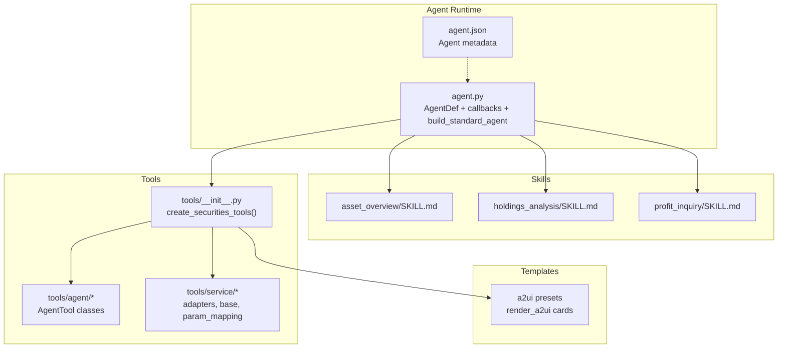
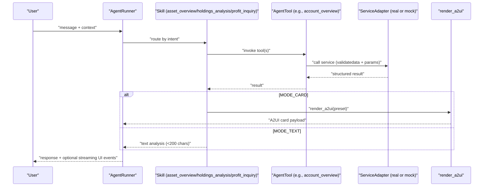
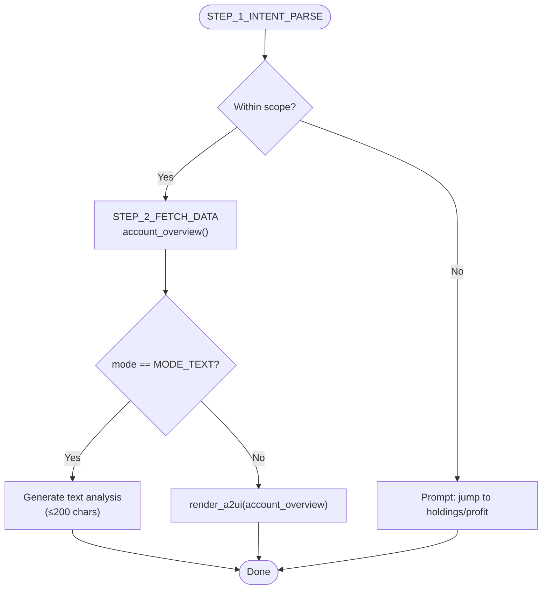
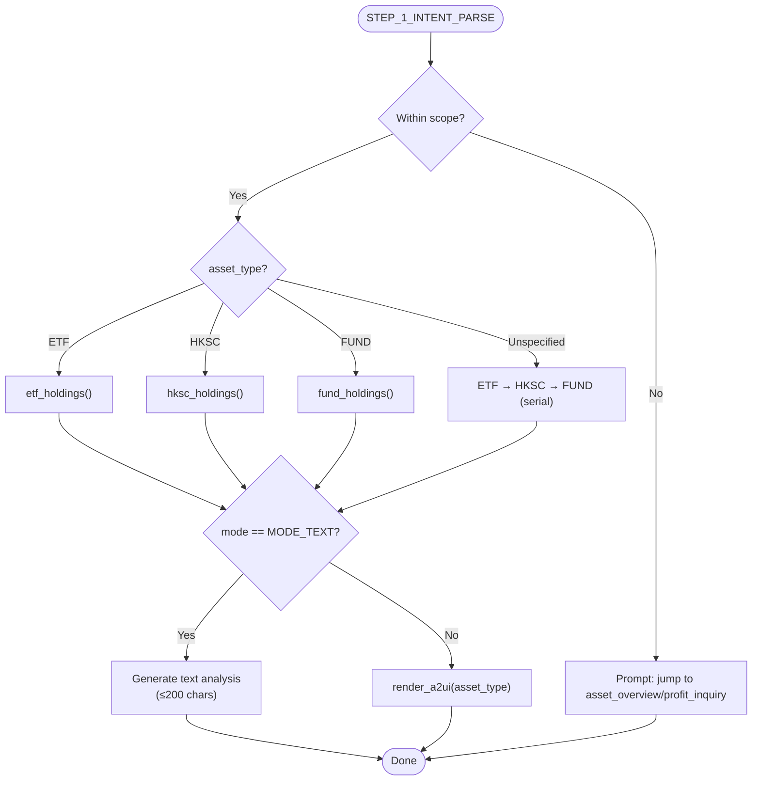
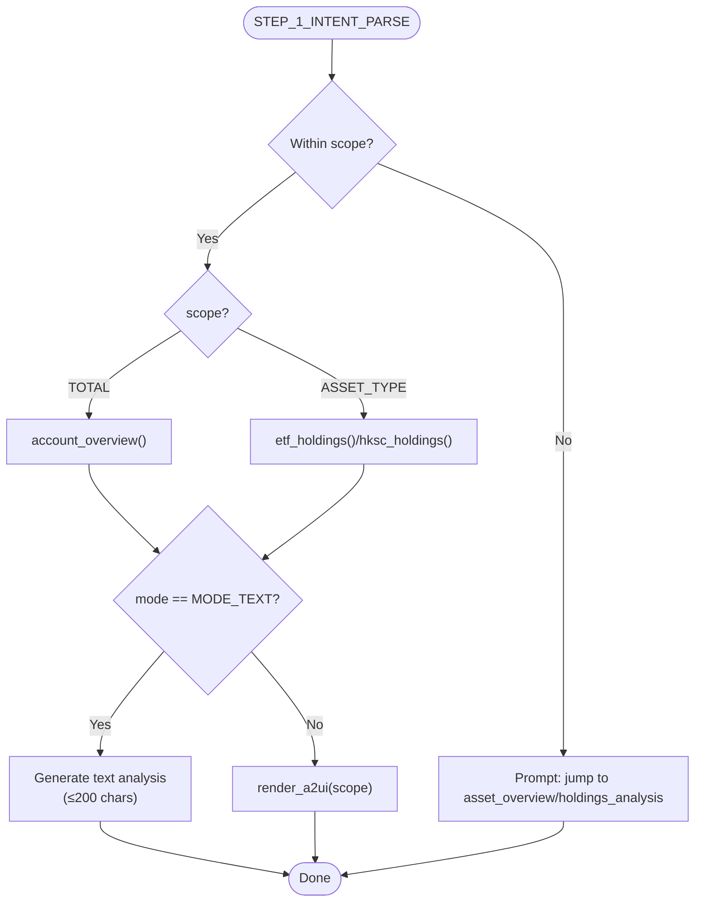
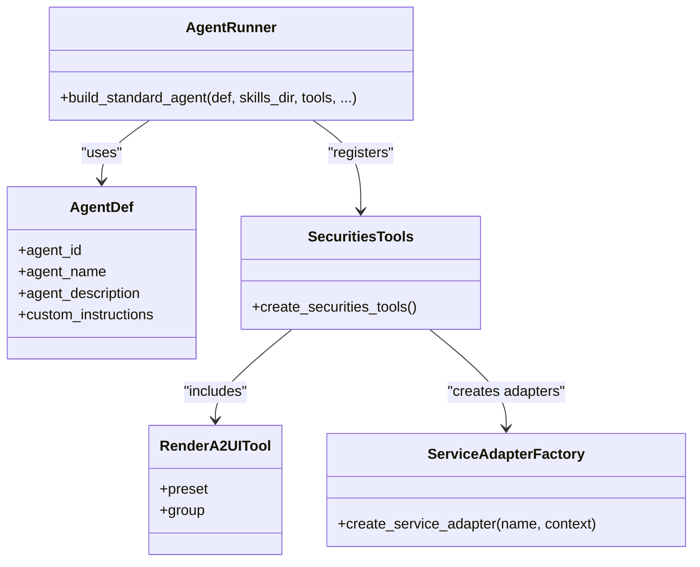
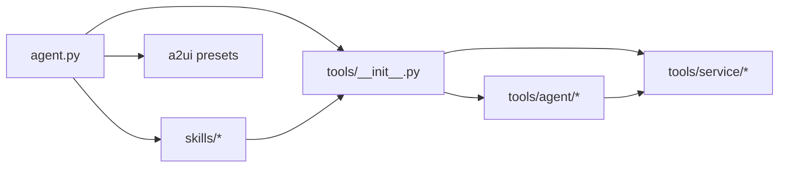

# Securities Skills

<cite>
**Referenced Files in This Document**
- [agent.py](file://src/ark_agentic/agents/securities/agent.py)
- [agent.json](file://src/ark_agentic/agents/securities/agent.json)
- [README.md](file://src/ark_agentic/agents/securities/README.md)
- [__init__.py](file://src/ark_agentic/agents/securities/tools/__init__.py)
- [__init__.py](file://src/ark_agentic/agents/securities/tools/agent/__init__.py)
- [__init__.py](file://src/ark_agentic/agents/securities/tools/service/__init__.py)
- [SKILL.md](file://src/ark_agentic/agents/securities/skills/asset_overview/SKILL.md)
- [SKILL.md](file://src/ark_agentic/agents/securities/skills/holdings_analysis/SKILL.md)
- [SKILL.md](file://src/ark_agentic/agents/securities/skills/profit_inquiry/SKILL.md)
</cite>

## Table of Contents
1. [Introduction](#introduction)
2. [Project Structure](#project-structure)
3. [Core Components](#core-components)
4. [Architecture Overview](#architecture-overview)
5. [Detailed Component Analysis](#detailed-component-analysis)
6. [Dependency Analysis](#dependency-analysis)
7. [Performance Considerations](#performance-considerations)
8. [Troubleshooting Guide](#troubleshooting-guide)
9. [Conclusion](#conclusion)

## Introduction
This document describes the Securities Agent skills system that powers specialized financial analysis capabilities for securities accounts. It focuses on four skills:
- asset_overview: Portfolio summaries and account overview
- holdings_analysis: Position evaluation across ETF, HKSC, and fund holdings
- profit_inquiry: Performance metrics and ranking queries
- security_detail: Individual instrument information

It explains the skill architecture, configuration patterns, integration with the agent’s tool system, evaluation process, context requirements, output formatting, validation and compliance constraints, and practical invocation examples.

## Project Structure
The Securities Agent is organized around:
- Agent definition and runtime wiring
- Skills (intent-driven orchestration)
- Tools (AgentTool wrappers around service adapters)
- Service layer (adapters and infrastructure)
- Templates and presets for UI rendering

**Diagram sources**
- [agent.py:41-100](file://src/ark_agentic/agents/securities/agent.py#L41-L100)
- [agent.json:1-8](file://src/ark_agentic/agents/securities/agent.json#L1-L8)
- [__init__.py:48-66](file://src/ark_agentic/agents/securities/tools/__init__.py#L48-L66)
- [__init__.py:1-32](file://src/ark_agentic/agents/securities/tools/agent/__init__.py#L1-L32)
- [__init__.py:39-85](file://src/ark_agentic/agents/securities/tools/service/__init__.py#L39-L85)
- [SKILL.md](file://src/ark_agentic/agents/securities/skills/asset_overview/SKILL.md)
- [SKILL.md](file://src/ark_agentic/agents/securities/skills/holdings_analysis/SKILL.md)
- [SKILL.md](file://src/ark_agentic/agents/securities/skills/profit_inquiry/SKILL.md)

**Section sources**
- [agent.py:11-100](file://src/ark_agentic/agents/securities/agent.py#L11-L100)
- [agent.json:1-8](file://src/ark_agentic/agents/securities/agent.json#L1-L8)
- [README.md:574-636](file://src/ark_agentic/agents/securities/README.md#L574-L636)

## Core Components
- Agent runtime and lifecycle:
  - Defines AgentDef, builds the standard agent, registers skills directory, injects tools, and sets up callbacks for context enrichment and validation.
- Skills:
  - asset_overview: Routes to account overview, cash status, holdings lists, and branch info; supports MODE_CARD and MODE_TEXT outputs.
  - holdings_analysis: Routes to ETF/HKSC/Fund holdings; supports MODE_CARD and MODE_TEXT outputs.
  - profit_inquiry: Routes to total or asset-type profit; supports MODE_CARD and MODE_TEXT outputs.
- Tools:
  - AgentTool wrappers for account_overview, cash_assets, etf_holdings, hksc_holdings, fund_holdings, security_detail, security_info_search, and render_a2ui.
- Service layer:
  - Adapts to real APIs or mock data; handles validatedata authentication, parameter mapping, response extraction, and card rendering.

**Section sources**
- [agent.py:41-100](file://src/ark_agentic/agents/securities/agent.py#L41-L100)
- [__init__.py:48-66](file://src/ark_agentic/agents/securities/tools/__init__.py#L48-L66)
- [__init__.py:1-32](file://src/ark_agentic/agents/securities/tools/agent/__init__.py#L1-L32)
- [__init__.py:39-85](file://src/ark_agentic/agents/securities/tools/service/__init__.py#L39-L85)
- [SKILL.md](file://src/ark_agentic/agents/securities/skills/asset_overview/SKILL.md)
- [SKILL.md](file://src/ark_agentic/agents/securities/skills/holdings_analysis/SKILL.md)
- [SKILL.md](file://src/ark_agentic/agents/securities/skills/profit_inquiry/SKILL.md)

## Architecture Overview
The Securities Agent follows a clear separation of concerns:
- Agent orchestrates skills and tools via a standard runtime.
- Skills parse intent and orchestrate tool invocations.
- Tools call service adapters (real API or mock) and return structured results.
- render_a2ui renders standardized UI cards for MODE_CARD; MODE_TEXT produces concise textual analysis.

**Diagram sources**
- [agent.py:72-100](file://src/ark_agentic/agents/securities/agent.py#L72-L100)
- [SKILL.md](file://src/ark_agentic/agents/securities/skills/asset_overview/SKILL.md)
- [SKILL.md](file://src/ark_agentic/agents/securities/skills/holdings_analysis/SKILL.md)
- [SKILL.md](file://src/ark_agentic/agents/securities/skills/profit_inquiry/SKILL.md)
- [__init__.py:48-66](file://src/ark_agentic/agents/securities/tools/__init__.py#L48-L66)

## Detailed Component Analysis

### asset_overview Skill
Purpose:
- Provide portfolio summaries, cash status, holdings lists, and branch/account info.
- Support two modes:
  - MODE_CARD: render a standardized account overview card.
  - MODE_TEXT: concise textual analysis (≤200 chars) with objective insights.

Key behaviors:
- Intent parsing identifies account_type from context and selects mode.
- Enforces strict real-time tool usage; prohibits historical data reuse.
- Renders a single card per invocation; no mixed-mode rendering.

Execution flow:

Output formatting:
- MODE_CARD: A2UI card payload; no numeric summary or raw JSON.
- MODE_TEXT: Markdown text with objective highlights; no investment advice.

Validation and compliance:
- Prohibits using cached values; requires fresh tool calls.
- No sensitive advice generation.

**Diagram sources**
- [SKILL.md:96-145](file://src/ark_agentic/agents/securities/skills/asset_overview/SKILL.md#L96-L145)

**Section sources**
- [SKILL.md:21-78](file://src/ark_agentic/agents/securities/skills/asset_overview/SKILL.md#L21-L78)
- [SKILL.md:96-145](file://src/ark_agentic/agents/securities/skills/asset_overview/SKILL.md#L96-L145)
- [SKILL.md:147-186](file://src/ark_agentic/agents/securities/skills/asset_overview/SKILL.md#L147-L186)

### holdings_analysis Skill
Purpose:
- Evaluate positions across ETF, HKSC, and fund holdings.
- Two modes:
  - MODE_CARD: show holdings list via a dedicated card.
  - MODE_TEXT: analyze performance, distribution, and composition.

Key behaviors:
- Intent parsing determines asset_type and mode.
- Serial tool invocation enforced; never concurrent.
- Strictly objective analysis; no recommendations.

Execution flow:

Output formatting:
- MODE_CARD: A2UI card payload; concise confirmation message.
- MODE_TEXT: Markdown text with performance/distribution insights.

**Diagram sources**
- [SKILL.md:127-139](file://src/ark_agentic/agents/securities/skills/holdings_analysis/SKILL.md#L127-L139)

**Section sources**
- [SKILL.md:19-104](file://src/ark_agentic/agents/securities/skills/holdings_analysis/SKILL.md#L19-L104)
- [SKILL.md:127-196](file://src/ark_agentic/agents/securities/skills/holdings_analysis/SKILL.md#L127-L196)
- [SKILL.md:198-243](file://src/ark_agentic/agents/securities/skills/holdings_analysis/SKILL.md#L198-L243)

### profit_inquiry Skill
Purpose:
- Retrieve and analyze profit metrics: today’s gain/loss, cumulative P/L, yield, and ranking.
- Modes:
  - MODE_CARD: show profit card directly.
  - MODE_TEXT: analyze reasons, compare categories, rank holdings.

Key behaviors:
- Scope selection: TOTAL vs ASSET_TYPE.
- Single-tool invocation per turn; serial execution.
- Objective presentation; no advice.

Execution flow:

Output formatting:
- MODE_CARD: A2UI card payload; direct answers to “how much did I earn?”.
- MODE_TEXT: Markdown text with attribution and ranking.

**Diagram sources**
- [SKILL.md:131-142](file://src/ark_agentic/agents/securities/skills/profit_inquiry/SKILL.md#L131-L142)

**Section sources**
- [SKILL.md:19-107](file://src/ark_agentic/agents/securities/skills/profit_inquiry/SKILL.md#L19-L107)
- [SKILL.md:131-198](file://src/ark_agentic/agents/securities/skills/profit_inquiry/SKILL.md#L131-L198)
- [SKILL.md:200-245](file://src/ark_agentic/agents/securities/skills/profit_inquiry/SKILL.md#L200-L245)

### Integration with Agent Tool System
- Agent registration:
  - AgentDef defines agent identity and custom instructions.
  - build_standard_agent wires skills_dir, tools, and callbacks.
- Tool creation:
  - create_securities_tools aggregates AgentTool classes and a shared render_a2ui tool configured with securities presets.
- Service adapter selection:
  - create_service_adapter chooses between mock and real API based on environment/session context.
- Context enrichment and validation:
  - Callbacks enrich context and enforce authentication checks before execution.

**Diagram sources**
- [agent.py:41-100](file://src/ark_agentic/agents/securities/agent.py#L41-L100)
- [__init__.py:48-66](file://src/ark_agentic/agents/securities/tools/__init__.py#L48-L66)
- [__init__.py:39-85](file://src/ark_agentic/agents/securities/tools/service/__init__.py#L39-L85)

**Section sources**
- [agent.py:41-100](file://src/ark_agentic/agents/securities/agent.py#L41-L100)
- [__init__.py:48-66](file://src/ark_agentic/agents/securities/tools/__init__.py#L48-L66)
- [__init__.py:39-85](file://src/ark_agentic/agents/securities/tools/service/__init__.py#L39-L85)

## Dependency Analysis
- Agent depends on:
  - Skills directory for intent routing.
  - Tools registry for callable functions.
  - Validation hooks for entity citations and authentication.
- Tools depend on:
  - Service adapters for API/mocks.
  - Parameter mapping and field extraction utilities.
  - A2UI presets for rendering.
- Skills depend on:
  - Tools’ structured outputs.
  - Context for account_type and optional session overrides.

**Diagram sources**
- [agent.py:41-100](file://src/ark_agentic/agents/securities/agent.py#L41-L100)
- [__init__.py:48-66](file://src/ark_agentic/agents/securities/tools/__init__.py#L48-L66)
- [__init__.py:1-32](file://src/ark_agentic/agents/securities/tools/agent/__init__.py#L1-L32)
- [__init__.py:39-85](file://src/ark_agentic/agents/securities/tools/service/__init__.py#L39-L85)

**Section sources**
- [agent.py:41-100](file://src/ark_agentic/agents/securities/agent.py#L41-L100)
- [__init__.py:48-66](file://src/ark_agentic/agents/securities/tools/__init__.py#L48-L66)
- [__init__.py:39-85](file://src/ark_agentic/agents/securities/tools/service/__init__.py#L39-L85)

## Performance Considerations
- Real-time tool calls: Skills must not reuse cached values; always call tools fresh.
- Serial tool invocation: Multiple holdings tools must be invoked sequentially to avoid contention.
- Minimal rendering overhead: render_a2ui is efficient and designed for UI streaming.
- Environment-driven adapter selection: Prefer mock during development to reduce latency; configure production URLs carefully.

[No sources needed since this section provides general guidance]

## Troubleshooting Guide
Common issues and resolutions:
- Authentication failures:
  - Ensure loginflag indicates authenticated session; otherwise, the agent triggers a login UI component.
- Missing environment variables:
  - Production adapters require SECURITIES_*_URL; missing values cause adapter creation errors.
- Empty or partial data:
  - Skills return appropriate messages when data is unavailable; MODE_CARD avoids rendering empty cards.
- Tool misuse:
  - Concurrency or bypassing required tools leads to inconsistent outputs; follow strict invocation order.

**Section sources**
- [agent.py:53-70](file://src/ark_agentic/agents/securities/agent.py#L53-L70)
- [__init__.py:65-78](file://src/ark_agentic/agents/securities/tools/service/__init__.py#L65-L78)
- [SKILL.md:140-144](file://src/ark_agentic/agents/securities/skills/asset_overview/SKILL.md#L140-L144)
- [SKILL.md:174-177](file://src/ark_agentic/agents/securities/skills/asset_overview/SKILL.md#L174-L177)
- [SKILL.md:175-181](file://src/ark_agentic/agents/securities/skills/holdings_analysis/SKILL.md#L175-L181)
- [SKILL.md:231-234](file://src/ark_agentic/agents/securities/skills/holdings_analysis/SKILL.md#L231-L234)
- [SKILL.md:179-181](file://src/ark_agentic/agents/securities/skills/profit_inquiry/SKILL.md#L179-L181)
- [SKILL.md:233-236](file://src/ark_agentic/agents/securities/skills/profit_inquiry/SKILL.md#L233-L236)

## Conclusion
The Securities Agent skills system provides a robust, intent-driven framework for financial analysis:
- Skills define clear boundaries, invocation policies, and output strategies.
- Tools and adapters encapsulate data retrieval and rendering.
- Strict validation and compliance rules ensure secure, objective, and reproducible results.
Adhering to the documented patterns guarantees reliable integrations and consistent user experiences across asset_overview, holdings_analysis, profit_inquiry, and related capabilities.