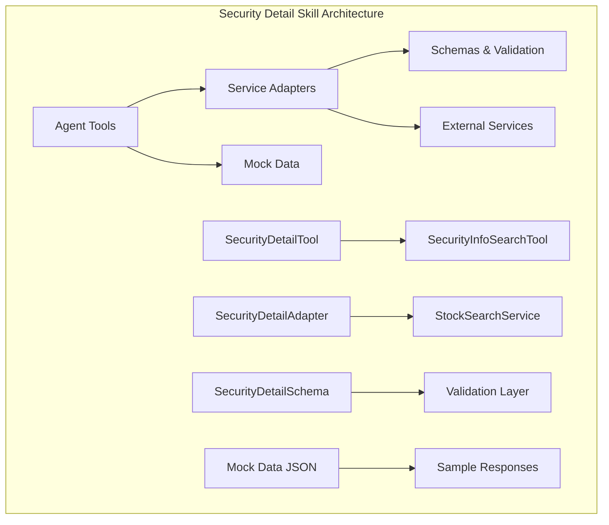
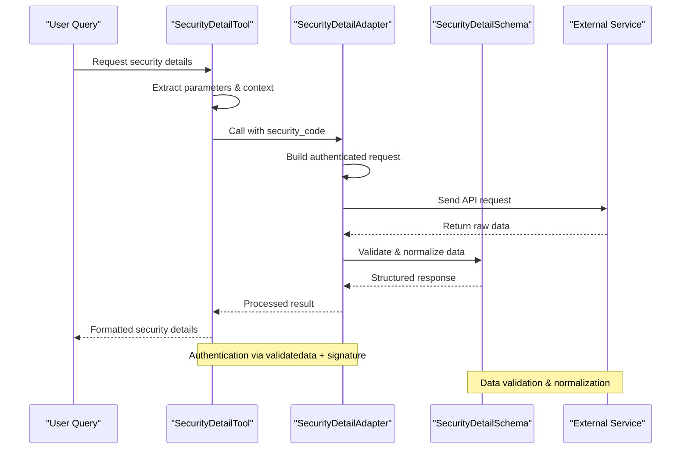
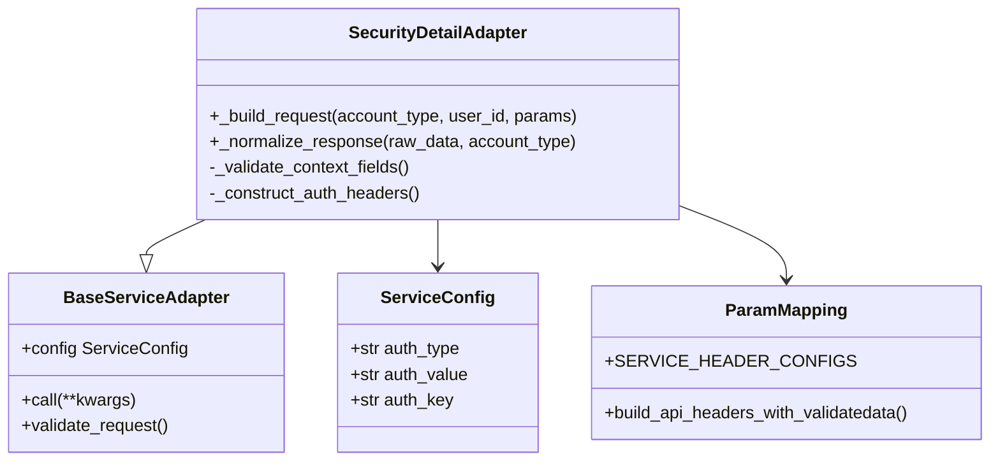
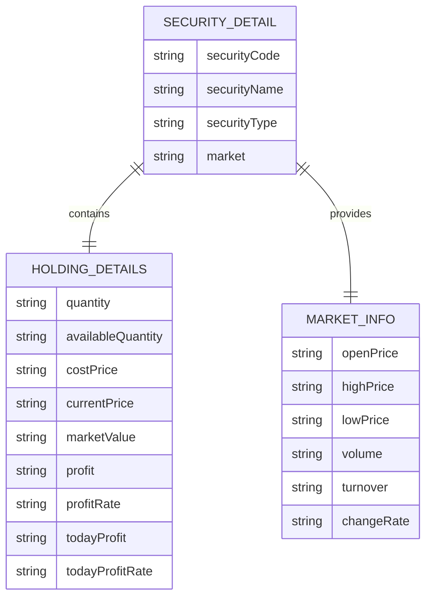
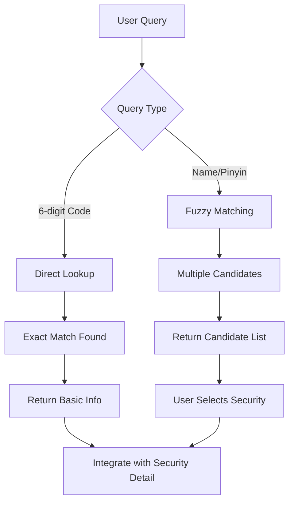
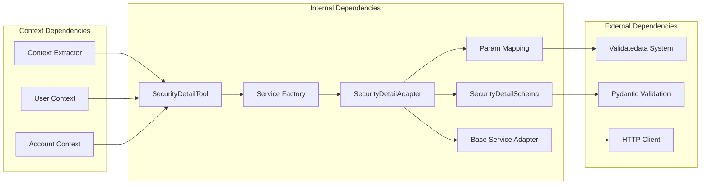

# Security Detail Skill

<cite>
**Referenced Files in This Document**
- [security_detail.py](file://src/ark_agentic/agents/securities/tools/agent/security_detail.py)
- [security_detail.py](file://src/ark_agentic/agents/securities/tools/service/adapters/security_detail.py)
- [security_info_search.py](file://src/ark_agentic/agents/securities/tools/agent/security_info_search.py)
- [stock_510300.json](file://src/ark_agentic/agents/securities/mock_data/security_detail/stock_510300.json)
- [schemas.py](file://src/ark_agentic/agents/securities/schemas.py)
- [stock_search_service.py](file://src/ark_agentic/agents/securities/tools/service/stock_search_service.py)
- [base.py](file://src/ark_agentic/agents/securities/tools/service/base.py)
- [param_mapping.py](file://src/ark_agentic/agents/securities/tools/service/param_mapping.py)
- [preset_extractors.py](file://src/ark_agentic/agents/securities/a2ui/preset_extractors.py)
</cite>

## Table of Contents
1. [Introduction](#introduction)
2. [Project Structure](#project-structure)
3. [Core Components](#core-components)
4. [Architecture Overview](#architecture-overview)
5. [Detailed Component Analysis](#detailed-component-analysis)
6. [Dependency Analysis](#dependency-analysis)
7. [Performance Considerations](#performance-considerations)
8. [Troubleshooting Guide](#troubleshooting-guide)
9. [Conclusion](#conclusion)

## Introduction
The Security Detail skill provides comprehensive analysis and detailed information for individual securities, enabling informed investment decisions. It retrieves real-time market data, fundamental characteristics, and related financial metrics for stocks, funds, and ETFs. The skill integrates seamlessly with the broader securities analysis toolkit, offering both granular security insights and contextual market intelligence.

The skill serves as a cornerstone for investment research, delivering actionable intelligence through structured data presentation and analytical frameworks. It supports various user queries ranging from basic security identification to complex portfolio analysis scenarios.

## Project Structure
The Security Detail skill is organized within the securities agent framework, utilizing a modular architecture that separates concerns between user-facing tools, service adapters, and data schemas.



**Diagram sources**
- [security_detail.py:46-103](file://src/ark_agentic/agents/securities/tools/agent/security_detail.py#L46-L103)
- [security_detail.py:18-68](file://src/ark_agentic/agents/securities/tools/service/adapters/security_detail.py#L18-L68)

**Section sources**
- [security_detail.py:1-103](file://src/ark_agentic/agents/securities/tools/agent/security_detail.py#L1-L103)
- [security_detail.py:1-68](file://src/ark_agentic/agents/securities/tools/service/adapters/security_detail.py#L1-L68)

## Core Components
The Security Detail skill comprises three primary components working in concert to deliver comprehensive security analysis:

### SecurityDetailTool
The main agent tool responsible for querying specific security details. It handles parameter validation, context extraction, and orchestrates the data retrieval process. The tool supports flexible parameter passing with precedence rules for context values.

### SecurityDetailAdapter
The service adapter managing authentication and request construction. It implements validatedata + signature authentication, builds appropriate API headers, and normalizes response data according to predefined schemas.

### SecurityDetailSchema
The data validation layer ensuring response consistency and integrity. It defines the structure for security information including holding details, market data, and performance metrics.

**Section sources**
- [security_detail.py:46-103](file://src/ark_agentic/agents/securities/tools/agent/security_detail.py#L46-L103)
- [security_detail.py:18-68](file://src/ark_agentic/agents/securities/tools/service/adapters/security_detail.py#L18-L68)
- [schemas.py](file://src/ark_agentic/agents/securities/schemas.py)

## Architecture Overview
The Security Detail skill follows a layered architecture pattern that separates concerns between user interaction, service orchestration, and external data integration.



**Diagram sources**
- [security_detail.py:68-103](file://src/ark_agentic/agents/securities/tools/agent/security_detail.py#L68-L103)
- [security_detail.py:24-68](file://src/ark_agentic/agents/securities/tools/service/adapters/security_detail.py#L24-L68)

The architecture ensures robust error handling, secure authentication, and consistent data formatting across all security detail requests.

**Section sources**
- [security_detail.py:68-103](file://src/ark_agentic/agents/securities/tools/agent/security_detail.py#L68-L103)
- [security_detail.py:18-68](file://src/ark_agentic/agents/securities/tools/service/adapters/security_detail.py#L18-L68)

## Detailed Component Analysis

### SecurityDetailTool Implementation
The SecurityDetailTool implements a sophisticated parameter resolution system that prioritizes values from multiple sources:

```mermaid
flowchart TD
A[Tool Execution] --> B[Extract Arguments]
B --> C[Extract Context Values]
C --> D[Parameter Resolution]
D --> E{security_code}
E --> |Present| F[Use Tool Argument]
E --> |Missing| G[Use Context Value]
D --> H{account_type}
H --> |Present| I[Use Tool Argument]
H --> |Missing| J[Use Context Value]
D --> K{user_id}
K --> |Present| L[Use Context Value]
K --> |Missing| M[Use Default "U001"]
F --> N[Execute Service Call]
G --> N
I --> N
J --> N
L --> N
M --> N
```

**Diagram sources**
- [security_detail.py:76-84](file://src/ark_agentic/agents/securities/tools/agent/security_detail.py#L76-L84)

The tool implements comprehensive error handling with structured result formatting, ensuring reliable operation under various failure conditions.

**Section sources**
- [security_detail.py:68-103](file://src/ark_agentic/agents/securities/tools/agent/security_detail.py#L68-L103)

### SecurityDetailAdapter Authentication
The adapter employs a dual-layer authentication system combining validatedata and signature-based security:



**Diagram sources**
- [security_detail.py:18-68](file://src/ark_agentic/agents/securities/tools/service/adapters/security_detail.py#L18-L68)
- [base.py](file://src/ark_agentic/agents/securities/tools/service/base.py)
- [param_mapping.py](file://src/ark_agentic/agents/securities/tools/service/param_mapping.py)

The authentication process validates required context fields and constructs appropriate headers for external service communication.

**Section sources**
- [security_detail.py:24-49](file://src/ark_agentic/agents/securities/tools/service/adapters/security_detail.py#L24-L49)

### Data Validation and Normalization
The SecurityDetailSchema provides comprehensive validation for security information:



**Diagram sources**
- [stock_510300.json:4-28](file://src/ark_agentic/agents/securities/mock_data/security_detail/stock_510300.json#L4-L28)

The schema enforces data integrity and provides structured access to security information including performance metrics and market indicators.

**Section sources**
- [stock_510300.json:1-29](file://src/ark_agentic/agents/securities/mock_data/security_detail/stock_510300.json#L1-L29)

### Related Security Information Search
The SecurityInfoSearchTool complements the Security Detail skill by providing initial security identification and basic information:



**Diagram sources**
- [security_info_search.py:19-79](file://src/ark_agentic/agents/securities/tools/agent/security_info_search.py#L19-L79)

**Section sources**
- [security_info_search.py:1-79](file://src/ark_agentic/agents/securities/tools/agent/security_info_search.py#L1-L79)

## Dependency Analysis
The Security Detail skill maintains loose coupling through well-defined interfaces and dependency injection patterns.



**Diagram sources**
- [security_detail.py:29-92](file://src/ark_agentic/agents/securities/tools/agent/security_detail.py#L29-L92)
- [security_detail.py:30-43](file://src/ark_agentic/agents/securities/tools/service/adapters/security_detail.py#L30-L43)

The dependency structure enables easy testing, mocking, and extension while maintaining clean separation of concerns.

**Section sources**
- [security_detail.py:29-92](file://src/ark_agentic/agents/securities/tools/agent/security_detail.py#L29-L92)
- [security_detail.py:30-43](file://src/ark_agentic/agents/securities/tools/service/adapters/security_detail.py#L30-L43)

## Performance Considerations
The Security Detail skill implements several optimization strategies for efficient operation:

- **Caching Strategy**: Response data can be cached based on security code and timestamp to reduce redundant API calls
- **Batch Processing**: Multiple security queries can be processed concurrently using async patterns
- **Lazy Loading**: Optional data fields are loaded only when requested
- **Connection Pooling**: Reuse HTTP connections for multiple requests to the same service

## Troubleshooting Guide
Common issues and their resolutions:

### Authentication Failures
- **Issue**: Invalid validatedata or signature
- **Resolution**: Verify context contains required validatedata fields and proper signature generation

### Parameter Validation Errors
- **Issue**: Missing security_code or invalid account_type
- **Resolution**: Ensure security_code follows proper format and account_type is either 'normal' or 'margin'

### Network Connectivity Issues
- **Issue**: Timeout or connection refused
- **Resolution**: Implement retry logic with exponential backoff and fallback to cached data when available

### Data Validation Failures
- **Issue**: Schema validation errors in response data
- **Resolution**: Log raw response data and contact service provider for API changes

**Section sources**
- [security_detail.py:98-102](file://src/ark_agentic/agents/securities/tools/agent/security_detail.py#L98-L102)
- [security_detail.py:62-67](file://src/ark_agentic/agents/securities/tools/service/adapters/security_detail.py#L62-L67)

## Conclusion
The Security Detail skill provides a robust foundation for comprehensive security analysis within the Ark Agentic Space platform. Its modular architecture, secure authentication, and comprehensive data validation ensure reliable operation across diverse investment scenarios.

The skill's integration with the broader securities analysis toolkit enables sophisticated investment decision support through structured data presentation and analytical frameworks. Future enhancements could include expanded market data integration, advanced technical analysis capabilities, and enhanced user interface customization.