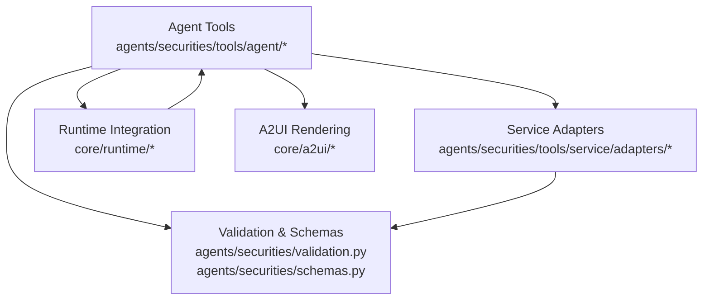
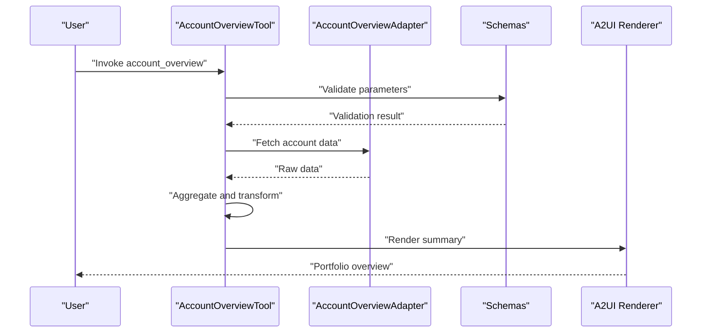
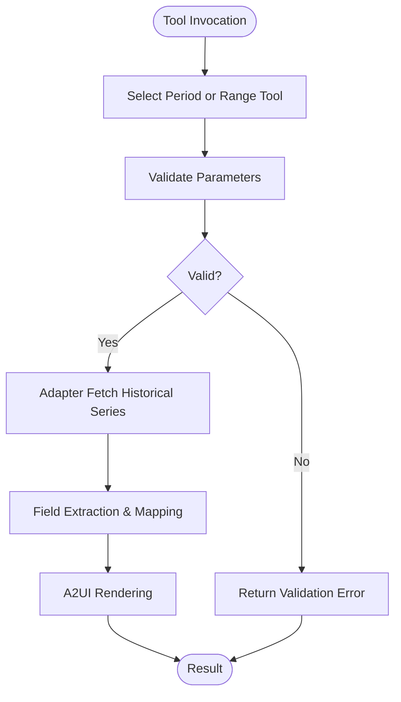
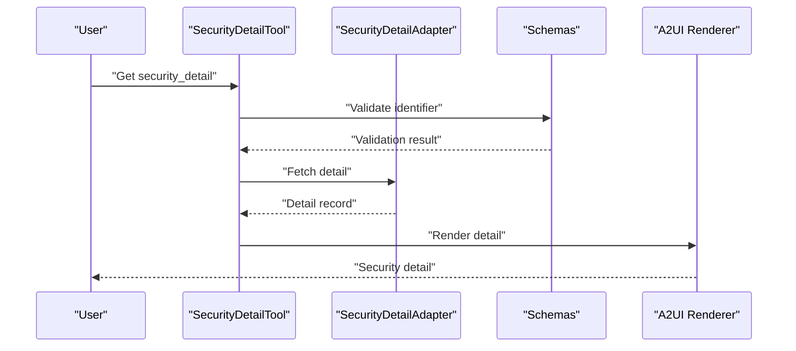
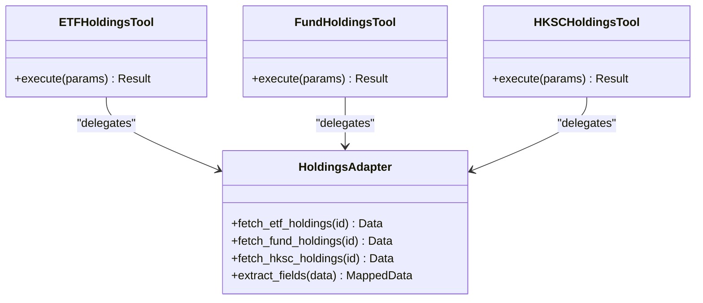
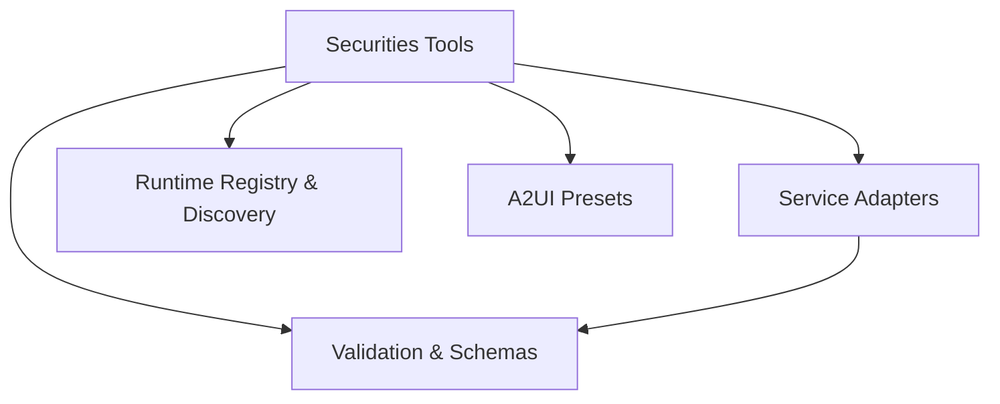
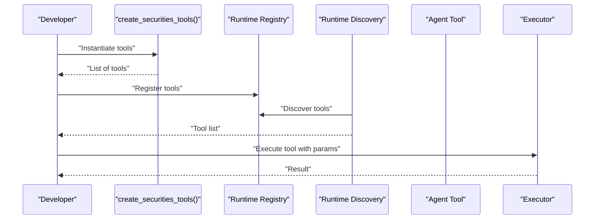
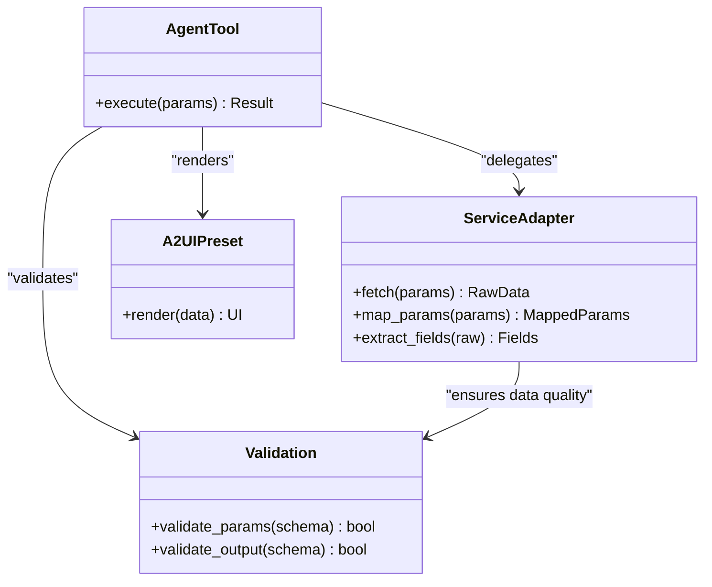

# Agent Tools

<cite>
**Referenced Files in This Document**
- [tools/__init__.py](file://src/ark_agentic/agents/securities/tools/__init__.py)
- [agent/__init__.py](file://src/ark_agentic/agents/securities/tools/agent/__init__.py)
- [account_overview.py](file://src/ark_agentic/agents/securities/tools/agent/account_overview.py)
- [asset_profit_hist_period.py](file://src/ark_agentic/agents/securities/tools/agent/asset_profit_hist_period.py)
- [asset_profit_hist_range.py](file://src/ark_agentic/agents/securities/tools/agent/asset_profit_hist_range.py)
- [security_detail.py](file://src/ark_agentic/agents/securities/tools/agent/security_detail.py)
- [etf_holdings.py](file://src/ark_agentic/agents/securities/tools/agent/etf_holdings.py)
- [fund_holdings.py](file://src/ark_agentic/agents/securities/tools/agent/fund_holdings.py)
- [hksc_holdings.py](file://src/ark_agentic/agents/securities/tools/agent/hksc_holdings.py)
- [stock_daily_profit_month.py](file://src/ark_agentic/agents/securities/tools/agent/stock_daily_profit_month.py)
- [stock_daily_profit_range.py](file://src/ark_agentic/agents/securities/tools/agent/stock_daily_profit_range.py)
- [stock_profit_ranking.py](file://src/ark_agentic/agents/securities/tools/agent/stock_profit_ranking.py)
- [branch_info.py](file://src/ark_agentic/agents/securities/tools/agent/branch_info.py)
- [cash_assets.py](file://src/ark_agentic/agents/securities/tools/agent/cash_assets.py)
- [security_info_search.py](file://src/ark_agentic/agents/securities/tools/agent/security_info_search.py)
- [service/adapters/__init__.py](file://src/ark_agentic/agents/securities/tools/service/adapters/__init__.py)
- [service/adapters/account_overview.py](file://src/ark_agentic/agents/securities/tools/service/adapters/account_overview.py)
- [service/adapters/asset_profit_hist.py](file://src/ark_agentic/agents/securities/tools/service/adapters/asset_profit_hist.py)
- [service/adapters/security_detail.py](file://src/ark_agentic/agents/securities/tools/service/adapters/security_detail.py)
- [service/base.py](file://src/ark_agentic/agents/securities/tools/service/base.py)
- [service/field_extraction.py](file://src/ark_agentic/agents/securities/tools/service/field_extraction.py)
- [service/param_mapping.py](file://src/ark_agentic/agents/securities/tools/service/param_mapping.py)
- [validation.py](file://src/ark_agentic/agents/securities/validation.py)
- [schemas.py](file://src/ark_agentic/agents/securities/schemas.py)
- [agent.py](file://src/ark_agentic/agents/securities/agent.py)
- [agent.json](file://src/ark_agentic/agents/securities/agent.json)
- [README.md](file://src/ark_agentic/agents/securities/README.md)
- [mock_loader.py](file://src/ark_agentic/agents/securities/tools/service/mock_loader.py)
- [mock_mode.py](file://src/ark_agentic/agents/securities/tools/service/mock_mode.py)
- [stock_search_service.py](file://src/ark_agentic/agents/securities/tools/service/stock_search_service.py)
- [stock_search/index.py](file://src/ark_agentic/agents/securities/tools/service/stock_search/index.py)
- [stock_search/matcher.py](file://src/ark_agentic/agents/securities/tools/service/stock_search/matcher.py)
- [stock_search/models.py](file://src/ark_agentic/agents/securities/tools/service/stock_search/models.py)
- [a2ui/preset_extractors.py](file://src/ark_agentic/agents/securities/a2ui/preset_extractors.py)
- [core/tools/base.py](file://src/ark_agentic/core/tools/base.py)
- [core/runtime/registry.py](file://src/ark_agentic/core/runtime/registry.py)
- [core/runtime/discovery.py](file://src/ark_agentic/core/runtime/discovery.py)
- [core/runtime/validation.py](file://src/ark_agentic/core/runtime/validation.py)
- [core/runtime/runner.py](file://src/ark_agentic/core/runtime/runner.py)
- [core/runtime/guard.py](file://src/ark_agentic/core/runtime/guard.py)
- [core/runtime/agents_lifecycle.py](file://src/ark_agentic/core/runtime/agents_lifecycle.py)
- [core/protocol/bootstrap.py](file://src/ark_agentic/core/protocol/bootstrap.py)
- [core/protocol/lifecycle.py](file://src/ark_agentic/core/protocol/lifecycle.py)
- [core/protocol/plugin.py](file://src/ark_agentic/core/protocol/plugin.py)
- [core/protocol/app_context.py](file://src/ark_agentic/core/protocol/app_context.py)
- [core/observability/decorators.py](file://src/ark_agentic/core/observability/decorators.py)
- [core/observability/tracing.py](file://src/ark_agentic/core/observability/tracing.py)
- [core/observability/providers/console.py](file://src/ark_agentic/core/observability/providers/console.py)
- [core/observability/providers/langfuse.py](file://src/ark_agentic/core/observability/providers/langfuse.py)
- [core/observability/providers/otlp.py](file://src/ark_agentic/core/observability/providers/otlp.py)
- [core/observability/providers/phoenix.py](file://src/ark_agentic/core/observability/providers/phoenix.py)
- [core/stream/event_bus.py](file://src/ark_agentic/core/stream/event_bus.py)
- [core/stream/assembler.py](file://src/ark_agentic/core/stream/assembler.py)
- [core/stream/output_formatter.py](file://src/ark_agentic/core/stream/output_formatter.py)
- [core/memory/manager.py](file://src/ark_agentic/core/memory/manager.py)
- [core/memory/types.py](file://src/ark_agentic/core/memory/types.py)
- [core/memory/user_profile.py](file://src/ark_agentic/core/memory/user_profile.py)
- [core/session/manager.py](file://src/ark_agentic/core/session/manager.py)
- [core/session/format.py](file://src/ark_agentic/core/session/format.py)
- [core/session/history_merge.py](file://src/ark_agentic/core/session/history_merge.py)
- [core/storage/database/engine.py](file://src/ark_agentic/core/storage/database/engine.py)
- [core/storage/database/models.py](file://src/ark_agentic/core/storage/database/models.py)
- [core/storage/file/session.py](file://src/ark_agentic/core/storage/file/session.py)
- [core/storage/file/memory.py](file://src/ark_agentic/core/storage/file/memory.py)
- [core/storage/protocols/session.py](file://src/ark_agentic/core/storage/protocols/session.py)
- [core/storage/protocols/memory.py](file://src/ark_agentic/core/storage/protocols/memory.py)
- [core/utils/dates.py](file://src/ark_agentic/core/utils/dates.py)
- [core/utils/numbers.py](file://src/ark_agentic/core/utils/numbers.py)
- [core/utils/env.py](file://src/ark_agentic/core/utils/env.py)
- [core/utils/grounding_cache.py](file://src/ark_agentic/core/utils/grounding_cache.py)
- [core/utils/entities.py](file://src/ark_agentic/core/utils/entities.py)
- [core/llm/factory.py](file://src/ark_agentic/core/llm/factory.py)
- [core/llm/caller.py](file://src/ark_agentic/core/llm/caller.py)
- [core/llm/retry.py](file://src/ark_agentic/core/llm/retry.py)
- [core/llm/errors.py](file://src/ark_agentic/core/llm/errors.py)
- [core/llm/pa_jt_llm.py](file://src/ark_agentic/core/llm/pa_jt_llm.py)
- [core/llm/pa_sx_llm.py](file://src/ark_agentic/core/llm/pa_sx_llm.py)
- [core/llm/debug_transport.py](file://src/ark_agentic/core/llm/debug_transport.py)
- [core/llm/sampling.py](file://src/ark_agentic/core/llm/sampling.py)
- [core/a2ui/preset_registry.py](file://src/ark_agentic/core/a2ui/preset_registry.py)
- [core/a2ui/renderer.py](file://src/ark_agentic/core/a2ui/renderer.py)
- [core/a2ui/validator.py](file://src/ark_agentic/core/a2ui/validator.py)
- [core/a2ui/composer.py](file://src/ark_agentic/core/a2ui/composer.py)
- [core/a2ui/transforms.py](file://src/ark_agentic/core/a2ui/transforms.py)
- [core/a2ui/theme.py](file://src/ark_agentic/core/a2ui/theme.py)
- [core/a2ui/guard.py](file://src/ark_agentic/core/a2ui/guard.py)
- [core/a2ui/contract_models.py](file://src/ark_agentic/core/a2ui/contract_models.py)
- [core/a2ui/flattener.py](file://src/ark_agentic/core/a2ui/flattener.py)
- [core/skills/base.py](file://src/ark_agentic/core/skills/base.py)
- [core/skills/loader.py](file://src/ark_agentic/core/skills/loader.py)
- [core/skills/matcher.py](file://src/ark_agentic/core/skills/matcher.py)
- [core/skills/router.py](file://src/ark_agentic/core/skills/router.py)
- [core/subtask/tool.py](file://src/ark_agentic/core/subtask/tool.py)
- [core/tools/registry.py](file://src/ark_agentic/core/tools/registry.py)
- [core/tools/executor.py](file://src/ark_agentic/core/tools/executor.py)
- [core/tools/render_a2ui.py](file://src/ark_agentic/core/tools/render_a2ui.py)
- [core/tools/read_skill.py](file://src/ark_agentic/core/tools/read_skill.py)
- [core/tools/resume_task.py](file://src/ark_agentic/core/tools/resume_task.py)
- [core/tools/memory.py](file://src/ark_agentic/core/tools/memory.py)
- [core/tools/pa_knowledge_api.py](file://src/ark_agentic/core/tools/pa_knowledge_api.py)
- [core/flow/task_registry.py](file://src/ark_agentic/core/flow/task_registry.py)
- [core/flow/base_evaluator.py](file://src/ark_agentic/core/flow/base_evaluator.py)
- [core/flow/commit_flow_stage.py](file://src/ark_agentic/core/flow/commit_flow_stage.py)
- [core/flow/callbacks.py](file://src/ark_agentic/core/flow/callbacks.py)
- [core/paths.py](file://src/ark_agentic/core/paths.py)
- [core/types.py](file://src/ark_agentic/core/types.py)
- [core/utils/dates.py](file://src/ark_agentic/core/utils/dates.py)
- [core/utils/numbers.py](file://src/ark_agentic/core/utils/numbers.py)
- [core/utils/env.py](file://src/ark_agentic/core/utils/env.py)
- [core/utils/grounding_cache.py](file://src/ark_agentic/core/utils/grounding_cache.py)
- [core/utils/entities.py](file://src/ark_agentic/core/utils/entities.py)
- [core/llm/factory.py](file://src/ark_agentic/core/llm/factory.py)
- [core/llm/caller.py](file://src/ark_agentic/core/llm/caller.py)
- [core/llm/retry.py](file://src/ark_agentic/core/llm/retry.py)
- [core/llm/errors.py](file://src/ark_agentic/core/llm/errors.py)
- [core/llm/pa_jt_llm.py](file://src/ark_agentic/core/llm/pa_jt_llm.py)
- [core/llm/pa_sx_llm.py](file://src/ark_agentic/core/llm/pa_sx_llm.py)
- [core/llm/debug_transport.py](file://src/ark_agentic/core/llm/debug_transport.py)
- [core/llm/sampling.py](file://src/ark_agentic/core/llm/sampling.py)
- [core/a2ui/preset_registry.py](file://src/ark_agentic/core/a2ui/preset_registry.py)
- [core/a2ui/renderer.py](file://src/ark_agentic/core/a2ui/renderer.py)
- [core/a2ui/validator.py](file://src/ark_agentic/core/a2ui/validator.py)
- [core/a2ui/composer.py](file://src/ark_agentic/core/a2ui/composer.py)
- [core/a2ui/transforms.py](file://src/ark_agentic/core/a2ui/transforms.py)
- [core/a2ui/theme.py](file://src/ark_agentic/core/a2ui/theme.py)
- [core/a2ui/guard.py](file://src/ark_agentic/core/a2ui/guard.py)
- [core/a2ui/contract_models.py](file://src/ark_agentic/core/a2ui/contract_models.py)
- [core/a2ui/flattener.py](file://src/ark_agentic/core/a2ui/flattener.py)
- [core/skills/base.py](file://src/ark_agentic/core/skills/base.py)
- [core/skills/loader.py](file://src/ark_agentic/core/skills/loader.py)
- [core/skills/matcher.py](file://src/ark_agentic/core/skills/matcher.py)
- [core/skills/router.py](file://src/ark_agentic/core/skills/router.py)
- [core/subtask/tool.py](file://src/ark_agentic/core/subtask/tool.py)
- [core/tools/registry.py](file://src/ark_agentic/core/tools/registry.py)
- [core/tools/executor.py](file://src/ark_agentic/core/tools/executor.py)
- [core/tools/render_a2ui.py](file://src/ark_agentic/core/tools/render_a2ui.py)
- [core/tools/read_skill.py](file://src/ark_agentic/core/tools/read_skill.py)
- [core/tools/resume_task.py](file://src/ark_agentic/core/tools/resume_task.py)
- [core/tools/memory.py](file://src/ark_agentic/core/tools/memory.py)
- [core/tools/pa_knowledge_api.py](file://src/ark_agentic/core/tools/pa_knowledge_api.py)
- [core/flow/task_registry.py](file://src/ark_agentic/core/flow/task_registry.py)
- [core/flow/base_evaluator.py](file://src/ark_agentic/core/flow/base_evaluator.py)
- [core/flow/commit_flow_stage.py](file://src/ark_agentic/core/flow/commit_flow_stage.py)
- [core/flow/callbacks.py](file://src/ark_agentic/core/flow/callbacks.py)
- [core/paths.py](file://src/ark_agentic/core/paths.py)
- [core/types.py](file://src/ark_agentic/core/types.py)
</cite>

## Table of Contents
1. [Introduction](#introduction)
2. [Project Structure](#project-structure)
3. [Core Components](#core-components)
4. [Architecture Overview](#architecture-overview)
5. [Detailed Component Analysis](#detailed-component-analysis)
6. [Dependency Analysis](#dependency-analysis)
7. [Performance Considerations](#performance-considerations)
8. [Troubleshooting Guide](#troubleshooting-guide)
9. [Conclusion](#conclusion)
10. [Appendices](#appendices)

## Introduction
This document provides comprehensive documentation for the Securities Agent tools that deliver direct financial data access and analysis capabilities. It covers the purpose, parameters, return values, and usage patterns for key tools such as account_overview, asset_profit_hist (period and range variants), security_detail, and holdings analysis tools (ETF, Fund, HKSC). It also explains the tool registration process, parameter validation, integration with the agent runtime, and the relationship between agent tools and their corresponding service adapters. Practical examples of invocation, result processing, and error handling are included to help both technical and non-technical users understand and operate the system effectively.

## Project Structure
The Securities Agent tools are organized under the securities agent module. The primary components include:
- Tool definitions and registration under agents/securities/tools
- Service adapters under agents/securities/tools/service/adapters
- Validation and schemas under agents/securities
- Runtime integration under core/runtime and core/protocol
- A2UI presets and rendering under agents/securities/a2ui and core/a2ui

```mermaid
graph TB
subgraph "Securities Agent"
TPKG["agents/securities/tools/__init__.py"]
TAgent["agents/securities/tools/agent/__init__.py"]
SvcBase["agents/securities/tools/service/base.py"]
Adapters["agents/securities/tools/service/adapters/__init__.py"]
Val["agents/securities/validation.py"]
Sch["agents/securities/schemas.py"]
A2UIPresets["agents/securities/a2ui/preset_extractors.py"]
end
subgraph "Core Runtime"
RTReg["core/runtime/registry.py"]
RTDisco["core/runtime/discovery.py"]
RTVal["core/runtime/validation.py"]
RTGuard["core/runtime/guard.py"]
RTRun["core/runtime/runner.py"]
ProtoBoot["core/protocol/bootstrap.py"]
ProtoLife["core/protocol/lifecycle.py"]
ProtoPlug["core/protocol/plugin.py"]
ProtoCtx["core/protocol/app_context.py"]
end
TPKG --> TAgent
TPKG --> RTReg
TPKG --> RTDisco
TPKG --> RTVal
TPKG --> RTGuard
TPKG --> RTRun
TPKG --> ProtoBoot
TPKG --> ProtoLife
TPKG --> ProtoPlug
TPKG --> ProtoCtx
TAgent --> Adapters
TAgent --> SvcBase
TAgent --> Val
TAgent --> Sch
TAgent --> A2UIPresets
```

**Diagram sources**
- [tools/__init__.py:1-65](file://src/ark_agentic/agents/securities/tools/__init__.py#L1-L65)
- [agent/__init__.py:1-31](file://src/ark_agentic/agents/securities/tools/agent/__init__.py#L1-L31)
- [service/base.py](file://src/ark_agentic/agents/securities/tools/service/base.py)
- [service/adapters/__init__.py](file://src/ark_agentic/agents/securities/tools/service/adapters/__init__.py)
- [validation.py](file://src/ark_agentic/agents/securities/validation.py)
- [schemas.py](file://src/ark_agentic/agents/securities/schemas.py)
- [a2ui/preset_extractors.py](file://src/ark_agentic/agents/securities/a2ui/preset_extractors.py)
- [core/runtime/registry.py](file://src/ark_agentic/core/runtime/registry.py)
- [core/runtime/discovery.py](file://src/ark_agentic/core/runtime/discovery.py)
- [core/runtime/validation.py](file://src/ark_agentic/core/runtime/validation.py)
- [core/runtime/guard.py](file://src/ark_agentic/core/runtime/guard.py)
- [core/runtime/runner.py](file://src/ark_agentic/core/runtime/runner.py)
- [core/protocol/bootstrap.py](file://src/ark_agentic/core/protocol/bootstrap.py)
- [core/protocol/lifecycle.py](file://src/ark_agentic/core/protocol/lifecycle.py)
- [core/protocol/plugin.py](file://src/ark_agentic/core/protocol/plugin.py)
- [core/protocol/app_context.py](file://src/ark_agentic/core/protocol/app_context.py)

**Section sources**
- [tools/__init__.py:1-65](file://src/ark_agentic/agents/securities/tools/__init__.py#L1-L65)
- [agent/__init__.py:1-31](file://src/ark_agentic/agents/securities/tools/agent/__init__.py#L1-L31)

## Core Components
This section documents the core Securities Agent tools and their roles:
- AccountOverviewTool: Provides portfolio summaries and asset allocation insights.
- AssetProfitHistPeriodTool and AssetProfitHistRangeTool: Retrieve historical performance metrics over fixed periods and flexible date ranges respectively.
- SecurityDetailTool: Returns detailed information for a specific security identifier.
- Holdings Analysis Tools: ETFHoldingsTool, FundHoldingsTool, HKSCHoldingsTool for sector and fund-specific holdings.
- Profit and Ranking Tools: StockDailyProfitMonthTool, StockDailyProfitRangeTool, StockProfitRankingTool for daily profit tracking and ranking.
- Supporting Tools: BranchInfoTool, CashAssetsTool, SecurityInfoSearchTool, and RenderA2UITool for branch data, cash assets, security search, and A2UI rendering.

Registration and creation:
- create_securities_tools(): Factory method that instantiates and returns all Securities Agent tools, including RenderA2UITool configured with securities presets.

Parameter validation and schemas:
- validation.py and schemas.py define validation rules and data schemas for tool parameters and outputs.

Integration with runtime:
- Tools are registered via the runtime registry and discovered through the runtime discovery mechanism. They integrate with the agent lifecycle and protocol bootstrap.

**Section sources**
- [tools/__init__.py:48-65](file://src/ark_agentic/agents/securities/tools/__init__.py#L48-L65)
- [agent/__init__.py:1-31](file://src/ark_agentic/agents/securities/tools/agent/__init__.py#L1-L31)
- [validation.py](file://src/ark_agentic/agents/securities/validation.py)
- [schemas.py](file://src/ark_agentic/agents/securities/schemas.py)
- [core/runtime/registry.py](file://src/ark_agentic/core/runtime/registry.py)
- [core/runtime/discovery.py](file://src/ark_agentic/core/runtime/discovery.py)
- [core/protocol/bootstrap.py](file://src/ark_agentic/core/protocol/bootstrap.py)

## Architecture Overview
The Securities Agent tools follow a layered architecture:
- Agent Tools: Define the interface and orchestrate data retrieval and presentation.
- Service Adapters: Implement the backend-specific logic for each tool, handling parameter mapping, field extraction, and mock mode support.
- Validation and Schemas: Enforce parameter correctness and output shape.
- Runtime Integration: Registers tools, validates parameters, and executes them within the agent lifecycle.
- A2UI Rendering: Presents structured results to users with predefined presets.

**Diagram sources**
- [agent/__init__.py:1-31](file://src/ark_agentic/agents/securities/tools/agent/__init__.py#L1-L31)
- [service/adapters/__init__.py](file://src/ark_agentic/agents/securities/tools/service/adapters/__init__.py)
- [validation.py](file://src/ark_agentic/agents/securities/validation.py)
- [schemas.py](file://src/ark_agentic/agents/securities/schemas.py)
- [core/runtime/registry.py](file://src/ark_agentic/core/runtime/registry.py)
- [core/a2ui/preset_extractors.py](file://src/ark_agentic/agents/securities/a2ui/preset_extractors.py)

## Detailed Component Analysis

### Account Overview Tool
Purpose:
- Summarize portfolio holdings, asset allocation, and key performance indicators for a client’s account.

Parameters:
- Typically include identifiers such as account number, user ID, and optional filters like date range or asset class.

Return Values:
- Portfolio summary including total value, cash balance, realized/unrealized gains, and allocation by category.

Usage Pattern:
- Instantiate AccountOverviewTool and call its execution method with validated parameters.
- Results are rendered via A2UI presets for user-friendly presentation.

Processing Logic:
- Delegates to service adapter for data retrieval and aggregation.
- Applies field extraction and mapping to align with expected output schema.

**Diagram sources**
- [account_overview.py](file://src/ark_agentic/agents/securities/tools/agent/account_overview.py)
- [service/adapters/account_overview.py](file://src/ark_agentic/agents/securities/tools/service/adapters/account_overview.py)
- [schemas.py](file://src/ark_agentic/agents/securities/schemas.py)
- [a2ui/preset_extractors.py](file://src/ark_agentic/agents/securities/a2ui/preset_extractors.py)

**Section sources**
- [account_overview.py](file://src/ark_agentic/agents/securities/tools/agent/account_overview.py)
- [service/adapters/account_overview.py](file://src/ark_agentic/agents/securities/tools/service/adapters/account_overview.py)
- [schemas.py](file://src/ark_agentic/agents/securities/schemas.py)

### Asset Profit Hist Tools (Period and Range)
Purpose:
- Historical performance tracking for assets over a fixed period or a flexible date range.

Parameters:
- Period-based: include period identifier and optional filters.
- Range-based: include start and end dates with optional filters.

Return Values:
- Historical series of profit/loss metrics aligned with the selected period or date range.

Usage Pattern:
- Choose AssetProfitHistPeriodTool for standardized periods or AssetProfitHistRangeTool for custom ranges.
- Both validate inputs and delegate to the asset_profit_hist adapter.

Processing Logic:
- Parameter mapping ensures consistent representation across period and range variants.
- Field extraction transforms raw series into structured outputs.

**Diagram sources**
- [asset_profit_hist_period.py](file://src/ark_agentic/agents/securities/tools/agent/asset_profit_hist_period.py)
- [asset_profit_hist_range.py](file://src/ark_agentic/agents/securities/tools/agent/asset_profit_hist_range.py)
- [service/adapters/asset_profit_hist.py](file://src/ark_agentic/agents/securities/tools/service/adapters/asset_profit_hist.py)
- [service/param_mapping.py](file://src/ark_agentic/agents/securities/tools/service/param_mapping.py)
- [service/field_extraction.py](file://src/ark_agentic/agents/securities/tools/service/field_extraction.py)

**Section sources**
- [asset_profit_hist_period.py](file://src/ark_agentic/agents/securities/tools/agent/asset_profit_hist_period.py)
- [asset_profit_hist_range.py](file://src/ark_agentic/agents/securities/tools/agent/asset_profit_hist_range.py)
- [service/adapters/asset_profit_hist.py](file://src/ark_agentic/agents/securities/tools/service/adapters/asset_profit_hist.py)
- [service/param_mapping.py](file://src/ark_agentic/agents/securities/tools/service/param_mapping.py)
- [service/field_extraction.py](file://src/ark_agentic/agents/securities/tools/service/field_extraction.py)

### Security Detail Tool
Purpose:
- Retrieve detailed information for a specific security, including issuer, pricing, yield, and related metadata.

Parameters:
- Security identifier (e.g., ticker or ISIN) and optional filters.

Return Values:
- Structured detail record containing security attributes and current market data.

Usage Pattern:
- Invoke SecurityDetailTool with validated identifier.
- Adapter fetches detailed records and applies field extraction.

**Diagram sources**
- [security_detail.py](file://src/ark_agentic/agents/securities/tools/agent/security_detail.py)
- [service/adapters/security_detail.py](file://src/ark_agentic/agents/securities/tools/service/adapters/security_detail.py)
- [schemas.py](file://src/ark_agentic/agents/securities/schemas.py)
- [a2ui/preset_extractors.py](file://src/ark_agentic/agents/securities/a2ui/preset_extractors.py)

**Section sources**
- [security_detail.py](file://src/ark_agentic/agents/securities/tools/agent/security_detail.py)
- [service/adapters/security_detail.py](file://src/ark_agentic/agents/securities/tools/service/adapters/security_detail.py)
- [schemas.py](file://src/ark_agentic/agents/securities/schemas.py)

### Holdings Analysis Tools (ETF, Fund, HKSC)
Purpose:
- Provide detailed holdings breakdown for ETFs, mutual funds, and HKEX-listed instruments.

Parameters:
- Identifier for the instrument (ETF, fund, or HKSC product) and optional filters.

Return Values:
- Holdings composition including top positions, sectors, and weights.

Usage Pattern:
- Use ETFHoldingsTool, FundHoldingsTool, or HKSCHoldingsTool depending on the asset class.
- Adapter retrieves holdings and A2UI renders the composition.

**Diagram sources**
- [etf_holdings.py](file://src/ark_agentic/agents/securities/tools/agent/etf_holdings.py)
- [fund_holdings.py](file://src/ark_agentic/agents/securities/tools/agent/fund_holdings.py)
- [hksc_holdings.py](file://src/ark_agentic/agents/securities/tools/agent/hksc_holdings.py)
- [service/adapters/__init__.py](file://src/ark_agentic/agents/securities/tools/service/adapters/__init__.py)

**Section sources**
- [etf_holdings.py](file://src/ark_agentic/agents/securities/tools/agent/etf_holdings.py)
- [fund_holdings.py](file://src/ark_agentic/agents/securities/tools/agent/fund_holdings.py)
- [hksc_holdings.py](file://src/ark_agentic/agents/securities/tools/agent/hksc_holdings.py)
- [service/adapters/__init__.py](file://src/ark_agentic/agents/securities/tools/service/adapters/__init__.py)

### Profit and Ranking Tools
Purpose:
- Track daily profits and rank securities by performance.

Parameters:
- Filters for date range, universe, and ranking criteria.

Return Values:
- Daily profit series or ranked list with performance metrics.

Usage Pattern:
- StockDailyProfitMonthTool for monthly views, StockDailyProfitRangeTool for custom ranges, and StockProfitRankingTool for leaderboards.

Processing Logic:
- Parameter mapping and field extraction ensure consistent outputs across tools.

**Section sources**
- [stock_daily_profit_month.py](file://src/ark_agentic/agents/securities/tools/agent/stock_daily_profit_month.py)
- [stock_daily_profit_range.py](file://src/ark_agentic/agents/securities/tools/agent/stock_daily_profit_range.py)
- [stock_profit_ranking.py](file://src/ark_agentic/agents/securities/tools/agent/stock_profit_ranking.py)
- [service/param_mapping.py](file://src/ark_agentic/agents/securities/tools/service/param_mapping.py)
- [service/field_extraction.py](file://src/ark_agentic/agents/securities/tools/service/field_extraction.py)

### Supporting Tools
- BranchInfoTool: Retrieve branch office details for client service.
- CashAssetsTool: Provide cash and asset position summaries.
- SecurityInfoSearchTool: Search and resolve security identifiers.
- RenderA2UITool: Renders structured results using securities presets.

**Section sources**
- [branch_info.py](file://src/ark_agentic/agents/securities/tools/agent/branch_info.py)
- [cash_assets.py](file://src/ark_agentic/agents/securities/tools/agent/cash_assets.py)
- [security_info_search.py](file://src/ark_agentic/agents/securities/tools/agent/security_info_search.py)
- [tools/__init__.py:41-45](file://src/ark_agentic/agents/securities/tools/__init__.py#L41-L45)

## Dependency Analysis
The Securities Agent tools depend on:
- Service adapters for backend-specific logic and data retrieval.
- Validation and schemas for parameter and output correctness.
- Runtime registry and discovery for tool registration and lifecycle management.
- A2UI presets for result rendering.

**Diagram sources**
- [tools/__init__.py:1-65](file://src/ark_agentic/agents/securities/tools/__init__.py#L1-L65)
- [agent/__init__.py:1-31](file://src/ark_agentic/agents/securities/tools/agent/__init__.py#L1-L31)
- [service/adapters/__init__.py](file://src/ark_agentic/agents/securities/tools/service/adapters/__init__.py)
- [validation.py](file://src/ark_agentic/agents/securities/validation.py)
- [schemas.py](file://src/ark_agentic/agents/securities/schemas.py)
- [core/runtime/registry.py](file://src/ark_agentic/core/runtime/registry.py)
- [core/runtime/discovery.py](file://src/ark_agentic/core/runtime/discovery.py)
- [a2ui/preset_extractors.py](file://src/ark_agentic/agents/securities/a2ui/preset_extractors.py)

**Section sources**
- [tools/__init__.py:1-65](file://src/ark_agentic/agents/securities/tools/__init__.py#L1-L65)
- [agent/__init__.py:1-31](file://src/ark_agentic/agents/securities/tools/agent/__init__.py#L1-L31)
- [service/adapters/__init__.py](file://src/ark_agentic/agents/securities/tools/service/adapters/__init__.py)
- [validation.py](file://src/ark_agentic/agents/securities/validation.py)
- [schemas.py](file://src/ark_agentic/agents/securities/schemas.py)
- [core/runtime/registry.py](file://src/ark_agentic/core/runtime/registry.py)
- [core/runtime/discovery.py](file://src/ark_agentic/core/runtime/discovery.py)
- [a2ui/preset_extractors.py](file://src/ark_agentic/agents/securities/a2ui/preset_extractors.py)

## Performance Considerations
- Parameter validation reduces unnecessary backend calls and improves error detection early.
- Field extraction and mapping minimize downstream transformation overhead.
- A2UI rendering optimizes presentation for quick comprehension.
- Mock mode and loaders enable fast testing and development without live backend dependencies.

[No sources needed since this section provides general guidance]

## Troubleshooting Guide
Common issues and resolutions:
- Parameter validation failures: Review validation rules and ensure inputs match expected types and formats.
- Adapter errors: Verify adapter configuration and backend connectivity.
- Rendering issues: Confirm A2UI preset compatibility and data structure alignment.
- Runtime registration problems: Check runtime registry and discovery configurations.

**Section sources**
- [validation.py](file://src/ark_agentic/agents/securities/validation.py)
- [core/runtime/validation.py](file://src/ark_agentic/core/runtime/validation.py)
- [core/runtime/registry.py](file://src/ark_agentic/core/runtime/registry.py)
- [core/runtime/discovery.py](file://src/ark_agentic/core/runtime/discovery.py)
- [core/a2ui/validator.py](file://src/ark_agentic/core/a2ui/validator.py)

## Conclusion
The Securities Agent tools provide a robust framework for accessing and analyzing financial data. Their modular design, strong validation, and A2UI rendering capabilities make them suitable for both automated workflows and interactive user experiences. Proper registration, parameter validation, and integration with the runtime ensure reliable operation across diverse use cases.

[No sources needed since this section summarizes without analyzing specific files]

## Appendices

### Tool Registration and Execution Flow

**Diagram sources**
- [tools/__init__.py:48-65](file://src/ark_agentic/agents/securities/tools/__init__.py#L48-L65)
- [core/runtime/registry.py](file://src/ark_agentic/core/runtime/registry.py)
- [core/runtime/discovery.py](file://src/ark_agentic/core/runtime/discovery.py)
- [core/tools/executor.py](file://src/ark_agentic/core/tools/executor.py)

### Relationship Between Agent Tools and Service Adapters
- Agent tools define the interface and orchestration.
- Service adapters encapsulate backend logic, parameter mapping, and field extraction.
- Validation and schemas ensure data integrity.
- A2UI presets standardize presentation.

**Diagram sources**
- [agent/__init__.py:1-31](file://src/ark_agentic/agents/securities/tools/agent/__init__.py#L1-L31)
- [service/base.py](file://src/ark_agentic/agents/securities/tools/service/base.py)
- [service/adapters/__init__.py](file://src/ark_agentic/agents/securities/tools/service/adapters/__init__.py)
- [validation.py](file://src/ark_agentic/agents/securities/validation.py)
- [a2ui/preset_extractors.py](file://src/ark_agentic/agents/securities/a2ui/preset_extractors.py)