# Securities Tools

<cite>
**Referenced Files in This Document**
- [account_overview.py](file://src/ark_agentic/agents/securities/tools/agent/account_overview.py)
- [asset_profit_hist_period.py](file://src/ark_agentic/agents/securities/tools/agent/asset_profit_hist_period.py)
- [security_detail.py](file://src/ark_agentic/agents/securities/tools/agent/security_detail.py)
- [param_mapping.py](file://src/ark_agentic/agents/securities/tools/service/param_mapping.py)
- [account_overview.py](file://src/ark_agentic/agents/securities/tools/service/adapters/account_overview.py)
- [asset_profit_hist.py](file://src/ark_agentic/agents/securities/tools/service/adapters/asset_profit_hist.py)
- [security_detail.py](file://src/ark_agentic/agents/securities/tools/service/adapters/security_detail.py)
- [stock_search_service.py](file://src/ark_agentic/agents/securities/tools/service/stock_search_service.py)
- [index.py](file://src/ark_agentic/agents/securities/tools/service/stock_search/index.py)
- [loader.py](file://src/ark_agentic/agents/securities/tools/service/stock_search/loader.py)
- [field_extraction.py](file://src/ark_agentic/agents/securities/tools/service/field_extraction.py)
- [base.py](file://src/ark_agentic/agents/securities/tools/service/base.py)
- [schemas.py](file://src/ark_agentic/agents/securities/schemas.py)
- [validation.py](file://src/ark_agentic/agents/securities/validation.py)
- [preset_extractors.py](file://src/ark_agentic/agents/securities/a2ui/preset_extractors.py)
- [README.md](file://src/ark_agentic/agents/securities/README.md)
</cite>

## Table of Contents
1. [Introduction](#introduction)
2. [Project Structure](#project-structure)
3. [Core Components](#core-components)
4. [Architecture Overview](#architecture-overview)
5. [Detailed Component Analysis](#detailed-component-analysis)
6. [Dependency Analysis](#dependency-analysis)
7. [Performance Considerations](#performance-considerations)
8. [Troubleshooting Guide](#troubleshooting-guide)
9. [Conclusion](#conclusion)
10. [Appendices](#appendices)

## Introduction
This document describes the Securities Agent tools system that powers financial data services and market analysis. It covers:
- Agent-side tools for account overview, asset profit history, and security details
- Service-side adapters for data processing and response normalization
- Parameter mapping system for context enrichment and data transformation
- Stock search service including indexing, loading, matching, and model definitions
- Practical examples of tool registration, parameter validation, and service integration patterns
- Mock data loader system and field extraction utilities for testing scenarios

The Securities Agent enables agents to query account positions, historical profit curves, and individual security details while abstracting authentication via validatedata/signature headers and normalizing heterogeneous backend responses.

## Project Structure
The Securities domain is organized into:
- Agent tools: user-facing tools that accept arguments and context, then delegate to service adapters
- Service adapters: translate context and parameters into authenticated requests and normalize responses
- Parameter mapping: centralized configuration for building API bodies and headers from context
- Stock search: local CSV-backed index and matcher for A-share lookup and optional dividend enrichment
- Field extraction and validation: utilities to convert raw responses into structured outputs
- A2UI presets: reusable extractors for rendering structured outputs

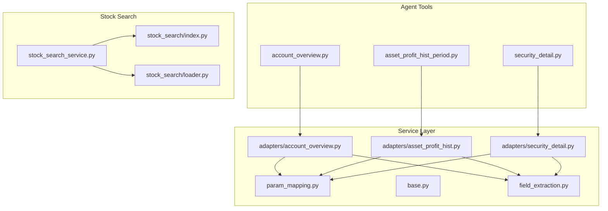

**Diagram sources**
- [account_overview.py:57-108](file://src/ark_agentic/agents/securities/tools/agent/account_overview.py#L57-L108)
- [asset_profit_hist_period.py:71-148](file://src/ark_agentic/agents/securities/tools/agent/asset_profit_hist_period.py#L71-L148)
- [security_detail.py:46-103](file://src/ark_agentic/agents/securities/tools/agent/security_detail.py#L46-L103)
- [param_mapping.py:307-479](file://src/ark_agentic/agents/securities/tools/service/param_mapping.py#L307-L479)
- [account_overview.py:15-61](file://src/ark_agentic/agents/securities/tools/service/adapters/account_overview.py#L15-L61)
- [asset_profit_hist.py:17-51](file://src/ark_agentic/agents/securities/tools/service/adapters/asset_profit_hist.py#L17-L51)
- [security_detail.py:18-68](file://src/ark_agentic/agents/securities/tools/service/adapters/security_detail.py#L18-L68)
- [stock_search_service.py:32-84](file://src/ark_agentic/agents/securities/tools/service/stock_search_service.py#L32-L84)
- [index.py:53-148](file://src/ark_agentic/agents/securities/tools/service/stock_search/index.py#L53-L148)
- [loader.py:74-138](file://src/ark_agentic/agents/securities/tools/service/stock_search/loader.py#L74-L138)

**Section sources**
- [account_overview.py:1-108](file://src/ark_agentic/agents/securities/tools/agent/account_overview.py#L1-L108)
- [asset_profit_hist_period.py:1-148](file://src/ark_agentic/agents/securities/tools/agent/asset_profit_hist_period.py#L1-L148)
- [security_detail.py:1-103](file://src/ark_agentic/agents/securities/tools/agent/security_detail.py#L1-L103)
- [param_mapping.py:1-479](file://src/ark_agentic/agents/securities/tools/service/param_mapping.py#L1-L479)
- [stock_search_service.py:1-84](file://src/ark_agentic/agents/securities/tools/service/stock_search_service.py#L1-L84)
- [index.py:1-148](file://src/ark_agentic/agents/securities/tools/service/stock_search/index.py#L1-L148)
- [loader.py:1-138](file://src/ark_agentic/agents/securities/tools/service/stock_search/loader.py#L1-L138)

## Core Components
- Agent tools
  - account_overview: fetches total assets, cash, equity, and today’s PnL for normal or margin accounts
  - asset_profit_hist_period: retrieves historical profit curves for predefined periods (this week, MTD, YTD, past year, inception)
  - security_detail: queries detailed position and market info for a given security code
- Service adapters
  - AccountOverviewAdapter, AssetProfitHistAdapter, SecurityDetailAdapter: build authenticated requests and normalize responses
- Parameter mapping and validation
  - Centralized configs for request bodies and headers; validatedata parsing and enrichment; required-field validation
- Stock search
  - StockSearchService: process-in-memory index, matcher, and optional dividend enrichment
  - StockLoader: CSV-backed loader with mock dividend support
  - StockIndex: fast in-memory maps for code/name/pinyin/initials lookups

**Section sources**
- [account_overview.py:57-108](file://src/ark_agentic/agents/securities/tools/agent/account_overview.py#L57-L108)
- [asset_profit_hist_period.py:71-148](file://src/ark_agentic/agents/securities/tools/agent/asset_profit_hist_period.py#L71-L148)
- [security_detail.py:46-103](file://src/ark_agentic/agents/securities/tools/agent/security_detail.py#L46-L103)
- [account_overview.py:15-61](file://src/ark_agentic/agents/securities/tools/service/adapters/account_overview.py#L15-L61)
- [asset_profit_hist.py:17-51](file://src/ark_agentic/agents/securities/tools/service/adapters/asset_profit_hist.py#L17-L51)
- [security_detail.py:18-68](file://src/ark_agentic/agents/securities/tools/service/adapters/security_detail.py#L18-L68)
- [param_mapping.py:307-479](file://src/ark_agentic/agents/securities/tools/service/param_mapping.py#L307-L479)
- [stock_search_service.py:32-84](file://src/ark_agentic/agents/securities/tools/service/stock_search_service.py#L32-L84)
- [loader.py:74-138](file://src/ark_agentic/agents/securities/tools/service/stock_search/loader.py#L74-L138)
- [index.py:53-148](file://src/ark_agentic/agents/securities/tools/service/stock_search/index.py#L53-L148)

## Architecture Overview
The system follows a layered pattern:
- Agent tools define the interface and parameter schema
- Service adapters encapsulate authentication and request construction
- Parameter mapping centralizes field mapping and validation
- Field extraction normalizes raw responses into consistent structures
- Stock search provides local, deterministic lookups with optional enrichment

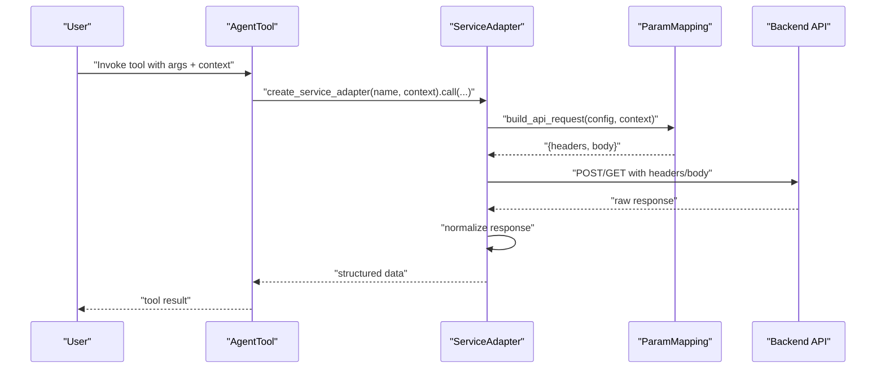

**Diagram sources**
- [account_overview.py:72-108](file://src/ark_agentic/agents/securities/tools/agent/account_overview.py#L72-L108)
- [asset_profit_hist_period.py:104-148](file://src/ark_agentic/agents/securities/tools/agent/asset_profit_hist_period.py#L104-L148)
- [security_detail.py:68-103](file://src/ark_agentic/agents/securities/tools/agent/security_detail.py#L68-L103)
- [account_overview.py:21-61](file://src/ark_agentic/agents/securities/tools/service/adapters/account_overview.py#L21-L61)
- [asset_profit_hist.py:24-51](file://src/ark_agentic/agents/securities/tools/service/adapters/asset_profit_hist.py#L24-L51)
- [security_detail.py:24-68](file://src/ark_agentic/agents/securities/tools/service/adapters/security_detail.py#L24-L68)
- [param_mapping.py:38-118](file://src/ark_agentic/agents/securities/tools/service/param_mapping.py#L38-L118)

## Detailed Component Analysis

### Agent Tools

#### Account Overview Tool
- Purpose: Retrieve total assets, cash, equity, and today’s PnL for normal or margin accounts
- Parameter mapping: Uses context enrichment to derive account_type and user_id; passes _context to adapter
- Error handling: Returns error result on exceptions

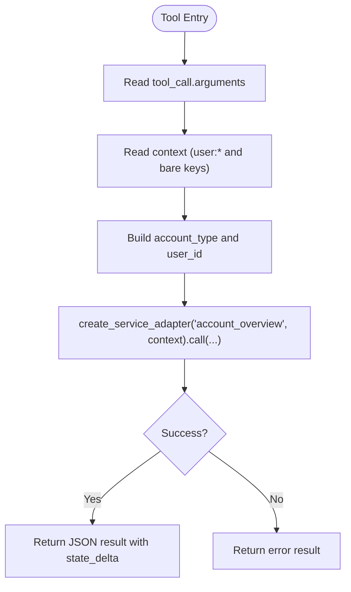

**Diagram sources**
- [account_overview.py:72-108](file://src/ark_agentic/agents/securities/tools/agent/account_overview.py#L72-L108)

**Section sources**
- [account_overview.py:57-108](file://src/ark_agentic/agents/securities/tools/agent/account_overview.py#L57-L108)

#### Asset Profit History Period Tool
- Purpose: Fetch historical profit curves for predefined periods
- Mapping: period -> time_type via PERIOD_TO_TIME_TYPE; injects time_type into context
- Validation: Ensures period is one of supported values

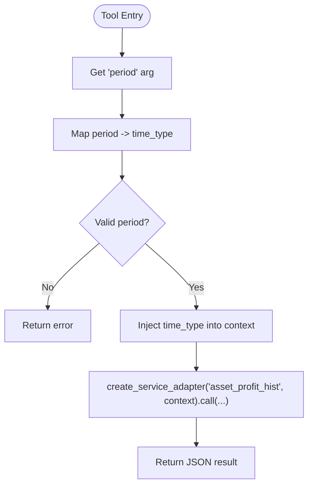

**Diagram sources**
- [asset_profit_hist_period.py:104-148](file://src/ark_agentic/agents/securities/tools/agent/asset_profit_hist_period.py#L104-L148)

**Section sources**
- [asset_profit_hist_period.py:71-148](file://src/ark_agentic/agents/securities/tools/agent/asset_profit_hist_period.py#L71-L148)

#### Security Detail Tool
- Purpose: Query detailed position and market info for a given security code
- Parameter mapping: Reads security_code and account_type from args/context; passes _context to adapter

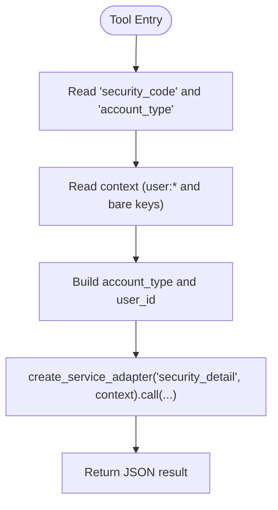

**Diagram sources**
- [security_detail.py:68-103](file://src/ark_agentic/agents/securities/tools/agent/security_detail.py#L68-L103)

**Section sources**
- [security_detail.py:46-103](file://src/ark_agentic/agents/securities/tools/agent/security_detail.py#L46-L103)

### Service Adapters

#### AccountOverviewAdapter
- Builds request headers and body using SERVICE_PARAM_CONFIGS and SERVICE_HEADER_CONFIGS
- Enforces validatedata presence via require_context_fields
- Normalizes response via extract_account_overview

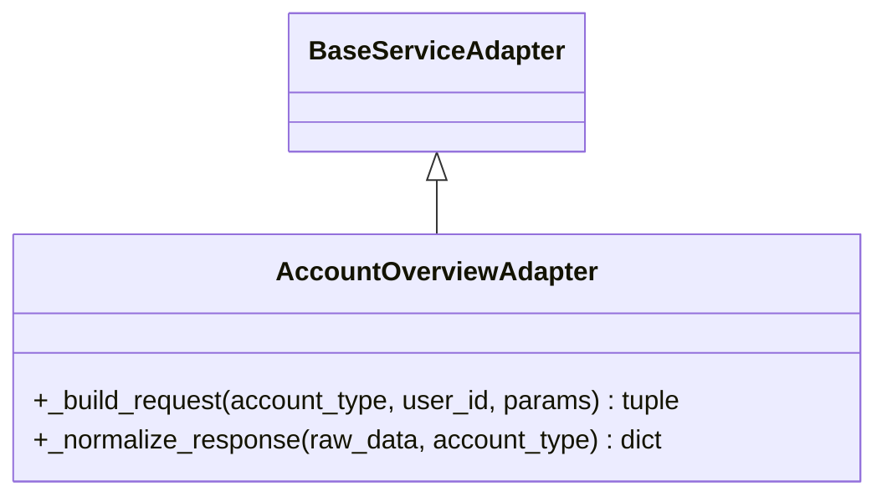

**Diagram sources**
- [account_overview.py:15-61](file://src/ark_agentic/agents/securities/tools/service/adapters/account_overview.py#L15-L61)
- [base.py](file://src/ark_agentic/agents/securities/tools/service/base.py)

**Section sources**
- [account_overview.py:15-61](file://src/ark_agentic/agents/securities/tools/service/adapters/account_overview.py#L15-L61)

#### AssetProfitHistAdapter
- Reuses validatedata-based request builder
- Normalizes response via extract_asset_profit_hist

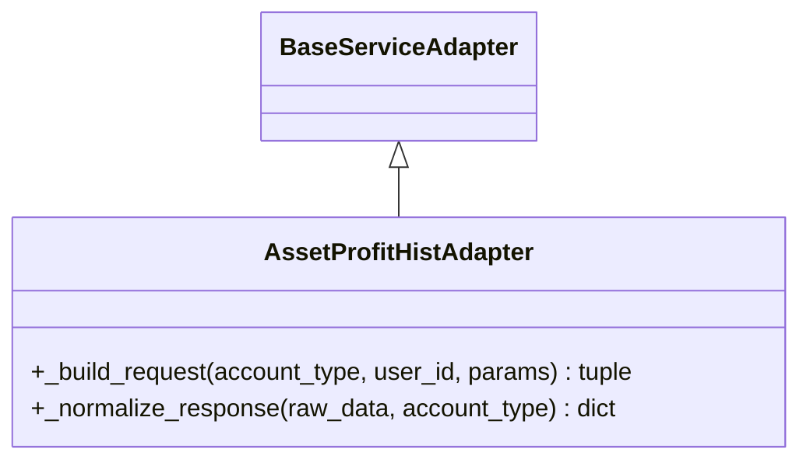

**Diagram sources**
- [asset_profit_hist.py:17-51](file://src/ark_agentic/agents/securities/tools/service/adapters/asset_profit_hist.py#L17-L51)
- [base.py](file://src/ark_agentic/agents/securities/tools/service/base.py)

**Section sources**
- [asset_profit_hist.py:17-51](file://src/ark_agentic/agents/securities/tools/service/adapters/asset_profit_hist.py#L17-L51)

#### SecurityDetailAdapter
- Constructs headers with validatedata/signature and a simple body
- Validates normalized data against SecurityDetailSchema

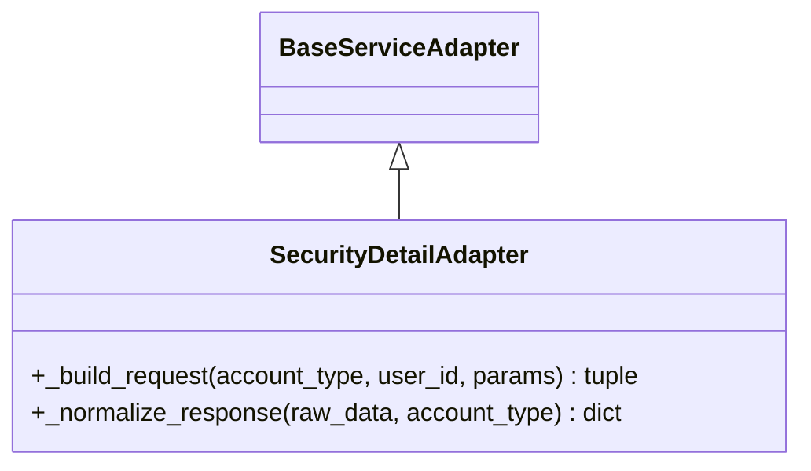

**Diagram sources**
- [security_detail.py:18-68](file://src/ark_agentic/agents/securities/tools/service/adapters/security_detail.py#L18-L68)
- [base.py](file://src/ark_agentic/agents/securities/tools/service/base.py)
- [schemas.py](file://src/ark_agentic/agents/securities/schemas.py)

**Section sources**
- [security_detail.py:18-68](file://src/ark_agentic/agents/securities/tools/service/adapters/security_detail.py#L18-L68)

### Parameter Mapping System
- Context enrichment: Parses validatedata string and injects fields into user:* namespace; infers account_type from loginflag
- Request builders: build_api_request and build_api_headers_with_validatedata
- Config-driven mapping: SERVICE_PARAM_CONFIGS and SERVICE_HEADER_CONFIGS per service
- Validation: validate_validatedata_fields checks required fields under mock mode consideration

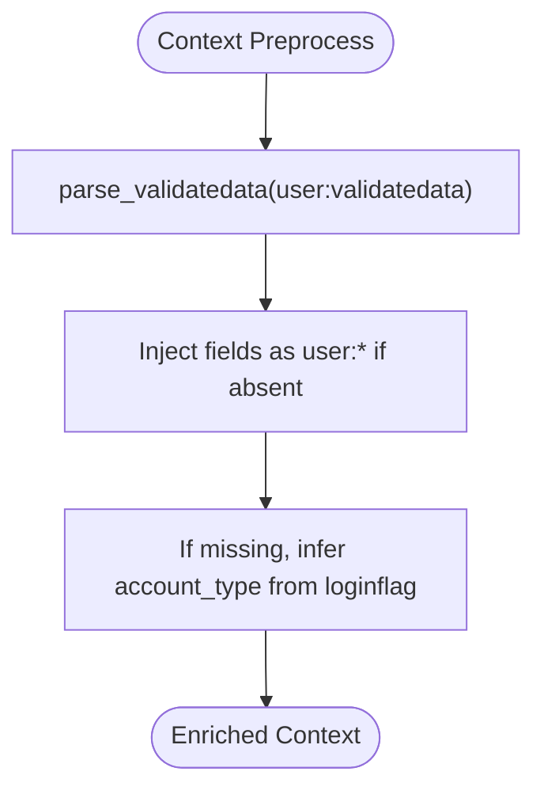

**Diagram sources**
- [param_mapping.py:210-236](file://src/ark_agentic/agents/securities/tools/service/param_mapping.py#L210-L236)

**Section sources**
- [param_mapping.py:1-479](file://src/ark_agentic/agents/securities/tools/service/param_mapping.py#L1-L479)

### Stock Search Service
- StockSearchService: wraps StockLoader and MultiPathMatcher; optionally enriches results with dividend info from mock data
- StockLoader: loads CSV (explicit path or seed); caches index and mock dividends; supports invalidation
- StockIndex: builds in-memory maps for O(1) exact lookup and exposes vectors for fuzzy matching

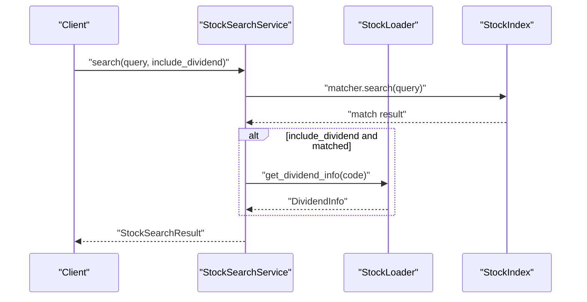

**Diagram sources**
- [stock_search_service.py:43-84](file://src/ark_agentic/agents/securities/tools/service/stock_search_service.py#L43-L84)
- [loader.py:74-138](file://src/ark_agentic/agents/securities/tools/service/stock_search/loader.py#L74-L138)
- [index.py:53-148](file://src/ark_agentic/agents/securities/tools/service/stock_search/index.py#L53-L148)

**Section sources**
- [stock_search_service.py:32-84](file://src/ark_agentic/agents/securities/tools/service/stock_search_service.py#L32-L84)
- [loader.py:74-138](file://src/ark_agentic/agents/securities/tools/service/stock_search/loader.py#L74-L138)
- [index.py:53-148](file://src/ark_agentic/agents/securities/tools/service/stock_search/index.py#L53-L148)

### Field Extraction Utilities
- extract_account_overview, extract_asset_profit_hist: normalize raw backend responses into consistent structures
- Used by adapters after response validation

**Section sources**
- [field_extraction.py](file://src/ark_agentic/agents/securities/tools/service/field_extraction.py)

### Practical Examples

#### Tool Registration and Execution Pattern
- Agent tools register parameters and execute by delegating to create_service_adapter with context
- Example paths:
  - [AccountOverviewTool.execute:72-108](file://src/ark_agentic/agents/securities/tools/agent/account_overview.py#L72-L108)
  - [AssetProfitHistPeriodTool.execute:104-148](file://src/ark_agentic/agents/securities/tools/agent/asset_profit_hist_period.py#L104-L148)
  - [SecurityDetailTool.execute:68-103](file://src/ark_agentic/agents/securities/tools/agent/security_detail.py#L68-L103)

#### Parameter Validation and Context Enrichment
- Context enrichment and validation:
  - [enrich_securities_context:210-236](file://src/ark_agentic/agents/securities/tools/service/param_mapping.py#L210-L236)
  - [validate_validatedata_fields:449-479](file://src/ark_agentic/agents/securities/tools/service/param_mapping.py#L449-L479)
- Required fields:
  - [VALIDATEDATA_REQUIRED_FIELDS:437-447](file://src/ark_agentic/agents/securities/tools/service/param_mapping.py#L437-L447)

#### Service Integration Patterns
- Unified header configuration:
  - [UNIFIED_HEADER_CONFIG:371-377](file://src/ark_agentic/agents/securities/tools/service/param_mapping.py#L371-L377)
- Service-specific configs:
  - [SERVICE_PARAM_CONFIGS:411-422](file://src/ark_agentic/agents/securities/tools/service/param_mapping.py#L411-L422)
  - [SERVICE_HEADER_CONFIGS:423-436](file://src/ark_agentic/agents/securities/tools/service/param_mapping.py#L423-L436)

#### Mock Data Loader and Field Extraction
- Mock mode detection and dividend enrichment:
  - [StockLoader.get_dividend_info:102-132](file://src/ark_agentic/agents/securities/tools/service/stock_search/loader.py#L102-L132)
- Field extraction:
  - [field_extraction.py](file://src/ark_agentic/agents/securities/tools/service/field_extraction.py)

**Section sources**
- [account_overview.py:72-108](file://src/ark_agentic/agents/securities/tools/agent/account_overview.py#L72-L108)
- [asset_profit_hist_period.py:104-148](file://src/ark_agentic/agents/securities/tools/agent/asset_profit_hist_period.py#L104-L148)
- [security_detail.py:68-103](file://src/ark_agentic/agents/securities/tools/agent/security_detail.py#L68-L103)
- [param_mapping.py:210-479](file://src/ark_agentic/agents/securities/tools/service/param_mapping.py#L210-L479)
- [loader.py:102-132](file://src/ark_agentic/agents/securities/tools/service/stock_search/loader.py#L102-L132)
- [field_extraction.py](file://src/ark_agentic/agents/securities/tools/service/field_extraction.py)

## Dependency Analysis
- Agent tools depend on service adapters via create_service_adapter
- Adapters depend on param_mapping for request construction and validation
- Adapters depend on field_extraction for response normalization
- Stock search depends on loader and index; loader depends on mock_mode and CSV/dividend files

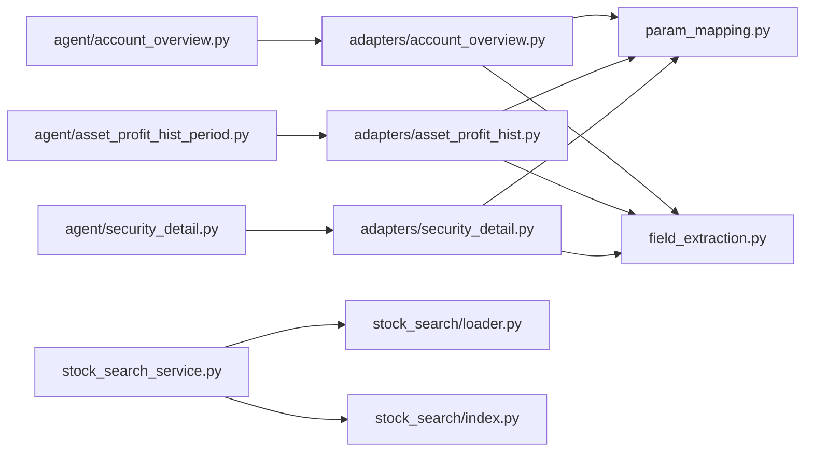

**Diagram sources**
- [account_overview.py:29-96](file://src/ark_agentic/agents/securities/tools/agent/account_overview.py#L29-L96)
- [asset_profit_hist_period.py:14-137](file://src/ark_agentic/agents/securities/tools/agent/asset_profit_hist_period.py#L14-L137)
- [security_detail.py:29-92](file://src/ark_agentic/agents/securities/tools/agent/security_detail.py#L29-L92)
- [account_overview.py:7-52](file://src/ark_agentic/agents/securities/tools/service/adapters/account_overview.py#L7-L52)
- [asset_profit_hist.py:7-42](file://src/ark_agentic/agents/securities/tools/service/adapters/asset_profit_hist.py#L7-L42)
- [security_detail.py:8-49](file://src/ark_agentic/agents/securities/tools/service/adapters/security_detail.py#L8-L49)
- [param_mapping.py:307-436](file://src/ark_agentic/agents/securities/tools/service/param_mapping.py#L307-L436)
- [stock_search_service.py:32-84](file://src/ark_agentic/agents/securities/tools/service/stock_search_service.py#L32-L84)
- [loader.py:74-138](file://src/ark_agentic/agents/securities/tools/service/stock_search/loader.py#L74-L138)
- [index.py:53-148](file://src/ark_agentic/agents/securities/tools/service/stock_search/index.py#L53-L148)

**Section sources**
- [account_overview.py:29-96](file://src/ark_agentic/agents/securities/tools/agent/account_overview.py#L29-L96)
- [asset_profit_hist_period.py:14-137](file://src/ark_agentic/agents/securities/tools/agent/asset_profit_hist_period.py#L14-L137)
- [security_detail.py:29-92](file://src/ark_agentic/agents/securities/tools/agent/security_detail.py#L29-L92)
- [account_overview.py:7-52](file://src/ark_agentic/agents/securities/tools/service/adapters/account_overview.py#L7-L52)
- [asset_profit_hist.py:7-42](file://src/ark_agentic/agents/securities/tools/service/adapters/asset_profit_hist.py#L7-L42)
- [security_detail.py:8-49](file://src/ark_agentic/agents/securities/tools/service/adapters/security_detail.py#L8-L49)
- [param_mapping.py:307-436](file://src/ark_agentic/agents/securities/tools/service/param_mapping.py#L307-L436)
- [stock_search_service.py:32-84](file://src/ark_agentic/agents/securities/tools/service/stock_search_service.py#L32-L84)
- [loader.py:74-138](file://src/ark_agentic/agents/securities/tools/service/stock_search/loader.py#L74-L138)
- [index.py:53-148](file://src/ark_agentic/agents/securities/tools/service/stock_search/index.py#L53-L148)

## Performance Considerations
- Stock search leverages cached StockIndex and mock dividend data to avoid repeated IO
- Period-to-timeType mapping avoids dynamic computation overhead in hot paths
- Adapter normalization consolidates response shaping to reduce downstream branching
- Unified header and body builders minimize duplication and potential errors

[No sources needed since this section provides general guidance]

## Troubleshooting Guide
- Missing validatedata fields: use validate_validatedata_fields to detect missing required fields; mock mode can skip validation
- Authentication failures: ensure headers include validatedata and signature; confirm SERVICE_HEADER_CONFIGS are applied
- Schema validation errors: SecurityDetailAdapter raises ServiceError on invalid data; inspect raw data and schema mapping
- Stock search mismatches: verify query format (6-digit code vs. name/pinyin) and ensure index is built from expected CSV

**Section sources**
- [param_mapping.py:449-479](file://src/ark_agentic/agents/securities/tools/service/param_mapping.py#L449-L479)
- [security_detail.py:51-68](file://src/ark_agentic/agents/securities/tools/service/adapters/security_detail.py#L51-L68)
- [stock_search_service.py:43-84](file://src/ark_agentic/agents/securities/tools/service/stock_search_service.py#L43-L84)

## Conclusion
The Securities Agent tools system provides a robust, extensible framework for financial data retrieval and market analysis. By centralizing parameter mapping and validation, adapters encapsulate backend differences, and stock search offers deterministic, local lookups, the system balances flexibility with reliability. The documented patterns enable consistent tool registration, parameter validation, and service integration across agent tools.

[No sources needed since this section summarizes without analyzing specific files]

## Appendices

### A2UI Presets for Securities
- Reusable extractors for rendering structured outputs in UI components
- Useful for transforming normalized tool results into UI-friendly formats

**Section sources**
- [preset_extractors.py](file://src/ark_agentic/agents/securities/a2ui/preset_extractors.py)

### Securities Domain Overview
- High-level README for the securities domain

**Section sources**
- [README.md](file://src/ark_agentic/agents/securities/README.md)