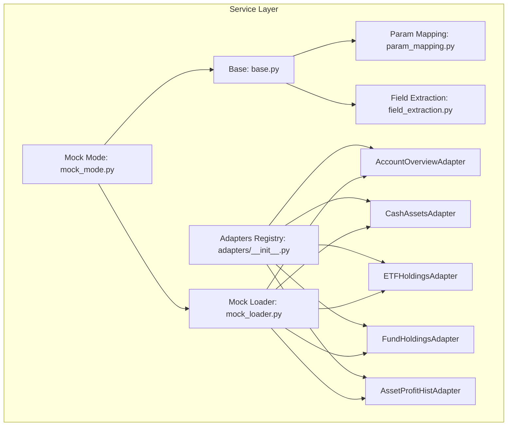
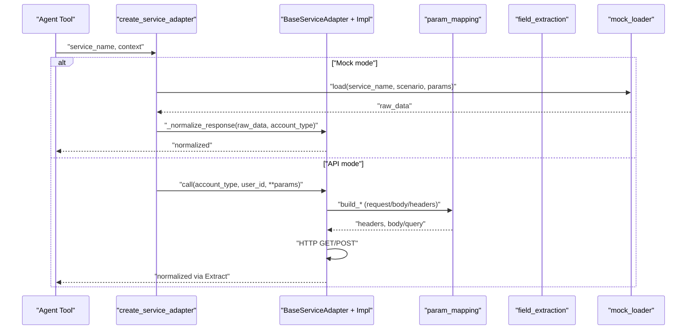
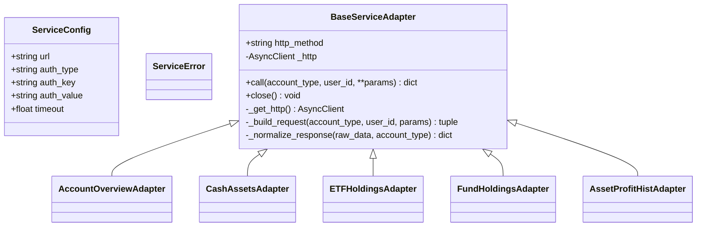
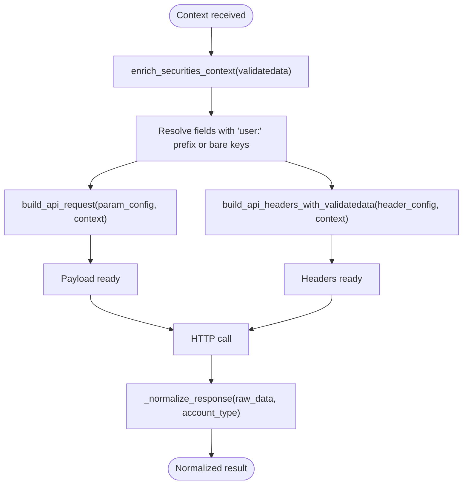
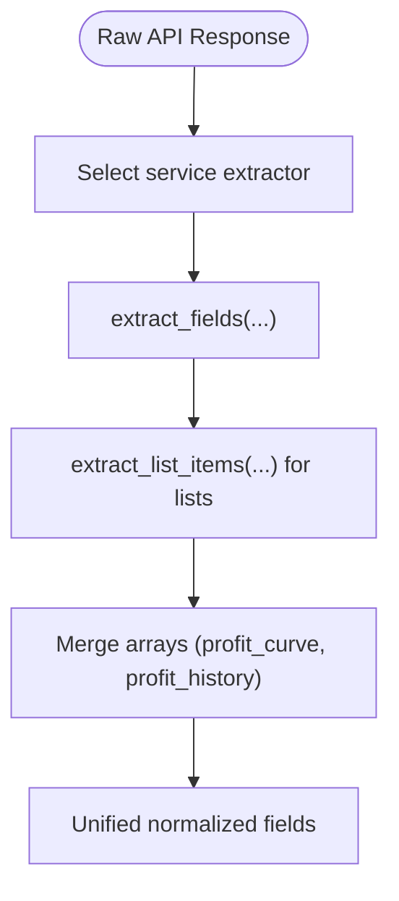
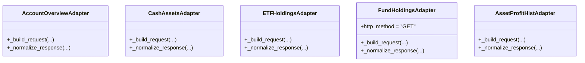
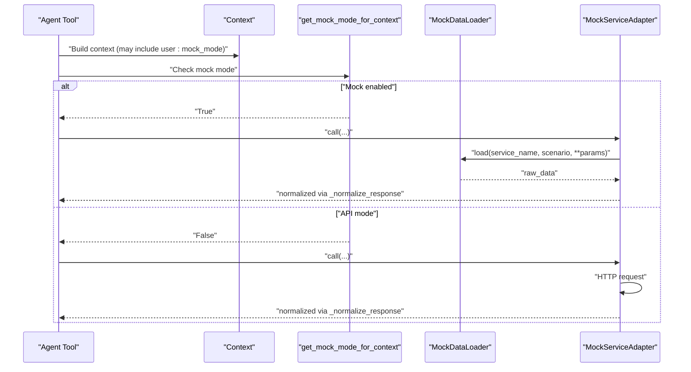
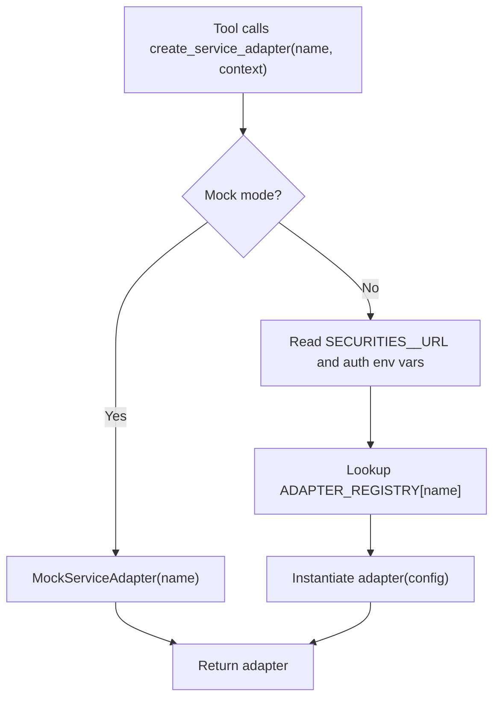
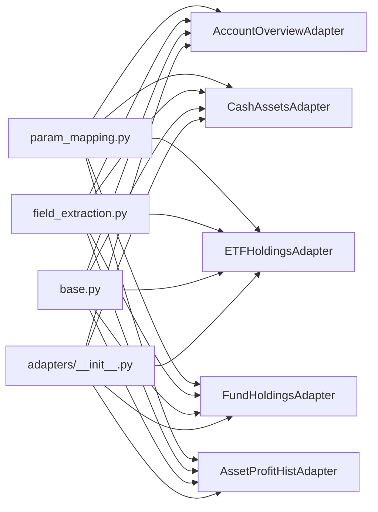

# Service Adapters

<cite>
**Referenced Files in This Document**
- [base.py](file://src/ark_agentic/agents/securities/tools/service/base.py)
- [__init__.py](file://src/ark_agentic/agents/securities/tools/service/__init__.py)
- [field_extraction.py](file://src/ark_agentic/agents/securities/tools/service/field_extraction.py)
- [param_mapping.py](file://src/ark_agentic/agents/securities/tools/service\param_mapping.py)
- [mock_loader.py](file://src/ark_agentic/agents/securities/tools/service/mock_loader.py)
- [mock_mode.py](file://src/ark_agentic/agents/securities/tools/service/mock_mode.py)
- [adapters/__init__.py](file://src/ark_agentic/agents/securities/tools/service/adapters/__init__.py)
- [adapters/account_overview.py](file://src/ark_agentic/agents/securities/tools/service/adapters/account_overview.py)
- [adapters/cash_assets.py](file://src/ark_agentic/agents/securities/tools/service/adapters/cash_assets.py)
- [adapters/etf_holdings.py](file://src/ark_agentic/agents/securities/tools/service/adapters/etf_holdings.py)
- [adapters/fund_holdings.py](file://src/ark_agentic/agents/securities/tools/service/adapters/fund_holdings.py)
- [adapters/asset_profit_hist.py](file://src/ark_agentic/agents/securities/tools/service/adapters/asset_profit_hist.py)
</cite>

## Table of Contents
1. [Introduction](#introduction)
2. [Project Structure](#project-structure)
3. [Core Components](#core-components)
4. [Architecture Overview](#architecture-overview)
5. [Detailed Component Analysis](#detailed-component-analysis)
6. [Dependency Analysis](#dependency-analysis)
7. [Performance Considerations](#performance-considerations)
8. [Troubleshooting Guide](#troubleshooting-guide)
9. [Conclusion](#conclusion)
10. [Appendices](#appendices)

## Introduction
This document describes the Securities Service Adapter layer responsible for transforming raw financial data from external sources into standardized formats consumed by agent tools. It covers the adapter architecture, base classes, individual adapter implementations, data transformation patterns, error handling, and mock mode behavior. It also explains how adapters relate to agent tools via parameter mapping and response formatting, and outlines registration, processing workflows, and integration patterns within the broader securities ecosystem.

## Project Structure
The Securities Service Adapter layer resides under agents/securities/tools/service and is composed of:
- Base infrastructure: base.py defines the adapter base class, configuration, error types, and shared helpers.
- Parameter mapping: param_mapping.py converts context into API requests and headers, including validatedata parsing and enrichment.
- Field extraction: field_extraction.py standardizes raw API responses into display-friendly fields.
- Adapters: adapters/* implement service-specific request building and normalization.
- Mock support: mock_mode.py toggles mock mode; mock_loader.py loads mock data and delegates normalization to the appropriate adapter.
- Public API: service/__init__.py exposes creation utilities and the adapter registry.

**Diagram sources**
- [base.py:1-212](file://src/ark_agentic/agents/securities/tools/service/base.py#L1-L212)
- [param_mapping.py:1-479](file://src/ark_agentic/agents/securities/tools/service/param_mapping.py#L1-L479)
- [field_extraction.py:1-479](file://src/ark_agentic/agents/securities/tools/service/field_extraction.py#L1-L479)
- [adapters/__init__.py:1-40](file://src/ark_agentic/agents/securities/tools/service/adapters/__init__.py#L1-L40)
- [mock_loader.py:1-178](file://src/ark_agentic/agents/securities/tools/service/mock_loader.py#L1-L178)
- [mock_mode.py:1-24](file://src/ark_agentic/agents/securities/tools/service/mock_mode.py#L1-L24)

**Section sources**
- [base.py:1-212](file://src/ark_agentic/agents/securities/tools/service/base.py#L1-L212)
- [__init__.py:1-85](file://src/ark_agentic/agents/securities/tools/service/__init__.py#L1-L85)
- [adapters/__init__.py:1-40](file://src/ark_agentic/agents/securities/tools/service/adapters/__init__.py#L1-L40)

## Core Components
- ServiceConfig: encapsulates endpoint URL, auth scheme/key/value, and timeout.
- ServiceError: domain-specific exception type for service invocation failures.
- BaseServiceAdapter: abstract base providing HTTP client lifecycle, request construction, API call orchestration, and response normalization hooks.
- Shared helpers:
  - require_context_fields: validates presence of required context fields (skipped in mock mode).
  - build_validatedata_request: builds validatedata+signature authenticated requests.
  - check_api_response: validates upstream API status and raises ServiceError on failure.

These components form the foundation for all adapters, ensuring consistent error handling, authentication, and response normalization.

**Section sources**
- [base.py:14-212](file://src/ark_agentic/agents/securities/tools/service/base.py#L14-L212)

## Architecture Overview
The adapter architecture follows a layered pattern:
- Tool layer constructs a context and invokes create_service_adapter to obtain an adapter instance.
- Adapter builds authenticated requests using param_mapping and sends them via BaseServiceAdapter.call.
- Raw responses are normalized by service-specific adapters using field_extraction utilities.
- Mock mode can short-circuit network calls by loading predefined JSON files and delegating normalization to the same adapters.

**Diagram sources**
- [__init__.py:39-85](file://src/ark_agentic/agents/securities/tools/service/__init__.py#L39-L85)
- [base.py:55-131](file://src/ark_agentic/agents/securities/tools/service/base.py#L55-L131)
- [param_mapping.py:38-118](file://src/ark_agentic/agents/securities/tools/service/param_mapping.py#L38-L118)
- [field_extraction.py:12-34](file://src/ark_agentic/agents/securities/tools/service/field_extraction.py#L12-L34)
- [mock_loader.py:118-178](file://src/ark_agentic/agents/securities/tools/service/mock_loader.py#L118-L178)

## Detailed Component Analysis

### Base Adapter Infrastructure
- ServiceConfig: centralizes endpoint and auth configuration.
- ServiceError: standardizes error reporting for downstream handling.
- BaseServiceAdapter:
  - Manages an AsyncClient with timeouts.
  - Implements call(account_type, user_id, **params): builds headers/payload, performs HTTP request, checks status, parses JSON, and delegates normalization.
  - Provides _build_request hook for subclasses to customize payload and headers.
  - Provides _normalize_response abstract hook for service-specific normalization.
  - Includes require_context_fields and build_validatedata_request helpers for consistent auth and validation.

**Diagram sources**
- [base.py:14-131](file://src/ark_agentic/agents/securities/tools/service/base.py#L14-L131)
- [adapters/account_overview.py:15-61](file://src/ark_agentic/agents/securities/tools/service/adapters/account_overview.py#L15-L61)
- [adapters/cash_assets.py:15-61](file://src/ark_agentic/agents/securities/tools/service/adapters/cash_assets.py#L15-L61)
- [adapters/etf_holdings.py:15-58](file://src/ark_agentic/agents/securities/tools/service/adapters/etf_holdings.py#L15-L58)
- [adapters/fund_holdings.py:18-75](file://src/ark_agentic/agents/securities/tools/service/adapters/fund_holdings.py#L18-L75)
- [adapters/asset_profit_hist.py:17-51](file://src/ark_agentic/agents/securities/tools/service/adapters/asset_profit_hist.py#L17-L51)

**Section sources**
- [base.py:14-131](file://src/ark_agentic/agents/securities/tools/service/base.py#L14-L131)

### Parameter Mapping and Context Enrichment
- Context resolution:
  - Prefers keys with user: prefix; falls back to bare keys.
  - enrich_securities_context parses validatedata into user:* fields and infers account_type from loginflag if not explicit.
- Request building:
  - build_api_request maps flat context into nested API bodies using path-like keys (e.g., body.accountType).
  - build_api_headers_with_validatedata composes validatedata and signature headers.
- Service-specific configs:
  - SERVICE_PARAM_CONFIGS and SERVICE_HEADER_CONFIGS define how each service consumes context and constructs requests.
  - Specialized adapters may override _build_request to inject additional context (e.g., account_type).

**Diagram sources**
- [param_mapping.py:210-235](file://src/ark_agentic/agents/securities/tools/service/param_mapping.py#L210-L235)
- [param_mapping.py:38-118](file://src/ark_agentic/agents/securities/tools/service/param_mapping.py#L38-L118)
- [param_mapping.py:256-302](file://src/ark_agentic/agents/securities/tools/service/param_mapping.py#L256-L302)

**Section sources**
- [param_mapping.py:13-36](file://src/ark_agentic/agents/securities/tools/service/param_mapping.py#L13-L36)
- [param_mapping.py:210-235](file://src/ark_agentic/agents/securities/tools/service/param_mapping.py#L210-L235)
- [param_mapping.py:305-435](file://src/ark_agentic/agents/securities/tools/service/param_mapping.py#L305-L435)

### Field Extraction and Normalization
- extract_fields and _get_by_path provide robust nested field extraction.
- Service-specific extractors:
  - Account overview: extracts balances, positions, and rzrq assets info.
  - Cash assets: adds derived settlement_date and extracts balances and frozen assets.
  - ETF holdings: extracts summary and list items, including day profit and rates.
  - HKSC holdings: supports both stock list and pre-frozen list.
  - Fund holdings: expects pre-normalized snake_case data and maps to a unified stock_list format.
  - Asset profit history: merges trade dates, profits, and assets into a profit_curve list; handles margin vs normal accounts.
  - Stock daily profit: merges parallel arrays into profit_history.
  - Stock profit ranking: extracts summary counts and ranks.

**Diagram sources**
- [field_extraction.py:12-34](file://src/ark_agentic/agents/securities/tools/service/field_extraction.py#L12-L34)
- [field_extraction.py:61-89](file://src/ark_agentic/agents/securities/tools/service/field_extraction.py#L61-L89)
- [field_extraction.py:154-199](file://src/ark_agentic/agents/securities/tools/service/field_extraction.py#L154-L199)
- [field_extraction.py:350-391](file://src/ark_agentic/agents/securities/tools/service/field_extraction.py#L350-L391)

**Section sources**
- [field_extraction.py:61-479](file://src/ark_agentic/agents/securities/tools/service/field_extraction.py#L61-L479)

### Adapter Implementations
- AccountOverviewAdapter: validatedata+signature authenticated; uses unified header config; normalizes account overview fields.
- CashAssetsAdapter: similar to account overview but targets cash-related metrics.
- ETFHoldingsAdapter: validatedata+signature authenticated; normalizes ETF holdings summary and list items.
- FundHoldingsAdapter: HTTP GET with query params (usercode, channel); validates raw data against a schema and then normalizes to unified format.
- AssetProfitHistAdapter: uses build_validatedata_request helper; normalizes profit curves with account-type awareness.

**Diagram sources**
- [adapters/account_overview.py:15-61](file://src/ark_agentic/agents/securities/tools/service/adapters/account_overview.py#L15-L61)
- [adapters/cash_assets.py:15-61](file://src/ark_agentic/agents/securities/tools/service/adapters/cash_assets.py#L15-L61)
- [adapters/etf_holdings.py:15-58](file://src/ark_agentic/agents/securities/tools/service/adapters/etf_holdings.py#L15-L58)
- [adapters/fund_holdings.py:18-75](file://src/ark_agentic/agents/securities/tools/service/adapters/fund_holdings.py#L18-L75)
- [adapters/asset_profit_hist.py:17-51](file://src/ark_agentic/agents/securities/tools/service/adapters/asset_profit_hist.py#L17-L51)

**Section sources**
- [adapters/account_overview.py:15-61](file://src/ark_agentic/agents/securities/tools/service/adapters/account_overview.py#L15-L61)
- [adapters/cash_assets.py:15-61](file://src/ark_agentic/agents/securities/tools/service/adapters/cash_assets.py#L15-L61)
- [adapters/etf_holdings.py:15-58](file://src/ark_agentic/agents/securities/tools/service/adapters/etf_holdings.py#L15-L58)
- [adapters/fund_holdings.py:18-75](file://src/ark_agentic/agents/securities/tools/service/adapters/fund_holdings.py#L18-L75)
- [adapters/asset_profit_hist.py:17-51](file://src/ark_agentic/agents/securities/tools/service/adapters/asset_profit_hist.py#L17-L51)

### Mock Mode and Mock Loader
- Mock mode detection:
  - get_mock_mode reads a service-wide environment flag.
  - get_mock_mode_for_context resolves per-request overrides from context (user:mock_mode or mock_mode).
- Mock loader:
  - Loads JSON files from agents/securities/mock_data/<service>/<scenario>.json.
  - Supports service-specific scenarios (e.g., margin_user vs normal_user) and security-code-specific files.
  - Delegates normalization to the real adapter to keep mock responses consistent with production shape.
- MockServiceAdapter:
  - Implements call and _normalize_response to bypass network and return mock data.

**Diagram sources**
- [mock_mode.py:7-24](file://src/ark_agentic/agents/securities/tools/service/mock_mode.py#L7-L24)
- [mock_loader.py:118-178](file://src/ark_agentic/agents/securities/tools/service/mock_loader.py#L118-L178)
- [__init__.py:39-85](file://src/ark_agentic/agents/securities/tools/service/__init__.py#L39-L85)

**Section sources**
- [mock_mode.py:1-24](file://src/ark_agentic/agents/securities/tools/service/mock_mode.py#L1-L24)
- [mock_loader.py:17-178](file://src/ark_agentic/agents/securities/tools/service/mock_loader.py#L17-L178)

### Adapter Registration and Tool Wiring
- ADAPTER_REGISTRY maps service names to adapter classes.
- create_service_adapter selects either a real adapter (from registry) or a MockServiceAdapter based on mock mode and environment variables.
- Tools invoke create_service_adapter with a service name and context; the returned adapter handles the rest.

**Diagram sources**
- [__init__.py:39-85](file://src/ark_agentic/agents/securities/tools/service/__init__.py#L39-L85)
- [adapters/__init__.py:14-25](file://src/ark_agentic/agents/securities/tools/service/adapters/__init__.py#L14-L25)

**Section sources**
- [__init__.py:39-85](file://src/ark_agentic/agents/securities/tools/service/__init__.py#L39-L85)
- [adapters/__init__.py:14-25](file://src/ark_agentic/agents/securities/tools/service/adapters/__init__.py#L14-L25)

## Dependency Analysis
- Cohesion: Each adapter focuses on a single service, reusing shared param_mapping and field_extraction utilities.
- Coupling: Adapters depend on BaseServiceAdapter and on shared helpers; adapters are decoupled from the network layer via the base class.
- External dependencies: httpx for async HTTP; pydantic for schema validation in FundHoldingsAdapter.
- Adapter registry centralizes instantiation and enables dynamic selection by service name.

**Diagram sources**
- [param_mapping.py:1-479](file://src/ark_agentic/agents/securities/tools/service/param_mapping.py#L1-L479)
- [field_extraction.py:1-479](file://src/ark_agentic/agents/securities/tools/service/field_extraction.py#L1-L479)
- [base.py:1-212](file://src/ark_agentic/agents/securities/tools/service/base.py#L1-L212)
- [adapters/__init__.py:1-40](file://src/ark_agentic/agents/securities/tools/service/adapters/__init__.py#L1-L40)

**Section sources**
- [param_mapping.py:305-435](file://src/ark_agentic/agents/securities/tools/service/param_mapping.py#L305-L435)
- [field_extraction.py:443-479](file://src/ark_agentic/agents/securities/tools/service/field_extraction.py#L443-L479)
- [adapters/__init__.py:14-25](file://src/ark_agentic/agents/securities/tools/service/adapters/__init__.py#L14-L25)

## Performance Considerations
- HTTP client reuse: BaseServiceAdapter lazily creates and reuses an AsyncClient to reduce connection overhead.
- Minimal allocations: Field extraction uses targeted mapping and avoids unnecessary copies.
- Schema validation: FundHoldingsAdapter validates raw data once before normalization; consider caching validated schemas if repeated calls are common.
- Mock mode: Reduces latency and avoids network dependencies during testing and development.

## Troubleshooting Guide
Common issues and resolutions:
- Missing environment variables: create_service_adapter raises if SECURITIES_<SERVICE>_URL is not set; ensure proper configuration.
- Authentication failures: BaseServiceAdapter logs request payload and response text; inspect logs for HTTP status and messages.
- API errors: check_api_response raises ServiceError when upstream status indicates failure; verify validatedata and signature correctness.
- Context validation: require_context_fields raises ValueError if required fields are missing; confirm validatedata parsing and account_type inference.
- Mock data not found: MockDataLoader warns and returns minimal data; ensure mock files exist under the expected directory structure.

Operational tips:
- Enable mock mode for local development to avoid network dependencies.
- Use service-specific scenarios (e.g., margin_user) to simulate different account types.
- Verify adapter registry entries and service names to prevent unknown service errors.

**Section sources**
- [base.py:55-131](file://src/ark_agentic/agents/securities/tools/service/base.py#L55-L131)
- [base.py:202-212](file://src/ark_agentic/agents/securities/tools/service/base.py#L202-L212)
- [__init__.py:65-70](file://src/ark_agentic/agents/securities/tools/service/__init__.py#L65-L70)
- [mock_loader.py:31-82](file://src/ark_agentic/agents/securities/tools/service/mock_loader.py#L31-L82)

## Conclusion
The Securities Service Adapter layer provides a consistent, extensible framework for integrating diverse financial data sources. By centralizing authentication, parameter mapping, and response normalization, it ensures that agent tools receive standardized, predictable data regardless of the underlying service. Mock mode and a registry-based adapter selection simplify development, testing, and deployment across varied environments.

## Appendices

### Adapter Registration and Environment Variables
- Adapter registry: ADAPTER_REGISTRY maps service names to adapter classes.
- Environment variables:
  - SECURITIES_<SERVICE>_URL: endpoint URL for the service.
  - SECURITIES_<SERVICE>_AUTH_TYPE: auth scheme (e.g., header).
  - SECURITIES_<SERVICE>_AUTH_KEY: header key or payload key.
  - SECURITIES_<SERVICE>_AUTH_VALUE: auth value.
  - SECURITIES_SERVICE_MOCK: service-wide mock toggle.

**Section sources**
- [adapters/__init__.py:14-25](file://src/ark_agentic/agents/securities/tools/service/adapters/__init__.py#L14-L25)
- [__init__.py:65-78](file://src/ark_agentic/agents/securities/tools/service/__init__.py#L65-L78)