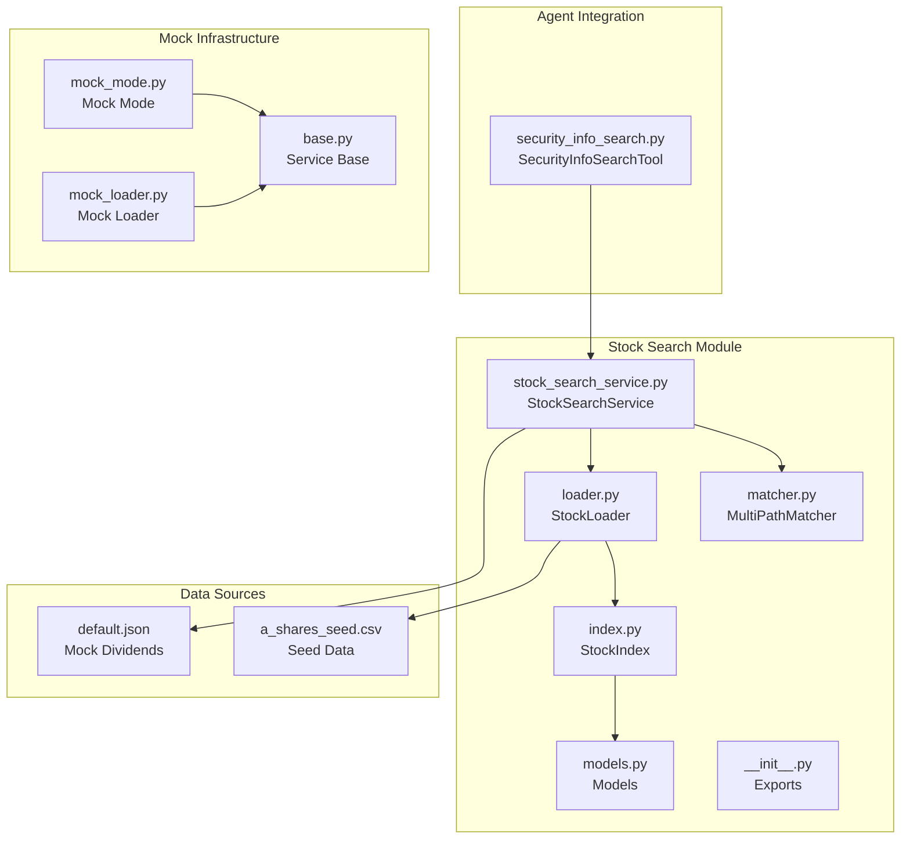
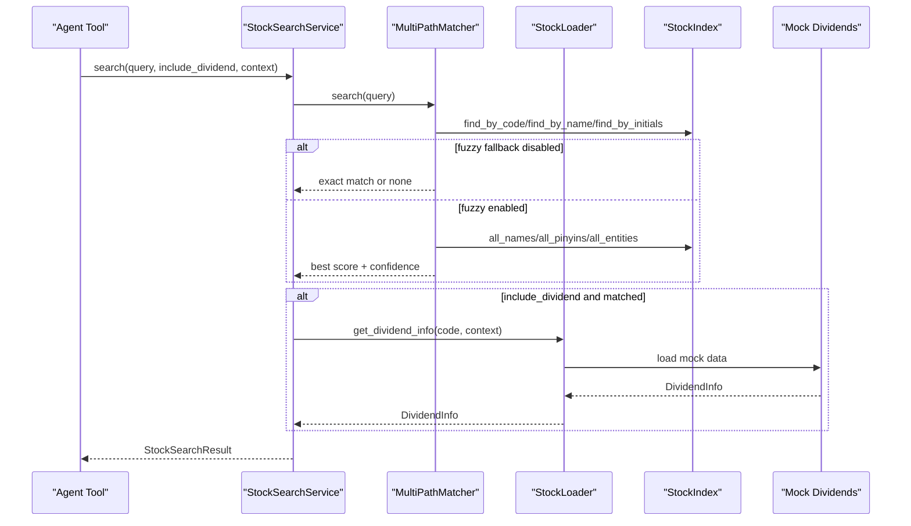
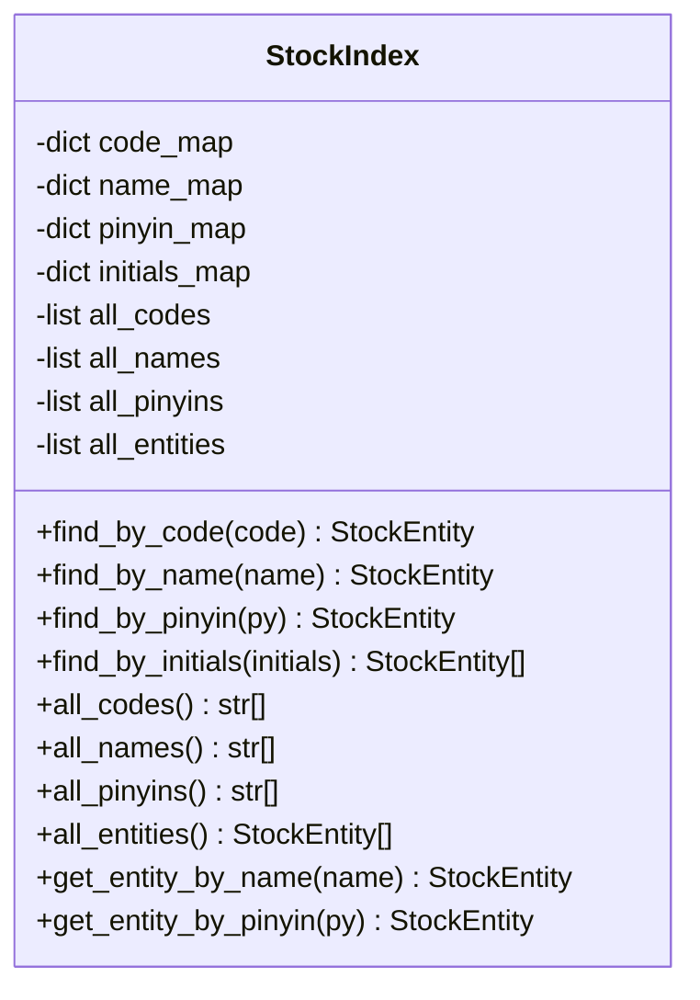
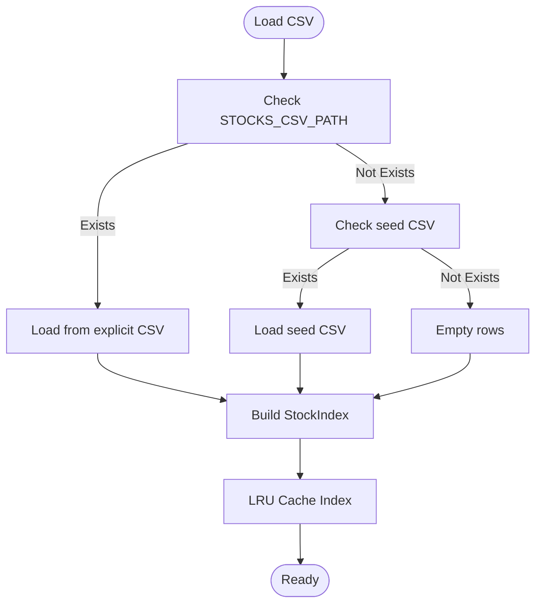
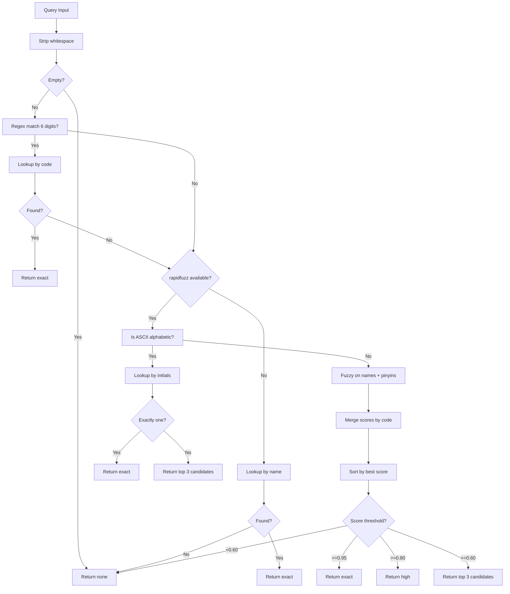
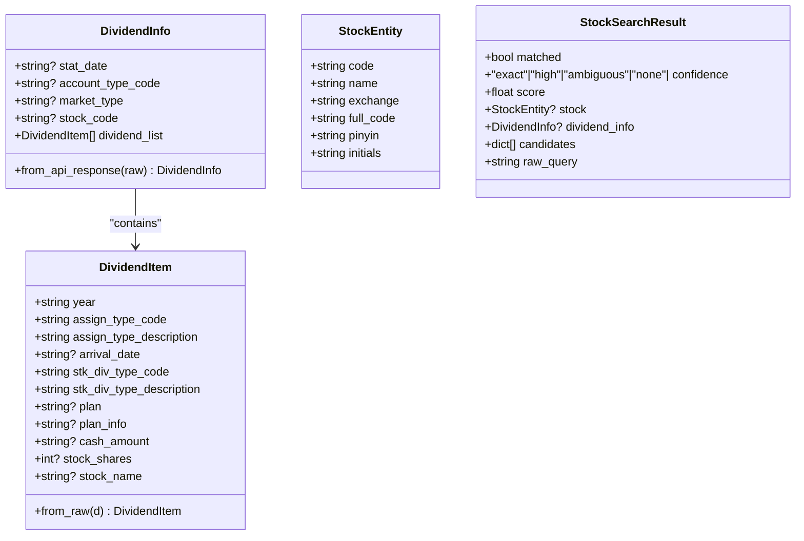
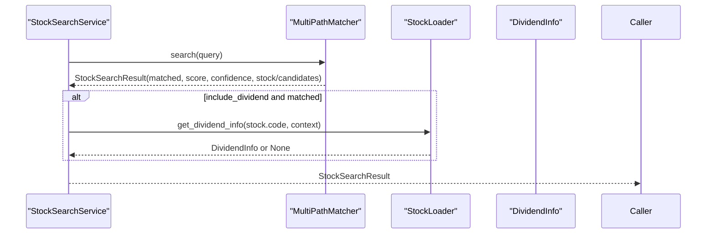
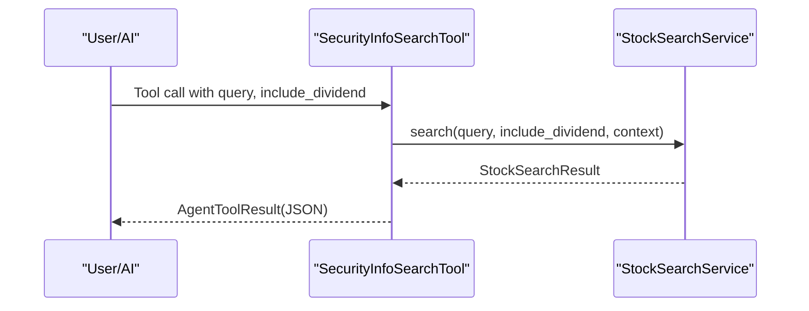

# Stock Search Service

<cite>
**Referenced Files in This Document**
- [stock_search/__init__.py](file://src/ark_agentic/agents/securities/tools/service/stock_search/__init__.py)
- [index.py](file://src/ark_agentic/agents/securities/tools/service/stock_search/index.py)
- [loader.py](file://src/ark_agentic/agents/securities/tools/service/stock_search/loader.py)
- [matcher.py](file://src/ark_agentic/agents/securities/tools/service/stock_search/matcher.py)
- [models.py](file://src/ark_agentic/agents/securities/tools/service/stock_search/models.py)
- [stock_search_service.py](file://src/ark_agentic/agents/securities/tools/service/stock_search_service.py)
- [security_info_search.py](file://src/ark_agentic/agents/securities/tools/agent/security_info_search.py)
- [base.py](file://src/ark_agentic/agents/securities/tools/service/base.py)
- [mock_mode.py](file://src/ark_agentic/agents/securities/tools/service/mock_mode.py)
- [mock_loader.py](file://src/ark_agentic/agents/securities/tools/service/mock_loader.py)
- [a_shares_seed.csv](file://src/ark_agentic/agents/securities/mock_data/stocks/a_shares_seed.csv)
- [default.json](file://src/ark_agentic/agents/securities/mock_data/dividends/default.json)
</cite>

## Table of Contents
1. [Introduction](#introduction)
2. [Project Structure](#project-structure)
3. [Core Components](#core-components)
4. [Architecture Overview](#architecture-overview)
5. [Detailed Component Analysis](#detailed-component-analysis)
6. [Dependency Analysis](#dependency-analysis)
7. [Performance Considerations](#performance-considerations)
8. [Troubleshooting Guide](#troubleshooting-guide)
9. [Conclusion](#conclusion)
10. [Appendices](#appendices)

## Introduction
The Stock Search Service provides efficient stock identification and selection capabilities for the securities domain. It enables precise and fuzzy matching against a curated A-share dataset, supports Chinese character-to-pinyin and initials-based search, and integrates seamlessly with the broader securities agent ecosystem. The service offers:
- Fast offline indexing with O(1) exact lookups
- Multi-path fuzzy matching leveraging rapidfuzz and phonetic transformations
- Configurable mock mode for development and testing
- Optional dividend information retrieval aligned with downstream tool execution

## Project Structure
The stock search capability is organized under the securities tools service module, with clear separation of concerns:
- Indexing and data structures: builds in-memory maps and vectors
- Loading and caching: CSV-based data loading with LRU cache
- Matching and scoring: multi-path pipeline with confidence thresholds
- Models: strongly typed data models for entities and results
- Service wrapper: orchestrates search and optional dividend lookup
- Agent tool: exposes the service as a callable tool for agents



**Diagram sources**
- [stock_search/__init__.py:1-16](file://src/ark_agentic/agents/securities/tools/service/stock_search/__init__.py#L1-L16)
- [index.py:1-148](file://src/ark_agentic/agents/securities/tools/service/stock_search/index.py#L1-L148)
- [loader.py:1-138](file://src/ark_agentic/agents/securities/tools/service/stock_search/loader.py#L1-L138)
- [matcher.py:1-239](file://src/ark_agentic/agents/securities/tools/service/stock_search/matcher.py#L1-L239)
- [models.py:1-136](file://src/ark_agentic/agents/securities/tools/service/stock_search/models.py#L1-L136)
- [stock_search_service.py:1-84](file://src/ark_agentic/agents/securities/tools/service/stock_search_service.py#L1-L84)
- [security_info_search.py:1-79](file://src/ark_agentic/agents/securities/tools/agent/security_info_search.py#L1-L79)
- [mock_mode.py:1-24](file://src/ark_agentic/agents/securities/tools/service/mock_mode.py#L1-L24)
- [mock_loader.py:1-178](file://src/ark_agentic/agents/securities/tools/service/mock_loader.py#L1-L178)
- [base.py:1-212](file://src/ark_agentic/agents/securities/tools/service/base.py#L1-L212)
- [a_shares_seed.csv:1-800](file://src/ark_agentic/agents/securities/mock_data/stocks/a_shares_seed.csv#L1-L800)
- [default.json:1-63](file://src/ark_agentic/agents/securities/mock_data/dividends/default.json#L1-L63)

**Section sources**
- [stock_search/__init__.py:1-16](file://src/ark_agentic/agents/securities/tools/service/stock_search/__init__.py#L1-L16)
- [stock_search_service.py:1-84](file://src/ark_agentic/agents/securities/tools/service/stock_search_service.py#L1-L84)
- [security_info_search.py:1-79](file://src/ark_agentic/agents/securities/tools/agent/security_info_search.py#L1-L79)

## Core Components
- StockIndex: Builds in-memory maps for exact lookups by code, name, pinyin, and initials; exposes vectors for batch fuzzy matching.
- StockLoader: Loads CSV data (explicit path or seed), caches index, and provides mock dividend info via JSON.
- MultiPathMatcher: Implements a three-path matching pipeline (code, initials, fuzzy) with confidence thresholds and candidate selection.
- Models: Defines typed entities (StockEntity), results (StockSearchResult), and dividend structures (DividendInfo, DividendItem).
- StockSearchService: Wraps loader and matcher, orchestrating search and optional dividend retrieval with timing logs.
- SecurityInfoSearchTool: Agent-facing tool that invokes the service and returns structured results.

**Section sources**
- [index.py:53-148](file://src/ark_agentic/agents/securities/tools/service/stock_search/index.py#L53-L148)
- [loader.py:74-138](file://src/ark_agentic/agents/securities/tools/service/stock_search/loader.py#L74-L138)
- [matcher.py:59-239](file://src/ark_agentic/agents/securities/tools/service/stock_search/matcher.py#L59-L239)
- [models.py:103-136](file://src/ark_agentic/agents/securities/tools/service/stock_search/models.py#L103-L136)
- [stock_search_service.py:32-84](file://src/ark_agentic/agents/securities/tools/service/stock_search_service.py#L32-L84)
- [security_info_search.py:19-79](file://src/ark_agentic/agents/securities/tools/agent/security_info_search.py#L19-L79)

## Architecture Overview
The system follows a layered design:
- Data ingestion: CSV rows transformed into StockEntity instances and indexed.
- Matching pipeline: Exact code match, followed by initials lookup, then fuzzy name/pinyin matching with combined scoring.
- Confidence-based decisions: Thresholds determine exact matches, high-confidence matches, ambiguous candidates, or none.
- Optional enrichment: Dividend info fetched when requested and mock mode is enabled.



**Diagram sources**
- [stock_search_service.py:43-84](file://src/ark_agentic/agents/securities/tools/service/stock_search_service.py#L43-L84)
- [matcher.py:70-239](file://src/ark_agentic/agents/securities/tools/service/stock_search/matcher.py#L70-L239)
- [loader.py:102-131](file://src/ark_agentic/agents/securities/tools/service/stock_search/loader.py#L102-L131)
- [index.py:110-144](file://src/ark_agentic/agents/securities/tools/service/stock_search/index.py#L110-L144)

## Detailed Component Analysis

### StockIndex: Offline Indexing and Lookup
StockIndex constructs four in-memory maps:
- code_map: maps six-digit codes to entities
- name_map: maps full names to entities
- pinyin_map: maps computed full pinyins to entities
- initials_map: maps initial-letter abbreviations to lists of entities

It also maintains parallel vectors for batch fuzzy matching:
- all_codes, all_names, all_pinyins, all_entities

Key behaviors:
- Exchange inference from code prefixes
- Pinyin conversion with graceful fallback when pypinyin is unavailable
- Initials extraction for acronym-based matching
- O(1) exact lookups; vectorized fuzzy matching support



**Diagram sources**
- [index.py:53-148](file://src/ark_agentic/agents/securities/tools/service/stock_search/index.py#L53-L148)

**Section sources**
- [index.py:19-148](file://src/ark_agentic/agents/securities/tools/service/stock_search/index.py#L19-L148)

### StockLoader: Data Loading and Caching
StockLoader handles:
- CSV loading priority: explicit STOCKS_CSV_PATH > built-in seed CSV
- Lazy initialization of StockIndex with LRU caching
- Mock dividend data loading from default.json with LRU caching
- Context-aware mock mode resolution



**Diagram sources**
- [loader.py:61-71](file://src/ark_agentic/agents/securities/tools/service/stock_search/loader.py#L61-L71)
- [a_shares_seed.csv:1-800](file://src/ark_agentic/agents/securities/mock_data/stocks/a_shares_seed.csv#L1-L800)

**Section sources**
- [loader.py:74-138](file://src/ark_agentic/agents/securities/tools/service/stock_search/loader.py#L74-L138)
- [mock_mode.py:7-24](file://src/ark_agentic/agents/securities/tools/service/mock_mode.py#L7-L24)

### MultiPathMatcher: Multi-Path Matching and Scoring
The matcher implements a deterministic pipeline:
1) Exact code match (regex /^\d{6}$/)
2) Initials exact match (ASCII letters only)
3) Fuzzy matching via rapidfuzz.WRatio on names and pinyins
4) Combined scoring with slight bonus for initial-letter overlap
5) Confidence thresholds:
   - exact: score ≥ 0.95
   - high: 0.80 ≤ score < 0.95
   - ambiguous: 0.60 ≤ score < 0.80 (returns top 3 candidates)
   - none: score < 0.60



**Diagram sources**
- [matcher.py:70-239](file://src/ark_agentic/agents/securities/tools/service/stock_search/matcher.py#L70-L239)
- [index.py:110-144](file://src/ark_agentic/agents/securities/tools/service/stock_search/index.py#L110-L144)

**Section sources**
- [matcher.py:59-239](file://src/ark_agentic/agents/securities/tools/service/stock_search/matcher.py#L59-L239)

### Models: Typed Data Structures
Models define:
- DividendItem: normalized per-year dividend records
- DividendInfo: container for dividend list and metadata
- StockEntity: basic stock identity (code, name, exchange, derived pinyin/initials)
- StockSearchResult: unified result with matched flag, confidence, score, optional stock, optional dividend info, and candidates



**Diagram sources**
- [models.py:41-136](file://src/ark_agentic/agents/securities/tools/service/stock_search/models.py#L41-L136)

**Section sources**
- [models.py:1-136](file://src/ark_agentic/agents/securities/tools/service/stock_search/models.py#L1-L136)

### StockSearchService: Orchestration and Timing
StockSearchService:
- Lazily initializes a process-wide StockLoader singleton
- Delegates search to MultiPathMatcher
- Optionally enriches results with DividendInfo when matched and include_dividend is true
- Logs matcher and dividend retrieval durations



**Diagram sources**
- [stock_search_service.py:43-84](file://src/ark_agentic/agents/securities/tools/service/stock_search_service.py#L43-L84)
- [matcher.py:70-239](file://src/ark_agentic/agents/securities/tools/service/stock_search/matcher.py#L70-L239)
- [loader.py:102-131](file://src/ark_agentic/agents/securities/tools/service/stock_search/loader.py#L102-L131)

**Section sources**
- [stock_search_service.py:32-84](file://src/ark_agentic/agents/securities/tools/service/stock_search_service.py#L32-L84)

### SecurityInfoSearchTool: Agent Integration
SecurityInfoSearchTool:
- Exposes the search capability as an agent tool
- Accepts query and include_dividend parameters
- Returns structured JSON results with metadata updates for agent state



**Diagram sources**
- [security_info_search.py:55-79](file://src/ark_agentic/agents/securities/tools/agent/security_info_search.py#L55-L79)
- [stock_search_service.py:43-84](file://src/ark_agentic/agents/securities/tools/service/stock_search_service.py#L43-L84)

**Section sources**
- [security_info_search.py:19-79](file://src/ark_agentic/agents/securities/tools/agent/security_info_search.py#L19-L79)

## Dependency Analysis
The module exhibits low coupling and high cohesion:
- index.py depends on models.py for entity definitions
- loader.py depends on index.py and mock_mode.py
- matcher.py depends on index.py and models.py
- stock_search_service.py composes loader and matcher
- security_info_search.py depends on stock_search_service.py
- mock_loader.py and mock_mode.py integrate with the broader service infrastructure

```mermaid
graph LR
Models["models.py"] <- --> Index["index.py"]
Index <- --> Loader["loader.py"]
Index <- --> Matcher["matcher.py"]
Loader <- --> Service["stock_search_service.py"]
Matcher --> Service
Service --> Tool["security_info_search.py"]
MockMode["mock_mode.py"] --> Loader
MockLoader["mock_loader.py"] --> Service
Base["base.py"] --> MockLoader
```

**Diagram sources**
- [models.py:1-136](file://src/ark_agentic/agents/securities/tools/service/stock_search/models.py#L1-L136)
- [index.py:1-148](file://src/ark_agentic/agents/securities/tools/service/stock_search/index.py#L1-L148)
- [loader.py:1-138](file://src/ark_agentic/agents/securities/tools/service/stock_search/loader.py#L1-L138)
- [matcher.py:1-239](file://src/ark_agentic/agents/securities/tools/service/stock_search/matcher.py#L1-L239)
- [stock_search_service.py:1-84](file://src/ark_agentic/agents/securities/tools/service/stock_search_service.py#L1-L84)
- [security_info_search.py:1-79](file://src/ark_agentic/agents/securities/tools/agent/security_info_search.py#L1-L79)
- [mock_mode.py:1-24](file://src/ark_agentic/agents/securities/tools/service/mock_mode.py#L1-L24)
- [mock_loader.py:1-178](file://src/ark_agentic/agents/securities/tools/service/mock_loader.py#L1-L178)
- [base.py:1-212](file://src/ark_agentic/agents/securities/tools/service/base.py#L1-L212)

**Section sources**
- [stock_search/__init__.py:1-16](file://src/ark_agentic/agents/securities/tools/service/stock_search/__init__.py#L1-L16)
- [base.py:1-212](file://src/ark_agentic/agents/securities/tools/service/base.py#L1-L212)

## Performance Considerations
- Indexing cost: Single-pass CSV load and index construction; subsequent lookups are O(1).
- Fuzzy matching cost: Batch extraction with rapidfuzz.WRatio; performance scales with TOP_N and vocabulary size.
- Caching: LRU caches for default index and mock dividends reduce repeated IO.
- Memory footprint: Four hash maps plus parallel vectors; suitable for typical A-share datasets.
- Recommendations:
  - Prefer exact code queries for fastest results.
  - Limit TOP_N for ambiguous queries to reduce computation.
  - Ensure rapidfuzz is installed for optimal fuzzy performance.
  - Use environment variables to preload CSV and enable mock mode during development.

[No sources needed since this section provides general guidance]

## Troubleshooting Guide
Common issues and resolutions:
- No results returned:
  - Verify query format (code vs. name/pinyin).
  - Confirm CSV path or seed availability.
  - Check mock mode settings if expecting dividend data.
- Slow fuzzy matching:
  - Install rapidfuzz for WRatio-based matching.
  - Reduce TOP_N or disable include_dividend to minimize work.
- Incorrect exchange inference:
  - Ensure code follows expected prefixes; otherwise supply explicit exchange in CSV.
- Mock dividend data not loaded:
  - Confirm default.json exists and is valid.
  - Validate SECURITIES_SERVICE_MOCK setting.

**Section sources**
- [matcher.py:35-42](file://src/ark_agentic/agents/securities/tools/service/stock_search/matcher.py#L35-L42)
- [loader.py:102-131](file://src/ark_agentic/agents/securities/tools/service/stock_search/loader.py#L102-L131)
- [mock_mode.py:7-24](file://src/ark_agentic/agents/securities/tools/service/mock_mode.py#L7-L24)
- [default.json:1-63](file://src/ark_agentic/agents/securities/mock_data/dividends/default.json#L1-L63)

## Conclusion
The Stock Search Service delivers robust, fast, and flexible stock identification tailored for the securities domain. Its offline indexing, multi-path matching, and mock-friendly design enable reliable agent-driven workflows while maintaining clear separation between data loading, matching, and orchestration. Integration with SecurityInfoSearchTool ensures seamless downstream tool execution and agent state updates.

[No sources needed since this section summarizes without analyzing specific files]

## Appendices

### Search Workflow Examples
- Exact code search: "600519" → exact match via code_map
- Acronym search: "gzm" → initials_map lookup
- Fuzzy search: "maotai" → fuzzy on names and pinyins, combined scoring
- Ambiguous results: "nongye" → top 3 candidates returned

**Section sources**
- [matcher.py:115-239](file://src/ark_agentic/agents/securities/tools/service/stock_search/matcher.py#L115-L239)
- [index.py:110-144](file://src/ark_agentic/agents/securities/tools/service/stock_search/index.py#L110-L144)

### Configuration and Environment Variables
- STOCKS_CSV_PATH: explicit CSV path override
- SECURITIES_SERVICE_MOCK: toggles mock mode for dividends
- SECURITIES_SERVICE_MOCK_URL: service URL for mock adapter (integration context)

**Section sources**
- [loader.py:64-89](file://src/ark_agentic/agents/securities/tools/service/stock_search/loader.py#L64-L89)
- [mock_mode.py:7-24](file://src/ark_agentic/agents/securities/tools/service/mock_mode.py#L7-L24)
- [base.py:39-84](file://src/ark_agentic/agents/securities/tools/service/base.py#L39-L84)

### Relationship to Downstream Tools
- SecurityInfoSearchTool invokes StockSearchService and returns results for agent consumption.
- When include_dividend is true, StockSearchService fetches DividendInfo via StockLoader.
- Mock mode allows deterministic testing without external APIs.

**Section sources**
- [security_info_search.py:55-79](file://src/ark_agentic/agents/securities/tools/agent/security_info_search.py#L55-L79)
- [stock_search_service.py:71-82](file://src/ark_agentic/agents/securities/tools/service/stock_search_service.py#L71-L82)
- [loader.py:102-131](file://src/ark_agentic/agents/securities/tools/service/stock_search/loader.py#L102-L131)