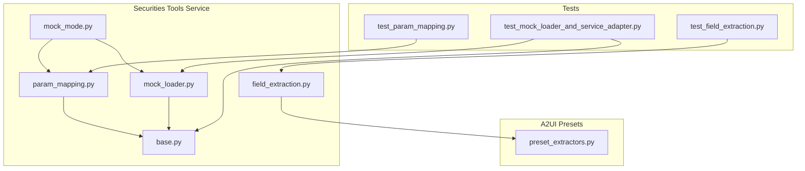
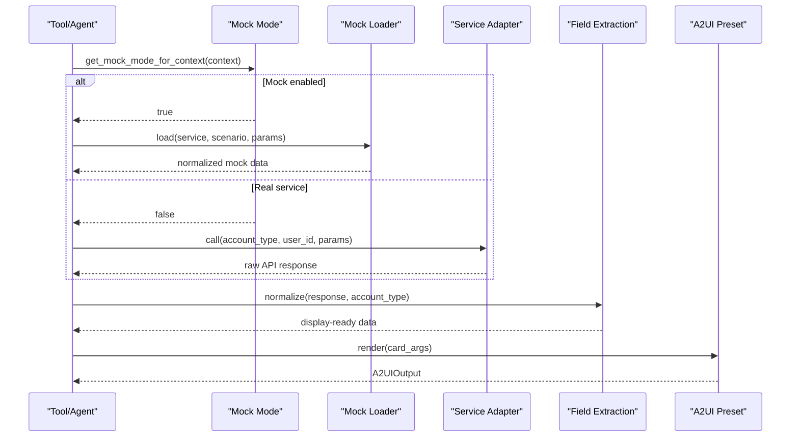
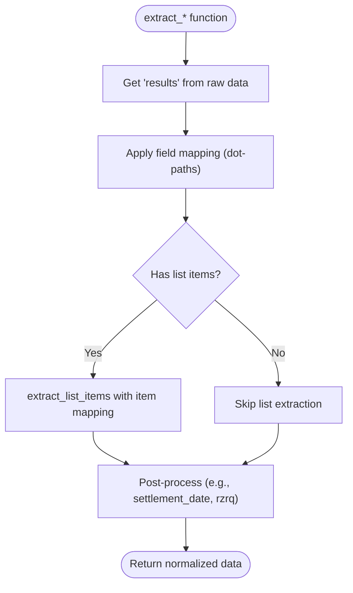
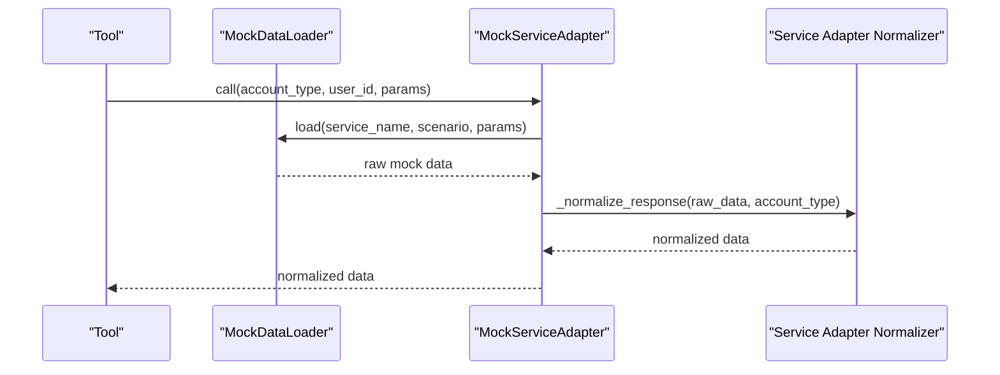
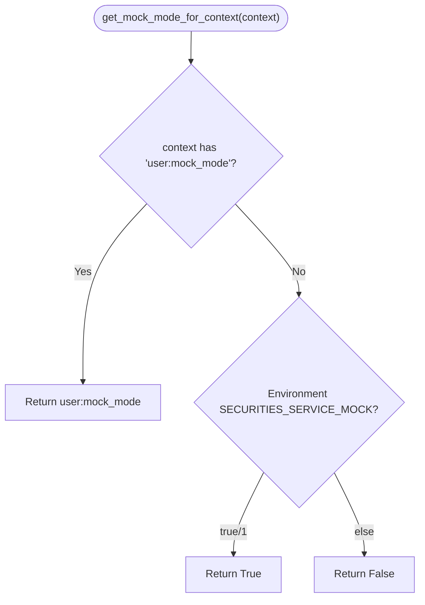
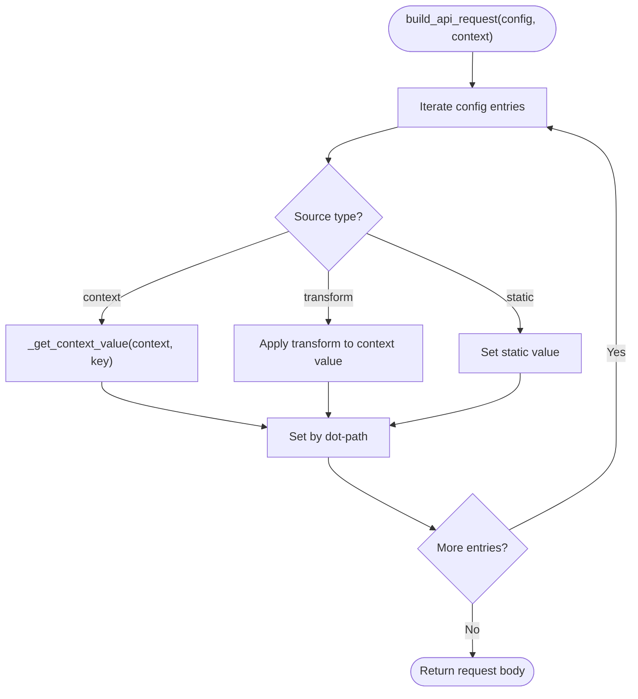
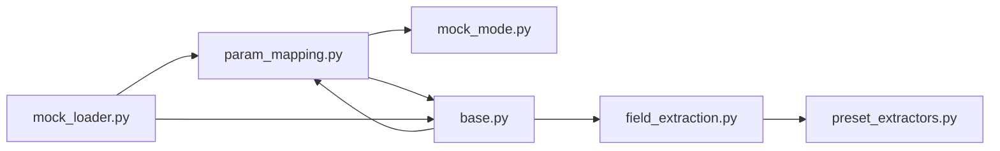

# Utility Functions

<cite>
**Referenced Files in This Document**
- [field_extraction.py](file://src/ark_agentic/agents/securities/tools/service/field_extraction.py)
- [mock_loader.py](file://src/ark_agentic/agents/securities/tools/service/mock_loader.py)
- [mock_mode.py](file://src/ark_agentic/agents/securities/tools/service/mock_mode.py)
- [param_mapping.py](file://src/ark_agentic/agents/securities/tools/service\param_mapping.py)
- [preset_extractors.py](file://src/ark_agentic/agents/securities/a2ui\preset_extractors.py)
- [base.py](file://src/ark_agentic/agents/securities/tools/service/base.py)
- [test_field_extraction.py](file://tests/unit/agents/securities/test_field_extraction.py)
- [test_param_mapping.py](file://tests/unit/agents/securities/test_param_mapping.py)
- [test_mock_loader_and_service_adapter.py](file://tests/integration/agents/securities/test_mock_loader_and_service_adapter.py)
</cite>

## Table of Contents
1. [Introduction](#introduction)
2. [Project Structure](#project-structure)
3. [Core Components](#core-components)
4. [Architecture Overview](#architecture-overview)
5. [Detailed Component Analysis](#detailed-component-analysis)
6. [Dependency Analysis](#dependency-analysis)
7. [Performance Considerations](#performance-considerations)
8. [Troubleshooting Guide](#troubleshooting-guide)
9. [Conclusion](#conclusion)

## Introduction
This document explains the utility functions that power the securities tools system, focusing on:
- Field extraction helpers for transforming API responses into display-ready data
- Mock data loaders for deterministic testing and development
- Mock mode configurations for environment-driven behavior toggles
- Parameter mapping utilities for building API requests and headers from context

These utilities streamline testing, development, and production workflows by providing consistent, composable transformations and predictable data sources across the securities agent ecosystem.

## Project Structure
The securities utilities live under the securities tools service module and integrate with A2UI presets for rendering:

**Diagram sources**
- [field_extraction.py:1-479](file://src/ark_agentic/agents/securities/tools/service/field_extraction.py#L1-L479)
- [mock_loader.py:1-178](file://src/ark_agentic/agents/securities/tools/service/mock_loader.py#L1-L178)
- [mock_mode.py:1-24](file://src/ark_agentic/agents/securities/tools/service/mock_mode.py#L1-L24)
- [param_mapping.py:1-479](file://src/ark_agentic/agents/securities/tools/service\param_mapping.py#L1-L479)
- [preset_extractors.py:1-222](file://src/ark_agentic/agents/securities/a2ui\preset_extractors.py#L1-L222)
- [base.py:1-212](file://src/ark_agentic/agents/securities/tools/service/base.py#L1-L212)

**Section sources**
- [field_extraction.py:1-479](file://src/ark_agentic/agents/securities/tools/service/field_extraction.py#L1-L479)
- [mock_loader.py:1-178](file://src/ark_agentic/agents/securities/tools/service/mock_loader.py#L1-L178)
- [mock_mode.py:1-24](file://src/ark_agentic/agents/securities/tools/service/mock_mode.py#L1-L24)
- [param_mapping.py:1-479](file://src/ark_agentic/agents/securities/tools/service\param_mapping.py#L1-L479)
- [preset_extractors.py:1-222](file://src/ark_agentic/agents/securities/a2ui\preset_extractors.py#L1-L222)
- [base.py:1-212](file://src/ark_agentic/agents/securities/tools/service/base.py#L1-L212)

## Core Components
- Field extraction helpers: Extract and normalize fields from API responses, handle nested paths, and adapt outputs per service and account type.
- Mock data loader: Load structured JSON mock data by service and scenario, with fallbacks and defaults.
- Mock mode configuration: Determine whether to use mock data globally or per-request via environment variables and context.
- Parameter mapping utilities: Build API request bodies and headers from context, including validatedata parsing and enrichment.

These components collectively enable consistent data transformation, reliable testing, and flexible context-driven behavior across the securities agent ecosystem.

**Section sources**
- [field_extraction.py:12-479](file://src/ark_agentic/agents/securities/tools/service/field_extraction.py#L12-L479)
- [mock_loader.py:17-178](file://src/ark_agentic/agents/securities/tools/service/mock_loader.py#L17-L178)
- [mock_mode.py:7-24](file://src/ark_agentic/agents/securities/tools/service/mock_mode.py#L7-L24)
- [param_mapping.py:13-479](file://src/ark_agentic/agents/securities/tools/service\param_mapping.py#L13-L479)

## Architecture Overview
The utilities integrate as follows:
- Mock mode determines whether to route calls to real services or mock adapters.
- Mock loader supplies normalized mock responses for adapters.
- Parameter mapping builds standardized request bodies and headers from context.
- Field extraction normalizes raw API responses into display-friendly structures.
- A2UI presets consume normalized data to render cards consistently.

**Diagram sources**
- [mock_mode.py:7-24](file://src/ark_agentic/agents/securities/tools/service/mock_mode.py#L7-L24)
- [mock_loader.py:110-178](file://src/ark_agentic/agents/securities/tools/service/mock_loader.py#L110-L178)
- [base.py:38-131](file://src/ark_agentic/agents/securities/tools/service/base.py#L38-L131)
- [field_extraction.py:12-479](file://src/ark_agentic/agents/securities/tools/service/field_extraction.py#L12-L479)
- [preset_extractors.py:92-222](file://src/ark_agentic/agents/securities/a2ui\preset_extractors.py#L92-L222)

## Detailed Component Analysis

### Field Extraction Utilities
Purpose:
- Extract specific fields from nested API responses using dot-path notation.
- Normalize outputs per service and account type (e.g., settlement date, rzrq assets info).
- Provide service-specific extraction functions and a registry for dynamic selection.

Key capabilities:
- Dot-path traversal for nested dictionaries.
- List item extraction with mapping for repeating structures.
- Account-type-aware normalization (e.g., two-way vs. margin accounts).
- Registration of service field mappings for dynamic lookup.

Usage examples:
- Extract account overview fields for display.
- Transform parallel arrays (dates, profits) into a unified list.
- Build profit curves aligned with trade dates and assets.

**Diagram sources**
- [field_extraction.py:12-479](file://src/ark_agentic/agents/securities/tools/service/field_extraction.py#L12-L479)

**Section sources**
- [field_extraction.py:12-479](file://src/ark_agentic/agents/securities/tools/service/field_extraction.py#L12-L479)
- [test_field_extraction.py:1-261](file://tests/unit/agents/securities/test_field_extraction.py#L1-L261)

### Mock Data Loader and Service Adapter
Purpose:
- Load mock data from JSON files organized by service and scenario.
- Provide a mock service adapter that normalizes raw mock data into the same shape as real APIs.
- Support per-service scenarios (e.g., normal_user, margin_user) and default fallbacks.

Key capabilities:
- Hierarchical file resolution: specific security code, scenario, default.
- Logging and graceful fallbacks when files are missing.
- Adapter-driven normalization for each service.

**Diagram sources**
- [mock_loader.py:17-178](file://src/ark_agentic/agents/securities/tools/service/mock_loader.py#L17-L178)
- [base.py:38-131](file://src/ark_agentic/agents/securities/tools/service/base.py#L38-L131)

**Section sources**
- [mock_loader.py:17-178](file://src/ark_agentic/agents/securities/tools/service/mock_loader.py#L17-L178)
- [test_mock_loader_and_service_adapter.py:1-45](file://tests/integration/agents/securities/test_mock_loader_and_service_adapter.py#L1-L45)

### Mock Mode Configuration
Purpose:
- Control whether the system uses mock data or real services.
- Support both global environment-based defaults and per-request overrides via context.

Behavior:
- Global default from environment variable.
- Per-request override via context keys with user: prefix preferred.

**Diagram sources**
- [mock_mode.py:7-24](file://src/ark_agentic/agents/securities/tools/service/mock_mode.py#L7-L24)

**Section sources**
- [mock_mode.py:7-24](file://src/ark_agentic/agents/securities/tools/service/mock_mode.py#L7-L24)
- [test_mock_loader_and_service_adapter.py:26-45](file://tests/integration/agents/securities/test_mock_loader_and_service_adapter.py#L26-L45)

### Parameter Mapping Utilities
Purpose:
- Build API request bodies and headers from context, supporting:
  - Static values
  - Context-derived values (with user: prefix precedence)
  - Transform functions for account-type mapping and defaults
- Enrich context with validatedata fields and derive account type from loginflag.

Key capabilities:
- Dot-path navigation for nested contexts.
- Request/header builders with safe assignment into nested structures.
- Validatedata parsing and reconstruction, with optional skipping in mock mode.
- Unified header configuration for services requiring validatedata/signature.

**Diagram sources**
- [param_mapping.py:38-93](file://src/ark_agentic/agents/securities/tools/service\param_mapping.py#L38-L93)

**Section sources**
- [param_mapping.py:13-479](file://src/ark_agentic/agents/securities/tools/service\param_mapping.py#L13-L479)
- [test_param_mapping.py:1-296](file://tests/unit/agents/securities/test_param_mapping.py#L1-L296)

### A2UI Preset Extractors
Purpose:
- Convert normalized tool outputs into A2UI-ready payloads with consistent titles and masked account info.
- Provide factories for holdings lists and specialized cards (account overview, cash assets, branch info, profit histories).

Integration:
- Reads tool results from context, enriches with masked account and account type, and renders via TemplateRenderer.

**Section sources**
- [preset_extractors.py:24-222](file://src/ark_agentic/agents/securities/a2ui\preset_extractors.py#L24-L222)

## Dependency Analysis
High-level dependencies among the utilities:

**Diagram sources**
- [param_mapping.py:1-479](file://src/ark_agentic/agents/securities/tools/service\param_mapping.py#L1-L479)
- [mock_mode.py:1-24](file://src/ark_agentic/agents/securities/tools/service/mock_mode.py#L1-L24)
- [base.py:1-212](file://src/ark_agentic/agents/securities/tools/service/base.py#L1-L212)
- [mock_loader.py:1-178](file://src/ark_agentic/agents/securities/tools/service/mock_loader.py#L1-L178)
- [field_extraction.py:1-479](file://src/ark_agentic/agents/securities/tools/service/field_extraction.py#L1-L479)
- [preset_extractors.py:1-222](file://src/ark_agentic/agents/securities/a2ui\preset_extractors.py#L1-L222)

**Section sources**
- [param_mapping.py:1-479](file://src/ark_agentic/agents/securities/tools/service\param_mapping.py#L1-L479)
- [mock_loader.py:1-178](file://src/ark_agentic/agents/securities/tools/service/mock_loader.py#L1-L178)
- [base.py:1-212](file://src/ark_agentic/agents/securities/tools/service/base.py#L1-L212)
- [field_extraction.py:1-479](file://src/ark_agentic/agents/securities/tools/service/field_extraction.py#L1-L479)
- [preset_extractors.py:1-222](file://src/ark_agentic/agents/securities/a2ui\preset_extractors.py#L1-L222)

## Performance Considerations
- Field extraction:
  - Dot-path traversal is O(k) per field where k is the number of path segments; keep mappings concise.
  - List item extraction scales linearly with item count; avoid unnecessary deep copies.
- Mock loader:
  - File I/O is bounded by JSON size; cache loaders sparingly and reuse singletons.
  - Directory scanning for scenario listing is O(n) over JSON files in a service directory.
- Parameter mapping:
  - Nested path creation avoids repeated allocations by reusing intermediate dicts.
  - Transform functions should be lightweight to minimize overhead.
- Rendering:
  - A2UI preset extractors add minimal overhead; ensure template rendering is delegated to dedicated renderers.

## Troubleshooting Guide
Common issues and resolutions:
- Missing mock data:
  - Verify service directory and scenario/default files exist; the loader logs warnings and returns an error payload.
- Incorrect context keys:
  - Prefer user: prefixed keys; the utilities resolve user:foo before foo.
- Account type mismatch:
  - Ensure validatedata loginflag is present or explicitly set user:account_type; otherwise inferred from loginflag.
- API response errors:
  - Use the response checker to surface API-level errors early; inspect status and error messages.
- Context validation failures:
  - Use the context field requirement helper to enforce required fields; it skips validation in mock mode.

**Section sources**
- [mock_loader.py:27-30](file://src/ark_agentic/agents/securities/tools/service/mock_loader.py#L27-L30)
- [param_mapping.py:210-236](file://src/ark_agentic/agents/securities/tools/service\param_mapping.py#L210-L236)
- [base.py:202-212](file://src/ark_agentic/agents/securities/tools/service/base.py#L202-L212)
- [base.py:138-160](file://src/ark_agentic/agents/securities/tools/service/base.py#L138-L160)

## Conclusion
The securities utilities provide a cohesive toolkit for data transformation, testing, and rendering:
- Field extraction ensures consistent, account-type-aware outputs.
- Mock loader and adapter enable repeatable testing and development without external dependencies.
- Parameter mapping unifies request construction and authentication across services.
- A2UI presets deliver standardized presentation with masked identities and titles.

Together, they maintain consistency, improve developer productivity, and support robust production deployments by decoupling tool logic from external systems and UI rendering.