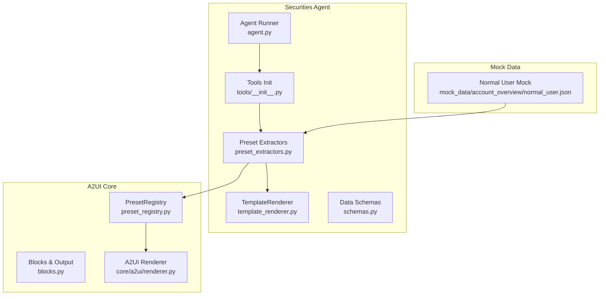
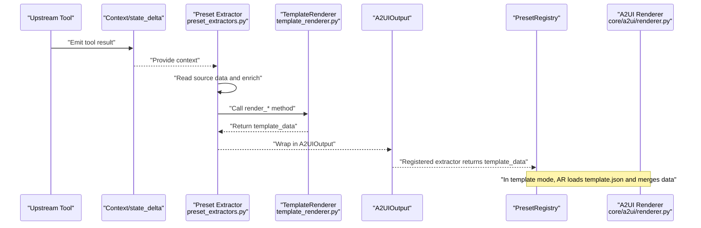
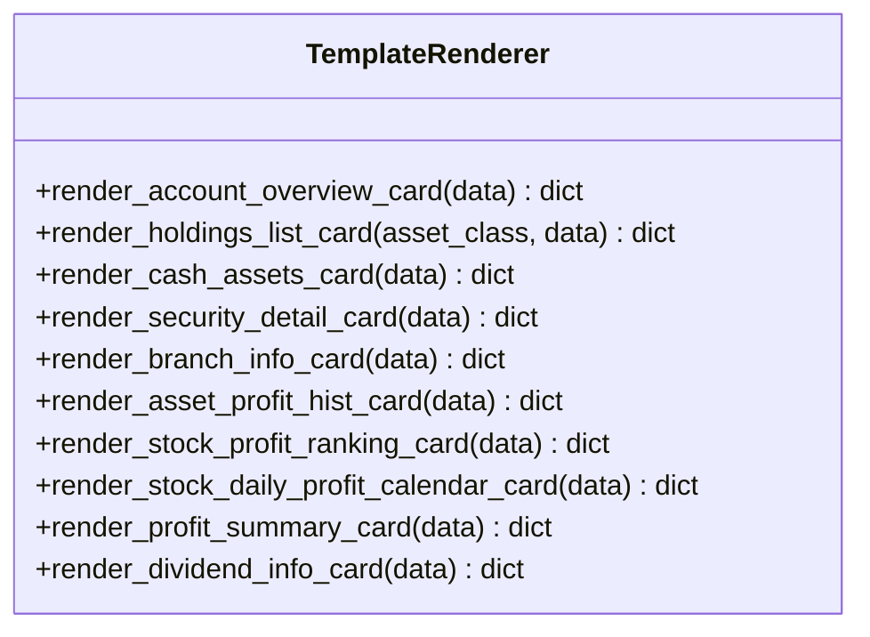
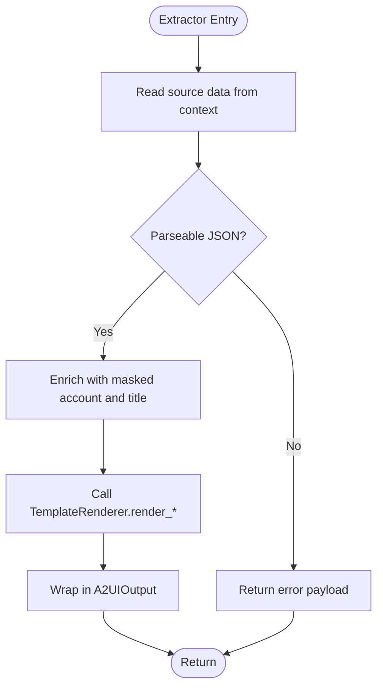
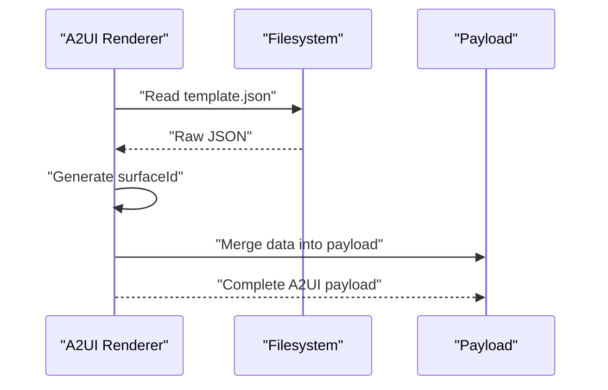
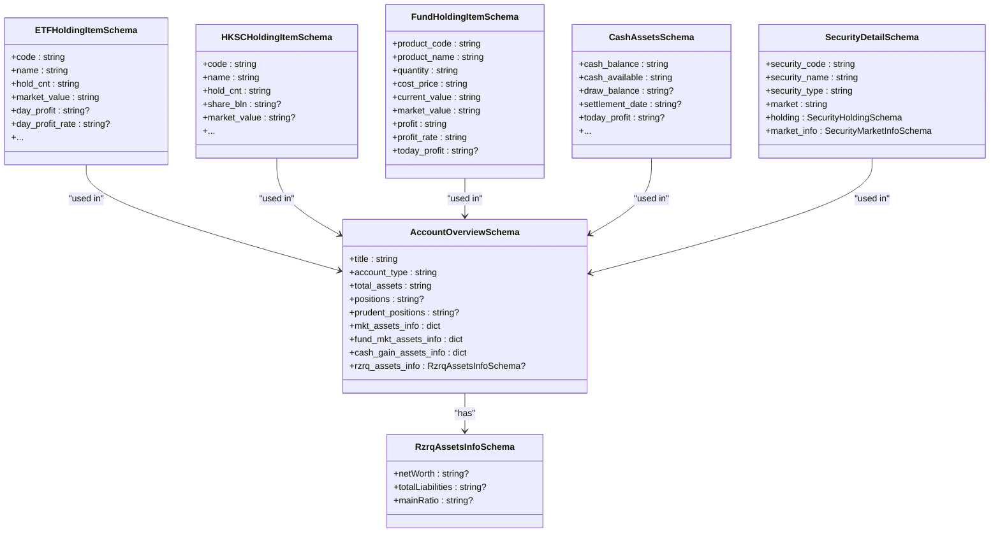
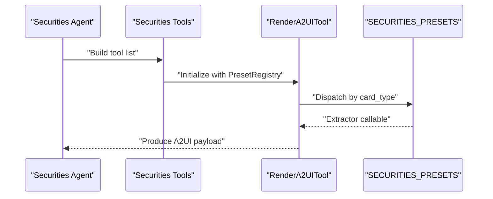
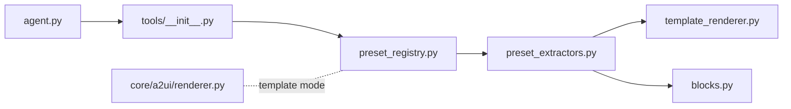

# Template Renderer

<cite>
**Referenced Files in This Document**
- [template_renderer.py](file://src/ark_agentic/agents/securities/template_renderer.py)
- [preset_extractors.py](file://src/ark_agentic/agents/securities/a2ui/preset_extractors.py)
- [schemas.py](file://src/ark_agentic/agents/securities/schemas.py)
- [preset_registry.py](file://src/ark_agentic/core/a2ui/preset_registry.py)
- [blocks.py](file://src/ark_agentic/core/a2ui/blocks.py)
- [tools_init.py](file://src/ark_agentic/agents/securities/tools/__init__.py)
- [agent.py](file://src/ark_agentic/agents/securities/agent.py)
- [renderer.py](file://src/ark_agentic/core/a2ui/renderer.py)
- [normal_user.json](file://src/ark_agentic/agents/securities/mock_data/account_overview/normal_user.json)
</cite>

## Table of Contents
1. [Introduction](#introduction)
2. [Project Structure](#project-structure)
3. [Core Components](#core-components)
4. [Architecture Overview](#architecture-overview)
5. [Detailed Component Analysis](#detailed-component-analysis)
6. [Dependency Analysis](#dependency-analysis)
7. [Performance Considerations](#performance-considerations)
8. [Troubleshooting Guide](#troubleshooting-guide)
9. [Conclusion](#conclusion)
10. [Appendices](#appendices)

## Introduction
This document describes the Securities Agent template renderer system responsible for generating structured financial reports and analyses. It covers the template rendering architecture, supported template formats, data binding mechanisms, integration with the A2UI system for dynamic UI generation, and the relationship with securities-specific data models. It also explains the template processing workflow, context injection, and output formatting for financial documents, along with practical examples, customization options, styling integration, and performance considerations.

## Project Structure
The template renderer system spans several modules:
- Securities-specific template renderer and presets
- A2UI core renderer and block infrastructure
- Data models for securities domain
- Tools and agent wiring for end-to-end report generation

**Diagram sources**
- [template_renderer.py:1-369](file://src/ark_agentic/agents/securities/template_renderer.py#L1-L369)
- [preset_extractors.py:1-222](file://src/ark_agentic/agents/securities/a2ui/preset_extractors.py#L1-L222)
- [schemas.py:1-465](file://src/ark_agentic/agents/securities/schemas.py#L1-L465)
- [preset_registry.py:1-53](file://src/ark_agentic/core/a2ui/preset_registry.py#L1-L53)
- [blocks.py:1-149](file://src/ark_agentic/core/a2ui/blocks.py#L1-L149)
- [renderer.py:1-53](file://src/ark_agentic/core/a2ui/renderer.py#L1-L53)
- [tools_init.py:1-66](file://src/ark_agentic/agents/securities/tools/__init__.py#L1-L66)
- [agent.py:1-100](file://src/ark_agentic/agents/securities/agent.py#L1-L100)
- [normal_user.json:1-103](file://src/ark_agentic/agents/securities/mock_data/account_overview/normal_user.json#L1-L103)

**Section sources**
- [template_renderer.py:1-369](file://src/ark_agentic/agents/securities/template_renderer.py#L1-L369)
- [preset_extractors.py:1-222](file://src/ark_agentic/agents/securities/a2ui/preset_extractors.py#L1-L222)
- [schemas.py:1-465](file://src/ark_agentic/agents/securities/schemas.py#L1-L465)
- [preset_registry.py:1-53](file://src/ark_agentic/core/a2ui/preset_registry.py#L1-L53)
- [blocks.py:1-149](file://src/ark_agentic/core/a2ui/blocks.py#L1-L149)
- [renderer.py:1-53](file://src/ark_agentic/core/a2ui/renderer.py#L1-L53)
- [tools_init.py:1-66](file://src/ark_agentic/agents/securities/tools/__init__.py#L1-L66)
- [agent.py:1-100](file://src/ark_agentic/agents/securities/agent.py#L1-L100)
- [normal_user.json:1-103](file://src/ark_agentic/agents/securities/mock_data/account_overview/normal_user.json#L1-L103)

## Core Components
- TemplateRenderer: Provides static methods to transform normalized financial data into A2UI-compatible payloads for specific cards (e.g., account overview, holdings, cash assets, security detail, branch info, profit histories, rankings, daily profit calendars, profit summaries, dividends).
- Preset Extractors: Read upstream tool results from context, enrich with masked account info and titles, and delegate to TemplateRenderer to produce frontend-ready payloads.
- PresetRegistry: A lightweight registry mapping card types to extractors for preset mode rendering.
- Blocks and A2UIOutput: Shared A2UI building blocks and output container used by extractors.
- A2UI Renderer: Reads template.json from a template directory and injects surfaceId and merged data to produce a complete A2UI payload (used for template-based rendering).
- Securities Data Schemas: Pydantic models for standardized financial data structures enabling validation and conversion from raw API responses to typed models.

Key responsibilities:
- Normalize diverse upstream data into a unified shape expected by templates.
- Enforce consistent context enrichment (masked account, account type, titles).
- Produce payloads aligned with A2UI enterprise protocol for AG-UI clients.

**Section sources**
- [template_renderer.py:12-369](file://src/ark_agentic/agents/securities/template_renderer.py#L12-L369)
- [preset_extractors.py:1-222](file://src/ark_agentic/agents/securities/a2ui/preset_extractors.py#L1-L222)
- [preset_registry.py:25-53](file://src/ark_agentic/core/a2ui/preset_registry.py#L25-L53)
- [blocks.py:46-60](file://src/ark_agentic/core/a2ui/blocks.py#L46-L60)
- [renderer.py:15-53](file://src/ark_agentic/core/a2ui/renderer.py#L15-L53)
- [schemas.py:17-465](file://src/ark_agentic/agents/securities/schemas.py#L17-L465)

## Architecture Overview
The system integrates upstream tool results into securities-focused templates via preset extractors, which call the TemplateRenderer to produce A2UI payloads. These payloads are consumed by the A2UI renderer for template-based rendering or passed directly in preset mode.

**Diagram sources**
- [preset_extractors.py:97-125](file://src/ark_agentic/agents/securities/a2ui/preset_extractors.py#L97-L125)
- [template_renderer.py:16-70](file://src/ark_agentic/agents/securities/template_renderer.py#L16-L70)
- [preset_registry.py:34-42](file://src/ark_agentic/core/a2ui/preset_registry.py#L34-L42)
- [renderer.py:15-53](file://src/ark_agentic/core/a2ui/renderer.py#L15-L53)

## Detailed Component Analysis

### TemplateRenderer
Responsibilities:
- Transform normalized financial data into A2UI payloads for predefined card templates.
- Support multiple asset classes and financial views (holdings lists, account overview, cash assets, security detail, branch info, profit histories, rankings, daily profit calendars, profit summaries, dividends).

Processing logic highlights:
- Account overview: merges top-level totals, market info, fund market info, cash gain info, and optionally preserves two-way margin fields.
- Holdings list: supports both new API-style lists and legacy formats; adds HKSC-specific fields and pre-frozen lists.
- Cash assets: exposes cash balances, availability, drawdown limits, settlement date, today’s profit, plus optional extended fields.
- Security detail: includes security metadata, holding stats, and market info.
- Branch info: wraps branch data with a consistent title pattern.
- Profit histories: emits cumulative and per-period profit curves with optional total margin series.
- Profit ranking and daily profit calendar: formats leaderboards and daily performance arrays.
- Profit summary: aggregates today and total PnL and rates, and top performers.
- Dividends: formats dividend records with stock identity and statistics.

**Diagram sources**
- [template_renderer.py:12-369](file://src/ark_agentic/agents/securities/template_renderer.py#L12-L369)

**Section sources**
- [template_renderer.py:12-369](file://src/ark_agentic/agents/securities/template_renderer.py#L12-L369)

### Preset Extractors and PresetRegistry
Responsibilities:
- Read upstream tool results from context, parse JSON strings, and normalize to dicts.
- Enrich data with masked account, account type, and formatted titles.
- Delegate to TemplateRenderer to produce A2UI payloads.
- Register extractors under card types for preset mode.

Patterns:
- Factory extractors for holdings and profit histories to reduce duplication.
- Consistent error handling for missing data or unsupported margin scenarios.
- Registry-driven dispatch of extractors by card type.

**Diagram sources**
- [preset_extractors.py:47-72](file://src/ark_agentic/agents/securities/a2ui/preset_extractors.py#L47-L72)
- [preset_extractors.py:97-125](file://src/ark_agentic/agents/securities/a2ui/preset_extractors.py#L97-L125)

**Section sources**
- [preset_extractors.py:1-222](file://src/ark_agentic/agents/securities/a2ui/preset_extractors.py#L1-L222)
- [preset_registry.py:25-53](file://src/ark_agentic/core/a2ui/preset_registry.py#L25-L53)

### A2UI Renderer (Template Mode)
Responsibilities:
- Load template.json from a template directory by card type.
- Inject a generated surfaceId.
- Merge flattened data into the template payload.
- Return a complete A2UI payload ready for the client.

**Diagram sources**
- [renderer.py:15-53](file://src/ark_agentic/core/a2ui/renderer.py#L15-L53)

**Section sources**
- [renderer.py:15-53](file://src/ark_agentic/core/a2ui/renderer.py#L15-L53)

### Securities Data Schemas
Responsibilities:
- Define standardized Pydantic models for securities data.
- Enable robust validation and conversion from raw API responses to typed models.
- Support aliasing to align with external field names and preserve extra fields.

Examples of covered domains:
- Account overview with nested asset info and optional margin fields.
- ETF, HKSC, and fund holdings with item-level schemas and summaries.
- Cash assets with base and extended fields.
- Security detail with holding and market info.
- Dividend info with historical records.

**Diagram sources**
- [schemas.py:17-465](file://src/ark_agentic/agents/securities/schemas.py#L17-L465)

**Section sources**
- [schemas.py:17-465](file://src/ark_agentic/agents/securities/schemas.py#L17-L465)

### Tools and Agent Wiring
Responsibilities:
- Provide a RenderA2UITool configured with the securities preset registry.
- Compose the full set of securities tools and integrate them into the agent runner.
- Enrich context and enforce authentication checks before execution.

**Diagram sources**
- [tools_init.py:41-66](file://src/ark_agentic/agents/securities/tools/__init__.py#L41-L66)
- [agent.py:72-100](file://src/ark_agentic/agents/securities/agent.py#L72-L100)
- [preset_extractors.py:208-222](file://src/ark_agentic/agents/securities/a2ui/preset_extractors.py#L208-L222)

**Section sources**
- [tools_init.py:1-66](file://src/ark_agentic/agents/securities/tools/__init__.py#L1-L66)
- [agent.py:1-100](file://src/ark_agentic/agents/securities/agent.py#L1-L100)
- [preset_extractors.py:208-222](file://src/ark_agentic/agents/securities/a2ui/preset_extractors.py#L208-L222)

## Dependency Analysis
- Preset Extractors depend on TemplateRenderer and A2UIOutput.
- Tools initialization wires RenderA2UITool to the securities PresetRegistry.
- Agent runner composes tools and applies context enrichment and auth hooks.
- A2UI Renderer is used for template-based rendering; Preset Extractors bypass templates and return payloads directly.

**Diagram sources**
- [preset_extractors.py:1-222](file://src/ark_agentic/agents/securities/a2ui/preset_extractors.py#L1-L222)
- [template_renderer.py:1-369](file://src/ark_agentic/agents/securities/template_renderer.py#L1-L369)
- [blocks.py:1-149](file://src/ark_agentic/core/a2ui/blocks.py#L1-L149)
- [preset_registry.py:1-53](file://src/ark_agentic/core/a2ui/preset_registry.py#L1-L53)
- [tools_init.py:1-66](file://src/ark_agentic/agents/securities/tools/__init__.py#L1-L66)
- [agent.py:1-100](file://src/ark_agentic/agents/securities/agent.py#L1-L100)
- [renderer.py:1-53](file://src/ark_agentic/core/a2ui/renderer.py#L1-L53)

**Section sources**
- [preset_extractors.py:1-222](file://src/ark_agentic/agents/securities/a2ui/preset_extractors.py#L1-L222)
- [template_renderer.py:1-369](file://src/ark_agentic/agents/securities/template_renderer.py#L1-L369)
- [blocks.py:1-149](file://src/ark_agentic/core/a2ui/blocks.py#L1-L149)
- [preset_registry.py:1-53](file://src/ark_agentic/core/a2ui/preset_registry.py#L1-L53)
- [tools_init.py:1-66](file://src/ark_agentic/agents/securities/tools/__init__.py#L1-L66)
- [agent.py:1-100](file://src/ark_agentic/agents/securities/agent.py#L1-L100)
- [renderer.py:1-53](file://src/ark_agentic/core/a2ui/renderer.py#L1-L53)

## Performance Considerations
- Minimize repeated parsing: Extractors parse stringified tool results once and cache parsed dicts where appropriate.
- Prefer direct payload construction: Preset mode avoids template loading overhead by returning template_data directly.
- Normalize early: Convert raw API responses to Pydantic models upstream to reduce field mapping costs downstream.
- Batch operations: When generating multiple cards, reuse context and avoid redundant enrichment steps.
- Data size: For large profit histories and rankings, consider pagination or slicing to keep payloads manageable.

## Troubleshooting Guide
Common issues and resolutions:
- Missing template file: A2UI renderer raises a file-not-found error when template.json is absent for a card type. Ensure the template directory structure matches card types.
- Malformed JSON in context: Extractors handle JSON decode errors gracefully by returning empty dicts; callers should check for missing data and return error payloads.
- Unsupported margin accounts: Some extractors return a minimal payload indicating margin is not supported, allowing the UI to adapt.
- Missing tool results: Extractors check for presence of source tool results and return error payloads when data is unavailable.

Operational tips:
- Validate context keys and prefixes (user: vs bare keys) to ensure correct masking and account type resolution.
- Use Pydantic models to validate and coerce incoming data before passing to extractors.

**Section sources**
- [renderer.py:40-41](file://src/ark_agentic/core/a2ui/renderer.py#L40-L41)
- [preset_extractors.py:47-60](file://src/ark_agentic/agents/securities/a2ui/preset_extractors.py#L47-L60)
- [preset_extractors.py:101-107](file://src/ark_agentic/agents/securities/a2ui/preset_extractors.py#L101-L107)

## Conclusion
The Securities Agent template renderer system provides a robust, extensible pipeline for transforming normalized financial data into A2UI payloads. By combining preset extractors, a registry-driven dispatcher, and a set of specialized rendering methods, it enables consistent, secure, and efficient generation of structured financial reports. Integration with A2UI’s renderer and blocks ensures compatibility with enterprise-grade UI frameworks, while Pydantic schemas guarantee data integrity across heterogeneous upstream sources.

## Appendices

### Practical Examples and Patterns
- Creating a holdings list card:
  - Use the holdings extractor to read upstream data, enrich with masked account and title, then call the holdings renderer with the appropriate asset class.
  - Reference: [preset_extractors.py:92-114](file://src/ark_agentic/agents/securities/a2ui/preset_extractors.py#L92-L114), [template_renderer.py:73-141](file://src/ark_agentic/agents/securities/template_renderer.py#L73-L141)
- Rendering account overview:
  - Extract upstream overview data, enrich with masked account and title, then call the account overview renderer.
  - Reference: [preset_extractors.py:116-126](file://src/ark_agentic/agents/securities/a2ui/preset_extractors.py#L116-L126), [template_renderer.py:16-70](file://src/ark_agentic/agents/securities/template_renderer.py#L16-L70)
- Using mock data:
  - Example upstream mock for normal user account overview is available for testing and validation.
  - Reference: [normal_user.json:1-103](file://src/ark_agentic/agents/securities/mock_data/account_overview/normal_user.json#L1-L103)

### Template Formats and Output Structure
- Supported templates include account overview, holdings list, cash assets, security detail, branch info, asset profit history, stock profit ranking, stock daily profit calendar, profit summary, and dividends.
- Output format aligns with A2UI enterprise protocol, embedding template identifiers and structured data payloads.

**Section sources**
- [template_renderer.py:16-369](file://src/ark_agentic/agents/securities/template_renderer.py#L16-L369)

### Context Injection and Data Transformation
- Context injection:
  - Masked account and account type are injected into data prior to rendering.
  - Titles are templated using masked account placeholders.
- Data transformation:
  - Upstream tool results are parsed from context; Pydantic models convert raw responses into typed structures for downstream use.

**Section sources**
- [preset_extractors.py:24-72](file://src/ark_agentic/agents/securities/a2ui/preset_extractors.py#L24-L72)
- [schemas.py:29-68](file://src/ark_agentic/agents/securities/schemas.py#L29-L68)

### Styling Integration
- A2UI design tokens are defined centrally and can be referenced by agents for consistent theming.
- For template-based rendering, styles are embedded within template.json; for preset mode, styling is applied by the consuming UI layer.

**Section sources**
- [blocks.py:24-38](file://src/ark_agentic/core/a2ui/blocks.py#L24-L38)