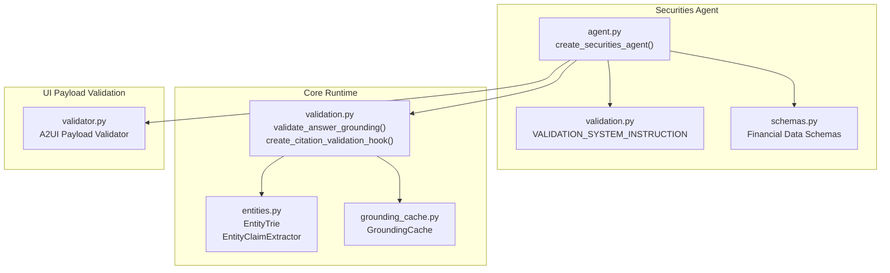
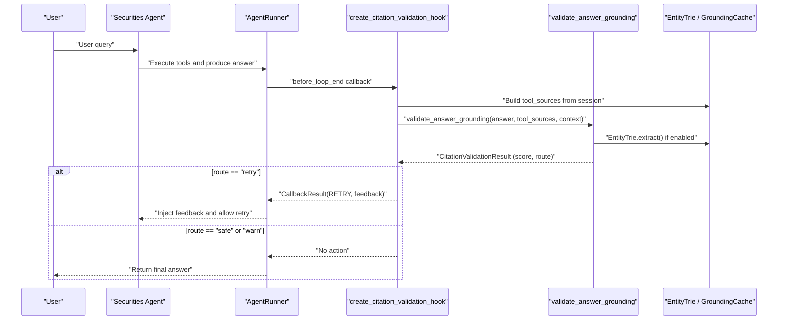
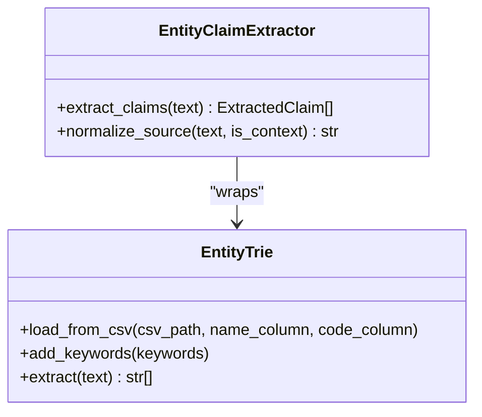
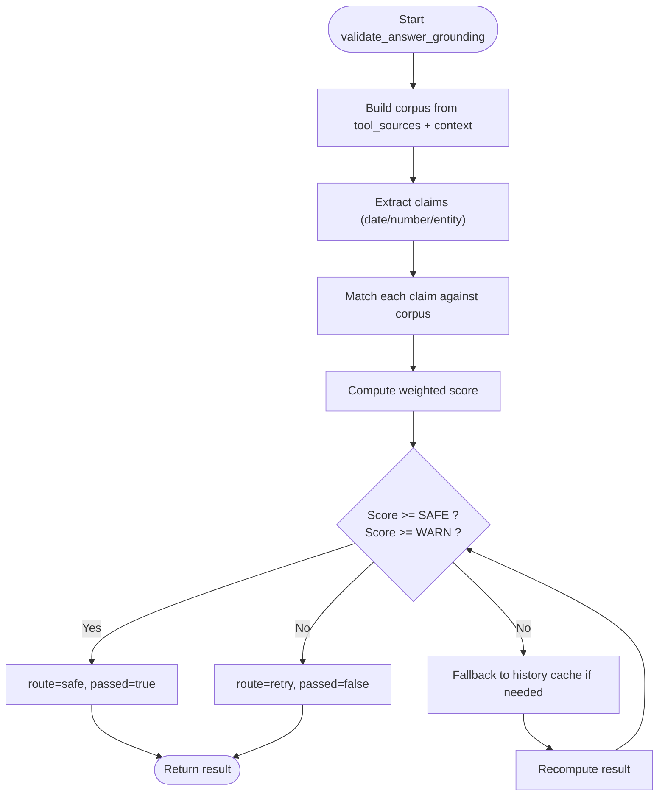
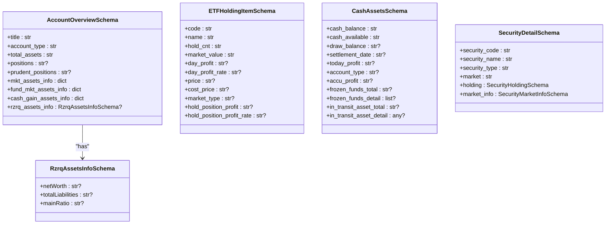
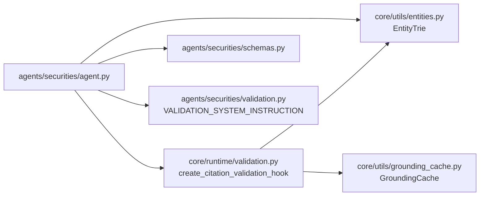

# Validation Framework

<cite>
**Referenced Files in This Document**
- [validation.py](file://src/ark_agentic/agents/securities/validation.py)
- [schemas.py](file://src/ark_agentic/agents/securities/schemas.py)
- [validation.py](file://src/ark_agentic/core/runtime/validation.py)
- [entities.py](file://src/ark_agentic/core/utils/entities.py)
- [grounding_cache.py](file://src/ark_agentic/core/utils/grounding_cache.py)
- [validator.py](file://src/ark_agentic/core/a2ui/validator.py)
- [agent.py](file://src/ark_agentic/agents/securities/agent.py)
- [test_securities_validation.py](file://tests/unit/agents/test_securities_validation.py)
- [test_validation.py](file://tests/unit/core/test_validation.py)
</cite>

## Table of Contents
1. [Introduction](#introduction)
2. [Project Structure](#project-structure)
3. [Core Components](#core-components)
4. [Architecture Overview](#architecture-overview)
5. [Detailed Component Analysis](#detailed-component-analysis)
6. [Dependency Analysis](#dependency-analysis)
7. [Performance Considerations](#performance-considerations)
8. [Troubleshooting Guide](#troubleshooting-guide)
9. [Conclusion](#conclusion)
10. [Appendices](#appendices)

## Introduction
This document describes the Securities Agent validation framework that ensures financial data integrity and compliance during agent interactions. It covers:
- Instruction configuration for grounding constraints
- Entity trie integration for citation validation
- Financial data schema definitions and validation rules
- Compliance validation process including entity recognition, context enrichment, and regulatory requirement enforcement
- Integration with the broader ark-agentic validation system and custom validation hooks
- Practical examples and optimization strategies for large financial datasets

## Project Structure
The validation framework spans three primary areas:
- Securities agent-specific validation instruction and agent wiring
- Core runtime validation pipeline (post-hoc grounding)
- Shared utilities for entity extraction and grounding cache

**Diagram sources**
- [agent.py:72-100](file://src/ark_agentic/agents/securities/agent.py#L72-L100)
- [validation.py:12-22](file://src/ark_agentic/agents/securities/validation.py#L12-L22)
- [schemas.py:19-68](file://src/ark_agentic/agents/securities/schemas.py#L19-L68)
- [validation.py:212-292](file://src/ark_agentic/core/runtime/validation.py#L212-L292)
- [entities.py:21-96](file://src/ark_agentic/core/utils/entities.py#L21-L96)
- [grounding_cache.py:31-89](file://src/ark_agentic/core/utils/grounding_cache.py#L31-L89)
- [validator.py:88-227](file://src/ark_agentic/core/a2ui/validator.py#L88-L227)

**Section sources**
- [agent.py:72-100](file://src/ark_agentic/agents/securities/agent.py#L72-L100)
- [validation.py:12-22](file://src/ark_agentic/agents/securities/validation.py#L12-L22)
- [schemas.py:19-68](file://src/ark_agentic/agents/securities/schemas.py#L19-L68)
- [validation.py:212-292](file://src/ark_agentic/core/runtime/validation.py#L212-L292)
- [entities.py:21-96](file://src/ark_agentic/core/utils/entities.py#L21-L96)
- [grounding_cache.py:31-89](file://src/ark_agentic/core/utils/grounding_cache.py#L31-L89)
- [validator.py:88-227](file://src/ark_agentic/core/a2ui/validator.py#L88-L227)

## Core Components
- Securities agent validation instruction: a system prompt that constrains answers to be grounded in tool outputs and context.
- Entity trie: loads a whitelist of securities (names and codes) and extracts entities from text deterministically.
- Core runtime grounding: post-hoc validation that checks claims (entities, dates, numbers) against flattened tool outputs and context.
- Grounding cache: stores normalized facts per session to support fallback matching across turns.
- Financial data schemas: Pydantic models that define standardized financial structures and enforce type correctness.

**Section sources**
- [validation.py:12-22](file://src/ark_agentic/agents/securities/validation.py#L12-L22)
- [entities.py:21-96](file://src/ark_agentic/core/utils/entities.py#L21-L96)
- [validation.py:212-292](file://src/ark_agentic/core/runtime/validation.py#L212-L292)
- [grounding_cache.py:31-89](file://src/ark_agentic/core/utils/grounding_cache.py#L31-L89)
- [schemas.py:19-68](file://src/ark_agentic/agents/securities/schemas.py#L19-L68)

## Architecture Overview
The validation pipeline runs after the agent produces a final answer but before the loop ends. It:
- Builds a corpus from tool outputs and recent user context
- Extracts claims (entities, dates, numbers) from the answer
- Matches claims against the corpus; computes a weighted score
- Routes the result as safe, warn, or retry; injects feedback on retry

**Diagram sources**
- [agent.py:87-90](file://src/ark_agentic/agents/securities/agent.py#L87-L90)
- [validation.py:495-604](file://src/ark_agentic/core/runtime/validation.py#L495-L604)
- [entities.py:64-77](file://src/ark_agentic/core/utils/entities.py#L64-L77)
- [grounding_cache.py:47-65](file://src/ark_agentic/core/utils/grounding_cache.py#L47-L65)

## Detailed Component Analysis

### Securities Agent Validation Instruction
- Purpose: constrain the agent’s answer to rely solely on tool outputs and context.
- Effect: reduces hallucinations by requiring verifiable claims.

**Section sources**
- [validation.py:12-22](file://src/ark_agentic/agents/securities/validation.py#L12-L22)
- [agent.py:45](file://src/ark_agentic/agents/securities/agent.py#L45)

### Entity Trie Integration
- Loads a CSV whitelist of securities (name/code) into two keyword processors:
  - Case-insensitive processor for entity names
  - Case-sensitive processor for codes
- Extracts unique entities from text and integrates with claim extraction.

**Diagram sources**
- [entities.py:21-96](file://src/ark_agentic/core/utils/entities.py#L21-L96)

**Section sources**
- [entities.py:21-96](file://src/ark_agentic/core/utils/entities.py#L21-L96)
- [agent.py:85-86](file://src/ark_agentic/agents/securities/agent.py#L85-L86)

### Core Runtime Grounding Pipeline
- Extractors: date, number, and optionally entity claims
- Corpus building: flattens tool outputs and context via normalization
- Matching: substring match across normalized corpus
- Scoring: weighted score by claim type; thresholds determine safe/warn/retry
- Fallback: if low score, match against cached history to avoid false positives

**Diagram sources**
- [validation.py:212-292](file://src/ark_agentic/core/runtime/validation.py#L212-L292)
- [validation.py:408-435](file://src/ark_agentic/core/runtime/validation.py#L408-L435)

**Section sources**
- [validation.py:212-292](file://src/ark_agentic/core/runtime/validation.py#L212-L292)
- [validation.py:408-435](file://src/ark_agentic/core/runtime/validation.py#L408-L435)

### Grounding Cache
- Stores normalized tool outputs per session with TTL
- Merges recent facts to support cross-turn grounding fallback
- Prevents repeated validation within the same user turn

**Section sources**
- [grounding_cache.py:31-89](file://src/ark_agentic/core/utils/grounding_cache.py#L31-L89)
- [validation.py:516-541](file://src/ark_agentic/core/runtime/validation.py#L516-L541)

### Financial Data Schemas
- Standardized models for financial structures:
  - Account overview, Rzrq assets info
  - ETF holdings, HKSC holdings
  - Fund holdings, cash assets
  - Security detail (holding, market info)
- Designed for strict type validation and field mapping

**Diagram sources**
- [schemas.py:19-68](file://src/ark_agentic/agents/securities/schemas.py#L19-L68)
- [schemas.py:73-147](file://src/ark_agentic/agents/securities/schemas.py#L73-L147)
- [schemas.py:340-392](file://src/ark_agentic/agents/securities/schemas.py#L340-L392)
- [schemas.py:441-465](file://src/ark_agentic/agents/securities/schemas.py#L441-L465)

**Section sources**
- [schemas.py:19-68](file://src/ark_agentic/agents/securities/schemas.py#L19-L68)
- [schemas.py:73-147](file://src/ark_agentic/agents/securities/schemas.py#L73-L147)
- [schemas.py:340-392](file://src/ark_agentic/agents/securities/schemas.py#L340-L392)
- [schemas.py:441-465](file://src/ark_agentic/agents/securities/schemas.py#L441-L465)

### A2UI Payload Validation
- Validates A2UI component payloads for structural correctness and binding constraints
- Ensures component ids are unique, references resolve, and bindings are mutually exclusive

**Section sources**
- [validator.py:88-227](file://src/ark_agentic/core/a2ui/validator.py#L88-L227)

### Compliance Validation Process
- Entity recognition: entity trie matches answer content against known securities
- Context enrichment: recent user messages contribute to grounding
- Regulatory enforcement: system instruction restricts answers to verified facts
- Enforcement hooks: grounding hook retries on failure and prevents repeated reflection in a turn

**Section sources**
- [validation.py:12-22](file://src/ark_agentic/agents/securities/validation.py#L12-L22)
- [validation.py:495-604](file://src/ark_agentic/core/runtime/validation.py#L495-L604)
- [test_securities_validation.py:50-94](file://tests/unit/agents/test_securities_validation.py#L50-L94)

## Dependency Analysis
- Securities agent depends on:
  - Entity trie for entity grounding
  - Runtime validation hook for post-hoc grounding
  - Financial schemas for structured outputs
- Runtime validation depends on:
  - Entity trie (optional)
  - Grounding cache for fallback
  - Extractors for claims

**Diagram sources**
- [agent.py:85-90](file://src/ark_agentic/agents/securities/agent.py#L85-L90)
- [validation.py:495-604](file://src/ark_agentic/core/runtime/validation.py#L495-L604)
- [entities.py:21-96](file://src/ark_agentic/core/utils/entities.py#L21-L96)
- [grounding_cache.py:31-89](file://src/ark_agentic/core/utils/grounding_cache.py#L31-L89)
- [schemas.py:19-68](file://src/ark_agentic/agents/securities/schemas.py#L19-L68)
- [validation.py:12-22](file://src/ark_agentic/agents/securities/validation.py#L12-L22)

**Section sources**
- [agent.py:85-90](file://src/ark_agentic/agents/securities/agent.py#L85-L90)
- [validation.py:495-604](file://src/ark_agentic/core/runtime/validation.py#L495-L604)
- [entities.py:21-96](file://src/ark_agentic/core/utils/entities.py#L21-L96)
- [grounding_cache.py:31-89](file://src/ark_agentic/core/utils/grounding_cache.py#L31-L89)
- [schemas.py:19-68](file://src/ark_agentic/agents/securities/schemas.py#L19-L68)
- [validation.py:12-22](file://src/ark_agentic/agents/securities/validation.py#L12-L22)

## Performance Considerations
- Entity trie:
  - Uses two keyword processors (names and codes) to minimize false positives
  - Normalization (full-width to half-width, whitespace removal) improves matching robustness
- Grounding cache:
  - TTL-based eviction keeps memory bounded
  - Merging multiple tool results per key reduces recomputation overhead
- Claims extraction:
  - Priority-based deduplication avoids redundant scoring
- Recommendations:
  - Preload entity trie from CSV once per agent initialization
  - Keep tool outputs normalized to reduce matching overhead
  - Limit context_turns to reduce corpus size when appropriate
  - Use batched tool results and merge with delimiter to improve recall

[No sources needed since this section provides general guidance]

## Troubleshooting Guide
Common issues and resolutions:
- UNGROUNDED errors:
  - Cause: answer contains claims not present in tool outputs or context
  - Resolution: ensure tools return sufficient facts; verify entity trie coverage
- Retry loops:
  - Cause: grounding score below threshold; feedback injected and loop retried once per turn
  - Resolution: adjust tool outputs or refine answer to align with facts
- Duplicate validation in a turn:
  - Mechanism: flag prevents repeated reflection within the same user turn
  - Behavior: second before_loop_end does not re-run grounding

**Section sources**
- [validation.py:586-601](file://src/ark_agentic/core/runtime/validation.py#L586-L601)
- [test_securities_validation.py:97-123](file://tests/unit/agents/test_securities_validation.py#L97-L123)

## Conclusion
The Securities Agent validation framework enforces financial data integrity by combining:
- A strict system instruction
- Deterministic entity extraction via an entity trie
- Post-hoc grounding with weighted scoring and fallback to historical facts
- Structured financial schemas for reliable outputs
Together, these components ensure compliance and trustworthiness in agent-generated responses.

[No sources needed since this section summarizes without analyzing specific files]

## Appendices

### Practical Examples

- Validation configuration
  - System instruction injection: [validation.py:12-22](file://src/ark_agentic/agents/securities/validation.py#L12-L22)
  - Hook registration: [agent.py:87-90](file://src/ark_agentic/agents/securities/agent.py#L87-L90)

- Schema usage
  - Account overview creation: [schemas.py:54-68](file://src/ark_agentic/agents/securities/schemas.py#L54-L68)
  - ETF holdings creation: [schemas.py:127-147](file://src/ark_agentic/agents/securities/schemas.py#L127-L147)
  - Cash assets creation: [schemas.py:366-392](file://src/ark_agentic/agents/securities/schemas.py#L366-L392)
  - Security detail creation: [schemas.py:452-465](file://src/ark_agentic/agents/securities/schemas.py#L452-L465)

- Compliance checking patterns
  - Entity grounding test: [test_validation.py:79-111](file://tests/unit/core/test_validation.py#L79-L111)
  - Un-grounded claims trigger retry: [test_securities_validation.py:70-94](file://tests/unit/agents/test_securities_validation.py#L70-L94)
  - Warn route does not retry: [test_securities_validation.py:126-147](file://tests/unit/agents/test_securities_validation.py#L126-147)

[No sources needed since this section aggregates previously cited examples]