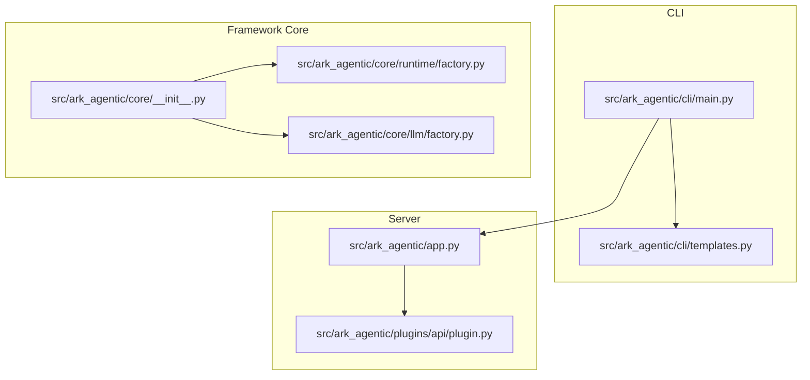
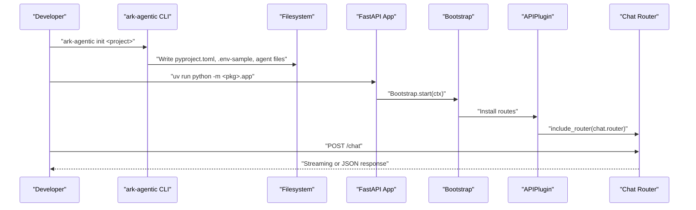
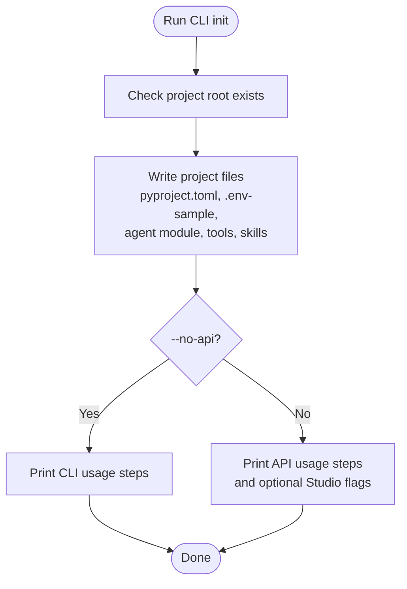
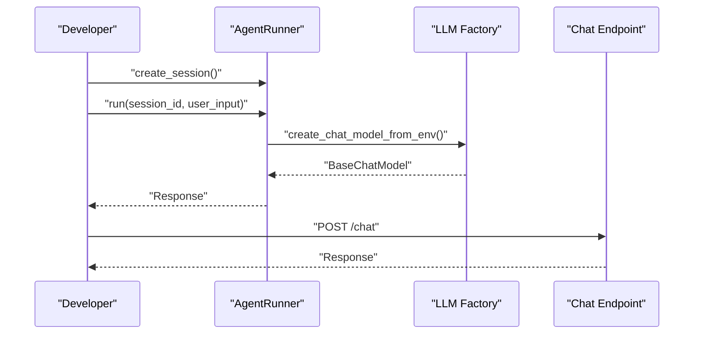
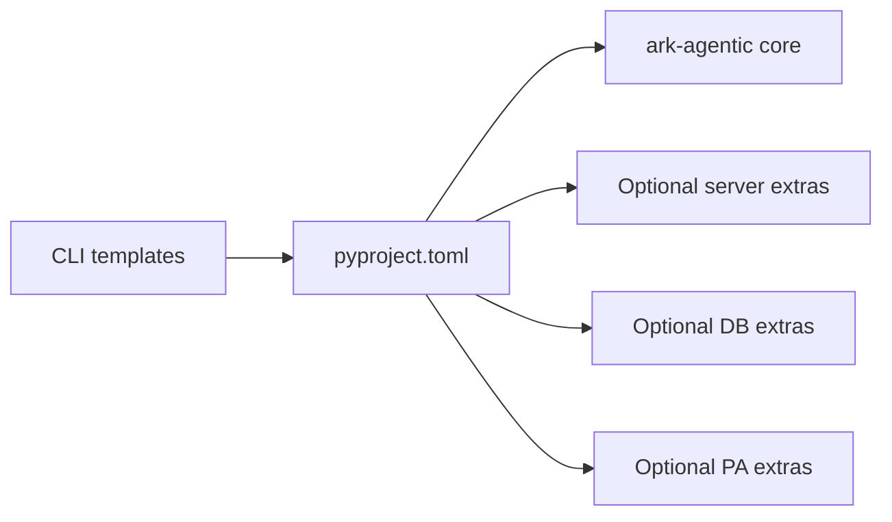

# Getting Started

<cite>
**Referenced Files in This Document**
- [pyproject.toml](file://pyproject.toml)
- [README.md](file://README.md)
- [src/ark_agentic/cli/main.py](file://src/ark_agentic/cli/main.py)
- [src/ark_agentic/cli/templates.py](file://src/ark_agentic/cli/templates.py)
- [src/ark_agentic/app.py](file://src/ark_agentic/app.py)
- [src/ark_agentic/core/__init__.py](file://src/ark_agentic/core/__init__.py)
- [src/ark_agentic/core/runtime/factory.py](file://src/ark_agentic/core/runtime/factory.py)
- [src/ark_agentic/core/llm/factory.py](file://src/ark_agentic/core/llm/factory.py)
- [src/ark_agentic/plugins/api/plugin.py](file://src/ark_agentic/plugins/api/plugin.py)
- [.env-sample](file://.env-sample)
- [src/ark_agentic/agents/insurance/agent.py](file://src/ark_agentic/agents/insurance/agent.py)
- [src/ark_agentic/agents/securities/agent.py](file://src/ark_agentic/agents/securities/agent.py)
- [tests/integration/test_agent_integration.py](file://tests/integration/test_agent_integration.py)
- [tests/unit/core/test_llm_from_env.py](file://tests/unit/core/test_llm_from_env.py)
</cite>

## Table of Contents
1. [Introduction](#introduction)
2. [Project Structure](#project-structure)
3. [Core Components](#core-components)
4. [Architecture Overview](#architecture-overview)
5. [Detailed Component Analysis](#detailed-component-analysis)
6. [Dependency Analysis](#dependency-analysis)
7. [Performance Considerations](#performance-considerations)
8. [Troubleshooting Guide](#troubleshooting-guide)
9. [Conclusion](#conclusion)
10. [Appendices](#appendices)

## Introduction
This guide helps you quickly set up Ark Agentic, install dependencies, configure environment variables, scaffold a project, and run your first agent. You will learn how to initialize a project, configure LLM providers, and make API calls to the built-in chat endpoint. Practical examples show how to create a simple chat agent, enable optional plugins, and run the development server.

## Project Structure
Ark Agentic provides a CLI to scaffold a new project with recommended defaults, including a FastAPI entrypoint and optional Studio UI. The framework’s core APIs live under the core package and expose convenient factories for building agents and LLM clients.

**Diagram sources**
- [src/ark_agentic/cli/main.py:178-222](file://src/ark_agentic/cli/main.py#L178-L222)
- [src/ark_agentic/cli/templates.py:1-289](file://src/ark_agentic/cli/templates.py#L1-L289)
- [src/ark_agentic/app.py:1-94](file://src/ark_agentic/app.py#L1-L94)
- [src/ark_agentic/plugins/api/plugin.py:27-87](file://src/ark_agentic/plugins/api/plugin.py#L27-L87)
- [src/ark_agentic/core/__init__.py:1-159](file://src/ark_agentic/core/__init__.py#L1-L159)
- [src/ark_agentic/core/runtime/factory.py:59-183](file://src/ark_agentic/core/runtime/factory.py#L59-L183)
- [src/ark_agentic/core/llm/factory.py:104-275](file://src/ark_agentic/core/llm/factory.py#L104-L275)

**Section sources**
- [src/ark_agentic/cli/main.py:178-222](file://src/ark_agentic/cli/main.py#L178-L222)
- [src/ark_agentic/cli/templates.py:9-33](file://src/ark_agentic/cli/templates.py#L9-L33)
- [src/ark_agentic/app.py:1-94](file://src/ark_agentic/app.py#L1-L94)
- [src/ark_agentic/core/__init__.py:1-159](file://src/ark_agentic/core/__init__.py#L1-L159)

## Core Components
- CLI: Initializes a new project, writes starter files, and prints next steps.
- Core Runtime: Provides AgentDef and build_standard_agent to wire an AgentRunner with skills, tools, memory, and session management.
- LLM Factory: Creates BaseChatModel instances from environment variables or explicit parameters, supporting OpenAI-compatible endpoints and internal PA models.
- API Server: FastAPI app bootstrapped with plugins; registers routes and serves the chat API and optional UI.

Key entry points and factories:
- CLI command entrypoint and subcommands: [src/ark_agentic/cli/main.py:178-222](file://src/ark_agentic/cli/main.py#L178-L222)
- Project scaffolding templates: [src/ark_agentic/cli/templates.py:9-33](file://src/ark_agentic/cli/templates.py#L9-L33)
- Agent factory and AgentDef: [src/ark_agentic/core/runtime/factory.py:35-183](file://src/ark_agentic/core/runtime/factory.py#L35-L183)
- LLM factory and environment-based creation: [src/ark_agentic/core/llm/factory.py:104-275](file://src/ark_agentic/core/llm/factory.py#L104-L275)
- API server bootstrap and plugin wiring: [src/ark_agentic/app.py:35-94](file://src/ark_agentic/app.py#L35-L94), [src/ark_agentic/plugins/api/plugin.py:27-87](file://src/ark_agentic/plugins/api/plugin.py#L27-L87)

**Section sources**
- [src/ark_agentic/cli/main.py:178-222](file://src/ark_agentic/cli/main.py#L178-L222)
- [src/ark_agentic/cli/templates.py:9-33](file://src/ark_agentic/cli/templates.py#L9-L33)
- [src/ark_agentic/core/runtime/factory.py:35-183](file://src/ark_agentic/core/runtime/factory.py#L35-L183)
- [src/ark_agentic/core/llm/factory.py:104-275](file://src/ark_agentic/core/llm/factory.py#L104-L275)
- [src/ark_agentic/app.py:35-94](file://src/ark_agentic/app.py#L35-L94)
- [src/ark_agentic/plugins/api/plugin.py:27-87](file://src/ark_agentic/plugins/api/plugin.py#L27-L87)

## Architecture Overview
The framework composes lifecycle plugins and routes around a central Bootstrap. The API plugin installs the chat router and health endpoint. The server loads environment variables, initializes logging, and starts the app.

**Diagram sources**
- [src/ark_agentic/cli/main.py:53-113](file://src/ark_agentic/cli/main.py#L53-L113)
- [src/ark_agentic/app.py:50-94](file://src/ark_agentic/app.py#L50-L94)
- [src/ark_agentic/plugins/api/plugin.py:42-87](file://src/ark_agentic/plugins/api/plugin.py#L42-L87)

**Section sources**
- [src/ark_agentic/app.py:35-94](file://src/ark_agentic/app.py#L35-L94)
- [src/ark_agentic/plugins/api/plugin.py:27-87](file://src/ark_agentic/plugins/api/plugin.py#L27-L87)

## Detailed Component Analysis

### Installation and Environment Setup
- Install the framework and optional server dependencies using the project’s dependency groups.
- Configure environment variables from the provided sample file.

Steps:
1. Install the project in editable mode with server extras.
2. Copy and edit the environment sample to match your LLM provider and preferences.

What you need to know:
- The CLI writes a pyproject.toml that depends on the framework and server extras.
- The server requires FastAPI, Uvicorn, and related packages.
- The environment sample defines LLM provider settings and optional plugins.

**Section sources**
- [pyproject.toml:19-35](file://pyproject.toml#L19-L35)
- [src/ark_agentic/cli/templates.py:9-33](file://src/ark_agentic/cli/templates.py#L9-L33)
- [.env-sample:25-42](file://.env-sample#L25-L42)

### Initial Project Scaffolding Using the CLI
- Initialize a new project with the CLI, generating a minimal FastAPI app and a default agent.
- The CLI also supports adding additional agents later.

Workflow:
- Run the init command with a project name.
- The CLI writes templates for pyproject.toml, .env-sample, main app, agent module, tools, and skills.
- It prints next steps to install dependencies and run the server.

**Diagram sources**
- [src/ark_agentic/cli/main.py:53-113](file://src/ark_agentic/cli/main.py#L53-L113)
- [src/ark_agentic/cli/templates.py:9-33](file://src/ark_agentic/cli/templates.py#L9-L33)

**Section sources**
- [src/ark_agentic/cli/main.py:53-113](file://src/ark_agentic/cli/main.py#L53-L113)
- [src/ark_agentic/cli/templates.py:9-33](file://src/ark_agentic/cli/templates.py#L9-L33)

### Basic Workflow: From Initialization to Running Your First Agent
- Create a simple agent using the agent factory and run it in a loop.
- For server mode, start the FastAPI app and send requests to the chat endpoint.

**Diagram sources**
- [src/ark_agentic/core/runtime/factory.py:59-183](file://src/ark_agentic/core/runtime/factory.py#L59-L183)
- [src/ark_agentic/core/llm/factory.py:215-267](file://src/ark_agentic/core/llm/factory.py#L215-L267)
- [src/ark_agentic/plugins/api/plugin.py:63-87](file://src/ark_agentic/plugins/api/plugin.py#L63-L87)

**Section sources**
- [src/ark_agentic/core/runtime/factory.py:59-183](file://src/ark_agentic/core/runtime/factory.py#L59-L183)
- [src/ark_agentic/core/llm/factory.py:215-267](file://src/ark_agentic/core/llm/factory.py#L215-L267)
- [src/ark_agentic/plugins/api/plugin.py:63-87](file://src/ark_agentic/plugins/api/plugin.py#L63-L87)

### Creating a Simple Agent
- Define an AgentDef with identity and description.
- Build an AgentRunner using the factory, supplying skills and tools.
- Optionally enable memory and dreaming.

Example references:
- Agent factory and AgentDef: [src/ark_agentic/core/runtime/factory.py:35-183](file://src/ark_agentic/core/runtime/factory.py#L35-L183)
- Insurance agent example: [src/ark_agentic/agents/insurance/agent.py:38-75](file://src/ark_agentic/agents/insurance/agent.py#L38-L75)
- Securities agent example: [src/ark_agentic/agents/securities/agent.py:41-100](file://src/ark_agentic/agents/securities/agent.py#L41-L100)

**Section sources**
- [src/ark_agentic/core/runtime/factory.py:35-183](file://src/ark_agentic/core/runtime/factory.py#L35-L183)
- [src/ark_agentic/agents/insurance/agent.py:38-75](file://src/ark_agentic/agents/insurance/agent.py#L38-L75)
- [src/ark_agentic/agents/securities/agent.py:41-100](file://src/ark_agentic/agents/securities/agent.py#L41-L100)

### Configuring LLM Providers
- Choose a provider and model via environment variables.
- For OpenAI-compatible endpoints, set API key and base URL.
- For internal PA models, set base URL and required credentials.

Environment variables:
- Required: MODEL_NAME, LLM_PROVIDER, API_KEY (for non-PA providers), LLM_BASE_URL (for PA models).
- Optional: DEFAULT_TEMPERATURE, TRACING, and provider-specific keys.

References:
- Environment-based LLM creation: [src/ark_agentic/core/llm/factory.py:215-267](file://src/ark_agentic/core/llm/factory.py#L215-L267)
- Environment sample: [.env-sample:25-42](file://.env-sample#L25-L42)
- Unit tests validating environment requirements: [tests/unit/core/test_llm_from_env.py:10-67](file://tests/unit/core/test_llm_from_env.py#L10-L67)

**Section sources**
- [src/ark_agentic/core/llm/factory.py:215-267](file://src/ark_agentic/core/llm/factory.py#L215-L267)
- [.env-sample:25-42](file://.env-sample#L25-L42)
- [tests/unit/core/test_llm_from_env.py:10-67](file://tests/unit/core/test_llm_from_env.py#L10-L67)

### Making API Calls
- Start the server and send a chat request to the /chat endpoint.
- The API plugin installs CORS, a health check, and a demo page.

References:
- Server bootstrap and plugin wiring: [src/ark_agentic/app.py:35-94](file://src/ark_agentic/app.py#L35-L94)
- API plugin routes: [src/ark_agentic/plugins/api/plugin.py:42-87](file://src/ark_agentic/plugins/api/plugin.py#L42-L87)

**Section sources**
- [src/ark_agentic/app.py:35-94](file://src/ark_agentic/app.py#L35-L94)
- [src/ark_agentic/plugins/api/plugin.py:42-87](file://src/ark_agentic/plugins/api/plugin.py#L42-L87)

### Practical First-Use Scenarios
- Basic chat agent:
  - Initialize a project with the CLI.
  - Configure .env with MODEL_NAME, LLM_PROVIDER, and API_KEY.
  - Run the server and call /chat with a simple message.
- Enabling Studio:
  - Set ENABLE_STUDIO=true in .env and restart the server.
- Running the development server:
  - Use uvicorn with the app module entrypoint.

References:
- CLI next steps and flags: [src/ark_agentic/cli/main.py:104-113](file://src/ark_agentic/cli/main.py#L104-L113)
- Server entrypoint and run: [src/ark_agentic/app.py:80-94](file://src/ark_agentic/app.py#L80-L94)
- Environment sample flags: [.env-sample:9-11](file://.env-sample#L9-L11)

**Section sources**
- [src/ark_agentic/cli/main.py:104-113](file://src/ark_agentic/cli/main.py#L104-L113)
- [src/ark_agentic/app.py:80-94](file://src/ark_agentic/app.py#L80-L94)
- [.env-sample:9-11](file://.env-sample#L9-L11)

## Dependency Analysis
The project declares core dependencies and optional extras for the server, database, and PA integrations. The CLI writes a pyproject.toml that pins the framework and server extras for new projects.

**Diagram sources**
- [pyproject.toml:19-38](file://pyproject.toml#L19-L38)
- [src/ark_agentic/cli/templates.py:9-33](file://src/ark_agentic/cli/templates.py#L9-L33)

**Section sources**
- [pyproject.toml:19-38](file://pyproject.toml#L19-L38)
- [src/ark_agentic/cli/templates.py:9-33](file://src/ark_agentic/cli/templates.py#L9-L33)

## Performance Considerations
- Use streaming responses for long-running model calls to improve perceived latency.
- Keep session and memory directories on fast storage for frequent reads/writes.
- Tune DEFAULT_TEMPERATURE and model sampling parameters for your workload.
- Enable tracing selectively to avoid overhead in production.

## Troubleshooting Guide
Common setup issues and resolutions:
- Missing MODEL_NAME:
  - Symptom: Environment-based LLM creation raises an error requiring MODEL_NAME.
  - Fix: Set MODEL_NAME in .env (e.g., a PA model or OpenAI model ID).
  - Reference: [tests/unit/core/test_llm_from_env.py:10-14](file://tests/unit/core/test_llm_from_env.py#L10-L14)
- Non-PA provider without API_KEY:
  - Symptom: Error indicates API_KEY is required for the selected provider.
  - Fix: Set API_KEY in .env for OpenAI-compatible endpoints.
  - Reference: [tests/unit/core/test_llm_from_env.py:17-24](file://tests/unit/core/test_llm_from_env.py#L17-L24)
- PA provider with invalid model:
  - Symptom: Error mentions invalid MODEL_NAME for LLM_PROVIDER=pa.
  - Fix: Use a supported PA model (e.g., PA-SX-80B).
  - Reference: [tests/unit/core/test_llm_from_env.py:49-55](file://tests/unit/core/test_llm_from_env.py#L49-L55)
- PA model missing base URL:
  - Symptom: Error indicates LLM_BASE_URL is required for PA models.
  - Fix: Set LLM_BASE_URL in .env for PA endpoints.
  - Reference: [src/ark_agentic/core/llm/factory.py:69-74](file://src/ark_agentic/core/llm/factory.py#L69-L74)
- Server fails to start:
  - Symptom: Port binding or missing dependencies.
  - Fix: Verify API_HOST/API_PORT and ensure server extras are installed.
  - Reference: [src/ark_agentic/app.py:83-89](file://src/ark_agentic/app.py#L83-L89)

**Section sources**
- [tests/unit/core/test_llm_from_env.py:10-67](file://tests/unit/core/test_llm_from_env.py#L10-L67)
- [src/ark_agentic/core/llm/factory.py:69-74](file://src/ark_agentic/core/llm/factory.py#L69-L74)
- [src/ark_agentic/app.py:83-89](file://src/ark_agentic/app.py#L83-L89)

## Conclusion
You now have the essentials to scaffold a project, configure LLM providers, and run your first agent either in CLI mode or via the built-in API server. Use the CLI to bootstrap quickly, configure .env appropriately, and explore the included examples to extend skills and tools.

## Appendices

### Appendix A: Environment Variables Reference
- Application: LOG_LEVEL, API_HOST, API_PORT, ENABLE_STUDIO, AGENTS_ROOT
- Studio Auth/Users: STUDIO_AUTH_PROVIDERS, STUDIO_AUTH_TOKEN_SECRET, STUDIO_AUTH_TOKEN_TTL_SECONDS
- Sessions/Memory: SESSIONS_DIR, MEMORY_DIR
- LLM: LLM_PROVIDER, MODEL_NAME, API_KEY, LLM_BASE_URL, DEFAULT_TEMPERATURE
- Observability: TRACING, PHOENIX_COLLECTOR_ENDPOINT, LANGFUSE_PUBLIC_KEY, LANGFUSE_SECRET_KEY, LANGFUSE_HOST, OTEL_EXPORTER_OTLP_ENDPOINT, OTEL_EXPORTER_OTLP_HEADERS
- Insurance data service: DATA_SERVICE_MOCK, DATA_SERVICE_URL, DATA_SERVICE_AUTH_URL, DATA_SERVICE_APP_ID, DATA_SERVICE_CLIENT_TYPE, DATA_SERVICE_REQ_CHANNEL, DATA_SERVICE_CLIENT_ID, DATA_SERVICE_CLIENT_SECRET, DATA_SERVICE_GRANT_TYPE
- Securities service: SECURITIES_SERVICE_MOCK, SECURITIES_ACCOUNT_TYPE, SECURITIES_ACCOUNT_OVERVIEW_URL, SECURITIES_ETF_HOLDINGS_URL, SECURITIES_HKSC_HOLDINGS_URL, SECURITIES_CASH_ASSETS_URL, SECURITIES_BRANCH_INFO_URL, SECURITIES_FUND_HOLDINGS_URL, SECURITIES_SECURITY_DETAIL_URL, SECURITIES_ACCOUNT_OVERVIEW_AUTH_TYPE, SECURITIES_ACCOUNT_OVERVIEW_AUTH_KEY, SECURITIES_ACCOUNT_OVERVIEW_AUTH_VALUE

**Section sources**
- [.env-sample:1-97](file://.env-sample#L1-L97)

### Appendix B: Example End-to-End Test Pattern
- Demonstrates constructing an agent with a mock LLM, creating a session, injecting context, and asserting a final response.
- Useful for validating your agent’s run loop and tool integration.

**Section sources**
- [tests/integration/test_agent_integration.py:258-291](file://tests/integration/test_agent_integration.py#L258-L291)
