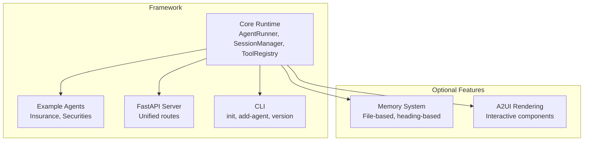
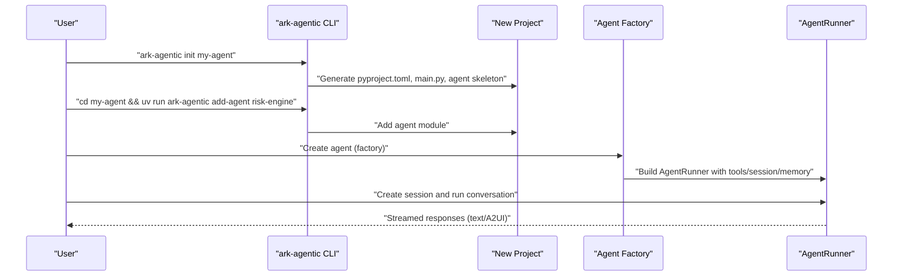
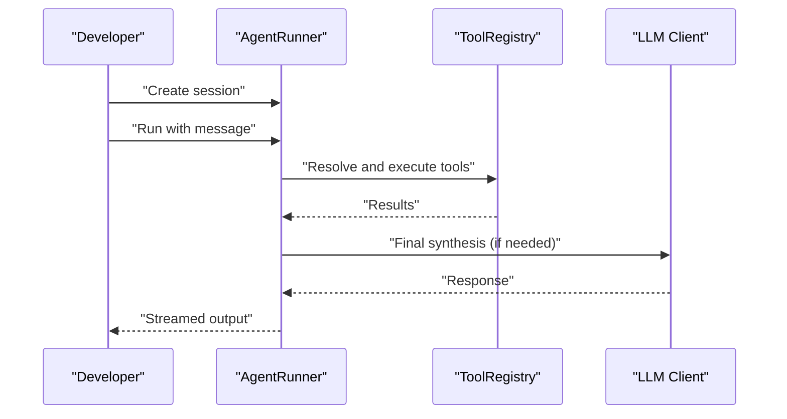
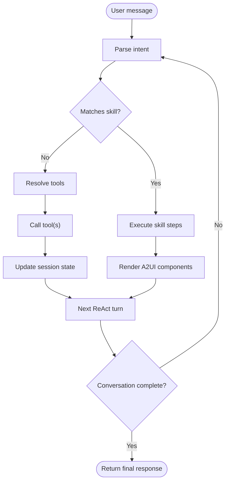
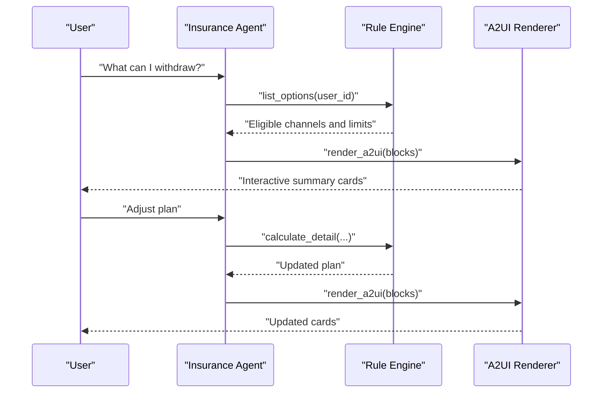
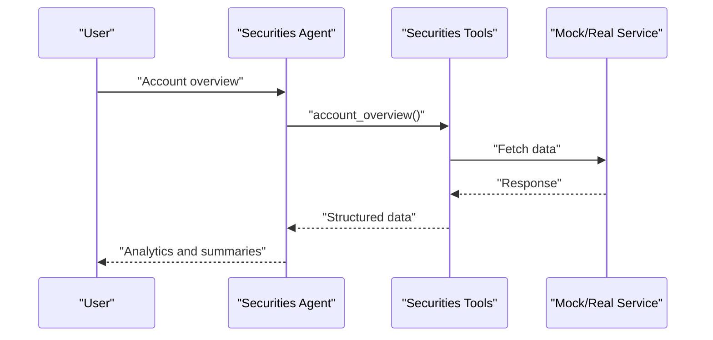
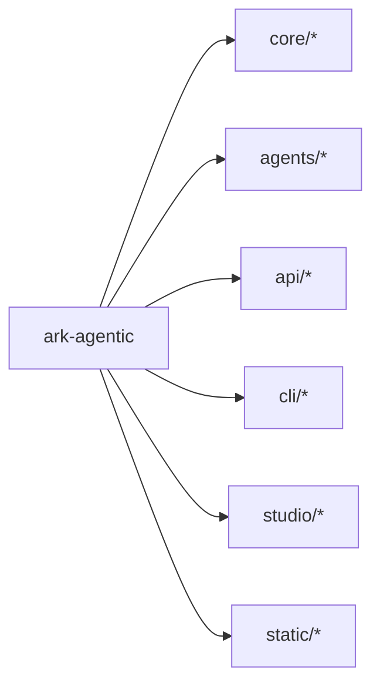

# Getting Started

<cite>
**Referenced Files in This Document**
- [README.md](file://README.md)
- [pyproject.toml](file://pyproject.toml)
- [src/ark_agentic/cli/main.py](file://src/ark_agentic/cli/main.py)
- [src/ark_agentic/cli/templates.py](file://src/ark_agentic/cli/templates.py)
- [src/ark_agentic/app.py](file://src/ark_agentic/app.py)
- [src/ark_agentic/agents/insurance/agent.py](file://src/ark_agentic/agents/insurance/agent.py)
- [src/ark_agentic/agents/securities/agent.py](file://src/ark_agentic/agents/securities/agent.py)
- [src/ark_agentic/agents/insurance/tools/policy_query.py](file://src/ark_agentic/agents/insurance/tools/policy_query.py)
- [src/ark_agentic/agents/insurance/skills/withdraw_money/SKILL.md](file://src/ark_agentic/agents/insurance/skills/withdraw_money/SKILL.md)
- [.env-sample](file://.env-sample)
- [docs/core/memory.md](file://docs/core/memory.md)
- [docs/a2ui/a2ui-standard.md](file://docs/a2ui/a2ui-standard.md)
- [tests/integration/cli/test_cli.py](file://tests/integration/cli/test_cli.py)
</cite>

## Table of Contents
1. [Introduction](#introduction)
2. [Project Structure](#project-structure)
3. [Core Components](#core-components)
4. [Architecture Overview](#architecture-overview)
5. [Detailed Component Analysis](#detailed-component-analysis)
6. [Dependency Analysis](#dependency-analysis)
7. [Performance Considerations](#performance-considerations)
8. [Troubleshooting Guide](#troubleshooting-guide)
9. [Conclusion](#conclusion)
10. [Appendices](#appendices)

## Introduction
This guide helps you quickly install, configure, and run the ark-agentic framework using the uv package manager. It covers:
- Installing the framework and optional extras
- Environment variables and configuration
- Creating and running a simple agent
- Registering tools and running conversations
- Using the CLI to initialize projects, add agents, and run in different modes
- Step-by-step tutorials for common scenarios (insurance withdrawal and securities queries)
- Troubleshooting and links to deeper documentation

## Project Structure
The framework provides:
- A core runtime (AgentRunner, SessionManager, ToolRegistry)
- Example agents (insurance and securities)
- A unified FastAPI server
- A CLI for scaffolding projects and agents
- Optional memory and A2UI capabilities

**Diagram sources**
- [README.md: 521-582:521-582](file://README.md#L521-L582)
- [src/ark_agentic/app.py: 41-101:41-101](file://src/ark_agentic/app.py#L41-L101)
- [src/ark_agentic/cli/main.py: 212-256:212-256](file://src/ark_agentic/cli/main.py#L212-L256)

**Section sources**
- [README.md: 521-582:521-582](file://README.md#L521-L582)

## Core Components
- AgentRunner: Executes ReAct loops, manages turns, and integrates tools and skills.
- SessionManager: Handles persistent JSONL sessions, compaction, and summarization.
- ToolRegistry: Central place to register and discover tools.
- Agent factories: Prebuilt agents (insurance, securities) demonstrate configuration patterns.
- Memory system: Optional file-based memory with heading-based upsert and periodic distillation.
- A2UI: Tools can return interactive components for rich front-end experiences.

Key entry points:
- Programmatic usage: [README.md: 41-62:41-62](file://README.md#L41-L62)
- API server: [src/ark_agentic/app.py: 84-160:84-160](file://src/ark_agentic/app.py#L84-L160)
- Insurance agent factory: [src/ark_agentic/agents/insurance/agent.py: 45-123:45-123](file://src/ark_agentic/agents/insurance/agent.py#L45-L123)
- Securities agent factory: [src/ark_agentic/agents/securities/agent.py: 38-128:38-128](file://src/ark_agentic/agents/securities/agent.py#L38-L128)

**Section sources**
- [README.md: 41-62:41-62](file://README.md#L41-L62)
- [src/ark_agentic/app.py: 84-160:84-160](file://src/ark_agentic/app.py#L84-L160)
- [src/ark_agentic/agents/insurance/agent.py: 45-123:45-123](file://src/ark_agentic/agents/insurance/agent.py#L45-L123)
- [src/ark_agentic/agents/securities/agent.py: 38-128:38-128](file://src/ark_agentic/agents/securities/agent.py#L38-L128)

## Architecture Overview
The framework supports:
- Mock mode for demos without API keys
- Interactive mode for conversational agents
- Unified API server exposing chat endpoints
- CLI scaffolding for new projects and agents

**Diagram sources**
- [README.md: 160-181:160-181](file://README.md#L160-L181)
- [src/ark_agentic/cli/main.py: 84-154:84-154](file://src/ark_agentic/cli/main.py#L84-L154)
- [src/ark_agentic/cli/templates.py: 9-124:9-124](file://src/ark_agentic/cli/templates.py#L9-L124)

**Section sources**
- [README.md: 144-181:144-181](file://README.md#L144-L181)
- [src/ark_agentic/cli/main.py: 84-154:84-154](file://src/ark_agentic/cli/main.py#L84-L154)
- [src/ark_agentic/cli/templates.py: 9-124:9-124](file://src/ark_agentic/cli/templates.py#L9-L124)

## Detailed Component Analysis

### Installation and Setup
- Install via uv:
  - From git: [README.md: 19-24:19-24](file://README.md#L19-L24)
  - Optional extras: [README.md: 26-37:26-37](file://README.md#L26-L37)
- Project dependencies and scripts: [pyproject.toml: 1-44:1-44](file://pyproject.toml#L1-L44)
- Environment variables reference: [README.md: 584-595:584-595](file://README.md#L584-L595)
- Full environment variable template: [.env-sample: 1-69:1-69](file://.env-sample#L1-L69)

Quick steps:
1) Initialize a new project with the CLI:
   - [README.md: 170-181:170-181](file://README.md#L170-L181)
   - [src/ark_agentic/cli/main.py: 84-154:84-154](file://src/ark_agentic/cli/main.py#L84-L154)
2) Configure environment variables using the generated .env-sample:
   - [src/ark_agentic/cli/templates.py: 144-154:144-154](file://src/ark_agentic/cli/templates.py#L144-L154)
   - [.env-sample: 16-31:16-31](file://.env-sample#L16-L31)

**Section sources**
- [README.md: 19-37:19-37](file://README.md#L19-L37)
- [pyproject.toml: 1-44:1-44](file://pyproject.toml#L1-L44)
- [README.md: 584-595:584-595](file://README.md#L584-L595)
- [src/ark_agentic/cli/main.py: 84-154:84-154](file://src/ark_agentic/cli/main.py#L84-L154)
- [src/ark_agentic/cli/templates.py: 144-154:144-154](file://src/ark_agentic/cli/templates.py#L144-L154)
- [.env-sample: 16-31:16-31](file://.env-sample#L16-L31)

### Basic Usage Examples
- Programmatic agent creation and conversation:
  - [README.md: 41-62:41-62](file://README.md#L41-L62)
- Running the unified API server:
  - [README.md: 64-86:64-86](file://README.md#L64-L86)
  - [src/ark_agentic/app.py: 142-160:142-160](file://src/ark_agentic/app.py#L142-L160)
- CLI modes (mock and interactive):
  - [README.md: 144-158:144-158](file://README.md#L144-L158)

**Diagram sources**
- [README.md: 41-62:41-62](file://README.md#L41-L62)
- [src/ark_agentic/agents/insurance/agent.py: 68-121:68-121](file://src/ark_agentic/agents/insurance/agent.py#L68-L121)

**Section sources**
- [README.md: 41-62:41-62](file://README.md#L41-L62)
- [src/ark_agentic/agents/insurance/agent.py: 68-121:68-121](file://src/ark_agentic/agents/insurance/agent.py#L68-L121)

### Registering Tools and Running Conversations
- Tool definition pattern:
  - [src/ark_agentic/agents/insurance/tools/policy_query.py: 26-93:26-93](file://src/ark_agentic/agents/insurance/tools/policy_query.py#L26-L93)
- Agent tool registration:
  - [src/ark_agentic/agents/insurance/agent.py: 68-69:68-69](file://src/ark_agentic/agents/insurance/agent.py#L68-L69)
- Example skill-driven flow (withdraw money):
  - [src/ark_agentic/agents/insurance/skills/withdraw_money/SKILL.md: 1-270:1-270](file://src/ark_agentic/agents/insurance/skills/withdraw_money/SKILL.md#L1-L270)

**Diagram sources**
- [src/ark_agentic/agents/insurance/tools/policy_query.py: 62-93:62-93](file://src/ark_agentic/agents/insurance/tools/policy_query.py#L62-L93)
- [src/ark_agentic/agents/insurance/skills/withdraw_money/SKILL.md: 25-48:25-48](file://src/ark_agentic/agents/insurance/skills/withdraw_money/SKILL.md#L25-L48)

**Section sources**
- [src/ark_agentic/agents/insurance/tools/policy_query.py: 26-93:26-93](file://src/ark_agentic/agents/insurance/tools/policy_query.py#L26-L93)
- [src/ark_agentic/agents/insurance/agent.py: 68-69:68-69](file://src/ark_agentic/agents/insurance/agent.py#L68-L69)
- [src/ark_agentic/agents/insurance/skills/withdraw_money/SKILL.md: 1-270:1-270](file://src/ark_agentic/agents/insurance/skills/withdraw_money/SKILL.md#L1-L270)

### CLI Commands
- Initialize a new project:
  - [README.md: 170-171:170-171](file://README.md#L170-L171)
  - [src/ark_agentic/cli/main.py: 84-154:84-154](file://src/ark_agentic/cli/main.py#L84-L154)
- Add an agent to an existing project:
  - [README.md: 178-180:178-180](file://README.md#L178-L180)
  - [src/ark_agentic/cli/main.py: 158-202:158-202](file://src/ark_agentic/cli/main.py#L158-L202)
- Version:
  - [README.md: 160-168:160-168](file://README.md#L160-L168)
  - [src/ark_agentic/cli/main.py: 206-208:206-208](file://src/ark_agentic/cli/main.py#L206-L208)

Validation of CLI behavior:
- [tests/integration/cli/test_cli.py: 153-209:153-209](file://tests/integration/cli/test_cli.py#L153-L209)

**Section sources**
- [README.md: 160-181:160-181](file://README.md#L160-L181)
- [src/ark_agentic/cli/main.py: 84-202:84-202](file://src/ark_agentic/cli/main.py#L84-L202)
- [tests/integration/cli/test_cli.py: 153-209:153-209](file://tests/integration/cli/test_cli.py#L153-L209)

### Quick Start Tutorials

#### Tutorial 1: Insurance Withdrawal
Goal: Help a user explore withdrawal options and adjust a plan.

Steps:
1) Prepare environment:
   - Use .env-sample to set LLM provider and credentials
   - Reference: [.env-sample: 16-31:16-31](file://.env-sample#L16-L31)
2) Create an agent:
   - Use the insurance agent factory
   - Reference: [src/ark_agentic/agents/insurance/agent.py: 45-123:45-123](file://src/ark_agentic/agents/insurance/agent.py#L45-L123)
3) Register tools (if extending):
   - Reference: [src/ark_agentic/agents/insurance/tools/policy_query.py: 26-93:26-93](file://src/ark_agentic/agents/insurance/tools/policy_query.py#L26-L93)
4) Run a conversation:
   - Example prompts: “Show me how much I can withdraw” or “Adjust the plan to X”
   - Skill-driven flow: [src/ark_agentic/agents/insurance/skills/withdraw_money/SKILL.md: 25-48:25-48](file://src/ark_agentic/agents/insurance/skills/withdraw_money/SKILL.md#L25-L48)

**Diagram sources**
- [src/ark_agentic/agents/insurance/skills/withdraw_money/SKILL.md: 78-130:78-130](file://src/ark_agentic/agents/insurance/skills/withdraw_money/SKILL.md#L78-L130)
- [src/ark_agentic/agents/insurance/skills/withdraw_money/SKILL.md: 133-208:133-208](file://src/ark_agentic/agents/insurance/skills/withdraw_money/SKILL.md#L133-L208)

**Section sources**
- [.env-sample: 16-31:16-31](file://.env-sample#L16-L31)
- [src/ark_agentic/agents/insurance/agent.py: 45-123:45-123](file://src/ark_agentic/agents/insurance/agent.py#L45-L123)
- [src/ark_agentic/agents/insurance/tools/policy_query.py: 26-93:26-93](file://src/ark_agentic/agents/insurance/tools/policy_query.py#L26-L93)
- [src/ark_agentic/agents/insurance/skills/withdraw_money/SKILL.md: 25-48:25-48](file://src/ark_agentic/agents/insurance/skills/withdraw_money/SKILL.md#L25-L48)

#### Tutorial 2: Securities Queries
Goal: Query account overview, holdings, and related analytics.

Steps:
1) Prepare environment:
   - Set securities service mock and credentials in .env
   - Reference: [.env-sample: 53-69:53-69](file://.env-sample#L53-L69)
2) Create a securities agent:
   - Reference: [src/ark_agentic/agents/securities/agent.py: 38-128:38-128](file://src/ark_agentic/agents/securities/agent.py#L38-L128)
3) Run queries:
   - Use tools under securities.tools to fetch data
   - The agent registers tools and sets up validation hooks
   - Reference: [src/ark_agentic/agents/securities/agent.py: 66-68:66-68](file://src/ark_agentic/agents/securities/agent.py#L66-L68)

**Diagram sources**
- [src/ark_agentic/agents/securities/agent.py: 66-68:66-68](file://src/ark_agentic/agents/securities/agent.py#L66-L68)

**Section sources**
- [.env-sample: 53-69:53-69](file://.env-sample#L53-L69)
- [src/ark_agentic/agents/securities/agent.py: 38-128:38-128](file://src/ark_agentic/agents/securities/agent.py#L38-L128)
- [src/ark_agentic/agents/securities/agent.py: 66-68:66-68](file://src/ark_agentic/agents/securities/agent.py#L66-L68)

### A2UI and Memory (Optional)
- A2UI component system:
  - Reference: [docs/a2ui/a2ui-standard.md: 1-200:1-200](file://docs/a2ui/a2ui-standard.md#L1-L200)
- Memory system lifecycle:
  - Reference: [docs/core/memory.md: 24-79:24-79](file://docs/core/memory.md#L24-L79)

**Section sources**
- [docs/a2ui/a2ui-standard.md: 1-200:1-200](file://docs/a2ui/a2ui-standard.md#L1-L200)
- [docs/core/memory.md: 24-79:24-79](file://docs/core/memory.md#L24-L79)

## Dependency Analysis
- Core dependencies and scripts:
  - [pyproject.toml: 1-44:1-44](file://pyproject.toml#L1-L44)
- Optional groups:
  - [pyproject.toml: 23-40:23-40](file://pyproject.toml#L23-L40)
- CLI entry point:
  - [pyproject.toml: 42-43:42-43](file://pyproject.toml#L42-L43)

**Diagram sources**
- [pyproject.toml: 49-65:49-65](file://pyproject.toml#L49-L65)
- [README.md: 521-582:521-582](file://README.md#L521-L582)

**Section sources**
- [pyproject.toml: 1-44:1-44](file://pyproject.toml#L1-L44)
- [pyproject.toml: 23-40:23-40](file://pyproject.toml#L23-L40)
- [pyproject.toml: 42-43:42-43](file://pyproject.toml#L42-L43)
- [README.md: 521-582:521-582](file://README.md#L521-L582)

## Performance Considerations
- Parallel tool execution, streaming protocols, zero-DB memory, and context compaction are highlighted in the project documentation.
- Reference: [README.md: 626-634:626-634](file://README.md#L626-L634)

[No sources needed since this section provides general guidance]

## Troubleshooting Guide
Common setup issues and resolutions:
- Missing API key or incorrect provider configuration:
  - Verify environment variables against .env-sample
  - References: [.env-sample: 16-31:16-31](file://.env-sample#L16-L31), [README.md: 584-595:584-595](file://README.md#L584-L595)
- CLI initialization fails:
  - Ensure the project directory does not already exist
  - Reference: [tests/integration/cli/test_cli.py: 194-209:194-209](file://tests/integration/cli/test_cli.py#L194-L209)
- API server not starting:
  - Confirm API_HOST and API_PORT
  - Reference: [src/ark_agentic/app.py: 142-160:142-160](file://src/ark_agentic/app.py#L142-L160)
- Mock vs real services:
  - Toggle mock flags for insurance/securities in environment
  - References: [.env-sample: 43-51:43-51](file://.env-sample#L43-L51), [.env-sample: 53-69:53-69](file://.env-sample#L53-L69)

**Section sources**
- [.env-sample: 16-31:16-31](file://.env-sample#L16-L31)
- [.env-sample: 43-51:43-51](file://.env-sample#L43-L51)
- [.env-sample: 53-69:53-69](file://.env-sample#L53-L69)
- [tests/integration/cli/test_cli.py: 194-209:194-209](file://tests/integration/cli/test_cli.py#L194-L209)
- [src/ark_agentic/app.py: 142-160:142-160](file://src/ark_agentic/app.py#L142-L160)

## Conclusion
You now have the essentials to install the framework, configure environment variables, scaffold projects with the CLI, and run agents in mock or interactive modes. Extend agents by registering tools and leveraging skills and A2UI for rich interactions. For deeper dives, consult the linked documentation sections.

[No sources needed since this section summarizes without analyzing specific files]

## Appendices

### Appendix A: Environment Variables Reference
- Application and LLM settings:
  - [README.md: 584-595:584-595](file://README.md#L584-L595)
  - [.env-sample: 5-31:5-31](file://.env-sample#L5-L31)
- Insurance and securities service toggles:
  - [.env-sample: 42-69:42-69](file://.env-sample#L42-L69)

**Section sources**
- [README.md: 584-595:584-595](file://README.md#L584-L595)
- [.env-sample: 5-31:5-31](file://.env-sample#L5-L31)
- [.env-sample: 42-69:42-69](file://.env-sample#L42-L69)

### Appendix B: CLI Templates Contract
- Template rendering and scaffolding:
  - [src/ark_agentic/cli/templates.py: 9-124:9-124](file://src/ark_agentic/cli/templates.py#L9-L124)
  - [src/ark_agentic/cli/templates.py: 144-154:144-154](file://src/ark_agentic/cli/templates.py#L144-L154)
- CLI behavior tests:
  - [tests/integration/cli/test_cli.py: 153-209:153-209](file://tests/integration/cli/test_cli.py#L153-L209)

**Section sources**
- [src/ark_agentic/cli/templates.py: 9-124:9-124](file://src/ark_agentic/cli/templates.py#L9-L124)
- [src/ark_agentic/cli/templates.py: 144-154:144-154](file://src/ark_agentic/cli/templates.py#L144-L154)
- [tests/integration/cli/test_cli.py: 153-209:153-209](file://tests/integration/cli/test_cli.py#L153-L209)