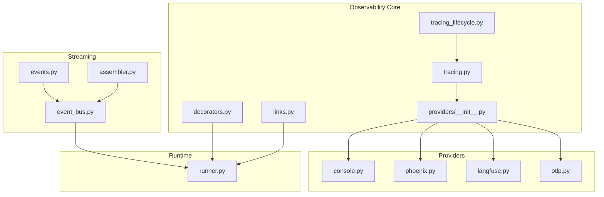
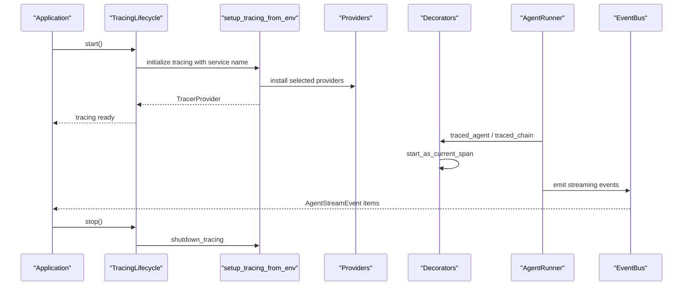
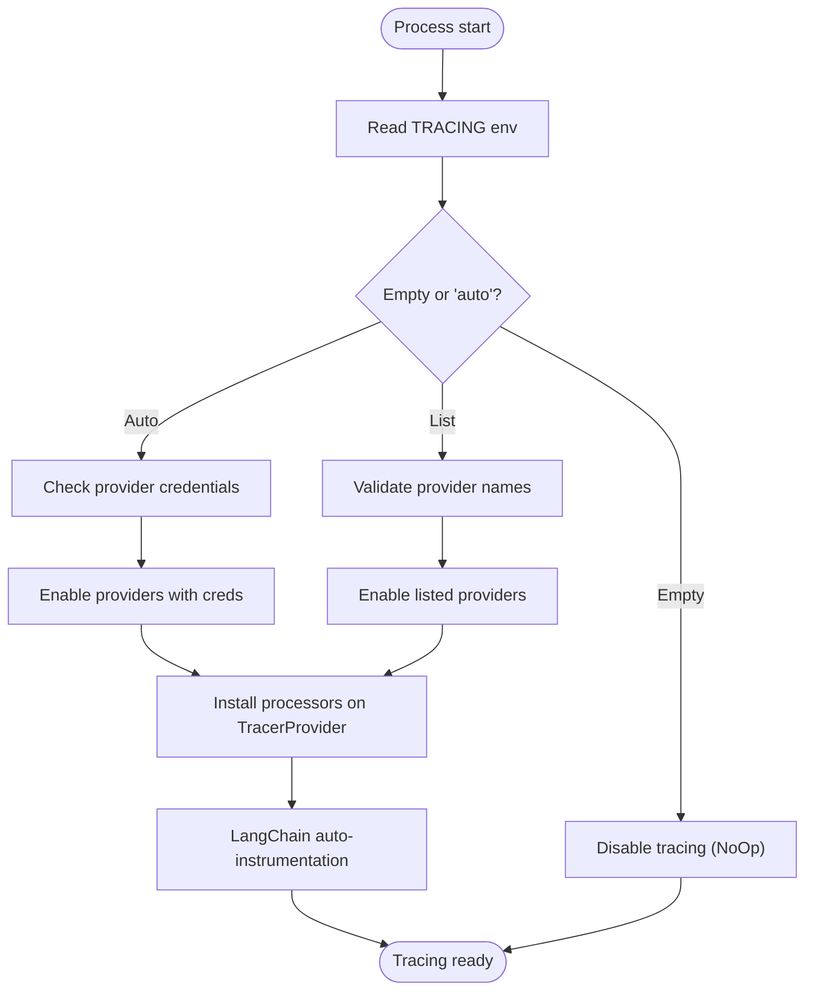
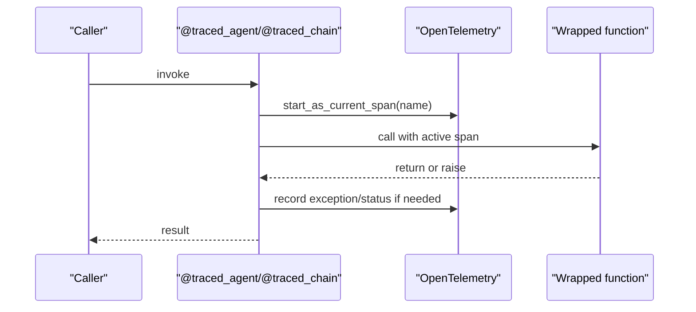
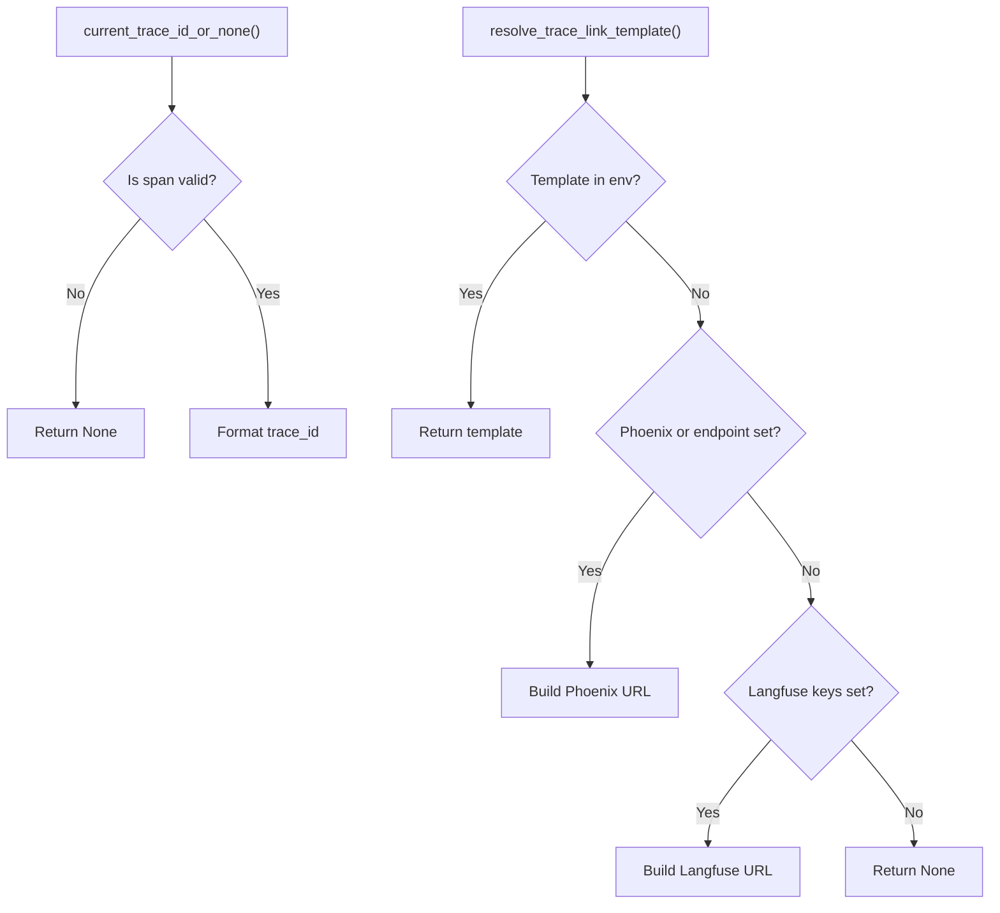
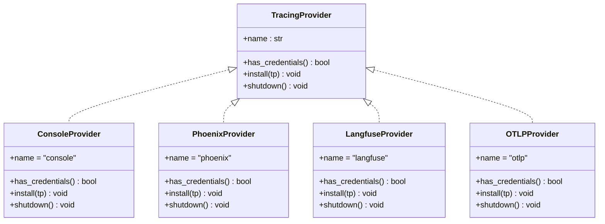
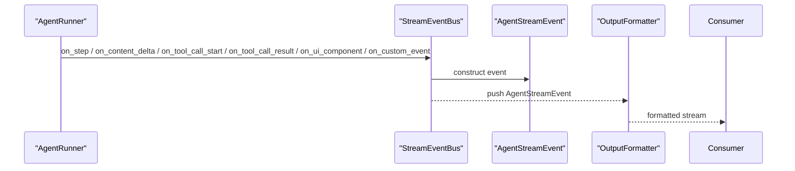
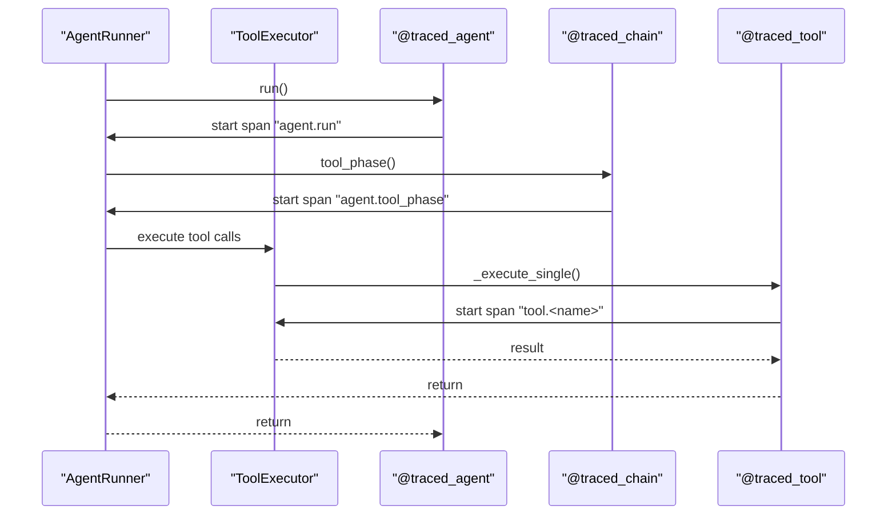
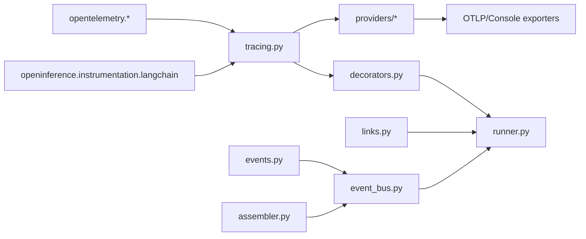

# Observability and Monitoring

<cite>
**Referenced Files in This Document**
- [__init__.py](file://src/ark_agentic/core/observability/__init__.py)
- [tracing.py](file://src/ark_agentic/core/observability/tracing.py)
- [decorators.py](file://src/ark_agentic/core/observability/decorators.py)
- [tracing_lifecycle.py](file://src/ark_agentic/core/observability/tracing_lifecycle.py)
- [links.py](file://src/ark_agentic/core/observability/links.py)
- [providers/__init__.py](file://src/ark_agentic/core/observability/providers/__init__.py)
- [providers/console.py](file://src/ark_agentic/core/observability/providers/console.py)
- [providers/phoenix.py](file://src/ark_agentic/core/observability/providers/phoenix.py)
- [providers/langfuse.py](file://src/ark_agentic/core/observability/providers/langfuse.py)
- [providers/otlp.py](file://src/ark_agentic/core/observability/providers/otlp.py)
- [event_bus.py](file://src/ark_agentic/core/stream/event_bus.py)
- [events.py](file://src/ark_agentic/core/stream/events.py)
- [assembler.py](file://src/ark_agentic/core/stream/assembler.py)
- [runner.py](file://src/ark_agentic/core/runtime/runner.py)
- [test_tracing.py](file://tests/unit/core/test_tracing.py)
</cite>

## Table of Contents
1. [Introduction](#introduction)
2. [Project Structure](#project-structure)
3. [Core Components](#core-components)
4. [Architecture Overview](#architecture-overview)
5. [Detailed Component Analysis](#detailed-component-analysis)
6. [Dependency Analysis](#dependency-analysis)
7. [Performance Considerations](#performance-considerations)
8. [Troubleshooting Guide](#troubleshooting-guide)
9. [Conclusion](#conclusion)
10. [Appendices](#appendices)

## Introduction
This document explains the observability and monitoring system for distributed tracing, metrics collection, and debugging in the project. It covers the multi-provider tracing architecture supporting Console, Phoenix, Langfuse, and OTLP exporters; automatic LangChain instrumentation; custom span attributes and trace correlation across agent executions; the decorator system for adding observability to functions; the event bus for telemetry data; and integration with OpenTelemetry standards. Practical examples demonstrate trace visualization, performance monitoring, and debugging agent behavior, along with configuration guidelines, troubleshooting, privacy considerations, performance impact, and production best practices.

## Project Structure
The observability subsystem resides under core/observability and integrates with the runtime and streaming layers:
- Observability core: decorators, tracing setup/shutdown, lifecycle, and trace link helpers
- Providers: Console, Phoenix, Langfuse, and generic OTLP
- Runtime integration: decorators applied to agent and tool execution phases
- Streaming telemetry: event bus and structured events for UI and downstream systems

**Diagram sources**
- [tracing.py:1-119](file://src/ark_agentic/core/observability/tracing.py#L1-L119)
- [providers/__init__.py:1-46](file://src/ark_agentic/core/observability/providers/__init__.py#L1-L46)
- [providers/console.py:1-35](file://src/ark_agentic/core/observability/providers/console.py#L1-L35)
- [providers/phoenix.py:1-67](file://src/ark_agentic/core/observability/providers/phoenix.py#L1-L67)
- [providers/langfuse.py:1-48](file://src/ark_agentic/core/observability/providers/langfuse.py#L1-L48)
- [providers/otlp.py:1-40](file://src/ark_agentic/core/observability/providers/otlp.py#L1-L40)
- [decorators.py:1-197](file://src/ark_agentic/core/observability/decorators.py#L1-L197)
- [tracing_lifecycle.py:1-42](file://src/ark_agentic/core/observability/tracing_lifecycle.py#L1-L42)
- [links.py:1-61](file://src/ark_agentic/core/observability/links.py#L1-L61)
- [runner.py:1-200](file://src/ark_agentic/core/runtime/runner.py#L1-L200)
- [event_bus.py:1-248](file://src/ark_agentic/core/stream/event_bus.py#L1-L248)
- [events.py:1-116](file://src/ark_agentic/core/stream/events.py#L1-L116)
- [assembler.py:1-398](file://src/ark_agentic/core/stream/assembler.py#L1-L398)

**Section sources**
- [__init__.py:1-34](file://src/ark_agentic/core/observability/__init__.py#L1-L34)
- [tracing.py:1-119](file://src/ark_agentic/core/observability/tracing.py#L1-L119)
- [providers/__init__.py:1-46](file://src/ark_agentic/core/observability/providers/__init__.py#L1-L46)

## Core Components
- Multi-provider tracing setup and lifecycle:
  - Environment-driven selection of providers via a single variable
  - Automatic LangChain auto-instrumentation when any provider is enabled
  - Lifecycle component that starts/stops tracing consistently
- Decorators for observability:
  - Agent, chain, and tool spans with OpenInference semantics
  - Helpers to attach dynamic attributes, inputs, and outputs
- Trace link helpers:
  - Capture current trace_id and resolve UI deep-link templates
- Provider registry:
  - Pluggable providers for Console, Phoenix, Langfuse, and generic OTLP
- Event bus and streaming:
  - Structured events for UI and downstream consumers
  - Assembler to reconstruct messages from streaming deltas

**Section sources**
- [tracing.py:1-119](file://src/ark_agentic/core/observability/tracing.py#L1-L119)
- [tracing_lifecycle.py:1-42](file://src/ark_agentic/core/observability/tracing_lifecycle.py#L1-L42)
- [decorators.py:1-197](file://src/ark_agentic/core/observability/decorators.py#L1-L197)
- [links.py:1-61](file://src/ark_agentic/core/observability/links.py#L1-L61)
- [providers/__init__.py:1-46](file://src/ark_agentic/core/observability/providers/__init__.py#L1-L46)
- [event_bus.py:1-248](file://src/ark_agentic/core/stream/event_bus.py#L1-L248)
- [events.py:1-116](file://src/ark_agentic/core/stream/events.py#L1-L116)
- [assembler.py:1-398](file://src/ark_agentic/core/stream/assembler.py#L1-L398)

## Architecture Overview
The observability architecture centers on OpenTelemetry with a flexible provider model and decorator-based instrumentation. The lifecycle component ensures tracing is initialized and shut down safely. Providers export spans to Console, Phoenix, Langfuse, or generic OTLP collectors. The event bus emits structured streaming telemetry for UI rendering and debugging.

**Diagram sources**
- [tracing_lifecycle.py:21-42](file://src/ark_agentic/core/observability/tracing_lifecycle.py#L21-L42)
- [tracing.py:56-119](file://src/ark_agentic/core/observability/tracing.py#L56-L119)
- [providers/__init__.py:30-45](file://src/ark_agentic/core/observability/providers/__init__.py#L30-L45)
- [decorators.py:79-151](file://src/ark_agentic/core/observability/decorators.py#L79-L151)
- [runner.py:979-1008](file://src/ark_agentic/core/runtime/runner.py#L979-L1008)
- [event_bus.py:67-248](file://src/ark_agentic/core/stream/event_bus.py#L67-L248)

## Detailed Component Analysis

### Multi-Provider Tracing Setup and Lifecycle
- Provider selection:
  - Single environment variable controls which providers are enabled
  - Supports explicit list, auto-detection based on credentials, and disabling
- LangChain auto-instrumentation:
  - Automatically instruments ChatOpenAI to capture LLM internals as child spans
- Lifecycle management:
  - Starts tracing during bootstrap and shuts down gracefully on exit
- Zero-cost when disabled:
  - Absent configuration uses NoOp tracer; decorators become no-ops

**Diagram sources**
- [tracing.py:35-99](file://src/ark_agentic/core/observability/tracing.py#L35-L99)
- [providers/__init__.py:30-45](file://src/ark_agentic/core/observability/providers/__init__.py#L30-L45)

**Section sources**
- [tracing.py:1-119](file://src/ark_agentic/core/observability/tracing.py#L1-L119)
- [tracing_lifecycle.py:1-42](file://src/ark_agentic/core/observability/tracing_lifecycle.py#L1-L42)

### Decorator System for Function Observability
- Decorators:
  - Agent, chain, and tool spans with OpenInference span kinds
  - Automatic exception recording and error attributes
- Dynamic attributes and payloads:
  - Helper functions to set attributes, inputs, and outputs
  - Tool decorator serializes tool call metadata and results
- Decorator behavior validated by tests:
  - Spans open/close correctly
  - Parent-child relationships form expected trees
  - Exceptions propagate and mark spans as errors

**Diagram sources**
- [decorators.py:79-151](file://src/ark_agentic/core/observability/decorators.py#L79-L151)
- [test_tracing.py:56-166](file://tests/unit/core/test_tracing.py#L56-L166)

**Section sources**
- [decorators.py:1-197](file://src/ark_agentic/core/observability/decorators.py#L1-L197)
- [test_tracing.py:1-166](file://tests/unit/core/test_tracing.py#L1-L166)

### Trace Link Helpers and Correlation
- Current trace capture:
  - Extracts active trace_id when valid; otherwise None
- Deep-link resolution:
  - Operator-configurable template
  - Phoenix and Langfuse auto-construction based on environment
- Integration with runtime:
  - Used to correlate UI actions and traces

**Diagram sources**
- [links.py:16-61](file://src/ark_agentic/core/observability/links.py#L16-L61)

**Section sources**
- [links.py:1-61](file://src/ark_agentic/core/observability/links.py#L1-L61)

### Provider Implementations
- Console provider:
  - Prints spans to stdout; useful for local development
- Phoenix provider:
  - OTLP exporter to Phoenix collector with configurable endpoint, project, and flags
- Langfuse provider:
  - OTLP exporter with Basic auth header using public/secret keys
- Generic OTLP provider:
  - Reads standard OpenTelemetry exporter environment variables

**Diagram sources**
- [providers/__init__.py:20-45](file://src/ark_agentic/core/observability/providers/__init__.py#L20-L45)
- [providers/console.py:11-35](file://src/ark_agentic/core/observability/providers/console.py#L11-L35)
- [providers/phoenix.py:17-67](file://src/ark_agentic/core/observability/providers/phoenix.py#L17-L67)
- [providers/langfuse.py:13-48](file://src/ark_agentic/core/observability/providers/langfuse.py#L13-L48)
- [providers/otlp.py:12-40](file://src/ark_agentic/core/observability/providers/otlp.py#L12-L40)

**Section sources**
- [providers/__init__.py:1-46](file://src/ark_agentic/core/observability/providers/__init__.py#L1-L46)
- [providers/console.py:1-35](file://src/ark_agentic/core/observability/providers/console.py#L1-L35)
- [providers/phoenix.py:1-67](file://src/ark_agentic/core/observability/providers/phoenix.py#L1-L67)
- [providers/langfuse.py:1-48](file://src/ark_agentic/core/observability/providers/langfuse.py#L1-L48)
- [providers/otlp.py:1-40](file://src/ark_agentic/core/observability/providers/otlp.py#L1-L40)

### Event Bus and Telemetry Data
- Event bus:
  - Translates runner callbacks into structured AgentStreamEvent items
  - Maintains pairing of start/finish events and sequences messages
- Events model:
  - Defines 17 event types aligned with AG-UI protocol
- Assembler:
  - Reconstructs AgentMessage from streaming deltas and tool-call JSON parsing

**Diagram sources**
- [event_bus.py:67-248](file://src/ark_agentic/core/stream/event_bus.py#L67-L248)
- [events.py:67-116](file://src/ark_agentic/core/stream/events.py#L67-L116)
- [assembler.py:79-398](file://src/ark_agentic/core/stream/assembler.py#L79-L398)

**Section sources**
- [event_bus.py:1-248](file://src/ark_agentic/core/stream/event_bus.py#L1-L248)
- [events.py:1-116](file://src/ark_agentic/core/stream/events.py#L1-L116)
- [assembler.py:1-398](file://src/ark_agentic/core/stream/assembler.py#L1-L398)

### Integration with Agent Execution
- Decorators applied to key phases:
  - Agent run, tool phase, and tool execution
- Dynamic attributes and outputs:
  - Adds run metadata, tool counts, and structured outputs
- LangChain auto-instrumentation:
  - Captures ChatOpenAI internals as child spans

**Diagram sources**
- [runner.py:979-1008](file://src/ark_agentic/core/runtime/runner.py#L979-L1008)
- [decorators.py:109-151](file://src/ark_agentic/core/observability/decorators.py#L109-L151)

**Section sources**
- [runner.py:959-1008](file://src/ark_agentic/core/runtime/runner.py#L959-L1008)
- [decorators.py:109-151](file://src/ark_agentic/core/observability/decorators.py#L109-L151)

## Dependency Analysis
- Observability depends on OpenTelemetry SDK and optional LangChain instrumentation
- Providers depend on OTLP exporters and external libraries (Phoenix)
- Runtime integrates decorators and links for trace correlation
- Streaming layer depends on event models and assembler logic

**Diagram sources**
- [tracing.py:26-96](file://src/ark_agentic/core/observability/tracing.py#L26-L96)
- [providers/__init__.py:14-17](file://src/ark_agentic/core/observability/providers/__init__.py#L14-L17)
- [decorators.py:26-47](file://src/ark_agentic/core/observability/decorators.py#L26-L47)
- [runner.py:40-46](file://src/ark_agentic/core/runtime/runner.py#L40-L46)
- [event_bus.py:20](file://src/ark_agentic/core/stream/event_bus.py#L20)
- [events.py:27](file://src/ark_agentic/core/stream/events.py#L27)
- [assembler.py:17](file://src/ark_agentic/core/stream/assembler.py#L17)

**Section sources**
- [tracing.py:26-96](file://src/ark_agentic/core/observability/tracing.py#L26-L96)
- [providers/__init__.py:14-17](file://src/ark_agentic/core/observability/providers/__init__.py#L14-L17)
- [decorators.py:26-47](file://src/ark_agentic/core/observability/decorators.py#L26-L47)
- [runner.py:40-46](file://src/ark_agentic/core/runtime/runner.py#L40-L46)
- [event_bus.py:20](file://src/ark_agentic/core/stream/event_bus.py#L20)
- [events.py:27](file://src/ark_agentic/core/stream/events.py#L27)
- [assembler.py:17](file://src/ark_agentic/core/stream/assembler.py#L17)

## Performance Considerations
- Zero-cost when disabled:
  - No tracer provider installed; decorators are no-ops
- Exporter batching:
  - Phoenix and generic OTLP providers use batch processors to reduce overhead
- Serialization safeguards:
  - Tool output serialization failures are caught and logged without breaking execution
- Streaming truncation:
  - Long tool results are truncated to limit payload sizes

Recommendations:
- Prefer disabling tracing in low-resource environments or for short-lived tasks
- Tune batch sizes and endpoint reliability for production backends
- Avoid capturing sensitive or excessively large payloads in span attributes

**Section sources**
- [tracing.py:38-67](file://src/ark_agentic/core/observability/tracing.py#L38-L67)
- [providers/phoenix.py:35-61](file://src/ark_agentic/core/observability/providers/phoenix.py#L35-L61)
- [providers/otlp.py:21-34](file://src/ark_agentic/core/observability/providers/otlp.py#L21-L34)
- [decorators.py:146-148](file://src/ark_agentic/core/observability/decorators.py#L146-L148)
- [event_bus.py:186-200](file://src/ark_agentic/core/stream/event_bus.py#L186-L200)

## Troubleshooting Guide
Common issues and resolutions:
- Tracing not appearing:
  - Verify TRACING environment variable and provider credentials
  - Confirm LangChain instrumentation is available if expecting LLM internals
- Incorrect or missing deep-links:
  - Set STUDIO_TRACE_URL_TEMPLATE or configure backend-specific endpoints
  - Ensure Phoenix/Langfuse endpoints and keys are correct
- Excessive or sensitive data in traces:
  - Avoid setting large or confidential values as span attributes
  - Use add_span_attributes judiciously and sanitize inputs
- Performance regressions:
  - Disable tracing or reduce batch sizes
  - Limit tool result sizes and avoid frequent high-cardinality attributes

Validation:
- Unit tests confirm decorator behavior, parent-child span trees, and error propagation

**Section sources**
- [links.py:30-61](file://src/ark_agentic/core/observability/links.py#L30-L61)
- [test_tracing.py:56-166](file://tests/unit/core/test_tracing.py#L56-L166)

## Conclusion
The observability system provides a robust, extensible foundation for distributed tracing and streaming telemetry. Its multi-provider architecture supports diverse backends, automatic LangChain instrumentation simplifies LLM observability, and decorators offer fine-grained control over span creation and attributes. Combined with the event bus and structured events, operators can visualize agent behavior, debug execution paths, and monitor performance effectively—while maintaining strong defaults for privacy and performance.

## Appendices

### Configuration Guidelines
- Environment variables:
  - TRACING: comma-separated provider list (console, phoenix, langfuse, otlp) or "auto"
  - OTEL_SERVICE_NAME: service name for resources
  - PHOENIX_COLLECTOR_ENDPOINT, PHOENIX_PROJECT_NAME, PHOENIX_PROTOCOL: Phoenix settings
  - LANGFUSE_PUBLIC_KEY, LANGFUSE_SECRET_KEY, LANGFUSE_HOST: Langfuse settings
  - OTEL_EXPORTER_OTLP_ENDPOINT, OTEL_EXPORTER_OTLP_HEADERS: Generic OTLP settings
  - STUDIO_TRACE_URL_TEMPLATE: Custom trace link template
- Provider-specific notes:
  - Console: requires explicit inclusion in TRACING; prints to stdout
  - Phoenix: auto-instruments by default; configure endpoint and project
  - Langfuse: requires both public and secret keys; uses Basic auth
  - OTLP: relies on standard OpenTelemetry exporter environment variables

**Section sources**
- [tracing.py:35-53](file://src/ark_agentic/core/observability/tracing.py#L35-L53)
- [providers/console.py:17-29](file://src/ark_agentic/core/observability/providers/console.py#L17-L29)
- [providers/phoenix.py:23-61](file://src/ark_agentic/core/observability/providers/phoenix.py#L23-L61)
- [providers/langfuse.py:19-42](file://src/ark_agentic/core/observability/providers/langfuse.py#L19-L42)
- [providers/otlp.py:18-34](file://src/ark_agentic/core/observability/providers/otlp.py#L18-L34)
- [links.py:30-61](file://src/ark_agentic/core/observability/links.py#L30-L61)

### Practical Examples
- Trace visualization:
  - Use resolved trace link templates to navigate to Phoenix or Langfuse UIs
- Performance monitoring:
  - Attach attributes for turns, tool counts, and finish reasons; observe LLM usage spans from auto-instrumentation
- Debugging agent behavior:
  - Inspect tool spans for parameters and results; leverage parent-child trees to trace execution flow

**Section sources**
- [links.py:30-61](file://src/ark_agentic/core/observability/links.py#L30-L61)
- [runner.py:959-1008](file://src/ark_agentic/core/runtime/runner.py#L959-L1008)
- [decorators.py:109-151](file://src/ark_agentic/core/observability/decorators.py#L109-L151)