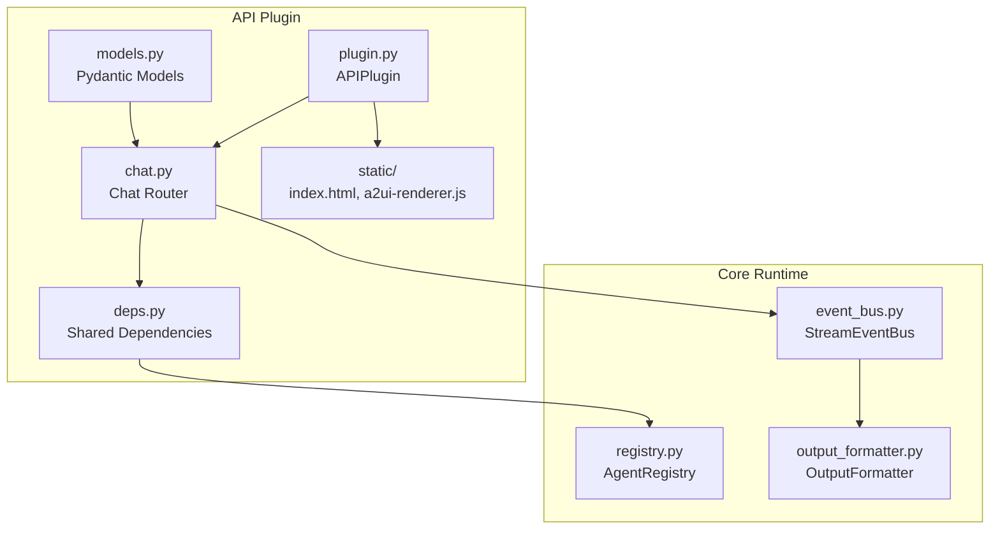
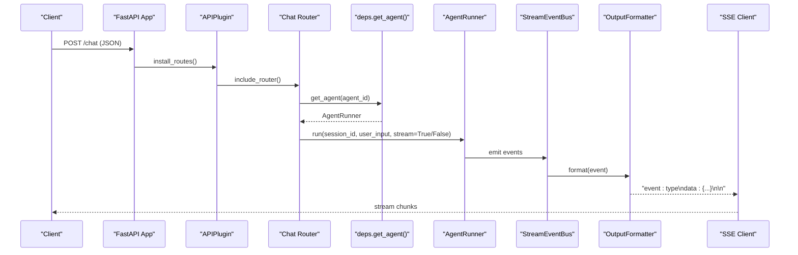
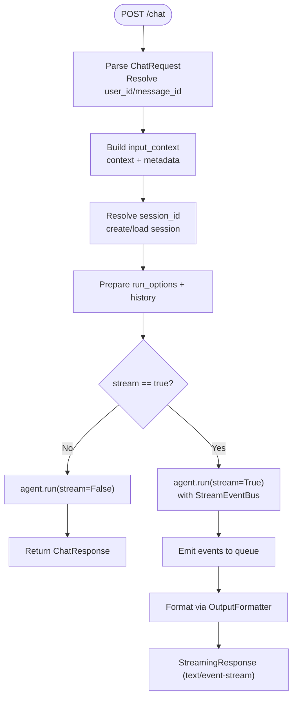
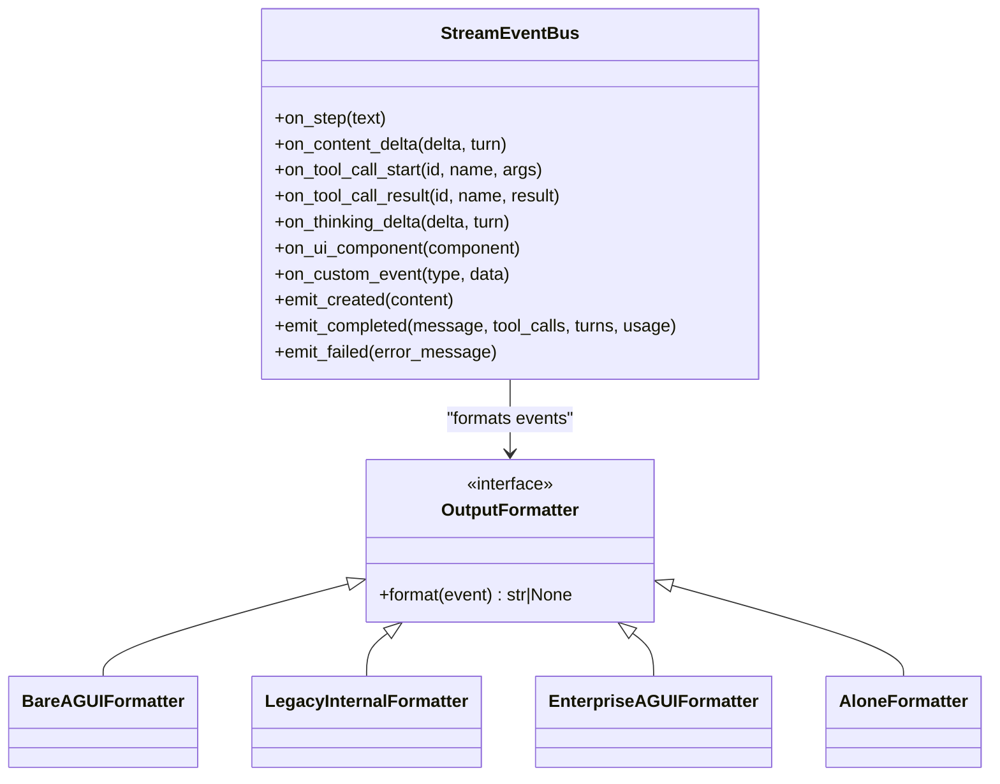
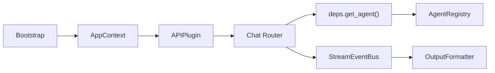

# API Plugin

<cite>
**Referenced Files in This Document**
- [plugin.py](file://src/ark_agentic/plugins/api/plugin.py)
- [chat.py](file://src/ark_agentic/plugins/api/chat.py)
- [deps.py](file://src/ark_agentic/plugins/api/deps.py)
- [models.py](file://src/ark_agentic/plugins/api/models.py)
- [index.html](file://src/ark_agentic/plugins/api/static/index.html)
- [a2ui-renderer.js](file://src/ark_agentic/plugins/api/static/a2ui-renderer.js)
- [event_bus.py](file://src/ark_agentic/core/stream/event_bus.py)
- [output_formatter.py](file://src/ark_agentic/core/stream/output_formatter.py)
- [registry.py](file://src/ark_agentic/core/runtime/registry.py)
- [app_context.py](file://src/ark_agentic/core/protocol/app_context.py)
- [bootstrap.py](file://src/ark_agentic/core/protocol/bootstrap.py)
- [.env-sample](file://.env-sample)
</cite>

## Table of Contents
1. [Introduction](#introduction)
2. [Project Structure](#project-structure)
3. [Core Components](#core-components)
4. [Architecture Overview](#architecture-overview)
5. [Detailed Component Analysis](#detailed-component-analysis)
6. [Dependency Analysis](#dependency-analysis)
7. [Performance Considerations](#performance-considerations)
8. [Security Considerations](#security-considerations)
9. [Troubleshooting Guide](#troubleshooting-guide)
10. [Conclusion](#conclusion)
11. [Appendices](#appendices)

## Introduction
The API Plugin provides the HTTP transport layer for the chat API, enabling web-based agent interactions. It serves as the primary entry point for clients to send chat requests and receive streamed responses. The plugin installs a FastAPI router with CORS middleware, a health check endpoint, and a default chat demo page. It integrates with the agent registry via a dependency injection module and supports streaming responses using Server-Sent Events (SSE).

Key responsibilities:
- Install HTTP routes and middleware
- Serve health checks and static assets
- Provide chat endpoint with streaming support
- Resolve agents and sessions using the shared dependency module
- Format stream events for multiple protocols

## Project Structure
The API plugin is organized under src/ark_agentic/plugins/api with the following core files:
- plugin.py: Defines the APIPlugin class, enabling/disabling behavior, middleware installation, route mounting, and static asset serving.
- chat.py: Implements the chat router with request parsing, session resolution, agent invocation, and SSE streaming.
- deps.py: Provides dependency injection for the agent registry and agent lookup.
- models.py: Declares Pydantic models for chat requests, responses, and SSE events.
- static/: Contains index.html (demo UI) and a2ui-renderer.js (A2UI rendering logic).

**Diagram sources**
- [plugin.py:1-87](file://src/ark_agentic/plugins/api/plugin.py#L1-L87)
- [chat.py:1-188](file://src/ark_agentic/plugins/api/chat.py#L1-L188)
- [deps.py:1-37](file://src/ark_agentic/plugins/api/deps.py#L1-L37)
- [models.py:1-104](file://src/ark_agentic/plugins/api/models.py#L1-L104)
- [registry.py:1-29](file://src/ark_agentic/core/runtime/registry.py#L1-L29)
- [event_bus.py:1-248](file://src/ark_agentic/core/stream/event_bus.py#L1-L248)
- [output_formatter.py:1-444](file://src/ark_agentic/core/stream/output_formatter.py#L1-L444)

**Section sources**
- [plugin.py:1-87](file://src/ark_agentic/plugins/api/plugin.py#L1-L87)
- [chat.py:1-188](file://src/ark_agentic/plugins/api/chat.py#L1-L188)
- [deps.py:1-37](file://src/ark_agentic/plugins/api/deps.py#L1-L37)
- [models.py:1-104](file://src/ark_agentic/plugins/api/models.py#L1-L104)

## Core Components
- APIPlugin: Manages plugin lifecycle, CORS middleware, health endpoint, static asset mounting, and route inclusion.
- Chat Router: Handles POST /chat with optional streaming, session/session_id resolution, and input context building.
- Shared Dependencies (deps): Centralizes agent registry initialization and agent lookup.
- Models: Defines ChatRequest, ChatResponse, and SSEEvent for request/response contracts.
- Stream Pipeline: Event bus translates agent lifecycle events into structured stream events, formatted for SSE.

**Section sources**
- [plugin.py:27-87](file://src/ark_agentic/plugins/api/plugin.py#L27-L87)
- [chat.py:24-188](file://src/ark_agentic/plugins/api/chat.py#L24-L188)
- [deps.py:15-37](file://src/ark_agentic/plugins/api/deps.py#L15-L37)
- [models.py:17-104](file://src/ark_agentic/plugins/api/models.py#L17-L104)
- [event_bus.py:67-248](file://src/ark_agentic/core/stream/event_bus.py#L67-L248)
- [output_formatter.py:417-444](file://src/ark_agentic/core/stream/output_formatter.py#L417-L444)

## Architecture Overview
The plugin integrates with the framework’s lifecycle and runtime components. Agents are registered in the AgentRegistry and exposed via the shared dependency module. The chat endpoint invokes the agent runner, emitting events into a queue consumed by the SSE stream.

**Diagram sources**
- [plugin.py:42-64](file://src/ark_agentic/plugins/api/plugin.py#L42-L64)
- [chat.py:28-187](file://src/ark_agentic/plugins/api/chat.py#L28-L187)
- [deps.py:31-37](file://src/ark_agentic/plugins/api/deps.py#L31-L37)
- [event_bus.py:67-248](file://src/ark_agentic/core/stream/event_bus.py#L67-L248)
- [output_formatter.py:417-444](file://src/ark_agentic/core/stream/output_formatter.py#L417-L444)

## Detailed Component Analysis

### APIPlugin
Responsibilities:
- Enable/disable via environment flag (opt-out default).
- Add CORS middleware globally.
- Drop benign Windows probe requests.
- Include chat router.
- Health check endpoint.
- Mount static assets and serve demo index page.

Configuration:
- Environment flag ENABLE_API toggles plugin activation.
- Static assets served under /api/static; demo page at /.

Operational notes:
- Middleware order ensures CORS applies to all routes.
- Windows probe drop prevents log noise.

**Section sources**
- [plugin.py:27-87](file://src/ark_agentic/plugins/api/plugin.py#L27-L87)
- [.env-sample:1-77](file://.env-sample#L1-L77)

### Chat Router (/chat)
Endpoints:
- POST /chat: Accepts ChatRequest, optional streaming.

Request processing:
- Resolve user_id from body or x-ark-user-id header.
- Resolve message_id from body or x-ark-message-id header (auto-generated if missing).
- Build input_context with user:* keys and optional temp:* metadata.
- Resolve session_id from body or x-ark-session-id header; create or load session as needed.
- Prepare run_options and external history (supports JSON string or list).
- Non-streaming: agent.run(stream=False) returns ChatResponse.
- Streaming: agent.run(stream=True) emits events via StreamEventBus and SSE formatter.

Headers:
- x-ark-user-id, x-ark-session-id, x-ark-message-id, x-ark-trace-id.

Response models:
- ChatResponse: session_id, message_id, response, tool_calls, turns, usage.
- SSEEvent: standardized event fields for SSE transport.

**Diagram sources**
- [chat.py:28-187](file://src/ark_agentic/plugins/api/chat.py#L28-L187)
- [models.py:27-68](file://src/ark_agentic/plugins/api/models.py#L27-L68)
- [event_bus.py:67-248](file://src/ark_agentic/core/stream/event_bus.py#L67-L248)
- [output_formatter.py:417-444](file://src/ark_agentic/core/stream/output_formatter.py#L417-L444)

**Section sources**
- [chat.py:24-188](file://src/ark_agentic/plugins/api/chat.py#L24-L188)
- [models.py:17-104](file://src/ark_agentic/plugins/api/models.py#L17-L104)

### Shared Dependencies (deps)
Purpose:
- Initialize and expose a single AgentRegistry instance to the plugin.
- Provide get_agent(agent_id) with 404 handling.

Initialization:
- APIPlugin.start(ctx) calls deps.init_registry(ctx.agent_registry).

Usage:
- chat.py imports deps and calls get_agent(request.agent_id).

**Section sources**
- [deps.py:1-37](file://src/ark_agentic/plugins/api/deps.py#L1-L37)
- [plugin.py:35-40](file://src/ark_agentic/plugins/api/plugin.py#L35-L40)
- [registry.py:1-29](file://src/ark_agentic/core/runtime/registry.py#L1-L29)
- [app_context.py:23-26](file://src/ark_agentic/core/protocol/app_context.py#L23-L26)
- [bootstrap.py:100-114](file://src/ark_agentic/core/protocol/bootstrap.py#L100-L114)

### Stream Pipeline
Event Bus:
- StreamEventBus translates agent callbacks into AgentStreamEvent instances.
- Maintains state for steps, text messages, and thinking messages.
- Emits lifecycle events (run_started, step_started, text_message_content, run_finished, run_error).

Output Formatters:
- Supports multiple protocols: agui (bare), internal (legacy), enterprise (wrapped), alone (legacy).
- create_formatter(protocol, source_bu_type, app_type) selects formatter.

**Diagram sources**
- [event_bus.py:67-248](file://src/ark_agentic/core/stream/event_bus.py#L67-L248)
- [output_formatter.py:48-444](file://src/ark_agentic/core/stream/output_formatter.py#L48-L444)

**Section sources**
- [event_bus.py:1-248](file://src/ark_agentic/core/stream/event_bus.py#L1-L248)
- [output_formatter.py:1-444](file://src/ark_agentic/core/stream/output_formatter.py#L1-L444)

### Static Assets and Demo UI
- Static directory mounted at /api/static.
- Root path (/) serves index.html as a chat demo page.
- a2ui-renderer.js renders A2UI components in the browser.

Integration:
- Frontend consumes SSE events and renders A2UI cards via a2ui-renderer.js.

**Section sources**
- [plugin.py:70-87](file://src/ark_agentic/plugins/api/plugin.py#L70-L87)
- [index.html:1-2060](file://src/ark_agentic/plugins/api/static/index.html#L1-L2060)
- [a2ui-renderer.js:1-1010](file://src/ark_agentic/plugins/api/static/a2ui-renderer.js#L1-L1010)

## Dependency Analysis
- APIPlugin depends on FastAPI for routing and middleware.
- Chat router depends on deps for agent lookup and on core stream components for event emission and formatting.
- AgentRegistry is injected via Bootstrap/AppContext and accessed through deps.

**Diagram sources**
- [bootstrap.py:48-130](file://src/ark_agentic/core/protocol/bootstrap.py#L48-L130)
- [app_context.py:23-26](file://src/ark_agentic/core/protocol/app_context.py#L23-L26)
- [plugin.py:35-40](file://src/ark_agentic/plugins/api/plugin.py#L35-L40)
- [chat.py:19-39](file://src/ark_agentic/plugins/api/chat.py#L19-L39)
- [deps.py:25-37](file://src/ark_agentic/plugins/api/deps.py#L25-L37)
- [registry.py:13-29](file://src/ark_agentic/core/runtime/registry.py#L13-L29)
- [event_bus.py:67-248](file://src/ark_agentic/core/stream/event_bus.py#L67-L248)
- [output_formatter.py:417-444](file://src/ark_agentic/core/stream/output_formatter.py#L417-L444)

**Section sources**
- [bootstrap.py:1-130](file://src/ark_agentic/core/protocol/bootstrap.py#L1-L130)
- [app_context.py:1-26](file://src/ark_agentic/core/protocol/app_context.py#L1-L26)
- [plugin.py:35-40](file://src/ark_agentic/plugins/api/plugin.py#L35-L40)
- [chat.py:19-39](file://src/ark_agentic/plugins/api/chat.py#L19-L39)
- [deps.py:19-37](file://src/ark_agentic/plugins/api/deps.py#L19-L37)
- [registry.py:1-29](file://src/ark_agentic/core/runtime/registry.py#L1-L29)

## Performance Considerations
- Streaming overhead: Each emitted event adds formatting and queue operations. Keep formatter logic efficient.
- Queue backpressure: Ensure clients consume events promptly to avoid queue growth.
- Concurrency: agent.run(stream=True) spawns a task; monitor task lifecycle and cancellation.
- Static assets: Serve via mounted static files to reduce application overhead.
- Headers: Minimal header parsing; avoid heavy computations in middleware.
- Memory: Truncate long tool results in the event bus to limit payload sizes.

[No sources needed since this section provides general guidance]

## Security Considerations
- CORS: Enabled globally with permissive settings. Adjust allow_origins for production environments.
- Authentication: No built-in auth on /chat; integrate external auth (e.g., Studio auth) at the application level.
- Rate limiting: Not implemented in the plugin; consider adding middleware or upstream proxy protection.
- Windows probe drop: Prevents noisy requests but does not replace proper access control.
- Input validation: Pydantic models validate request shapes; ensure external history JSON is sanitized.

**Section sources**
- [plugin.py:47-61](file://src/ark_agentic/plugins/api/plugin.py#L47-L61)
- [models.py:45-58](file://src/ark_agentic/plugins/api/models.py#L45-L58)

## Troubleshooting Guide
Common issues and resolutions:
- Agent not found: 404 returned when agent_id is invalid; verify registry population and agent_id spelling.
- Missing user_id: 400 raised if user_id is absent from both body and x-ark-user-id header.
- Session errors: If session_id is invalid or agent switched, a new session is created automatically.
- Streaming stalls: Ensure client reads SSE stream continuously; timeouts may occur if queue empties unexpectedly.
- Static assets not loading: Confirm /api/static mount exists and index.html is present.

Operational checks:
- Health endpoint: GET /health should return {"status":"ok"}.
- CORS: Verify allow_origins and headers in production.

**Section sources**
- [chat.py:42-44](file://src/ark_agentic/plugins/api/chat.py#L42-L44)
- [chat.py:86-98](file://src/ark_agentic/plugins/api/chat.py#L86-L98)
- [plugin.py:66-68](file://src/ark_agentic/plugins/api/plugin.py#L66-L68)
- [plugin.py:74-87](file://src/ark_agentic/plugins/api/plugin.py#L74-L87)

## Conclusion
The API Plugin delivers a robust HTTP transport for chat interactions with streaming support, integrated agent registry access, and a friendly demo UI. Its modular design and dependency injection simplify integration, while the stream pipeline supports multiple output protocols. For production, tighten CORS, add authentication and rate limiting, and monitor streaming performance.

[No sources needed since this section summarizes without analyzing specific files]

## Appendices

### Configuration Options
- ENABLE_API: Toggle plugin activation (default enabled).
- Static assets: Mounted under /api/static; demo page at /.
- Environment variables: See .env-sample for logging, host/port, and related settings.

**Section sources**
- [plugin.py:30-33](file://src/ark_agentic/plugins/api/plugin.py#L30-L33)
- [plugin.py:74-87](file://src/ark_agentic/plugins/api/plugin.py#L74-L87)
- [.env-sample:1-77](file://.env-sample#L1-L77)

### API Endpoint Reference
- POST /chat
  - Request: ChatRequest
  - Response: ChatResponse (non-stream) or SSE stream (stream=true)
  - Headers: x-ark-user-id, x-ark-session-id, x-ark-message-id, x-ark-trace-id
  - Notes: Supports external history as JSON string or list

**Section sources**
- [chat.py:28-187](file://src/ark_agentic/plugins/api/chat.py#L28-L187)
- [models.py:27-68](file://src/ark_agentic/plugins/api/models.py#L27-L68)

### SSE Streaming Patterns
- Protocol selection: protocol parameter chooses formatter (agui/internal/enterprise/alone).
- Enterprise mode: wraps events in AGUIEnvelope with reasoning_start/reasoning_end.
- Legacy compatibility: internal and alone formatters maintain backward-compatible event names.

**Section sources**
- [chat.py:134-138](file://src/ark_agentic/plugins/api/chat.py#L134-L138)
- [output_formatter.py:417-444](file://src/ark_agentic/core/stream/output_formatter.py#L417-L444)

### Client Integration Examples
- Non-streaming: Send JSON body with agent_id, message, optional session_id; receive ChatResponse.
- Streaming: Establish SSE connection to /chat with stream=true; parse event types and data payloads.
- Headers: Provide x-ark-user-id and optionally x-ark-session-id/x-ark-message-id/x-ark-trace-id.

**Section sources**
- [models.py:61-68](file://src/ark_agentic/plugins/api/models.py#L61-L68)
- [chat.py:28-187](file://src/ark_agentic/plugins/api/chat.py#L28-L187)