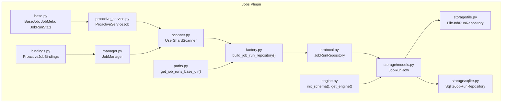
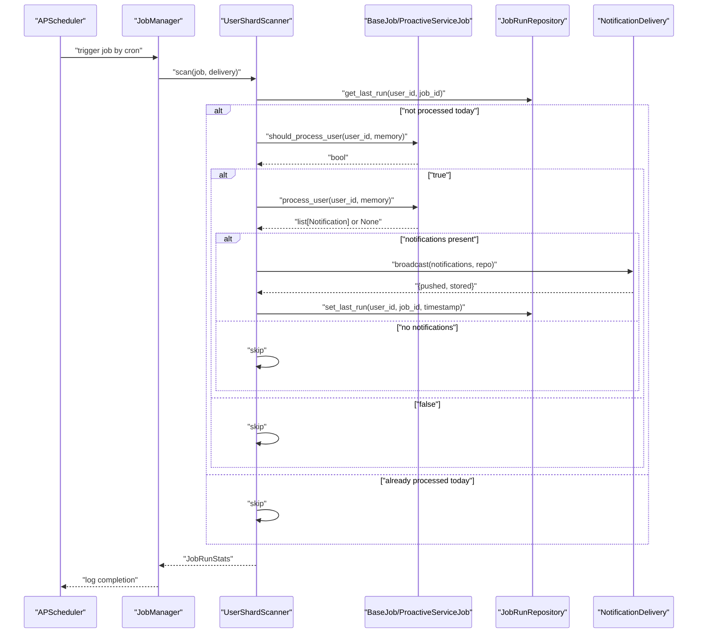
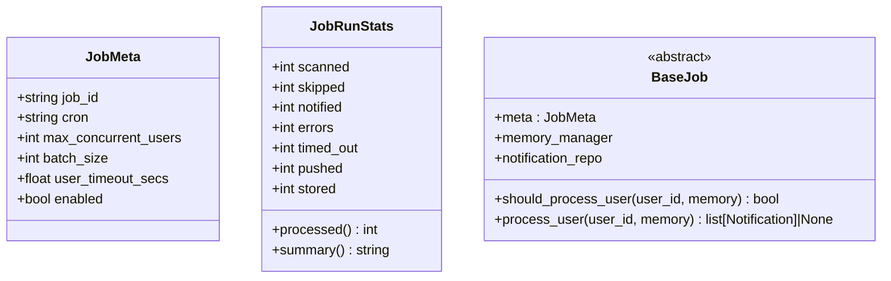
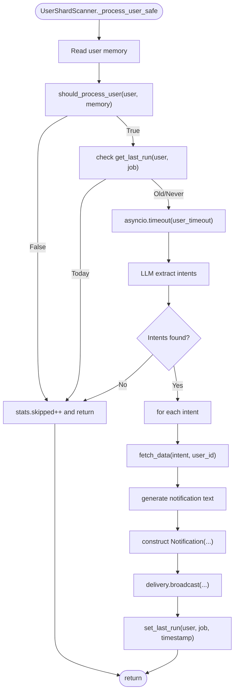
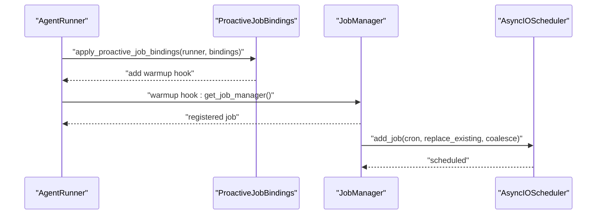
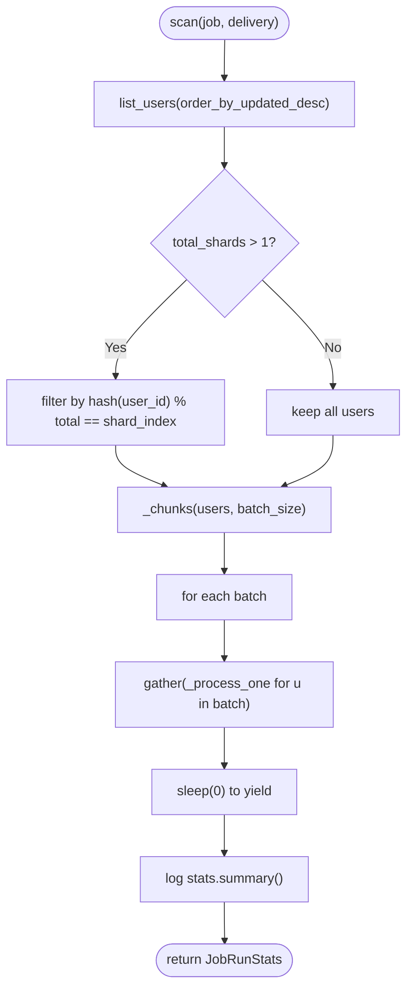
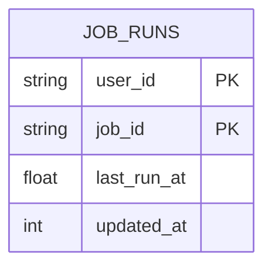
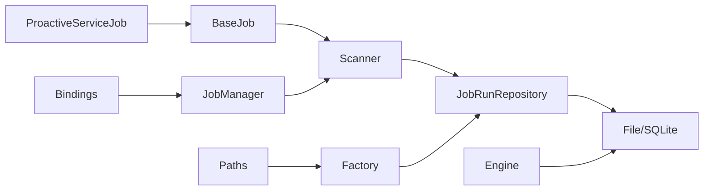

# Jobs Plugin

<cite>
**Referenced Files in This Document**
- [__init__.py](file://src/ark_agentic/plugins/jobs/__init__.py)
- [base.py](file://src/ark_agentic/plugins/jobs/base.py)
- [engine.py](file://src/ark_agentic/plugins/jobs/engine.py)
- [manager.py](file://src/ark_agentic/plugins/jobs/manager.py)
- [proactive_service.py](file://src/ark_agentic/plugins/jobs/proactive_service.py)
- [bindings.py](file://src/ark_agentic/plugins/jobs/bindings.py)
- [scanner.py](file://src/ark_agentic/plugins/jobs/scanner.py)
- [protocol.py](file://src/ark_agentic/plugins/jobs/protocol.py)
- [factory.py](file://src/ark_agentic/plugins/jobs/factory.py)
- [paths.py](file://src/ark_agentic/plugins/jobs/paths.py)
- [models.py](file://src/ark_agentic/plugins/jobs/storage/models.py)
- [file.py](file://src/ark_agentic/plugins/jobs/storage/file.py)
- [sqlite.py](file://src/ark_agentic/plugins/jobs/storage/sqlite.py)
</cite>

## Table of Contents
1. [Introduction](#introduction)
2. [Project Structure](#project-structure)
3. [Core Components](#core-components)
4. [Architecture Overview](#architecture-overview)
5. [Detailed Component Analysis](#detailed-component-analysis)
6. [Dependency Analysis](#dependency-analysis)
7. [Performance Considerations](#performance-considerations)
8. [Troubleshooting Guide](#troubleshooting-guide)
9. [Conclusion](#conclusion)
10. [Appendices](#appendices)

## Introduction
The Jobs Plugin provides a robust framework for scheduled task execution and proactive job management. It enables automated workflows that monitor users and deliver timely notifications based on domain-specific intent extraction and data retrieval. The plugin supports:
- Scheduling via cron expressions with APScheduler
- Proactive job execution across user shards with concurrency and batching controls
- Storage of job metadata and execution history for idempotency and auditing
- Extensible job types through a base class and hooks for domain-specific logic
- Optional server-side orchestration with a global JobManager and bindings for seamless integration with agent runners

## Project Structure
The Jobs Plugin is organized into cohesive modules:
- Core abstractions and types: base job definitions, metadata, and statistics
- Execution engine: scheduler integration and lifecycle management
- Proactive service base: reusable pipeline for intent extraction, data fetching, and notification generation
- Scanner: scalable user traversal with concurrency, batching, and idempotency
- Storage: repository abstraction with file and SQLite backends for job run timestamps
- Bindings: decoupled wiring between agent factories and the runtime runner
- Paths and engine: centralized schema initialization and storage base directory resolution

**Diagram sources**
- [base.py:1-102](file://src/ark_agentic/plugins/jobs/base.py#L1-L102)
- [proactive_service.py:1-215](file://src/ark_agentic/plugins/jobs/proactive_service.py#L1-L215)
- [scanner.py:1-186](file://src/ark_agentic/plugins/jobs/scanner.py#L1-L186)
- [manager.py:1-123](file://src/ark_agentic/plugins/jobs/manager.py#L1-L123)
- [bindings.py:1-75](file://src/ark_agentic/plugins/jobs/bindings.py#L1-L75)
- [engine.py:1-35](file://src/ark_agentic/plugins/jobs/engine.py#L1-L35)
- [factory.py:1-40](file://src/ark_agentic/plugins/jobs/factory.py#L1-L40)
- [protocol.py:1-25](file://src/ark_agentic/plugins/jobs/protocol.py#L1-L25)
- [models.py:1-33](file://src/ark_agentic/plugins/jobs/storage/models.py#L1-L33)
- [file.py:1-62](file://src/ark_agentic/plugins/jobs/storage/file.py#L1-L62)
- [sqlite.py:1-48](file://src/ark_agentic/plugins/jobs/storage/sqlite.py#L1-L48)
- [paths.py:1-15](file://src/ark_agentic/plugins/jobs/paths.py#L1-L15)

**Section sources**
- [__init__.py:1-48](file://src/ark_agentic/plugins/jobs/__init__.py#L1-L48)
- [engine.py:1-35](file://src/ark_agentic/plugins/jobs/engine.py#L1-L35)
- [paths.py:1-15](file://src/ark_agentic/plugins/jobs/paths.py#L1-L15)

## Core Components
- BaseJob and JobMeta: Define the job contract, metadata (including cron, concurrency, and timeouts), and statistics counters for execution outcomes.
- ProactiveServiceJob: Provides a reusable pipeline for proactive services: keyword filtering, intent extraction via LLM, data fetching, and notification text generation.
- UserShardScanner: Scans users efficiently with concurrency control, batching, per-user timeouts, and idempotency checks using job run timestamps.
- JobManager: Registers jobs with APScheduler, exposes manual dispatch, and integrates with notification delivery.
- JobRunRepository: Protocol for storing per-(user, job) last-run timestamps; implemented by file and SQLite backends.
- Engine and Schema: Centralized schema initialization for the jobs feature using Alembic against a shared database engine.
- Bindings: Decouples agent factories from the runtime runner, enabling registration of proactive jobs during warmup.

**Section sources**
- [base.py:20-102](file://src/ark_agentic/plugins/jobs/base.py#L20-L102)
- [proactive_service.py:49-215](file://src/ark_agentic/plugins/jobs/proactive_service.py#L49-L215)
- [scanner.py:35-186](file://src/ark_agentic/plugins/jobs/scanner.py#L35-L186)
- [manager.py:40-123](file://src/ark_agentic/plugins/jobs/manager.py#L40-L123)
- [protocol.py:8-25](file://src/ark_agentic/plugins/jobs/protocol.py#L8-L25)
- [engine.py:20-35](file://src/ark_agentic/plugins/jobs/engine.py#L20-L35)
- [bindings.py:25-75](file://src/ark_agentic/plugins/jobs/bindings.py#L25-L75)

## Architecture Overview
The Jobs Plugin architecture separates concerns across abstraction, orchestration, execution, and persistence layers. The proactive service pattern ensures domain-specific customization while reusing a common execution flow. The scanner coordinates with the repository to maintain idempotency and scalability.

**Diagram sources**
- [manager.py:110-123](file://src/ark_agentic/plugins/jobs/manager.py#L110-L123)
- [scanner.py:58-159](file://src/ark_agentic/plugins/jobs/scanner.py#L58-L159)
- [proactive_service.py:132-149](file://src/ark_agentic/plugins/jobs/proactive_service.py#L132-L149)
- [factory.py:18-40](file://src/ark_agentic/plugins/jobs/factory.py#L18-L40)
- [sqlite.py:20-48](file://src/ark_agentic/plugins/jobs/storage/sqlite.py#L20-L48)
- [file.py:25-62](file://src/ark_agentic/plugins/jobs/storage/file.py#L25-L62)

## Detailed Component Analysis

### Base Abstractions
- JobMeta: Holds scheduling and execution parameters such as cron expression, max concurrent users, batch size, per-user timeout, and enablement flag.
- JobRunStats: Aggregates counts for scanned, skipped, notified, errors, timed out, pushed, and stored outcomes, plus computed processed count and summary formatting.
- BaseJob: Defines the contract for proactive jobs, including properties for per-agent memory manager and notification repository, and methods for lightweight intent filtering and full processing.

**Diagram sources**
- [base.py:20-102](file://src/ark_agentic/plugins/jobs/base.py#L20-L102)

**Section sources**
- [base.py:20-102](file://src/ark_agentic/plugins/jobs/base.py#L20-L102)

### ProactiveServiceJob Pipeline
ProactiveServiceJob implements a reusable three-phase pipeline:
1. Keyword filtering via intent_keywords for fast prefiltering.
2. Intent extraction using a domain-specific prompt passed to an LLM.
3. Data fetching via a tool registry and notification text generation with a prompt.

Subclasses override intent_keywords, get_intent_prompt, and optionally fetch_data and get_notify_prompt to tailor behavior to domains like securities or insurance.

**Diagram sources**
- [scanner.py:113-159](file://src/ark_agentic/plugins/jobs/scanner.py#L113-L159)
- [proactive_service.py:132-215](file://src/ark_agentic/plugins/jobs/proactive_service.py#L132-L215)

**Section sources**
- [proactive_service.py:49-215](file://src/ark_agentic/plugins/jobs/proactive_service.py#L49-L215)

### JobManager and Scheduling
JobManager orchestrates job registration with APScheduler using cron triggers, prevents overlapping runs, and supports manual dispatch. It delegates execution to the scanner and logs outcomes.

Key behaviors:
- Register jobs only when enabled
- Use CronTrigger.from_crontab for scheduling
- Prevent duplicate instances and coalesce missed runs
- Expose listing of registered jobs and next run times

**Diagram sources**
- [bindings.py:39-75](file://src/ark_agentic/plugins/jobs/bindings.py#L39-L75)
- [manager.py:40-90](file://src/ark_agentic/plugins/jobs/manager.py#L40-L90)

**Section sources**
- [manager.py:40-123](file://src/ark_agentic/plugins/jobs/manager.py#L40-L123)
- [bindings.py:25-75](file://src/ark_agentic/plugins/jobs/bindings.py#L25-L75)

### UserShardScanner
UserShardScanner performs efficient, scalable scanning:
- Lists users from the job’s memory workspace ordered by last update
- Applies sharding for horizontal scaling
- Enforces concurrency via Semaphore and batches via asyncio.gather
- Wraps per-user processing with timeout and exception isolation
- Uses JobRunRepository for idempotency checks and last-run recording

**Diagram sources**
- [scanner.py:58-111](file://src/ark_agentic/plugins/jobs/scanner.py#L58-L111)

**Section sources**
- [scanner.py:35-186](file://src/ark_agentic/plugins/jobs/scanner.py#L35-L186)

### Storage System and Persistence
The Jobs Plugin persists per-(user, job) last-run timestamps to ensure idempotency across restarts. Two backends are supported:
- File backend: stores a dotfile per user and job under a base directory
- SQLite backend: stores rows in a dedicated table with composite primary key

The factory selects the backend based on the current storage mode and constructs the appropriate repository.

**Diagram sources**
- [models.py:18-33](file://src/ark_agentic/plugins/jobs/storage/models.py#L18-L33)

**Section sources**
- [protocol.py:8-25](file://src/ark_agentic/plugins/jobs/protocol.py#L8-L25)
- [factory.py:18-40](file://src/ark_agentic/plugins/jobs/factory.py#L18-L40)
- [file.py:16-62](file://src/ark_agentic/plugins/jobs/storage/file.py#L16-L62)
- [sqlite.py:14-48](file://src/ark_agentic/plugins/jobs/storage/sqlite.py#L14-L48)
- [paths.py:9-15](file://src/ark_agentic/plugins/jobs/paths.py#L9-L15)

### Engine and Schema Initialization
Schema initialization is isolated to the jobs feature while sharing the core database engine. The engine accessor returns the shared AsyncEngine, and the initializer runs Alembic upgrades for the jobs metadata.

**Section sources**
- [engine.py:20-35](file://src/ark_agentic/plugins/jobs/engine.py#L20-L35)

## Dependency Analysis
The Jobs Plugin maintains low coupling and clear boundaries:
- BaseJob depends on memory and notification repositories; subclasses define domain-specific prompts and tools.
- Scanner depends on BaseJob and JobRunRepository; it does not depend on the global manager.
- JobManager depends on NotificationDelivery and UserShardScanner; it does not depend on domain logic.
- Storage backends implement a single protocol; the factory abstracts backend selection.
- Bindings decouple agent factories from the runtime runner.

**Diagram sources**
- [base.py:56-102](file://src/ark_agentic/plugins/jobs/base.py#L56-L102)
- [scanner.py:67-85](file://src/ark_agentic/plugins/jobs/scanner.py#L67-L85)
- [factory.py:18-40](file://src/ark_agentic/plugins/jobs/factory.py#L18-L40)
- [engine.py:20-35](file://src/ark_agentic/plugins/jobs/engine.py#L20-L35)
- [paths.py:9-15](file://src/ark_agentic/plugins/jobs/paths.py#L9-L15)

**Section sources**
- [__init__.py:12-48](file://src/ark_agentic/plugins/jobs/__init__.py#L12-L48)
- [bindings.py:39-75](file://src/ark_agentic/plugins/jobs/bindings.py#L39-L75)
- [manager.py:40-90](file://src/ark_agentic/plugins/jobs/manager.py#L40-L90)

## Performance Considerations
- Concurrency and Batching: Control max_concurrent_users and batch_size to balance throughput and resource usage. Adjust per workload characteristics.
- Per-User Timeouts: Tune user_timeout_secs to prevent long-running user processing from blocking the scanner.
- Sharding: Use shard_index and total_shards to distribute load across workers for horizontal scaling.
- I/O Bound Efficiency: The scanner lists users efficiently and uses thread pools for directory operations; keep memory reads minimal and avoid heavy synchronous work inside the per-user loop.
- Idempotency: The last-run timestamp avoids duplicate processing after restarts; ensure consistent time sources across nodes if running distributed workers.

[No sources needed since this section provides general guidance]

## Troubleshooting Guide
Common issues and remedies:
- Job not registered: Verify that the job is enabled and that the JobManager is initialized and available during warmup.
- Missing apscheduler: The JobManager import is guarded; install the server extras to enable scheduling.
- No notifications delivered: Confirm that process_user returns notifications and that broadcast succeeds; inspect push/store counts in JobRunStats.
- Timeout errors: Increase user_timeout_secs or optimize intent extraction and data fetching steps.
- Duplicate processing after restart: Ensure JobRunRepository is functioning and that last-run timestamps are recorded.
- Storage backend mismatch: Confirm the current storage mode matches the intended backend and that required parameters (e.g., base_dir) are provided.

**Section sources**
- [manager.py:29-38](file://src/ark_agentic/plugins/jobs/manager.py#L29-L38)
- [scanner.py:153-159](file://src/ark_agentic/plugins/jobs/scanner.py#L153-L159)
- [factory.py:27-39](file://src/ark_agentic/plugins/jobs/factory.py#L27-L39)

## Conclusion
The Jobs Plugin offers a modular, extensible framework for proactive, scheduled job execution. By separating orchestration, scanning, and persistence concerns, it supports domain-specific customization while maintaining operational reliability. With configurable concurrency, batching, timeouts, and sharding, it scales to large user bases. The schema-initialization model and repository abstraction enable straightforward deployment and maintenance.

[No sources needed since this section summarizes without analyzing specific files]

## Appendices

### Practical Examples and Patterns
- Creating a proactive job:
  - Subclass ProactiveServiceJob and override intent_keywords, get_intent_prompt, and optionally fetch_data and get_notify_prompt.
  - Construct the job with required dependencies (LLM factory, tool registry, memory manager, notification repository).
  - Register the job via ProactiveJobBindings and apply to the AgentRunner’s warmup hooks.
- Scheduling patterns:
  - Use cron expressions to define periodic execution cadence.
  - Combine coalescing and max_instances to prevent overlapping runs.
- Execution monitoring:
  - Inspect JobRunStats for processed, skipped, notified, errors, and timeouts.
  - Use JobManager.list_jobs to view cron schedules and next run times.
- Storage configuration:
  - For file backend, set the base directory via the canonical path provider.
  - For SQLite backend, ensure the shared database engine is initialized and schema is upgraded.

**Section sources**
- [proactive_service.py:49-129](file://src/ark_agentic/plugins/jobs/proactive_service.py#L49-L129)
- [bindings.py:32-75](file://src/ark_agentic/plugins/jobs/bindings.py#L32-L75)
- [manager.py:97-108](file://src/ark_agentic/plugins/jobs/manager.py#L97-L108)
- [paths.py:9-15](file://src/ark_agentic/plugins/jobs/paths.py#L9-L15)
- [engine.py:25-35](file://src/ark_agentic/plugins/jobs/engine.py#L25-L35)

### Configuration Guidelines
- Job priorities: Not exposed as explicit fields; prioritize by adjusting cron frequency and resource parameters.
- Retry policies: There is no built-in retry mechanism; handle transient failures at the tool or prompt level and rely on idempotency to avoid duplicates.
- Resource limits:
  - max_concurrent_users: Limit concurrent per-user processing.
  - batch_size: Control batch size for parallelism.
  - user_timeout_secs: Set per-user timeout to bound latency.
- Persistence and recovery:
  - Use JobRunRepository to record last-run timestamps for idempotency.
  - For distributed workers, ensure consistent storage backend and synchronized time.
- Distributed execution:
  - Use sharding to divide user sets across workers.
  - Ensure each worker has access to the same shared storage for job runs and notifications.

**Section sources**
- [base.py:20-30](file://src/ark_agentic/plugins/jobs/base.py#L20-L30)
- [scanner.py:44-57](file://src/ark_agentic/plugins/jobs/scanner.py#L44-L57)
- [scanner.py:160-186](file://src/ark_agentic/plugins/jobs/scanner.py#L160-L186)

### API and Administrative Interfaces
- JobManager:
  - register(job): Register a job with APScheduler.
  - start()/stop(): Lifecycle control for the scheduler.
  - dispatch(job_id): Manual trigger for immediate execution.
  - list_jobs(): Retrieve job metadata including cron and next run time.
- ProactiveJobBindings:
  - build_proactive_job_bindings(job=None): Construct bindings for optional job registration.
  - apply_proactive_job_bindings(runner, bindings): Attach warmup hook to register jobs during startup.

**Section sources**
- [manager.py:56-108](file://src/ark_agentic/plugins/jobs/manager.py#L56-L108)
- [bindings.py:32-75](file://src/ark_agentic/plugins/jobs/bindings.py#L32-L75)

### Integration Patterns with Domain Agents
- ProactiveServiceJob encapsulates the common proactive workflow; domain agents subclass it to implement domain-specific prompts and data retrieval.
- The scanner and repository are per-agent; each job scopes its memory and notifications to its agent workspace.
- Notifications are delivered via NotificationDelivery; the repository persists per-(user, job) timestamps for idempotency.

**Section sources**
- [proactive_service.py:49-129](file://src/ark_agentic/plugins/jobs/proactive_service.py#L49-L129)
- [scanner.py:77-85](file://src/ark_agentic/plugins/jobs/scanner.py#L77-L85)