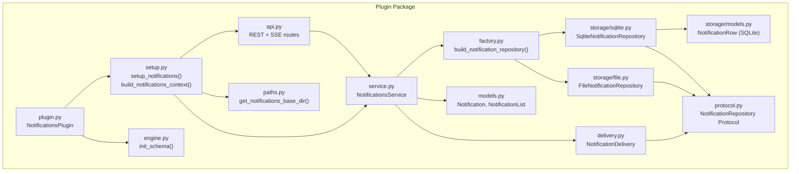
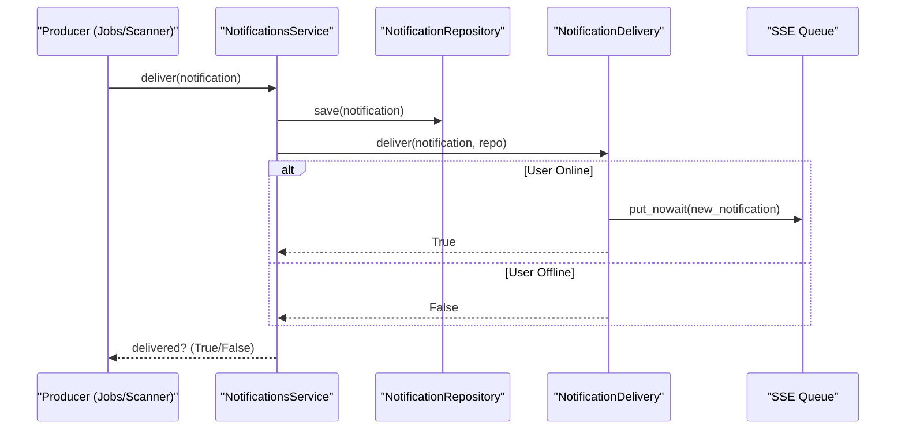
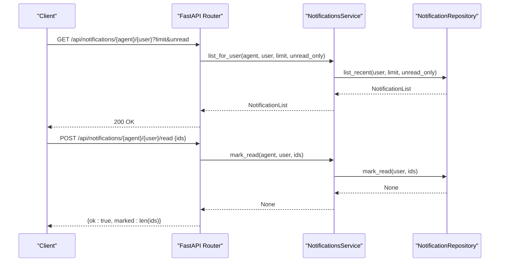
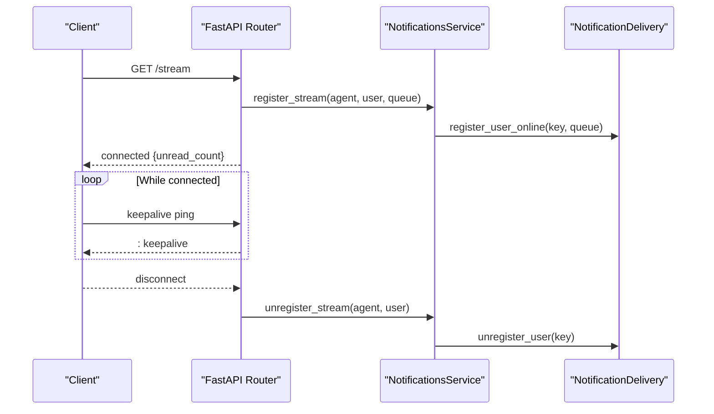
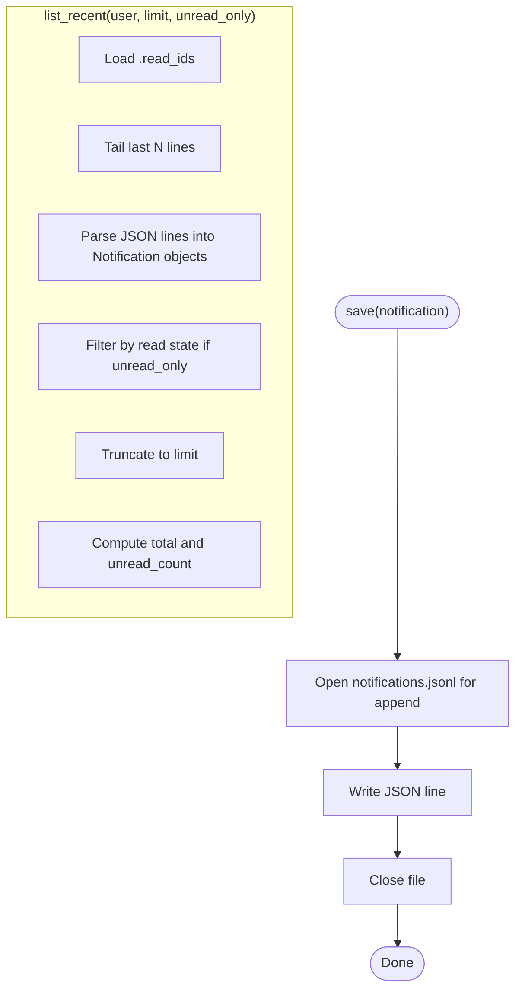
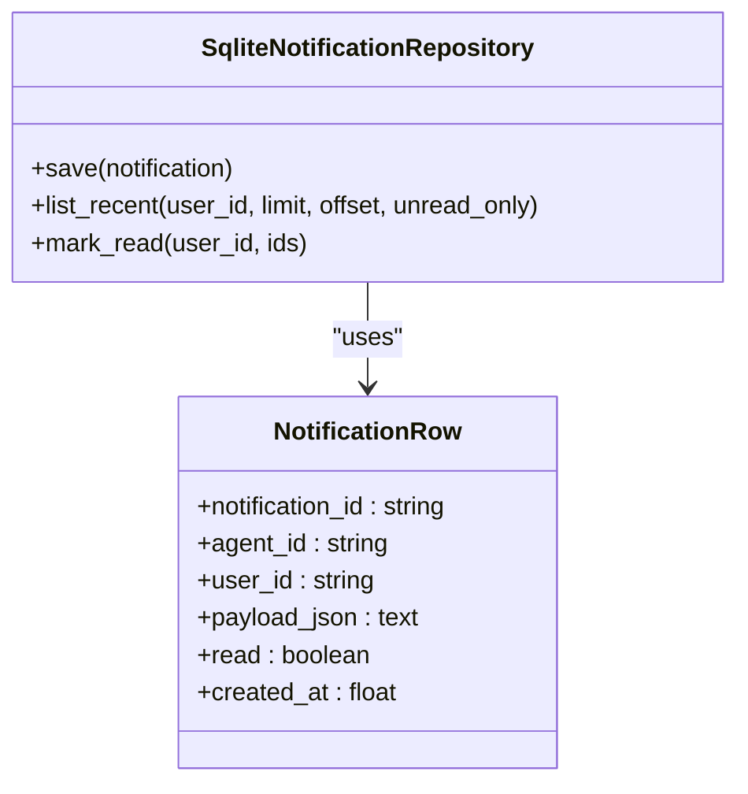
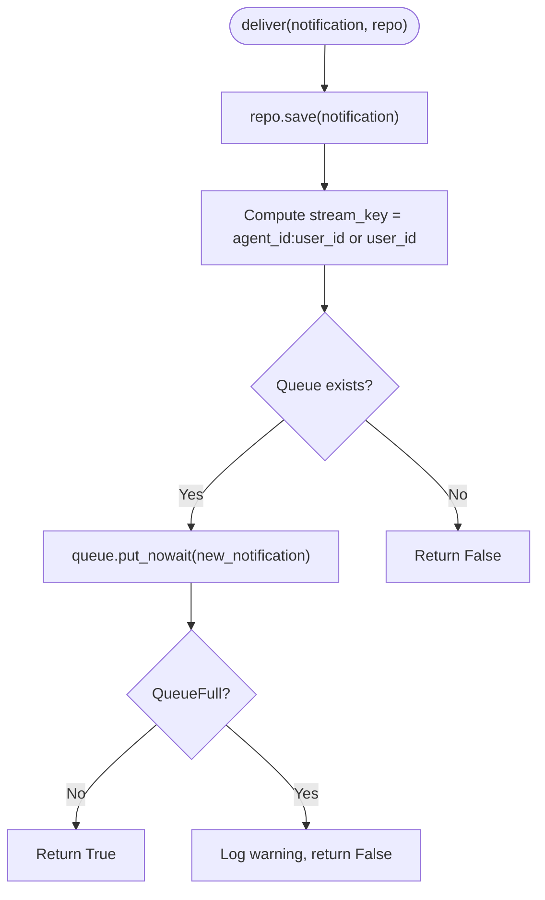
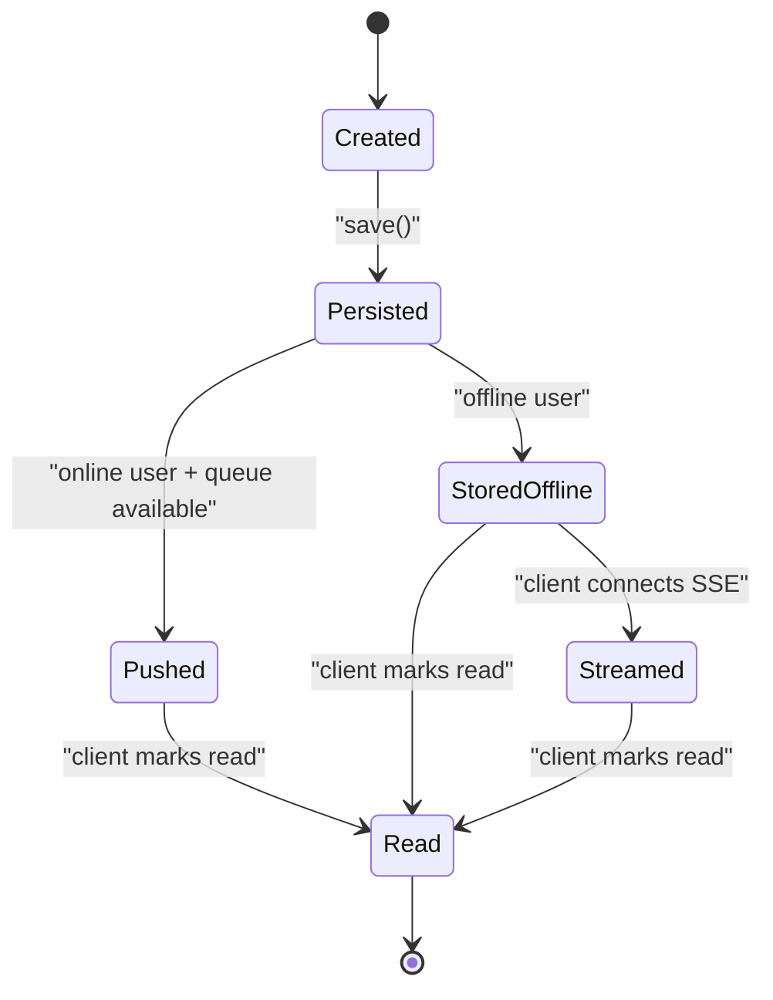
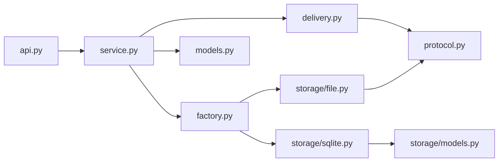

# Notifications Plugin

<cite>
**Referenced Files in This Document**
- [__init__.py](file://src/ark_agentic/plugins/notifications/__init__.py)
- [plugin.py](file://src/ark_agentic/plugins/notifications/plugin.py)
- [setup.py](file://src/ark_agentic/plugins/notifications/setup.py)
- [api.py](file://src/ark_agentic/plugins/notifications/api.py)
- [service.py](file://src/ark_agentic/plugins/notifications/service.py)
- [models.py](file://src/ark_agentic/plugins/notifications/models.py)
- [delivery.py](file://src/ark_agentic/plugins/notifications/delivery.py)
- [protocol.py](file://src/ark_agentic/plugins/notifications/protocol.py)
- [factory.py](file://src/ark_agentic/plugins/notifications/factory.py)
- [storage/file.py](file://src/ark_agentic/plugins/notifications/storage/file.py)
- [storage/sqlite.py](file://src/ark_agentic/plugins/notifications/storage/sqlite.py)
- [storage/models.py](file://src/ark_agentic/plugins/notifications/storage/models.py)
- [paths.py](file://src/ark_agentic/plugins/notifications/paths.py)
- [engine.py](file://src/ark_agentic/plugins/notifications/engine.py)
- [migrations/versions/...](file://src/ark_agentic/plugins/notifications/storage/migrations/versions/20260505_0001_initial_notifications_schema.py)
- [test_file_notification.py](file://tests/unit/core/test_file_notification.py)
- [test_sqlite_notification.py](file://tests/unit/core/test_sqlite_notification.py)
- [test_notifications_paths.py](file://tests/unit/plugins/test_notifications_paths.py)
- [test_migrations_notifications.py](file://tests/unit/plugins/test_migrations_notifications.py)
</cite>

## Table of Contents
1. [Introduction](#introduction)
2. [Project Structure](#project-structure)
3. [Core Components](#core-components)
4. [Architecture Overview](#architecture-overview)
5. [Detailed Component Analysis](#detailed-component-analysis)
6. [Dependency Analysis](#dependency-analysis)
7. [Performance Considerations](#performance-considerations)
8. [Troubleshooting Guide](#troubleshooting-guide)
9. [Conclusion](#conclusion)
10. [Appendices](#appendices)

## Introduction
This document describes the Notifications Plugin that powers alerting and messaging within the system. It covers the notification delivery engine, storage backends (file-based and SQLite), API endpoints for notification management, and the lifecycle from creation to delivery. It also documents storage schemas, delivery status tracking, cleanup policies, configuration guidelines, scalability considerations, and integration patterns with other plugins.

## Project Structure
The Notifications Plugin is organized around a clean separation of concerns:
- API layer: FastAPI routes for REST and Server-Sent Events (SSE)
- Service layer: Business orchestration combining storage and delivery
- Delivery engine: Real-time SSE broadcasting and persistence-first strategy
- Storage backends: File-based and SQLite repositories implementing a common protocol
- Schema and engine: SQLAlchemy models and initialization for SQLite

**Diagram sources**
- [plugin.py:12-41](file://src/ark_agentic/plugins/notifications/plugin.py#L12-L41)
- [setup.py:44-58](file://src/ark_agentic/plugins/notifications/setup.py#L44-L58)
- [api.py:31-175](file://src/ark_agentic/plugins/notifications/api.py#L31-L175)
- [service.py:29-134](file://src/ark_agentic/plugins/notifications/service.py#L29-L134)
- [delivery.py:28-108](file://src/ark_agentic/plugins/notifications/delivery.py#L28-L108)
- [factory.py:18-41](file://src/ark_agentic/plugins/notifications/factory.py#L18-L41)
- [storage/file.py:27-158](file://src/ark_agentic/plugins/notifications/storage/file.py#L27-L158)
- [storage/sqlite.py:28-112](file://src/ark_agentic/plugins/notifications/storage/sqlite.py#L28-L112)
- [storage/models.py:18-31](file://src/ark_agentic/plugins/notifications/storage/models.py#L18-L31)
- [models.py:12-29](file://src/ark_agentic/plugins/notifications/models.py#L12-L29)
- [protocol.py:10-31](file://src/ark_agentic/plugins/notifications/protocol.py#L10-L31)
- [paths.py](file://src/ark_agentic/plugins/notifications/paths.py)
- [engine.py](file://src/ark_agentic/plugins/notifications/engine.py)

**Section sources**
- [__init__.py:1-30](file://src/ark_agentic/plugins/notifications/__init__.py#L1-L30)
- [plugin.py:12-41](file://src/ark_agentic/plugins/notifications/plugin.py#L12-L41)
- [setup.py:44-58](file://src/ark_agentic/plugins/notifications/setup.py#L44-L58)

## Core Components
- Notification model: Defines fields for identity, routing, content, metadata, timestamps, read state, and priority.
- NotificationList: Encapsulates paginated results and unread counters.
- NotificationRepository Protocol: Defines asynchronous save, list_recent, and mark_read operations.
- FileNotificationRepository: Implements the protocol using JSONL files and a separate read marker file per user.
- SqliteNotificationRepository: Implements the protocol using SQLAlchemy with atomic updates and efficient pagination.
- NotificationDelivery: Manages online user queues and delivers notifications via SSE; persists first, then attempts real-time push.
- NotificationsService: Coordinates storage and delivery, maintains per-agent repository caches, and exposes typed APIs for producers and consumers.
- API: Exposes REST endpoints for listing notifications, marking as read, and SSE streaming; integrates with Jobs feature for manual dispatch and listing.

Key responsibilities:
- Persistence-first delivery: Ensures durability before attempting real-time delivery.
- Per-agent isolation: File backend uses per-agent directories; SQLite backend filters by agent_id.
- SSE streaming: Maintains queues keyed by agent_id:user_id to avoid collisions.
- Backward compatibility: Supports legacy stream keys without agent_id.

**Section sources**
- [models.py:12-29](file://src/ark_agentic/plugins/notifications/models.py#L12-L29)
- [protocol.py:10-31](file://src/ark_agentic/plugins/notifications/protocol.py#L10-L31)
- [storage/file.py:27-158](file://src/ark_agentic/plugins/notifications/storage/file.py#L27-L158)
- [storage/sqlite.py:28-112](file://src/ark_agentic/plugins/notifications/storage/sqlite.py#L28-L112)
- [delivery.py:28-108](file://src/ark_agentic/plugins/notifications/delivery.py#L28-L108)
- [service.py:29-134](file://src/ark_agentic/plugins/notifications/service.py#L29-L134)
- [api.py:80-175](file://src/ark_agentic/plugins/notifications/api.py#L80-L175)

## Architecture Overview
The Notifications Plugin follows a layered architecture:
- Plugin lifecycle: Enabled via environment flags; initializes schema in database mode; mounts routes and builds runtime context.
- Runtime context: Provides a NotificationsService instance that encapsulates delivery and per-agent repositories.
- API layer: FastAPI router with REST endpoints and SSE streaming endpoint.
- Service layer: Centralized logic for repository resolution, delivery coordination, and streaming registration/unregistration.
- Delivery engine: Singleton managing online queues and delivering notifications to SSE clients or storing only.
- Storage backends: Factory selects backend based on current storage mode; repositories implement the shared protocol.

**Diagram sources**
- [service.py:107-112](file://src/ark_agentic/plugins/notifications/service.py#L107-L112)
- [delivery.py:52-93](file://src/ark_agentic/plugins/notifications/delivery.py#L52-L93)
- [protocol.py:14-28](file://src/ark_agentic/plugins/notifications/protocol.py#L14-L28)

**Section sources**
- [plugin.py:17-41](file://src/ark_agentic/plugins/notifications/plugin.py#L17-L41)
- [setup.py:44-58](file://src/ark_agentic/plugins/notifications/setup.py#L44-L58)
- [service.py:29-134](file://src/ark_agentic/plugins/notifications/service.py#L29-L134)
- [delivery.py:28-108](file://src/ark_agentic/plugins/notifications/delivery.py#L28-L108)

## Detailed Component Analysis

### API Endpoints
- GET /api/notifications/{agent_id}/{user_id}
  - Query parameters: limit (default 50), unread (boolean)
  - Response: NotificationList
- POST /api/notifications/{agent_id}/{user_id}/read
  - Request body: { ids: string[] }
  - Response: { ok: boolean, marked: number }
- GET /api/notifications/{agent_id}/{user_id}/stream
  - Server-Sent Events stream; sends initial "connected" event with unread_count, then "new_notification" events; supports keepalive
- GET /api/jobs
  - Lists registered jobs and next scheduled times
- POST /api/jobs/{job_id}/dispatch
  - Dispatches a job immediately (returns 202 accepted)

**Diagram sources**
- [api.py:80-105](file://src/ark_agentic/plugins/notifications/api.py#L80-L105)
- [service.py:64-83](file://src/ark_agentic/plugins/notifications/service.py#L64-L83)
- [protocol.py:17-28](file://src/ark_agentic/plugins/notifications/protocol.py#L17-L28)

**Section sources**
- [api.py:80-175](file://src/ark_agentic/plugins/notifications/api.py#L80-L175)
- [service.py:64-88](file://src/ark_agentic/plugins/notifications/service.py#L64-L88)

### SSE Streaming
- Endpoint: GET /api/notifications/{agent_id}/{user_id}/stream
- Behavior:
  - Registers the client’s queue under key "{agent_id}:{user_id}"
  - Sends initial "connected" event with unread_count
  - Streams "new_notification" events for newly persisted notifications
  - Emits keepalive messages periodically
  - Unregisters the queue on disconnect

**Diagram sources**
- [api.py:109-154](file://src/ark_agentic/plugins/notifications/api.py#L109-L154)
- [service.py:95-104](file://src/ark_agentic/plugins/notifications/service.py#L95-L104)
- [delivery.py:37-46](file://src/ark_agentic/plugins/notifications/delivery.py#L37-L46)

**Section sources**
- [api.py:109-154](file://src/ark_agentic/plugins/notifications/api.py#L109-L154)
- [service.py:95-104](file://src/ark_agentic/plugins/notifications/service.py#L95-L104)

### Storage Backends

#### File Backend
- Storage layout:
  - Per-agent directory: {base_dir}/{agent_id}/{user_id}/
  - notifications.jsonl: Append-only JSON lines of notifications
  - .read_ids: Set of read notification IDs for the user
- Concurrency:
  - Per-user asyncio.Lock for mark_read to avoid race conditions
- Limitations:
  - list_recent reads a bounded tail and reconstructs state; unread_only and limit are applied in-memory

**Diagram sources**
- [storage/file.py:82-127](file://src/ark_agentic/plugins/notifications/storage/file.py#L82-L127)

**Section sources**
- [storage/file.py:27-158](file://src/ark_agentic/plugins/notifications/storage/file.py#L27-L158)

#### SQLite Backend
- Table: notifications with indexes on (agent_id, user_id, read)
- Operations:
  - save: Upsert by notification_id
  - list_recent: ORDER BY created_at DESC with LIMIT/OFFSET; unread count via filtered COUNT
  - mark_read: Atomic UPDATE with row-level locking
- Isolation: Each repository instance binds to a single agent_id

**Diagram sources**
- [storage/sqlite.py:28-112](file://src/ark_agentic/plugins/notifications/storage/sqlite.py#L28-L112)
- [storage/models.py:18-31](file://src/ark_agentic/plugins/notifications/storage/models.py#L18-L31)

**Section sources**
- [storage/sqlite.py:28-112](file://src/ark_agentic/plugins/notifications/storage/sqlite.py#L28-L112)
- [storage/models.py:18-31](file://src/ark_agentic/plugins/notifications/storage/models.py#L18-L31)

### Delivery Engine
- Strategy: Store first, then attempt real-time push
- Online detection: Queues keyed by "{agent_id}:{user_id}" or fallback to user_id
- Queue capacity: Fixed maxsize to prevent unbounded memory growth
- Return semantics: deliver returns whether the notification was pushed (True) or stored only (False)

**Diagram sources**
- [delivery.py:52-93](file://src/ark_agentic/plugins/notifications/delivery.py#L52-L93)

**Section sources**
- [delivery.py:28-108](file://src/ark_agentic/plugins/notifications/delivery.py#L28-L108)

### Notification Lifecycle
- Creation: Producers (jobs/scanners) construct Notification objects and call NotificationsService.deliver or broadcast
- Persistence: Repository.save writes durable records
- Real-time delivery: NotificationDelivery attempts to push to SSE queues
- Consumption:
  - REST: Clients fetch recent notifications and mark as read
  - SSE: Clients receive new_notification events and can mark as read via POST
- Cleanup: No explicit retention policy is enforced in code; production deployments should configure storage retention externally

**Diagram sources**
- [service.py:107-126](file://src/ark_agentic/plugins/notifications/service.py#L107-L126)
- [delivery.py:52-93](file://src/ark_agentic/plugins/notifications/delivery.py#L52-L93)
- [api.py:80-105](file://src/ark_agentic/plugins/notifications/api.py#L80-L105)

**Section sources**
- [service.py:107-126](file://src/ark_agentic/plugins/notifications/service.py#L107-L126)
- [delivery.py:52-93](file://src/ark_agentic/plugins/notifications/delivery.py#L52-L93)
- [api.py:80-105](file://src/ark_agentic/plugins/notifications/api.py#L80-L105)

### Configuration and Modes
- Storage mode selection:
  - File mode: base_dir is required; per-agent directories under notifications root
  - SQLite mode: engine is resolved via engine.get_engine(); schema initialized during plugin init
- Environment flags:
  - ENABLE_NOTIFICATIONS: Enables notifications independently
  - ENABLE_JOB_MANAGER: Backward-compatible enablement for setups relying on jobs
- Base directory:
  - get_notifications_base_dir resolves the root for file mode

Operational guidance:
- Choose SQLite for high concurrency and structured querying; choose file mode for simplicity and portability
- Ensure storage permissions for file mode base_dir
- Initialize SQLite schema on first run in database mode

**Section sources**
- [factory.py:18-41](file://src/ark_agentic/plugins/notifications/factory.py#L18-L41)
- [plugin.py:17-30](file://src/ark_agentic/plugins/notifications/plugin.py#L17-L30)
- [paths.py](file://src/ark_agentic/plugins/notifications/paths.py)
- [engine.py](file://src/ark_agentic/plugins/notifications/engine.py)

### API Definitions
- List notifications
  - Method: GET
  - Path: /api/notifications/{agent_id}/{user_id}
  - Query: limit (integer, default 50), unread (boolean)
  - Response: NotificationList
- Mark read
  - Method: POST
  - Path: /api/notifications/{agent_id}/{user_id}/read
  - Body: { ids: string[] }
  - Response: { ok: boolean, marked: number }
- SSE stream
  - Method: GET
  - Path: /api/notifications/{agent_id}/{user_id}/stream
  - Headers: Cache-Control: no-cache, X-Accel-Buffering: no
  - Events:
    - connected: { type: "connected", unread_count: number }
    - new_notification: { type: "new_notification", data: Notification }
- Job management
  - Method: GET
  - Path: /api/jobs
  - Response: { jobs: array }
  - Method: POST
  - Path: /api/jobs/{job_id}/dispatch
  - Response: { ok: boolean, job_id: string, status: "dispatched" }

**Section sources**
- [api.py:80-175](file://src/ark_agentic/plugins/notifications/api.py#L80-L175)
- [models.py:12-29](file://src/ark_agentic/plugins/notifications/models.py#L12-L29)

### Webhook Integration
- The Notifications Plugin does not expose a generic webhook endpoint for external delivery.
- Integration pattern: Produce notifications via NotificationsService.deliver/broadcast; consume via SSE or REST endpoints.
- For external systems, implement a producer that calls the service and route external events into Notification objects.

**Section sources**
- [service.py:107-126](file://src/ark_agentic/plugins/notifications/service.py#L107-L126)
- [api.py:80-175](file://src/ark_agentic/plugins/notifications/api.py#L80-L175)

## Dependency Analysis
- Coupling:
  - API depends on NotificationsService via FastAPI Depends
  - Service depends on NotificationRepository protocol and NotificationDelivery
  - Delivery depends on Notification model and repository protocol
  - Repositories depend on models and storage-specific primitives
- Cohesion:
  - Storage backends are cohesive implementations of a single protocol
  - Service centralizes cross-cutting concerns (caching, delivery coordination)
- External dependencies:
  - SQLAlchemy for SQLite
  - FastAPI for routing and SSE
  - asyncio for concurrency and queues

**Diagram sources**
- [api.py:31-175](file://src/ark_agentic/plugins/notifications/api.py#L31-L175)
- [service.py:29-134](file://src/ark_agentic/plugins/notifications/service.py#L29-L134)
- [delivery.py:28-108](file://src/ark_agentic/plugins/notifications/delivery.py#L28-L108)
- [factory.py:18-41](file://src/ark_agentic/plugins/notifications/factory.py#L18-L41)
- [storage/file.py:27-158](file://src/ark_agentic/plugins/notifications/storage/file.py#L27-L158)
- [storage/sqlite.py:28-112](file://src/ark_agentic/plugins/notifications/storage/sqlite.py#L28-L112)
- [storage/models.py:18-31](file://src/ark_agentic/plugins/notifications/storage/models.py#L18-L31)
- [protocol.py:10-31](file://src/ark_agentic/plugins/notifications/protocol.py#L10-L31)
- [models.py:12-29](file://src/ark_agentic/plugins/notifications/models.py#L12-L29)

**Section sources**
- [api.py:31-175](file://src/ark_agentic/plugins/notifications/api.py#L31-L175)
- [service.py:29-134](file://src/ark_agentic/plugins/notifications/service.py#L29-L134)
- [delivery.py:28-108](file://src/ark_agentic/plugins/notifications/delivery.py#L28-L108)
- [factory.py:18-41](file://src/ark_agentic/plugins/notifications/factory.py#L18-L41)

## Performance Considerations
- Concurrency:
  - File backend: Per-user locks protect mark_read; consider batching operations to reduce contention
  - SQLite backend: Row-level updates minimize contention; ensure appropriate indexing
- Queue sizing:
  - SSE queues have fixed maxsize; slow consumers risk dropped events; tune consumer throughput
- Pagination:
  - SQLite backend pushes LIMIT/OFFSET to the database for efficient retrieval
  - File backend applies limit/unread filters in-memory after reading a bounded tail
- Throughput:
  - Use NotificationsService.broadcast to group by agent_id and reuse repositories
  - Prefer SSE for real-time delivery; REST polling as fallback

[No sources needed since this section provides general guidance]

## Troubleshooting Guide
Common issues and resolutions:
- Notifications not appearing in SSE:
  - Ensure the client registers the stream under the correct {agent_id}:{user_id} key
  - Verify the user is connected and not disconnected due to keepalive timeouts
- Mark read has no effect:
  - Confirm the ids array contains valid notification IDs
  - For file backend, ensure the .read_ids file is writable
- Database mode schema errors:
  - Run schema initialization during plugin init or via migration tooling
- File mode base_dir missing:
  - Provide a valid base_dir when building the repository in file mode

**Section sources**
- [delivery.py:37-46](file://src/ark_agentic/plugins/notifications/delivery.py#L37-L46)
- [storage/file.py:69-79](file://src/ark_agentic/plugins/notifications/storage/file.py#L69-L79)
- [plugin.py:27-30](file://src/ark_agentic/plugins/notifications/plugin.py#L27-L30)

## Conclusion
The Notifications Plugin provides a robust, extensible foundation for alerting and messaging. Its persistence-first delivery strategy ensures reliability, while dual storage backends accommodate diverse deployment needs. The SSE streaming enables responsive real-time experiences, and the REST endpoints support programmatic consumption. By leveraging the service layer and repository protocol, integrators can add new backends or extend functionality with minimal disruption.

[No sources needed since this section summarizes without analyzing specific files]

## Appendices

### Storage Schema (SQLite)
- Table: notifications
  - Columns: notification_id (PK), agent_id, user_id, payload_json, read, created_at
  - Index: ix_notif_agent_user_read(agent_id, user_id, read)

**Section sources**
- [storage/models.py:18-31](file://src/ark_agentic/plugins/notifications/storage/models.py#L18-L31)

### Migration Notes
- Initial schema migration creates the notifications table and supporting index
- Apply migrations when initializing database mode

**Section sources**
- [migrations/versions/...](file://src/ark_agentic/plugins/notifications/storage/migrations/versions/20260505_0001_initial_notifications_schema.py)

### Tests and Validation
- Unit tests validate file and SQLite repository behaviors
- Plugin path and migration tests ensure correct wiring and schema initialization

**Section sources**
- [test_file_notification.py](file://tests/unit/core/test_file_notification.py)
- [test_sqlite_notification.py](file://tests/unit/core/test_sqlite_notification.py)
- [test_notifications_paths.py](file://tests/unit/plugins/test_notifications_paths.py)
- [test_migrations_notifications.py](file://tests/unit/plugins/test_migrations_notifications.py)