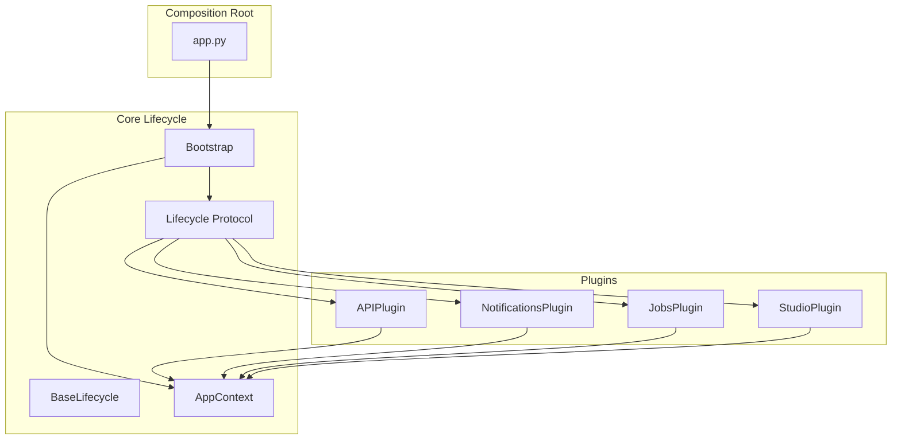
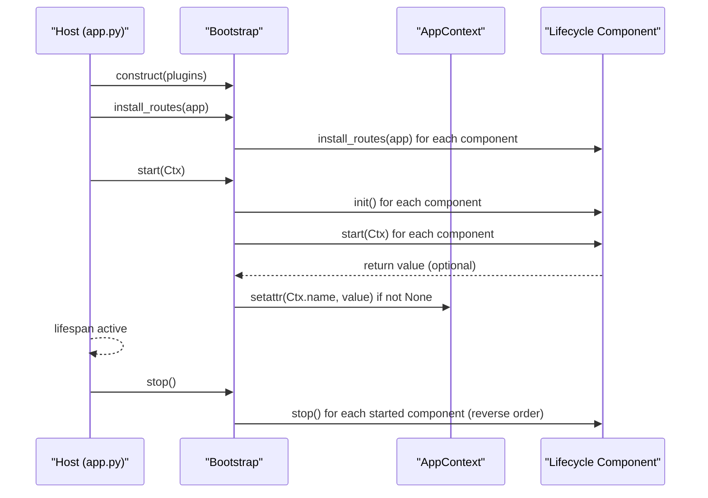
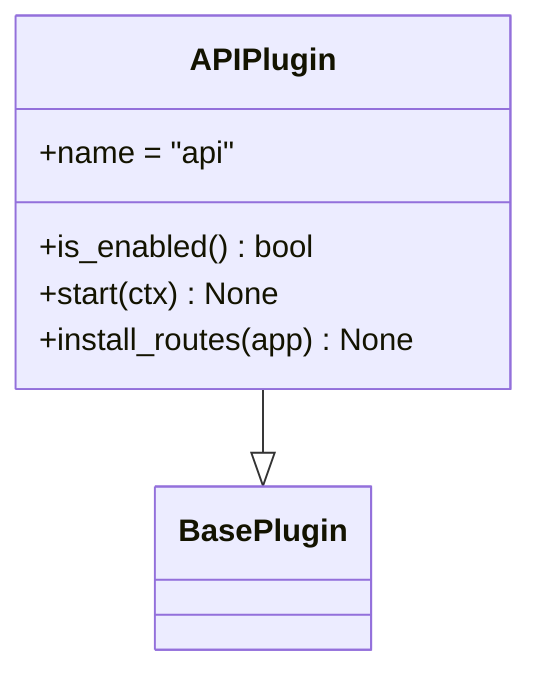
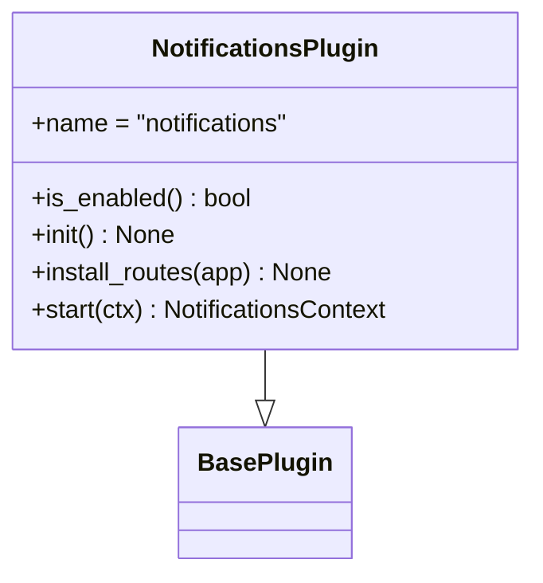
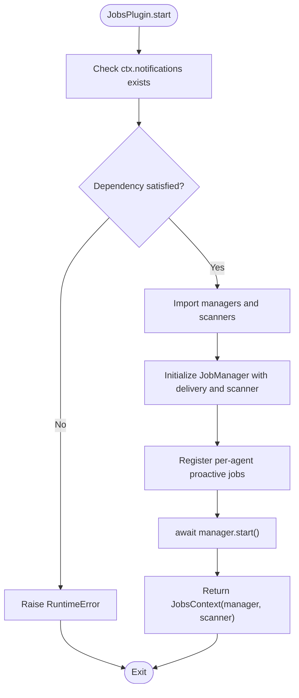
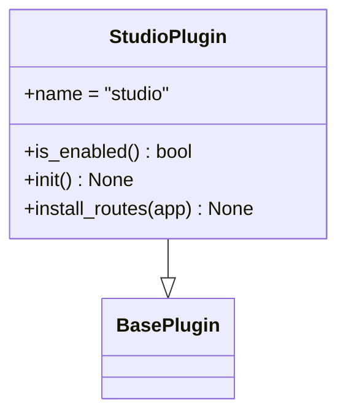
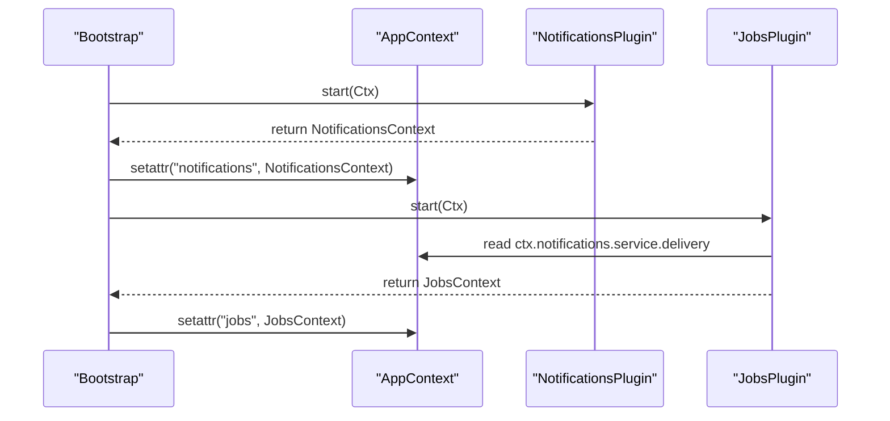
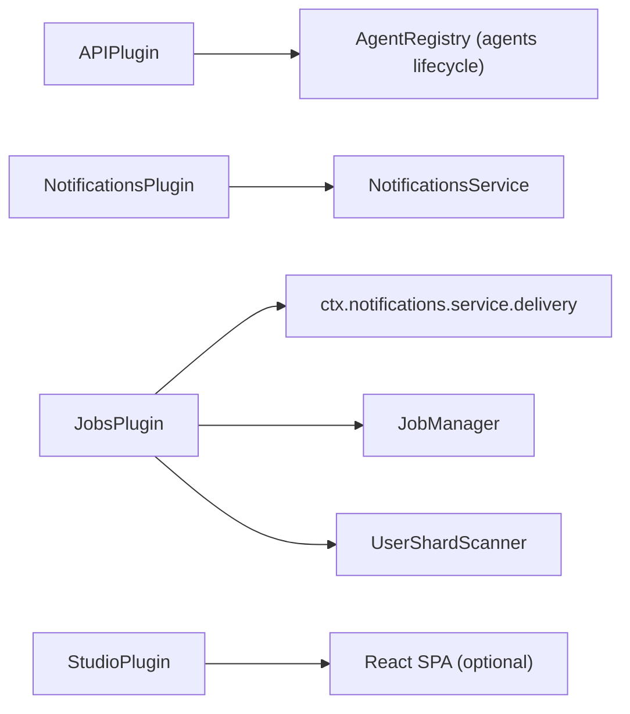

# Plugin System

<cite>
**Referenced Files in This Document**
- [README.md](file://README.md)
- [app.py](file://src/ark_agentic/app.py)
- [bootstrap.py](file://src/ark_agentic/core/protocol/bootstrap.py)
- [lifecycle.py](file://src/ark_agentic/core/protocol/lifecycle.py)
- [plugin.py](file://src/ark_agentic/core/protocol/plugin.py)
- [app_context.py](file://src/ark_agentic/core/protocol/app_context.py)
- [discovery.py](file://src/ark_agentic/core/runtime/discovery.py)
- [registry.py](file://src/ark_agentic/core/runtime/registry.py)
- [APIPlugin](file://src/ark_agentic/plugins/api/plugin.py)
- [APIPlugin deps](file://src/ark_agentic/plugins/api/deps.py)
- [NotificationsPlugin](file://src/ark_agentic/plugins/notifications/plugin.py)
- [Notifications setup](file://src/ark_agentic/plugins/notifications/setup.py)
- [JobsPlugin](file://src/ark_agentic/plugins/jobs/plugin.py)
- [Jobs proactive_setup](file://src/ark_agentic/plugins/jobs/proactive_setup.py)
- [StudioPlugin](file://src/ark_agentic/plugins/studio/plugin.py)
</cite>

## Table of Contents
1. [Introduction](#introduction)
2. [Project Structure](#project-structure)
3. [Core Components](#core-components)
4. [Architecture Overview](#architecture-overview)
5. [Detailed Component Analysis](#detailed-component-analysis)
6. [Dependency Analysis](#dependency-analysis)
7. [Performance Considerations](#performance-considerations)
8. [Troubleshooting Guide](#troubleshooting-guide)
9. [Conclusion](#conclusion)
10. [Appendices](#appendices)

## Introduction
This document explains the Ark Agentic plugin system that powers optional feature modules and their lifecycle management. It covers the plugin architecture enabling modular feature addition, the HTTP API plugin for web services, the notifications plugin for alerting systems, the jobs plugin for scheduled tasks, and the studio plugin for development tools. It documents the lifecycle phases (registration, initialization, dependency management, and shutdown), the AppContext system enabling cross-plugin communication, and provides practical examples, configuration patterns, and guidelines for building custom plugins.

## Project Structure
The plugin system is centered around a small set of core protocols and a Bootstrap orchestrator. Plugins are optional, user-selectable features that implement the same lifecycle contract as core components. The composition root wires a fixed list of plugins into Bootstrap, which ensures deterministic startup/shutdown order and shared resource exposure via AppContext.

**Diagram sources**
- [app.py:50-56](file://src/ark_agentic/app.py#L50-L56)
- [bootstrap.py:48-78](file://src/ark_agentic/core/protocol/bootstrap.py#L48-L78)
- [lifecycle.py:24-65](file://src/ark_agentic/core/protocol/lifecycle.py#L24-L65)
- [plugin.py:21-35](file://src/ark_agentic/core/protocol/plugin.py#L21-L35)
- [app_context.py:23-27](file://src/ark_agentic/core/protocol/app_context.py#L23-L27)
- [APIPlugin:27-87](file://src/ark_agentic/plugins/api/plugin.py#L27-L87)
- [NotificationsPlugin:12-41](file://src/ark_agentic/plugins/notifications/plugin.py#L12-L41)
- [JobsPlugin:34-99](file://src/ark_agentic/plugins/jobs/plugin.py#L34-L99)
- [StudioPlugin:16-32](file://src/ark_agentic/plugins/studio/plugin.py#L16-L32)

**Section sources**
- [README.md:300-344](file://README.md#L300-L344)
- [app.py:50-56](file://src/ark_agentic/app.py#L50-L56)
- [bootstrap.py:48-78](file://src/ark_agentic/core/protocol/bootstrap.py#L48-L78)
- [lifecycle.py:24-65](file://src/ark_agentic/core/protocol/lifecycle.py#L24-L65)
- [plugin.py:21-35](file://src/ark_agentic/core/protocol/plugin.py#L21-L35)
- [app_context.py:23-27](file://src/ark_agentic/core/protocol/app_context.py#L23-L27)

## Core Components
- Lifecycle and BaseLifecycle define the uniform lifecycle contract: is_enabled, init, install_routes, start, stop. BaseLifecycle provides no-op defaults so components only override what they need.
- Plugin and BasePlugin are semantically distinct from Lifecycle: plugins are optional and user-selectable; core components are always present.
- Bootstrap orchestrates lifecycle phases, enforces registration order, installs HTTP routes at module-load time, and manages AppContext population and reverse-shutdown.
- AppContext is a typed runtime container; core components publish typed slots, while plugins publish dynamic attributes named by their component.name.

Key behaviors:
- Registration order determines startup order; shutdown runs in reverse.
- install_routes is called before lifespan starts; start may return a value attached to AppContext by Bootstrap.
- Name collisions in AppContext are detected and raised early.

**Section sources**
- [lifecycle.py:24-65](file://src/ark_agentic/core/protocol/lifecycle.py#L24-L65)
- [lifecycle.py:68-91](file://src/ark_agentic/core/protocol/lifecycle.py#L68-L91)
- [plugin.py:21-35](file://src/ark_agentic/core/protocol/plugin.py#L21-L35)
- [bootstrap.py:48-162](file://src/ark_agentic/core/protocol/bootstrap.py#L48-L162)
- [app_context.py:23-27](file://src/ark_agentic/core/protocol/app_context.py#L23-L27)

## Architecture Overview
The system separates core runtime from optional plugins. The composition root constructs a Bootstrap with a fixed plugin list and FastAPI app. Bootstrap initializes all components, installs routes, starts them, and attaches returned values to AppContext. During shutdown, Bootstrap stops components in reverse order.

**Diagram sources**
- [app.py:71-78](file://src/ark_agentic/app.py#L71-L78)
- [bootstrap.py:124-162](file://src/ark_agentic/core/protocol/bootstrap.py#L124-L162)
- [lifecycle.py:38-65](file://src/ark_agentic/core/protocol/lifecycle.py#L38-L65)

**Section sources**
- [app.py:50-56](file://src/ark_agentic/app.py#L50-L56)
- [bootstrap.py:124-162](file://src/ark_agentic/core/protocol/bootstrap.py#L124-L162)
- [lifecycle.py:38-65](file://src/ark_agentic/core/protocol/lifecycle.py#L38-L65)

## Detailed Component Analysis

### API Plugin (HTTP Transport)
- Purpose: Provides chat HTTP transport, CORS middleware, health check, and a default demo page. It binds the shared AgentRegistry singleton and exposes chat endpoints.
- Lifecycle:
  - is_enabled gated by an environment flag.
  - start initializes the shared registry binding.
  - install_routes mounts CORS, probes drop middleware, chat router, health endpoint, and static assets.
- Integration: Depends on the AgentRegistry published by the agents lifecycle; reads ctx.agent_registry in start.

**Diagram sources**
- [APIPlugin:27-87](file://src/ark_agentic/plugins/api/plugin.py#L27-L87)
- [plugin.py:30-35](file://src/ark_agentic/core/protocol/plugin.py#L30-L35)

**Section sources**
- [APIPlugin:27-87](file://src/ark_agentic/plugins/api/plugin.py#L27-L87)
- [APIPlugin deps:19-37](file://src/ark_agentic/plugins/api/deps.py#L19-L37)
- [app.py:38-41](file://src/ark_agentic/app.py#L38-L41)

### Notifications Plugin (Alerting and SSE)
- Purpose: Provides notification storage, SSE delivery, and a repository cache. Can be enabled independently or alongside Jobs.
- Lifecycle:
  - is_enabled via dedicated environment flag or when Jobs is enabled.
  - init creates schema if using database mode.
  - install_routes mounts the notifications API.
  - start builds and returns a NotificationsContext containing a NotificationsService.
- Integration: Returns a typed context value attached to AppContext; Jobs reads ctx.notifications.service.delivery.

**Diagram sources**
- [NotificationsPlugin:12-41](file://src/ark_agentic/plugins/notifications/plugin.py#L12-L41)
- [plugin.py:30-35](file://src/ark_agentic/core/protocol/plugin.py#L30-L35)

**Section sources**
- [NotificationsPlugin:12-41](file://src/ark_agentic/plugins/notifications/plugin.py#L12-L41)
- [Notifications setup:44-58](file://src/ark_agentic/plugins/notifications/setup.py#L44-L58)

### Jobs Plugin (Scheduled Tasks)
- Purpose: Proactive job scheduler and user shard scanner. Requires NotificationsPlugin to be enabled and registered before it.
- Lifecycle:
  - is_enabled via dedicated environment flag.
  - init creates schema if using database mode.
  - start validates dependency on NotificationsPlugin, constructs JobManager and UserShardScanner, registers per-agent proactive jobs, and starts the manager.
  - stop shuts down the manager gracefully.
- Integration: Reads ctx.notifications.service.delivery; publishes a JobsContext with manager and scanner to AppContext.

**Diagram sources**
- [JobsPlugin:51-99](file://src/ark_agentic/plugins/jobs/plugin.py#L51-L99)
- [Jobs proactive_setup:18-65](file://src/ark_agentic/plugins/jobs/proactive_setup.py#L18-L65)

**Section sources**
- [JobsPlugin:34-99](file://src/ark_agentic/plugins/jobs/plugin.py#L34-L99)
- [Jobs proactive_setup:18-65](file://src/ark_agentic/plugins/jobs/proactive_setup.py#L18-L65)

### Studio Plugin (Development Tools)
- Purpose: Optional admin console with API routers and a React frontend (when built). Initializes its own SQLite schema independent of core storage mode.
- Lifecycle:
  - is_enabled via dedicated environment flag.
  - init sets up Studio’s auth schema.
  - install_routes mounts Studio APIs and optionally serves the SPA.

**Diagram sources**
- [StudioPlugin:16-32](file://src/ark_agentic/plugins/studio/plugin.py#L16-L32)
- [plugin.py:30-35](file://src/ark_agentic/core/protocol/plugin.py#L30-L35)

**Section sources**
- [StudioPlugin:16-32](file://src/ark_agentic/plugins/studio/plugin.py#L16-L32)

### AppContext and Cross-Plugin Communication
- AppContext is populated by Bootstrap.start: any non-None return value from a component’s start method is attached as ctx.<name>.
- Core components publish typed slots; plugins publish dynamic attributes. Consumers should defensively check for optional plugins using getattr with a default.
- Example integrations:
  - APIPlugin.start depends on ctx.agent_registry published by the agents lifecycle.
  - JobsPlugin.start depends on ctx.notifications produced by NotificationsPlugin.

**Diagram sources**
- [bootstrap.py:134-151](file://src/ark_agentic/core/protocol/bootstrap.py#L134-L151)
- [Notifications setup:51-58](file://src/ark_agentic/plugins/notifications/setup.py#L51-L58)
- [JobsPlugin:51-99](file://src/ark_agentic/plugins/jobs/plugin.py#L51-L99)

**Section sources**
- [app_context.py:23-27](file://src/ark_agentic/core/protocol/app_context.py#L23-L27)
- [bootstrap.py:134-151](file://src/ark_agentic/core/protocol/bootstrap.py#L134-L151)
- [APIPlugin:35-41](file://src/ark_agentic/plugins/api/plugin.py#L35-L41)
- [JobsPlugin:51-56](file://src/ark_agentic/plugins/jobs/plugin.py#L51-L56)

## Dependency Analysis
- Registration order equals startup order; shutdown runs in reverse. The composition root lists plugins in dependency order: APIPlugin, NotificationsPlugin, JobsPlugin, StudioPlugin. Jobs depends on Notifications; API binds the AgentRegistry from the agents lifecycle.
- HTTP route installation occurs at module-load time via install_routes, independent of lifespan.
- Cross-plugin dependencies are resolved through AppContext attribute names, avoiding hard-coded imports between plugins.

**Diagram sources**
- [app.py:50-56](file://src/ark_agentic/app.py#L50-L56)
- [bootstrap.py:124-132](file://src/ark_agentic/core/protocol/bootstrap.py#L124-L132)
- [APIPlugin:35-41](file://src/ark_agentic/plugins/api/plugin.py#L35-L41)
- [Notifications setup:51-58](file://src/ark_agentic/plugins/notifications/setup.py#L51-L58)
- [JobsPlugin:73-77](file://src/ark_agentic/plugins/jobs/plugin.py#L73-L77)

**Section sources**
- [app.py:50-56](file://src/ark_agentic/app.py#L50-L56)
- [bootstrap.py:124-132](file://src/ark_agentic/core/protocol/bootstrap.py#L124-L132)
- [bootstrap.py:153-162](file://src/ark_agentic/core/protocol/bootstrap.py#L153-L162)
- [README.md:306-317](file://README.md#L306-L317)

## Performance Considerations
- Lifecycle phases are designed to be idempotent and lightweight where possible. init and start avoid heavy workloads; long-running tasks are backgrounded in start and stopped in stop.
- JobsPlugin uses configurable concurrency and batching parameters via environment variables to tune performance under load.
- SSE delivery in NotificationsPlugin is designed for streaming updates; ensure proper resource cleanup in stop hooks.
- Schema initialization is deferred to init and only performed when storage mode requires it.

[No sources needed since this section provides general guidance]

## Troubleshooting Guide
Common issues and resolutions:
- JobsPlugin fails to start: ensure NotificationsPlugin is enabled and registered before JobsPlugin; verify apscheduler extras are installed.
- APIPlugin cannot find agents: confirm the agents lifecycle ran before APIPlugin.start and that ctx.agent_registry is populated.
- Route conflicts: remember that install_routes is called at module-load time; the first matching route registration wins in Starlette. Adjust plugin registration order if necessary.
- Name collisions in AppContext: Bootstrap raises an error if two components attempt to publish the same ctx.name; rename one component or adjust configuration.

**Section sources**
- [JobsPlugin:51-65](file://src/ark_agentic/plugins/jobs/plugin.py#L51-L65)
- [bootstrap.py:145-149](file://src/ark_agentic/core/protocol/bootstrap.py#L145-L149)
- [README.md:306-317](file://README.md#L306-L317)

## Conclusion
The Ark Agentic plugin system cleanly separates core runtime from optional features through a unified lifecycle contract and a deterministic Bootstrap orchestration. Plugins communicate via AppContext attribute names, enabling loose coupling and flexible composition. The HTTP API, notifications, jobs, and studio plugins demonstrate modular capabilities that can be enabled or disabled independently, with clear dependency relationships and robust lifecycle management.

[No sources needed since this section summarizes without analyzing specific files]

## Appendices

### Practical Examples and Patterns
- Enabling/disabling plugins: Use environment flags to toggle plugin activation. For example, enable the API plugin and studio via dedicated flags.
- Exposing shared state: Have a plugin’s start method return a context object; Bootstrap attaches it to AppContext by component.name. Other plugins can read ctx.<name> after the component has started.
- Installing HTTP routes: Implement install_routes to mount routers and middleware at module-load time. Keep it free of runtime dependencies; defer heavy initialization to start.
- Dependency validation: In start, validate that required plugins are present in AppContext before proceeding. Raise explicit errors with actionable messages.

**Section sources**
- [README.md:414-421](file://README.md#L414-L421)
- [bootstrap.py:134-151](file://src/ark_agentic/core/protocol/bootstrap.py#L134-L151)
- [bootstrap.py:124-132](file://src/ark_agentic/core/protocol/bootstrap.py#L124-L132)
- [JobsPlugin:51-56](file://src/ark_agentic/plugins/jobs/plugin.py#L51-L56)

### Creating Custom Plugins
Guidelines:
- Implement BasePlugin and set name to a non-empty string.
- Override is_enabled to gate activation via environment flags.
- Implement init for one-time setup (schema creation, directory layout).
- Implement install_routes to mount HTTP endpoints and middleware.
- Implement start to build runtime context and background tasks; return a context object if other components need it.
- Implement stop to clean up resources and background tasks.
- Register the plugin in the composition root list in dependency order.

**Section sources**
- [plugin.py:30-35](file://src/ark_agentic/core/protocol/plugin.py#L30-L35)
- [lifecycle.py:24-65](file://src/ark_agentic/core/protocol/lifecycle.py#L24-L65)
- [bootstrap.py:48-78](file://src/ark_agentic/core/protocol/bootstrap.py#L48-L78)

### Security and Best Practices
- Prefer environment-driven gating for optional features to minimize attack surface in headless deployments.
- Keep install_routes free of secrets; load configuration in start.
- Use typed contexts for core components and dynamic attributes for plugins to maintain type safety where possible.
- Avoid circular imports between plugins; rely on AppContext attribute names for inter-plugin communication.
- For distributed or multi-process deployments, ensure storage backends (SQLite, files) are properly configured and isolated.

**Section sources**
- [APIPlugin:30-33](file://src/ark_agentic/plugins/api/plugin.py#L30-L33)
- [StudioPlugin:19-20](file://src/ark_agentic/plugins/studio/plugin.py#L19-L20)
- [bootstrap.py:153-162](file://src/ark_agentic/core/protocol/bootstrap.py#L153-L162)