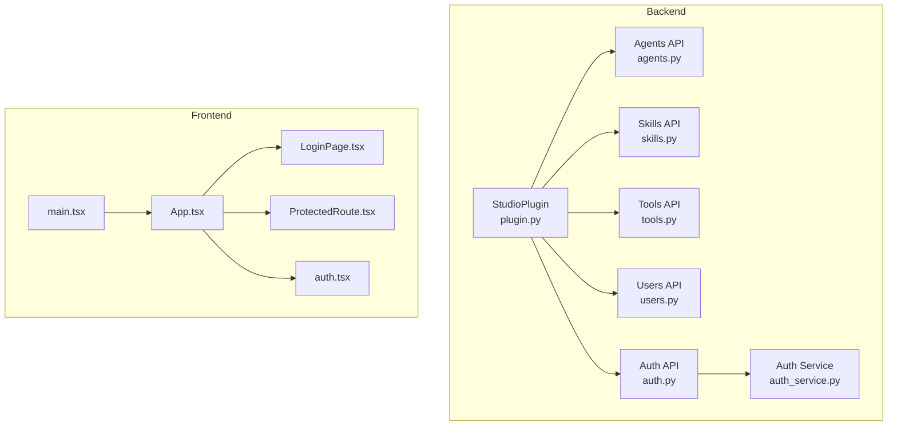
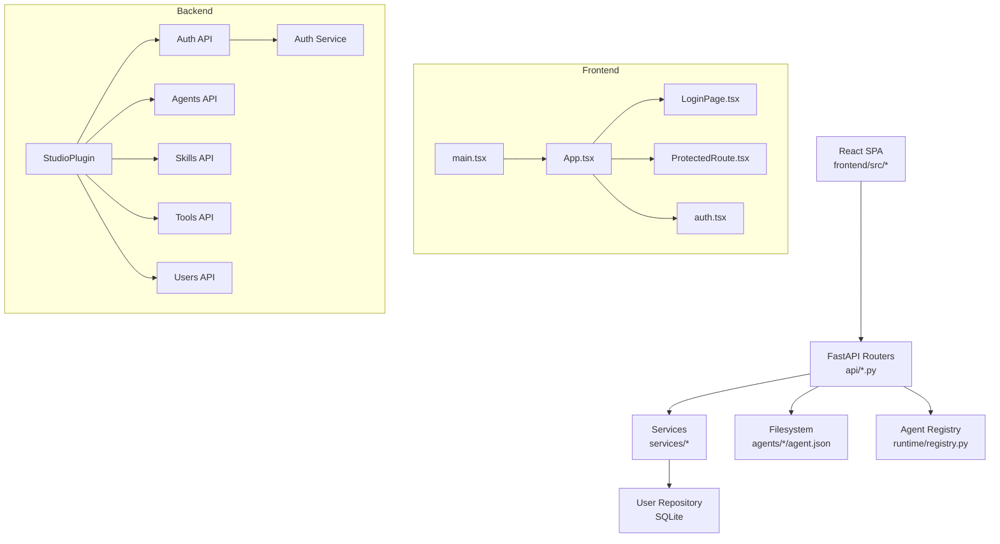
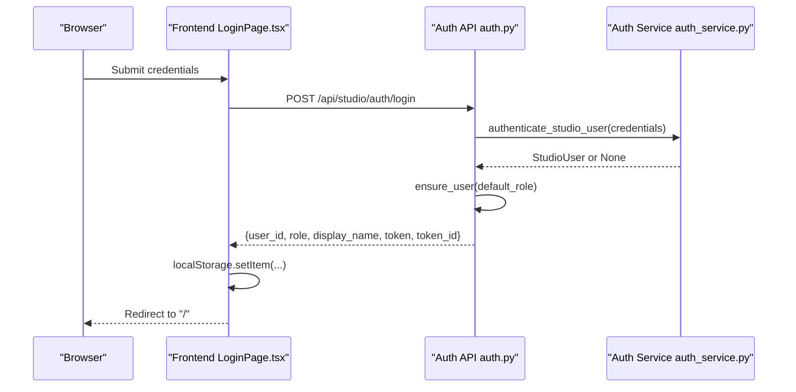
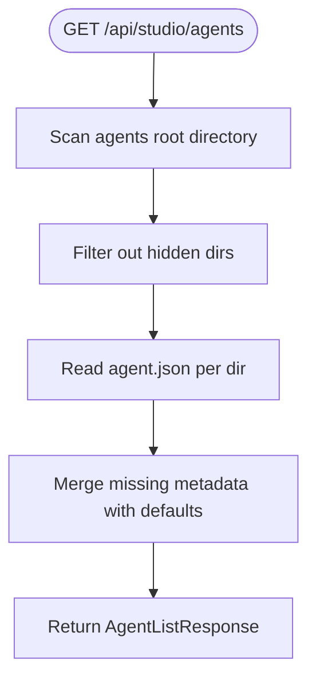
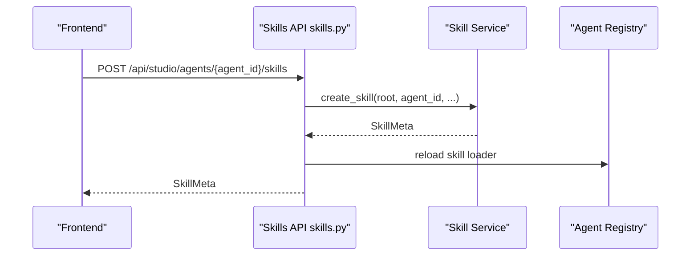
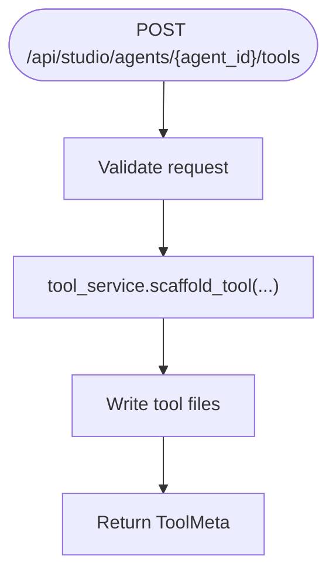
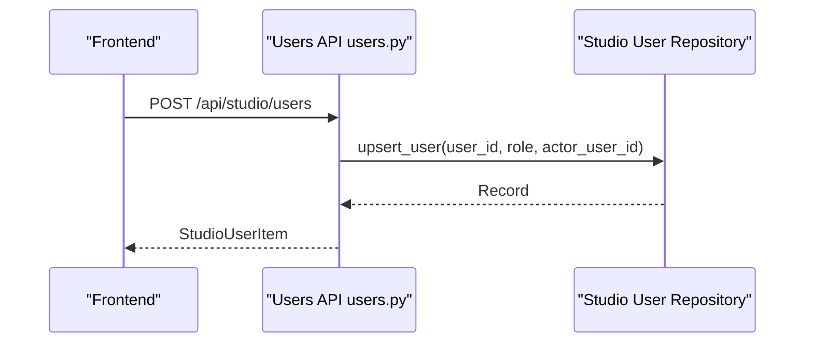
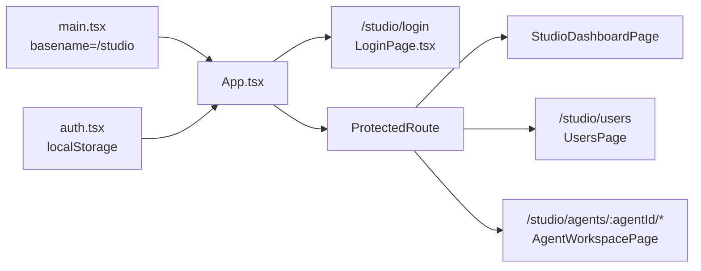
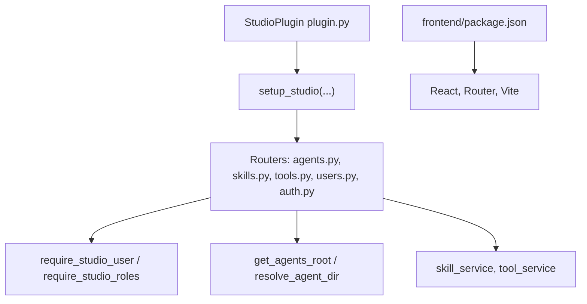

# Studio Plugin

<cite>
**Referenced Files in This Document**
- [plugin.py](file://src/ark_agentic/plugins/studio/plugin.py)
- [package.json](file://src/ark_agentic/plugins/studio/frontend/package.json)
- [main.tsx](file://src/ark_agentic/plugins/studio/frontend/src/main.tsx)
- [App.tsx](file://src/ark_agentic/plugins/studio/frontend/src/App.tsx)
- [agents.py](file://src/ark_agentic/plugins/studio/api/agents.py)
- [auth.py](file://src/ark_agentic/plugins/studio/api/auth.py)
- [skills.py](file://src/ark_agentic/plugins/studio/api/skills.py)
- [tools.py](file://src/ark_agentic/plugins/studio/api/tools.py)
- [users.py](file://src/ark_agentic/plugins/studio/api/users.py)
- [auth_service.py](file://src/ark_agentic/plugins/studio/services/auth_service.py)
- [auth.tsx](file://src/ark_agentic/plugins/studio/frontend/src/auth.tsx)
- [ProtectedRoute.tsx](file://src/ark_agentic/plugins/studio/frontend/src/components/ProtectedRoute.tsx)
- [LoginPage.tsx](file://src/ark_agentic/plugins/studio/frontend/src/pages/LoginPage.tsx)
- [__init__.py](file://src/ark_agentic/plugins/studio/api/__init__.py)
</cite>

## Table of Contents
1. [Introduction](#introduction)
2. [Project Structure](#project-structure)
3. [Core Components](#core-components)
4. [Architecture Overview](#architecture-overview)
5. [Detailed Component Analysis](#detailed-component-analysis)
6. [Dependency Analysis](#dependency-analysis)
7. [Performance Considerations](#performance-considerations)
8. [Troubleshooting Guide](#troubleshooting-guide)
9. [Conclusion](#conclusion)
10. [Appendices](#appendices)

## Introduction
The Studio Plugin provides a web-based development and management interface for building, operating, and governing autonomous agents. It combines a React frontend with a FastAPI backend and offers:
- Authentication and authorization with role-based access control
- Agent workspace for inspecting and managing agent metadata
- Skill management for authoring and editing agent skills
- Tool administration for scaffolding and maintaining agent tools
- User management for granting roles and auditing access
- A production-ready deployment model that mounts the frontend distribution under the /studio route

## Project Structure
Studio is organized into two primary parts:
- Backend (Python/FastAPI): API routers under plugins/studio/api and services under plugins/studio/services
- Frontend (React/Vite): Single-page application under plugins/studio/frontend

**Diagram sources**
- [plugin.py:16-32](file://src/ark_agentic/plugins/studio/plugin.py#L16-L32)
- [agents.py:1-134](file://src/ark_agentic/plugins/studio/api/agents.py#L1-L134)
- [skills.py:1-127](file://src/ark_agentic/plugins/studio/api/skills.py#L1-L127)
- [tools.py:1-71](file://src/ark_agentic/plugins/studio/api/tools.py#L1-L71)
- [users.py:1-111](file://src/ark_agentic/plugins/studio/api/users.py#L1-L111)
- [auth.py:1-99](file://src/ark_agentic/plugins/studio/api/auth.py#L1-L99)
- [auth_service.py:1-59](file://src/ark_agentic/plugins/studio/services/auth_service.py#L1-L59)
- [main.tsx:1-17](file://src/ark_agentic/plugins/studio/frontend/src/main.tsx#L1-L17)
- [App.tsx:1-24](file://src/ark_agentic/plugins/studio/frontend/src/App.tsx#L1-L24)
- [LoginPage.tsx:1-118](file://src/ark_agentic/plugins/studio/frontend/src/pages/LoginPage.tsx#L1-L118)
- [ProtectedRoute.tsx:1-9](file://src/ark_agentic/plugins/studio/frontend/src/components/ProtectedRoute.tsx#L1-L9)
- [auth.tsx:1-82](file://src/ark_agentic/plugins/studio/frontend/src/auth.tsx#L1-L82)

**Section sources**
- [plugin.py:16-32](file://src/ark_agentic/plugins/studio/plugin.py#L16-L32)
- [package.json:1-32](file://src/ark_agentic/plugins/studio/frontend/package.json#L1-L32)
- [main.tsx:1-17](file://src/ark_agentic/plugins/studio/frontend/src/main.tsx#L1-L17)
- [App.tsx:1-24](file://src/ark_agentic/plugins/studio/frontend/src/App.tsx#L1-L24)

## Core Components
- StudioPlugin: Conditional plugin that initializes Studio’s schema and installs routes when enabled via environment flag. It delegates to a setup routine that mounts the API routers and serves the frontend.
- Authentication subsystem: Provides login/logout endpoints, role-aware dependencies, and a repository-backed user store. Supports pluggable providers (default internal).
- Agent workspace APIs: List, read, and create agent metadata backed by filesystem scanning of agents directories.
- Skill management APIs: List, create, update, and delete skills for a given agent.
- Tool administration APIs: List and scaffold tools for a given agent.
- User management APIs: List, upsert, and delete user grants with role validation and administrative safeguards.
- Frontend SPA: React app with protected routing, local storage-based session persistence, and role-aware UI controls.

**Section sources**
- [plugin.py:16-32](file://src/ark_agentic/plugins/studio/plugin.py#L16-L32)
- [auth.py:1-99](file://src/ark_agentic/plugins/studio/api/auth.py#L1-L99)
- [agents.py:1-134](file://src/ark_agentic/plugins/studio/api/agents.py#L1-L134)
- [skills.py:1-127](file://src/ark_agentic/plugins/studio/api/skills.py#L1-L127)
- [tools.py:1-71](file://src/ark_agentic/plugins/studio/api/tools.py#L1-L71)
- [users.py:1-111](file://src/ark_agentic/plugins/studio/api/users.py#L1-L111)
- [auth.tsx:1-82](file://src/ark_agentic/plugins/studio/frontend/src/auth.tsx#L1-L82)

## Architecture Overview
Studio follows a thin-backend pattern:
- Frontend: React SPA bootstrapped with a basename for mounting under /studio. It persists a minimal user profile in localStorage and relies on API endpoints for all operations.
- Backend: FastAPI app with modular routers per domain (auth, agents, skills, tools, users). Each endpoint validates presence of a logged-in principal and applies role-based authorization checks where appropriate.
- Authentication orchestration: The backend composes one or more providers (default internal) to authenticate users and issue tokens. Providers are selected from an environment variable.

**Diagram sources**
- [plugin.py:16-32](file://src/ark_agentic/plugins/studio/plugin.py#L16-L32)
- [auth.py:1-99](file://src/ark_agentic/plugins/studio/api/auth.py#L1-L99)
- [agents.py:1-134](file://src/ark_agentic/plugins/studio/api/agents.py#L1-L134)
- [skills.py:1-127](file://src/ark_agentic/plugins/studio/api/skills.py#L1-L127)
- [tools.py:1-71](file://src/ark_agentic/plugins/studio/api/tools.py#L1-L71)
- [users.py:1-111](file://src/ark_agentic/plugins/studio/api/users.py#L1-L111)
- [auth_service.py:1-59](file://src/ark_agentic/plugins/studio/services/auth_service.py#L1-L59)
- [main.tsx:1-17](file://src/ark_agentic/plugins/studio/frontend/src/main.tsx#L1-L17)
- [App.tsx:1-24](file://src/ark_agentic/plugins/studio/frontend/src/App.tsx#L1-L24)
- [LoginPage.tsx:1-118](file://src/ark_agentic/plugins/studio/frontend/src/pages/LoginPage.tsx#L1-L118)
- [ProtectedRoute.tsx:1-9](file://src/ark_agentic/plugins/studio/frontend/src/components/ProtectedRoute.tsx#L1-L9)
- [auth.tsx:1-82](file://src/ark_agentic/plugins/studio/frontend/src/auth.tsx#L1-L82)

## Detailed Component Analysis

### Authentication and Authorization
- Login flow:
  - Frontend posts credentials to the backend login endpoint.
  - Backend authenticates via configured providers and ensures a persistent user record.
  - On success, backend returns a token and token identifier alongside user metadata.
  - Frontend stores the user object in localStorage and navigates to the dashboard.
- Logout flow:
  - Frontend calls the logout endpoint and clears local storage.
  - Backend attempts provider-specific logout and token invalidation.
- Roles and permissions:
  - Roles: admin, editor, viewer.
  - Admins can manage users and perform all write operations.
  - Editors can create/update resources but cannot manage users.
  - Viewers can read resources only.
- Token handling:
  - Tokens are issued by the backend; providers may support token invalidation depending on implementation.

**Diagram sources**
- [LoginPage.tsx:17-42](file://src/ark_agentic/plugins/studio/frontend/src/pages/LoginPage.tsx#L17-L42)
- [auth.py:67-84](file://src/ark_agentic/plugins/studio/api/auth.py#L67-L84)
- [auth_service.py:44-49](file://src/ark_agentic/plugins/studio/services/auth_service.py#L44-L49)

**Section sources**
- [auth.py:1-99](file://src/ark_agentic/plugins/studio/api/auth.py#L1-L99)
- [auth_service.py:1-59](file://src/ark_agentic/plugins/studio/services/auth_service.py#L1-L59)
- [auth.tsx:1-82](file://src/ark_agentic/plugins/studio/frontend/src/auth.tsx#L1-L82)
- [LoginPage.tsx:1-118](file://src/ark_agentic/plugins/studio/frontend/src/pages/LoginPage.tsx#L1-L118)

### Agent Workspace
- Purpose: Inspect and manage agent metadata stored in agents/*/agent.json.
- Capabilities:
  - List agents by scanning the agents root directory.
  - Get a single agent’s metadata.
  - Create a new agent with directory structure and initial metadata.
- Authorization: Requires a logged-in user; creation requires admin/editor roles.

**Diagram sources**
- [agents.py:76-90](file://src/ark_agentic/plugins/studio/api/agents.py#L76-L90)
- [agents.py:51-62](file://src/ark_agentic/plugins/studio/api/agents.py#L51-L62)

**Section sources**
- [agents.py:1-134](file://src/ark_agentic/plugins/studio/api/agents.py#L1-L134)

### Skill Management
- Purpose: Manage agent skills (Markdown instruction files) under agents/<agent>/skills.
- Capabilities:
  - List skills for an agent.
  - Create a new skill with name, description, and content.
  - Update an existing skill’s metadata/content.
  - Delete a skill with safeguards.
- Authorization: Requires a logged-in user; creation/update/deletion require admin/editor roles.
- Post-change behavior: Reloads the agent’s skill cache to reflect changes immediately.

**Diagram sources**
- [skills.py:69-88](file://src/ark_agentic/plugins/studio/api/skills.py#L69-L88)
- [skills.py:45-54](file://src/ark_agentic/plugins/studio/api/skills.py#L45-L54)

**Section sources**
- [skills.py:1-127](file://src/ark_agentic/plugins/studio/api/skills.py#L1-L127)

### Tool Administration
- Purpose: Scaffold agent tools under agents/<agent>/tools.
- Capabilities:
  - List tools for an agent (parsed from AST).
  - Scaffold a new tool with a name, description, and typed parameters.
- Authorization: Requires a logged-in user; scaffolding requires admin/editor roles.

**Diagram sources**
- [tools.py:53-70](file://src/ark_agentic/plugins/studio/api/tools.py#L53-L70)

**Section sources**
- [tools.py:1-71](file://src/ark_agentic/plugins/studio/api/tools.py#L1-L71)

### User Management
- Purpose: Manage Studio user grants (role assignments) keyed by user_id.
- Capabilities:
  - Paginated listing with filters (substring match on user_id, role filter).
  - Upsert a user grant (role change).
  - Delete a user grant.
- Authorization: Requires admin role; includes safeguards preventing self-modification and removal of the last admin.

**Diagram sources**
- [users.py:68-91](file://src/ark_agentic/plugins/studio/api/users.py#L68-L91)

**Section sources**
- [users.py:1-111](file://src/ark_agentic/plugins/studio/api/users.py#L1-L111)

### Frontend Routing and Security
- Routing:
  - Root path (/studio) mounts the SPA with basename set to "/studio".
  - Public route: /studio/login
  - Protected routes: Dashboard, Users, Agent workspace
- Authentication:
  - Local storage holds the user object after login.
  - ProtectedRoute enforces presence of a user before rendering protected content.
  - Role helpers inform UI affordances (e.g., edit vs. view-only).

**Diagram sources**
- [main.tsx:8-16](file://src/ark_agentic/plugins/studio/frontend/src/main.tsx#L8-L16)
- [App.tsx:9-23](file://src/ark_agentic/plugins/studio/frontend/src/App.tsx#L9-L23)
- [LoginPage.tsx:7](file://src/ark_agentic/plugins/studio/frontend/src/pages/LoginPage.tsx#L7)
- [ProtectedRoute.tsx:4-7](file://src/ark_agentic/plugins/studio/frontend/src/components/ProtectedRoute.tsx#L4-L7)
- [auth.tsx:24-42](file://src/ark_agentic/plugins/studio/frontend/src/auth.tsx#L24-L42)

**Section sources**
- [main.tsx:1-17](file://src/ark_agentic/plugins/studio/frontend/src/main.tsx#L1-L17)
- [App.tsx:1-24](file://src/ark_agentic/plugins/studio/frontend/src/App.tsx#L1-L24)
- [ProtectedRoute.tsx:1-9](file://src/ark_agentic/plugins/studio/frontend/src/components/ProtectedRoute.tsx#L1-L9)
- [auth.tsx:1-82](file://src/ark_agentic/plugins/studio/frontend/src/auth.tsx#L1-L82)

## Dependency Analysis
- Plugin wiring:
  - StudioPlugin enables itself via environment flag and initializes Studio’s schema.
  - It installs Studio routes by delegating to a setup routine.
- Frontend dependencies:
  - React, React DOM, react-router-dom
  - Vite toolchain for dev/build/lint
- API dependencies:
  - Each router depends on shared authorization helpers and environment utilities.
  - Skill and tool endpoints depend on services that operate on the agent registry and filesystem.

**Diagram sources**
- [plugin.py:22-31](file://src/ark_agentic/plugins/studio/plugin.py#L22-L31)
- [agents.py:17-18](file://src/ark_agentic/plugins/studio/api/agents.py#L17-L18)
- [skills.py:14-18](file://src/ark_agentic/plugins/studio/api/skills.py#L14-L18)
- [tools.py:15-18](file://src/ark_agentic/plugins/studio/api/tools.py#L15-L18)
- [users.py:10-18](file://src/ark_agentic/plugins/studio/api/users.py#L10-L18)
- [package.json:12-30](file://src/ark_agentic/plugins/studio/frontend/package.json#L12-L30)

**Section sources**
- [plugin.py:16-32](file://src/ark_agentic/plugins/studio/plugin.py#L16-L32)
- [package.json:1-32](file://src/ark_agentic/plugins/studio/frontend/package.json#L1-L32)
- [agents.py:14-22](file://src/ark_agentic/plugins/studio/api/agents.py#L14-L22)
- [skills.py:11-22](file://src/ark_agentic/plugins/studio/api/skills.py#L11-L22)
- [tools.py:12-22](file://src/ark_agentic/plugins/studio/api/tools.py#L12-L22)
- [users.py:7-20](file://src/ark_agentic/plugins/studio/api/users.py#L7-L20)

## Performance Considerations
- Filesystem scans: Agent listing and tool enumeration rely on filesystem traversal. Keep agents directories lean and avoid excessive nesting.
- Skill/tool reload: After write operations, the agent’s skill loader is reloaded. Batch updates where possible to minimize reload overhead.
- Frontend caching: Persisted user state reduces repeated auth requests; avoid unnecessary re-renders by leveraging memoization and stable references in React components.
- Network efficiency: Use pagination for user listings and keep request payloads minimal.

## Troubleshooting Guide
- Login failures:
  - Verify credentials and provider configuration. Check that STUDIO_AUTH_PROVIDERS includes a supported provider and that internal users are seeded appropriately.
- Permission denied:
  - Ensure the user has the required role (admin/editor/viewer) for the requested operation.
- Agent not found:
  - Confirm the agent directory exists under the agents root and contains a valid agent.json.
- Skill/tool conflicts:
  - Ensure unique identifiers for skills and tools; conflicts produce 409 responses.
- Logout issues:
  - Confirm the frontend passes the token_id header during logout for provider-side invalidation.

**Section sources**
- [auth.py:29](file://src/ark_agentic/plugins/studio/api/auth.py#L29)
- [agents.py:96-103](file://src/ark_agentic/plugins/studio/api/agents.py#L96-L103)
- [skills.py:83](file://src/ark_agentic/plugins/studio/api/skills.py#L83)
- [tools.py:67](file://src/ark_agentic/plugins/studio/api/tools.py#L67)
- [auth.py:96](file://src/ark_agentic/plugins/studio/api/auth.py#L96)

## Conclusion
Studio delivers a cohesive, role-aware interface for agent lifecycle management. Its thin backend and React frontend enable rapid iteration while maintaining strong separation of concerns. By leveraging environment-driven configuration, filesystem-backed metadata, and a provider-agnostic auth layer, Studio integrates cleanly into diverse deployment environments.

## Appendices

### API Reference Summary
- Authentication
  - POST /api/studio/auth/login
  - POST /api/studio/auth/logout
- Agents
  - GET /api/studio/agents
  - GET /api/studio/agents/{agent_id}
  - POST /api/studio/agents
- Skills
  - GET /api/studio/agents/{agent_id}/skills
  - POST /api/studio/agents/{agent_id}/skills
  - PUT /api/studio/agents/{agent_id}/skills/{skill_id}
  - DELETE /api/studio/agents/{agent_id}/skills/{skill_id}
- Tools
  - GET /api/studio/agents/{agent_id}/tools
  - POST /api/studio/agents/{agent_id}/tools
- Users
  - GET /api/studio/users
  - POST /api/studio/users
  - DELETE /api/studio/users/{user_id}

**Section sources**
- [auth.py:67-98](file://src/ark_agentic/plugins/studio/api/auth.py#L67-L98)
- [agents.py:76-133](file://src/ark_agentic/plugins/studio/api/agents.py#L76-L133)
- [skills.py:58-126](file://src/ark_agentic/plugins/studio/api/skills.py#L58-L126)
- [tools.py:42-70](file://src/ark_agentic/plugins/studio/api/tools.py#L42-L70)
- [users.py:45-110](file://src/ark_agentic/plugins/studio/api/users.py#L45-L110)

### Deployment and Configuration
- Enable Studio:
  - Set the environment flag to activate the Studio plugin.
- Authentication providers:
  - Configure STUDIO_AUTH_PROVIDERS (comma-separated). Default is internal.
  - For internal provider, seed users via the documented mechanism.
- Frontend:
  - Build the React app and serve the dist assets under /studio.
  - Ensure basename matches the mounted route.
- Environment variables:
  - ENABLE_STUDIO: toggles Studio plugin
  - STUDIO_AUTH_PROVIDERS: provider list
  - STUDIO_USERS: optional seeding for internal provider

**Section sources**
- [plugin.py:19-20](file://src/ark_agentic/plugins/studio/plugin.py#L19-L20)
- [auth.py:5-11](file://src/ark_agentic/plugins/studio/api/auth.py#L5-L11)
- [main.tsx:10](file://src/ark_agentic/plugins/studio/frontend/src/main.tsx#L10)
- [package.json:6-10](file://src/ark_agentic/plugins/studio/frontend/package.json#L6-L10)

### Security Considerations
- Role-based access:
  - Use require_studio_roles to gate write operations.
  - Restrict user management to admins.
- Token handling:
  - Providers may support token invalidation; ensure logout passes token_id.
- Audit:
  - Track login/logout and user grant changes at the provider/repository layer.

**Section sources**
- [users.py:51](file://src/ark_agentic/plugins/studio/api/users.py#L51)
- [users.py:97](file://src/ark_agentic/plugins/studio/api/users.py#L97)
- [auth.py:96](file://src/ark_agentic/plugins/studio/api/auth.py#L96)

### Practical Workflows
- Using the Studio dashboard:
  - Log in via /studio/login, then navigate to the dashboard and explore agents.
- Creating an agent:
  - Use the agents API to POST a new agent; Studio creates the directory and initial metadata.
- Managing skills:
  - List, create, update, and delete skills for a specific agent; changes trigger immediate cache reload.
- Managing tools:
  - Scaffold new tools with typed parameters; list existing tools for an agent.
- Monitoring system performance:
  - Observe API latency and filesystem traversal costs; leverage pagination for user listings.

**Section sources**
- [agents.py:106-133](file://src/ark_agentic/plugins/studio/api/agents.py#L106-L133)
- [skills.py:58-126](file://src/ark_agentic/plugins/studio/api/skills.py#L58-L126)
- [tools.py:42-70](file://src/ark_agentic/plugins/studio/api/tools.py#L42-L70)
- [users.py:45-110](file://src/ark_agentic/plugins/studio/api/users.py#L45-L110)