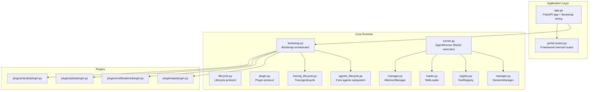
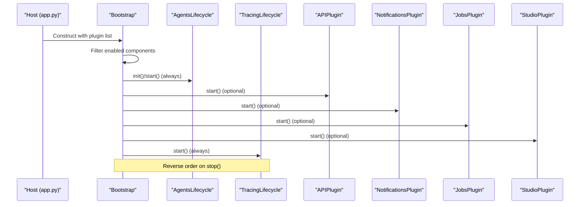
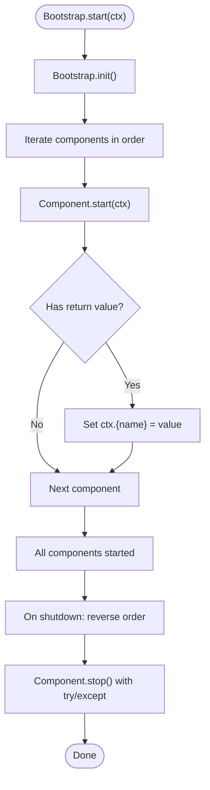
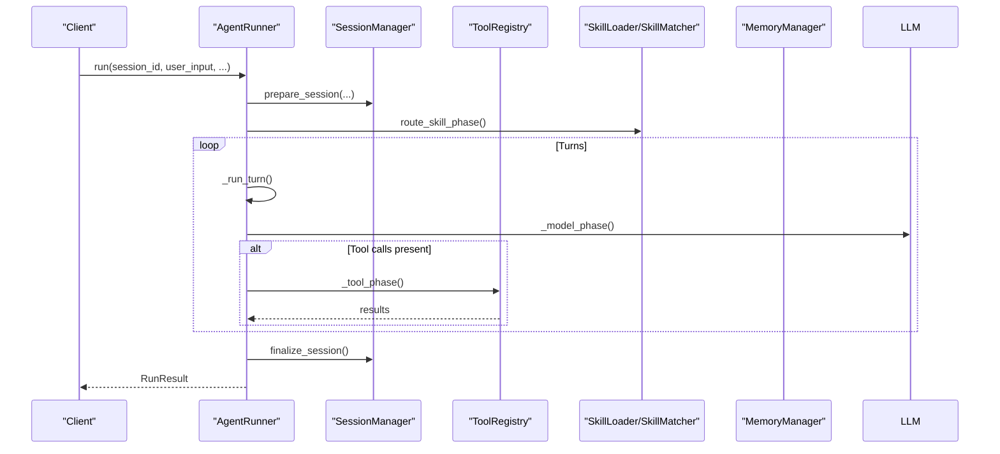
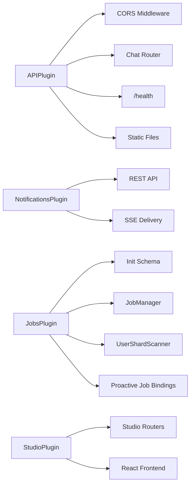
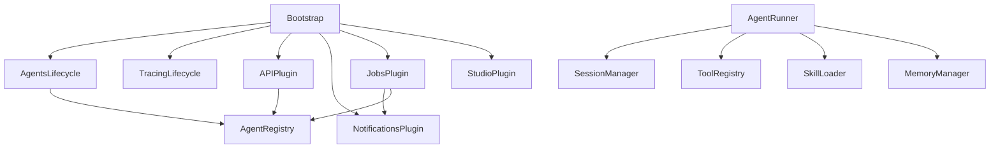

# Architecture Overview

<cite>
**Referenced Files in This Document**
- [app.py](file://src/ark_agentic/app.py)
- [bootstrap.py](file://src/ark_agentic/core/protocol/bootstrap.py)
- [lifecycle.py](file://src/ark_agentic/core/protocol/lifecycle.py)
- [plugin.py](file://src/ark_agentic/core/protocol/plugin.py)
- [agents_lifecycle.py](file://src/ark_agentic/core/runtime/agents_lifecycle.py)
- [runner.py](file://src/ark_agentic/core/runtime/runner.py)
- [manager.py](file://src/ark_agentic/core/session/manager.py)
- [registry.py](file://src/ark_agentic/core/tools/registry.py)
- [loader.py](file://src/ark_agentic/core/skills/loader.py)
- [manager.py](file://src/ark_agentic/core/memory/manager.py)
- [tracing_lifecycle.py](file://src/ark_agentic/core/observability/tracing_lifecycle.py)
- [routes.py](file://src/ark_agentic/portal/routes.py)
- [plugin.py](file://src/ark_agentic/plugins/api/plugin.py)
- [plugin.py](file://src/ark_agentic/plugins/studio/plugin.py)
- [plugin.py](file://src/ark_agentic/plugins/jobs/plugin.py)
- [plugin.py](file://src/ark_agentic/plugins/notifications/plugin.py)
</cite>

## Table of Contents
1. [Introduction](#introduction)
2. [Project Structure](#project-structure)
3. [Core Components](#core-components)
4. [Architecture Overview](#architecture-overview)
5. [Detailed Component Analysis](#detailed-component-analysis)
6. [Dependency Analysis](#dependency-analysis)
7. [Performance Considerations](#performance-considerations)
8. [Troubleshooting Guide](#troubleshooting-guide)
9. [Conclusion](#conclusion)

## Introduction
This document describes the Ark Agentic framework’s high-level architecture and system structure. The framework follows a Core + Plugin architecture pattern:
- Core runtime components are mandatory and always loaded by the Bootstrap orchestrator. These include the agents subsystem, session management, tools, skills, memory, and observability.
- Optional capabilities are packaged as Plugins that are user-selectable and loaded according to environment flags. Examples include API transport, Studio admin console, Jobs scheduler, and Notifications.

The Bootstrap system is responsible for lifecycle orchestration, dependency injection, and service registration. It ensures a consistent init → start → stop sequence across all components, while preserving modularity and extensibility.

## Project Structure
The repository is organized around a clear separation of concerns:
- Core runtime and protocols under core/
- Plugin implementations under plugins/
- Application entry point and HTTP wiring under app.py
- Portal routes for framework-internal demos and docs

**Diagram sources**
- [app.py:50-56](file://src/ark_agentic/app.py#L50-L56)
- [bootstrap.py:67-76](file://src/ark_agentic/core/protocol/bootstrap.py#L67-L76)
- [agents_lifecycle.py:43-70](file://src/ark_agentic/core/runtime/agents_lifecycle.py#L43-L70)
- [tracing_lifecycle.py:21-41](file://src/ark_agentic/core/observability/tracing_lifecycle.py#L21-L41)
- [plugin.py:27-34](file://src/ark_agentic/core/protocol/plugin.py#L27-L34)
- [runner.py:171-254](file://src/ark_agentic/core/runtime/runner.py#L171-L254)
- [manager.py:27-54](file://src/ark_agentic/core/session/manager.py#L27-L54)
- [registry.py:14-93](file://src/ark_agentic/core/tools/registry.py#L14-L93)
- [loader.py:25-113](file://src/ark_agentic/core/skills/loader.py#L25-L113)
- [manager.py:52-96](file://src/ark_agentic/core/memory/manager.py#L52-L96)
- [routes.py:19-134](file://src/ark_agentic/portal/routes.py#L19-L134)
- [plugin.py:27-87](file://src/ark_agentic/plugins/api/plugin.py#L27-L87)
- [plugin.py:16-32](file://src/ark_agentic/plugins/studio/plugin.py#L16-L32)
- [plugin.py:34-99](file://src/ark_agentic/plugins/jobs/plugin.py#L34-L99)
- [plugin.py:12-41](file://src/ark_agentic/plugins/notifications/plugin.py#L12-L41)

**Section sources**
- [app.py:50-56](file://src/ark_agentic/app.py#L50-L56)
- [bootstrap.py:67-76](file://src/ark_agentic/core/protocol/bootstrap.py#L67-L76)

## Core Components
This section documents the mandatory Core runtime components and their responsibilities.

- Bootstrap orchestrator
  - Initializes and starts all enabled components in registration order, then stops them in reverse order.
  - Automatically loads mandatory core components (AgentsLifecycle and TracingLifecycle) and allows user-selected plugins in between.
  - Publishes services to AppContext during start so plugins can consume them.

- AgentsLifecycle
  - Discovers and registers agents from filesystem roots, supports warmup and shutdown.
  - Publishes AgentRegistry to AppContext for plugins to use.

- AgentRunner (ReAct executor)
  - Executes reasoning loops with LLMs, tools, and skills.
  - Manages session state, tool execution, memory integration, and streaming output.
  - Supports dynamic skill routing and subtask spawning.

- SessionManager
  - Tracks messages, manages persistence, token accounting, and automatic compaction.
  - Provides in-memory and repository-backed storage abstractions.

- ToolRegistry
  - Central registry for tools with grouping, filtering, and schema generation for LLM function calling.

- SkillLoader
  - Loads skills from directories with frontmatter parsing and priority-based overrides.
  - Supports FULL and dynamic modes for skill inclusion.

- MemoryManager
  - Unified interface for memory read/write with optional dreaming (consolidation) and active-user caching.

- TracingLifecycle
  - Sets up and tears down OpenTelemetry tracing with environment-driven service naming.

**Section sources**
- [bootstrap.py:48-162](file://src/ark_agentic/core/protocol/bootstrap.py#L48-L162)
- [agents_lifecycle.py:43-80](file://src/ark_agentic/core/runtime/agents_lifecycle.py#L43-L80)
- [runner.py:171-800](file://src/ark_agentic/core/runtime/runner.py#L171-L800)
- [manager.py:27-543](file://src/ark_agentic/core/session/manager.py#L27-L543)
- [registry.py:14-178](file://src/ark_agentic/core/tools/registry.py#L14-L178)
- [loader.py:25-195](file://src/ark_agentic/core/skills/loader.py#L25-L195)
- [manager.py:52-183](file://src/ark_agentic/core/memory/manager.py#L52-L183)
- [tracing_lifecycle.py:21-42](file://src/ark_agentic/core/observability/tracing_lifecycle.py#L21-L42)

## Architecture Overview
The framework’s architecture centers on a Bootstrap-driven lifecycle that composes Core runtime components with optional Plugins. The application entry point constructs a Bootstrap with a list of plugins, then installs routes and runs the lifecycle.

**Diagram sources**
- [app.py:50-56](file://src/ark_agentic/app.py#L50-L56)
- [bootstrap.py:67-76](file://src/ark_agentic/core/protocol/bootstrap.py#L67-L76)
- [agents_lifecycle.py:56-70](file://src/ark_agentic/core/runtime/agents_lifecycle.py#L56-L70)
- [tracing_lifecycle.py:32-41](file://src/ark_agentic/core/observability/tracing_lifecycle.py#L32-L41)
- [plugin.py:27-87](file://src/ark_agentic/plugins/api/plugin.py#L27-L87)
- [plugin.py:12-41](file://src/ark_agentic/plugins/notifications/plugin.py#L12-L41)
- [plugin.py:34-99](file://src/ark_agentic/plugins/jobs/plugin.py#L34-L99)
- [plugin.py:16-32](file://src/ark_agentic/plugins/studio/plugin.py#L16-L32)

## Detailed Component Analysis

### Bootstrap and Lifecycle Orchestration
- Responsibilities
  - One-time initialization, ordered startup, and graceful shutdown.
  - Publishing services to AppContext for downstream components.
  - Enforcing lifecycle name uniqueness to prevent collisions.
- Behavior
  - Always loads AgentsLifecycle first and TracingLifecycle last.
  - Skips disabled components based on is_enabled() checks.
  - Calls install_routes() on every component (no-op for non-HTTP components).

**Diagram sources**
- [bootstrap.py:115-162](file://src/ark_agentic/core/protocol/bootstrap.py#L115-L162)

**Section sources**
- [bootstrap.py:48-162](file://src/ark_agentic/core/protocol/bootstrap.py#L48-L162)
- [lifecycle.py:23-39](file://src/ark_agentic/core/protocol/lifecycle.py#L23-L39)
- [plugin.py:20-35](file://src/ark_agentic/core/protocol/plugin.py#L20-L35)

### AgentRunner and Execution Loop
- Responsibilities
  - Execute ReAct-style loops: build prompts → call LLM → execute tools → repeat until done.
  - Manage session state, tool execution, memory integration, and streaming.
- Key integrations
  - SessionManager for message persistence and compaction.
  - ToolRegistry for tool discovery and schema generation.
  - SkillLoader and SkillMatcher for skill selection and routing.
  - MemoryManager for memory read/write and optional dreaming.

**Diagram sources**
- [runner.py:290-380](file://src/ark_agentic/core/runtime/runner.py#L290-L380)
- [runner.py:684-722](file://src/ark_agentic/core/runtime/runner.py#L684-L722)
- [manager.py:294-373](file://src/ark_agentic/core/session/manager.py#L294-L373)
- [registry.py:14-93](file://src/ark_agentic/core/tools/registry.py#L14-L93)
- [loader.py:25-113](file://src/ark_agentic/core/skills/loader.py#L25-L113)
- [manager.py:97-123](file://src/ark_agentic/core/memory/manager.py#L97-L123)

**Section sources**
- [runner.py:171-800](file://src/ark_agentic/core/runtime/runner.py#L171-L800)
- [manager.py:27-543](file://src/ark_agentic/core/session/manager.py#L27-L543)
- [registry.py:14-178](file://src/ark_agentic/core/tools/registry.py#L14-L178)
- [loader.py:25-195](file://src/ark_agentic/core/skills/loader.py#L25-L195)
- [manager.py:52-183](file://src/ark_agentic/core/memory/manager.py#L52-L183)

### Plugin Architecture and HTTP Routing
- APIPlugin
  - Adds CORS middleware, drops benign probes, mounts chat router, exposes health endpoint, and serves a default chat demo page.
- StudioPlugin
  - Initializes its schema and mounts Studio routers and frontend assets.
- NotificationsPlugin
  - Initializes notification schema and sets up REST endpoints and SSE delivery.
- JobsPlugin
  - Requires NotificationsPlugin to be enabled first; initializes schema and starts JobManager and UserShardScanner; registers proactive jobs using AgentRegistry.

**Diagram sources**
- [plugin.py:27-87](file://src/ark_agentic/plugins/api/plugin.py#L27-L87)
- [plugin.py:12-41](file://src/ark_agentic/plugins/notifications/plugin.py#L12-L41)
- [plugin.py:34-99](file://src/ark_agentic/plugins/jobs/plugin.py#L34-L99)
- [plugin.py:16-32](file://src/ark_agentic/plugins/studio/plugin.py#L16-L32)

**Section sources**
- [plugin.py:27-87](file://src/ark_agentic/plugins/api/plugin.py#L27-L87)
- [plugin.py:12-41](file://src/ark_agentic/plugins/notifications/plugin.py#L12-L41)
- [plugin.py:34-99](file://src/ark_agentic/plugins/jobs/plugin.py#L34-L99)
- [plugin.py:16-32](file://src/ark_agentic/plugins/studio/plugin.py#L16-L32)

### Framework Position and Design Philosophy
- Position in the AI agent ecosystem
  - Ark Agentic provides a lightweight, production-ready foundation for building AI agents with modular capabilities.
  - Core runtime focuses on agent execution, session/state management, tools, skills, and memory.
  - Plugins extend functionality for transport (API), administration (Studio), proactive automation (Jobs), and communication (Notifications).
- Benefits of Core + Plugin
  - Separation of concerns: essential runtime remains minimal and robust; optional features are decoupled.
  - Extensibility: third-party plugins can be discovered via importlib metadata without code changes.
  - Modularity: environment flags control feature activation, enabling headless or partial deployments.

[No sources needed since this section summarizes without analyzing specific files]

## Dependency Analysis
The following diagram highlights key dependencies among core components and plugins:

**Diagram sources**
- [bootstrap.py:67-76](file://src/ark_agentic/core/protocol/bootstrap.py#L67-L76)
- [agents_lifecycle.py:56-70](file://src/ark_agentic/core/runtime/agents_lifecycle.py#L56-L70)
- [plugin.py:34-99](file://src/ark_agentic/plugins/jobs/plugin.py#L51-L92)
- [plugin.py:27-87](file://src/ark_agentic/plugins/api/plugin.py#L35-L41)
- [runner.py:171-254](file://src/ark_agentic/core/runtime/runner.py#L171-L254)

**Section sources**
- [bootstrap.py:67-76](file://src/ark_agentic/core/protocol/bootstrap.py#L67-L76)
- [agents_lifecycle.py:56-70](file://src/ark_agentic/core/runtime/agents_lifecycle.py#L56-L70)
- [plugin.py:34-99](file://src/ark_agentic/plugins/jobs/plugin.py#L51-L92)
- [plugin.py:27-87](file://src/ark_agentic/plugins/api/plugin.py#L35-L41)
- [runner.py:171-254](file://src/ark_agentic/core/runtime/runner.py#L171-L254)

## Performance Considerations
- Session compaction and token accounting reduce context size and improve throughput.
- MemoryManager caches active users to minimize I/O during chat turns.
- Tool execution timeouts and per-turn limits prevent runaway resource usage.
- Observability tracing adds overhead; configure exporters appropriately for production.

[No sources needed since this section provides general guidance]

## Troubleshooting Guide
- Component lifecycle collisions
  - If two components publish the same AppContext name, Bootstrap.start() raises an error. Verify unique names across components.
- Missing dependencies in JobsPlugin
  - Jobs require the notifications plugin enabled and the server extras installed. Ensure environment flags and installation match expectations.
- APIPlugin disabled unexpectedly
  - APIPlugin is enabled by default; set the environment flag to disable for headless deployments.

**Section sources**
- [bootstrap.py:140-151](file://src/ark_agentic/core/protocol/bootstrap.py#L140-L151)
- [plugin.py:52-65](file://src/ark_agentic/plugins/jobs/plugin.py#L52-L65)
- [plugin.py:30-33](file://src/ark_agentic/plugins/api/plugin.py#L30-L33)

## Conclusion
Ark Agentic’s Core + Plugin architecture delivers a clean separation between essential runtime functionality and optional capabilities. The Bootstrap orchestrator ensures consistent lifecycle management, while the protocol contracts (Lifecycle and Plugin) enforce modularity and extensibility. This design enables production-ready deployments with flexible feature activation and strong composability across agents, tools, skills, memory, and plugins.

[No sources needed since this section summarizes without analyzing specific files]