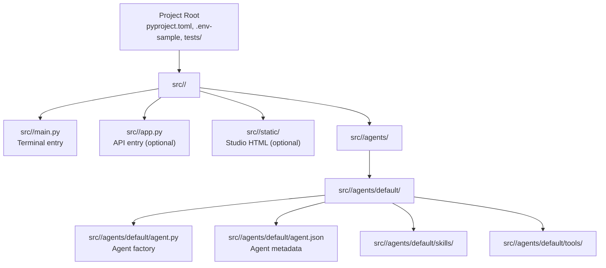
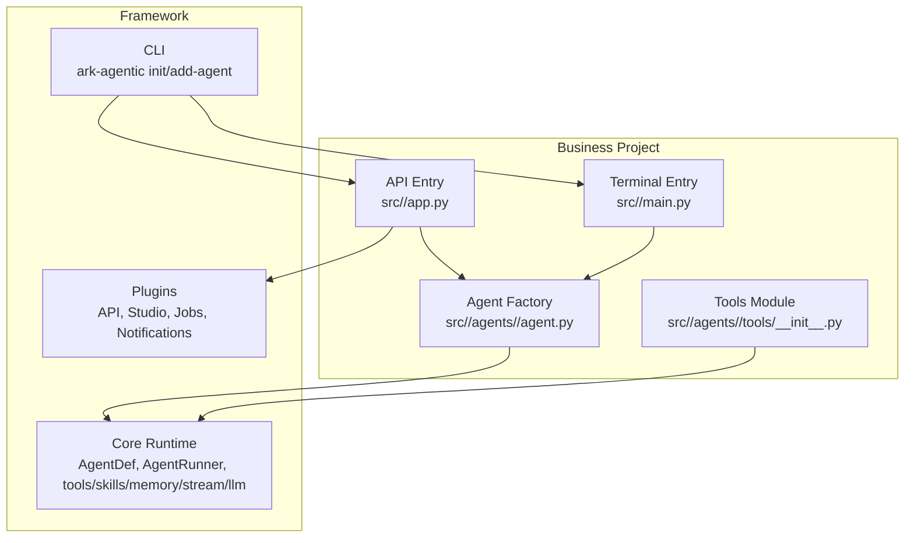
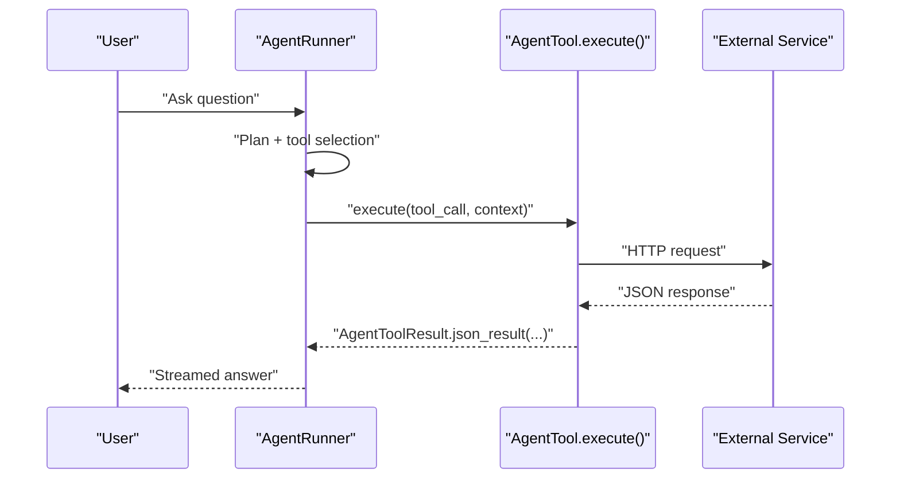
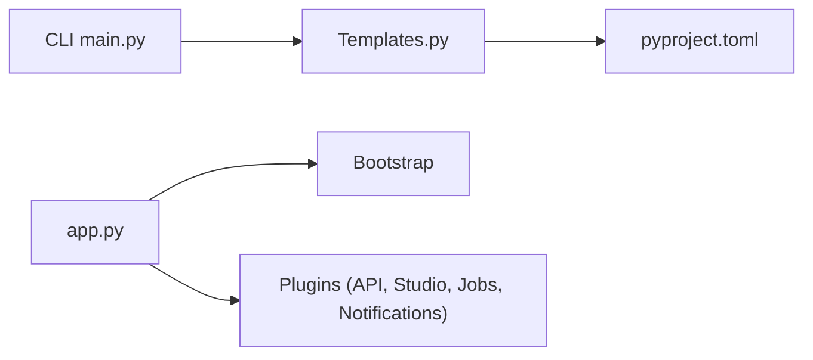

# Getting Started

<cite>
**Referenced Files in This Document**
- [README.md](file://README.md)
- [pyproject.toml](file://pyproject.toml)
- [src/ark_agentic/cli/main.py](file://src/ark_agentic/cli/main.py)
- [src/ark_agentic/cli/templates.py](file://src/ark_agentic/cli/templates.py)
- [src/ark_agentic/app.py](file://src/ark_agentic/app.py)
- [.env-sample](file://.env-sample)
- [src/ark_agentic/agents/insurance/agent.py](file://src/ark_agentic/agents/insurance/agent.py)
- [src/ark_agentic/agents/insurance/tools/customer_info.py](file://src/ark_agentic/agents/insurance/tools/customer_info.py)
- [src/ark_agentic/agents/insurance/tools/policy_query.py](file://src/ark_agentic/agents/insurance/tools/policy_query.py)
- [src/ark_agentic/agents/securities/agent.py](file://src/ark_agentic/agents/securities/agent.py)
- [src/ark_agentic/agents/securities/tools/agent/account_overview.py](file://src/ark_agentic/agents/securities/tools/agent/account_overview.py)
- [src/ark_agentic/agents/securities/tools/service/base.py](file://src/ark_agentic/agents/securities/tools/service/base.py)
</cite>

## Table of Contents
1. [Introduction](#introduction)
2. [Project Structure](#project-structure)
3. [Core Components](#core-components)
4. [Architecture Overview](#architecture-overview)
5. [Detailed Component Analysis](#detailed-component-analysis)
6. [Dependency Analysis](#dependency-analysis)
7. [Performance Considerations](#performance-considerations)
8. [Troubleshooting Guide](#troubleshooting-guide)
9. [Conclusion](#conclusion)
10. [Appendices](#appendices)

## Introduction
This guide helps you start quickly with the Ark Agentic framework. It targets two main paths:
- Business application developers: build agents, tools, and skills with minimal boilerplate.
- Framework developers: maintain the core runtime, CLI, built-in plugins, and release pipeline.

You will learn how to install the CLI, initialize a project, configure environment variables, understand the generated structure, and run both terminal and API modes. Practical examples show how to define a basic agent, create tools, and test them. We also cover common setup issues and troubleshooting tips.

## Project Structure
After running the CLI scaffolding, your project follows a predictable layout. The CLI generates:
- A Python package under src/<your_package>
- An agent module under src/<your_package>/agents/<agent_name>
- Tools and skills directories inside the agent module
- Optional API entrypoint (app.py) and static assets for Studio
- Tests directory and pyproject.toml for packaging

**Diagram sources**
- [src/ark_agentic/cli/templates.py:9-33](file://src/ark_agentic/cli/templates.py#L9-L33)
- [src/ark_agentic/cli/templates.py:35-74](file://src/ark_agentic/cli/templates.py#L35-L74)
- [src/ark_agentic/cli/templates.py:181-273](file://src/ark_agentic/cli/templates.py#L181-L273)
- [src/ark_agentic/cli/templates.py:281-288](file://src/ark_agentic/cli/templates.py#L281-L288)

**Section sources**
- [README.md:82-121](file://README.md#L82-L121)
- [src/ark_agentic/cli/templates.py:9-33](file://src/ark_agentic/cli/templates.py#L9-L33)

## Core Components
- CLI: Generates project scaffolds and adds new agent modules.
- Core runtime: Provides AgentDef, AgentRunner, tools, skills, memory, streaming, and observability.
- Plugins: Optional capabilities (API, Studio, Jobs, Notifications) orchestrated by Bootstrap.
- Example agents: Insurance and Securities agents demonstrate real-world patterns.

Key entry points:
- Terminal mode: runs a local REPL loop using the default agent.
- API mode: starts a FastAPI server exposing health checks, chat, and optional Studio.

**Section sources**
- [README.md:300-344](file://README.md#L300-L344)
- [src/ark_agentic/app.py:50-77](file://src/ark_agentic/app.py#L50-L77)

## Architecture Overview
The framework separates Core (essential runtime) from Plugins (optional capabilities). The CLI scaffolds a project that wires a Bootstrap with selected plugins. Business developers primarily edit agent factories and tools; framework developers maintain core and plugin lifecycles.

**Diagram sources**
- [src/ark_agentic/cli/main.py:53-113](file://src/ark_agentic/cli/main.py#L53-L113)
- [src/ark_agentic/app.py:50-77](file://src/ark_agentic/app.py#L50-L77)
- [src/ark_agentic/agents/insurance/agent.py:47-74](file://src/ark_agentic/agents/insurance/agent.py#L47-L74)

## Detailed Component Analysis

### Installation and Setup
- Install the CLI via uv tool install or pip.
- Initialize a project with ark-agentic init <project_name>.
- For pure CLI mode, use --no-api to skip app.py generation.
- Install dependencies in editable mode and copy .env-sample to .env.
- Configure LLM and optional plugins via environment variables.

Step-by-step:
1. Install CLI:
   - uv tool install ark-agentic
   - Or pip install ark-agentic
2. Create project:
   - ark-agentic init my-agent
   - Optional: ark-agentic init my-agent --no-api
3. Enter project and install:
   - cd my-agent
   - uv pip install -e .
4. Prepare environment:
   - cp .env-sample .env
   - Fill in LLM_PROVIDER, MODEL_NAME, API_KEY, and optional API_HOST/API_PORT
5. Run:
   - Terminal mode: uv run python -m my_agent.main
   - API mode: uv run python -m my_agent.app
   - Enable Studio by setting ENABLE_STUDIO=true and rerun API mode

**Section sources**
- [README.md:33-67](file://README.md#L33-L67)
- [README.md:140-166](file://README.md#L140-L166)
- [src/ark_agentic/cli/main.py:53-113](file://src/ark_agentic/cli/main.py#L53-L113)
- [.env-sample:25-42](file://.env-sample#L25-L42)

### First Project Walkthrough
- Generated files:
  - src/<package>/main.py: terminal REPL entry
  - src/<package>/app.py: API entry (if not --no-api)
  - src/<package>/agents/default/agent.py: agent factory using AgentDef and build_standard_agent
  - src/<package>/agents/default/tools/__init__.py: tools registry
  - src/<package>/agents/default/skills/: reserved for Markdown skill files
  - src/<package>/agents/default/agent.json: agent metadata for Studio
- Typical first edits:
  - Modify agent.py to adjust agent_name, agent_description, max turns, memory flags
  - Implement create_default_tools() to register business tools
  - Fill .env with model credentials
  - Test terminal mode, then optionally start API mode

**Section sources**
- [README.md:122-140](file://README.md#L122-L140)
- [src/ark_agentic/cli/templates.py:76-129](file://src/ark_agentic/cli/templates.py#L76-L129)
- [src/ark_agentic/cli/templates.py:141-159](file://src/ark_agentic/cli/templates.py#L141-L159)
- [src/ark_agentic/cli/templates.py:281-288](file://src/ark_agentic/cli/templates.py#L281-L288)

### Creating a Basic Agent
- Define AgentDef with agent_id, agent_name, agent_description, and optional system_protocol/custom_instructions.
- Implement create_<agent>_agent() returning build_standard_agent(_DEF, skills_dir, tools, ...).
- Optionally enable memory, dreams, and callbacks for advanced behavior.

Example references:
- Insurance agent factory pattern and system protocol
- Securities agent factory with callback hooks and validation

**Section sources**
- [src/ark_agentic/agents/insurance/agent.py:38-74](file://src/ark_agentic/agents/insurance/agent.py#L38-L74)
- [src/ark_agentic/agents/securities/agent.py:41-99](file://src/ark_agentic/agents/securities/agent.py#L41-L99)

### Creating Tools
- Tools are AgentTool subclasses with name, description, thinking_hint, parameters, and execute().
- Use ToolParameter to declare inputs and read parameters safely.
- Return AgentToolResult with JSON payload and optional metadata (e.g., state_delta).
- Register tools in create_<agent>_tools() and return the list from the agent factory.

Examples:
- CustomerInfoTool: queries customer info with typed parameters and error handling
- PolicyQueryTool: queries policies with required fields and metadata propagation
- AccountOverviewTool: demonstrates context-aware parameter extraction and service adapter integration

**Section sources**
- [src/ark_agentic/agents/insurance/tools/customer_info.py:26-94](file://src/ark_agentic/agents/insurance/tools/customer_info.py#L26-L94)
- [src/ark_agentic/agents/insurance/tools/policy_query.py:25-77](file://src/ark_agentic/agents/insurance/tools/policy_query.py#L25-L77)
- [src/ark_agentic/agents/securities/tools/agent/account_overview.py:57-108](file://src/ark_agentic/agents/securities/tools/agent/account_overview.py#L57-L108)

### Tool Execution Flow

**Diagram sources**
- [src/ark_agentic/agents/insurance/tools/customer_info.py:69-94](file://src/ark_agentic/agents/insurance/tools/customer_info.py#L69-L94)
- [src/ark_agentic/agents/securities/tools/agent/account_overview.py:72-108](file://src/ark_agentic/agents/securities/tools/agent/account_overview.py#L72-L108)
- [src/ark_agentic/agents/securities/tools/service/base.py:55-104](file://src/ark_agentic/agents/securities/tools/service/base.py#L55-L104)

### Running Terminal Mode
- Terminal entry runs a REPL loop, creates a session, and streams agent responses.
- Useful for quick iteration and validation before enabling API mode.

**Section sources**
- [src/ark_agentic/cli/templates.py:51-74](file://src/ark_agentic/cli/templates.py#L51-L74)

### Running API Mode
- API entry starts a FastAPI app with Bootstrap managing plugins.
- Routes include health checks and chat endpoints; optional Studio UI served statically.
- Configure host/port via environment variables.

**Section sources**
- [src/ark_agentic/app.py:71-94](file://src/ark_agentic/app.py#L71-L94)
- [.env-sample:7-8](file://.env-sample#L7-L8)

### Adding a New Agent Module
- Use ark-agentic add-agent <agent_name> to scaffold a new agent under src/<package>/agents/<agent_name>.
- Implement create_<agent>_agent() and register it in the project’s app.py agent registry.

**Section sources**
- [src/ark_agentic/cli/main.py:117-168](file://src/ark_agentic/cli/main.py#L117-L168)
- [src/ark_agentic/cli/templates.py:228-233](file://src/ark_agentic/cli/templates.py#L228-L233)

## Dependency Analysis
- CLI depends on templates to render project scaffolds.
- Project pyproject.toml pins ark-agentic[server] as a dependency for API mode.
- API entry imports plugins and Bootstrap to orchestrate lifecycle.

**Diagram sources**
- [src/ark_agentic/cli/main.py:19-29](file://src/ark_agentic/cli/main.py#L19-L29)
- [src/ark_agentic/cli/templates.py:9-33](file://src/ark_agentic/cli/templates.py#L9-L33)
- [pyproject.toml:19-31](file://pyproject.toml#L19-L31)
- [src/ark_agentic/app.py:35-42](file://src/ark_agentic/app.py#L35-L42)

**Section sources**
- [pyproject.toml:19-31](file://pyproject.toml#L19-L31)
- [src/ark_agentic/app.py:35-56](file://src/ark_agentic/app.py#L35-L56)

## Performance Considerations
- Keep prompts concise and scoped to reduce token usage.
- Use memory judiciously; enable long-term memory only when needed.
- Stream responses to improve perceived latency.
- Prefer batch-compatible tools and avoid unnecessary retries.

[No sources needed since this section provides general guidance]

## Troubleshooting Guide
Common issues and resolutions:
- CLI not found
  - Ensure uv tool install or pip install succeeded and your shell PATH includes the tool directory.
- Project init fails with existing directory
  - Choose a different project_name or remove the conflicting directory.
- Missing dependencies after install
  - Run uv pip install -e . again; ensure you are in the project root.
- API does not start
  - Verify .env has LLM_PROVIDER, MODEL_NAME, and API_KEY configured.
  - Check API_HOST and API_PORT; ensure port is free.
- No response from /chat
  - Confirm the agent is registered in app.py and Bootstrap is initialized.
- Tools fail with HTTP errors
  - Review service URLs and authentication in .env; check BaseServiceAdapter logs for HTTP status and payloads.
- Studio not loading
  - Set ENABLE_STUDIO=true and rebuild or refresh the frontend assets if applicable.

Environment variables to verify:
- LLM configuration: LLM_PROVIDER, MODEL_NAME, API_KEY, LLM_BASE_URL
- API: API_HOST, API_PORT
- Plugins: ENABLE_STUDIO, ENABLE_NOTIFICATIONS, ENABLE_JOB_MANAGER
- Observability: TRACING, provider-specific endpoints

**Section sources**
- [src/ark_agentic/cli/main.py:59-61](file://src/ark_agentic/cli/main.py#L59-L61)
- [.env-sample:25-97](file://.env-sample#L25-L97)
- [src/ark_agentic/agents/securities/tools/service/base.py:79-101](file://src/ark_agentic/agents/securities/tools/service/base.py#L79-L101)

## Conclusion
You now have the essentials to start building agents with Ark Agentic. Begin by installing the CLI, scaffolding a project, configuring environment variables, and iterating on your agent and tools. Once comfortable, explore API mode, Studio, and advanced features like memory and observability. Refer back to this guide when encountering setup issues or when expanding into multi-agent workflows.

[No sources needed since this section summarizes without analyzing specific files]

## Appendices

### Environment Variables Reference
- LLM: LLM_PROVIDER, MODEL_NAME, API_KEY, LLM_BASE_URL
- API: API_HOST, API_PORT
- Plugins: ENABLE_STUDIO, ENABLE_NOTIFICATIONS, ENABLE_JOB_MANAGER
- Observability: TRACING, provider endpoints
- Sessions/Memory: SESSIONS_DIR, MEMORY_DIR
- Insurance/Securities services: DATA_SERVICE_* and SECURITIES_* variables

**Section sources**
- [.env-sample:25-97](file://.env-sample#L25-L97)