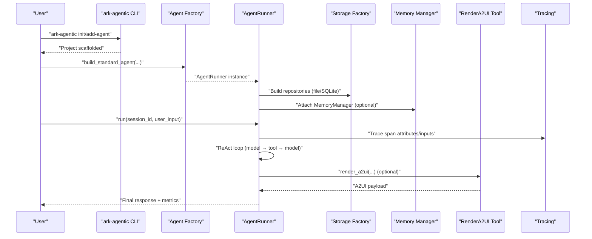
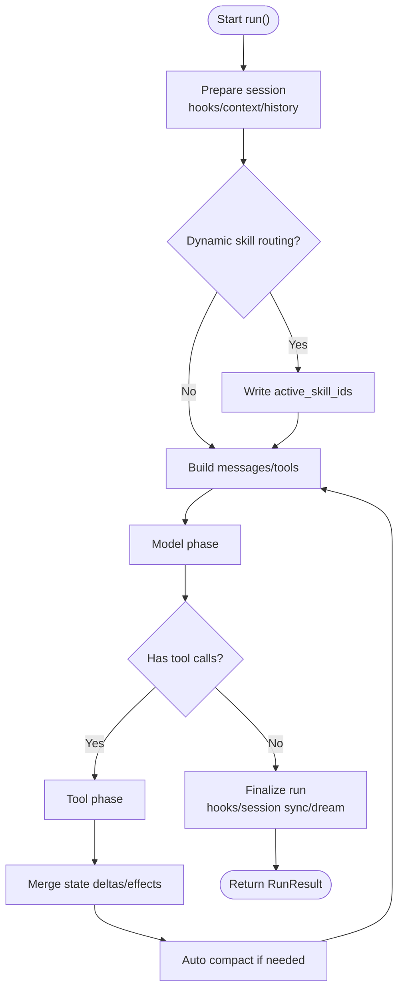
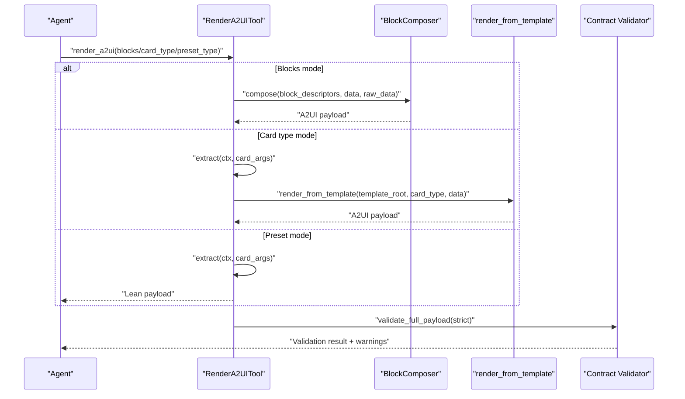
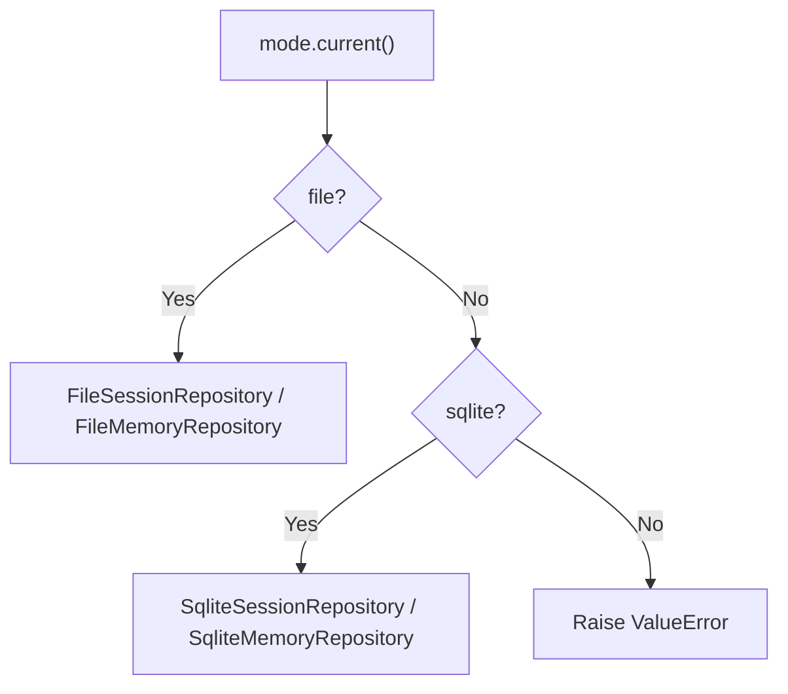
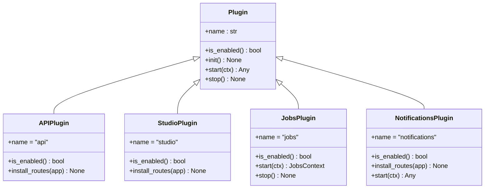
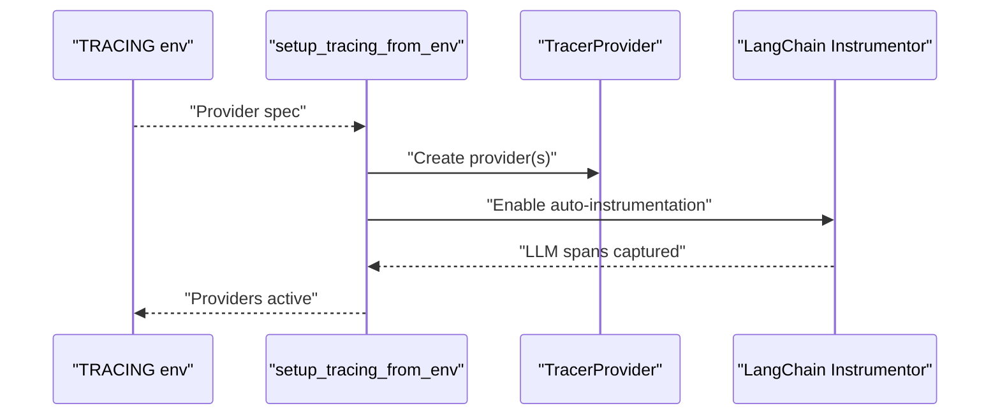
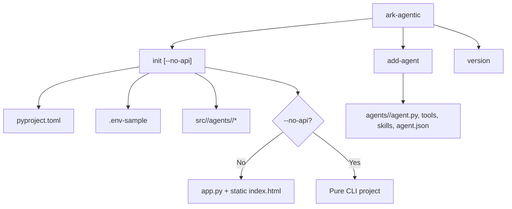
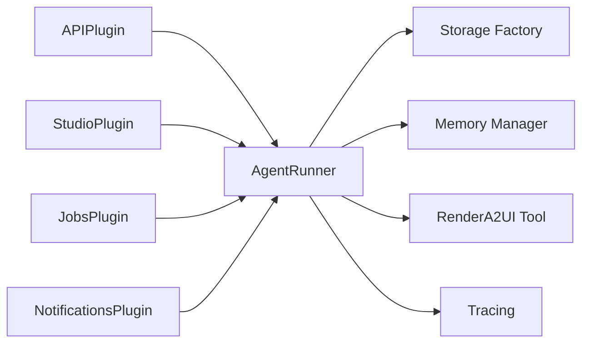

# Key Features

<cite>
**Referenced Files in This Document**
- [plugin.py](file://src/ark_agentic/core/protocol/plugin.py)
- [factory.py](file://src/ark_agentic/core/runtime/factory.py)
- [runner.py](file://src/ark_agentic/core/runtime/runner.py)
- [callbacks.py](file://src/ark_agentic/core/runtime/callbacks.py)
- [factory.py](file://src/ark_agentic/core/storage/factory.py)
- [manager.py](file://src/ark_agentic/core/memory/manager.py)
- [composer.py](file://src/ark_agentic/core/a2ui/composer.py)
- [renderer.py](file://src/ark_agentic/core/a2ui/renderer.py)
- [render_a2ui.py](file://src/ark_agentic/core/tools/render_a2ui.py)
- [tracing.py](file://src/ark_agentic/core/observability/tracing.py)
- [main.py](file://src/ark_agentic/cli/main.py)
- [plugin.py](file://src/ark_agentic/plugins/api/plugin.py)
- [plugin.py](file://src/ark_agentic/plugins/studio/plugin.py)
- [plugin.py](file://src/ark_agentic/plugins/jobs/plugin.py)
- [plugin.py](file://src/ark_agentic/plugins/notifications/plugin.py)
</cite>

## Table of Contents
1. [Introduction](#introduction)
2. [Project Structure](#project-structure)
3. [Core Components](#core-components)
4. [Architecture Overview](#architecture-overview)
5. [Detailed Component Analysis](#detailed-component-analysis)
6. [Dependency Analysis](#dependency-analysis)
7. [Performance Considerations](#performance-considerations)
8. [Troubleshooting Guide](#troubleshooting-guide)
9. [Conclusion](#conclusion)
10. [Appendices](#appendices)

## Introduction
This document highlights the Ark Agentic framework’s key features that together form a complete AI agent development platform. It focuses on:
- The ReAct decision loop as the foundation for intelligent agent behavior, integrating reasoning, tool use, and memory.
- The A2UI system for generating rich, interactive user interfaces from agent responses.
- A flexible storage abstraction supporting both file-based and SQLite persistence modes.
- A plugin-based architecture enabling modular feature addition (API services, Studio management interface, job scheduling, notifications).
- Observability and monitoring with multiple tracing provider support.
- CLI tooling for rapid project scaffolding and agent development.

## Project Structure
Ark Agentic organizes functionality into cohesive subsystems:
- Runtime: Agent execution, ReAct loop, callbacks, and orchestration.
- Core: Storage abstraction, memory management, A2UI rendering, observability, and tools.
- Plugins: Optional, user-selectable features (API, Studio, Jobs, Notifications).
- CLI: Rapid project scaffolding and agent development utilities.

```mermaid
graph TB
subgraph "Core Runtime"
R["AgentRunner<br/>ReAct loop"]
F["Agent Factory<br/>build_standard_agent"]
C["Callbacks"]
end
subgraph "Core Systems"
S["Storage Factory<br/>Session/Memory Repos"]
M["Memory Manager"]
A2["A2UI Renderer<br/>Composer/Renderer"]
O["Observability<br/>Tracing"]
end
subgraph "Plugins"
PAPI["API Plugin"]
PSTU["Studio Plugin"]
PJ["Jobs Plugin"]
PN["Notifications Plugin"]
end
subgraph "CLI"
CLI["ark-agentic CLI"]
end
R --> S
R --> M
R --> A2
R --> O
R --> C
F --> R
PAPI --> R
PSTU --> R
PJ --> R
PN --> R
CLI --> F
```

**Diagram sources**
- [runner.py:171-380](file://src/ark_agentic/core/runtime/runner.py#L171-L380)
- [factory.py:59-182](file://src/ark_agentic/core/runtime/factory.py#L59-L182)
- [factory.py:30-67](file://src/ark_agentic/core/storage/factory.py#L30-L67)
- [manager.py:52-182](file://src/ark_agentic/core/memory/manager.py#L52-L182)
- [composer.py:57-122](file://src/ark_agentic/core/a2ui/composer.py#L57-L122)
- [renderer.py:15-52](file://src/ark_agentic/core/a2ui/renderer.py#L15-L52)
- [tracing.py:56-99](file://src/ark_agentic/core/observability/tracing.py#L56-L99)
- [plugin.py:27-87](file://src/ark_agentic/plugins/api/plugin.py#L27-L87)
- [plugin.py:16-31](file://src/ark_agentic/plugins/studio/plugin.py#L16-L31)
- [plugin.py:34-98](file://src/ark_agentic/plugins/jobs/plugin.py#L34-L98)
- [plugin.py:12-40](file://src/ark_agentic/plugins/notifications/plugin.py#L12-L40)
- [main.py:178-222](file://src/ark_agentic/cli/main.py#L178-L222)

**Section sources**
- [runner.py:171-380](file://src/ark_agentic/core/runtime/runner.py#L171-L380)
- [factory.py:59-182](file://src/ark_agentic/core/runtime/factory.py#L59-L182)
- [factory.py:30-67](file://src/ark_agentic/core/storage/factory.py#L30-L67)
- [manager.py:52-182](file://src/ark_agentic/core/memory/manager.py#L52-L182)
- [composer.py:57-122](file://src/ark_agentic/core/a2ui/composer.py#L57-L122)
- [renderer.py:15-52](file://src/ark_agentic/core/a2ui/renderer.py#L15-L52)
- [tracing.py:56-99](file://src/ark_agentic/core/observability/tracing.py#L56-L99)
- [plugin.py:27-87](file://src/ark_agentic/plugins/api/plugin.py#L27-L87)
- [plugin.py:16-31](file://src/ark_agentic/plugins/studio/plugin.py#L16-L31)
- [plugin.py:34-98](file://src/ark_agentic/plugins/jobs/plugin.py#L34-L98)
- [plugin.py:12-40](file://src/ark_agentic/plugins/notifications/plugin.py#L12-L40)
- [main.py:178-222](file://src/ark_agentic/cli/main.py#L178-L222)

## Core Components
- ReAct decision loop: Orchestrated by AgentRunner, iterating between model reasoning and tool use until termination criteria are met. It supports streaming, callbacks, and memory integration.
- A2UI rendering: Unified tool and renderer supporting dynamic blocks, template-based cards, and presets, producing standardized UI payloads.
- Storage abstraction: Mode-driven factory selecting file or SQLite backends for sessions and memory, decoupling business logic from persistence.
- Memory management: Active-user cache, optional dreaming consolidation, and seamless backend switching.
- Observability: Environment-driven multi-provider tracing with automatic LangChain instrumentation.
- Plugin architecture: Lifecycle-enabled, user-selectable features that mount routes, initialize schemas, and coordinate runtime services.
- CLI scaffolding: One-command project initialization and agent addition with optional API and Studio wiring.

**Section sources**
- [runner.py:171-380](file://src/ark_agentic/core/runtime/runner.py#L171-L380)
- [render_a2ui.py:178-362](file://src/ark_agentic/core/tools/render_a2ui.py#L178-L362)
- [composer.py:57-122](file://src/ark_agentic/core/a2ui/composer.py#L57-L122)
- [renderer.py:15-52](file://src/ark_agentic/core/a2ui/renderer.py#L15-L52)
- [factory.py:30-67](file://src/ark_agentic/core/storage/factory.py#L30-L67)
- [manager.py:52-182](file://src/ark_agentic/core/memory/manager.py#L52-L182)
- [tracing.py:56-99](file://src/ark_agentic/core/observability/tracing.py#L56-L99)
- [plugin.py:20-34](file://src/ark_agentic/core/protocol/plugin.py#L20-L34)
- [main.py:178-222](file://src/ark_agentic/cli/main.py#L178-L222)

## Architecture Overview
The framework composes runtime, storage, memory, UI, and observability into a cohesive agent platform. Plugins optionally extend functionality around the core runtime.



**Diagram sources**
- [main.py:53-113](file://src/ark_agentic/cli/main.py#L53-L113)
- [factory.py:59-182](file://src/ark_agentic/core/runtime/factory.py#L59-L182)
- [runner.py:290-380](file://src/ark_agentic/core/runtime/runner.py#L290-L380)
- [factory.py:30-67](file://src/ark_agentic/core/storage/factory.py#L30-L67)
- [manager.py:145-182](file://src/ark_agentic/core/memory/manager.py#L145-L182)
- [render_a2ui.py:328-362](file://src/ark_agentic/core/tools/render_a2ui.py#L328-L362)
- [tracing.py:56-99](file://src/ark_agentic/core/observability/tracing.py#L56-L99)

## Detailed Component Analysis

### ReAct Decision Loop
The ReAct loop is the core execution engine:
- Lifecycle phases: prepare session, optional skill routing, run loop, finalize.
- Loop mechanics: build messages/tools, call model, conditionally execute tools, accumulate metrics.
- Integration points: callbacks, memory consolidation, observability spans, and session effects/state deltas.



**Diagram sources**
- [runner.py:417-546](file://src/ark_agentic/core/runtime/runner.py#L417-L546)
- [runner.py:684-722](file://src/ark_agentic/core/runtime/runner.py#L684-L722)
- [runner.py:726-800](file://src/ark_agentic/core/runtime/runner.py#L726-L800)

Practical examples:
- Reasoning and tool use: An agent reasons, identifies a tool call, executes it, and continues until completion.
- Memory integration: At the end of a turn, memory consolidation may be triggered based on configuration.
- Streaming and metrics: Observability spans capture turns, tool counts, and output content.

Common use cases:
- Conversational agents with external tool access.
- Multi-step planning with intermediate UI updates.
- Controlled exploration with turn limits and timeouts.

**Section sources**
- [runner.py:171-380](file://src/ark_agentic/core/runtime/runner.py#L171-L380)
- [runner.py:684-722](file://src/ark_agentic/core/runtime/runner.py#L684-L722)
- [callbacks.py:98-122](file://src/ark_agentic/core/runtime/callbacks.py#L98-L122)
- [tracing.py:56-99](file://src/ark_agentic/core/observability/tracing.py#L56-L99)

### A2UI System: Dynamic UI Generation
A2UI provides a unified rendering path supporting three modes:
- Blocks: Dynamic composition of block descriptors into a full A2UI event payload.
- Card type: Template-based rendering using card_type and extractors.
- Preset type: Lean, frontend-ready payloads via preset registry.



**Diagram sources**
- [render_a2ui.py:178-362](file://src/ark_agentic/core/tools/render_a2ui.py#L178-L362)
- [composer.py:57-122](file://src/ark_agentic/core/a2ui/composer.py#L57-L122)
- [renderer.py:15-52](file://src/ark_agentic/core/a2ui/renderer.py#L15-L52)

Practical examples:
- Dynamic UI cards: Compose blocks into a Column-based layout with inline transforms.
- Template-driven UI: Load a card_type template and inject structured data.
- Preset UI: Return lean payloads for immediate frontend consumption.

Common use cases:
- Interactive dashboards and summaries.
- Step-by-step guided workflows.
- Rich modal-like overlays from agent insights.

**Section sources**
- [render_a2ui.py:178-362](file://src/ark_agentic/core/tools/render_a2ui.py#L178-L362)
- [composer.py:57-122](file://src/ark_agentic/core/a2ui/composer.py#L57-L122)
- [renderer.py:15-52](file://src/ark_agentic/core/a2ui/renderer.py#L15-L52)

### Flexible Storage Abstraction
The storage factory selects the active backend based on mode:
- File mode: Uses filesystem paths for sessions and memory.
- SQLite mode: Uses an encapsulated engine for sessions and memory.



**Diagram sources**
- [factory.py:30-67](file://src/ark_agentic/core/storage/factory.py#L30-L67)

Practical examples:
- Switching persistence: Set DB_TYPE=file or DB_TYPE=sqlite to change backends without changing business code.
- Workspace labeling: Memory manager preserves a workspace_dir label even under SQLite.

Common use cases:
- Local development (file) vs. production (SQLite).
- Migration scenarios between backends.

**Section sources**
- [factory.py:30-67](file://src/ark_agentic/core/storage/factory.py#L30-L67)
- [manager.py:145-182](file://src/ark_agentic/core/memory/manager.py#L145-L182)

### Plugin-Based Architecture
Plugins are lifecycle-enabled, user-selectable features:
- APIPlugin: Mounts chat routes, CORS, health check, and a demo page.
- StudioPlugin: Initializes Studio schema and mounts Studio routes.
- JobsPlugin: Proactive job manager requiring NotificationsPlugin; registers per-agent bindings.
- NotificationsPlugin: REST + SSE notifications with schema initialization.



**Diagram sources**
- [plugin.py:20-34](file://src/ark_agentic/core/protocol/plugin.py#L20-L34)
- [plugin.py:27-87](file://src/ark_agentic/plugins/api/plugin.py#L27-L87)
- [plugin.py:16-31](file://src/ark_agentic/plugins/studio/plugin.py#L16-L31)
- [plugin.py:34-98](file://src/ark_agentic/plugins/jobs/plugin.py#L34-L98)
- [plugin.py:12-40](file://src/ark_agentic/plugins/notifications/plugin.py#L12-L40)

Practical examples:
- Enabling Studio: Set ENABLE_STUDIO=true to mount the admin console.
- Enabling Jobs: Set ENABLE_JOB_MANAGER=true; ensure NotificationsPlugin is registered before JobsPlugin.
- Headless deployments: Disable APIPlugin via ENABLE_API=false to avoid FastAPI plumbing.

Common use cases:
- Rapid prototyping with Studio UI.
- Automated proactive workflows with Jobs.
- Real-time notifications via SSE.

**Section sources**
- [plugin.py:27-87](file://src/ark_agentic/plugins/api/plugin.py#L27-L87)
- [plugin.py:16-31](file://src/ark_agentic/plugins/studio/plugin.py#L16-L31)
- [plugin.py:34-98](file://src/ark_agentic/plugins/jobs/plugin.py#L34-L98)
- [plugin.py:12-40](file://src/ark_agentic/plugins/notifications/plugin.py#L12-L40)

### Observability and Monitoring
Tracing is environment-driven and provider-agnostic:
- Providers: Console, Phoenix, Langfuse, OTLP, auto-detect.
- Automatic LangChain instrumentation for LLM spans.
- Idempotent setup and graceful shutdown.



**Diagram sources**
- [tracing.py:56-99](file://src/ark_agentic/core/observability/tracing.py#L56-L99)

Practical examples:
- Local dev: TRACING=console for stdout spans.
- Cloud-native: TRACING=phoenix/langfuse for hosted collectors.
- Dual export: TRACING=phoenix,langfuse for redundancy.

Common use cases:
- Debugging agent behavior and tool execution.
- Measuring latency, token usage, and throughput.
- Cross-service trace correlation.

**Section sources**
- [tracing.py:56-99](file://src/ark_agentic/core/observability/tracing.py#L56-L99)

### CLI Tooling
The CLI accelerates project creation and agent development:
- init: Scaffold a new project with optional API and Studio.
- add-agent: Add a new agent module to an existing project.
- version: Print framework version.



**Diagram sources**
- [main.py:53-113](file://src/ark_agentic/cli/main.py#L53-L113)
- [main.py:117-168](file://src/ark_agentic/cli/main.py#L117-L168)
- [main.py:172-173](file://src/ark_agentic/cli/main.py#L172-L173)

Practical examples:
- Initialize a full-stack project: ark-agentic init my-project
- Add a domain-specific agent: ark-agentic add-agent insurance
- Run headless: uv pip install -e . && python -m my_project.main

Common use cases:
- Onboarding new developers quickly.
- Bootstrapping domain agents with consistent structure.
- Iterating prototypes with minimal boilerplate.

**Section sources**
- [main.py:178-222](file://src/ark_agentic/cli/main.py#L178-L222)

## Dependency Analysis
The framework exhibits low coupling and high cohesion:
- Runtime depends on storage, memory, A2UI, and observability via composition.
- Plugins integrate through a shared lifecycle and environment flags.
- Storage factory enforces backend selection without leaking implementation details.



**Diagram sources**
- [runner.py:171-380](file://src/ark_agentic/core/runtime/runner.py#L171-L380)
- [factory.py:30-67](file://src/ark_agentic/core/storage/factory.py#L30-L67)
- [manager.py:145-182](file://src/ark_agentic/core/memory/manager.py#L145-L182)
- [render_a2ui.py:178-362](file://src/ark_agentic/core/tools/render_a2ui.py#L178-L362)
- [tracing.py:56-99](file://src/ark_agentic/core/observability/tracing.py#L56-L99)
- [plugin.py:27-87](file://src/ark_agentic/plugins/api/plugin.py#L27-L87)
- [plugin.py:16-31](file://src/ark_agentic/plugins/studio/plugin.py#L16-L31)
- [plugin.py:34-98](file://src/ark_agentic/plugins/jobs/plugin.py#L34-L98)
- [plugin.py:12-40](file://src/ark_agentic/plugins/notifications/plugin.py#L12-L40)

**Section sources**
- [runner.py:171-380](file://src/ark_agentic/core/runtime/runner.py#L171-L380)
- [factory.py:30-67](file://src/ark_agentic/core/storage/factory.py#L30-L67)
- [manager.py:145-182](file://src/ark_agentic/core/memory/manager.py#L145-L182)
- [render_a2ui.py:178-362](file://src/ark_agentic/core/tools/render_a2ui.py#L178-L362)
- [tracing.py:56-99](file://src/ark_agentic/core/observability/tracing.py#L56-L99)
- [plugin.py:27-87](file://src/ark_agentic/plugins/api/plugin.py#L27-L87)
- [plugin.py:16-31](file://src/ark_agentic/plugins/studio/plugin.py#L16-L31)
- [plugin.py:34-98](file://src/ark_agentic/plugins/jobs/plugin.py#L34-L98)
- [plugin.py:12-40](file://src/ark_agentic/plugins/notifications/plugin.py#L12-L40)

## Performance Considerations
- ReAct loop tuning: Adjust max_turns, max_tool_calls_per_turn, and tool_timeout to balance responsiveness and safety.
- Memory caching: MemoryManager maintains an in-memory mirror of active users to reduce I/O.
- Auto-compaction: Session auto-compaction reduces context size and improves model performance.
- Observability overhead: Tracing is zero-cost when disabled; enable selectively for targeted debugging.
- Backend choice: SQLite offers structured queries and migrations; file mode suits lightweight local setups.

[No sources needed since this section provides general guidance]

## Troubleshooting Guide
- Tracing not working:
  - Ensure TRACING is set appropriately and credentials are available for selected providers.
  - Verify LangChain instrumentation is enabled when any provider is active.
- JobsPlugin startup failures:
  - Confirm NotificationsPlugin is registered before JobsPlugin.
  - Install server extras if APScheduler is missing.
- Storage mode mismatches:
  - For file mode, ensure sessions_dir/workspace_dir are provided; for SQLite, rely on DB_TYPE and engine encapsulation.
- A2UI validation errors:
  - Enable strict validation or review warnings to fix contract violations.

**Section sources**
- [tracing.py:56-99](file://src/ark_agentic/core/observability/tracing.py#L56-L99)
- [plugin.py:52-65](file://src/ark_agentic/plugins/jobs/plugin.py#L52-L65)
- [factory.py:21-27](file://src/ark_agentic/core/storage/factory.py#L21-L27)
- [render_a2ui.py:635-662](file://src/ark_agentic/core/tools/render_a2ui.py#L635-L662)

## Conclusion
Ark Agentic delivers a cohesive platform for building intelligent agents:
- The ReAct loop integrates reasoning, tool use, memory, and observability.
- A2UI enables rich, interactive UIs from agent responses.
- Flexible storage supports both file and SQLite backends.
- Plugins modularly extend the platform with API, Studio, Jobs, and Notifications.
- CLI accelerates scaffolding and iteration.

Together, these features provide a complete toolkit for designing, developing, and operating production-grade AI agents.

[No sources needed since this section summarizes without analyzing specific files]

## Appendices
- Practical example catalog:
  - ReAct loop: Multi-step financial planning with tool calls and UI updates.
  - A2UI: Template-driven dashboard for policy summaries.
  - Storage: Seamless migration from file to SQLite.
  - Plugins: Studio-based agent management with scheduled proactive jobs.
  - Observability: End-to-end tracing across model calls and tool executions.
  - CLI: One-command project bootstrapping and agent addition.

[No sources needed since this section provides general guidance]