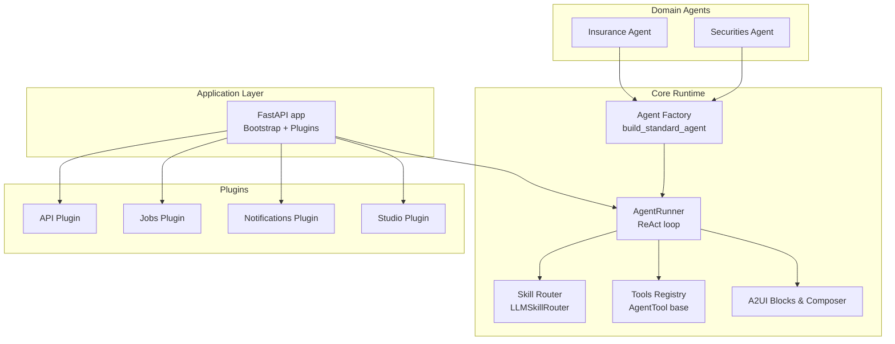
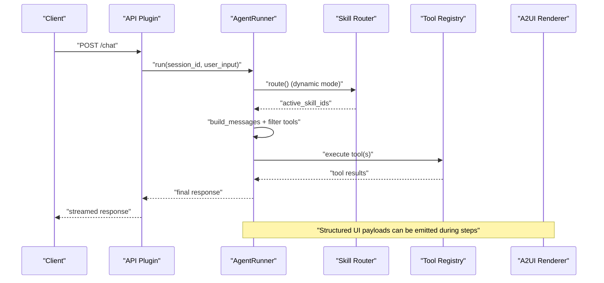
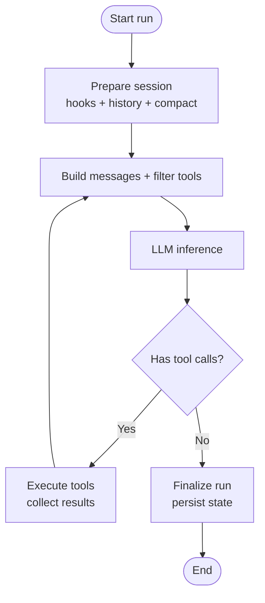
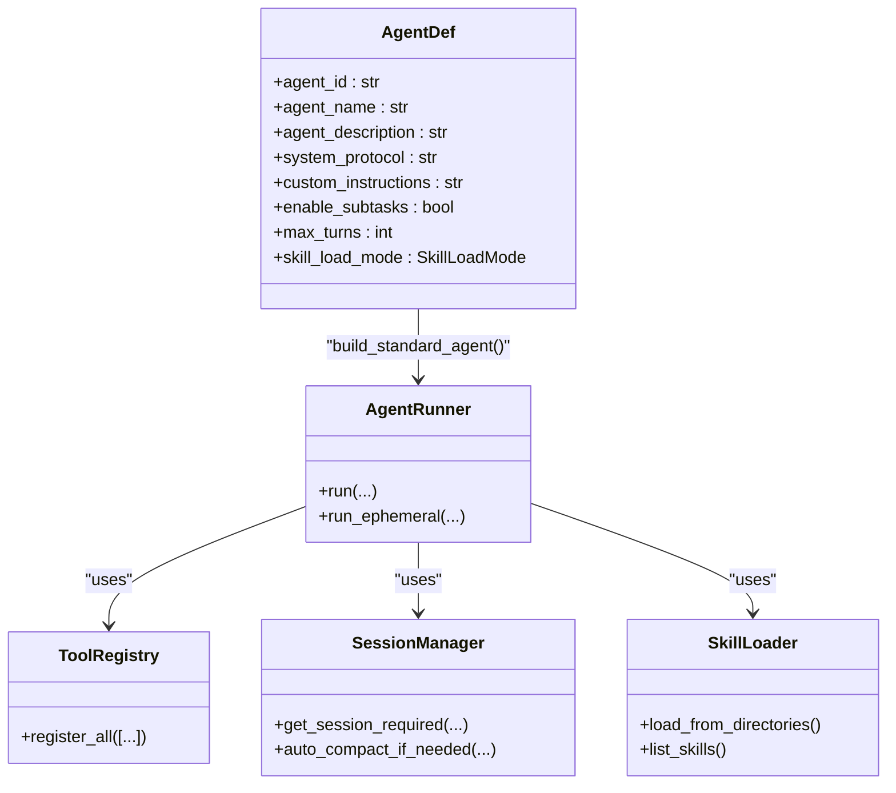
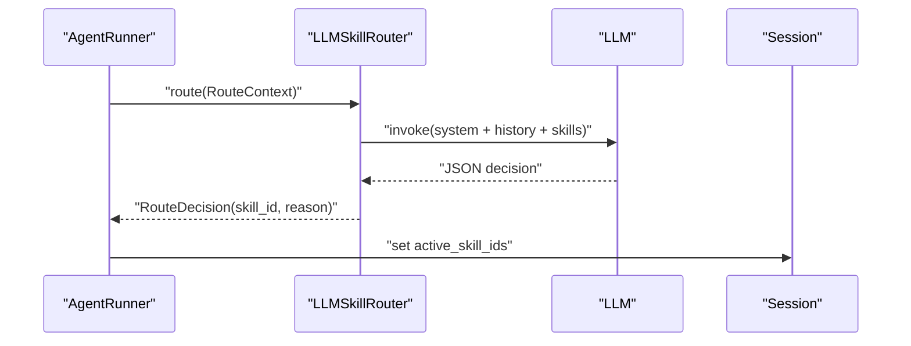
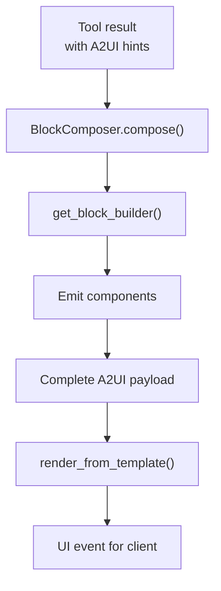
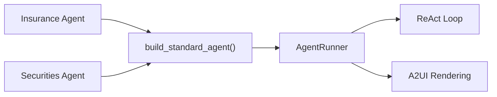
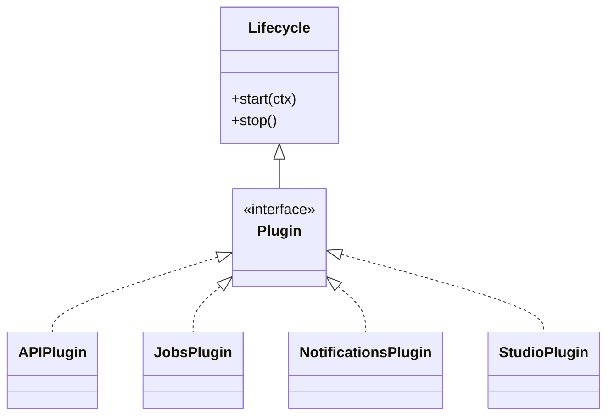
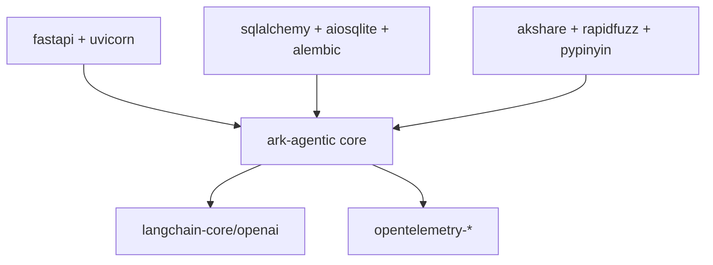

# Project Overview

<cite>
**Referenced Files in This Document**
- [app.py](file://src/ark_agentic/app.py)
- [factory.py](file://src/ark_agentic/core/runtime/factory.py)
- [runner.py](file://src/ark_agentic/core/runtime/runner.py)
- [router.py](file://src/ark_agentic/core/skills/router.py)
- [base.py](file://src/ark_agentic/core/tools/base.py)
- [blocks.py](file://src/ark_agentic/core/a2ui/blocks.py)
- [composer.py](file://src/ark_agentic/core/a2ui/composer.py)
- [renderer.py](file://src/ark_agentic/core/a2ui/renderer.py)
- [agent.py (insurance)](file://src/ark_agentic/agents/insurance/agent.py)
- [agent.py (securities)](file://src/ark_agentic/agents/securities/agent.py)
- [plugin.py](file://src/ark_agentic/core/protocol/plugin.py)
- [pyproject.toml](file://pyproject.toml)
</cite>

## Table of Contents
1. [Introduction](#introduction)
2. [Project Structure](#project-structure)
3. [Core Components](#core-components)
4. [Architecture Overview](#architecture-overview)
5. [Detailed Component Analysis](#detailed-component-analysis)
6. [Dependency Analysis](#dependency-analysis)
7. [Performance Considerations](#performance-considerations)
8. [Troubleshooting Guide](#troubleshooting-guide)
9. [Conclusion](#conclusion)

## Introduction
Ark Agentic is a lightweight ReAct agent framework designed for building business-focused AI agents. It emphasizes a streamlined runtime, a robust ReAct loop, and a plugin-based extensibility model. The framework ships with production-ready domain agents for insurance and securities, showcasing how to implement multi-domain reasoning with a unified agent runtime. It also introduces A2UI blocks and rendering to deliver rich, structured UI experiences directly from agent tool outputs.

Key positioning:
- Lightweight and pragmatic: minimal boilerplate, convention-over-configuration agent wiring.
- Business-first: built-in observability, guardrails, memory, and session management.
- Multi-domain: proven patterns for insurance and securities domains.
- Developer-friendly: clear separation of concerns, strong typing, and extensible plugin system.

## Project Structure
The repository is organized into cohesive layers:
- Core runtime and infrastructure: agent execution, sessions, memory, skills, tools, A2UI, observability, and protocol abstractions.
- Domain agents: insurance and securities agents configured via the standard agent factory.
- Plugins: optional, user-selectable features integrated via a common lifecycle.
- Application entrypoint: FastAPI bootstrap wiring lifecycle components and routes.

**Diagram sources**
- [app.py:50-56](file://src/ark_agentic/app.py#L50-L56)
- [factory.py:59-183](file://src/ark_agentic/core/runtime/factory.py#L59-L183)
- [runner.py:171-380](file://src/ark_agentic/core/runtime/runner.py#L171-L380)
- [router.py:94-216](file://src/ark_agentic/core/skills/router.py#L94-L216)
- [base.py:46-163](file://src/ark_agentic/core/tools/base.py#L46-L163)
- [blocks.py:120-149](file://src/ark_agentic/core/a2ui/blocks.py#L120-L149)
- [composer.py:57-123](file://src/ark_agentic/core/a2ui/composer.py#L57-L123)
- [agent.py (insurance):47-75](file://src/ark_agentic/agents/insurance/agent.py#L47-L75)
- [agent.py (securities):72-100](file://src/ark_agentic/agents/securities/agent.py#L72-L100)

**Section sources**
- [app.py:50-56](file://src/ark_agentic/app.py#L50-L56)
- [pyproject.toml:1-96](file://pyproject.toml#L1-L96)

## Core Components
- Agent runtime: The AgentRunner orchestrates the ReAct loop, manages sessions, tools, skills, memory, and observability. It supports deterministic skill routing in dynamic mode and full-mode loading.
- Agent factory: The build_standard_agent function wires an AgentDef, skills directory, and tools into a ready-to-run AgentRunner with sensible defaults.
- Skill routing: LLMSkillRouter selects active skills per turn based on conversation context, enabling adaptive domain behavior.
- Tools: AgentTool base defines a standardized interface for tools, including JSON schema generation and optional LangChain adapter.
- A2UI system: A2UI blocks and composers assemble UI payloads from block descriptors and templates, enabling rich, structured UI rendering from agent outputs.
- Plugin system: Plugins implement a lifecycle compatible with the core, allowing optional features to be plugged into the host application.

**Section sources**
- [runner.py:171-380](file://src/ark_agentic/core/runtime/runner.py#L171-L380)
- [factory.py:59-183](file://src/ark_agentic/core/runtime/factory.py#L59-L183)
- [router.py:94-216](file://src/ark_agentic/core/skills/router.py#L94-L216)
- [base.py:46-163](file://src/ark_agentic/core/tools/base.py#L46-L163)
- [blocks.py:120-149](file://src/ark_agentic/core/a2ui/blocks.py#L120-L149)
- [composer.py:57-123](file://src/ark_agentic/core/a2ui/composer.py#L57-L123)
- [plugin.py:20-35](file://src/ark_agentic/core/protocol/plugin.py#L20-L35)

## Architecture Overview
Ark Agentic composes a minimal application entrypoint that wires lifecycle components and routes. The agent runtime encapsulates the ReAct loop, integrates tools and skills, and emits structured UI payloads via A2UI. Plugins extend functionality without changing core runtime.

**Diagram sources**
- [app.py:50-56](file://src/ark_agentic/app.py#L50-L56)
- [runner.py:684-723](file://src/ark_agentic/core/runtime/runner.py#L684-L723)
- [router.py:111-139](file://src/ark_agentic/core/skills/router.py#L111-L139)
- [composer.py:60-123](file://src/ark_agentic/core/a2ui/composer.py#L60-L123)

## Detailed Component Analysis

### Lightweight ReAct Loop
The ReAct loop is the core decision-making cycle:
- Prepare session, apply hooks, merge history, and compact context.
- Build system prompt and filtered tools for the current turn.
- Invoke the LLM; if tool calls are generated, execute tools and continue the loop.
- Finalize run, persist session state, and optionally trigger memory consolidation.

**Diagram sources**
- [runner.py:417-547](file://src/ark_agentic/core/runtime/runner.py#L417-L547)
- [runner.py:684-723](file://src/ark_agentic/core/runtime/runner.py#L684-L723)

**Section sources**
- [runner.py:171-380](file://src/ark_agentic/core/runtime/runner.py#L171-L380)
- [runner.py:684-723](file://src/ark_agentic/core/runtime/runner.py#L684-L723)

### Standard Agent Factory
The factory provides a convention-over-configuration builder for agents:
- Resolves LLM, skill loader, session manager, memory manager, and tool registry.
- Applies defaults for prompt configuration, compaction, and sampling.
- Supports dynamic vs full skill load modes and optional subtasks.

**Diagram sources**
- [factory.py:35-183](file://src/ark_agentic/core/runtime/factory.py#L35-L183)
- [runner.py:181-254](file://src/ark_agentic/core/runtime/runner.py#L181-L254)

**Section sources**
- [factory.py:59-183](file://src/ark_agentic/core/runtime/factory.py#L59-L183)

### Dynamic Skill Routing
In dynamic mode, the skill router determines active skills per turn:
- RouteContext aggregates user input, recent history, and candidate skills.
- LLMSkillRouter renders a concise prompt, invokes the LLM, and parses a strict JSON decision.
- The selected skill ID is written to session state and influences tool availability and prompts.

**Diagram sources**
- [router.py:30-216](file://src/ark_agentic/core/skills/router.py#L30-L216)
- [runner.py:350-354](file://src/ark_agentic/core/runtime/runner.py#L350-L354)

**Section sources**
- [router.py:94-216](file://src/ark_agentic/core/skills/router.py#L94-L216)
- [runner.py:350-354](file://src/ark_agentic/core/runtime/runner.py#L350-L354)

### A2UI Blocks and Rendering
A2UI enables rich UI from agent outputs:
- Block registry: Each agent registers block builders; core provides a shared registry and helpers.
- Composer: Expands block descriptors into a complete A2UI payload with inline transform resolution.
- Renderer: Loads templates from disk and merges data to produce a UI payload.

**Diagram sources**
- [blocks.py:120-149](file://src/ark_agentic/core/a2ui/blocks.py#L120-L149)
- [composer.py:57-123](file://src/ark_agentic/core/a2ui/composer.py#L57-L123)
- [renderer.py:15-53](file://src/ark_agentic/core/a2ui/renderer.py#L15-L53)

**Section sources**
- [blocks.py:120-149](file://src/ark_agentic/core/a2ui/blocks.py#L120-L149)
- [composer.py:57-123](file://src/ark_agentic/core/a2ui/composer.py#L57-L123)
- [renderer.py:15-53](file://src/ark_agentic/core/a2ui/renderer.py#L15-L53)

### Multi-Domain Agents
Two production-grade agents demonstrate the framework’s multi-domain capabilities:
- Insurance agent: specialized protocol, subtasks enabled, and domain tools for policy and withdrawal flows.
- Securities agent: enriched context hooks, authentication gating, citation validation, and financial data tools.

**Diagram sources**
- [agent.py (insurance):47-75](file://src/ark_agentic/agents/insurance/agent.py#L47-L75)
- [agent.py (securities):72-100](file://src/ark_agentic/agents/securities/agent.py#L72-L100)
- [factory.py:59-183](file://src/ark_agentic/core/runtime/factory.py#L59-L183)

**Section sources**
- [agent.py (insurance):47-75](file://src/ark_agentic/agents/insurance/agent.py#L47-L75)
- [agent.py (securities):72-100](file://src/ark_agentic/agents/securities/agent.py#L72-L100)

### Plugin-Based Extensibility
Plugins integrate optional features into the host application:
- Plugin protocol mirrors lifecycle semantics; plugins are user-selectable.
- The application registers a list of plugins alongside mandatory lifecycle components.

**Diagram sources**
- [plugin.py:20-35](file://src/ark_agentic/core/protocol/plugin.py#L20-L35)
- [app.py:50-56](file://src/ark_agentic/app.py#L50-L56)

**Section sources**
- [plugin.py:20-35](file://src/ark_agentic/core/protocol/plugin.py#L20-L35)
- [app.py:50-56](file://src/ark_agentic/app.py#L50-L56)

## Dependency Analysis
The framework’s runtime and domain agents depend on a small set of core libraries, with optional extras for server, database, and domain-specific packages.

**Diagram sources**
- [pyproject.toml:7-38](file://pyproject.toml#L7-L38)
- [pyproject.toml:20-35](file://pyproject.toml#L20-L35)
- [pyproject.toml:91-95](file://pyproject.toml#L91-L95)

**Section sources**
- [pyproject.toml:1-96](file://pyproject.toml#L1-L96)

## Performance Considerations
- ReAct loop limits: The agent enforces a maximum number of turns and per-turn tool calls to prevent runaway loops.
- Context management: Automatic compaction and summarization reduce context size and improve throughput.
- Memory integration: Optional memory tools and dreaming can offload extraction and synthesis to background tasks.
- Streaming: The runtime supports streaming responses for better perceived latency.

[No sources needed since this section provides general guidance]

## Troubleshooting Guide
Common operational issues and mitigations:
- LLM errors: The runtime maps specific error reasons to user-friendly messages and logs actionable guidance.
- Context overflow: Automatic compaction attempts to summarize long histories; if persistent, consider reducing session length or increasing context window tuning.
- Authentication and permissions: Hooks can abort early with UI hints for login flows in domain agents.
- Tool timeouts: Per-tool timeouts and retries are configurable to handle transient failures.

**Section sources**
- [runner.py:624-643](file://src/ark_agentic/core/runtime/runner.py#L624-L643)
- [runner.py:89-92](file://src/ark_agentic/core/runtime/runner.py#L89-L92)

## Conclusion
Ark Agentic delivers a pragmatic, business-focused ReAct agent platform with a clean runtime, robust ReAct loop, and structured UI capabilities. Its plugin system and domain agents illustrate how to scale across industries while maintaining developer ergonomics. By combining deterministic skill routing, rich UI rendering, and observability, the framework offers a compelling foundation for building reliable, maintainable AI agents in production environments.