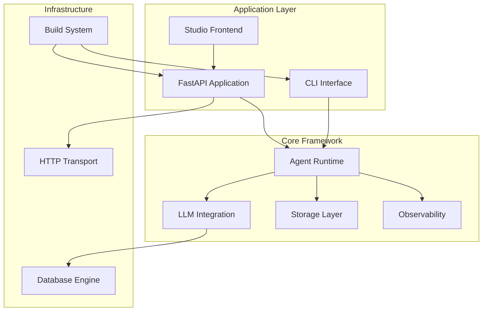
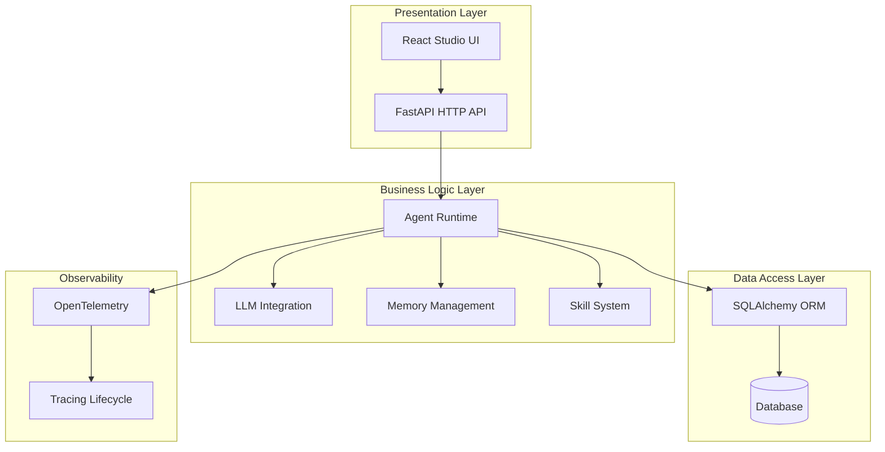
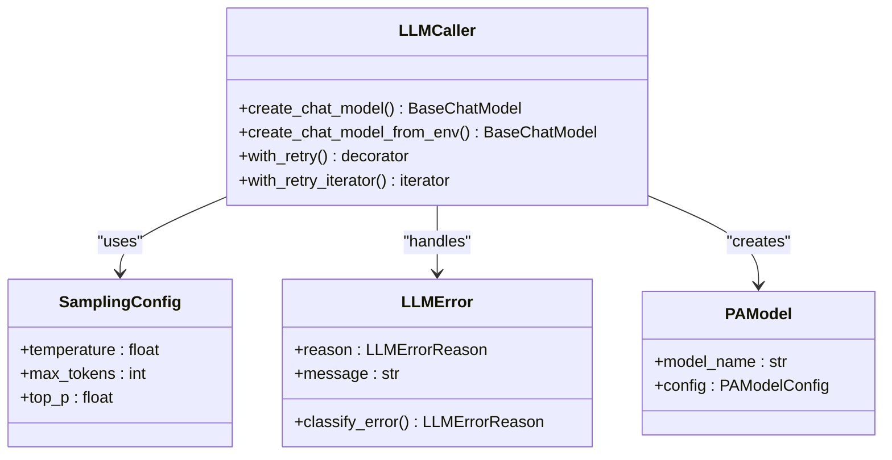
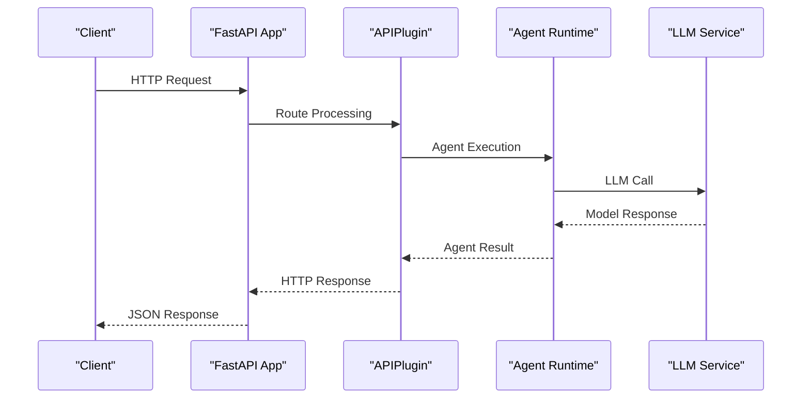
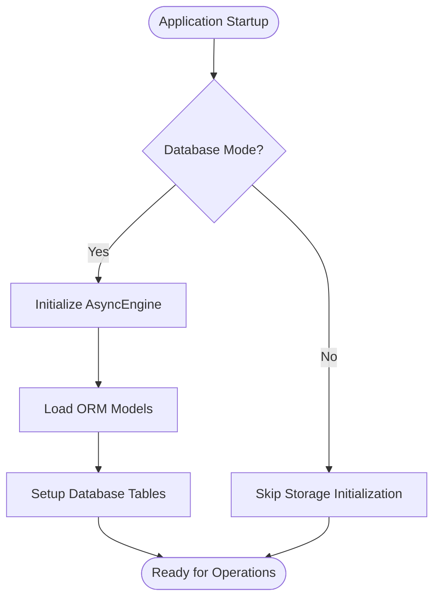
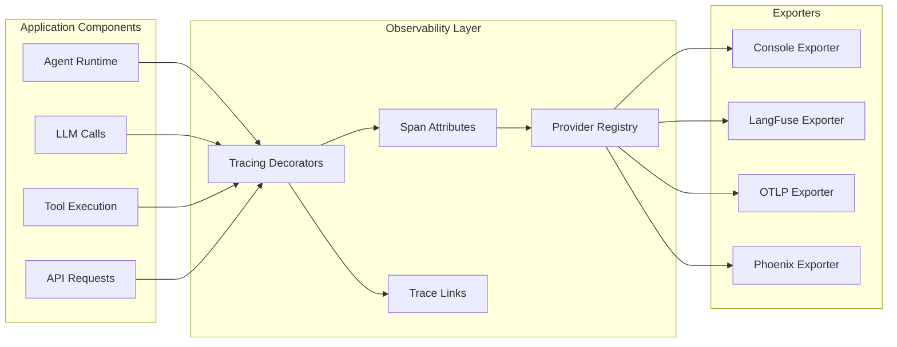
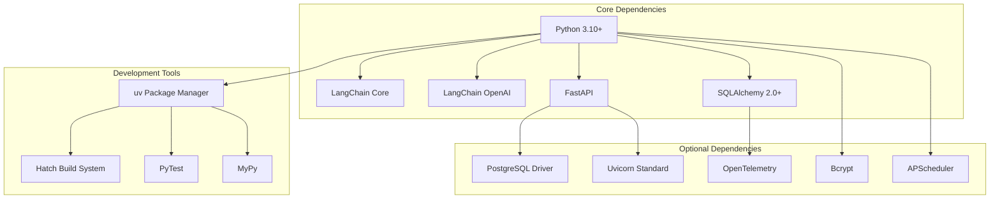

# Technology Stack

<cite>
**Referenced Files in This Document**
- [pyproject.toml](file://pyproject.toml)
- [uv.lock](file://uv.lock)
- [Dockerfile](file://Dockerfile)
- [src/ark_agentic/__init__.py](file://src/ark_agentic/__init__.py)
- [src/ark_agentic/app.py](file://src/ark_agentic/app.py)
- [src/ark_agentic/cli/main.py](file://src/ark_agentic/cli/main.py)
- [src/ark_agentic/core/llm/__init__.py](file://src/ark_agentic/core/llm/__init__.py)
- [src/ark_agentic/core/storage/database/__init__.py](file://src/ark_agentic/core/storage/database/__init__.py)
- [src/ark_agentic/core/observability/__init__.py](file://src/ark_agentic/core/observability/__init__.py)
- [src/ark_agentic/plugins/api/plugin.py](file://src/ark_agentic/plugins/api/plugin.py)
- [src/ark_agentic/plugins/studio/frontend/package.json](file://src/ark_agentic/plugins/studio/frontend/package.json)
- [src/ark_agentic/core/types.py](file://src/ark_agentic/core/types.py)
</cite>

## Table of Contents
1. [Introduction](#introduction)
2. [Project Structure](#project-structure)
3. [Core Technologies](#core-technologies)
4. [Architecture Overview](#architecture-overview)
5. [Detailed Component Analysis](#detailed-component-analysis)
6. [Dependency Analysis](#dependency-analysis)
7. [Performance Considerations](#performance-considerations)
8. [Troubleshooting Guide](#troubleshooting-guide)
9. [Conclusion](#conclusion)

## Introduction

The Ark Agentic framework is a comprehensive AI agent development platform built on modern Python technologies. This documentation provides a detailed analysis of the technology stack, focusing on the core technologies that power the system, their relationships, and the rationale behind each choice.

The framework combines several key technologies to create a cohesive development experience for building intelligent agents with LLM integration, robust HTTP APIs, flexible storage systems, and modern observability capabilities.

## Project Structure

The Ark Agentic framework follows a modular architecture with clear separation of concerns:

**Diagram sources**
- [src/ark_agentic/app.py:1-94](file://src/ark_agentic/app.py#L1-L94)
- [src/ark_agentic/cli/main.py:1-222](file://src/ark_agentic/cli/main.py#L1-L222)

**Section sources**
- [src/ark_agentic/__init__.py:1-93](file://src/ark_agentic/__init__.py#L1-L93)
- [src/ark_agentic/app.py:1-94](file://src/ark_agentic/app.py#L1-L94)

## Core Technologies

### Primary Implementation Language: Python 3.10+

Python serves as the foundation for the entire Ark Agentic framework, chosen for its maturity, extensive ecosystem, and suitability for AI/ML applications. The framework requires Python 3.10+ to leverage modern language features while maintaining broad compatibility across different platforms.

**Version Requirements:**
- Minimum Python version: 3.10
- Target Python versions: 3.10, 3.11, 3.12, 3.13, 3.14, 3.15
- Cross-platform support: Windows, Linux, macOS, and containerized environments

### LLM Integration: LangChain Ecosystem

LangChain forms the backbone of the LLM integration layer, providing:

- **LangChain Core**: Foundation for chain orchestration and LLM abstractions
- **LangChain OpenAI**: Provider-specific integration for OpenAI-compatible models
- **Unified Model Factory**: Consistent interface for creating chat models across providers
- **Error Handling**: Comprehensive error classification and retry mechanisms

The LLM layer provides sampling configuration, retry policies, and structured error handling through the `LLMCaller` and related components.

**Section sources**
- [src/ark_agentic/core/llm/__init__.py:1-39](file://src/ark_agentic/core/llm/__init__.py#L1-L39)
- [pyproject.toml:11-12](file://pyproject.toml#L11-L12)

### HTTP API Framework: FastAPI + Uvicorn

The framework employs FastAPI as the primary HTTP API framework, combined with Uvicorn for production-ready ASGI serving:

- **FastAPI**: Modern, fast (high-performance) web framework with automatic OpenAPI documentation
- **Uvicorn**: High-performance ASGI server with support for hot reloading during development
- **Standard Profile**: Optional dependency group providing enhanced performance with uvloop on Unix systems

The API layer handles chat functionality, health checks, CORS configuration, and static file serving for the Studio interface.

**Section sources**
- [src/ark_agentic/plugins/api/plugin.py:1-86](file://src/ark_agentic/plugins/api/plugin.py#L1-L86)
- [uv.lock:3579-3646](file://uv.lock#L3579-L3646)

### Database Operations: SQLAlchemy ORM

SQLAlchemy provides a comprehensive database abstraction layer supporting:

- **Async Engine**: Non-blocking database operations for improved performance
- **ORM Models**: Type-safe database models with Pydantic integration
- **Multiple Backends**: SQLite (default) and PostgreSQL support through optional dependencies
- **Alembic Migrations**: Database schema migration management

The storage layer abstracts database operations while maintaining flexibility for different deployment scenarios.

**Section sources**
- [src/ark_agentic/core/storage/database/__init__.py:1-9](file://src/ark_agentic/core/storage/database/__init__.py#L1-L9)
- [pyproject.toml:24-26](file://pyproject.toml#L24-L26)

## Architecture Overview

The Ark Agentic framework implements a layered architecture with clear separation between presentation, business logic, and data access layers:

**Diagram sources**
- [src/ark_agentic/app.py:33-42](file://src/ark_agentic/app.py#L33-L42)
- [src/ark_agentic/core/observability/__init__.py:1-34](file://src/ark_agentic/core/observability/__init__.py#L1-L34)

## Detailed Component Analysis

### LLM Integration Architecture

The LLM integration layer provides a unified interface for multiple LLM providers through LangChain:

**Diagram sources**
- [src/ark_agentic/core/llm/__init__.py:7-38](file://src/ark_agentic/core/llm/__init__.py#L7-L38)

### HTTP API Architecture

The FastAPI-based API layer provides a robust foundation for agent interactions:

**Diagram sources**
- [src/ark_agentic/plugins/api/plugin.py:42-86](file://src/ark_agentic/plugins/api/plugin.py#L42-L86)
- [src/ark_agentic/app.py:71-77](file://src/ark_agentic/app.py#L71-L77)

### Storage and Persistence Architecture

The storage layer provides flexible persistence options:

**Diagram sources**
- [src/ark_agentic/core/storage/database/__init__.py:1-9](file://src/ark_agentic/core/storage/database/__init__.py#L1-L9)

**Section sources**
- [src/ark_agentic/core/types.py:19-513](file://src/ark_agentic/core/types.py#L19-L513)

### Observability and Monitoring

The observability layer integrates OpenTelemetry for comprehensive monitoring:

**Diagram sources**
- [src/ark_agentic/core/observability/__init__.py:1-34](file://src/ark_agentic/core/observability/__init__.py#L1-L34)

**Section sources**
- [src/ark_agentic/core/observability/__init__.py:1-34](file://src/ark_agentic/core/observability/__init__.py#L1-L34)

## Dependency Analysis

The framework maintains a carefully curated dependency graph that balances functionality with performance:

**Diagram sources**
- [pyproject.toml:7-35](file://pyproject.toml#L7-L35)
- [uv.lock:144-221](file://uv.lock#L144-L221)

### Version Compatibility Matrix

| Component | Required Version | Compatible Versions | Notes |
|-----------|------------------|-------------------|-------|
| Python | >=3.10 | 3.10, 3.11, 3.12, 3.13, 3.14, 3.15 | Cross-platform support |
| FastAPI | >=0.128.0 | 0.128.x | Production-ready HTTP framework |
| SQLAlchemy | >=2.0.0 | 2.0.x | Async ORM support |
| LangChain Core | >=0.3 | 0.3.x | LLM integration foundation |
| LangChain OpenAI | >=0.3 | 0.3.x | Provider-specific integration |
| Uvicorn | >=0.40.0 | 0.40.x | ASGI server with uvloop support |

**Section sources**
- [pyproject.toml:6](file://pyproject.toml#L6)
- [pyproject.toml:20-35](file://pyproject.toml#L20-L35)

## Performance Considerations

The technology stack is designed with performance as a primary consideration:

### Asynchronous Operations
- **Async SQLAlchemy**: Non-blocking database operations reduce latency
- **Async HTTP**: FastAPI's async nature enables high-concurrency handling
- **Async LLM Calls**: Non-blocking model interactions improve throughput

### Optimized Dependencies
- **uv Package Manager**: Faster dependency resolution compared to pip
- **uvloop Integration**: Enhanced event loop performance on Unix systems
- **Selective Loading**: Optional dependencies prevent unnecessary overhead

### Caching and Memory Management
- **Session-based Memory**: Efficient state management for agent conversations
- **Token Usage Tracking**: Monitor and optimize LLM consumption
- **Compression Strategies**: Reduce memory footprint for long conversations

## Troubleshooting Guide

### Common Issues and Solutions

**Database Connection Problems**
- Verify PostgreSQL driver installation for Postgres deployments
- Check SQLite file permissions for file-based storage
- Review Alembic migration status for schema updates

**LLM Integration Issues**
- Validate API keys and provider credentials
- Check network connectivity to LLM endpoints
- Review rate limiting and quota restrictions

**Performance Issues**
- Monitor uvloop availability on target platforms
- Adjust FastAPI worker configuration for production
- Optimize database connection pooling

**Section sources**
- [pyproject.toml:33-35](file://pyproject.toml#L33-L35)
- [Dockerfile:33](file://Dockerfile#L33)

## Conclusion

The Ark Agentic framework demonstrates a well-architected technology stack that balances modern development practices with practical deployment considerations. The combination of Python 3.10+, LangChain for LLM integration, FastAPI for HTTP APIs, and SQLAlchemy for database operations creates a robust foundation for AI agent development.

Key strengths of the technology choices include:
- **Modern Language Features**: Python 3.10+ enables clean, maintainable code
- **Ecosystem Integration**: LangChain provides mature LLM integration patterns
- **Performance Focus**: Async-first design and optimized dependencies
- **Developer Experience**: Comprehensive observability and testing support
- **Flexibility**: Modular architecture supports various deployment scenarios

The framework's technology stack provides an excellent foundation for building sophisticated AI agents while maintaining developer productivity and system reliability. The careful selection of dependencies ensures both functionality and performance, making it suitable for production deployments across diverse environments.