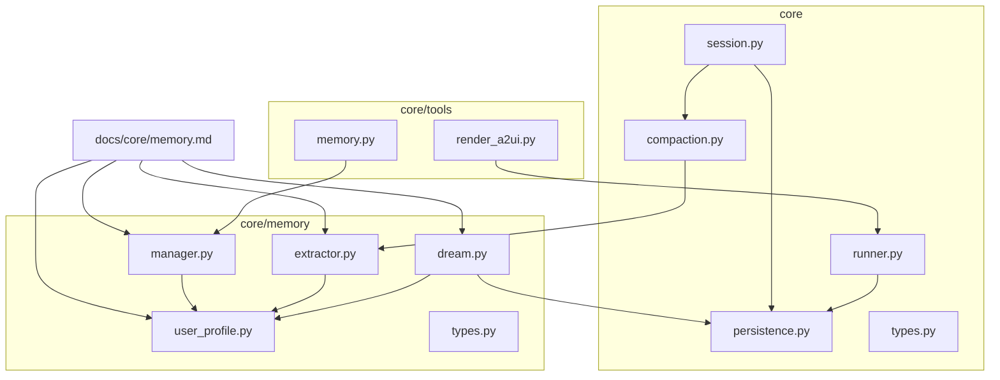
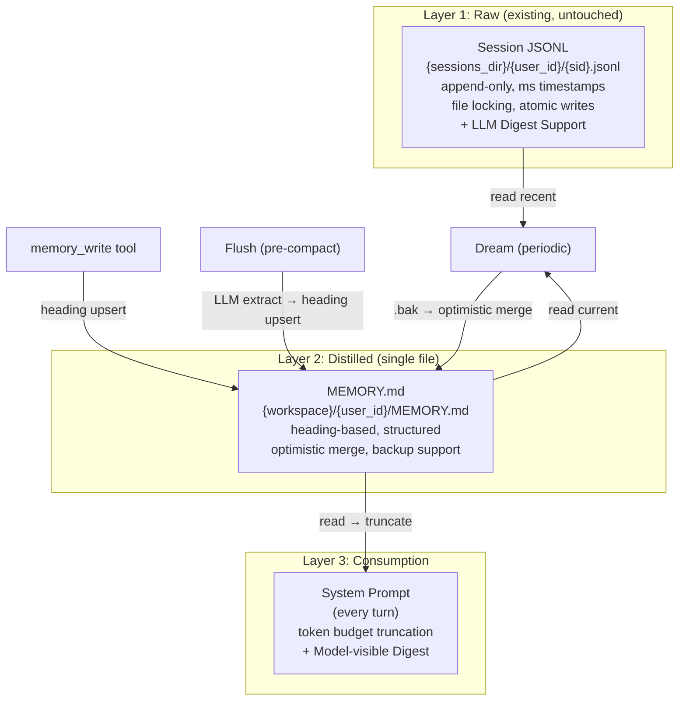
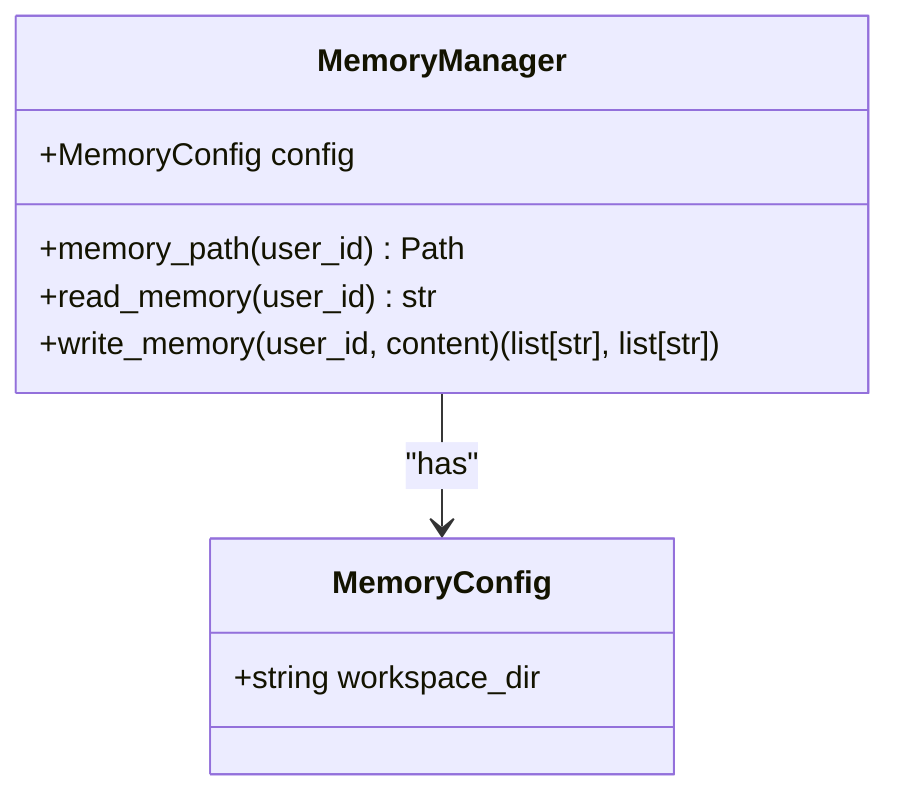
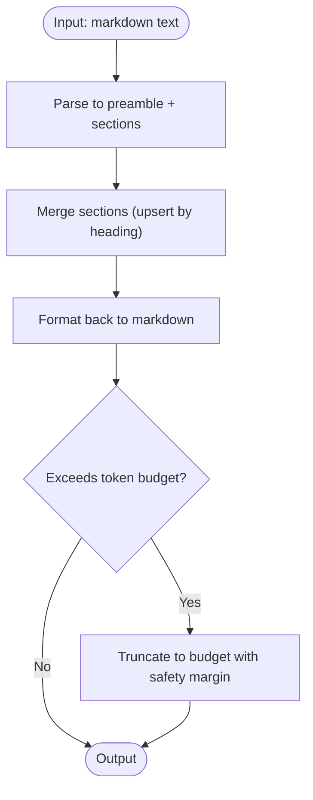
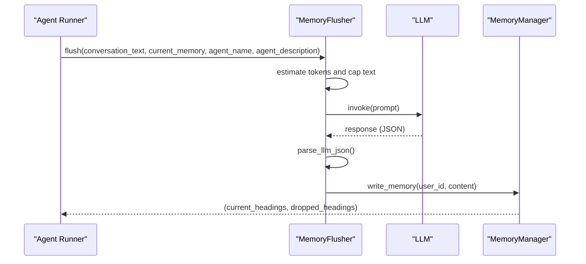
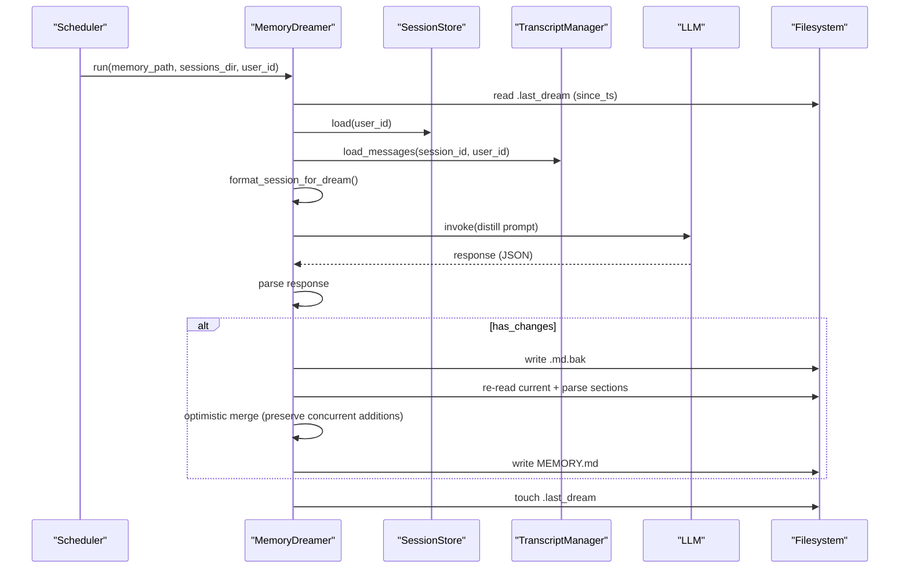
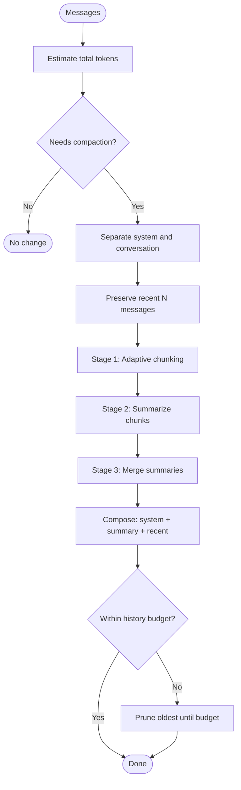
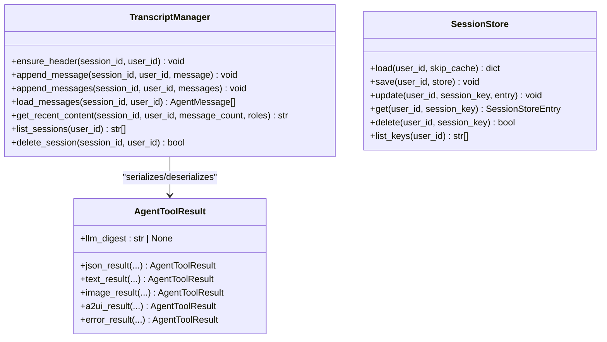
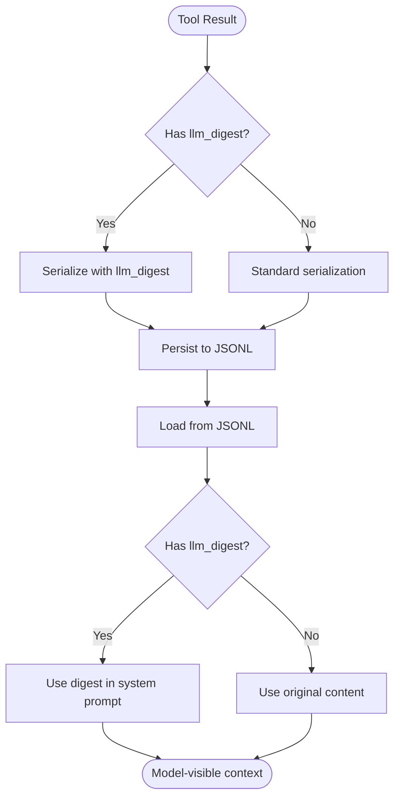
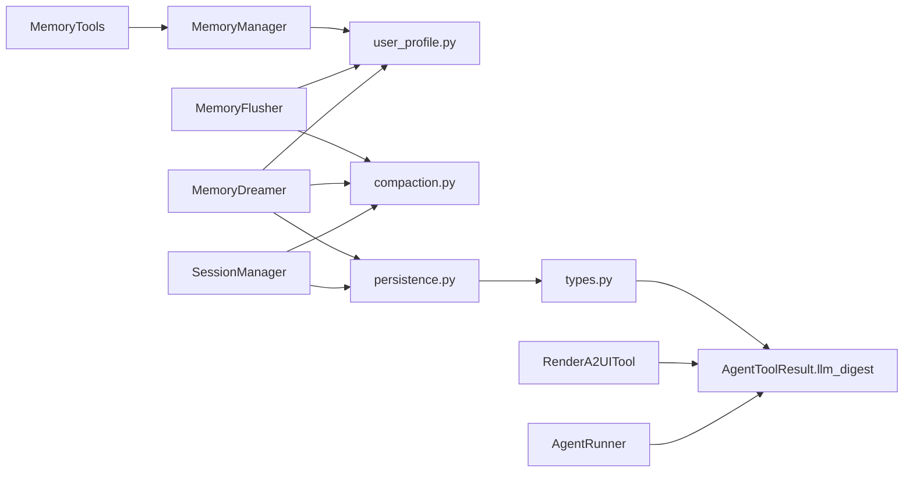

# Memory Systems

<cite>
**Referenced Files in This Document**
- [memory_architecture_review.md](file://docs/core/memory_architecture_review.md)
- [memory.md](file://docs/core/memory.md)
- [__init__.py](file://src/ark_agentic/core/memory/__init__.py)
- [manager.py](file://src/ark_agentic/core/memory/manager.py)
- [user_profile.py](file://src/ark_agentic/core/memory/user_profile.py)
- [extractor.py](file://src/ark_agentic/core/memory/extractor.py)
- [dream.py](file://src/ark_agentic/core/memory/dream.py)
- [types.py](file://src/ark_agentic/core/memory/types.py)
- [compaction.py](file://src/ark_agentic/core/compaction.py)
- [persistence.py](file://src/ark_agentic/core/persistence.py)
- [session.py](file://src/ark_agentic/core/session.py)
- [types.py](file://src/ark_agentic/core/types.py)
- [test_dream.py](file://tests/unit/core/test_dream.py)
- [memory.py](file://src/ark_agentic/core/tools/memory.py)
- [runner.py](file://src/ark_agentic/core/runner.py)
- [render_a2ui.py](file://src/ark_agentic/core/tools/render_a2ui.py)
</cite>

## Update Summary
**Changes Made**
- Enhanced documentation to reflect the new LLM digest functionality for background memory distillation
- Updated persistence layer documentation to include model-visible content summaries alongside traditional tool results
- Added comprehensive coverage of the new AgentToolResult.llm_digest field and its integration
- Expanded Dream memory distillation process with background processing capabilities
- Updated memory lifecycle management to include LLM digest processing
- Enhanced troubleshooting guide with new architecture issues and solutions

## Table of Contents
1. [Introduction](#introduction)
2. [Project Structure](#project-structure)
3. [Core Components](#core-components)
4. [Architecture Overview](#architecture-overview)
5. [Detailed Component Analysis](#detailed-component-analysis)
6. [Memory Architecture Review](#memory-architecture-review)
7. [Dependency Analysis](#dependency-analysis)
8. [Performance Considerations](#performance-considerations)
9. [Troubleshooting Guide](#troubleshooting-guide)
10. [Conclusion](#conclusion)
11. [Appendices](#appendices)

## Introduction
This document explains the memory systems architecture that powers long-term user knowledge in the system. The architecture follows a three-tier memory approach with enhanced file-based processing and improved distillation capabilities:

- **Layer 1 (Raw)**: Session JSONL stores append-only conversation transcripts with file-based persistence
- **Layer 2 (Distilled)**: MEMORY.md holds structured, heading-based user memory distilled from sessions
- **Layer 3 (Consumption)**: System Prompt injection delivers memory to the LLM at every turn

The system now includes advanced memory lifecycle management with periodic distillation, concurrent write handling, and improved memory compaction strategies. It covers the Dream memory distillation process, knowledge extraction algorithms, user profile management, memory compaction strategies, context compression techniques, knowledge retention policies, and practical patterns for memory writing, extraction workflows, and optimization.

**Updated** Enhanced with LLM digest functionality for background memory processing, enabling model-visible content summaries alongside traditional tool results.

## Project Structure
The memory system is implemented under core/memory and integrates with session management, compaction, and persistence layers. The architecture now includes enhanced file-based processing and improved memory lifecycle management with LLM digest support.

**Diagram sources**
- [memory.md:11-20](file://docs/core/memory.md#L11-L20)
- [manager.py:18-92](file://src/ark_agentic/core/memory/manager.py#L18-L92)
- [user_profile.py:1-114](file://src/ark_agentic/core/memory/user_profile.py#L1-L114)
- [extractor.py:1-188](file://src/ark_agentic/core/memory/extractor.py#L1-L188)
- [dream.py:1-323](file://src/ark_agentic/core/memory/dream.py#L1-L323)
- [session.py:1-482](file://src/ark_agentic/core/session.py#L1-L482)
- [compaction.py:1-717](file://src/ark_agentic/core/compaction.py#L1-L717)
- [persistence.py:1-787](file://src/ark_agentic/core/persistence.py#L1-L787)
- [memory.py:1-113](file://src/ark_agentic/core/tools/memory.py#L1-L113)
- [runner.py:501-536](file://src/ark_agentic/core/runner.py#L501-L536)
- [render_a2ui.py:73-80](file://src/ark_agentic/core/tools/render_a2ui.py#L73-L80)

**Section sources**
- [memory.md:9-21](file://docs/core/memory.md#L9-L21)
- [__init__.py:1-12](file://src/ark_agentic/core/memory/__init__.py#L1-L12)

## Core Components
- **MemoryManager**: Provides workspace-scoped path management and MEMORY.md read/write with heading-level upsert semantics
- **MemoryFlusher**: Extracts and persists distilled knowledge from full conversations before compaction using LLM-powered extraction
- **MemoryDreamer**: Periodically distills recent sessions plus current memory into a consolidated MEMORY.md using a single LLM call with optimistic merge
- **User Profile Utilities**: Parse/format heading-based markdown, upsert by heading, and truncate profiles when exceeding token budgets
- **Session Management and Persistence**: JSONL-based session storage and transcript management with file locking
- **Context Compaction**: Token estimation, adaptive chunking, staged summarization, and pruning to budget
- **Memory Tools**: Agent-facing tools for memory write operations with user context validation
- **LLM Digest System**: Enhanced persistence layer supporting model-visible content summaries alongside traditional tool results

**Updated** Added LLM digest functionality for background memory processing, enabling model-visible content summaries to be stored alongside traditional tool results.

**Section sources**
- [manager.py:18-92](file://src/ark_agentic/core/memory/manager.py#L18-L92)
- [extractor.py:99-188](file://src/ark_agentic/core/memory/extractor.py#L99-L188)
- [dream.py:189-323](file://src/ark_agentic/core/memory/dream.py#L189-L323)
- [user_profile.py:26-114](file://src/ark_agentic/core/memory/user_profile.py#L26-L114)
- [persistence.py:388-787](file://src/ark_agentic/core/persistence.py#L388-L787)
- [session.py:24-482](file://src/ark_agentic/core/session.py#L24-L482)
- [compaction.py:329-717](file://src/ark_agentic/core/compaction.py#L329-L717)
- [memory.py:39-113](file://src/ark_agentic/core/tools/memory.py#L39-L113)
- [types.py:85-100](file://src/ark_agentic/core/types.py#L85-L100)

## Architecture Overview
The memory architecture follows a strict three-tier pipeline with enhanced file-based processing: raw session JSONL → distilled MEMORY.md → system prompt consumption. The system now includes improved memory lifecycle management with periodic distillation and concurrent write handling.

**Updated** Enhanced with LLM digest support in session JSONL storage and model-visible digest processing in system prompts.

**Diagram sources**
- [memory.md:24-40](file://docs/core/memory.md#L24-L40)
- [dream.py:87-139](file://src/ark_agentic/core/memory/dream.py#L87-L139)
- [extractor.py:109-145](file://src/ark_agentic/core/memory/extractor.py#L109-L145)
- [manager.py:41-69](file://src/ark_agentic/core/memory/manager.py#L41-L69)
- [user_profile.py:66-94](file://src/ark_agentic/core/memory/user_profile.py#L66-L94)
- [persistence.py:145-146](file://src/ark_agentic/core/persistence.py#L145-L146)
- [runner.py:1034-1036](file://src/ark_agentic/core/runner.py#L1034-L1036)

## Detailed Component Analysis

### Memory Manager
- **Responsibilities**: Workspace path management, MEMORY.md read/write, and user isolation by user_id
- **Behavior**: Heading-level upsert merges incoming sections with existing ones; empty-body headings drop the heading; returns current and dropped headings for observability
- **Enhanced Features**: File-based operations with proper directory creation and error handling

**Diagram sources**
- [manager.py:18-92](file://src/ark_agentic/core/memory/manager.py#L18-L92)

**Section sources**
- [manager.py:24-92](file://src/ark_agentic/core/memory/manager.py#L24-L92)

### User Profile Utilities
- **Heading-based Markdown**: Parse/format preamble and sections; preserve preamble; merge by heading
- **Truncation**: When token budget exceeded, truncate to target with a safety margin and mark truncation
- **Enhanced Operations**: Proper error handling and logging for file operations

**Diagram sources**
- [user_profile.py:26-114](file://src/ark_agentic/core/memory/user_profile.py#L26-L114)

**Section sources**
- [user_profile.py:26-114](file://src/ark_agentic/core/memory/user_profile.py#L26-L114)

### Memory Extraction (Flush)
- **Purpose**: Pre-compaction extraction of knowledge from full conversation history into MEMORY.md
- **Process**: Build prompt with agent identity and current memory, cap conversation length by token budget, call LLM, parse JSON, and upsert sections
- **Enhanced Features**: Improved token budget management and error handling

**Diagram sources**
- [extractor.py:109-145](file://src/ark_agentic/core/memory/extractor.py#L109-L145)
- [manager.py:41-69](file://src/ark_agentic/core/memory/manager.py#L41-L69)

**Section sources**
- [extractor.py:99-188](file://src/ark_agentic/core/memory/extractor.py#L99-L188)

### Dream Memory Distillation
- **Gate**: Periodic gating checks elapsed hours and minimum sessions since last dream
- **Reader**: Reads recent sessions (user + assistant, skipping tool/system noise) with a token budget
- **Distillation**: Single LLM call to merge, prune, extract, and infer potential needs
- **Apply**: Optimistic merge with backup and concurrent write detection; preserves headings added during the dream window
- **Timestamp**: Updates .last_dream after successful application
- **Enhanced Features**: Improved backup handling and concurrent write preservation

**Updated** Enhanced with background processing capabilities and improved memory lifecycle management.

**Diagram sources**
- [dream.py:146-323](file://src/ark_agentic/core/memory/dream.py#L146-L323)
- [persistence.py:388-520](file://src/ark_agentic/core/persistence.py#L388-L520)

**Section sources**
- [dream.py:146-323](file://src/ark_agentic/core/memory/dream.py#L146-L323)
- [test_dream.py:294-348](file://tests/unit/core/test_dream.py#L294-L348)

### Context Compression and Knowledge Retention
- **Token Estimation**: Estimate tokens per message and text with a safety margin
- **Adaptive Chunking**: Split history into chunks respecting context window and message sizes
- **Staged Summarization**: Generate partial summaries per chunk and merge summaries into a unified summary
- **Pruning to Budget**: Drop earliest messages until within history budget
- **Preservation**: Preserve recent messages to maintain recency bias

**Diagram sources**
- [compaction.py:425-644](file://src/ark_agentic/core/compaction.py#L425-L644)

**Section sources**
- [compaction.py:329-717](file://src/ark_agentic/core/compaction.py#L329-L717)

### Session Management and Persistence
- **JSONL Storage**: Header + message entries with timestamps; append-only, lock-protected
- **Transcript Manager**: Load/save messages, recent content extraction, and admin listing
- **Session Store**: Per-user sessions.json metadata cache and lock-protected updates
- **Enhanced Features**: File locking mechanisms and proper error handling
- **LLM Digest Support**: Enhanced serialization/deserialization with model-visible content summaries

**Updated** Enhanced with LLM digest functionality for storing model-visible content summaries alongside traditional tool results.

**Diagram sources**
- [persistence.py:388-787](file://src/ark_agentic/core/persistence.py#L388-L787)
- [types.py:85-100](file://src/ark_agentic/core/types.py#L85-L100)

**Section sources**
- [persistence.py:388-787](file://src/ark_agentic/core/persistence.py#L388-L787)
- [session.py:24-482](file://src/ark_agentic/core/session.py#L24-L482)
- [types.py:85-100](file://src/ark_agentic/core/types.py#L85-L100)

### Memory Tools
- **MemoryWriteTool**: Agent-facing tool for writing memory with user context validation
- **Features**: Validates user context, handles memory operations, and provides structured responses
- **Enhanced Error Handling**: Comprehensive error handling and logging

**Section sources**
- [memory.py:39-113](file://src/ark_agentic/core/tools/memory.py#L39-L113)

### LLM Digest System
- **Purpose**: Enable model-visible content summaries alongside traditional tool results
- **Implementation**: AgentToolResult.llm_digest field stores concise text for LLM conversation context
- **Persistence**: Enhanced JSONL serialization/deserialization supports llm_digest field
- **Integration**: System prompt building uses llm_digest when available for model-visible context
- **Background Processing**: Integrated with Dream system for background memory distillation

**Updated** New component enabling model-visible content summaries for enhanced memory processing.

**Diagram sources**
- [persistence.py:145-146](file://src/ark_agentic/core/persistence.py#L145-L146)
- [persistence.py:180-186](file://src/ark_agentic/core/persistence.py#L180-L186)
- [runner.py:1034-1036](file://src/ark_agentic/core/runner.py#L1034-L1036)

**Section sources**
- [types.py:85-100](file://src/ark_agentic/core/types.py#L85-L100)
- [persistence.py:145-146](file://src/ark_agentic/core/persistence.py#L145-L146)
- [persistence.py:180-186](file://src/ark_agentic/core/persistence.py#L180-L186)
- [runner.py:1034-1036](file://src/ark_agentic/core/runner.py#L1034-L1036)

## Memory Architecture Review
Based on the comprehensive architecture review, the system has several critical issues that need addressing:

### Key Issues Identified

#### P0 - Multi-user Chain Breakage
**Problem**: `MemorySearchTool.execute` calls `memory.search()` without passing `user_id`, causing searches to default to empty user partition.
**Impact**: Multi-user scenarios fail to return indexed user memories.

#### P0 - Inconsistent Write Paths
**Problem**: `MemoryWriteTool` writes to root MEMORY.md while `MemoryFlusher` writes to user-specific subdirectories.
**Impact**: Tool-written memories aren't indexed by user granularity.

#### P1 - Safe Reindex Data Loss Risk
**Problem**: `safe_reindex` replaces entire DB file, losing other users' data when reindexing for specific user.
**Impact**: Full reindex operations can purge unrelated user memories.

#### P1 - Protocol Mismatch
**Problem**: `types.py` protocols lack `user_id` parameter while implementations require it.
**Impact**: Protocol abstraction fails for multi-tenant scenarios.

#### P2 - Missing Advanced Features
**Problem**: No MMR, temporal decay, or memory conflict detection.
**Impact**: Retrieval quality and memory consistency issues.

### Proposed Solutions

#### Phase 1: Critical Bug Fixes
- Fix `memory_search` to pass `user_id` parameter
- Unify write paths to use user-specific directories
- Implement per-user safe reindex operations

#### Phase 2: Architecture Enhancement
- Add multi-dimensional memory scopes (user/agent/org/session)
- Implement UPSERT semantics with conflict detection
- Add MMR and temporal decay capabilities

#### Phase 3: Advanced Features
- Memory distillation system (KAIROS-style)
- Session memory independent layer
- Storage backend abstraction with Protocol support

**Updated** Enhanced with LLM digest functionality for background memory processing and model-visible content summaries.

**Section sources**
- [memory_architecture_review.md:75-167](file://docs/core/memory_architecture_review.md#L75-L167)
- [memory_architecture_review.md:221-342](file://docs/core/memory_architecture_review.md#L221-L342)

## Dependency Analysis
- MemoryManager depends on user_profile utilities for heading-based upsert and format
- MemoryFlusher depends on compaction token estimation and user_profile upsert
- MemoryDreamer depends on persistence (SessionStore/TranscriptManager) for recent sessions, user_profile for parsing/formatting, and compaction for token estimation
- SessionManager orchestrates compaction and persistence; compaction depends on types for message structures
- MemoryTools depend on MemoryManager for operations
- LLM Digest System depends on AgentToolResult types and persistence layer for serialization

**Updated** Added LLM digest system dependencies and enhanced persistence layer integration.

**Diagram sources**
- [manager.py:51-69](file://src/ark_agentic/core/memory/manager.py#L51-L69)
- [extractor.py:106-107](file://src/ark_agentic/core/memory/extractor.py#L106-L107)
- [dream.py:108-112](file://src/ark_agentic/core/memory/dream.py#L108-L112)
- [session.py:10-19](file://src/ark_agentic/core/session.py#L10-L19)
- [compaction.py:9-12](file://src/ark_agentic/core/compaction.py#L9-L12)
- [types.py:190-229](file://src/ark_agentic/core/types.py#L190-L229)
- [memory.py:31-36](file://src/ark_agentic/core/tools/memory.py#L31-L36)
- [persistence.py:145-146](file://src/ark_agentic/core/persistence.py#L145-L146)
- [render_a2ui.py:73-80](file://src/ark_agentic/core/tools/render_a2ui.py#L73-L80)
- [runner.py:1034-1036](file://src/ark_agentic/core/runner.py#L1034-L1036)

**Section sources**
- [manager.py:51-69](file://src/ark_agentic/core/memory/manager.py#L51-L69)
- [extractor.py:106-107](file://src/ark_agentic/core/memory/extractor.py#L106-L107)
- [dream.py:108-112](file://src/ark_agentic/core/memory/dream.py#L108-L112)
- [session.py:10-19](file://src/ark_agentic/core/session.py#L10-L19)
- [compaction.py:9-12](file://src/ark_agentic/core/compaction.py#L9-L12)
- [types.py:190-229](file://src/ark_agentic/core/types.py#L190-L229)

## Performance Considerations
- **Token Budgets**:
  - Flush: Conversation capped at a fixed token budget before LLM extraction
  - Dream: Recent sessions read with a token budget to bound LLM input
  - Profile Truncation: Automatic truncation to a target token budget with a safety margin
- **Safety Margins**: Token estimations include a safety factor to reduce overflows
- **Adaptive Chunking**: Adjusts chunk ratios based on average message size relative to context window
- **Staged Summarization**: Reduces risk of oversized inputs by summarizing chunks and merging summaries
- **Locking and Concurrency**: File locks prevent corruption during JSONL writes; optimistic merge avoids conflicts in Dream
- **Enhanced Features**: Memory tools provide structured responses and proper error handling
- **LLM Digest Processing**: Efficient model-visible content processing with minimal overhead

**Updated** Added LLM digest processing considerations for background memory operations.

## Troubleshooting Guide
- **Dream Gate Failures**:
  - If .last_dream is missing or invalid, the gate disables dream; touch creates a fresh timestamp
  - Ensure sessions_dir and workspace_dir are correctly configured
- **Concurrent Writes During Dream**:
  - Optimistic merge preserves headings added during the dream window by detecting new headings added after snapshot
- **Non-JSON LLM Responses**:
  - Both flush and dream parse LLM responses; warnings are logged for non-JSON outputs
- **Session Loading Failures**:
  - TranscriptManager logs and skips malformed lines; ensure JSONL integrity
- **Orphaned Index Directory**:
  - A warning is emitted if the legacy .memory directory exists; it can be removed
- **Multi-user Issues**:
  - MemorySearchTool requires user_id parameter; ensure proper context propagation
  - Write paths must be consistent across tools and flush operations
- **Memory Tool Errors**:
  - Validate user context and ensure proper MemoryManager initialization
- **LLM Digest Issues**:
  - Verify llm_digest field is properly set in AgentToolResult instances
  - Check JSONL serialization/deserialization for llm_digest support
  - Ensure system prompt building uses llm_digest when available

**Updated** Added troubleshooting guidance for LLM digest functionality and background memory processing.

**Section sources**
- [dream.py:146-182](file://src/ark_agentic/core/memory/dream.py#L146-L182)
- [dream.py:223-234](file://src/ark_agentic/core/memory/dream.py#L223-L234)
- [persistence.py:490-503](file://src/ark_agentic/core/persistence.py#L490-L503)
- [manager.py:84-92](file://src/ark_agentic/core/memory/manager.py#L84-L92)
- [test_dream.py:273-348](file://tests/unit/core/test_dream.py#L273-L348)
- [memory_architecture_review.md:75-113](file://docs/core/memory_architecture_review.md#L75-L113)
- [persistence.py:145-146](file://src/ark_agentic/core/persistence.py#L145-L146)
- [runner.py:1034-1036](file://src/ark_agentic/core/runner.py#L1034-L1036)

## Conclusion
The memory system implements a robust, file-backed, LLM-driven approach to user knowledge management with enhanced three-layer architecture. By separating raw session storage, distilled memory, and system prompt consumption, it achieves strong retention, efficient context management, and predictable concurrency. The Dream distillation process consolidates knowledge periodically, while pre-compaction extraction ensures critical facts are preserved before context compression.

**Updated** Enhanced with LLM digest functionality for background memory processing, enabling model-visible content summaries alongside traditional tool results. The system now includes improved memory lifecycle management with periodic distillation, concurrent write handling, and enhanced file-based processing with background memory operations.

With careful configuration of token budgets, compression thresholds, and dream scheduling, the system scales effectively for large deployments. The architecture review identifies critical issues that need addressing for production readiness, particularly around multi-user support and consistent memory operations.

## Appendices

### Practical Memory Writing Patterns
- Use heading-based markdown with concise, generic headings (e.g., "Identity Information", "Risk Preference", "Reply Style", "Potential Need")
- Prefer explicit statements of preferences, decisions, and explicit requests to be remembered
- Avoid recording transient queries, public market data, or redundant information already captured
- Ensure proper user context when using memory tools
- Leverage LLM digest functionality for model-visible content summaries

**Updated** Added guidance for LLM digest usage in memory writing patterns.

**Section sources**
- [memory.md:80-121](file://docs/core/memory.md#L80-L121)

### Extraction Workflows
- **Pre-compaction flush**: Triggered before compaction to extract new/changed knowledge from the full conversation into MEMORY.md
- **Post-session dream**: Periodic consolidation of recent sessions and current memory into a single, coherent MEMORY.md
- **Memory tools**: Direct agent-driven memory updates with heading-based upsert semantics
- **Background memory processing**: Automated LLM digest generation and memory distillation for enhanced context management

**Updated** Enhanced with background memory processing workflows using LLM digest functionality.

**Section sources**
- [memory.md:64-79](file://docs/core/memory.md#L64-L79)
- [extractor.py:153-188](file://src/ark_agentic/core/memory/extractor.py#L153-L188)
- [dream.py:288-323](file://src/ark_agentic/core/memory/dream.py#L288-L323)
- [memory.py:39-113](file://src/ark_agentic/core/tools/memory.py#L39-L113)

### Optimization Techniques
- Tune compaction thresholds and chunk sizes to balance recall and cost
- Use adaptive chunking to handle variable message sizes
- Employ staged summarization to avoid oversized inputs
- Keep recent messages preserved to maintain conversational continuity
- Implement proper token budget management for LLM operations
- Optimize LLM digest processing for background memory operations

**Updated** Added optimization techniques for LLM digest processing and background memory operations.

**Section sources**
- [compaction.py:163-197](file://src/ark_agentic/core/compaction.py#L163-L197)
- [compaction.py:494-594](file://src/ark_agentic/core/compaction.py#L494-L594)

### Configuration Options
- **MemoryManager**: workspace_dir determines the base directory for user MEMORY.md files
- **CompactionConfig**: context_window, output_reserve, system_reserve, target_tokens, trigger_threshold, chunk sizes, summary_max_tokens, preserve_recent, min_messages_for_split, summary_parts, max_history_share
- **Dream Gate**: min_hours and min_sessions thresholds for scheduling
- **Flush Token Budget**: maximum tokens considered for extraction
- **Memory Tools**: user context validation and proper error handling
- **LLM Digest**: model-visible content processing configuration

**Updated** Added configuration options for LLM digest functionality.

**Section sources**
- [manager.py:18-36](file://src/ark_agentic/core/memory/manager.py#L18-L36)
- [compaction.py:330-382](file://src/ark_agentic/core/compaction.py#L330-L382)
- [dream.py:146-175](file://src/ark_agentic/core/memory/dream.py#L146-L175)
- [extractor.py:27-120](file://src/ark_agentic/core/memory/extractor.py#L27-L120)
- [memory.py:24-28](file://src/ark_agentic/core/tools/memory.py#L24-L28)

### Cleanup Procedures
- Remove legacy .memory directory if present (warning emitted on startup)
- Delete orphaned session files via TranscriptManager.delete_session when appropriate
- Ensure .last_dream timestamps are properly maintained to avoid unnecessary dreams
- Validate memory tool operations and proper user context handling
- Monitor LLM digest storage and cleanup unused digests

**Updated** Added cleanup procedures for LLM digest functionality.

**Section sources**
- [manager.py:84-92](file://src/ark_agentic/core/memory/manager.py#L84-L92)
- [persistence.py:572-584](file://src/ark_agentic/core/persistence.py#L572-L584)
- [dream.py:177-182](file://src/ark_agentic/core/memory/dream.py#L177-L182)

### Memory Architecture Evolution
The system continues to evolve toward more sophisticated memory management with:
- Enhanced multi-user support and proper isolation
- Improved memory consistency through UPSERT semantics
- Advanced retrieval capabilities with MMR and temporal decay
- Better error handling and validation across all components
- Production-ready architecture with proper testing and monitoring
- LLM digest functionality for background memory processing
- Model-visible content summaries for enhanced context management

**Updated** Enhanced with LLM digest functionality and background memory processing capabilities.

**Section sources**
- [memory_architecture_review.md:221-359](file://docs/core/memory_architecture_review.md#L221-L359)