# Session Management and Memory

<cite>
**Referenced Files in This Document**
- [session.py](file://src/ark_agentic/core/session.py)
- [persistence.py](file://src/ark_agentic/core/persistence.py)
- [compaction.py](file://src/ark_agentic/core/compaction.py)
- [manager.py](file://src/ark_agentic/core/memory/manager.py)
- [dream.py](file://src/ark_agentic/core/memory/dream.py)
- [extractor.py](file://src/ark_agentic/core/memory/extractor.py)
- [user_profile.py](file://src/ark_agentic/core/memory/user_profile.py)
- [rules.py](file://src/ark_agentic/core/memory/rules.py)
- [builder.py](file://src/ark_agentic/core/prompt/builder.py)
- [types.py](file://src/ark_agentic/core/types.py)
- [memory.py](file://src/ark_agentic/studio/api/memory.py)
- [runner.py](file://src/ark_agentic/core/runner.py)
</cite>

## Update Summary
**Changes Made**
- Enhanced MemoryFlusher with improved profile extraction capabilities
- Improved SystemPromptBuilder with enhanced instruction templates and better memory integration
- Added comprehensive memory filter rules for consistent extraction across all components
- Enhanced user profile management with better heading priority and truncation logic
- Improved memory writing protocols with clearer instruction templates

## Table of Contents
1. [Introduction](#introduction)
2. [Project Structure](#project-structure)
3. [Core Components](#core-components)
4. [Architecture Overview](#architecture-overview)
5. [Detailed Component Analysis](#detailed-component-analysis)
6. [Dependency Analysis](#dependency-analysis)
7. [Performance Considerations](#performance-considerations)
8. [Troubleshooting Guide](#troubleshooting-guide)
9. [Conclusion](#conclusion)
10. [Appendices](#appendices)

## Introduction
This document explains the session management and memory systems in the project. It covers:
- SessionManager architecture, lifecycle, and state persistence
- The three-tier memory system: Session JSONL, MEMORY.md, and System Prompt injection
- The Dream memory distillation process
- Context compression with LLM summarization
- Memory flush operations with enhanced profile extraction
- User profile management with improved heading-based structure
- Enhanced prompt building with better instruction templates
- Practical examples and configuration options for memory retention, compression thresholds, and dream scheduling

## Project Structure
The memory and session subsystems are organized under core modules:
- Session storage and transcripts: JSONL files per user-session with a dedicated header and message entries
- Session metadata store: a per-user sessions.json with lock protection
- Memory manager: lightweight writer/readers for user MEMORY.md files using heading-based markdown
- Memory extraction and distillation: pre-compaction flush and periodic Dream distillation with enhanced filtering
- Compression: adaptive chunking and LLM summarization to keep context within model limits
- Enhanced prompt building: improved instruction templates for better memory integration

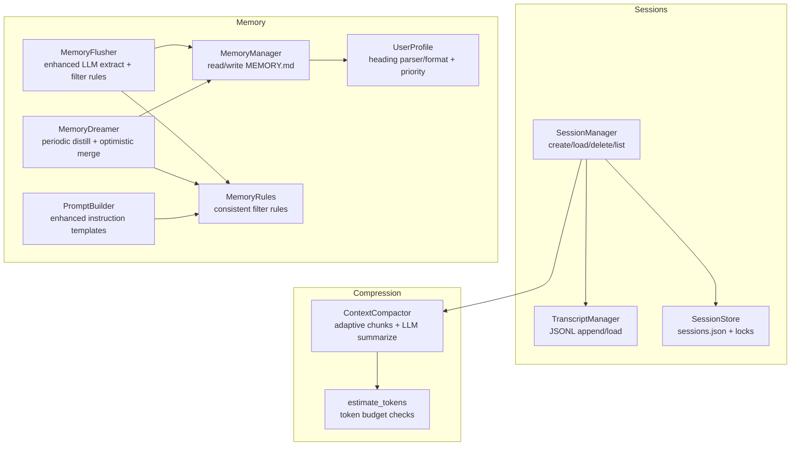

**Diagram sources**
- [session.py:24-482](file://src/ark_agentic/core/session.py#L24-L482)
- [persistence.py:388-783](file://src/ark_agentic/core/persistence.py#L388-L783)
- [compaction.py:396-717](file://src/ark_agentic/core/compaction.py#L396-L717)
- [manager.py:24-92](file://src/ark_agentic/core/memory/manager.py#L24-L92)
- [extractor.py:99-188](file://src/ark_agentic/core/memory/extractor.py#L99-L188)
- [dream.py:189-322](file://src/ark_agentic/core/memory/dream.py#L189-L322)
- [user_profile.py:26-114](file://src/ark_agentic/core/memory/user_profile.py#L26-L114)
- [builder.py:74-309](file://src/ark_agentic/core/prompt/builder.py#L74-L309)
- [rules.py:1-32](file://src/ark_agentic/core/memory/rules.py#L1-L32)

**Section sources**
- [session.py:1-482](file://src/ark_agentic/core/session.py#L1-L482)
- [persistence.py:1-783](file://src/ark_agentic/core/persistence.py#L1-L783)
- [compaction.py:1-717](file://src/ark_agentic/core/compaction.py#L1-L717)
- [manager.py:1-92](file://src/ark_agentic/core/memory/manager.py#L1-L92)
- [extractor.py:1-188](file://src/ark_agentic/core/memory/extractor.py#L1-L188)
- [dream.py:1-322](file://src/ark_agentic/core/memory/dream.py#L1-L322)
- [user_profile.py:1-138](file://src/ark_agentic/core/memory/user_profile.py#L1-L138)
- [builder.py:1-309](file://src/ark_agentic/core/prompt/builder.py#L1-L309)
- [rules.py:1-32](file://src/ark_agentic/core/memory/rules.py#L1-L32)
- [types.py:1-413](file://src/ark_agentic/core/types.py#L1-L413)

## Core Components
- SessionManager: orchestrates session creation, loading, message appending, compression, and persistence synchronization
- TranscriptManager: JSONL-based transcript writer/reader with file locking and header management
- SessionStore: per-user metadata store for sessions.json with caching and file locks
- MemoryManager: reads/writes user MEMORY.md with heading-level upsert semantics and enhanced profile management
- MemoryFlusher: pre-compaction extraction of long-term relevant facts into MEMORY.md with improved filtering
- MemoryDreamer: periodic distillation of recent sessions and current memory into consolidated MEMORY.md with optimistic merge
- ContextCompactor: adaptive chunking and LLM summarization to compress context within budget
- UserProfile: heading-based markdown parser/format with enhanced priority ordering and truncation utilities
- SystemPromptBuilder: enhanced prompt building with improved instruction templates and better memory integration
- MemoryRules: unified filter rules for consistent memory extraction across all components

**Section sources**
- [session.py:24-482](file://src/ark_agentic/core/session.py#L24-L482)
- [persistence.py:388-783](file://src/ark_agentic/core/persistence.py#L388-L783)
- [manager.py:24-92](file://src/ark_agentic/core/memory/manager.py#L24-L92)
- [extractor.py:99-188](file://src/ark_agentic/core/memory/extractor.py#L99-L188)
- [dream.py:189-322](file://src/ark_agentic/core/memory/dream.py#L189-L322)
- [compaction.py:396-717](file://src/ark_agentic/core/compaction.py#L396-L717)
- [user_profile.py:26-114](file://src/ark_agentic/core/memory/user_profile.py#L26-L114)
- [builder.py:74-309](file://src/ark_agentic/core/prompt/builder.py#L74-L309)
- [rules.py:1-32](file://src/ark_agentic/core/memory/rules.py#L1-L32)

## Architecture Overview
The system separates raw session transcripts (JSONL) from persistent memory (MEMORY.md), with a third layer of system prompt injection that references MEMORY.md content. Enhanced memory management provides better profile extraction through improved filtering rules and systematic prompt building with enhanced instruction templates. Periodic Dream distillation consolidates recent sessions and current memory into a compact, heading-based MEMORY.md with optimistic merge.

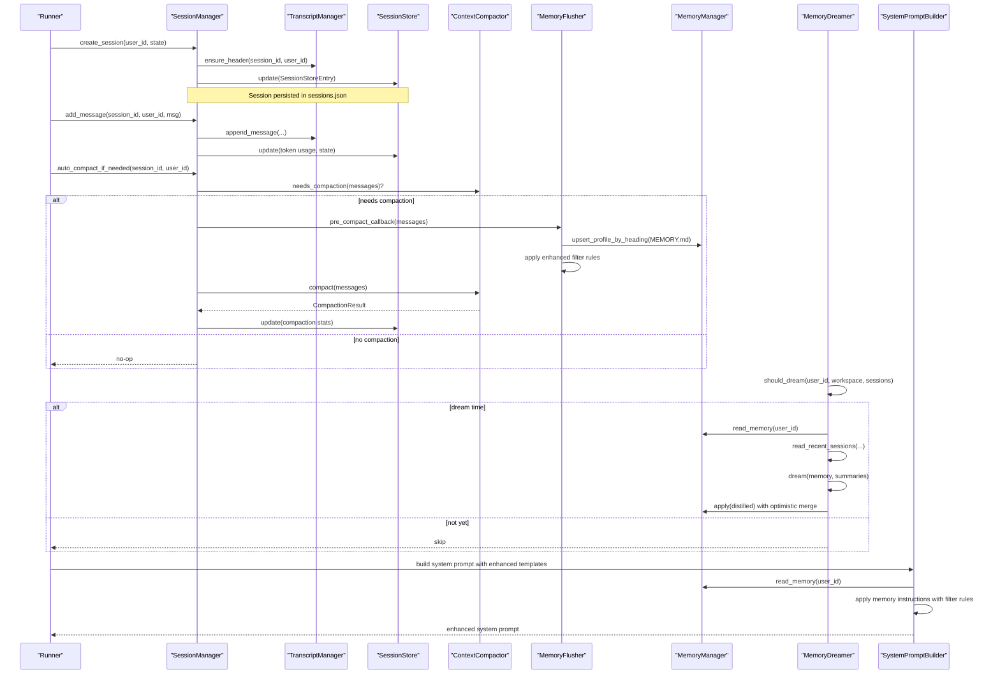

**Diagram sources**
- [session.py:40-431](file://src/ark_agentic/core/session.py#L40-L431)
- [persistence.py:440-783](file://src/ark_agentic/core/persistence.py#L440-L783)
- [compaction.py:433-492](file://src/ark_agentic/core/compaction.py#L433-L492)
- [extractor.py:153-188](file://src/ark_agentic/core/memory/extractor.py#L153-L188)
- [dream.py:146-322](file://src/ark_agentic/core/memory/dream.py#L146-L322)
- [manager.py:41-69](file://src/ark_agentic/core/memory/manager.py#L41-L69)
- [builder.py:260-306](file://src/ark_agentic/core/prompt/builder.py#L260-L306)

## Detailed Component Analysis

### SessionManager: Lifecycle, Persistence, and State
- Lifecycle: create, load, reload, list, delete; supports both in-memory and disk-backed operations
- Message management: append single/multiple messages, pending sync, inject external history, clear messages
- Compression: needs_compaction, compact_session, auto_compact_if_needed with pre-compaction callback hook
- Persistence: sync_pending_messages and sync_session_state update sessions.json atomically
- State: update_state/get_state for ADK-style scratchpad
- Token accounting: update_token_usage/get_token_usage/estimate_current_tokens

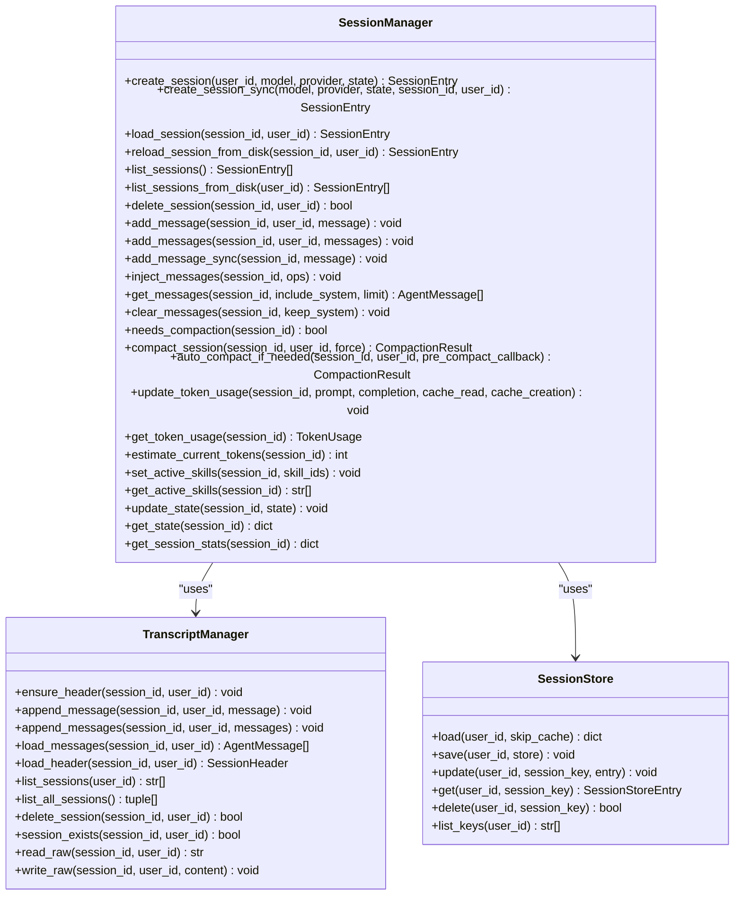

**Diagram sources**
- [session.py:24-482](file://src/ark_agentic/core/session.py#L24-L482)
- [persistence.py:388-783](file://src/ark_agentic/core/persistence.py#L388-L783)

**Section sources**
- [session.py:24-482](file://src/ark_agentic/core/session.py#L24-L482)
- [persistence.py:388-783](file://src/ark_agentic/core/persistence.py#L388-L783)
- [types.py:341-413](file://src/ark_agentic/core/types.py#L341-L413)

### Enhanced Memory Management System
- Session JSONL: raw, chronological transcript stored in user-specific JSONL files with a header and message entries
- MEMORY.md: enhanced heading-based markdown representing user memory with improved priority ordering; written by MemoryManager and MemoryFlusher
- System Prompt injection: agent prompts reference MEMORY.md content with enhanced instruction templates to inform model behavior

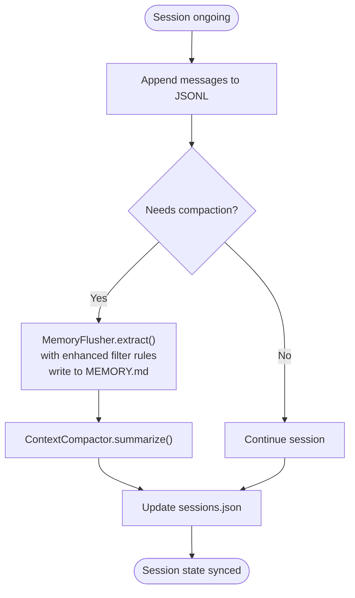

**Diagram sources**
- [session.py:264-431](file://src/ark_agentic/core/session.py#L264-L431)
- [compaction.py:433-492](file://src/ark_agentic/core/compaction.py#L433-L492)
- [extractor.py:153-188](file://src/ark_agentic/core/memory/extractor.py#L153-L188)
- [manager.py:41-69](file://src/ark_agentic/core/memory/manager.py#L41-L69)

**Section sources**
- [persistence.py:440-520](file://src/ark_agentic/core/persistence.py#L440-L520)
- [manager.py:41-69](file://src/ark_agentic/core/memory/manager.py#L41-L69)
- [extractor.py:109-152](file://src/ark_agentic/core/memory/extractor.py#L109-L152)

### Enhanced MemoryFlusher: Improved Pre-Compaction Extraction
- Builds a conversation text from all messages with enhanced filtering
- Calls LLM with improved structured prompt using unified MEMORY_FILTER_RULES
- Extracts long-term relevant facts with better consistency across components
- Writes extracted content to MEMORY.md using enhanced heading-level upsert semantics
- Provides a pre_compact_callback closure to integrate with SessionManager

**Updated** Enhanced with unified filter rules and improved instruction templates for better consistency

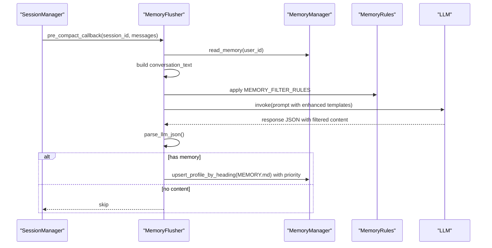

**Diagram sources**
- [extractor.py:153-188](file://src/ark_agentic/core/memory/extractor.py#L153-L188)
- [manager.py:41-69](file://src/ark_agentic/core/memory/manager.py#L41-L69)
- [user_profile.py:66-94](file://src/ark_agentic/core/memory/user_profile.py#L66-L94)
- [rules.py:7-28](file://src/ark_agentic/core/memory/rules.py#L7-L28)

**Section sources**
- [extractor.py:99-188](file://src/ark_agentic/core/memory/extractor.py#L99-L188)
- [manager.py:41-69](file://src/ark_agentic/core/memory/manager.py#L41-L69)
- [user_profile.py:66-94](file://src/ark_agentic/core/memory/user_profile.py#L66-L94)
- [rules.py:7-28](file://src/ark_agentic/core/memory/rules.py#L7-L28)

### Enhanced MemoryDreamer: Improved Periodic Distillation
- Determines whether to run a dream cycle based on elapsed hours and minimum session count since last dream
- Reads recent sessions (up to a token budget) and current MEMORY.md with enhanced priority handling
- Calls LLM to consolidate and prune memory content with improved instruction templates
- Applies distilled content with optimistic merge to preserve concurrent writes during the dream window
- Updates the last dream timestamp with better error handling

**Updated** Enhanced with improved instruction templates and better error handling

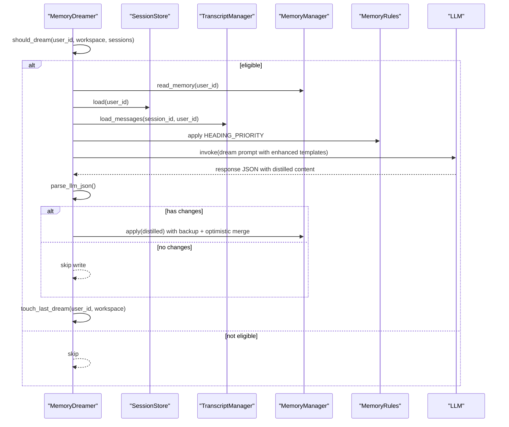

**Diagram sources**
- [dream.py:146-322](file://src/ark_agentic/core/memory/dream.py#L146-L322)
- [session.py:114-138](file://src/ark_agentic/core/session.py#L114-L138)
- [persistence.py:684-783](file://src/ark_agentic/core/persistence.py#L684-L783)
- [user_profile.py:106-137](file://src/ark_agentic/core/memory/user_profile.py#L106-L137)

**Section sources**
- [dream.py:146-322](file://src/ark_agentic/core/memory/dream.py#L146-L322)
- [user_profile.py:106-137](file://src/ark_agentic/core/memory/user_profile.py#L106-L137)

### Enhanced Context Compression with LLM Summarization
- Adaptive chunking: splits history into chunks respecting context window and safety margins
- Oversized message handling: omits extremely large messages from summary generation
- Multi-stage summarization: per-chunk summaries then merged summary
- Budget pruning: optional trimming to fit history budget
- Integration: used by SessionManager.auto_compact_if_needed with enhanced token estimation

**Updated** Enhanced with improved token estimation and better error handling

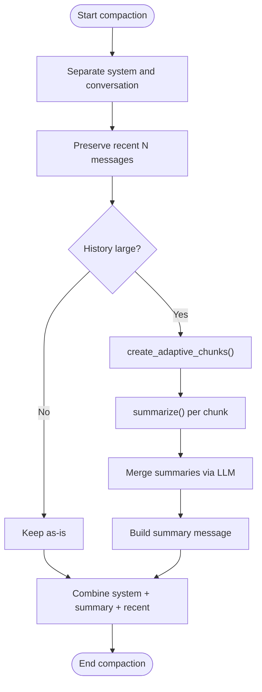

**Diagram sources**
- [compaction.py:494-594](file://src/ark_agentic/core/compaction.py#L494-L594)
- [compaction.py:396-492](file://src/ark_agentic/core/compaction.py#L396-L492)

**Section sources**
- [compaction.py:396-717](file://src/ark_agentic/core/compaction.py#L396-L717)

### Enhanced User Profile Management
- Heading-based markdown: MEMORY.md is parsed into preamble and sections keyed by heading with enhanced priority ordering
- Upsert semantics: new headings added, existing headings overwritten; empty-body headings trigger deletion
- Truncation: when exceeding token budget, content is truncated conservatively with a warning using HEADING_PRIORITY
- Enhanced priority system: identity > active preferences > persistent business preferences > risk preferences

**Updated** Enhanced with improved heading priority system and better truncation logic

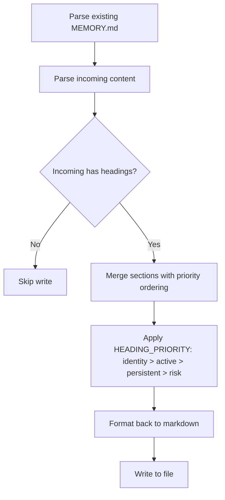

**Diagram sources**
- [user_profile.py:26-94](file://src/ark_agentic/core/memory/user_profile.py#L26-L94)
- [user_profile.py:106-137](file://src/ark_agentic/core/memory/user_profile.py#L106-L137)
- [manager.py:45-69](file://src/ark_agentic/core/memory/manager.py#L45-L69)

**Section sources**
- [user_profile.py:26-138](file://src/ark_agentic/core/memory/user_profile.py#L26-L138)
- [manager.py:45-69](file://src/ark_agentic/core/memory/manager.py#L45-L69)

### Enhanced SystemPromptBuilder: Improved Instruction Templates
- Dynamic prompt construction with enhanced instruction templates
- Unified memory instructions with MEMORY_FILTER_RULES integration
- Better section ordering with memory instructions placed after identity and runtime
- Enhanced user profile integration with improved formatting
- Quick build method with better memory control and section ordering

**Updated** Enhanced with improved instruction templates and better memory integration

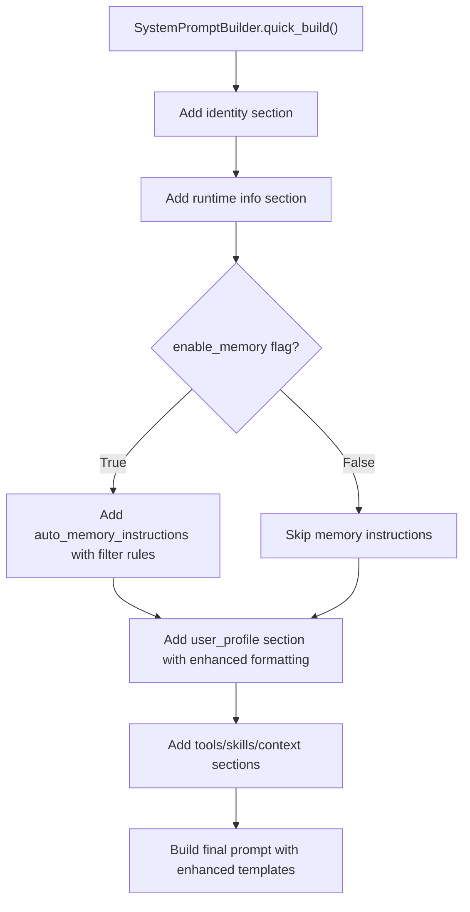

**Diagram sources**
- [builder.py:260-306](file://src/ark_agentic/core/prompt/builder.py#L260-L306)
- [builder.py:135-151](file://src/ark_agentic/core/prompt/builder.py#L135-L151)
- [rules.py:7-28](file://src/ark_agentic/core/memory/rules.py#L7-L28)

**Section sources**
- [builder.py:74-309](file://src/ark_agentic/core/prompt/builder.py#L74-L309)
- [rules.py:7-28](file://src/ark_agentic/core/memory/rules.py#L7-L28)

### Enhanced Memory Rules: Consistent Filter System
- Unified MEMORY_FILTER_RULES for consistent memory extraction across all components
- Clear distinction between records (long-term) and non-records (short-term/one-time)
- Enhanced decision-making examples with better positive/negative examples
- Integration with MemoryFlusher, MemoryDreamer, and memory_write tool

**New Section** Enhanced with comprehensive filter rules for consistent memory management

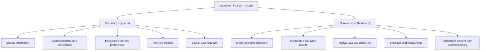

**Diagram sources**
- [rules.py:7-28](file://src/ark_agentic/core/memory/rules.py#L7-L28)

**Section sources**
- [rules.py:1-32](file://src/ark_agentic/core/memory/rules.py#L1-L32)

### Practical Examples

- Session state manipulation
  - Create a session and set initial state: [session.py:40-67](file://src/ark_agentic/core/session.py#L40-L67)
  - Update session state mid-run: [session.py:445-452](file://src/ark_agentic/core/session.py#L445-L452)
  - Clear messages while preserving system messages: [session.py:352-358](file://src/ark_agentic/core/session.py#L352-L358)

- Enhanced memory writing patterns
  - Write MEMORY.md with enhanced heading-level upsert and priority ordering: [manager.py:45-69](file://src/ark_agentic/core/memory/manager.py#L45-L69)
  - Extract and persist memory with improved filter rules: [extractor.py:153-188](file://src/ark_agentic/core/memory/extractor.py#L153-L188)
  - Apply enhanced truncation with priority preservation: [user_profile.py:106-137](file://src/ark_agentic/core/memory/user_profile.py#L106-L137)

- Optimizing memory usage
  - Enable automatic compaction when nearing thresholds: [session.py:415-431](file://src/ark_agentic/core/session.py#L415-L431)
  - Configure compression budgets and chunk sizes: [compaction.py:330-382](file://src/ark_agentic/core/compaction.py#L330-L382)
  - Use enhanced truncation with priority preservation: [user_profile.py:106-137](file://src/ark_agentic/core/memory/user_profile.py#L106-L137)

- Enhanced prompt building
  - Build system prompts with improved instruction templates: [builder.py:260-306](file://src/ark_agentic/core/prompt/builder.py#L260-L306)
  - Integrate memory instructions with filter rules: [builder.py:135-138](file://src/ark_agentic/core/prompt/builder.py#L135-L138)
  - Apply enhanced user profile formatting: [builder.py:140-151](file://src/ark_agentic/core/prompt/builder.py#L140-L151)

- Studio memory management
  - List memory files across workspaces: [memory.py:105-123](file://src/ark_agentic/studio/api/memory.py#L105-L123)
  - Read/write MEMORY.md content: [memory.py:125-159](file://src/ark_agentic/studio/api/memory.py#L125-L159)

**Section sources**
- [session.py:40-482](file://src/ark_agentic/core/session.py#L40-L482)
- [manager.py:41-69](file://src/ark_agentic/core/memory/manager.py#L41-L69)
- [extractor.py:153-188](file://src/ark_agentic/core/memory/extractor.py#L153-L188)
- [compaction.py:330-382](file://src/ark_agentic/core/compaction.py#L330-L382)
- [user_profile.py:106-137](file://src/ark_agentic/core/memory/user_profile.py#L106-L137)
- [builder.py:260-306](file://src/ark_agentic/core/prompt/builder.py#L260-L306)
- [memory.py:105-159](file://src/ark_agentic/studio/api/memory.py#L105-L159)

## Dependency Analysis
- SessionManager depends on TranscriptManager for JSONL persistence and SessionStore for metadata
- MemoryFlusher depends on MemoryManager, LLM, and MEMORY_FILTER_RULES to extract and write MEMORY.md
- MemoryDreamer depends on SessionStore and TranscriptManager to read recent sessions, on LLM to distill memory, and on HEADING_PRIORITY for truncation
- SystemPromptBuilder depends on MemoryManager for user profile content and MEMORY_FILTER_RULES for instruction templates
- ContextCompactor depends on LLM summarizer protocol and token estimation utilities

**Updated** Enhanced dependencies with unified filter rules and improved prompt building

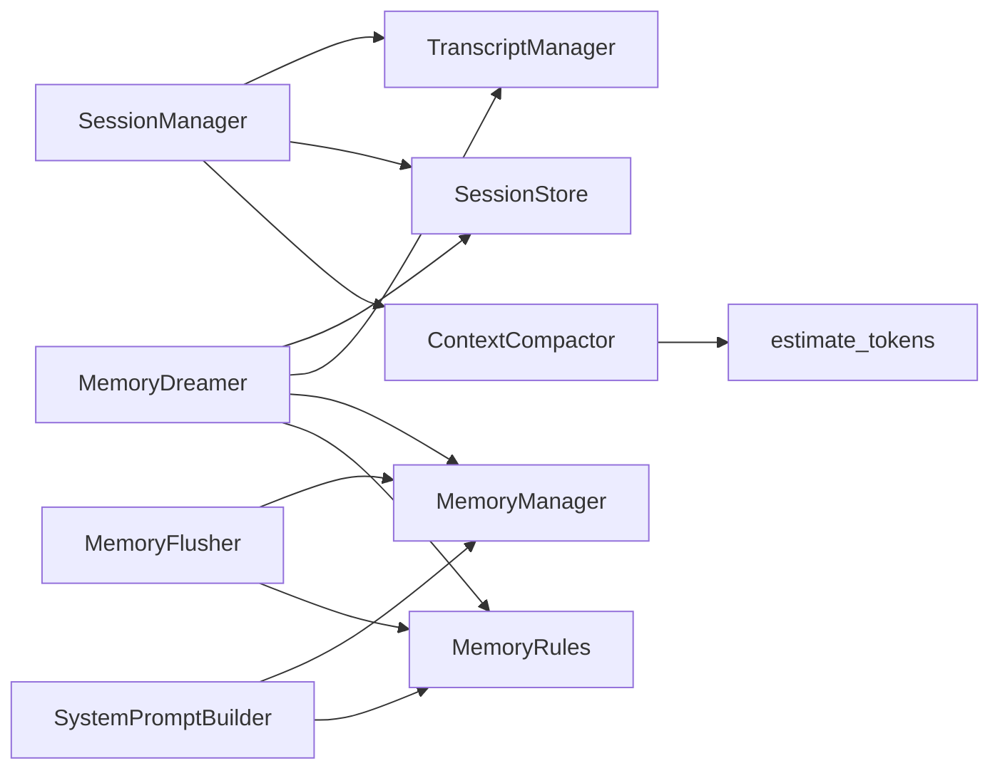

**Diagram sources**
- [session.py:24-482](file://src/ark_agentic/core/session.py#L24-L482)
- [persistence.py:388-783](file://src/ark_agentic/core/persistence.py#L388-L783)
- [compaction.py:396-717](file://src/ark_agentic/core/compaction.py#L396-L717)
- [manager.py:24-92](file://src/ark_agentic/core/memory/manager.py#L24-L92)
- [extractor.py:99-188](file://src/ark_agentic/core/memory/extractor.py#L99-L188)
- [dream.py:189-322](file://src/ark_agentic/core/memory/dream.py#L189-L322)
- [builder.py:74-309](file://src/ark_agentic/core/prompt/builder.py#L74-L309)
- [rules.py:1-32](file://src/ark_agentic/core/memory/rules.py#L1-L32)

**Section sources**
- [session.py:24-482](file://src/ark_agentic/core/session.py#L24-L482)
- [persistence.py:388-783](file://src/ark_agentic/core/persistence.py#L388-L783)
- [compaction.py:396-717](file://src/ark_agentic/core/compaction.py#L396-L717)
- [manager.py:24-92](file://src/ark_agentic/core/memory/manager.py#L24-L92)
- [extractor.py:99-188](file://src/ark_agentic/core/memory/extractor.py#L99-L188)
- [dream.py:189-322](file://src/ark_agentic/core/memory/dream.py#L189-L322)
- [builder.py:74-309](file://src/ark_agentic/core/prompt/builder.py#L74-L309)
- [rules.py:1-32](file://src/ark_agentic/core/memory/rules.py#L1-L32)

## Performance Considerations
- Token estimation safety margin: 20% buffer is applied to avoid overflows
- Adaptive chunking: dynamically adjusts chunk ratios based on average message size and context window
- Summary fallback: when LLM summarization fails, a simple truncation fallback ensures progress
- File locking: JSONL and sessions.json are protected with cross-platform file locks to prevent corruption
- Caching: SessionStore caches per-user stores with TTL to reduce disk IO
- Enhanced filtering: MEMORY_FILTER_RULES reduces unnecessary LLM calls and improves extraction quality
- Priority-based truncation: HEADING_PRIORITY ensures critical information is preserved during memory compression

**Updated** Enhanced with improved filtering and truncation performance optimizations

## Troubleshooting Guide
- JSONL corruption prevention: trailing newline enforcement before append to avoid malformed lines
- Lock acquisition timeouts and stale locks: FileLock handles platform differences and removes stale locks after a threshold
- Session load failures: TranscriptManager gracefully skips invalid JSON lines and logs warnings
- Enhanced Dream parsing failures: MemoryDreamer logs warnings when LLM returns non-JSON and falls back to no-op
- Improved Flush parsing failures: MemoryFlusher logs debug info when LLM returns non-JSON and skips write
- Filter rule consistency: MEMORY_FILTER_RULES ensures consistent extraction across all components
- Priority truncation warnings: Enhanced truncation preserves critical sections and logs warnings when content is reduced

**Updated** Enhanced with improved error handling and consistency checks

**Section sources**
- [persistence.py:414-423](file://src/ark_agentic/core/persistence.py#L414-L423)
- [persistence.py:283-383](file://src/ark_agentic/core/persistence.py#L283-L383)
- [persistence.py:484-503](file://src/ark_agentic/core/persistence.py#L484-L503)
- [dream.py:223-234](file://src/ark_agentic/core/memory/dream.py#L223-L234)
- [extractor.py:135-144](file://src/ark_agentic/core/memory/extractor.py#L135-L144)
- [rules.py:7-28](file://src/ark_agentic/core/memory/rules.py#L7-L28)
- [user_profile.py:133-137](file://src/ark_agentic/core/memory/user_profile.py#L133-L137)

## Conclusion
The system cleanly separates raw session transcripts from durable memory, with a robust pipeline for extracting and distilling long-term knowledge. Enhanced memory management provides better profile extraction through improved filtering rules and systematic prompt building with enhanced instruction templates. SessionManager coordinates message lifecycle, compression, and persistence, while MemoryFlusher and MemoryDreamer ensure that MEMORY.md remains concise, accurate, and aligned with recent interactions. The enhanced SystemPromptBuilder integrates memory instructions seamlessly into system prompts. ContextCompactor maintains model context within budget using adaptive chunking and LLM summarization. Together, these components provide a scalable and maintainable foundation for session and memory management with improved consistency and reliability.

## Appendices

### Configuration Options

- Compression thresholds and budgets
  - Context window, output reserve, system reserve, target tokens, trigger threshold, history share
  - Reference: [compaction.py:330-382](file://src/ark_agentic/core/compaction.py#L330-L382)

- Dream scheduling
  - Minimum hours since last dream and minimum sessions since last dream to qualify for a dream cycle
  - Reference: [dream.py:146-175](file://src/ark_agentic/core/memory/dream.py#L146-L175)

- Enhanced memory retention and truncation
  - Maximum tokens for user profile truncation with HEADING_PRIORITY
  - Reference: [user_profile.py:106-137](file://src/ark_agentic/core/memory/user_profile.py#L106-L137)

- Enhanced memory filter rules
  - Unified MEMORY_FILTER_RULES for consistent extraction across all components
  - Reference: [rules.py:7-28](file://src/ark_agentic/core/memory/rules.py#L7-L28)

- Enhanced prompt building
  - SystemPromptBuilder with improved instruction templates and better section ordering
  - Reference: [builder.py:260-306](file://src/ark_agentic/core/prompt/builder.py#L260-L306)

- Studio memory API
  - Listing and editing MEMORY.md files within an agent's workspace
  - Reference: [memory.py:105-159](file://src/ark_agentic/studio/api/memory.py#L105-L159)