# Session Management

<cite>
**Referenced Files in This Document**
- [session.py](file://src/ark_agentic/core/session.py)
- [persistence.py](file://src/ark_agentic/core/persistence.py)
- [types.py](file://src/ark_agentic/core/types.py)
- [compaction.py](file://src/ark_agentic/core/compaction.py)
- [history_merge.py](file://src/ark_agentic/core/history_merge.py)
- [runner.py](file://src/ark_agentic/core/runner.py)
- [sessions.py](file://src/ark_agentic/studio/api/sessions.py)
- [app.py](file://src/ark_agentic/app.py)
- [dream.py](file://src/ark_agentic/core/memory/dream.py)
- [manager.py](file://src/ark_agentic/core/memory/manager.py)
- [test_session.py](file://tests/unit/core/test_session.py)
- [test_dream.py](file://tests/unit/core/test_dream.py)
- [test_studio_sessions_memory.py](file://tests/integration/test_studio_sessions_memory.py)
</cite>

## Update Summary
**Changes Made**
- Added Windows-specific optimizations section documenting certificate probing middleware
- Updated environment variable controls section for Dream functionality
- Enhanced session lifecycle documentation with Dream integration
- Added Windows event loop optimization for improved stability
- Updated performance considerations with Dream-related optimizations

## Table of Contents
1. [Introduction](#introduction)
2. [Project Structure](#project-structure)
3. [Core Components](#core-components)
4. [Architecture Overview](#architecture-overview)
5. [Detailed Component Analysis](#detailed-component-analysis)
6. [Windows-Specific Optimizations](#windows-specific-optimizations)
7. [Environment Variable Controls](#environment-variable-controls)
8. [Dependency Analysis](#dependency-analysis)
9. [Performance Considerations](#performance-considerations)
10. [Troubleshooting Guide](#troubleshooting-guide)
11. [Conclusion](#conclusion)
12. [Appendices](#appendices)

## Introduction
This document provides comprehensive coverage of the session management system in the ark-agentic project. It focuses on the SessionManager class architecture, session lifecycle operations (create, load, delete, sync), and state persistence mechanisms. The system uses a dual-layer persistence model: TranscriptManager for message storage and SessionStore for metadata. We explain synchronous versus asynchronous operations, session state management, token usage tracking, and message operations including injection and clearing. Practical examples demonstrate session creation patterns, state updates, and proper cleanup procedures. Configuration options for session retention, automatic cleanup, and performance optimization strategies are documented.

**Updated** Enhanced with Windows-specific optimizations and Dream functionality integration for improved memory handling and cross-platform compatibility.

## Project Structure
The session management system spans several core modules:
- Session lifecycle and orchestration: SessionManager
- Persistence layer: TranscriptManager (message JSONL) and SessionStore (metadata JSON)
- Supporting types and utilities: AgentMessage, SessionEntry, TokenUsage, CompactionConfig
- Context compression: ContextCompactor and related utilities
- External history merging: InsertOp and merge operations
- Integration with the runtime: AgentRunner and Studio API
- Memory management: MemoryDreamer for periodic distillation
- Application layer: Windows-specific optimizations and environment controls

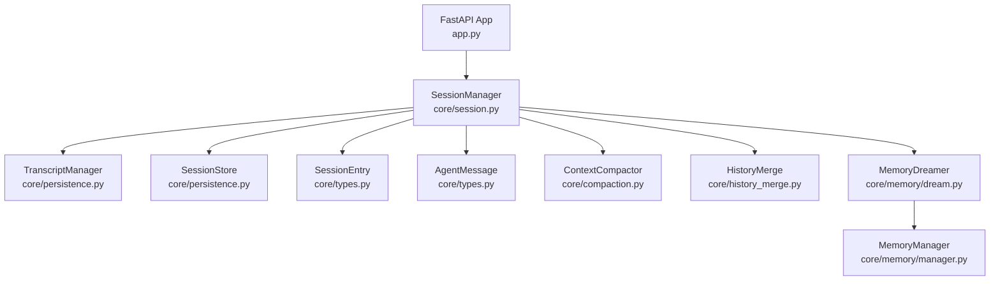

**Diagram sources**
- [session.py:24-482](file://src/ark_agentic/core/session.py#L24-L482)
- [persistence.py:388-783](file://src/ark_agentic/core/persistence.py#L388-L783)
- [types.py:342-413](file://src/ark_agentic/core/types.py#L342-L413)
- [compaction.py:396-717](file://src/ark_agentic/core/compaction.py#L396-L717)
- [history_merge.py:22-243](file://src/ark_agentic/core/history_merge.py#L22-L243)
- [dream.py:190-323](file://src/ark_agentic/core/memory/dream.py#L190-L323)
- [manager.py:24-92](file://src/ark_agentic/core/memory/manager.py#L24-L92)
- [app.py:141-234](file://src/ark_agentic/app.py#L141-L234)

**Section sources**
- [session.py:1-482](file://src/ark_agentic/core/session.py#L1-L482)
- [persistence.py:1-783](file://src/ark_agentic/core/persistence.py#L1-L783)
- [types.py:1-413](file://src/ark_agentic/core/types.py#L1-L413)
- [compaction.py:1-717](file://src/ark_agentic/core/compaction.py#L1-L717)
- [history_merge.py:1-243](file://src/ark_agentic/core/history_merge.py#L1-L243)
- [dream.py:1-323](file://src/ark_agentic/core/memory/dream.py#L1-L323)
- [manager.py:1-92](file://src/ark_agentic/core/memory/manager.py#L1-L92)
- [app.py:1-234](file://src/ark_agentic/app.py#L1-L234)

## Core Components
- SessionManager: Central orchestrator for session lifecycle, message operations, token usage, compaction, and synchronization with persistence.
- TranscriptManager: Manages message storage in JSONL format with file locking and validation.
- SessionStore: Maintains per-user metadata index (sessions.json) with caching and file locking.
- SessionEntry: In-memory representation of a session with messages, token usage, compaction stats, active skills, and state.
- AgentMessage: Typed message model with roles, tool calls/results, thinking, and metadata.
- ContextCompactor: Implements adaptive chunking, summarization, and staged compression.
- HistoryMerge: Computes insertion operations for external history merging.
- MemoryDreamer: Periodic memory distillation system for session consolidation.
- MemoryManager: Lightweight memory management for user profiles and distilled content.

**Updated** Added MemoryDreamer and MemoryManager components for enhanced memory management capabilities.

**Section sources**
- [session.py:24-482](file://src/ark_agentic/core/session.py#L24-L482)
- [persistence.py:388-783](file://src/ark_agentic/core/persistence.py#L388-L783)
- [types.py:190-413](file://src/ark_agentic/core/types.py#L190-L413)
- [compaction.py:396-717](file://src/ark_agentic/core/compaction.py#L396-L717)
- [history_merge.py:155-243](file://src/ark_agentic/core/history_merge.py#L155-L243)
- [dream.py:190-323](file://src/ark_agentic/core/memory/dream.py#L190-L323)
- [manager.py:24-92](file://src/ark_agentic/core/memory/manager.py#L24-L92)

## Architecture Overview
The session management architecture follows a dual-layer persistence design with enhanced memory management:
- Layer 1 (TranscriptManager): Stores message history in JSONL files with strict validation and file locking to prevent corruption.
- Layer 2 (SessionStore): Stores lightweight metadata per user in sessions.json, enabling quick listing and indexing.
- Layer 3 (MemoryDreamer): Periodically distills session data into structured MEMORY.md files for long-term retention.

SessionManager coordinates between these layers and the in-memory SessionEntry, providing:
- Synchronous operations for immediate in-memory updates (e.g., add_message_sync, delete_session_sync)
- Asynchronous operations for disk-backed persistence (e.g., create_session, add_message, load_session, sync_session_state)
- Automatic Dream integration for periodic memory consolidation

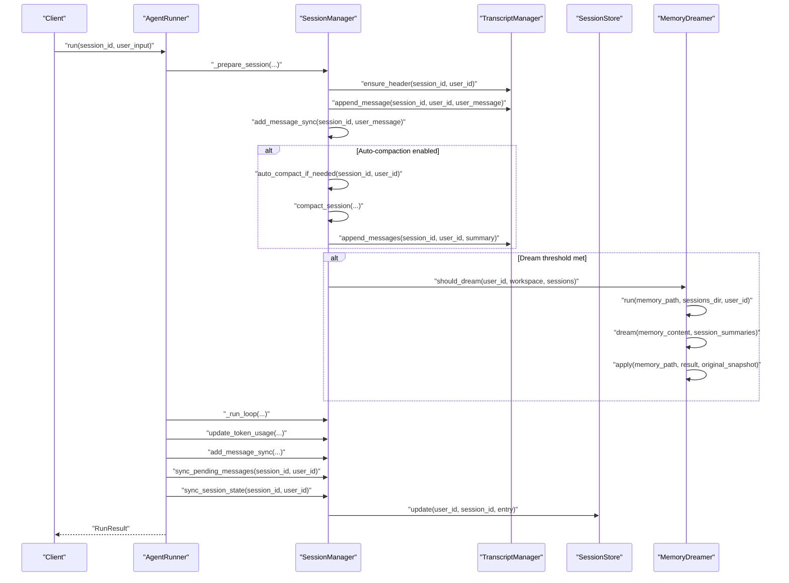

**Diagram sources**
- [runner.py:240-409](file://src/ark_agentic/core/runner.py#L240-L409)
- [session.py:40-262](file://src/ark_agentic/core/session.py#L40-L262)
- [persistence.py:440-783](file://src/ark_agentic/core/persistence.py#L440-L783)
- [dream.py:289-323](file://src/ark_agentic/core/memory/dream.py#L289-L323)

## Detailed Component Analysis

### SessionManager Class
SessionManager encapsulates session lifecycle and persistence coordination. Key responsibilities:
- Session lifecycle: create, load, delete, reload, list
- Message operations: add, inject, clear, get
- Token usage tracking and estimation
- Context compaction and auto-compaction
- Synchronization of pending messages and session state to disk
- Integration with MemoryDreamer for periodic memory consolidation

**Updated** Enhanced with Dream integration points and improved Windows compatibility.

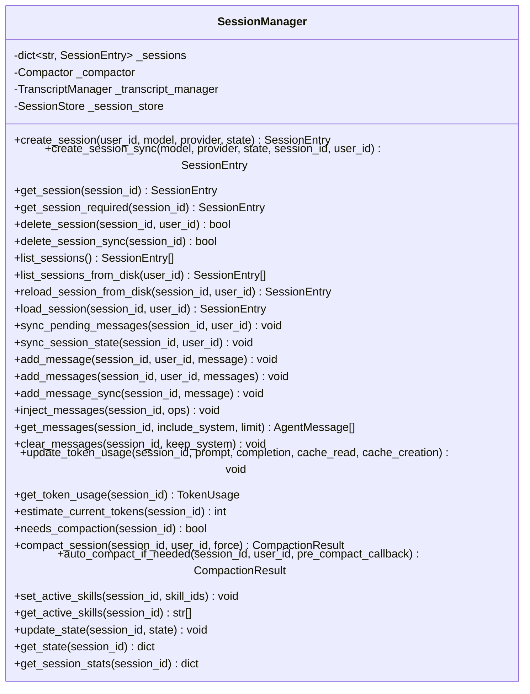

**Diagram sources**
- [session.py:24-482](file://src/ark_agentic/core/session.py#L24-L482)

**Section sources**
- [session.py:24-482](file://src/ark_agentic/core/session.py#L24-L482)

### Dual-Layer Persistence System
- TranscriptManager (message storage)
  - Ensures session header exists before appending messages
  - Serializes/deserializes AgentMessage to/from JSONL
  - Validates file integrity and enforces trailing newline
  - Provides file locking to prevent concurrent writes
  - Supports raw read/write with validation
- SessionStore (metadata storage)
  - Per-user sessions.json index with caching
  - File locking for atomic updates
  - Stores model/provider, token usage, compaction counts, active skills, and state

**Updated** Enhanced with improved Windows file locking mechanisms and memory handling optimizations.

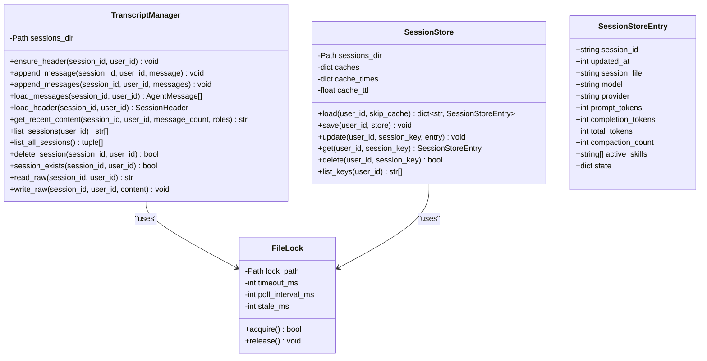

**Diagram sources**
- [persistence.py:388-783](file://src/ark_agentic/core/persistence.py#L388-L783)

**Section sources**
- [persistence.py:388-783](file://src/ark_agentic/core/persistence.py#L388-L783)

### Message Operations and Injection
- add_message/add_messages: Append to both in-memory session and JSONL file
- add_message_sync: Adds to in-memory session and queues for later persistence
- inject_messages: Inserts external messages at anchor-resolved positions using InsertOp semantics
- clear_messages: Clears messages while optionally preserving system messages
- get_messages: Retrieves messages with filtering and limiting

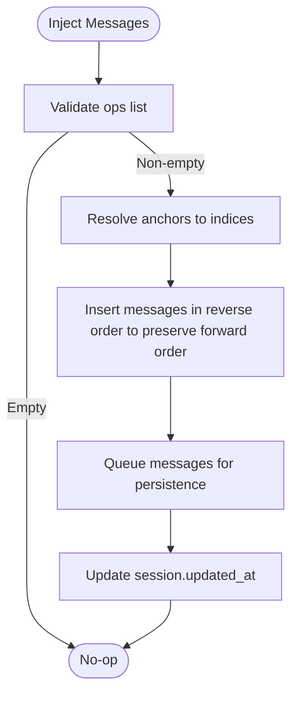

**Diagram sources**
- [session.py:291-334](file://src/ark_agentic/core/session.py#L291-L334)
- [history_merge.py:155-243](file://src/ark_agentic/core/history_merge.py#L155-L243)

**Section sources**
- [session.py:265-359](file://src/ark_agentic/core/session.py#L265-L359)
- [history_merge.py:22-243](file://src/ark_agentic/core/history_merge.py#L22-L243)

### Token Usage Tracking and Estimation
- update_token_usage: Updates cumulative token usage counters
- get_token_usage: Returns current TokenUsage snapshot
- estimate_current_tokens: Estimates total tokens in current session using message token estimates

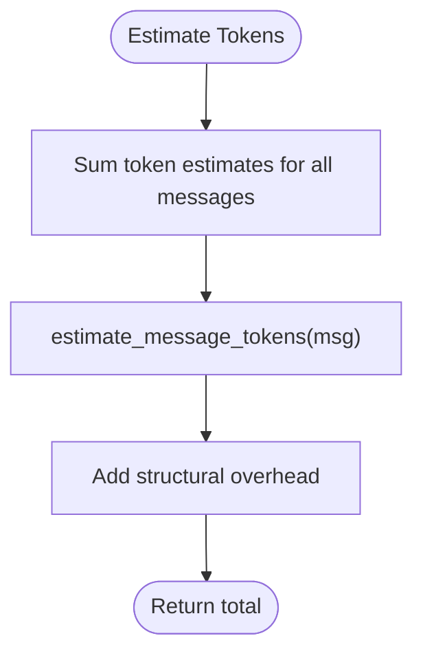

**Diagram sources**
- [session.py:377-379](file://src/ark_agentic/core/session.py#L377-L379)
- [compaction.py:61-84](file://src/ark_agentic/core/compaction.py#L61-L84)

**Section sources**
- [session.py:362-379](file://src/ark_agentic/core/session.py#L362-L379)
- [compaction.py:33-84](file://src/ark_agentic/core/compaction.py#L33-L84)

### Context Compression and Auto-Compaction
- needs_compaction: Determines if compression is needed based on configured thresholds
- compact_session: Performs staged compression with adaptive chunking and summarization
- auto_compact_if_needed: Runs pre-compaction callback and triggers compaction when needed

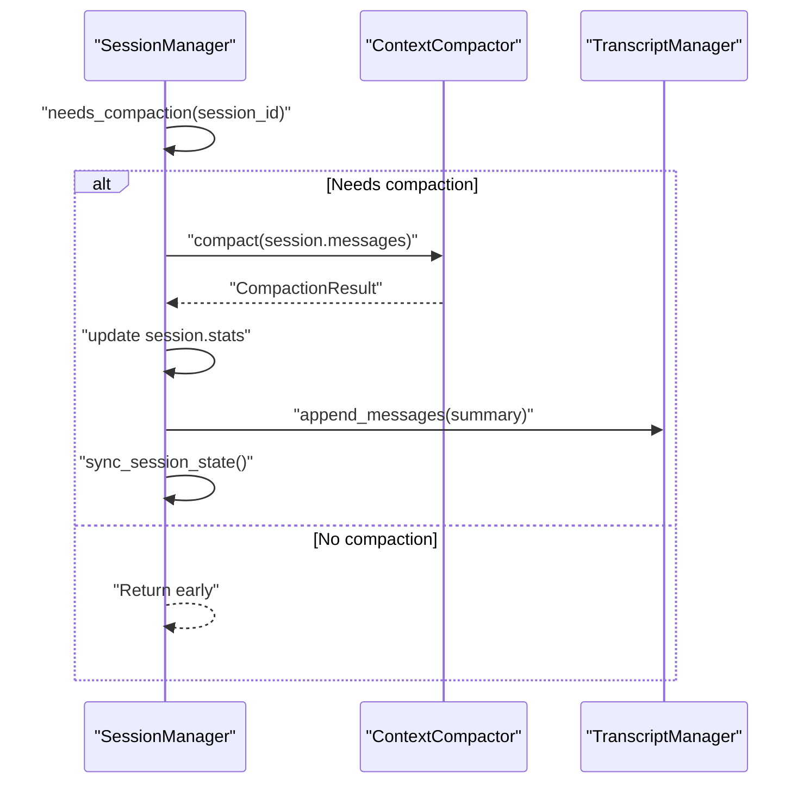

**Diagram sources**
- [session.py:383-431](file://src/ark_agentic/core/session.py#L383-L431)
- [compaction.py:425-493](file://src/ark_agentic/core/compaction.py#L425-L493)

**Section sources**
- [session.py:383-431](file://src/ark_agentic/core/session.py#L383-L431)
- [compaction.py:329-493](file://src/ark_agentic/core/compaction.py#L329-L493)

### Synchronous vs Asynchronous Operations
- Synchronous operations (suffix _sync):
  - create_session_sync: Creates in-memory session only
  - add_message_sync: Adds to in-memory session and queues for later persistence
  - delete_session_sync: Removes from memory only
- Asynchronous operations:
  - create_session: Creates in-memory session and persists header and metadata
  - add_message/add_messages: Persist immediately to JSONL
  - sync_pending_messages: Flushes queued messages to JSONL
  - sync_session_state: Persists metadata to sessions.json

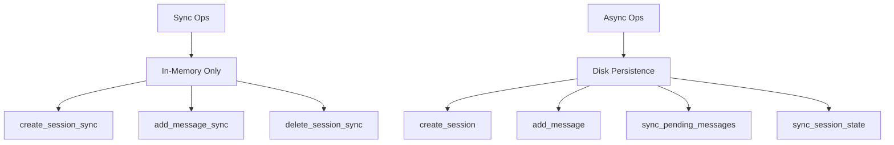

**Diagram sources**
- [session.py:69-122](file://src/ark_agentic/core/session.py#L69-L122)
- [session.py:40-122](file://src/ark_agentic/core/session.py#L40-L122)

**Section sources**
- [session.py:69-122](file://src/ark_agentic/core/session.py#L69-L122)
- [session.py:229-262](file://src/ark_agentic/core/session.py#L229-L262)

### Session State Management
- update_state/get_state: Merge/update and retrieve session state
- strip_temp_state: Cleans temporary keys (e.g., temp:*) during finalization
- get_session_stats: Aggregates session metrics for monitoring

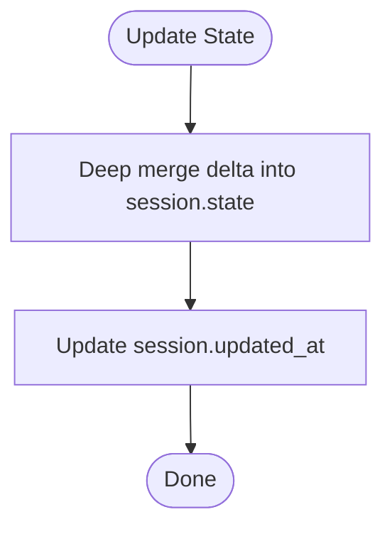

**Diagram sources**
- [types.py:401-413](file://src/ark_agentic/core/types.py#L401-L413)
- [session.py:445-453](file://src/ark_agentic/core/session.py#L445-L453)

**Section sources**
- [types.py:401-413](file://src/ark_agentic/core/types.py#L401-L413)
- [session.py:445-481](file://src/ark_agentic/core/session.py#L445-L481)

### Practical Examples

#### Session Creation Patterns
- Create a new session with persistence:
  - Use create_session(user_id, model, provider, state) to create in-memory and disk-backed session
  - Use create_session_sync(...) for ephemeral/in-memory-only sessions
- Subtask sessions:
  - Pass custom session_id (e.g., parent:sub:hex) and inherit user_id for subtasks

**Section sources**
- [session.py:40-92](file://src/ark_agentic/core/session.py#L40-L92)
- [test_session.py:18-81](file://tests/unit/core/test_session.py#L18-L81)

#### State Updates and Cleanup
- Update session state during runtime:
  - update_state(session_id, {"key": "value"})
- Clear messages while preserving system messages:
  - clear_messages(session_id, keep_system=True)
- Proper cleanup:
  - delete_session(session_id, user_id) removes both in-memory and disk state
  - delete_session_sync(session_id) removes only in-memory state

**Section sources**
- [session.py:445-122](file://src/ark_agentic/core/session.py#L445-L122)
- [test_session.py:112-129](file://tests/unit/core/test_session.py#L112-L129)

#### Message Operations and Injection
- Add messages synchronously and flush later:
  - add_message_sync(session_id, message)
  - sync_pending_messages(session_id, user_id)
- Inject external history:
  - Compute InsertOps via merge_external_history
  - Apply with inject_messages(session_id, ops)

**Section sources**
- [session.py:279-334](file://src/ark_agentic/core/session.py#L279-L334)
- [history_merge.py:155-243](file://src/ark_agentic/core/history_merge.py#L155-L243)

### Studio API Integration
The Studio API exposes session listing and detail endpoints that rely on SessionManager:
- list_agent_sessions: Lists sessions from disk using list_sessions_from_disk
- get_session_detail: Loads session detail via load_session
- raw endpoints: Read/write session JSONL directly with validation

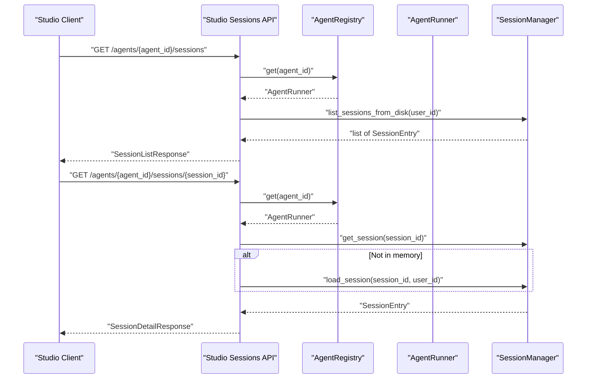

**Diagram sources**
- [sessions.py:84-144](file://src/ark_agentic/studio/api/sessions.py#L84-L144)
- [runner.py:19-28](file://src/ark_agentic/core/runner.py#L19-L28)

**Section sources**
- [sessions.py:84-144](file://src/ark_agentic/studio/api/sessions.py#L84-L144)
- [runner.py:19-28](file://src/ark_agentic/core/runner.py#L19-L28)

## Windows-Specific Optimizations

### Certificate Probing Middleware
The application layer includes specialized middleware to handle Windows Update certificate probing requests that can generate unwanted log noise. This middleware intercepts requests to `/msdownload/update/` paths and responds with HTTP 204 (No Content) to prevent certificate revocation list requests from being logged as invalid HTTP requests.

**Section sources**
- [app.py:156-163](file://src/ark_agentic/app.py#L156-L163)

### Event Loop Optimization
The application automatically switches to WindowsSelectorEventLoopPolicy on Windows platforms to address OSError: [WinError 64] exceptions that occur during abrupt client disconnects. This prevents spurious error logs and improves stability on Windows environments.

**Section sources**
- [app.py:214-218](file://src/ark_agentic/app.py#L214-L218)

### File Locking Enhancements
The FileLock implementation includes platform-specific optimizations for Windows file locking mechanisms. The implementation uses file existence checks combined with write locks and automatic cleanup of stale locks to prevent deadlocks and improve reliability on Windows systems.

**Section sources**
- [persistence.py:294-305](file://src/ark_agentic/core/persistence.py#L294-L305)

## Environment Variable Controls

### Dream Functionality Control
The system provides comprehensive environment variable controls for enabling and configuring Dream functionality across agents:

- ENABLE_DREAM: Controls whether Dream functionality is enabled globally (defaults to True when not set)
- ENABLE_MEMORY: Enables memory system integration with Dream
- ENABLE_THINKING_TAGS: Enables thinking tag processing for enhanced memory extraction

These variables are processed during application startup to configure agent runners with appropriate Dream settings.

**Section sources**
- [app.py:102-111](file://src/ark_agentic/app.py#L102-L111)

### Dream Configuration Parameters
The AgentRunner class includes configurable Dream parameters:
- dream_min_sessions: Minimum number of sessions required to trigger Dream (default: 5)
- enable_dream: Global switch for Dream functionality (default: True)

**Section sources**
- [runner.py:123-127](file://src/ark_agentic/core/runner.py#L123-L127)

## Dependency Analysis
Key dependencies and relationships:
- SessionManager depends on TranscriptManager and SessionStore for persistence
- SessionManager uses ContextCompactor for compression and compaction statistics
- SessionManager uses history_merge.merge_external_history for external history injection
- SessionManager integrates with MemoryDreamer for periodic memory consolidation
- AgentRunner orchestrates session lifecycle during runs and triggers sync operations
- Application layer provides Windows-specific optimizations and environment variable controls

**Updated** Enhanced with MemoryDreamer integration and Windows-specific optimizations.

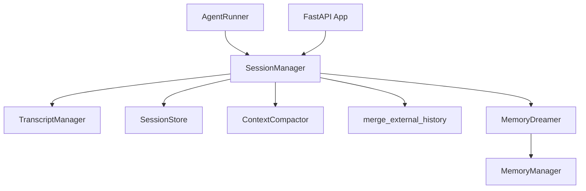

**Diagram sources**
- [session.py:24-482](file://src/ark_agentic/core/session.py#L24-L482)
- [compaction.py:396-717](file://src/ark_agentic/core/compaction.py#L396-L717)
- [history_merge.py:155-243](file://src/ark_agentic/core/history_merge.py#L155-L243)
- [runner.py:153-409](file://src/ark_agentic/core/runner.py#L153-L409)
- [dream.py:190-323](file://src/ark_agentic/core/memory/dream.py#L190-L323)
- [manager.py:24-92](file://src/ark_agentic/core/memory/manager.py#L24-L92)
- [app.py:141-234](file://src/ark_agentic/app.py#L141-L234)

**Section sources**
- [session.py:24-482](file://src/ark_agentic/core/session.py#L24-L482)
- [compaction.py:396-717](file://src/ark_agentic/core/compaction.py#L396-L717)
- [history_merge.py:155-243](file://src/ark_agentic/core/history_merge.py#L155-L243)
- [runner.py:153-409](file://src/ark_agentic/core/runner.py#L153-L409)
- [dream.py:190-323](file://src/ark_agentic/core/memory/dream.py#L190-L323)
- [manager.py:24-92](file://src/ark_agentic/core/memory/manager.py#L24-L92)
- [app.py:141-234](file://src/ark_agentic/app.py#L141-L234)

## Performance Considerations
- Asynchronous persistence: Prefer async operations (create_session, add_message, sync_session_state) for throughput; use sync variants only for ephemeral or internal operations.
- Pending message batching: Use add_message_sync followed by sync_pending_messages to batch writes and reduce I/O overhead.
- Compression thresholds: Tune CompactionConfig to balance memory usage and performance; adjust trigger_threshold and target_tokens for workload characteristics.
- File locking: FileLock minimizes contention; ensure minimal lock duration by batching writes.
- Metadata caching: SessionStore caches per-user sessions.json for a TTL; avoid frequent reads when writes are expected.
- Token estimation: estimate_message_tokens provides a fast approximation; production systems may want to integrate a tokenizer for accuracy.
- Dream optimization: MemoryDreamer provides periodic consolidation that reduces long-term storage overhead and improves retrieval performance.
- Windows optimizations: Event loop switching and certificate probing middleware reduce resource consumption and improve stability on Windows platforms.

**Updated** Added Dream-related optimizations and Windows-specific performance improvements.

## Troubleshooting Guide
Common issues and resolutions:
- Session not found:
  - Ensure load_session is called with correct user_id; otherwise, it may return None
- JSONL validation errors:
  - Raw JSONL must start with a session header and subsequent lines must be message entries
  - write_raw validates type, id, and message structure; check line_number in error details
- Lock acquisition timeouts:
  - FileLock waits with timeout; stale locks are cleaned up after stale_ms; verify filesystem permissions
  - On Windows, check for file system compatibility and antivirus interference
- Excessive memory usage:
  - Enable auto_compact and tune CompactionConfig thresholds to reduce token usage
  - Configure Dream functionality to periodically consolidate memory
- State not persisting:
  - Ensure sync_session_state is called after updates; for pending messages, call sync_pending_messages
- Windows-specific issues:
  - Certificate probe errors: Verify middleware is properly configured for Windows Update traffic
  - Event loop errors: Ensure proper event loop policy is set for Windows environments
- Dream failures:
  - Monitor dream failure thresholds and retry logic
  - Check LLM availability and token limits for Dream operations

**Updated** Added Windows-specific troubleshooting and Dream-related diagnostics.

**Section sources**
- [session.py:184-227](file://src/ark_agentic/core/session.py#L184-L227)
- [persistence.py:594-631](file://src/ark_agentic/core/persistence.py#L594-L631)
- [persistence.py:283-383](file://src/ark_agentic/core/persistence.py#L283-L383)
- [app.py:156-163](file://src/ark_agentic/app.py#L156-L163)
- [runner.py:528-553](file://src/ark_agentic/core/runner.py#L528-L553)

## Conclusion
The session management system provides a robust, dual-layer persistence model with clear separation of concerns and enhanced Windows-specific optimizations. SessionManager centralizes lifecycle operations, message handling, token accounting, and compression, while TranscriptManager and SessionStore handle reliable disk-backed storage. The system supports both synchronous and asynchronous patterns, enabling efficient in-memory operations and safe persistence. The integration of MemoryDreamer provides periodic memory consolidation for improved long-term storage efficiency. Windows-specific optimizations including certificate probing middleware and event loop switching enhance cross-platform compatibility and stability. Proper configuration of compaction, metadata caching, and Dream functionality ensures optimal performance and scalability across diverse deployment environments.

**Updated** Enhanced conclusion to reflect Windows optimizations and Dream integration capabilities.

## Appendices

### Configuration Options
- CompactionConfig (ContextCompactor):
  - context_window: Upper bound for token budget
  - output_reserve: Reserved tokens for model output
  - system_reserve: Reserved tokens for system prompts
  - trigger_threshold: Ratio threshold to trigger compaction
  - preserve_recent: Number of latest messages to keep unmodified
  - target_chunk_tokens, max_chunk_tokens: Chunk sizing for summarization
  - summary_max_tokens: Maximum tokens for generated summaries
- SessionStore caching:
  - cache_ttl: Cache validity period in seconds
- FileLock:
  - timeout_ms, poll_interval_ms, stale_ms: Lock acquisition and staleness policies
- Dream Configuration:
  - dream_min_sessions: Minimum sessions required to trigger Dream (default: 5)
  - enable_dream: Global Dream switch (default: True)
- Environment Variables:
  - ENABLE_DREAM: Enable/disable Dream functionality
  - ENABLE_MEMORY: Enable memory system integration
  - ENABLE_THINKING_TAGS: Enable thinking tag processing

**Updated** Added Dream configuration options and environment variable controls.

**Section sources**
- [compaction.py:330-382](file://src/ark_agentic/core/compaction.py#L330-L382)
- [persistence.py:696-709](file://src/ark_agentic/core/persistence.py#L696-L709)
- [persistence.py:269-383](file://src/ark_agentic/core/persistence.py#L269-L383)
- [runner.py:123-127](file://src/ark_agentic/core/runner.py#L123-L127)
- [app.py:102-111](file://src/ark_agentic/app.py#L102-L111)

### API Endpoints (Studio)
- GET /api/studio/agents/{agent_id}/sessions
  - Lists sessions from disk; optional user_id filter
- GET /api/studio/agents/{agent_id}/sessions/{session_id}
  - Returns session detail and messages
- GET /api/studio/agents/{agent_id}/sessions/{session_id}/raw
  - Returns raw JSONL content
- PUT /api/studio/agents/{agent_id}/sessions/{session_id}/raw
  - Validates and writes raw JSONL; reloads session after write

**Section sources**
- [sessions.py:84-200](file://src/ark_agentic/studio/api/sessions.py#L84-L200)

### Windows-Specific Features
- Certificate Probing Middleware: Silently handles Windows Update certificate requests
- Event Loop Optimization: Automatic WindowsSelectorEventLoopPolicy selection
- File Locking: Platform-specific lock management for improved reliability
- Log Level Control: Reduced logging noise for Windows-specific HTTP warnings

**Section sources**
- [app.py:156-163](file://src/ark_agentic/app.py#L156-L163)
- [app.py:214-218](file://src/ark_agentic/app.py#L214-L218)
- [persistence.py:294-305](file://src/ark_agentic/core/persistence.py#L294-L305)