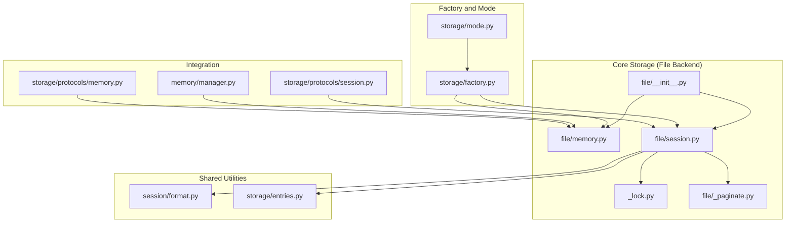
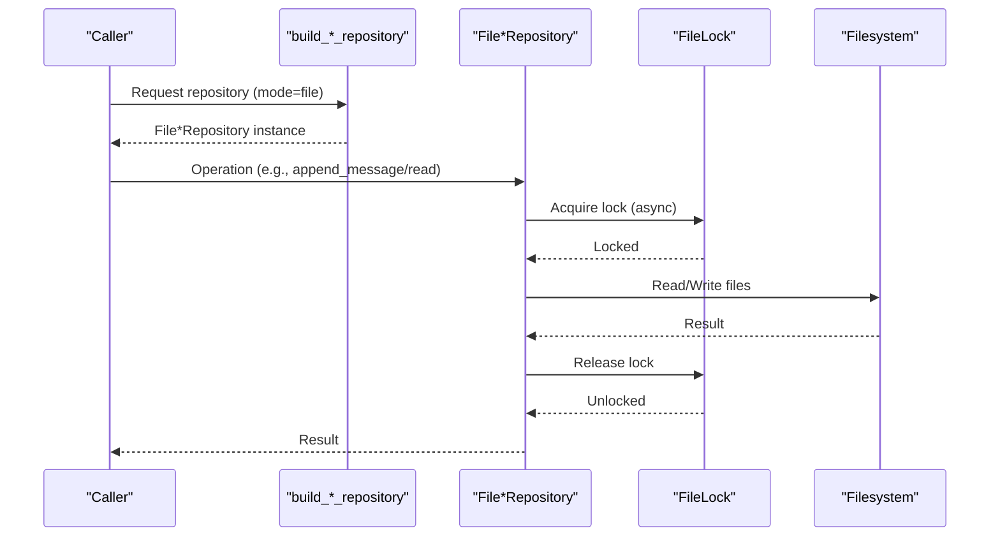
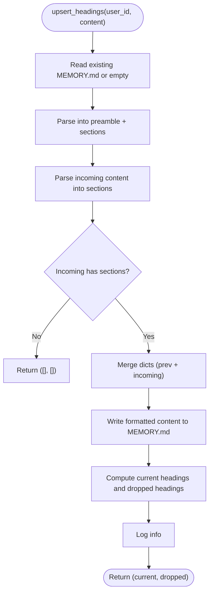
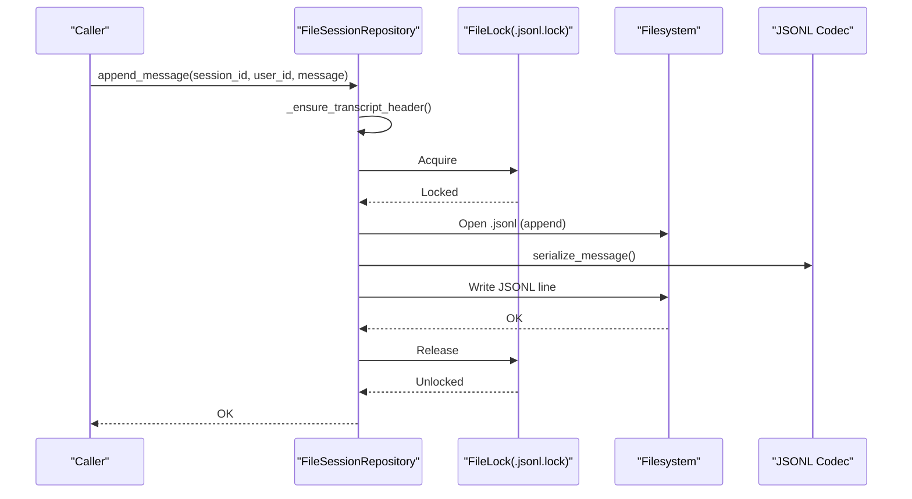
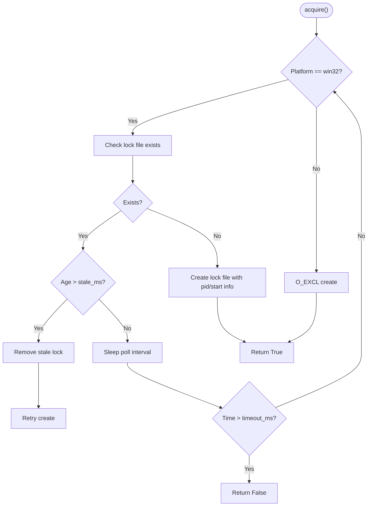
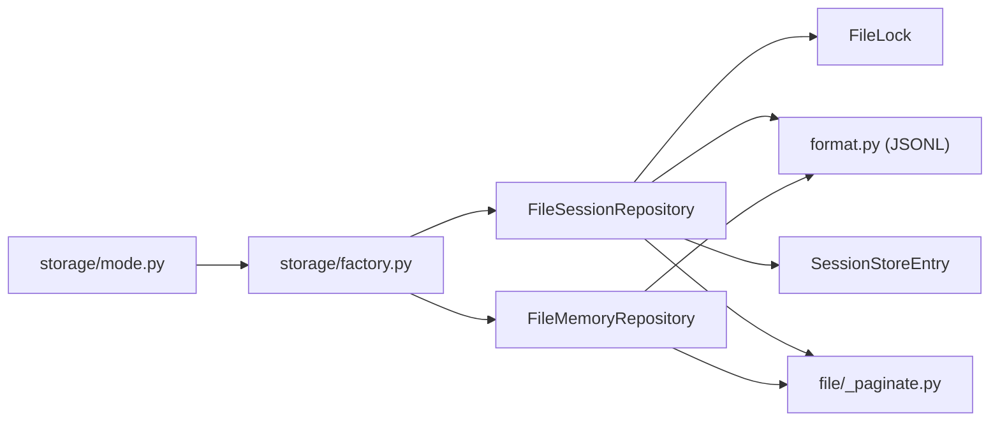

# File-Based Persistence

<cite>
**Referenced Files in This Document**
- [__init__.py](file://src/ark_agentic/core/storage/file/__init__.py)
- [memory.py](file://src/ark_agentic/core/storage/file/memory.py)
- [session.py](file://src/ark_agentic/core/storage/file/session.py)
- [_lock.py](file://src/ark_agentic/core/storage/file/_lock.py)
- [_paginate.py](file://src/ark_agentic/core/storage/file/_paginate.py)
- [format.py](file://src/ark_agentic/core/session/format.py)
- [entries.py](file://src/ark_agentic/core/storage/entries.py)
- [factory.py](file://src/ark_agentic/core/storage/factory.py)
- [mode.py](file://src/ark_agentic/core/storage/mode.py)
- [manager.py](file://src/ark_agentic/core/memory/manager.py)
- [memory.py (protocol)](file://src/ark_agentic/core/storage/protocols/memory.py)
- [session.py (protocol)](file://src/ark_agentic/core/storage/protocols/session.py)
- [test_file_memory.py](file://tests/unit/core/storage/test_file_memory.py)
- [test_file_session.py](file://tests/unit/core/storage/test_file_session.py)
</cite>

## Table of Contents
1. [Introduction](#introduction)
2. [Project Structure](#project-structure)
3. [Core Components](#core-components)
4. [Architecture Overview](#architecture-overview)
5. [Detailed Component Analysis](#detailed-component-analysis)
6. [Dependency Analysis](#dependency-analysis)
7. [Performance Considerations](#performance-considerations)
8. [Troubleshooting Guide](#troubleshooting-guide)
9. [Conclusion](#conclusion)
10. [Appendices](#appendices)

## Introduction
This document describes the file-based persistence implementation in Ark Agentic. It covers the file system storage architecture, directory and file naming conventions, memory storage for agent states and conversation contexts, session storage for conversation history, pagination utilities, and file-based indexing. It also documents the cross-platform async file lock mechanism, serialization formats, error handling strategies, performance considerations for large datasets, file system limitations, backup procedures, and practical examples of file operations.

## Project Structure
The file-based persistence is implemented under the core storage layer with dedicated modules for memory and session repositories, a cross-platform async file lock, and an in-memory pagination helper. The session format utilities and DTOs are shared with the SQLite backend to maintain consistent JSONL transcripts and metadata.

**Diagram sources**
- [__init__.py:1-15](file://src/ark_agentic/core/storage/file/__init__.py#L1-L15)
- [memory.py:1-171](file://src/ark_agentic/core/storage/file/memory.py#L1-L171)
- [session.py:1-371](file://src/ark_agentic/core/storage/file/session.py#L1-L371)
- [_lock.py:1-149](file://src/ark_agentic/core/storage/file/_lock.py#L1-L149)
- [_paginate.py:1-20](file://src/ark_agentic/core/storage/file/_paginate.py#L1-L20)
- [format.py:1-317](file://src/ark_agentic/core/session/format.py#L1-L317)
- [entries.py:1-62](file://src/ark_agentic/core/storage/entries.py#L1-L62)
- [factory.py:1-68](file://src/ark_agentic/core/storage/factory.py#L1-L68)
- [mode.py:1-32](file://src/ark_agentic/core/storage/mode.py#L1-L32)
- [manager.py:1-183](file://src/ark_agentic/core/memory/manager.py#L1-L183)
- [memory.py (protocol):1-56](file://src/ark_agentic/core/storage/protocols/memory.py#L1-L56)
- [session.py (protocol):1-194](file://src/ark_agentic/core/storage/protocols/session.py#L1-L194)

**Section sources**
- [__init__.py:1-15](file://src/ark_agentic/core/storage/file/__init__.py#L1-L15)
- [factory.py:1-68](file://src/ark_agentic/core/storage/factory.py#L1-L68)
- [mode.py:1-32](file://src/ark_agentic/core/storage/mode.py#L1-L32)

## Core Components
- FileMemoryRepository: file-backed memory repository for user profiles and dreams timestamps, with heading-level upsert and atomic overwrite.
- FileSessionRepository: file-backed session repository for transcripts and per-user metadata, with JSONL serialization, file locks, and pagination.
- FileLock: cross-platform async file lock supporting Windows and Unix.
- Pagination helper: in-memory slicing for list endpoints in file backend.
- Session format utilities: shared JSONL codecs and validation used by both file and SQLite backends.
- SessionStoreEntry: backend-neutral DTO for session metadata.

**Section sources**
- [memory.py:27-171](file://src/ark_agentic/core/storage/file/memory.py#L27-L171)
- [session.py:44-371](file://src/ark_agentic/core/storage/file/session.py#L44-L371)
- [_lock.py:26-149](file://src/ark_agentic/core/storage/file/_lock.py#L26-L149)
- [_paginate.py:15-20](file://src/ark_agentic/core/storage/file/_paginate.py#L15-L20)
- [format.py:29-317](file://src/ark_agentic/core/session/format.py#L29-L317)
- [entries.py:15-62](file://src/ark_agentic/core/storage/entries.py#L15-L62)

## Architecture Overview
The file backend is selected by the storage mode and built via factories. Memory operations are delegated to FileMemoryRepository through MemoryManager, while session operations are delegated to FileSessionRepository. Both repositories use async I/O and rely on file locks for concurrency control. JSONL transcripts and metadata are serialized consistently across backends.

**Diagram sources**
- [factory.py:30-67](file://src/ark_agentic/core/storage/factory.py#L30-L67)
- [session.py:105-121](file://src/ark_agentic/core/storage/file/session.py#L105-L121)
- [_lock.py:49-149](file://src/ark_agentic/core/storage/file/_lock.py#L49-L149)
- [memory.py:37-101](file://src/ark_agentic/core/storage/file/memory.py#L37-L101)

## Detailed Component Analysis

### FileMemoryRepository
- Directory structure: workspace/user_id/MEMORY.md for user memory, workspace/user_id/.last_dream for last consolidation timestamp.
- Operations:
  - read: returns memory content or empty string if missing.
  - upsert_headings: merges new headings into existing memory; deletes headings with empty bodies; returns current and dropped headings.
  - overwrite: atomic replacement using a temporary file then rename.
  - get_last_dream_at/set_last_dream_at: store/retrieve epoch timestamp for memory consolidation.
  - list_users: lists users with memory files, ordered by modified time.
- Concurrency: no explicit locking; uses atomic rename for overwrite.
- Error handling: missing files return defaults; corrupt last_dream returns None.

**Diagram sources**
- [memory.py:51-82](file://src/ark_agentic/core/storage/file/memory.py#L51-L82)

**Section sources**
- [memory.py:27-171](file://src/ark_agentic/core/storage/file/memory.py#L27-L171)
- [memory.py (protocol):8-56](file://src/ark_agentic/core/storage/protocols/memory.py#L8-L56)
- [manager.py:97-122](file://src/ark_agentic/core/memory/manager.py#L97-L122)
- [test_file_memory.py:24-134](file://tests/unit/core/storage/test_file_memory.py#L24-L134)

### FileSessionRepository
- Directory structure: sessions_dir/user_id/session_id.jsonl for transcripts, sessions_dir/user_id/sessions.json for per-user metadata, with .json.lock and .jsonl.lock for concurrency control.
- JSONL transcript format:
  - First line: SessionHeader with type "session", version, id, timestamp, cwd.
  - Subsequent lines: MessageEntry with type "message", message object, timestamp.
- Operations:
  - create: initializes transcript header and writes metadata entry.
  - append_message: ensures header, appends JSONL line with message; guarded by FileLock.
  - load_messages: reads and deserializes messages; supports pagination.
  - get_raw_transcript/put_raw_transcript: validates JSONL before write; atomic replacement.
  - update_meta/load_meta/list_session_ids/list_session_metas/list_all_sessions: metadata CRUD with TTL cache and pagination.
  - delete: removes transcript and associated lock; metadata is removed separately.
  - finalize: no-op for file backend.
- Concurrency: FileLock per session transcript and per user metadata file.
- Error handling: JSON decode errors skipped with warnings; validation raises structured exceptions; missing files return defaults.

**Diagram sources**
- [session.py:105-121](file://src/ark_agentic/core/storage/file/session.py#L105-L121)
- [format.py:183-210](file://src/ark_agentic/core/session/format.py#L183-L210)
- [_lock.py:49-149](file://src/ark_agentic/core/storage/file/_lock.py#L49-L149)

**Section sources**
- [session.py:44-371](file://src/ark_agentic/core/storage/file/session.py#L44-L371)
- [format.py:29-317](file://src/ark_agentic/core/session/format.py#L29-L317)
- [entries.py:15-62](file://src/ark_agentic/core/storage/entries.py#L15-L62)
- [session.py (protocol):17-194](file://src/ark_agentic/core/storage/protocols/session.py#L17-L194)
- [test_file_session.py:30-96](file://tests/unit/core/storage/test_file_session.py#L30-L96)

### FileLock (Cross-Platform Async File Lock)
- Platform differences:
  - Windows: uses file existence and write lock; periodically checks staleness and cleans stale locks.
  - Unix: uses O_EXCL creation for exclusive lock.
- Behavior:
  - acquire: retries until timeout or success; handles stale locks.
  - release: closes descriptors/handles and removes lock file.
  - context manager: __aenter__/__aexit__ raise on acquisition failure.
- Tunables: timeout, poll interval, and stale thresholds.

**Diagram sources**
- [_lock.py:49-120](file://src/ark_agentic/core/storage/file/_lock.py#L49-L120)

**Section sources**
- [_lock.py:26-149](file://src/ark_agentic/core/storage/file/_lock.py#L26-L149)

### Pagination Utilities
- In-memory pagination for file backend list endpoints; SQL backends push limit/offset to the database.
- Function signature: paginate(items, limit, offset) returns sliced list.

**Section sources**
- [_paginate.py:15-20](file://src/ark_agentic/core/storage/file/_paginate.py#L15-L20)
- [session.py:129-132](file://src/ark_agentic/core/storage/file/session.py#L129-L132)
- [session.py:188-190](file://src/ark_agentic/core/storage/file/session.py#L188-L190)
- [session.py:198-202](file://src/ark_agentic/core/storage/file/session.py#L198-L202)
- [session.py:210-210](file://src/ark_agentic/core/storage/file/session.py#L210-L210)

### Session Format and Metadata DTO
- JSONL codec and validation:
  - SessionHeader and MessageEntry dataclasses.
  - serialize_message/deserialize_message for AgentMessage.
  - parse_raw_jsonl validates transcript schema and returns parsed message lines.
  - RawJsonlValidationError indicates first violation with line number.
- SessionStoreEntry: backend-neutral DTO for per-session metadata.

**Section sources**
- [format.py:29-317](file://src/ark_agentic/core/session/format.py#L29-L317)
- [entries.py:15-62](file://src/ark_agentic/core/storage/entries.py#L15-L62)

### Integration with Memory Manager and Factories
- MemoryManager delegates to MemoryRepository and maintains an in-process cache of user memory content.
- Factories select the active storage mode (file/sqlite) and construct the appropriate repository instances.
- Mode resolution is environment-driven (DB_TYPE).

**Section sources**
- [manager.py:52-183](file://src/ark_agentic/core/memory/manager.py#L52-L183)
- [factory.py:30-67](file://src/ark_agentic/core/storage/factory.py#L30-L67)
- [mode.py:19-32](file://src/ark_agentic/core/storage/mode.py#L19-L32)

## Dependency Analysis
- FileSessionRepository depends on:
  - FileLock for concurrency control.
  - JSONL format utilities for serialization/validation.
  - SessionStoreEntry for metadata DTO.
  - Pagination helper for list endpoints.
- FileMemoryRepository depends on:
  - Heading parsing/formatting utilities (via user profile integration).
  - Pagination helper for list endpoints.
- Cross-cutting concerns:
  - Storage mode selection drives backend choice.
  - Protocols define the interface contracts for repositories.

**Diagram sources**
- [session.py:32-35](file://src/ark_agentic/core/storage/file/session.py#L32-L35)
- [memory.py:15-19](file://src/ark_agentic/core/storage/file/memory.py#L15-L19)
- [entries.py:15-62](file://src/ark_agentic/core/storage/entries.py#L15-L62)
- [_paginate.py:15-20](file://src/ark_agentic/core/storage/file/_paginate.py#L15-L20)
- [factory.py:30-67](file://src/ark_agentic/core/storage/factory.py#L30-L67)
- [mode.py:19-32](file://src/ark_agentic/core/storage/mode.py#L19-L32)

**Section sources**
- [session.py:32-35](file://src/ark_agentic/core/storage/file/session.py#L32-L35)
- [memory.py:15-19](file://src/ark_agentic/core/storage/file/memory.py#L15-L19)
- [factory.py:30-67](file://src/ark_agentic/core/storage/factory.py#L30-L67)
- [mode.py:19-32](file://src/ark_agentic/core/storage/mode.py#L19-L32)

## Performance Considerations
- File I/O characteristics:
  - Memory operations use atomic rename for overwrite to avoid partial writes.
  - Session transcript appends are line-based JSONL; ensure trailing newline to prevent torn-tail corruption.
  - Metadata is cached per user with a TTL to reduce repeated reads.
- Concurrency:
  - FileLock prevents concurrent modifications to the same session or metadata file.
  - Lock timeouts and stale lock detection mitigate deadlocks.
- Pagination:
  - File backend materializes full lists in memory and slices them; prefer pagination with limit/offset to avoid loading large datasets.
- Large datasets:
  - Consider log rotation or external archival for long-lived sessions.
  - Monitor filesystem limits (inodes, disk space) and implement monitoring/alerts.
- Backup procedures:
  - Regular snapshots of sessions_dir and workspace directories.
  - Validate backups by restoring to a staging environment and verifying JSONL integrity and metadata consistency.

[No sources needed since this section provides general guidance]

## Troubleshooting Guide
- JSONL validation failures:
  - parse_raw_jsonl raises RawJsonlValidationError with line number; inspect the offending line and fix schema.
- Corrupted or missing files:
  - Missing MEMORY.md returns empty content; missing sessions.json returns empty cache; missing .last_dream returns None.
  - Invalid JSONL lines are skipped with warnings during load_messages.
- Lock acquisition failures:
  - Timeouts indicate contention or stale locks; check lock files and process health.
  - On Windows, stale locks are auto-cleaned after exceeding stale threshold.
- Atomic overwrite issues:
  - Ensure filesystem supports rename; verify permissions and disk space.

**Section sources**
- [format.py:212-268](file://src/ark_agentic/core/session/format.py#L212-L268)
- [session.py:243-264](file://src/ark_agentic/core/storage/file/session.py#L243-L264)
- [_lock.py:49-120](file://src/ark_agentic/core/storage/file/_lock.py#L49-L120)
- [memory.py:87-101](file://src/ark_agentic/core/storage/file/memory.py#L87-L101)

## Conclusion
The file-based persistence layer in Ark Agentic provides a robust, cross-platform solution for memory and session storage. It uses atomic file operations, JSONL transcripts, and a cross-platform async file lock to ensure data integrity and handle concurrency. The design cleanly separates concerns through protocols, factories, and a storage mode, enabling easy backend switching and consistent behavior across environments.

[No sources needed since this section summarizes without analyzing specific files]

## Appendices

### Practical Examples (by file reference)
- Memory upsert and overwrite:
  - [memory.py:44-101](file://src/ark_agentic/core/storage/file/memory.py#L44-L101)
- Session append and load:
  - [session.py:105-132](file://src/ark_agentic/core/storage/file/session.py#L105-L132)
- Raw transcript validation and write:
  - [session.py:143-162](file://src/ark_agentic/core/storage/file/session.py#L143-L162)
  - [format.py:212-268](file://src/ark_agentic/core/session/format.py#L212-L268)
- Metadata CRUD with locks:
  - [session.py:339-361](file://src/ark_agentic/core/storage/file/session.py#L339-L361)
- Lock acquisition and release:
  - [_lock.py:49-149](file://src/ark_agentic/core/storage/file/_lock.py#L49-L149)
- Pagination:
  - [_paginate.py:15-20](file://src/ark_agentic/core/storage/file/_paginate.py#L15-L20)
- Tests demonstrating behavior:
  - [test_file_memory.py:28-134](file://tests/unit/core/storage/test_file_memory.py#L28-L134)
  - [test_file_session.py:34-96](file://tests/unit/core/storage/test_file_session.py#L34-L96)